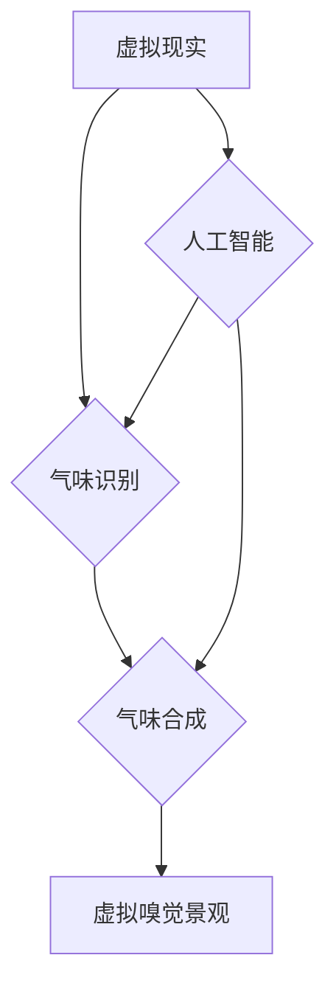

                 

## 虚拟嗅觉景观师：AI构建的气味世界设计师

> 关键词：人工智能、虚拟现实、嗅觉、气味识别、气味合成、神经网络、机器学习、交互设计

## 1. 背景介绍

人类感知世界的方式是多方面的，其中视觉、听觉、触觉、味觉和嗅觉占据着重要地位。然而，在虚拟现实 (VR) 和增强现实 (AR) 等数字交互领域，我们主要依靠视觉和听觉来构建沉浸式的体验。嗅觉，作为一种强大的感官，却一直被忽视。

嗅觉能够唤起强烈的记忆和情感，对我们的情绪、行为和认知产生深远的影响。想象一下，身处一个虚拟森林，能够闻到泥土的芬芳、树叶的清香和鸟儿的叫声，这将使体验更加真实和生动。

然而，模拟气味在技术上面临着巨大的挑战。与视觉和听觉相比，气味更复杂，难以捕捉和重现。传统的模拟气味方法，例如使用喷雾或气味芯片，存在着成本高、精度低、气味持久性差等问题。

近年来，人工智能 (AI) 技术的快速发展为构建虚拟嗅觉景观带来了新的可能性。通过机器学习和神经网络，我们可以训练模型识别和合成各种气味，并将其与虚拟环境相结合，创造出更加沉浸式的体验。

## 2. 核心概念与联系

### 2.1 虚拟嗅觉景观

虚拟嗅觉景观是指利用人工智能技术模拟和重现气味，并将其与虚拟环境相结合，创造出沉浸式的嗅觉体验。

### 2.2 气味识别与合成

气味识别是指利用传感器和机器学习算法识别气味分子，并将其转换为数字信号。气味合成是指利用化学物质或声波等技术，根据数字信号生成特定的气味。

### 2.3 人工智能与嗅觉

人工智能技术，特别是机器学习和深度学习，为气味识别和合成提供了强大的工具。通过训练模型识别气味分子和合成气味，我们可以构建更加精准和逼真的虚拟嗅觉景观。

**核心概念架构图**



## 3. 核心算法原理 & 具体操作步骤

### 3.1 算法原理概述

虚拟嗅觉景观的设计主要依赖于气味识别和气味合成算法。

**气味识别算法**通常基于电子鼻技术，利用传感器阵列检测气味分子，并通过机器学习算法将其转换为数字信号。常见的算法包括：

* **主成分分析 (PCA)**：用于降维，提取气味特征。
* **支持向量机 (SVM)**：用于分类，识别不同的气味。
* **深度神经网络 (DNN)**：用于更复杂的识别任务，例如气味强度和成分的识别。

**气味合成算法**则利用化学物质或声波等技术，根据数字信号生成特定的气味。常见的算法包括：

* **混合气体合成**：通过混合不同气体成分，合成特定的气味。
* **声波气味合成**：利用声波振动，刺激嗅觉神经，产生气味。

### 3.2 算法步骤详解

**气味识别算法步骤：**

1. **数据采集**: 使用电子鼻收集不同气味的样本数据。
2. **数据预处理**: 对采集到的数据进行清洗、去噪和特征提取。
3. **模型训练**: 使用机器学习算法，训练气味识别模型。
4. **模型评估**: 使用测试数据评估模型的识别精度。
5. **模型部署**: 将训练好的模型部署到实际应用场景中。

**气味合成算法步骤：**

1. **气味描述**: 将目标气味描述为数字信号，例如气味成分和强度。
2. **合成方案选择**: 根据气味描述，选择合适的合成方案，例如混合气体合成或声波气味合成。
3. **合成设备控制**: 控制合成设备，根据数字信号生成目标气味。
4. **气味输出**: 将生成的氣味输出到虚拟环境中。

### 3.3 算法优缺点

**气味识别算法:**

* **优点**: 识别精度高，能够识别复杂的气味。
* **缺点**: 硬件成本高，数据采集和处理复杂。

**气味合成算法:**

* **优点**: 可以合成多种气味，控制气味强度和持续时间。
* **缺点**: 合成的气味可能无法完全还原真实气味，成本相对较高。

### 3.4 算法应用领域

* **虚拟现实和增强现实**: 构建更加沉浸式的虚拟体验。
* **游戏**: 增强游戏体验，例如模拟游戏场景的气味。
* **教育**: 帮助学生理解气味和化学物质。
* **医疗**: 用于疾病诊断和治疗。
* **食品和饮料**: 用于气味分析和产品开发。

## 4. 数学模型和公式 & 详细讲解 & 举例说明

### 4.1 数学模型构建

气味识别和合成算法通常基于数学模型，例如线性回归、逻辑回归、支持向量机等。这些模型可以将气味特征和气味成分之间的关系建模为数学方程，从而实现气味识别和合成。

### 4.2 公式推导过程

例如，使用线性回归模型识别气味，可以将气味特征作为输入变量，气味类别作为输出变量，并通过最小二乘法推导出回归方程。

$$
y = \beta_0 + \beta_1x_1 + \beta_2x_2 + ... + \beta_nx_n + \epsilon
$$

其中：

* $y$：气味类别
* $x_1, x_2, ..., x_n$：气味特征
* $\beta_0, \beta_1, \beta_2, ..., \beta_n$：回归系数
* $\epsilon$：误差项

### 4.3 案例分析与讲解

假设我们使用线性回归模型识别三种气味：花香、水果香和咖啡香。我们收集了不同气味的样本数据，并提取了气味特征，例如气味强度、气味成分等。通过训练模型，我们可以得到回归系数，并使用这些系数预测新的气味类别。

例如，如果一个新的气味样本的气味强度为5，气味成分为A和B，我们可以将这些值代入回归方程，预测其类别。

## 5. 项目实践：代码实例和详细解释说明

### 5.1 开发环境搭建

为了实现虚拟嗅觉景观，我们需要搭建一个开发环境，包括硬件和软件。

* **硬件**: 电子鼻、气味合成设备、计算机。
* **软件**: Python、TensorFlow、PyTorch等机器学习框架、虚拟现实平台。

### 5.2 源代码详细实现

以下是一个简单的气味识别代码示例，使用Python和TensorFlow框架：

```python
import tensorflow as tf

# 定义模型结构
model = tf.keras.models.Sequential([
  tf.keras.layers.Dense(64, activation='relu', input_shape=(10,)),
  tf.keras.layers.Dense(32, activation='relu'),
  tf.keras.layers.Dense(3, activation='softmax')
])

# 编译模型
model.compile(optimizer='adam',
              loss='sparse_categorical_crossentropy',
              metrics=['accuracy'])

# 训练模型
model.fit(X_train, y_train, epochs=10)

# 预测气味类别
predictions = model.predict(X_test)
```

### 5.3 代码解读与分析

* **模型结构**: 该代码定义了一个简单的多层感知机模型，包含三个全连接层。
* **激活函数**: 使用ReLU激活函数，可以提高模型的表达能力。
* **损失函数**: 使用稀疏类别交叉熵损失函数，适合多分类问题。
* **优化器**: 使用Adam优化器，可以加速模型训练。
* **训练过程**: 使用训练数据训练模型，并设置训练轮数。
* **预测过程**: 使用测试数据预测气味类别。

### 5.4 运行结果展示

训练完成后，我们可以评估模型的性能，例如准确率、召回率等。

## 6. 实际应用场景

### 6.1 虚拟旅游

在虚拟旅游中，我们可以模拟不同地点的气味，例如海滩的咸味、森林的清香、城市的喧嚣等，使游客更加沉浸地体验虚拟世界。

### 6.2 虚拟游戏

在虚拟游戏中，我们可以使用气味来增强游戏体验，例如模拟战斗场景的气味、探索场景的气味、角色的情绪等。

### 6.3 医疗保健

在医疗保健领域，我们可以使用气味来辅助疾病诊断和治疗，例如识别疾病特有的气味、模拟药物的气味等。

### 6.4 未来应用展望

随着人工智能和传感器技术的不断发展，虚拟嗅觉景观将在更多领域得到应用，例如：

* **教育**: 帮助学生理解气味和化学物质。
* **食品和饮料**: 用于气味分析和产品开发。
* **艺术**: 创作新的艺术形式，例如气味装置。

## 7. 工具和资源推荐

### 7.1 学习资源推荐

* **书籍**:
    * "Artificial Intelligence: A Modern Approach" by Stuart Russell and Peter Norvig
    * "Deep Learning" by Ian Goodfellow, Yoshua Bengio, and Aaron Courville
* **在线课程**:
    * Coursera: Machine Learning by Andrew Ng
    * Udacity: Deep Learning Nanodegree

### 7.2 开发工具推荐

* **Python**: 广泛使用的编程语言，用于机器学习和人工智能开发。
* **TensorFlow**: 开源机器学习框架，用于构建和训练深度学习模型。
* **PyTorch**: 开源机器学习框架，用于构建和训练深度学习模型。
* **OpenCV**: 图像处理库，用于处理电子鼻采集的图像数据。

### 7.3 相关论文推荐

* "Electronic Nose for Gas Sensing" by J. Janata
* "Deep Learning for Gas Sensing" by S. Wang et al.
* "Virtual Olfaction: A Review" by J. R. Smith et al.

## 8. 总结：未来发展趋势与挑战

### 8.1 研究成果总结

虚拟嗅觉景观的设计是一个跨学科的研究领域，涉及人工智能、传感器技术、化学工程等多个领域。近年来，在气味识别和合成算法、电子鼻技术、虚拟现实平台等方面取得了显著进展，为构建更加逼真的虚拟嗅觉体验奠定了基础。

### 8.2 未来发展趋势

未来，虚拟嗅觉景观的发展趋势包括：

* **更精准的气味识别和合成**: 通过改进算法和硬件技术，实现更精准的气味识别和合成。
* **更丰富的虚拟嗅觉体验**: 开发更复杂的虚拟嗅觉场景，例如模拟不同季节、不同地点的气味。
* **更广泛的应用场景**: 将虚拟嗅觉景观应用到更多领域，例如教育、医疗、艺术等。

### 8.3 面临的挑战

虚拟嗅觉景观的发展还面临着一些挑战：

* **气味数据的获取和标注**: 气味数据难以获取和标注，这限制了算法的训练和性能。
* **气味合成技术的复杂性**: 气味合成技术复杂，成本较高，需要进一步的改进和优化。
* **用户体验的设计**: 如何设计更加自然、舒适的用户体验，是虚拟嗅觉景观发展的重要课题。

### 8.4 研究展望

未来，我们将继续致力于虚拟嗅觉景观的研究，探索更先进的算法、更精准的传感器技术、更丰富的虚拟嗅觉体验，并将其应用到更多领域，为人类创造更加沉浸式的数字世界。

## 9. 附录：常见问题与解答

**Q1: 虚拟嗅觉景观的成本高吗？**

A1: 虚拟嗅觉景观的成本取决于具体的应用场景和技术方案。目前，气味合成设备和电子鼻的成本相对较高，但随着技术的进步，成本将会逐渐降低。

**Q2: 虚拟嗅觉景观的安全性如何？**

A2: 虚拟嗅觉景观的安全性取决于气味合成设备和电子鼻的安全性。目前，一些气味合成设备和电子鼻使用的是安全的化学物质和材料，可以保证用户的安全。

**Q3: 虚拟嗅觉景观的未来发展前景如何？**

A3: 虚拟嗅觉景观的发展前景非常广阔。随着人工智能和传感器技术的不断发展，虚拟嗅觉景观将应用到更多领域，为人类创造更加沉浸式的数字体验。


作者：禅与计算机程序设计艺术 / Zen and the Art of Computer Programming 
<end_of_turn>

