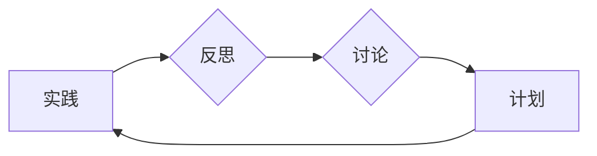
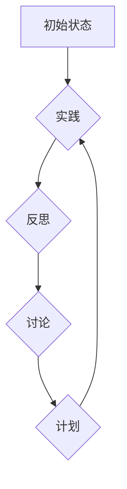

                 

## 行动中学习：管理者的成长之道

> 关键词：管理者成长、行动学习、实践经验、迭代改进、团队协作、技术领导、技术决策、持续学习

### 1. 背景介绍

在瞬息万变的科技时代，管理者面临着前所未有的挑战。技术迭代速度飞快，市场需求不断变化，团队成员的技能和期望也随之演变。传统的管理模式和知识体系难以适应这种快速变化的环境，因此，管理者需要不断学习和成长，才能带领团队取得成功。

行动学习是一种以实践为基础的学习方法，强调通过行动、反思、讨论和计划，不断积累经验和提升能力。它强调学习是一个循环的过程，通过不断的实践和反思，不断完善自己的认知和技能。

对于IT领域的管理者来说，行动学习尤为重要。IT行业的技术发展速度极快，管理者需要具备敏锐的洞察力和快速学习的能力，才能跟上时代的步伐。行动学习可以帮助IT管理者：

* **快速掌握新技术：** 通过实践操作，快速理解新技术的原理和应用场景。
* **提升解决问题的能力：** 在实践中遇到问题，通过反思和讨论，找到解决问题的最佳方案。
* **增强团队协作能力：** 通过共同参与行动学习项目，促进团队成员之间的沟通和协作。
* **培养领导力：** 通过实践和反思，提升自己的决策能力、沟通能力和团队管理能力。

### 2. 核心概念与联系

行动学习的核心概念包括：

* **实践：** 行动学习的核心是实践，通过实际操作来学习和理解知识。
* **反思：** 在实践过程中，需要不断反思自己的行动，分析成功和失败的原因，从中吸取经验教训。
* **讨论：** 与他人分享自己的经验和反思，通过讨论和交流，获得新的 insights 和 perspectives。
* **计划：** 基于反思和讨论的结果，制定新的行动计划，不断改进和优化自己的行为。

**Mermaid 流程图**



### 3. 核心算法原理 & 具体操作步骤

#### 3.1  算法原理概述

行动学习算法的核心原理是通过循环的实践、反思、讨论和计划，不断迭代改进，最终达到目标。

#### 3.2  算法步骤详解

1. **设定目标：** 明确行动学习的目标，例如学习新技术、解决特定问题、提升团队协作能力等。
2. **设计实验：** 根据目标，设计一个具体的实践实验，例如尝试使用新技术开发一个项目、组织团队进行一次模拟演练等。
3. **进行实践：** 按照实验设计，进行实际操作，收集数据和观察结果。
4. **反思总结：** 回顾实践过程，分析成功和失败的原因，总结经验教训。
5. **讨论交流：** 与团队成员或其他专家进行讨论，分享经验和 insights，获得新的 perspectives。
6. **制定计划：** 基于反思和讨论的结果，制定新的行动计划，改进实验设计或调整实践方法。
7. **重复循环：** 重复上述步骤，不断迭代改进，直到达到目标。

#### 3.3  算法优缺点

**优点：**

* **实践性强：** 通过实践操作，快速掌握知识和技能。
* **效果显著：** 能够有效解决实际问题，提升团队绩效。
* **持续改进：** 通过不断的反思和迭代，不断优化自己的行为和决策。

**缺点：**

* **时间成本高：** 行动学习需要投入大量的时间和精力。
* **风险较高：** 实践过程中可能会遇到失败，需要承担一定的风险。
* **需要团队协作：** 行动学习需要团队成员的共同参与和支持。

#### 3.4  算法应用领域

行动学习适用于各种领域，尤其是在需要快速学习和适应变化的环境中，例如：

* **IT行业：** 学习新技术、解决技术问题、提升团队协作能力。
* **管理咨询：** 帮助企业解决实际问题、提升管理效率。
* **教育培训：** 帮助学生掌握知识和技能，培养实践能力。

### 4. 数学模型和公式 & 详细讲解 & 举例说明

行动学习的数学模型可以抽象为一个迭代循环过程，其中每个循环包含实践、反思、讨论和计划四个阶段。

**4.1  数学模型构建**

我们可以用一个状态转移图来表示行动学习的数学模型：



其中：

* A：初始状态，代表管理者开始行动学习的过程。
* B：实践阶段，管理者进行实际操作，收集数据和观察结果。
* C：反思阶段，管理者分析实践过程，总结经验教训。
* D：讨论阶段，管理者与他人分享经验和 insights，获得新的 perspectives。
* E：计划阶段，管理者制定新的行动计划，改进实验设计或调整实践方法。

**4.2  公式推导过程**

我们可以用一个简单的公式来描述行动学习的迭代过程：

$$S_{n+1} = f(S_n, D_n, I_n)$$

其中：

* $S_n$：第n个循环的状态，包括管理者的知识、技能、经验等。
* $D_n$：第n个循环的实践数据，包括收集到的信息、观察到的结果等。
* $I_n$：第n个循环的讨论结果，包括获得的新 insights 和 perspectives。
* $f$：状态转移函数，描述了实践、反思、讨论和计划四个阶段如何影响管理者的状态。

**4.3  案例分析与讲解**

例如，一个IT管理者想要学习新的云计算技术。他可以按照行动学习的步骤进行实践：

1. **设定目标：** 学习云计算基础知识和应用场景。
2. **设计实验：** 在云平台上搭建一个简单的应用系统。
3. **进行实践：** 按照实验设计，在云平台上进行操作，学习云计算服务的配置和使用。
4. **反思总结：** 回顾实践过程，分析遇到的问题和挑战，总结经验教训。
5. **讨论交流：** 与其他云计算专家进行讨论，分享经验和 insights，获得新的 perspectives。
6. **制定计划：** 基于反思和讨论的结果，制定新的行动计划，例如学习更高级的云计算技术或参与更复杂的项目。

通过不断的实践、反思、讨论和计划，这个IT管理者可以逐步掌握云计算技术，并将其应用到实际工作中。

### 5. 项目实践：代码实例和详细解释说明

#### 5.1  开发环境搭建

为了演示行动学习的实践，我们可以创建一个简单的项目，例如一个在线学习平台。

开发环境搭建包括：

* **操作系统：** Linux 或 macOS
* **编程语言：** Python 或 JavaScript
* **框架：** Django 或 React
* **数据库：** MySQL 或 PostgreSQL

#### 5.2  源代码详细实现

以下是一个使用 Python 和 Django 实现在线学习平台的简单代码示例：

```python
# models.py
from django.db import models

class Course(models.Model):
    name = models.CharField(max_length=255)
    description = models.TextField()

class Lesson(models.Model):
    course = models.ForeignKey(Course, on_delete=models.CASCADE)
    title = models.CharField(max_length=255)
    content = models.TextField()
```

#### 5.3  代码解读与分析

* **models.py:** 定义了课程和课程内容的模型。
* **views.py:** 定义了课程列表、课程详情等视图函数。
* **templates:** 定义了课程列表、课程详情等页面模板。

#### 5.4  运行结果展示

运行代码后，可以访问在线学习平台，查看课程列表和课程详情。

### 6. 实际应用场景

行动学习可以应用于各种IT管理者的实际工作场景，例如：

* **技术决策：** 在选择新技术或工具时，可以通过行动学习的方式进行实验和测试，评估其优缺点，做出更明智的决策。
* **团队协作：** 通过行动学习，可以帮助团队成员更好地理解彼此的工作方式，提高团队协作效率。
* **人才培养：** 可以利用行动学习的方式，帮助员工快速掌握新技能，提升工作能力。

### 6. 实际应用场景

#### 6.1  技术决策

例如，一个IT管理者需要选择一种新的云计算平台，他可以利用行动学习的方式进行实践：

1. **设定目标：** 选择最适合公司需求的云计算平台。
2. **设计实验：** 在两个不同的云计算平台上搭建一个简单的应用系统，并进行性能测试和成本分析。
3. **进行实践：** 按照实验设计，在两个云计算平台上进行操作，收集数据和观察结果。
4. **反思总结：** 回顾实践过程，分析两个平台的优缺点，总结经验教训。
5. **讨论交流：** 与其他技术专家进行讨论，分享经验和 insights，获得新的 perspectives。
6. **制定计划：** 基于反思和讨论的结果，选择最适合公司需求的云计算平台。

#### 6.2  团队协作

例如，一个IT团队需要开发一个新的软件产品，他们可以利用行动学习的方式进行协作：

1. **设定目标：** 开发一个功能完善、易于使用的软件产品。
2. **设计实验：** 将软件开发过程分成多个阶段，每个阶段都进行一次迭代开发和测试。
3. **进行实践：** 按照实验设计，团队成员进行协作开发，并进行代码审查和测试。
4. **反思总结：** 回顾每个阶段的开发过程，分析遇到的问题和挑战，总结经验教训。
5. **讨论交流：** 团队成员进行讨论，分享经验和 insights，共同改进开发流程。
6. **制定计划：** 基于反思和讨论的结果，制定下一个迭代开发计划。

#### 6.3  人才培养

例如，一个IT公司需要培养员工的云计算技能，他们可以利用行动学习的方式进行培训：

1. **设定目标：** 帮助员工掌握云计算基础知识和应用技能。
2. **设计实验：** 设计一些实践性的云计算项目，例如在云平台上搭建一个简单的应用系统。
3. **进行实践：** 员工进行实践操作，学习云计算服务的配置和使用。
4. **反思总结：** 员工回顾实践过程，分析遇到的问题和挑战，总结经验教训。
5. **讨论交流：** 员工与培训师和同事进行讨论，分享经验和 insights，共同学习和进步。
6. **制定计划：** 基于反思和讨论的结果，制定后续培训计划，帮助员工掌握更高级的云计算技术。

### 7. 工具和资源推荐

#### 7.1  学习资源推荐

* **书籍：**
    * 《行动学习：管理者的成长之道》
    * 《学习型组织》
    * 《敏捷软件开发》
* **网站：**
    * https://www.actionlearning.org/
    * https://www.agilealliance.org/

#### 7.2  开发工具推荐

* **编程语言：** Python, Java, JavaScript
* **框架：** Django, React, Spring Boot
* **数据库：** MySQL, PostgreSQL, MongoDB

#### 7.3  相关论文推荐

* 《行动学习：理论、实践和未来方向》
* 《敏捷软件开发中的行动学习》
* 《行动学习在教育中的应用》

### 8. 总结：未来发展趋势与挑战

#### 8.1  研究成果总结

行动学习是一种有效的学习方法，可以帮助IT管理者快速掌握新技术、解决实际问题、提升团队协作能力。

#### 8.2  未来发展趋势

未来，行动学习将会更加注重：

* **数据驱动：** 利用数据分析和机器学习，提高行动学习的效率和效果。
* **虚拟现实和增强现实：** 利用虚拟现实和增强现实技术，创造更沉浸式的学习体验。
* **个性化学习：** 根据个人的学习风格和需求，定制个性化的行动学习方案。

#### 8.3  面临的挑战

行动学习也面临一些挑战，例如：

* **时间成本高：** 行动学习需要投入大量的时间和精力。
* **需要团队协作：** 行动学习需要团队成员的共同参与和支持。
* **评估难：** 行动学习的效果难以量化评估。

#### 8.4  研究展望

未来，需要进一步研究行动学习的理论基础、实践方法和评估指标，使其更加有效、高效和可持续。

### 9. 附录：常见问题与解答

**Q1：行动学习适合哪些人？**

A1：行动学习适合所有希望快速学习和提升能力的人，特别是IT管理者、技术人员和创业者。

**Q2：行动学习需要哪些条件？**

A2：行动学习需要以下条件：

* **明确的目标：** 需要明确学习的目标，才能设计有效的实验和计划。
* **实践的机会：** 需要有实践操作的机会，才能真正掌握知识和技能。
* **反思和讨论的机制：** 需要有反思和讨论的机制，才能不断改进和优化自己的行为。

**Q3：行动学习的优势是什么？**

A3：行动学习的优势包括：

* **实践性强：** 通过实践操作，快速掌握知识和技能。
* **效果显著：** 能够有效解决实际问题，提升团队绩效。
* **持续改进：** 通过不断的反思和迭代，不断优化自己的行为和决策。


作者：禅与计算机程序设计艺术 / Zen and the Art of Computer Programming 
<end_of_turn>

