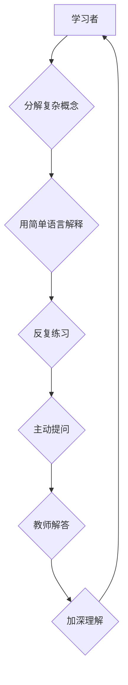

                 

## 费曼学习法在AI教育中的应用

> 关键词：费曼学习法、AI教育、知识理解、教学方法、学习策略、概念清晰、循序渐进、主动学习

## 1. 背景介绍

人工智能（AI）正以惊人的速度发展，其应用领域不断拓展，对人才的需求也日益增长。然而，AI领域知识体系庞大复杂，学习门槛较高，传统的教学方法难以有效满足学习者的需求。如何提高AI教育的效率和质量，激发学习者的学习兴趣和主动性，成为摆在教育工作者面前的重要课题。

费曼学习法是一种以“教别人”为核心的学习方法，其核心思想是将复杂的概念分解成易于理解的片段，并通过反复解释、提问和练习，帮助学习者深入理解和掌握知识。这种方法强调主动学习、概念清晰和循序渐进，与AI教育的需要高度契合。

## 2. 核心概念与联系

费曼学习法的核心概念包括：

* **分解复杂概念:** 将复杂的概念分解成更小的、易于理解的片段。
* **用简单语言解释:** 使用通俗易懂的语言解释概念，避免使用专业术语或过于复杂的表达。
* **反复练习:** 通过反复练习，帮助学习者巩固理解和掌握知识。
* **主动提问:** 鼓励学习者主动提问，并通过回答问题来加深理解。
* **教学与学习的互动:** 教师和学生之间进行互动，共同探索知识。

**费曼学习法与AI教育的联系:**

费曼学习法强调概念清晰、循序渐进，这与AI教育的需要高度契合。AI领域知识体系庞大复杂，学习者需要逐步深入理解各个概念和原理。费曼学习法可以帮助学习者将复杂的概念分解成易于理解的片段，并通过反复练习和提问，加深对知识的理解和掌握。

**Mermaid 流程图:**



## 3. 核心算法原理 & 具体操作步骤

### 3.1  算法原理概述

费曼学习法本身不是一个具体的算法，而是一种教学方法。它强调通过教学和学习的互动，帮助学习者理解和掌握知识。

### 3.2  算法步骤详解

1. **分解复杂概念:** 将需要学习的概念分解成更小的、易于理解的片段。
2. **用简单语言解释:** 使用通俗易懂的语言解释每个片段的概念，避免使用专业术语或过于复杂的表达。
3. **反复练习:** 通过反复练习，帮助学习者巩固理解和掌握知识。练习可以包括：
    * 回答问题
    * 解释概念
    * 应用概念解决问题
4. **主动提问:** 鼓励学习者主动提问，并通过回答问题来加深理解。
5. **教师解答:** 教师根据学习者的提问，提供清晰、准确的解答，并引导学习者进行深入思考。

### 3.3  算法优缺点

**优点:**

* 强调概念清晰、循序渐进，适合AI领域知识体系庞大复杂的特点。
* 鼓励主动学习，提高学习者的学习兴趣和参与度。
* 通过教学和学习的互动，帮助学习者加深理解和掌握知识。

**缺点:**

* 需要教师具备较高的教学能力和经验。
* 需要投入较多的时间和精力进行教学和学习。

### 3.4  算法应用领域

费曼学习法适用于各种教学场景，尤其适合于：

* 复杂概念的教学
* 需要深入理解的知识领域
* 鼓励主动学习的教学环境

在AI教育中，费曼学习法可以应用于：

* 机器学习算法的讲解
* 深度学习模型的构建
* AI应用场景的分析

## 4. 数学模型和公式 & 详细讲解 & 举例说明

费曼学习法本身并不依赖于特定的数学模型和公式。它是一种教学方法，其核心在于如何将复杂的概念分解、解释和练习。

然而，在AI教育中，许多算法和模型都基于数学原理。例如，线性回归模型的数学公式如下：

$$
y = \theta_0 + \theta_1x_1 + \theta_2x_2 + ... + \theta_nx_n + \epsilon
$$

其中：

* $y$ 是预测值
* $\theta_0, \theta_1, ..., \theta_n$ 是模型参数
* $x_1, x_2, ..., x_n$ 是输入特征
* $\epsilon$ 是误差项

通过费曼学习法，可以将这个公式分解成更小的片段，例如：

* 解释每个变量的含义
* 说明参数如何影响预测值
* 展示如何使用梯度下降算法优化参数

然后，通过反复练习和提问，帮助学习者理解这个公式的含义和应用。

## 5. 项目实践：代码实例和详细解释说明

### 5.1  开发环境搭建

为了演示费曼学习法在AI教育中的应用，我们可以使用Python语言和Scikit-learn库构建一个简单的线性回归模型。

需要安装Python和Scikit-learn库。

### 5.2  源代码详细实现

```python
import numpy as np
from sklearn.linear_model import LinearRegression
from sklearn.model_selection import train_test_split

# 生成示例数据
X = np.array([[1], [2], [3], [4], [5]])
y = np.array([2, 4, 5, 4, 5])

# 将数据分成训练集和测试集
X_train, X_test, y_train, y_test = train_test_split(X, y, test_size=0.2, random_state=42)

# 创建线性回归模型
model = LinearRegression()

# 训练模型
model.fit(X_train, y_train)

# 预测测试集数据
y_pred = model.predict(X_test)

# 打印模型参数
print("模型参数:", model.coef_)
print("截距:", model.intercept_)

# 打印预测结果
print("预测结果:", y_pred)
```

### 5.3  代码解读与分析

这段代码首先生成了一些示例数据，然后将数据分成训练集和测试集。接着，创建了一个线性回归模型，并使用训练集数据训练模型。最后，使用训练好的模型预测测试集数据，并打印模型参数和预测结果。

### 5.4  运行结果展示

运行这段代码后，会输出模型参数和预测结果。

## 6. 实际应用场景

费曼学习法在AI教育中的应用场景非常广泛，例如：

* **机器学习算法讲解:** 可以将复杂的机器学习算法分解成更小的步骤，并使用通俗易懂的语言进行解释，帮助学习者理解算法的原理和流程。
* **深度学习模型构建:** 可以将深度学习模型的构建过程分解成多个步骤，例如数据预处理、模型选择、参数调整等，并通过实践操作，帮助学习者掌握模型构建的技巧。
* **AI应用场景分析:** 可以将AI应用场景分解成不同的模块，例如数据获取、模型训练、结果评估等，并通过案例分析，帮助学习者理解AI应用的流程和挑战。

## 7. 工具和资源推荐

### 7.1  学习资源推荐

* **在线课程:** Coursera、edX、Udacity等平台提供丰富的AI课程，涵盖机器学习、深度学习、自然语言处理等多个领域。
* **书籍:** 《深入理解机器学习》、《深度学习》、《人工智能：现代方法》等书籍是学习AI的经典教材。
* **博客和论坛:** 许多AI领域的专家和学者在博客和论坛上分享他们的学习经验和研究成果。

### 7.2  开发工具推荐

* **Python:** Python是AI开发最常用的编程语言，拥有丰富的AI库和工具。
* **Scikit-learn:** Scikit-learn是Python最流行的机器学习库，提供各种算法和工具。
* **TensorFlow:** TensorFlow是Google开发的开源深度学习框架，支持多种硬件平台。
* **PyTorch:** PyTorch是Facebook开发的开源深度学习框架，以其灵活性和易用性而闻名。

### 7.3  相关论文推荐

* **《机器学习》** by Tom Mitchell
* **《深度学习》** by Ian Goodfellow, Yoshua Bengio, and Aaron Courville
* **《人工智能：现代方法》** by Stuart Russell and Peter Norvig

## 8. 总结：未来发展趋势与挑战

### 8.1  研究成果总结

费曼学习法是一种有效的教学方法，可以帮助学习者理解和掌握AI领域的知识。

### 8.2  未来发展趋势

随着AI技术的不断发展，AI教育的需求将越来越大。未来，费曼学习法在AI教育中的应用将更加广泛，并可能与其他教学方法相结合，例如游戏化学习、虚拟现实学习等，以提高学习效率和效果。

### 8.3  面临的挑战

费曼学习法在AI教育中的应用也面临一些挑战，例如：

* 需要教师具备较高的教学能力和经验。
* 需要投入较多的时间和精力进行教学和学习。
* 如何将费曼学习法与AI技术的最新发展相结合。

### 8.4  研究展望

未来，需要进一步研究费曼学习法在AI教育中的应用效果，并探索如何更好地将费曼学习法与AI技术相结合，以提高AI教育的质量和效率。


## 9. 附录：常见问题与解答

**问题1：费曼学习法适用于哪些AI领域？**

**解答：** 费曼学习法适用于所有AI领域，尤其适合于需要深入理解的知识领域，例如机器学习算法、深度学习模型、自然语言处理等。

**问题2：如何将费曼学习法应用到AI教育中？**

**解答：** 可以将费曼学习法的步骤应用到AI课程的教学中，例如：

* 将复杂的概念分解成更小的片段。
* 使用通俗易懂的语言解释概念。
* 通过反复练习和提问，帮助学习者加深理解。

**问题3：费曼学习法有哪些优势？**

**解答：** 费曼学习法的优势包括：

* 强调概念清晰、循序渐进。
* 鼓励主动学习，提高学习者的学习兴趣和参与度。
* 通过教学和学习的互动，帮助学习者加深理解和掌握知识。


作者：禅与计算机程序设计艺术 / Zen and the Art of Computer Programming 
<end_of_turn>

