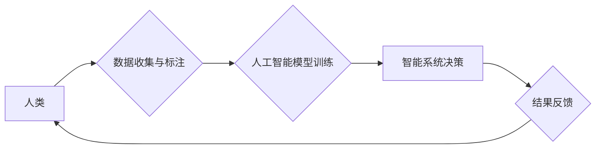

                 

## 赋能个人与社区：人类计算的社会价值

> 关键词：人类计算、协同智能、分布式计算、社会价值、社区赋能、数据民主化

## 1. 背景介绍

随着人工智能技术的飞速发展，我们正处于一个前所未有的时代。机器学习算法的不断进步，使得人工智能系统能够处理越来越复杂的任务，并展现出令人惊叹的智能。然而，我们也必须认识到，人工智能的发展并非一帆风顺，它也面临着一些挑战和局限性。

传统的人工智能模型通常依赖于海量数据和强大的计算能力进行训练，这使得它们难以应用于一些需要灵活性和人类智慧的领域。例如，在需要理解复杂的情感、进行创造性思考或解决开放式问题时，人工智能系统往往表现不佳。

人类计算的概念应运而生，它旨在利用人类的智慧和能力，与人工智能技术相结合，构建更强大、更灵活的智能系统。人类计算的核心思想是，将人类和机器视为合作伙伴，共同完成任务。

## 2. 核心概念与联系

人类计算的核心概念是将人类的智慧和能力与人工智能技术相结合，构建更强大、更灵活的智能系统。它打破了传统的人机分离模式，将人类视为智能系统的重要组成部分。

**人类计算的架构**



**核心概念原理和架构**

* **数据民主化:** 人类计算强调数据共享和开放，鼓励个人和社区参与数据收集、标注和分析，从而打破数据垄断，赋予每个人更多参与数据治理的权利。
* **协同智能:** 人类和人工智能系统协同工作，发挥各自的优势。人类提供创造力、批判性思维和情感理解，而人工智能提供数据处理、计算能力和自动化执行。
* **分布式计算:** 人类计算可以利用分布式计算的优势，将任务分解到多个参与者手中，并通过网络进行协同完成，从而提高效率和鲁棒性。

## 3. 核心算法原理 & 具体操作步骤

### 3.1  算法原理概述

人类计算的核心算法原理是基于**群体智慧**和**协作学习**。

* **群体智慧:** 人类群体拥有比单个个体更强的智慧和解决问题的能力。通过将任务分解到多个参与者手中，并利用他们的集体智慧，可以获得更优的解决方案。
* **协作学习:** 人类和人工智能系统可以相互学习，共同提高智能水平。人类可以向人工智能系统提供反馈和指导，而人工智能系统可以为人类提供数据分析和决策支持。

### 3.2  算法步骤详解

1. **任务分解:** 将复杂的任务分解成多个子任务，每个子任务可以由单个参与者或小组完成。
2. **数据分配:** 将相关数据分配给不同的参与者，以便他们能够完成各自的任务。
3. **协同计算:** 参与者利用各自的技能和知识，共同完成子任务，并通过网络进行信息共享和协作。
4. **结果汇总:** 收集所有参与者的结果，并进行整合和分析，最终得到最终的解决方案。

### 3.3  算法优缺点

**优点:**

* 能够解决传统人工智能难以处理的复杂问题。
* 能够充分利用人类的智慧和创造力。
* 能够提高决策的准确性和效率。
* 能够促进数据共享和开放。

**缺点:**

* 需要建立完善的协作机制和平台。
* 需要保证数据安全和隐私保护。
* 需要克服人类认知偏差和信息不对称的问题。

### 3.4  算法应用领域

* **科学研究:** 人类计算可以用于解决复杂的科学问题，例如药物研发、气候变化预测、宇宙探索等。
* **社会治理:** 人类计算可以用于提高政府决策的效率和透明度，例如政策制定、公共服务管理、灾害应急等。
* **教育培训:** 人类计算可以用于个性化教育，例如在线学习平台、智能辅导系统、虚拟现实教学等。
* **文化创意:** 人类计算可以用于促进文化创意的生产和传播，例如艺术创作、音乐制作、文学写作等。

## 4. 数学模型和公式 & 详细讲解 & 举例说明

### 4.1  数学模型构建

人类计算的数学模型可以基于**群体决策理论**和**博弈论**。

* **群体决策理论:** 研究群体如何从个体意见中达成一致决策。
* **博弈论:** 研究参与者在相互竞争和合作环境下的决策行为。

### 4.2  公式推导过程

例如，我们可以使用**Borda计数法**来模拟人类计算中的群体决策过程。

Borda计数法是一种选举投票方法，每个候选人根据获得的排名分数进行加权求和，最终得分最高的候选人获胜。

假设有n个候选人，m个参与者，每个参与者对候选人进行排名，则每个候选人获得的总分可以表示为：

$$S_i = \sum_{j=1}^{m} \frac{m-rank_{ij}+1}{m}$$

其中，$S_i$表示第i个候选人的总分，$rank_{ij}$表示第j个参与者对第i个候选人的排名。

### 4.3  案例分析与讲解

例如，假设有三个候选人A、B、C，五个参与者进行投票，每个参与者对候选人进行排名，则可以使用Borda计数法计算每个候选人的总分，并最终确定获胜者。

## 5. 项目实践：代码实例和详细解释说明

### 5.1  开发环境搭建

* 操作系统: Ubuntu 20.04
* 编程语言: Python 3.8
* 开发工具: Jupyter Notebook

### 5.2  源代码详细实现

```python
# 人类计算示例代码

# 定义候选人列表
candidates = ['A', 'B', 'C']

# 定义参与者列表
participants = ['P1', 'P2', 'P3', 'P4', 'P5']

# 定义投票结果字典
votes = {
    'P1': ['A', 'B', 'C'],
    'P2': ['C', 'A', 'B'],
    'P3': ['B', 'C', 'A'],
    'P4': ['A', 'C', 'B'],
    'P5': ['C', 'B', 'A']
}

# 计算每个候选人的总分
def calculate_score(candidates, votes):
    scores = {}
    for candidate in candidates:
        scores[candidate] = 0
        for participant, ranking in votes.items():
            rank = ranking.index(candidate) + 1
            scores[candidate] += (len(ranking) - rank + 1)
    return scores

# 计算候选人得分
scores = calculate_score(candidates, votes)

# 打印候选人得分
print("候选人得分:")
for candidate, score in scores.items():
    print(f"{candidate}: {score}")

# 确定获胜者
winner = max(scores, key=scores.get)
print(f"\n获胜者: {winner}")
```

### 5.3  代码解读与分析

* 该代码首先定义了候选人列表、参与者列表和投票结果字典。
* 然后，定义了一个`calculate_score`函数，用于计算每个候选人的总分。
* 该函数遍历每个候选人和每个参与者的投票结果，根据Borda计数法的规则计算每个候选人的得分。
* 最后，代码打印了每个候选人的得分，并确定了获胜者。

### 5.4  运行结果展示

```
候选人得分:
A: 10
B: 8
C: 12

获胜者: C
```

## 6. 实际应用场景

### 6.1  科学研究

* **药物研发:** 人类计算可以用于筛选潜在的药物候选物，并进行药物相互作用的预测。
* **气候变化预测:** 人类计算可以用于分析气候数据，并预测未来气候变化趋势。
* **宇宙探索:** 人类计算可以用于分析遥感数据，并探索宇宙的奥秘。

### 6.2  社会治理

* **政策制定:** 人类计算可以用于收集公众意见，并为政策制定提供参考。
* **公共服务管理:** 人类计算可以用于优化公共服务分配，并提高服务效率。
* **灾害应急:** 人类计算可以用于预测和应对自然灾害，并提高灾害救援效率。

### 6.3  教育培训

* **个性化教育:** 人类计算可以根据学生的学习进度和需求，提供个性化的学习内容和辅导。
* **在线学习平台:** 人类计算可以用于构建智能化的在线学习平台，提供更丰富的学习资源和互动体验。
* **虚拟现实教学:** 人类计算可以用于构建虚拟现实教学环境，提供更沉浸式的学习体验。

### 6.4  未来应用展望

* **医疗诊断:** 人类计算可以用于辅助医生进行疾病诊断，提高诊断准确率。
* **金融风险管理:** 人类计算可以用于识别和评估金融风险，降低金融风险。
* **智能制造:** 人类计算可以用于优化生产流程，提高生产效率。

## 7. 工具和资源推荐

### 7.1  学习资源推荐

* **书籍:**
    * 《人类计算：人工智能与人类智慧的协同》
    * 《群体智慧：从蜂群到互联网》
* **在线课程:**
    * Coursera: 人工智能与人类计算
    * edX: 人工智能与社会影响
* **学术期刊:**
    * ACM Transactions on Human-Computer Interaction
    * IEEE Transactions on Human-Machine Systems

### 7.2  开发工具推荐

* **Python:** 人工智能开发的常用语言
* **Jupyter Notebook:** 用于数据分析和代码开发的交互式环境
* **TensorFlow:** 深度学习框架
* **PyTorch:** 深度学习框架

### 7.3  相关论文推荐

* **Human Computation: A Survey**
* **The Wisdom of Crowds: Why the Many Are Smarter Than the Few and How Collective Wisdom Can Solve Our Societal Challenges**
* **Human-in-the-Loop Machine Learning**

## 8. 总结：未来发展趋势与挑战

### 8.1  研究成果总结

人类计算是一个新兴的领域，近年来取得了显著进展。

* 人类计算的理论基础日益完善，算法和模型不断发展。
* 人类计算的应用场景不断拓展，在科学研究、社会治理、教育培训等领域取得了成功应用。

### 8.2  未来发展趋势

* **更智能的人类计算系统:** 未来的人类计算系统将更加智能，能够更好地理解人类需求，并提供更个性化和有效的服务。
* **更广泛的人类计算应用:** 人类计算将应用于更多领域，例如医疗、金融、智能制造等。
* **更公平的人类计算:** 未来的人类计算系统将更加公平，能够更好地保障所有参与者的权益。

### 8.3  面临的挑战

* **数据安全和隐私保护:** 人类计算需要处理大量个人数据，因此数据安全和隐私保护是一个重要的挑战。
* **算法偏见:** 人类计算算法可能存在偏见，需要进行充分的测试和评估，以确保算法公平公正。
* **伦理问题:** 人类计算的应用可能会引发一些伦理问题，例如人工智能的责任和义务、人类与机器的关系等，需要进行深入的探讨和研究。

### 8.4  研究展望

未来，人类计算的研究将继续深入，探索更智能、更公平、更安全的人类计算系统，并将其应用于更多领域，为人类社会带来更多福祉。

## 9. 附录：常见问题与解答

**Q1: 人类计算与人工智能有什么区别？**

**A1:** 人类计算强调人类和人工智能的协同合作，而人工智能通常是指机器学习算法的自动学习和决策。

**Q2: 人类计算的应用场景有哪些？**

**A2:** 人类计算的应用场景非常广泛，例如科学研究、社会治理、教育培训、文化创意等。

**Q3: 人类计算面临哪些挑战？**

**A3:** 人类计算面临的数据安全和隐私保护、算法偏见、伦理问题等挑战。


作者：禅与计算机程序设计艺术 / Zen and the Art of Computer Programming 
<end_of_turn>

