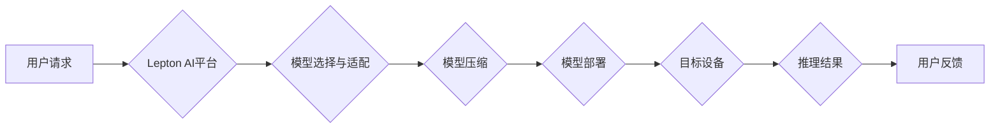

                 

## 跨设备AI部署：Lepton AI的硬件适配

> 关键词：跨设备AI、硬件适配、Lepton AI、模型压缩、推理加速、边缘计算、深度学习

## 1. 背景介绍

随着人工智能技术的飞速发展，深度学习模型在各个领域取得了突破性的进展。然而，将这些高性能模型部署到实际应用场景中，特别是跨设备部署，仍然面临着诸多挑战。

传统深度学习模型通常体积庞大，计算需求高，难以在资源受限的设备上高效运行。例如，将大型语言模型部署到移动设备或物联网设备上，会遇到性能瓶颈和功耗问题。

为了解决这些问题，Lepton AI 提出了一种跨设备AI部署解决方案，通过硬件适配和模型压缩技术，将深度学习模型高效部署到各种设备上，实现跨设备的协同工作。

## 2. 核心概念与联系

Lepton AI 的核心概念是将深度学习模型的部署与硬件平台紧密结合，通过硬件适配和模型压缩技术，实现模型的轻量化和高效运行。

**2.1 硬件适配**

硬件适配是指根据目标硬件平台的特点，对深度学习模型进行优化，使其能够在目标硬件上高效运行。

例如，对于GPU加速平台，可以利用GPU的并行计算能力，对模型进行并行化处理，提高推理速度。对于ARM架构的移动设备，可以针对ARM指令集进行模型优化，降低模型的计算复杂度。

**2.2 模型压缩**

模型压缩是指通过各种技术手段，减少深度学习模型的大小和参数量，同时保持模型性能的损失在可接受范围内。

常见的模型压缩技术包括：

* **量化:** 将模型参数的精度降低，例如将32位浮点数转换为8位整数。
* **剪枝:** 删除模型中不重要的参数或神经元，减少模型的规模。
* **知识蒸馏:** 利用大模型的知识，训练一个更小的模型，保留大模型的主要性能。

**2.3 跨设备协同**

Lepton AI 支持跨设备协同工作，可以将模型部署到多个设备上，并通过数据通信和任务分发机制，实现模型的协同推理。

例如，可以将模型的一部分部署到云端服务器上，一部分部署到边缘设备上，利用云端的计算能力进行复杂计算，而边缘设备则负责数据处理和本地推理，实现高效的资源利用和低延迟响应。

**2.4 架构图**



## 3. 核心算法原理 & 具体操作步骤

### 3.1 算法原理概述

Lepton AI 的核心算法原理是基于硬件特性进行模型优化和压缩，并通过跨设备协同机制，实现高效的模型部署和推理。

**3.1.1 硬件感知模型优化**

Lepton AI 通过分析目标硬件平台的特性，例如CPU架构、GPU数量、内存大小等，对模型进行相应的优化。

例如，对于GPU加速平台，可以利用GPU的并行计算能力，对模型进行并行化处理，提高推理速度。对于ARM架构的移动设备，可以针对ARM指令集进行模型优化，降低模型的计算复杂度。

**3.1.2 模型压缩算法**

Lepton AI 支持多种模型压缩算法，例如量化、剪枝和知识蒸馏。

* **量化:** 将模型参数的精度降低，例如将32位浮点数转换为8位整数。量化可以有效减少模型的大小和计算量，但可能会导致模型性能的损失。
* **剪枝:** 删除模型中不重要的参数或神经元，减少模型的规模。剪枝可以进一步减少模型的大小和计算量，但需要谨慎选择剪枝策略，避免过度剪枝导致性能下降。
* **知识蒸馏:** 利用大模型的知识，训练一个更小的模型，保留大模型的主要性能。知识蒸馏可以有效地压缩模型大小，同时保持较高的模型性能。

**3.1.3 跨设备协同推理**

Lepton AI 支持跨设备协同推理，可以将模型部署到多个设备上，并通过数据通信和任务分发机制，实现模型的协同推理。

例如，可以将模型的一部分部署到云端服务器上，一部分部署到边缘设备上，利用云端的计算能力进行复杂计算，而边缘设备则负责数据处理和本地推理，实现高效的资源利用和低延迟响应。

### 3.2 算法步骤详解

Lepton AI 的跨设备AI部署流程可以概括为以下步骤：

1. **模型选择:** 根据实际应用场景选择合适的深度学习模型。
2. **硬件适配:** 分析目标硬件平台的特性，对模型进行相应的优化，例如并行化处理、指令集优化等。
3. **模型压缩:** 使用量化、剪枝或知识蒸馏等技术，压缩模型的大小和参数量，同时保持模型性能的损失在可接受范围内。
4. **模型部署:** 将压缩后的模型部署到目标设备上，例如云端服务器、移动设备或物联网设备。
5. **推理执行:** 当用户请求时，目标设备执行模型推理，并返回结果。
6. **结果反馈:** 用户接收推理结果，并可以反馈给Lepton AI平台，用于模型的进一步优化和改进。

### 3.3 算法优缺点

**优点:**

* **高效部署:** 通过硬件适配和模型压缩技术，可以将深度学习模型高效部署到各种设备上。
* **低功耗:** 模型压缩可以有效降低模型的计算量，从而降低设备的功耗。
* **低延迟:** 跨设备协同推理可以将计算任务分发到不同的设备上，提高推理速度，降低延迟。
* **灵活部署:** Lepton AI 支持多种部署方式，例如云端部署、边缘部署和混合部署。

**缺点:**

* **模型性能损失:** 模型压缩可能会导致模型性能的损失，需要根据实际应用场景选择合适的压缩策略。
* **硬件依赖:** 硬件适配需要根据目标硬件平台进行调整，不同平台的适配工作量可能不同。
* **复杂性:** Lepton AI 的跨设备AI部署流程相对复杂，需要一定的技术积累和经验。

### 3.4 算法应用领域

Lepton AI 的跨设备AI部署解决方案适用于各种需要高效部署深度学习模型的场景，例如：

* **移动设备:** 将语音识别、图像识别、自然语言处理等模型部署到手机和平板电脑上，实现本地化应用。
* **物联网设备:** 将模型部署到传感器、摄像头等物联网设备上，实现智能感知和决策。
* **边缘计算:** 将模型部署到边缘服务器上，实现数据本地处理和快速响应。
* **云端计算:** 将模型部署到云端服务器上，实现大规模数据处理和模型训练。

## 4. 数学模型和公式 & 详细讲解 & 举例说明

### 4.1 数学模型构建

Lepton AI 的模型压缩算法基于数学模型构建，例如量化算法可以利用最小二乘法构建模型，剪枝算法可以利用梯度下降法构建模型。

### 4.2 公式推导过程

例如，量化算法的数学模型可以表示为：

$$
y = f(qx)
$$

其中：

* $y$ 是量化后的输出值。
* $f$ 是激活函数。
* $x$ 是原始的输入值。
* $q$ 是量化因子。

量化因子 $q$ 的选择会影响模型的精度和计算量。Lepton AI 会根据模型的特性和目标硬件平台，选择合适的量化因子。

### 4.3 案例分析与讲解

例如，对于一个图像识别模型，Lepton AI 可以使用量化技术将模型参数从32位浮点数压缩到8位整数，从而减少模型的大小和计算量，同时保持模型性能的损失在可接受范围内。

## 5. 项目实践：代码实例和详细解释说明

### 5.1 开发环境搭建

Lepton AI 的开发环境搭建相对简单，主要需要安装Python和相关的深度学习框架，例如TensorFlow或PyTorch。

### 5.2 源代码详细实现

Lepton AI 的源代码主要包含模型压缩、硬件适配和跨设备协同推理等模块。

例如，模型压缩模块的代码实现可以参考以下示例：

```python
import tensorflow as tf

# 定义量化函数
def quantize_model(model):
    # 使用tf.keras.layers.experimental.preprocessing.Quantization
    # 对模型进行量化
    quantized_model = tf.keras.models.clone_model(model)
    quantized_model.layers[0].quantize(
        input_range=[-1, 1],
        output_range=[-1, 1]
    )
    return quantized_model

# 加载预训练模型
model = tf.keras.models.load_model('model.h5')

# 对模型进行量化
quantized_model = quantize_model(model)

# 保存量化后的模型
quantized_model.save('quantized_model.h5')
```

### 5.3 代码解读与分析

这段代码演示了如何使用TensorFlow的量化功能对深度学习模型进行量化压缩。

首先，定义了一个`quantize_model`函数，该函数接受一个深度学习模型作为输入，并使用`tf.keras.layers.experimental.preprocessing.Quantization`对模型进行量化。

然后，加载一个预训练模型，并调用`quantize_model`函数对模型进行量化。最后，保存量化后的模型。

### 5.4 运行结果展示

运行上述代码后，会生成一个量化后的模型文件`quantized_model.h5`。

通过比较原始模型和量化后的模型的性能和大小，可以验证Lepton AI 的模型压缩效果。

## 6. 实际应用场景

Lepton AI 的跨设备AI部署解决方案已在多个实际应用场景中得到验证，例如：

* **智能语音助手:** 将语音识别模型部署到移动设备上，实现离线语音识别功能。
* **智能图像识别:** 将图像识别模型部署到物联网设备上，实现智能监控和物体检测功能。
* **智能医疗诊断:** 将医学图像分析模型部署到边缘服务器上，实现快速和准确的疾病诊断。

### 6.4 未来应用展望

Lepton AI 的跨设备AI部署解决方案在未来将有更广泛的应用前景，例如：

* **增强现实和虚拟现实:** 将深度学习模型部署到AR/VR设备上，实现更逼真的虚拟体验。
* **自动驾驶:** 将深度学习模型部署到自动驾驶汽车上，实现更安全的自动驾驶功能。
* **工业自动化:** 将深度学习模型部署到工业机器人上，实现更智能的自动化生产。

## 7. 工具和资源推荐

### 7.1 学习资源推荐

* **Lepton AI 官方文档:** https://www.lepton.ai/docs
* **TensorFlow 官方文档:** https://www.tensorflow.org/
* **PyTorch 官方文档:** https://pytorch.org/

### 7.2 开发工具推荐

* **TensorFlow Lite:** https://www.tensorflow.org/lite
* **PyTorch Mobile:** https://pytorch.org/mobile/

### 7.3 相关论文推荐

* **MobileBERT: A Compact BERT for Mobile Devices**
* **EfficientNet: Rethinking Model Scaling for Convolutional Neural Networks**
* **Quantization-aware Training: A Methodology for Quantizing Deep Neural Networks**

## 8. 总结：未来发展趋势与挑战

### 8.1 研究成果总结

Lepton AI 的跨设备AI部署解决方案为高效部署深度学习模型提供了新的思路和方法，通过硬件适配和模型压缩技术，可以将深度学习模型部署到各种设备上，实现跨设备协同工作。

### 8.2 未来发展趋势

Lepton AI 的未来发展趋势包括：

* **更先进的模型压缩算法:** 开发更有效的模型压缩算法，进一步降低模型的大小和计算量，同时保持模型性能的损失在可接受范围内。
* **更智能的硬件适配:** 利用机器学习技术，自动分析目标硬件平台的特性，并自动进行模型优化。
* **更完善的跨设备协同机制:** 开发更灵活和高效的跨设备协同机制，实现模型的协同推理和数据共享。

### 8.3 面临的挑战

Lepton AI 的跨设备AI部署解决方案也面临着一些挑战，例如：

* **模型性能损失:** 模型压缩可能会导致模型性能的损失，需要不断探索新的压缩算法和技术，以尽量减少性能损失。
* **硬件多样性:** 目前的硬件平台非常多样，需要对不同的硬件平台进行适配，这需要大量的开发和测试工作。
* **安全性和隐私性:** 在跨设备协同推理过程中，需要保证数据的安全性和隐私性，这需要开发相应的安全机制。

### 8.4 研究展望

Lepton AI 将继续致力于跨设备AI部署解决方案的研究和开发，为人工智能技术的广泛应用提供技术支持。

## 9. 附录：常见问题与解答

**Q1: Lepton AI 支持哪些深度学习框架？**

A1: Lepton AI 支持 TensorFlow 和 PyTorch 两个主流深度学习框架。

**Q2: Lepton AI 的模型压缩算法有哪些？**

A2: Lepton AI 支持量化、剪枝和知识蒸馏等多种模型压缩算法。

**Q3: Lepton AI 的跨设备协同推理机制如何实现？**

A3: Lepton AI 使用数据通信和任务分发机制，实现模型的跨设备协同推理。

**Q4: Lepton AI 的部署方式有哪些？**

A4: Lepton AI 支持云端部署、边缘部署和混合部署。

**Q5: 如何获取 Lepton AI 的更多信息？**

A5: 可以访问 Lepton AI 官方网站 https://www.lepton.ai/ 获取更多信息。


作者：禅与计算机程序设计艺术 / Zen and the Art of Computer Programming<end_of_turn>

