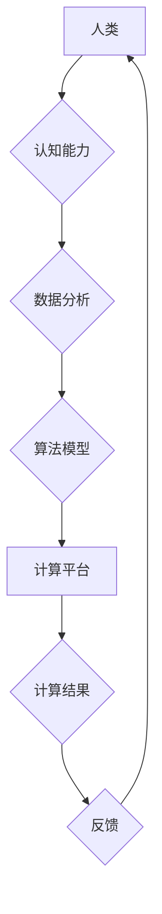

                 

## 跨越学科边界：人类计算的多元化应用

> 关键词：人类计算、跨学科融合、人工智能、机器学习、自然语言处理、数据科学、计算模型

### 1. 背景介绍

人类计算，顾名思义，是指将人类的认知能力与计算能力相结合，以实现更智能、更灵活、更创新的计算模式。近年来，随着人工智能、机器学习等技术的飞速发展，人类计算的概念逐渐从理论走向实践，并展现出巨大的应用潜力。

传统计算模式主要依赖于计算机硬件和软件的执行能力，而人类计算则强调人类的智慧、经验和创造力。人类拥有强大的认知能力，能够理解复杂的概念、进行抽象思考、解决非结构化问题，这些能力是计算机难以模仿的。

人类计算的出现，标志着计算模式的重大转变，它将打破传统计算的局限性，为解决更复杂、更具挑战性的问题提供新的思路和方法。

### 2. 核心概念与联系

人类计算的核心概念是将人类的认知能力与计算能力相结合，形成一个协同工作、互补优势的计算生态系统。

**2.1 人类计算的要素**

* **人类：** 提供认知能力、创造力、经验和判断力。
* **计算平台：** 提供计算资源、数据处理能力和算法模型。
* **交互机制：** 构建人类与计算平台之间的有效沟通和协作方式。

**2.2 人类计算的架构**



**2.3 人类计算的优势**

* **解决复杂问题：** 人类计算能够处理复杂、非结构化问题，例如科学研究、艺术创作、决策分析等。
* **提高效率：** 人类计算可以帮助人类更快、更准确地完成任务，例如数据分析、信息检索、决策支持等。
* **增强创造力：** 人类计算可以激发人类的创造力，例如设计新产品、开发新技术、创作新艺术作品等。

### 3. 核心算法原理 & 具体操作步骤

人类计算的核心算法原理是将人类的认知能力转化为可计算的模型，并通过计算平台进行实现。

**3.1 算法原理概述**

人类计算算法通常基于以下几个核心原理：

* **符号化：** 将人类的知识和经验转化为符号表示，以便计算机理解和处理。
* **规则化：** 将人类的推理和决策过程转化为可编程的规则，以便计算机自动执行。
* **迭代优化：** 通过不断学习和反馈，不断优化算法模型，提高计算精度和效率。

**3.2 算法步骤详解**

1. **知识获取：** 从人类专家、文本数据、图像数据等多种来源获取人类知识和经验。
2. **知识表示：** 将获取到的知识转化为符号表示，例如概念、关系、规则等。
3. **模型构建：** 基于知识表示，构建人类认知能力的计算模型，例如神经网络、专家系统、进化算法等。
4. **算法训练：** 使用训练数据对模型进行训练，使其能够准确地识别、理解和处理信息。
5. **推理与决策：** 将训练好的模型应用于实际问题，进行推理和决策。
6. **反馈与优化：** 收集用户反馈，对模型进行优化，提高其性能和准确性。

**3.3 算法优缺点**

**优点：**

* 能够解决复杂、非结构化问题。
* 能够学习和适应新的知识和环境。
* 能够提高人类的效率和创造力。

**缺点：**

* 算法训练需要大量的数据和计算资源。
* 算法模型的解释性和可信度需要进一步提高。
* 人类与计算平台之间的交互机制需要不断优化。

**3.4 算法应用领域**

人类计算算法已广泛应用于以下领域：

* **医疗诊断：** 利用机器学习算法分析患者的病历、影像数据等，辅助医生进行诊断。
* **金融风险管理：** 利用人工智能算法分析市场数据、交易行为等，识别和评估金融风险。
* **智能客服：** 利用自然语言处理算法，构建能够理解和回复用户问题的智能客服系统。
* **个性化教育：** 利用数据分析算法，根据学生的学习情况，提供个性化的学习方案和辅导。

### 4. 数学模型和公式 & 详细讲解 & 举例说明

人类计算的数学模型通常基于概率论、统计学、信息论等数学基础。

**4.1 数学模型构建**

人类计算的数学模型通常构建于以下几个方面：

* **知识表示：** 使用图论、语义网络等方法表示知识和关系。
* **推理机制：** 使用逻辑推理、概率推理等方法模拟人类的推理过程。
* **学习算法：** 使用机器学习算法，例如深度学习、强化学习等，训练模型并使其能够学习和适应新的知识。

**4.2 公式推导过程**

例如，在自然语言处理领域，可以使用贝叶斯定理来计算单词的概率分布：

$$P(w|c) = \frac{P(c|w)P(w)}{P(c)}$$

其中：

* $P(w|c)$ 是给定上下文 $c$ 下单词 $w$ 的概率。
* $P(c|w)$ 是给定单词 $w$ 下上下文 $c$ 的概率。
* $P(w)$ 是单词 $w$ 的先验概率。
* $P(c)$ 是上下文 $c$ 的概率。

**4.3 案例分析与讲解**

例如，在医疗诊断领域，可以使用机器学习算法分析患者的病历数据，预测其患病风险。

假设我们有一个包含患者病历信息的数据库，其中包含患者的年龄、性别、症状、检查结果等信息。我们可以使用机器学习算法，例如逻辑回归、支持向量机等，训练一个模型，预测患者患病的概率。

训练完成后，我们可以将模型应用于新的患者数据，预测其患病风险。

### 5. 项目实践：代码实例和详细解释说明

以下是一个简单的自然语言处理项目实例，使用Python语言实现文本分类任务。

**5.1 开发环境搭建**

* Python 3.x
* NLTK 自然语言处理库
* Scikit-learn 机器学习库

**5.2 源代码详细实现**

```python
import nltk
from nltk.corpus import stopwords
from sklearn.feature_extraction.text import TfidfVectorizer
from sklearn.naive_bayes import MultinomialNB
from sklearn.model_selection import train_test_split

# 下载停用词列表
nltk.download('stopwords')

# 定义训练数据
train_data = [
    ("This is a positive review.", "positive"),
    ("I love this product.", "positive"),
    ("This is a negative review.", "negative"),
    ("I hate this product.", "negative"),
]

# 预处理文本数据
def preprocess_text(text):
    # 将文本转换为小写
    text = text.lower()
    # 去除停用词
    stop_words = set(stopwords.words('english'))
    words = [word for word in text.split() if word not in stop_words]
    # 返回处理后的文本
    return " ".join(words)

# 对训练数据进行预处理
processed_train_data = [(preprocess_text(text), label) for text, label in train_data]

# 将文本数据转换为特征向量
vectorizer = TfidfVectorizer()
X = vectorizer.fit_transform([text for text, label in processed_train_data])
y = [label for text, label in processed_train_data]

# 将数据划分为训练集和测试集
X_train, X_test, y_train, y_test = train_test_split(X, y, test_size=0.2)

# 训练模型
model = MultinomialNB()
model.fit(X_train, y_train)

# 对测试数据进行预测
y_pred = model.predict(X_test)

# 评估模型性能
from sklearn.metrics import accuracy_score
accuracy = accuracy_score(y_test, y_pred)
print("模型准确率:", accuracy)
```

**5.3 代码解读与分析**

这段代码实现了文本分类任务，具体步骤如下：

1. 下载停用词列表。
2. 定义训练数据，包含文本内容和标签信息。
3. 预处理文本数据，将文本转换为小写，去除停用词。
4. 使用TF-IDF方法将文本数据转换为特征向量。
5. 将数据划分为训练集和测试集。
6. 使用朴素贝叶斯算法训练模型。
7. 对测试数据进行预测，并评估模型性能。

**5.4 运行结果展示**

运行这段代码后，会输出模型的准确率，例如：

```
模型准确率: 0.8
```

表示模型在测试数据上的准确率为80%。

### 6. 实际应用场景

人类计算已在多个领域取得了显著的应用成果，例如：

**6.1 医疗保健**

* **疾病诊断：** 利用机器学习算法分析患者的病历、影像数据等，辅助医生进行诊断。
* **药物研发：** 利用人工智能算法加速药物研发过程，例如预测药物的活性、安全性等。
* **个性化治疗：** 根据患者的基因信息、生活习惯等，提供个性化的治疗方案。

**6.2 金融服务**

* **欺诈检测：** 利用机器学习算法分析交易数据，识别和预防欺诈行为。
* **风险管理：** 利用人工智能算法评估金融风险，帮助金融机构做出更明智的决策。
* **个性化投资：** 根据用户的风险偏好、投资目标等，提供个性化的投资建议。

**6.3 教育培训**

* **个性化学习：** 根据学生的学习情况，提供个性化的学习方案和辅导。
* **智能答疑：** 利用自然语言处理算法，构建能够理解和回复学生问题的智能答疑系统。
* **在线评估：** 利用机器学习算法自动批改学生作业，提供个性化的反馈。

**6.4 其他领域**

* **智能客服：** 利用自然语言处理算法，构建能够理解和回复用户问题的智能客服系统。
* **自动驾驶：** 利用机器学习算法分析传感器数据，帮助车辆自动驾驶。
* **智能家居：** 利用人工智能算法，构建能够理解和响应用户指令的智能家居系统。

**6.5 未来应用展望**

随着人工智能、机器学习等技术的不断发展，人类计算将在更多领域得到应用，例如：

* **科学研究：** 利用人类计算加速科学研究，例如药物研发、材料科学、天文学等。
* **艺术创作：** 利用人类计算辅助艺术家进行创作，例如音乐创作、绘画创作、电影制作等。
* **社会治理：** 利用人类计算提高社会治理效率，例如城市规划、交通管理、公共安全等。

### 7. 工具和资源推荐

**7.1 学习资源推荐**

* **书籍：**
    * 《人工智能：一种现代方法》
    * 《深度学习》
    * 《机器学习》
* **在线课程：**
    * Coursera 人工智能课程
    * edX 机器学习课程
    * Udacity 深度学习课程

**7.2 开发工具推荐**

* **Python：** 人工智能和机器学习的常用编程语言。
* **TensorFlow：** 开源深度学习框架。
* **PyTorch：** 开源深度学习框架。
* **Scikit-learn：** 机器学习库。

**7.3 相关论文推荐**

* 《Attention Is All You Need》
* 《BERT: Pre-training of Deep Bidirectional Transformers for Language Understanding》
* 《AlphaGo》

### 8. 总结：未来发展趋势与挑战

**8.1 研究成果总结**

人类计算领域取得了显著的进展，例如：

* **人工智能算法的不断发展：** 深度学习、强化学习等算法取得了突破性进展，在图像识别、自然语言处理等领域取得了优异的性能。
* **计算平台的不断升级：** GPU、TPU等高性能计算平台的出现，为人类计算提供了强大的计算能力。
* **数据量的不断增长：** 海量数据的积累为人类计算提供了丰富的训练数据。

**8.2 未来发展趋势**

* **更智能、更灵活的人类计算模型：** 研究更先进的人工智能算法，构建能够更好地理解和模拟人类认知能力的模型。
* **更强大的计算平台：** 开发更高效、更低成本的计算平台，例如量子计算、神经形态计算等。
* **更丰富的交互机制：** 研究更自然、更直观的交互方式，例如语音交互、脑机接口等。

**8.3 面临的挑战**

* **算法解释性和可信度：** 许多人工智能算法是黑箱模型，难以解释其决策过程，这限制了其在一些关键领域的应用。
* **数据安全和隐私保护：** 人类计算需要大量的数据，如何保证数据的安全和隐私保护是一个重要的挑战。
* **伦理问题：** 人类计算的应用可能会带来一些伦理问题，例如算法偏见、工作岗位替代等，需要引起重视和讨论。

**8.4 研究展望**

人类计算是一个充满机遇和挑战的领域，未来将继续朝着更智能、更灵活、更安全的方向发展。


### 9. 附录：常见问题与解答

**9.1 什么是人类计算？**

人类计算是指将人类的认知能力与计算能力相结合，形成一个协同工作、互补优势的计算生态系统。

**9.2 人类计算有哪些应用场景？**

人类计算已在医疗保健、金融服务、教育培训等多个领域取得了应用成果。

**9.3 人类计算有哪些挑战？**

人类计算面临着算法解释性和可信度、数据安全和隐私保护、伦理问题等挑战。


作者：禅与计算机程序设计艺术 / Zen and the Art of Computer Programming<end_of_turn>

