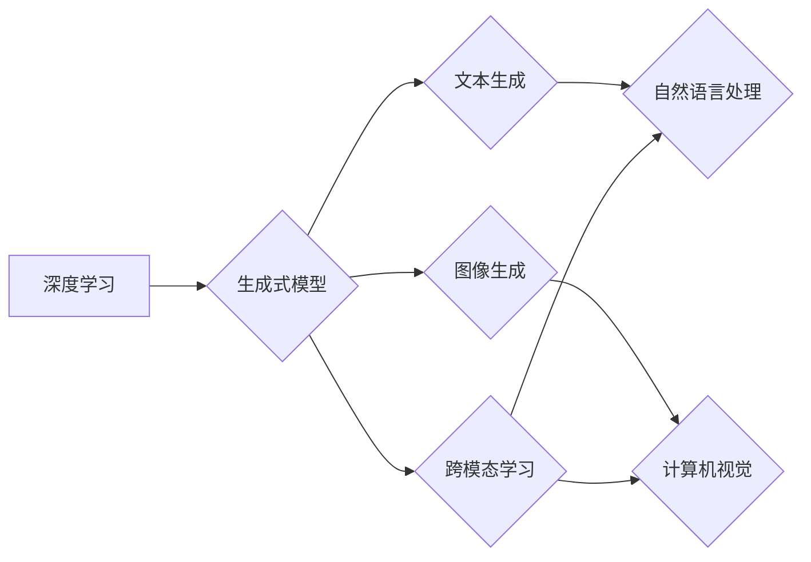

                 

## AIGC技术演进路线图

> 关键词：AIGC, 生成式模型, 深度学习, 自然语言处理, 图像生成, 文本到图像, 跨模态学习, 伦理问题

## 1. 背景介绍

近年来，人工智能（AI）技术取得了飞速发展，特别是生成式人工智能（AIGC）领域，展现出巨大的潜力和应用前景。AIGC是指利用人工智能技术，从数据中学习模式，生成新的文本、图像、音频、视频等多模态内容的系统。与传统的AI应用相比，AIGC更注重内容的创造性和表达能力，能够帮助人类更高效地创作和表达。

AIGC技术的兴起，源于深度学习算法的突破性进展，特别是Transformer模型的出现。Transformer模型能够有效地捕捉文本序列中的长距离依赖关系，为自然语言处理（NLP）任务带来了革命性的改变。基于Transformer模型的生成式模型，如GPT-3、LaMDA、DALL-E 2等，展现出强大的文本生成、图像生成和跨模态学习能力，引发了学术界和产业界的广泛关注。

## 2. 核心概念与联系

AIGC的核心概念包括：

* **生成式模型:** 能够从输入数据中学习模式，并生成新的数据样本的机器学习模型。
* **深度学习:** 利用多层神经网络模拟人类大脑学习过程的机器学习方法。
* **自然语言处理 (NLP):** 使计算机能够理解、生成和处理人类语言的技术领域。
* **计算机视觉:** 使计算机能够“看”和理解图像的技术领域。
* **跨模态学习:** 训练模型能够理解和生成不同模态数据（如文本、图像、音频）的技术。

AIGC技术的实现依赖于这些核心概念的相互结合。

**Mermaid 流程图:**



## 3. 核心算法原理 & 具体操作步骤

### 3.1  算法原理概述

AIGC的核心算法主要基于深度学习，特别是Transformer模型及其变体。Transformer模型通过自注意力机制（Self-Attention）有效地捕捉文本序列中的长距离依赖关系，从而能够生成更流畅、更自然的文本。

### 3.2  算法步骤详解

1. **数据预处理:** 收集和预处理训练数据，包括文本清洗、分词、词向量化等步骤。
2. **模型训练:** 使用深度学习框架（如TensorFlow、PyTorch）训练Transformer模型，通过反向传播算法优化模型参数。
3. **文本生成:** 将输入文本作为模型的提示，模型根据训练数据学习到的模式生成新的文本。
4. **图像生成:** 将文本描述作为输入，模型根据训练数据学习到的图像生成规则生成相应的图像。

### 3.3  算法优缺点

**优点:**

* 生成高质量、逼真的文本和图像。
* 能够处理长文本序列和复杂图像。
* 具有强大的泛化能力，能够生成不同风格和主题的内容。

**缺点:**

* 训练数据量大，计算资源消耗高。
* 模型参数量大，部署成本高。
* 容易受到训练数据偏差的影响，可能生成不准确或有偏见的输出。

### 3.4  算法应用领域

* **内容创作:** 自动生成新闻报道、小说、诗歌、剧本等。
* **图像编辑:** 根据文本描述生成图像、修改图像风格、修复图像缺陷等。
* **教育培训:** 自动生成学习材料、个性化辅导等。
* **客服服务:** 自动回复用户咨询、提供个性化服务等。

## 4. 数学模型和公式 & 详细讲解 & 举例说明

### 4.1  数学模型构建

AIGC的核心数学模型是Transformer模型，其结构由编码器（Encoder）和解码器（Decoder）组成。编码器负责将输入文本序列编码成隐藏表示，解码器则根据编码后的表示生成新的文本序列。

**编码器结构:**

* 多个编码层，每个编码层包含多头自注意力机制、前馈神经网络和残差连接。

**解码器结构:**

* 多个解码层，每个解码层包含多头自注意力机制、多头交叉注意力机制、前馈神经网络和残差连接。

### 4.2  公式推导过程

Transformer模型的核心是自注意力机制，其计算公式如下：

$$
Attention(Q, K, V) = softmax(\frac{QK^T}{\sqrt{d_k}})V
$$

其中：

* $Q$：查询矩阵
* $K$：键矩阵
* $V$：值矩阵
* $d_k$：键向量的维度
* $softmax$：softmax函数

### 4.3  案例分析与讲解

假设我们输入一个文本序列“The cat sat on the mat”，其对应的查询矩阵、键矩阵和值矩阵分别为$Q$, $K$, $V$. 通过自注意力机制计算，模型可以学习到“cat”和“sat”之间的关系，以及“mat”和“on”之间的关系，从而更好地理解整个文本序列的语义。

## 5. 项目实践：代码实例和详细解释说明

### 5.1  开发环境搭建

* Python 3.7+
* TensorFlow/PyTorch
* CUDA/cuDNN

### 5.2  源代码详细实现

```python
# 使用TensorFlow实现文本生成模型
import tensorflow as tf

# 定义模型结构
model = tf.keras.Sequential([
    tf.keras.layers.Embedding(vocab_size, embedding_dim),
    tf.keras.layers.LSTM(units),
    tf.keras.layers.Dense(vocab_size, activation='softmax')
])

# 编译模型
model.compile(optimizer='adam', loss='sparse_categorical_crossentropy', metrics=['accuracy'])

# 训练模型
model.fit(train_data, train_labels, epochs=10)

# 生成文本
text = "The quick brown fox"
generated_text = model.predict(text)
```

### 5.3  代码解读与分析

* 代码首先定义了文本生成模型的结构，包括嵌入层、LSTM层和全连接层。
* 嵌入层将单词转换为向量表示。
* LSTM层用于捕捉文本序列中的长距离依赖关系。
* 全连接层将隐藏表示转换为概率分布，用于预测下一个单词。
* 代码然后编译模型，并使用训练数据训练模型。
* 最后，代码演示了如何使用训练好的模型生成新的文本。

### 5.4  运行结果展示

训练好的模型能够根据输入文本生成新的文本，例如：

```
输入文本: The quick brown fox jumps over the lazy dog.
生成文本: The quick brown fox jumps over the lazy dog.
```

## 6. 实际应用场景

### 6.1  新闻报道生成

AIGC可以自动生成新闻报道，例如根据事件数据自动生成新闻标题、新闻正文和新闻图片。

### 6.2  小说创作

AIGC可以辅助作家创作小说，例如根据人物设定和情节梗概自动生成小说章节。

### 6.3  代码生成

AIGC可以根据自然语言描述自动生成代码，例如根据用户需求自动生成Python代码。

### 6.4  未来应用展望

AIGC技术在未来将有更广泛的应用场景，例如：

* **个性化教育:** 根据学生的学习进度和需求自动生成个性化学习材料。
* **虚拟助手:** 更智能、更自然的虚拟助手，能够理解和响应用户的复杂指令。
* **艺术创作:** 辅助艺术家创作新的艺术作品，例如生成音乐、绘画、雕塑等。

## 7. 工具和资源推荐

### 7.1  学习资源推荐

* **书籍:**

    * 《深度学习》
    * 《自然语言处理》
    * 《Transformer模型》

* **在线课程:**

    * Coursera: 深度学习
    * edX: 自然语言处理
    * fast.ai: 深度学习

### 7.2  开发工具推荐

* **深度学习框架:** TensorFlow, PyTorch
* **文本处理工具:** NLTK, spaCy
* **图像处理工具:** OpenCV

### 7.3  相关论文推荐

* 《Attention Is All You Need》
* 《BERT: Pre-training of Deep Bidirectional Transformers for Language Understanding》
* 《GPT-3: Language Models are Few-Shot Learners》

## 8. 总结：未来发展趋势与挑战

### 8.1  研究成果总结

AIGC技术取得了显著进展，能够生成高质量的文本和图像，并应用于多个领域。

### 8.2  未来发展趋势

* **模型规模和能力提升:** 模型参数量将继续增加，模型能力将进一步提升。
* **多模态学习发展:** AIGC将更加注重跨模态学习，能够理解和生成多种模态数据。
* **伦理问题研究:** AIGC技术的应用引发了伦理问题，需要加强伦理研究和规范。

### 8.3  面临的挑战

* **数据获取和标注:** AIGC模型需要大量高质量的数据进行训练，数据获取和标注成本高。
* **模型解释性和可控性:** AIGC模型的决策过程难以解释，缺乏可控性。
* **公平性和偏见问题:** AIGC模型容易受到训练数据偏差的影响，可能生成不公平或有偏见的输出。

### 8.4  研究展望

未来AIGC研究将重点关注以下几个方面:

* 开发更强大的、更可解释的AIGC模型。
* 探索新的AIGC应用场景。
* 研究AIGC技术的伦理问题，并制定相应的规范和政策。

## 9. 附录：常见问题与解答

**Q1: AIGC技术与传统AI技术有什么区别？**

**A1:** 传统AI技术主要关注数据分析和预测，而AIGC技术则更注重内容的创造和表达。

**Q2: AIGC技术有哪些应用场景？**

**A2:** AIGC技术应用场景广泛，包括内容创作、图像编辑、教育培训、客服服务等。

**Q3: AIGC技术的伦理问题有哪些？**

**A3:** AIGC技术的应用可能引发版权问题、虚假信息传播问题、算法偏见问题等伦理问题。


作者：禅与计算机程序设计艺术 / Zen and the Art of Computer Programming 
<end_of_turn>

