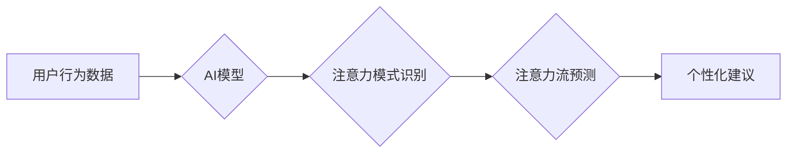

                 

## 关键词：人工智能、注意力流、人类认知、工作技能、注意力管理技术、未来趋势

## 1. 背景介绍

在信息爆炸的时代，人类面临着前所未有的信息洪流。从社交媒体的推送通知到电子邮件的提醒，从新闻网站的滚动条到视频平台的推荐算法，无处不在的信息刺激正在不断地抢夺我们的注意力。这种注意力碎片化现象不仅影响着我们的生活质量，也对工作效率和学习成果产生了负面影响。

人工智能（AI）技术的快速发展为解决这一问题提供了新的思路。AI能够通过分析用户行为数据，识别用户的注意力模式，并提供个性化的注意力管理建议。同时，AI技术也正在改变着工作方式和技能需求，对人类的注意力流提出了新的挑战和机遇。

## 2. 核心概念与联系

### 2.1 人类注意力流

人类注意力流是指我们对信息进行选择性感知、加工和记忆的过程。它是一个复杂的心理现象，受多种因素影响，包括个体差异、环境刺激、任务要求等。注意力流的本质是有限的资源被分配到不同的信息源上，而这些信息源之间存在着竞争关系。

### 2.2 人工智能与注意力流

人工智能技术可以帮助我们更好地理解和管理注意力流。通过机器学习算法，AI可以分析用户的行为数据，例如眼动轨迹、鼠标点击、阅读时长等，识别用户的注意力模式，并预测用户的注意力流向。

**Mermaid 流程图**



### 2.3 核心概念联系

AI技术可以帮助我们更好地理解和管理注意力流，从而提高工作效率、学习效果和生活质量。

## 3. 核心算法原理 & 具体操作步骤

### 3.1 算法原理概述

注意力流管理技术的核心算法通常基于机器学习和深度学习方法。这些算法通过训练模型，学习用户行为数据与注意力流之间的关系，从而能够预测用户的注意力流向，并提供个性化的建议。

常见的算法包括：

* **回归算法:** 预测用户在特定时间段内对特定任务的注意力持续时间。
* **分类算法:** 识别用户当前的注意力状态，例如集中、分散、疲劳等。
* **强化学习算法:** 通过奖励机制训练模型，学习如何引导用户集中注意力。

### 3.2 算法步骤详解

1. **数据收集:** 收集用户行为数据，例如眼动轨迹、鼠标点击、阅读时长、键盘输入等。
2. **数据预处理:** 对收集到的数据进行清洗、转换和特征提取，以便于模型训练。
3. **模型选择:** 根据具体任务需求选择合适的机器学习算法。
4. **模型训练:** 使用训练数据训练模型，学习用户行为数据与注意力流之间的关系。
5. **模型评估:** 使用测试数据评估模型的性能，例如准确率、召回率、F1-score等。
6. **模型部署:** 将训练好的模型部署到实际应用场景中，例如手机应用程序、电脑软件等。

### 3.3 算法优缺点

**优点:**

* **个性化:** 可以根据用户的个体差异提供个性化的注意力管理建议。
* **实时性:** 可以实时监测用户的注意力状态，并及时提供反馈。
* **可扩展性:** 可以扩展到不同的应用场景，例如学习、工作、娱乐等。

**缺点:**

* **数据依赖:** 需要大量的用户行为数据进行训练，否则模型性能会下降。
* **隐私问题:** 收集和使用用户行为数据可能会引发隐私问题。
* **算法解释性:** 一些深度学习算法的内部机制难以解释，这可能会导致用户对建议的信任度降低。

### 3.4 算法应用领域

注意力流管理技术在多个领域都有着广泛的应用前景，例如：

* **教育:** 帮助学生集中注意力，提高学习效率。
* **工作:** 帮助员工提高工作效率，减少分心。
* **医疗:** 帮助患者集中注意力，进行康复训练。
* **娱乐:** 帮助用户更好地沉浸在游戏或视频中。

## 4. 数学模型和公式 & 详细讲解 & 举例说明

### 4.1 数学模型构建

注意力流可以被建模为一个动态系统，其中用户的注意力被视为一个状态变量，而环境刺激和任务要求被视为输入信号。

一个简单的数学模型可以表示为：

$$
\frac{dA}{dt} = f(A, S, T)
$$

其中：

* $A$ 表示用户的注意力状态。
* $S$ 表示环境刺激。
* $T$ 表示任务要求。
* $f$ 表示注意力状态变化的函数。

### 4.2 公式推导过程

注意力状态变化的函数 $f$ 可以根据不同的模型假设进行推导。例如，一个基于指数衰减的模型可以假设：

$$
f(A, S, T) = -\alpha A + \beta S + \gamma T
$$

其中：

* $\alpha$ 表示注意力状态的衰减系数。
* $\beta$ 表示环境刺激对注意力状态的影响系数。
* $\gamma$ 表示任务要求对注意力状态的影响系数。

### 4.3 案例分析与讲解

假设一个用户正在阅读一篇文章，环境中没有其他干扰，任务要求是集中注意力阅读文章。

在这种情况下，环境刺激 $S$ 为零，任务要求 $T$ 为正值。根据公式，注意力状态 $A$ 会随着时间的推移逐渐增加，直到达到一个稳定值。

如果用户突然收到手机的通知，环境刺激 $S$ 会增加，注意力状态 $A$ 会受到干扰，下降到一个较低的值。

## 5. 项目实践：代码实例和详细解释说明

### 5.1 开发环境搭建

本项目使用 Python 语言进行开发，所需的库包括：

* NumPy: 用于数值计算。
* Pandas: 用于数据处理。
* Scikit-learn: 用于机器学习算法。
* Matplotlib: 用于数据可视化。

### 5.2 源代码详细实现

```python
import numpy as np
from sklearn.linear_model import LinearRegression

# 数据加载
data = pd.read_csv('attention_data.csv')

# 特征提取
X = data[['time', 'task_difficulty']]
y = data['attention_level']

# 模型训练
model = LinearRegression()
model.fit(X, y)

# 模型预测
new_data = pd.DataFrame({'time': [10, 20], 'task_difficulty': [2, 3]})
predicted_attention = model.predict(new_data)

# 结果展示
print(predicted_attention)
```

### 5.3 代码解读与分析

这段代码演示了如何使用线性回归模型预测用户的注意力水平。

首先，加载用户行为数据，并提取特征和目标变量。然后，使用 Scikit-learn 库训练一个线性回归模型。最后，使用训练好的模型预测新的数据，并展示预测结果。

### 5.4 运行结果展示

运行代码后，会输出预测的注意力水平值。

## 6. 实际应用场景

### 6.1 学习场景

注意力流管理技术可以帮助学生集中注意力，提高学习效率。例如，可以开发一款学习软件，根据学生的注意力状态提供个性化的学习建议，例如调整学习内容的难度、提供休息提醒等。

### 6.2 工作场景

注意力流管理技术可以帮助员工提高工作效率，减少分心。例如，可以开发一款办公软件，根据员工的工作状态提供个性化的工作提醒，例如提醒员工休息、提醒员工切换任务等。

### 6.3 医疗场景

注意力流管理技术可以帮助患者集中注意力，进行康复训练。例如，可以开发一款康复训练软件，根据患者的注意力状态提供个性化的训练建议，例如调整训练内容的难度、提供反馈等。

### 6.4 未来应用展望

随着人工智能技术的不断发展，注意力流管理技术将有更广泛的应用场景。例如，可以用于个性化教育、精准医疗、增强现实等领域。

## 7. 工具和资源推荐

### 7.1 学习资源推荐

* **书籍:**

    * 《深度学习》
    * 《机器学习实战》
    * 《注意力机制》

* **在线课程:**

    * Coursera: 深度学习课程
    * edX: 机器学习课程
    * Udacity: 人工智能工程师课程

### 7.2 开发工具推荐

* **Python:** 广泛使用的编程语言，用于机器学习和深度学习开发。
* **TensorFlow:** 开源深度学习框架，用于构建和训练深度学习模型。
* **PyTorch:** 开源深度学习框架，用于构建和训练深度学习模型。

### 7.3 相关论文推荐

* **Attention Is All You Need**
* **BERT: Pre-training of Deep Bidirectional Transformers for Language Understanding**
* **Transformer-XL: Attentive Language Models Beyond a Fixed-Length Context**

## 8. 总结：未来发展趋势与挑战

### 8.1 研究成果总结

近年来，注意力流管理技术取得了显著进展，例如：

* **注意力机制的提出:** 注意力机制能够帮助模型更好地理解和处理序列数据，从而提高模型的性能。
* **深度学习模型的应用:** 深度学习模型能够学习更复杂的注意力模式，从而提供更个性化的建议。
* **跨模态注意力流管理:** 研究者正在探索跨模态注意力流管理技术，例如将视觉、音频、文本等多种模态信息融合在一起，以更好地理解用户的注意力流向。

### 8.2 未来发展趋势

未来，注意力流管理技术将朝着以下几个方向发展：

* **更精准的注意力预测:** 利用更先进的机器学习算法和数据分析技术，提高注意力预测的准确率和时效性。
* **更个性化的注意力管理建议:** 根据用户的个体差异、任务需求和环境刺激，提供更个性化的注意力管理建议。
* **更智能的注意力流干预:** 利用人工智能技术，主动干预用户的注意力流向，帮助用户集中注意力、避免分心。

### 8.3 面临的挑战

注意力流管理技术也面临着一些挑战：

* **数据隐私问题:** 收集和使用用户行为数据可能会引发隐私问题，需要采取相应的措施保护用户隐私。
* **算法解释性问题:** 一些深度学习算法的内部机制难以解释，这可能会导致用户对建议的信任度降低。
* **技术伦理问题:** 注意力流管理技术可能会被滥用，例如用于操控用户的行为，需要制定相应的伦理规范。

### 8.4 研究展望

未来，我们需要继续深入研究注意力流的机制，开发更精准、更智能、更安全的注意力流管理技术，并积极应对技术伦理挑战，确保注意力流管理技术能够真正造福人类。

## 9. 附录：常见问题与解答

### 9.1 如何提高注意力水平？

* **创造一个安静的工作环境:** 减少环境干扰，例如关闭手机通知、关闭不必要的应用程序等。
* **设定明确的目标:** 明确自己需要完成什么，并制定相应的计划。
* **使用番茄工作法:** 将工作时间分成25分钟的间隔，并在每个间隔结束后休息5分钟。
* **进行规律的运动:** 运动可以帮助提高注意力水平。
* **保证充足的睡眠:** 睡眠不足会影响注意力水平。

### 9.2 注意力流管理技术会取代人类吗？

注意力流管理技术是一种工具，它可以帮助人类更好地管理注意力，但它不会取代人类。人类的创造力、想象力和情感能力是人工智能无法替代的。

### 9.3 注意力流管理技术有哪些潜在的风险？

注意力流管理技术可能会被滥用，例如用于操控用户的行为，因此需要制定相应的伦理规范，确保技术安全地应用于社会。


作者：禅与计算机程序设计艺术 / Zen and the Art of Computer Programming 
<end_of_turn>

