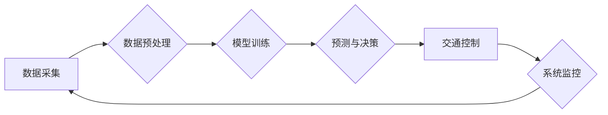

                 

## AI与人类计算：打造可持续发展的城市交通管理系统与规划

> 关键词：人工智能、城市交通、交通管理、可持续发展、人类计算、机器学习、深度学习、优化算法、交通预测、交通规划

## 1. 背景介绍

城市交通拥堵已成为全球性难题，给人们的生活、工作和经济发展带来了巨大压力。传统交通管理系统难以有效应对日益复杂的交通状况，亟需革新。人工智能（AI）技术作为新兴的科技力量，为解决城市交通问题提供了新的思路和方法。

AI技术能够通过学习和分析海量交通数据，识别交通模式、预测交通流量、优化交通信号控制等，从而提高交通效率、降低拥堵程度，并促进城市可持续发展。

## 2. 核心概念与联系

### 2.1 人工智能与交通管理

人工智能（AI）是指模拟人类智能行为的计算机系统，包括学习、推理、决策、感知等能力。在交通管理领域，AI技术可以应用于以下几个方面：

* **交通流量预测:** 利用历史交通数据和实时路况信息，预测未来交通流量，为交通管理提供决策依据。
* **交通信号控制优化:** 根据实时交通流量情况，动态调整交通信号灯的绿灯时间，提高交通流效率。
* **智能导航:** 提供实时路况信息和导航建议，帮助驾驶员避开拥堵路段，节省时间。
* **自动驾驶:** 开发自动驾驶汽车，减少人为驾驶误差，提高交通安全。

### 2.2 人类计算与AI协同

人类计算是指人类利用自身智慧和经验，对数据进行分析、判断和决策的过程。AI技术可以辅助人类进行交通管理决策，但不能完全替代人类。

在实际应用中，AI技术和人类计算需要协同工作，发挥各自优势。AI技术可以提供数据分析和预测支持，而人类可以根据AI的建议，结合自身经验和专业知识，做出最终决策。

### 2.3  城市交通管理系统架构



## 3. 核心算法原理 & 具体操作步骤

### 3.1  算法原理概述

交通流量预测是城市交通管理系统的重要组成部分，其核心算法通常基于机器学习和深度学习技术。

常见的交通流量预测算法包括：

* **线性回归:**  简单易懂的算法，适用于线性关系较强的交通流量数据。
* **支持向量机 (SVM):**  能够处理非线性关系的算法，具有较好的泛化能力。
* **神经网络:**  能够学习复杂非线性关系的算法，具有较高的预测精度。

### 3.2  算法步骤详解

以神经网络为例，其交通流量预测步骤如下：

1. **数据采集:** 收集历史交通流量数据、天气数据、时间数据等相关信息。
2. **数据预处理:** 对数据进行清洗、转换、归一化等处理，使其适合模型训练。
3. **模型构建:** 选择合适的网络结构，并设置模型参数。
4. **模型训练:** 利用训练数据训练模型，调整模型参数，使其能够准确预测交通流量。
5. **模型评估:** 利用测试数据评估模型的预测精度，并进行模型调优。
6. **模型部署:** 将训练好的模型部署到生产环境中，用于实时预测交通流量。

### 3.3  算法优缺点

**优点:**

* 预测精度高
* 能够处理复杂非线性关系
* 可持续学习和改进

**缺点:**

* 训练数据量大
* 计算资源需求高
* 模型解释性较差

### 3.4  算法应用领域

交通流量预测算法广泛应用于以下领域：

* **交通信号控制优化:** 根据预测的交通流量情况，动态调整交通信号灯的绿灯时间，提高交通流效率。
* **智能导航:** 提供实时路况信息和导航建议，帮助驾驶员避开拥堵路段，节省时间。
* **城市规划:** 预测未来交通需求，为城市规划提供决策依据。
* **交通安全:** 预警交通事故风险，提高交通安全。

## 4. 数学模型和公式 & 详细讲解 & 举例说明

### 4.1  数学模型构建

交通流量预测模型通常基于时间序列分析，假设交通流量具有一定的时变性和周期性。

常用的数学模型包括：

* **ARIMA模型:**  自回归移动平均模型，用于预测具有趋势和季节性的时间序列数据。
* **SARIMA模型:**  季节性ARIMA模型，用于预测具有趋势、季节性和非平稳性的时间序列数据。
* **LSTM模型:**  长短期记忆网络，是一种能够学习长期依赖关系的深度学习模型，适用于预测复杂非线性时间序列数据。

### 4.2  公式推导过程

ARIMA模型的公式推导过程较为复杂，这里只列出其基本公式：

$$
y_t = c + \phi_1 y_{t-1} + \phi_2 y_{t-2} + ... + \phi_p y_{t-p} + \theta_1 \epsilon_{t-1} + \theta_2 \epsilon_{t-2} + ... + \theta_q \epsilon_{t-q} + \epsilon_t
$$

其中：

* $y_t$ 表示时间t的交通流量
* $c$ 表示截距项
* $\phi_i$ 表示自回归系数
* $p$ 表示自回归阶数
* $\theta_i$ 表示移动平均系数
* $q$ 表示移动平均阶数
* $\epsilon_t$ 表示随机误差项

### 4.3  案例分析与讲解

假设我们想要预测某条道路的交通流量，可以使用ARIMA模型进行预测。

首先，我们需要收集该道路的历史交通流量数据，并进行数据预处理。然后，我们可以使用ARIMA模型的识别方法，确定模型的阶数p和q。最后，我们可以使用训练数据训练ARIMA模型，并利用测试数据评估模型的预测精度。

## 5. 项目实践：代码实例和详细解释说明

### 5.1  开发环境搭建

本项目使用Python语言进行开发，需要安装以下软件包：

* Python 3.x
* NumPy
* Pandas
* Scikit-learn
* TensorFlow/PyTorch

### 5.2  源代码详细实现

```python
# 导入必要的库
import numpy as np
from sklearn.model_selection import train_test_split
from sklearn.metrics import mean_squared_error
from tensorflow.keras.models import Sequential
from tensorflow.keras.layers import LSTM, Dense

# 加载交通流量数据
data = np.loadtxt('traffic_data.csv', delimiter=',')

# 数据预处理
# ...

# 将数据分为训练集和测试集
X_train, X_test, y_train, y_test = train_test_split(data[:, :-1], data[:, -1], test_size=0.2)

# 建立LSTM模型
model = Sequential()
model.add(LSTM(units=50, return_sequences=True, input_shape=(X_train.shape[1], 1)))
model.add(LSTM(units=50))
model.add(Dense(1))

# 编译模型
model.compile(loss='mean_squared_error', optimizer='adam')

# 训练模型
model.fit(X_train, y_train, epochs=100, batch_size=32)

# 预测测试集数据
y_pred = model.predict(X_test)

# 计算模型精度
rmse = np.sqrt(mean_squared_error(y_test, y_pred))
print('RMSE:', rmse)
```

### 5.3  代码解读与分析

* 代码首先导入必要的库，包括NumPy、Pandas、Scikit-learn和TensorFlow/PyTorch。
* 然后，加载交通流量数据，并进行数据预处理，例如归一化、缺失值处理等。
* 将数据分为训练集和测试集，用于训练和评估模型。
* 建立LSTM模型，包括输入层、隐藏层和输出层。
* 编译模型，选择损失函数和优化器。
* 训练模型，指定训练轮数和批处理大小。
* 预测测试集数据，并计算模型精度。

### 5.4  运行结果展示

运行代码后，会输出模型的RMSE值，表示模型预测精度。

## 6. 实际应用场景

### 6.1  智能交通信号控制

AI技术可以根据实时交通流量情况，动态调整交通信号灯的绿灯时间，提高交通流效率。例如，在拥堵路段，可以延长绿灯时间，减少车辆等待时间；在交通流量较少的路段，可以缩短绿灯时间，提高通行效率。

### 6.2  智能导航系统

AI技术可以提供实时路况信息和导航建议，帮助驾驶员避开拥堵路段，节省时间。例如，导航系统可以根据实时交通流量数据，推荐最短的路线，并提醒驾驶员注意路况变化。

### 6.3  城市规划与交通管理

AI技术可以预测未来交通需求，为城市规划提供决策依据。例如，城市规划者可以使用AI技术预测未来交通流量的变化趋势，并根据预测结果，规划道路建设、公共交通系统等。

### 6.4  未来应用展望

随着AI技术的不断发展，其在城市交通管理领域的应用将更加广泛和深入。例如，未来可能出现：

* **自动驾驶汽车:** 自动驾驶汽车可以减少人为驾驶误差，提高交通安全，并优化交通流量。
* **无人机交通:** 无人机可以用于城市交通运输，例如快递配送、紧急救援等。
* **智能交通管理平台:** 集成多种AI技术，提供全面的城市交通管理解决方案。

## 7. 工具和资源推荐

### 7.1  学习资源推荐

* **书籍:**
    * 《深度学习》
    * 《机器学习实战》
    * 《Python机器学习》
* **在线课程:**
    * Coursera: 深度学习
    * edX: 机器学习
    * Udacity: 自动驾驶

### 7.2  开发工具推荐

* **Python:** 
    * NumPy
    * Pandas
    * Scikit-learn
    * TensorFlow/PyTorch
* **数据可视化工具:**
    * Matplotlib
    * Seaborn
    * Plotly

### 7.3  相关论文推荐

* **交通流量预测:**
    * "Traffic Flow Prediction Using Deep Learning"
    * "A Survey on Traffic Flow Prediction"
* **智能交通信号控制:**
    * "Adaptive Traffic Signal Control Using Machine Learning"
    * "Deep Reinforcement Learning for Traffic Signal Optimization"

## 8. 总结：未来发展趋势与挑战

### 8.1  研究成果总结

AI技术在城市交通管理领域取得了显著成果，例如交通流量预测、智能导航、智能交通信号控制等。

这些成果有效提高了交通效率、降低了拥堵程度，并为城市可持续发展提供了新的思路和方法。

### 8.2  未来发展趋势

未来，AI技术在城市交通管理领域的应用将更加广泛和深入，主要发展趋势包括：

* **更精准的预测:** 利用更先进的AI算法和更丰富的交通数据，实现更精准的交通流量预测。
* **更智能的控制:** 利用AI技术实现更智能的交通信号控制、车辆调度、道路管理等。
* **更安全的交通:** 利用AI技术提高交通安全，例如自动驾驶、交通事故预警等。

### 8.3  面临的挑战

AI技术在城市交通管理领域的应用也面临一些挑战，例如：

* **数据质量:** 交通数据往往存在噪声、缺失值等问题，需要进行有效的数据清洗和预处理。
* **模型解释性:** 许多AI模型的决策过程难以解释，这可能会导致人们对AI技术的信任度降低。
* **伦理问题:** AI技术在交通管理领域的应用可能会引发一些伦理问题，例如数据隐私、算法偏见等。

### 8.4  研究展望

未来，需要进一步研究以下问题：

* 如何提高AI模型的预测精度和鲁棒性。
* 如何增强AI模型的解释性和可信度。
* 如何解决AI技术在交通管理领域的伦理问题。


## 9. 附录：常见问题与解答

**Q1: AI技术能否完全替代人类在交通管理中的作用？**

**A1:** 目前，AI技术无法完全替代人类在交通管理中的作用。AI技术可以辅助人类进行决策，但最终决策权仍然需要由人类掌握。

**Q2: AI技术在交通管理领域的应用有哪些伦理问题？**

**A2:** AI技术在交通管理领域的应用可能会引发一些伦理问题，例如数据隐私、算法偏见等。例如，AI系统可能会收集驾驶员的个人信息，这些信息需要得到妥善保护。此外，AI算法可能会存在偏见，导致某些群体受到不公平的对待。

**Q3: 如何提高AI模型的预测精度？**

**A3:** 提高AI模型的预测精度需要从以下几个方面入手：

* 收集更丰富、更准确的交通数据。
* 选择更合适的AI算法和模型结构。
* 优化模型参数，提高模型的泛化能力。


作者：禅与计算机程序设计艺术 / Zen and the Art of Computer Programming 
<end_of_turn>

