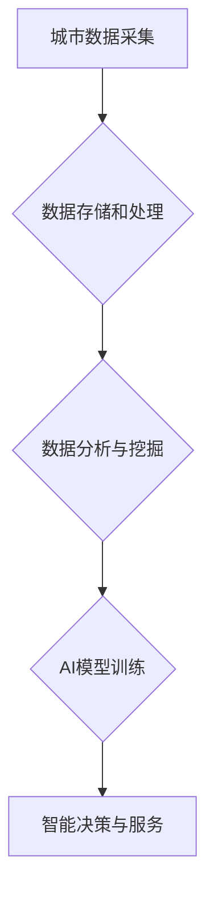

                 

## 关键词：人工智能、城市计算、可持续发展、交通系统、优化算法、机器学习、数据分析

## 1. 背景介绍

随着全球人口的持续增长和城市化的加速，城市面临着日益严峻的挑战，包括交通拥堵、环境污染、资源短缺等。传统的人工管理模式已难以有效应对这些复杂问题。人工智能（AI）技术的快速发展为城市治理和可持续发展提供了新的机遇。

城市计算作为城市智能化发展的重要组成部分，通过对城市数据进行收集、分析和处理，为城市管理决策提供科学依据。AI技术与城市计算的结合，能够实现对城市复杂系统的智能感知、预测和控制，从而打造更加高效、便捷、可持续的城市生活模式和交通系统。

## 2. 核心概念与联系

### 2.1 城市计算

城市计算是指利用信息技术和计算能力，对城市数据进行收集、分析、处理和应用，以实现城市管理、服务和决策的智能化。

城市计算的核心要素包括：

* **数据采集:** 通过传感器、摄像头、移动设备等多种方式收集城市各方面的实时数据，例如交通流量、环境质量、公共设施使用情况等。
* **数据存储和处理:** 建立高效的数据存储和处理平台，对海量城市数据进行清洗、整合、分析和挖掘。
* **数据应用:** 将分析结果转化为可操作的决策信息，应用于城市规划、交通管理、环境保护、公共安全等领域。

### 2.2 人工智能

人工智能是指模拟人类智能行为的计算机系统。AI技术涵盖了多个领域，例如机器学习、深度学习、自然语言处理、计算机视觉等。

AI技术在城市计算中的应用，主要体现在以下几个方面：

* **智能感知:** 利用机器学习算法对城市数据进行分析，识别城市运行状态和潜在问题。
* **预测分析:** 基于历史数据和实时信息，预测城市未来发展趋势和潜在风险。
* **智能决策:** 为城市管理决策提供数据支持，优化资源配置和服务提供。

### 2.3 AI与城市计算的融合

AI技术与城市计算的融合，能够实现城市智能化管理和服务，打造更加高效、便捷、可持续的城市生活模式和交通系统。

**Mermaid 流程图**



## 3. 核心算法原理 & 具体操作步骤

### 3.1 算法原理概述

在城市交通系统中，AI算法可以用于优化交通流量、预测交通拥堵、规划最优路线等。常见的AI算法包括：

* **机器学习算法:** 

例如，支持向量机（SVM）、决策树、随机森林等，可以用于预测交通流量、识别交通异常情况等。

* **深度学习算法:** 

例如，卷积神经网络（CNN）、循环神经网络（RNN）等，可以用于图像识别、语音识别、自然语言处理等，在城市交通系统中可以用于识别交通信号灯、车辆类型、驾驶员行为等。

* **强化学习算法:** 

例如，Q学习、SARSA等，可以用于训练智能交通系统，使其能够根据实时路况动态调整交通信号灯、车辆通行策略等。

### 3.2 算法步骤详解

以交通流量预测为例，使用机器学习算法进行预测的具体步骤如下：

1. **数据收集:** 收集历史交通流量数据，包括时间、地点、交通流量等信息。
2. **数据预处理:** 对收集到的数据进行清洗、转换、特征工程等处理，使其适合机器学习算法的训练。
3. **模型选择:** 选择合适的机器学习算法，例如线性回归、支持向量机等。
4. **模型训练:** 使用训练数据对选定的模型进行训练，调整模型参数，使其能够准确预测交通流量。
5. **模型评估:** 使用测试数据对训练好的模型进行评估，评估模型的预测精度。
6. **模型部署:** 将训练好的模型部署到实际应用环境中，用于实时预测交通流量。

### 3.3 算法优缺点

**优点:**

* **高精度:** 机器学习算法能够学习复杂的非线性关系，实现对交通流量的准确预测。
* **实时性:** 

机器学习模型可以实时更新，根据实时路况进行预测。
* **可扩展性:** 

机器学习算法可以处理海量数据，适用于大规模城市交通系统的预测。

**缺点:**

* **数据依赖:** 

机器学习算法的性能依赖于训练数据的质量和数量。
* **解释性差:** 

一些机器学习算法的决策过程难以解释，难以理解模型的预测结果。
* **模型更新:** 

随着城市交通环境的变化，模型需要定期更新，才能保持预测精度。

### 3.4 算法应用领域

AI算法在城市交通系统中的应用领域广泛，包括：

* **交通流量预测:** 预测道路交通流量，为交通管理提供决策依据。
* **交通拥堵缓解:** 

根据实时路况，优化交通信号灯控制策略，缓解交通拥堵。
* **智能导航:** 提供实时路况信息和最优导航路线，提高驾驶效率。
* **自动驾驶:** 

开发自动驾驶汽车，实现无人驾驶交通。

## 4. 数学模型和公式 & 详细讲解 & 举例说明

### 4.1 数学模型构建

交通流量预测模型通常采用时间序列分析方法，将交通流量视为一个随时间变化的序列。常用的数学模型包括：

* **ARIMA模型:** 

自回归移动平均模型（ARIMA），用于预测时间序列数据，其核心思想是利用历史数据中的自相关性和偏自相关性来预测未来值。

* **SARIMA模型:** 

季节性ARIMA模型（SARIMA），扩展了ARIMA模型，能够处理具有季节性特征的时间序列数据。

* **LSTM模型:** 

长短期记忆网络（LSTM），一种深度学习算法，能够学习时间序列数据中的长期依赖关系，适用于预测复杂的时间序列数据。

### 4.2 公式推导过程

ARIMA模型的公式推导过程较为复杂，这里只列出其核心公式：

$$
y_t = c + \phi_1 y_{t-1} + \phi_2 y_{t-2} + ... + \phi_p y_{t-p} + \theta_1 \epsilon_{t-1} + \theta_2 \epsilon_{t-2} + ... + \theta_q \epsilon_{t-q} + \epsilon_t
$$

其中：

* $y_t$ 表示时间t的交通流量值。
* $c$ 表示截距项。
* $\phi_i$ 表示自回归系数。
* $p$ 表示自回归阶数。
* $\theta_i$ 表示移动平均系数。
* $q$ 表示移动平均阶数。
* $\epsilon_t$ 表示时间t的随机误差项。

### 4.3 案例分析与讲解

假设我们想要预测某条道路的交通流量，可以使用ARIMA模型进行预测。首先，我们需要收集该道路的历史交通流量数据，然后根据数据特征选择合适的ARIMA模型参数（p, d, q）。最后，使用训练好的ARIMA模型对未来时间段的交通流量进行预测。

## 5. 项目实践：代码实例和详细解释说明

### 5.1 开发环境搭建

* **操作系统:** Linux/Windows/macOS
* **编程语言:** Python
* **库依赖:** pandas, numpy, scikit-learn, matplotlib

### 5.2 源代码详细实现

```python
import pandas as pd
from sklearn.model_selection import train_test_split
from sklearn.linear_model import LinearRegression
from sklearn.metrics import mean_squared_error

# 数据加载
data = pd.read_csv('traffic_data.csv')

# 数据预处理
# ...

# 特征选择
X = data[['hour', 'weekday', 'holiday']]
y = data['traffic_volume']

# 数据分割
X_train, X_test, y_train, y_test = train_test_split(X, y, test_size=0.2, random_state=42)

# 模型训练
model = LinearRegression()
model.fit(X_train, y_train)

# 模型预测
y_pred = model.predict(X_test)

# 模型评估
mse = mean_squared_error(y_test, y_pred)
print(f'Mean Squared Error: {mse}')

# ...
```

### 5.3 代码解读与分析

* 数据加载：使用pandas库读取交通流量数据。
* 数据预处理：对数据进行清洗、转换、特征工程等处理。
* 特征选择：选择与交通流量相关的特征作为模型输入。
* 数据分割：将数据分为训练集和测试集。
* 模型训练：使用线性回归模型训练模型。
* 模型预测：使用训练好的模型对测试集数据进行预测。
* 模型评估：使用均方误差（MSE）评估模型的预测精度。

### 5.4 运行结果展示

运行代码后，会输出模型的预测精度，例如MSE值。

## 6. 实际应用场景

### 6.1 交通流量预测

AI算法可以用于预测城市道路的交通流量，为交通管理部门提供决策依据，例如优化交通信号灯控制策略、调整道路限行措施等。

### 6.2 交通拥堵缓解

AI算法可以根据实时路况信息，动态调整交通信号灯控制策略，优化车辆通行路线，缓解交通拥堵。

### 6.3 智能导航

AI算法可以提供实时路况信息和最优导航路线，帮助驾驶员避开拥堵路段，提高驾驶效率。

### 6.4 未来应用展望

未来，AI技术在城市交通系统中的应用将更加广泛，例如：

* **自动驾驶:** 

AI技术将推动自动驾驶汽车的普及，实现无人驾驶交通。
* **智能交通管理:** 

AI技术将实现对城市交通系统的智能化管理，优化交通资源配置，提高交通效率。
* **绿色出行:** 

AI技术将促进绿色出行的发展，例如智能公交系统、共享单车系统等。

## 7. 工具和资源推荐

### 7.1 学习资源推荐

* **在线课程:** Coursera, edX, Udacity 等平台提供人工智能、机器学习等相关课程。
* **书籍:** 《深度学习》、《机器学习实战》等书籍。
* **开源项目:** TensorFlow, PyTorch 等开源机器学习框架。

### 7.2 开发工具推荐

* **Python:** 

Python 是机器学习和数据分析的常用编程语言。
* **Jupyter Notebook:** Jupyter Notebook 是交互式编程环境，方便进行数据分析和模型开发。
* **IDE:** VS Code, PyCharm 等集成开发环境。

### 7.3 相关论文推荐

* **交通流量预测:** "Deep Learning for Traffic Flow Prediction"
* **交通拥堵缓解:** "Reinforcement Learning for Traffic Signal Control"
* **智能导航:** "End-to-End Learning for Autonomous Driving"

## 8. 总结：未来发展趋势与挑战

### 8.1 研究成果总结

AI技术在城市交通系统中的应用取得了显著成果，例如交通流量预测、交通拥堵缓解、智能导航等。

### 8.2 未来发展趋势

未来，AI技术在城市交通系统中的应用将更加智能化、个性化、可持续化。

* **更精准的预测:** 

利用更先进的机器学习算法和数据分析技术，实现对交通流量的更精准预测。
* **更智能的控制:** 

利用强化学习算法，实现对交通信号灯、车辆通行策略等智能化控制。
* **更个性化的服务:** 

根据用户的出行需求和偏好，提供个性化的导航路线、出行建议等服务。

### 8.3 面临的挑战

AI技术在城市交通系统中的应用也面临着一些挑战：

* **数据安全:** 

城市交通数据涉及到个人隐私信息，需要确保数据的安全性和隐私保护。
* **算法解释性:** 

一些AI算法的决策过程难以解释，难以理解模型的预测结果，需要提高算法的解释性。
* **模型可维护性:** 

随着城市交通环境的变化，模型需要定期更新，需要提高模型的可维护性和可扩展性。

### 8.4 研究展望

未来，需要加强对AI技术在城市交通系统中的应用研究，解决上述挑战，推动AI技术在城市交通领域的创新发展。

## 9. 附录：常见问题与解答

**Q1: AI技术是否会取代人类交通管理人员？**

**A1:** AI技术可以辅助人类交通管理人员，提高工作效率，但不会完全取代人类。人类的经验、判断力和决策能力仍然不可替代。

**Q2: AI技术在城市交通系统中的应用需要哪些数据支持？**

**A2:** AI技术在城市交通系统中的应用需要大量的城市交通数据，例如交通流量、路况信息、车辆位置、驾驶员行为等。

**Q3: 如何确保AI技术在城市交通系统中的安全性和可靠性？**

**A3:** 

需要严格测试和验证AI算法的性能，并建立相应的安全保障机制，确保AI技术在城市交通系统中的安全性和可靠性。


作者：禅与计算机程序设计艺术 / Zen and the Art of Computer Programming<end_of_turn>

