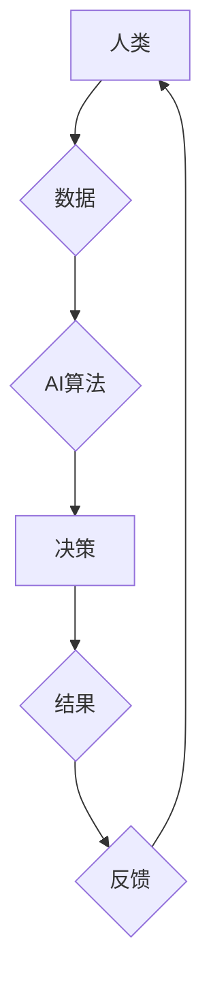

                 

## AI与人类计算：道德、伦理和社会影响

> 关键词：人工智能、人类计算、道德、伦理、社会影响、算法偏见、透明度、可解释性、责任

### 1. 背景介绍

人工智能（AI）正以惊人的速度发展，从自动驾驶汽车到医疗诊断，AI技术正在改变着我们生活的方方面面。然而，随着AI技术的进步，也引发了广泛的讨论，关于AI对人类社会的影响，特别是其道德、伦理和社会责任方面的挑战。

人类计算是指人类参与到计算过程中的活动，包括人类的决策、判断、推理和创造力。传统上，计算主要由计算机完成，但随着AI的兴起，人类和计算机的合作计算模式日益重要。AI可以帮助人类处理大量数据、识别模式和做出预测，而人类则可以提供批判性思维、创造力和情感智能，以引导和监督AI的决策。

然而，这种合作关系也带来了新的挑战。AI算法的决策过程往往是复杂的，难以理解，这使得我们难以判断AI的决策是否公平、公正和透明。此外，AI算法可能会受到训练数据中的偏见影响，导致歧视性或不公平的结果。因此，我们需要认真思考AI与人类计算的道德、伦理和社会影响，并制定相应的规范和机制，以确保AI技术能够安全、负责任地发展。

### 2. 核心概念与联系

**2.1 人工智能与人类计算的融合**

AI与人类计算的融合是指将人工智能技术与人类的认知能力相结合，以实现更智能、更有效的计算。

**2.2 算法偏见与公平性**

算法偏见是指AI算法在训练过程中受到数据中的偏见影响，导致歧视性或不公平的结果。

**2.3 透明度与可解释性**

透明度是指AI算法的决策过程可以被理解和解释，而可解释性是指能够解释AI算法如何做出特定决策的原因。

**2.4 责任与问责制**

在AI系统中，需要明确责任和问责制，以确保AI技术的负责任使用。

**Mermaid 流程图**



### 3. 核心算法原理 & 具体操作步骤

**3.1 算法原理概述**

机器学习算法是AI的核心，它通过学习数据中的模式来进行预测和决策。常见的机器学习算法包括监督学习、无监督学习和强化学习。

* **监督学习:**  训练模型使用标记数据，即输入数据和对应的输出标签。模型学习输入与输出之间的关系，以便在新的输入数据上进行预测。
* **无监督学习:**  训练模型使用未标记数据，即只有输入数据，没有输出标签。模型学习数据中的隐藏模式和结构。
* **强化学习:**  训练模型通过与环境交互，获得奖励或惩罚。模型学习如何采取行动以最大化奖励。

**3.2 算法步骤详解**

1. **数据收集和预处理:** 收集相关数据，并进行清洗、转换和特征工程等预处理操作。
2. **模型选择:** 根据任务需求选择合适的机器学习算法。
3. **模型训练:** 使用训练数据训练模型，调整模型参数以最小化预测误差。
4. **模型评估:** 使用测试数据评估模型的性能，例如准确率、召回率和F1-score。
5. **模型部署:** 将训练好的模型部署到实际应用场景中。

**3.3 算法优缺点**

* **优点:** 能够学习复杂数据模式，自动提取特征，提高预测精度。
* **缺点:** 需要大量数据进行训练，训练过程可能耗时，模型解释性较差。

**3.4 算法应用领域**

* **图像识别:** 人脸识别、物体检测、图像分类。
* **自然语言处理:** 文本分类、情感分析、机器翻译。
* **推荐系统:** 产品推荐、内容推荐、用户画像。
* **医疗诊断:** 疾病预测、影像分析、药物研发。

### 4. 数学模型和公式 & 详细讲解 & 举例说明

**4.1 数学模型构建**

机器学习算法通常使用数学模型来表示数据之间的关系。例如，线性回归模型使用线性方程来预测连续变量的值：

$$y = mx + c$$

其中，$y$ 是预测值，$x$ 是输入变量，$m$ 是斜率，$c$ 是截距。

**4.2 公式推导过程**

机器学习算法的训练过程通常涉及优化模型参数以最小化预测误差。常用的优化算法包括梯度下降法和随机梯度下降法。

梯度下降法通过迭代更新模型参数，沿着误差梯度的负方向移动，以找到最小误差点。

**4.3 案例分析与讲解**

假设我们有一个数据集，包含房屋面积和房屋价格的信息。我们可以使用线性回归模型来预测房屋价格。

训练数据：

| 房屋面积 (平方米) | 房屋价格 (万元) |
|---|---|
| 60 | 100 |
| 80 | 150 |
| 100 | 200 |
| 120 | 250 |

使用梯度下降法训练线性回归模型，我们可以得到以下模型参数：

* $m = 1.5$
* $c = 50$

因此，预测房屋面积为 110 平方米的房屋价格为：

$$y = 1.5 * 110 + 50 = 215$$

### 5. 项目实践：代码实例和详细解释说明

**5.1 开发环境搭建**

使用 Python 语言和 TensorFlow 或 PyTorch 等深度学习框架进行开发。

**5.2 源代码详细实现**

```python
import tensorflow as tf

# 定义模型
model = tf.keras.Sequential([
    tf.keras.layers.Dense(64, activation='relu', input_shape=(1,)),
    tf.keras.layers.Dense(1)
])

# 编译模型
model.compile(optimizer='adam', loss='mse')

# 训练模型
model.fit(x_train, y_train, epochs=100)

# 预测
predictions = model.predict(x_new)
```

**5.3 代码解读与分析**

* 使用 TensorFlow 框架定义一个简单的线性回归模型。
* 模型包含两个全连接层，第一层有 64 个神经元，使用 ReLU 激活函数，输入维度为 1。
* 第二层只有一个神经元，用于预测房屋价格。
* 使用 Adam 优化器和均方误差损失函数训练模型。
* 训练模型 100 个 epochs。
* 使用训练好的模型预测新的房屋面积。

**5.4 运行结果展示**

训练完成后，可以评估模型的性能，例如使用测试数据计算预测误差。

### 6. 实际应用场景

**6.1 医疗诊断**

AI可以帮助医生分析医学影像，识别疾病，辅助诊断。

**6.2 金融风险管理**

AI可以分析金融数据，识别欺诈行为，评估风险。

**6.3 自动驾驶**

AI可以帮助汽车感知周围环境，做出驾驶决策。

**6.4 未来应用展望**

AI技术将继续发展，在更多领域发挥作用，例如个性化教育、智能家居、科学研究等。

### 7. 工具和资源推荐

**7.1 学习资源推荐**

* **书籍:**
    * 《深度学习》
    * 《机器学习实战》
* **在线课程:**
    * Coursera
    * edX
    * Udacity

**7.2 开发工具推荐**

* **Python:** 
* **TensorFlow:** 
* **PyTorch:** 

**7.3 相关论文推荐**

* **《ImageNet Classification with Deep Convolutional Neural Networks》**
* **《Attention Is All You Need》**

### 8. 总结：未来发展趋势与挑战

**8.1 研究成果总结**

AI技术取得了显著进展，在多个领域取得了突破性成果。

**8.2 未来发展趋势**

* **模型更加强大:** 模型规模和能力将继续提升。
* **解释性更强:** 研究更易于理解和解释AI模型的决策过程。
* **更广泛的应用:** AI技术将应用于更多领域。

**8.3 面临的挑战**

* **算法偏见:** 算法可能受到训练数据中的偏见影响，导致歧视性或不公平的结果。
* **透明度和可解释性:** AI模型的决策过程往往是复杂的，难以理解。
* **责任和问责制:** 在AI系统中，需要明确责任和问责制。

**8.4 研究展望**

未来需要加强对AI伦理、社会影响和安全性的研究，制定相应的规范和机制，确保AI技术能够安全、负责任地发展。

### 9. 附录：常见问题与解答

**9.1 如何解决算法偏见问题？**

* 使用更加多样化和代表性的训练数据。
* 开发算法去偏见技术，例如公平学习算法。
* 定期评估算法的公平性，并进行调整。

**9.2 如何提高AI模型的透明度和可解释性？**

* 使用可解释性AI模型，例如规则模型或决策树。
* 开发可视化工具，帮助理解AI模型的决策过程。
* 使用案例分析和解释性报告，解释AI模型的决策结果。


作者：禅与计算机程序设计艺术 / Zen and the Art of Computer Programming 
<end_of_turn>

