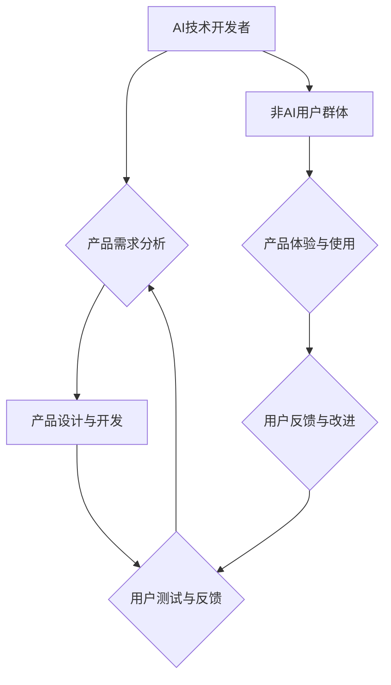

                 

## AI产品与服务的圈子：自我消化需求，拓展非AI用户群体

> 关键词：人工智能、AI产品、AI服务、用户需求、非AI用户、市场拓展、产品设计、技术落地

## 1. 背景介绍

人工智能（AI）技术近年来发展迅速，已渗透到生活的方方面面。从智能手机的语音助手到自动驾驶汽车，AI产品和服务正在改变着我们的生活方式。然而，尽管AI技术取得了显著进展，但其应用场景仍然主要集中在技术领域和特定行业。如何将AI技术推广到更广泛的领域，让非AI用户群体也能感受到AI带来的便利，是当前AI产业面临的重要挑战。

目前，许多AI产品和服务的设计往往过于依赖技术本身，忽视了用户需求和体验。一些AI产品过于复杂，操作门槛高，难以被普通用户接受。此外，AI产品的宣传和推广也往往过于强调技术的先进性，缺乏对用户实际需求的深入理解。

## 2. 核心概念与联系

**2.1 AI产品与服务的定义**

AI产品是指利用人工智能技术开发的软件产品，能够自动完成特定任务，并提供智能化的用户体验。AI服务是指利用人工智能技术提供的数据分析、预测、决策等服务，帮助用户解决实际问题。

**2.2 用户需求与AI产品/服务的匹配**

AI产品和服务的设计应以用户需求为中心，充分理解用户的痛点和需求，并提供切实可行的解决方案。

**2.3 非AI用户群体的特点**

非AI用户群体通常对AI技术了解不多，对AI产品的期望也相对较低。他们更关注AI产品的实用性、易用性和安全性。

**2.4  AI产品/服务的圈子**

AI产品/服务的圈子是指围绕AI产品和服务展开的生态系统，包括AI技术开发者、产品经理、设计师、用户体验专家、市场营销人员等。

**2.5  AI产品/服务的圈子与非AI用户群体的连接**

AI产品/服务的圈子需要与非AI用户群体建立有效的连接，才能将AI技术推广到更广泛的领域。

**Mermaid 流程图**



## 3. 核心算法原理 & 具体操作步骤

**3.1 算法原理概述**

在AI产品和服务的设计中，许多算法被广泛应用，例如机器学习、深度学习、自然语言处理等。这些算法能够帮助AI系统自动学习数据，识别模式，并做出预测或决策。

**3.2 算法步骤详解**

以机器学习为例，其基本步骤包括：

1. 数据收集和预处理：收集相关数据并进行清洗、转换、特征提取等预处理工作。
2. 模型选择：根据任务需求选择合适的机器学习模型，例如线性回归、决策树、支持向量机等。
3. 模型训练：使用训练数据训练模型，调整模型参数，使模型能够准确地预测或分类。
4. 模型评估：使用测试数据评估模型的性能，例如准确率、召回率、F1-score等。
5. 模型部署：将训练好的模型部署到实际应用场景中，用于预测或分类新的数据。

**3.3 算法优缺点**

不同的算法具有不同的优缺点，需要根据具体任务需求选择合适的算法。例如，线性回归算法简单易实现，但对数据线性关系要求较高；决策树算法能够处理非线性关系，但容易过拟合；支持向量机算法能够处理高维数据，但训练时间较长。

**3.4 算法应用领域**

机器学习算法广泛应用于各个领域，例如：

* **图像识别:** 用于识别图像中的物体、场景、人脸等。
* **自然语言处理:** 用于理解和生成自然语言，例如机器翻译、文本摘要、情感分析等。
* **推荐系统:** 用于根据用户的历史行为推荐相关商品或内容。
* **预测分析:** 用于预测未来趋势，例如销售预测、风险评估等。

## 4. 数学模型和公式 & 详细讲解 & 举例说明

**4.1 数学模型构建**

在AI产品和服务的设计中，数学模型是描述系统行为和关系的重要工具。例如，在机器学习中，模型参数的更新过程可以用梯度下降算法来描述，其数学公式如下：

$$
\theta = \theta - \alpha \nabla J(\theta)
$$

其中：

* $\theta$ 是模型参数
* $\alpha$ 是学习率
* $J(\theta)$ 是损失函数，用于衡量模型预测结果与真实值的差异
* $\nabla J(\theta)$ 是损失函数的梯度，表示模型参数变化的方向

**4.2 公式推导过程**

梯度下降算法的基本原理是通过不断迭代更新模型参数，使损失函数的值最小化。梯度方向表示损失函数下降最快的方向，学习率控制了参数更新的步长。

**4.3 案例分析与讲解**

例如，在训练一个图像分类模型时，损失函数可以定义为预测结果与真实标签之间的交叉熵。梯度下降算法会计算损失函数的梯度，并根据梯度方向更新模型参数，最终使模型能够准确地分类图像。

## 5. 项目实践：代码实例和详细解释说明

**5.1 开发环境搭建**

使用Python语言开发AI产品和服务，需要搭建相应的开发环境，包括安装Python解释器、机器学习库（例如TensorFlow、PyTorch）以及其他必要的工具。

**5.2 源代码详细实现**

以下是一个简单的机器学习代码实例，用于预测房价：

```python
import pandas as pd
from sklearn.linear_model import LinearRegression
from sklearn.model_selection import train_test_split

# 加载房价数据
data = pd.read_csv('house_price.csv')

# 选择特征和目标变量
features = ['size', 'location']
target = 'price'

# 将数据分为训练集和测试集
X_train, X_test, y_train, y_test = train_test_split(data[features], data[target], test_size=0.2)

# 创建线性回归模型
model = LinearRegression()

# 训练模型
model.fit(X_train, y_train)

# 使用模型预测测试集数据
y_pred = model.predict(X_test)

# 评估模型性能
print('模型准确率:', model.score(X_test, y_test))
```

**5.3 代码解读与分析**

这段代码首先加载房价数据，然后选择特征和目标变量。接着，将数据分为训练集和测试集，并创建线性回归模型。最后，使用模型训练数据，并预测测试集数据，并评估模型性能。

**5.4 运行结果展示**

运行这段代码后，会输出模型的准确率，例如：

```
模型准确率: 0.85
```

这表示模型在预测测试集数据时，准确率为85%。

## 6. 实际应用场景

**6.1 智能客服系统**

AI产品和服务可以应用于智能客服系统，例如聊天机器人，能够自动回答用户常见问题，提高客服效率。

**6.2 个性化推荐系统**

AI产品和服务可以应用于个性化推荐系统，例如电商平台的商品推荐，能够根据用户的历史行为和偏好推荐相关商品。

**6.3 自动化办公流程**

AI产品和服务可以应用于自动化办公流程，例如文档处理、数据分析等，提高工作效率。

**6.4 医疗诊断辅助系统**

AI产品和服务可以应用于医疗诊断辅助系统，例如图像识别、病症预测等，辅助医生进行诊断。

**6.5 未来应用展望**

随着AI技术的不断发展，AI产品和服务将应用到更多领域，例如自动驾驶、机器人、教育、娱乐等。

## 7. 工具和资源推荐

**7.1 学习资源推荐**

* **在线课程:** Coursera、edX、Udacity等平台提供丰富的AI课程。
* **书籍:** 《深度学习》、《机器学习实战》等书籍是学习AI的基础教材。
* **开源项目:** TensorFlow、PyTorch等开源项目提供了丰富的代码示例和学习资源。

**7.2 开发工具推荐**

* **Python:** Python是AI开发最常用的编程语言。
* **Jupyter Notebook:** Jupyter Notebook是一个交互式编程环境，方便进行AI开发和实验。
* **IDE:** PyCharm、VS Code等IDE可以提高AI开发效率。

**7.3 相关论文推荐**

* **《ImageNet Classification with Deep Convolutional Neural Networks》**
* **《Attention Is All You Need》**
* **《BERT: Pre-training of Deep Bidirectional Transformers for Language Understanding》**

## 8. 总结：未来发展趋势与挑战

**8.1 研究成果总结**

近年来，AI技术取得了显著进展，例如深度学习、自然语言处理等领域取得了突破性进展。

**8.2 未来发展趋势**

未来，AI技术将朝着更加智能化、自动化、个性化的方向发展，例如：

* **增强现实 (AR) 和虚拟现实 (VR) 的融合:** AI将与AR和VR技术融合，创造更加沉浸式的用户体验。
* **边缘计算和云计算的结合:** AI将部署到边缘设备，实现更快速的响应和更低的延迟。
* **跨模态学习:** AI将能够理解和处理多种数据类型，例如文本、图像、音频等。

**8.3 面临的挑战**

AI技术的发展也面临着一些挑战，例如：

* **数据安全和隐私保护:** AI模型的训练需要大量数据，如何保证数据安全和隐私保护是一个重要问题。
* **算法可解释性和公平性:** 许多AI算法是黑箱模型，难以解释其决策过程，如何提高算法的可解释性和公平性是一个重要的研究方向。
* **伦理问题:** AI技术的应用可能带来一些伦理问题，例如算法偏见、工作岗位替代等，需要社会各界共同探讨和解决。

**8.4 研究展望**

未来，AI技术将继续发展，为人类社会带来更多福祉。我们需要加强对AI技术的理解和研究，并积极应对AI技术带来的挑战，确保AI技术能够安全、有效地服务于人类。

## 9. 附录：常见问题与解答

**9.1 如何选择合适的AI算法？**

选择合适的AI算法需要根据具体任务需求和数据特点进行选择。例如，对于分类任务，可以考虑使用决策树、支持向量机等算法；对于回归任务，可以考虑使用线性回归、神经网络等算法。

**9.2 如何评估AI模型的性能？**

AI模型的性能可以通过多种指标进行评估，例如准确率、召回率、F1-score、AUC等。

**9.3 如何解决AI算法的过拟合问题？**

过拟合是指AI模型在训练数据上表现良好，但在测试数据上表现较差。解决过拟合问题的方法包括：

* 使用更小的模型
* 使用正则化技术
* 使用交叉验证

**9.4 如何保证AI模型的公平性？**

AI模型的公平性是指模型对不同群体的人进行预测时，结果是公平的。保证AI模型的公平性需要从数据收集、模型训练、模型部署等各个环节进行考虑。

**9.5 如何应对AI技术带来的伦理问题？**

AI技术的发展可能带来一些伦理问题，例如算法偏见、工作岗位替代等。应对这些问题需要社会各界共同探讨和解决，制定相应的法律法规和伦理规范。


作者：禅与计算机程序设计艺术 / Zen and the Art of Computer Programming 
<end_of_turn>

