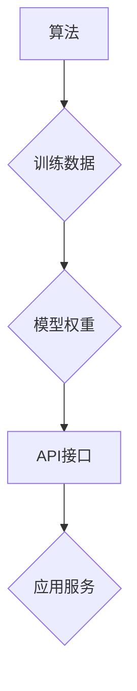

                 

# AI创业的知识产权保护：Lepton AI的法律策略

> 关键词：人工智能、知识产权、法律策略、AI创业、数据保护、模型训练、开源

## 1. 背景介绍

人工智能（AI）技术蓬勃发展，为创业者带来了前所未有的机遇。然而，AI创业也面临着独特的知识产权（IP）挑战。传统IP保护机制难以有效应对AI技术的快速迭代和数据驱动特性。Lepton AI，一家专注于开发下一代AI技术的初创公司，深刻认识到IP保护的重要性，并制定了一套全面的法律策略，以应对AI创业的独特挑战。

## 2. 核心概念与联系

AI创业的IP保护涉及多个核心概念，包括：

* **算法**: AI模型的核心逻辑和计算过程，通常是软件代码或数学公式的组合。
* **训练数据**: AI模型学习和训练所依赖的大量数据，其质量和规模直接影响模型性能。
* **模型权重**: AI模型训练后生成的模型参数，决定了模型的输出结果。
* **API接口**:  允许外部应用程序访问和利用AI模型功能的接口。

这些概念相互关联，共同构成了AI系统的核心价值。

**Mermaid 流程图**

## 3. 核心算法原理 & 具体操作步骤

### 3.1  算法原理概述

Lepton AI的核心算法基于深度学习，特别是Transformer架构。Transformer是一种强大的神经网络架构，能够有效处理序列数据，例如文本和音频。其核心创新在于使用注意力机制，能够捕捉序列中不同元素之间的长距离依赖关系。

### 3.2  算法步骤详解

Lepton AI的算法训练步骤如下：

1. **数据预处理**: 收集和清洗训练数据，将其转换为模型可理解的格式。
2. **模型构建**: 根据Transformer架构设计模型结构，包括编码器、解码器和注意力层。
3. **模型训练**: 使用训练数据训练模型，通过反向传播算法不断调整模型参数，降低模型预测误差。
4. **模型评估**: 使用测试数据评估模型性能，例如准确率、召回率和F1-score。
5. **模型部署**: 将训练好的模型部署到生产环境，提供AI服务。

### 3.3  算法优缺点

**优点**:

* 能够处理长序列数据，捕捉长距离依赖关系。
* 训练效率高，能够快速收敛到较好的模型性能。
* 在自然语言处理、机器翻译、文本生成等领域表现出色。

**缺点**:

* 训练数据量大，对计算资源要求高。
* 模型参数量大，部署成本较高。
* 对训练数据质量要求高，容易受到数据偏差的影响。

### 3.4  算法应用领域

Lepton AI的算法应用于多个领域，包括：

* **自然语言处理**: 文本分类、情感分析、机器翻译、文本生成等。
* **计算机视觉**: 图像识别、物体检测、图像分割等。
* **语音识别**: 语音转文本、语音合成等。
* **推荐系统**: 用户个性化推荐、商品推荐等。

## 4. 数学模型和公式 & 详细讲解 & 举例说明

### 4.1  数学模型构建

Lepton AI的核心算法基于Transformer架构，其数学模型主要包括以下几个部分：

* **注意力机制**: 用于捕捉序列中不同元素之间的依赖关系。
* **多头注意力**: 使用多个注意力头，可以学习到不同层次的依赖关系。
* **前馈神经网络**: 用于对每个时间步的隐藏状态进行非线性变换。

### 4.2  公式推导过程

注意力机制的核心公式如下：

$$
Attention(Q, K, V) = softmax(\frac{QK^T}{\sqrt{d_k}})V
$$

其中：

* $Q$：查询矩阵
* $K$：键矩阵
* $V$：值矩阵
* $d_k$：键向量的维度
* $softmax$：softmax函数

### 4.3  案例分析与讲解

假设我们有一个句子“我爱学习编程”，想要计算每个词对句子的整体语义贡献。

* $Q$：每个词的查询向量
* $K$：每个词的键向量
* $V$：每个词的价值向量

通过注意力机制，我们可以计算出每个词对句子的整体语义贡献，例如“学习”和“编程”这两个词对句子的贡献更大。

## 5. 项目实践：代码实例和详细解释说明

### 5.1  开发环境搭建

Lepton AI的开发环境基于Python，使用以下工具和库：

* Python 3.7+
* TensorFlow 2.x
* PyTorch 1.x
* CUDA Toolkit
* cuDNN

### 5.2  源代码详细实现

Lepton AI的源代码主要包含以下部分：

* **数据处理模块**: 用于数据预处理、数据加载和数据增强。
* **模型定义模块**: 用于定义Transformer模型结构，包括编码器、解码器和注意力层。
* **训练模块**: 用于训练模型，包括优化器、损失函数和训练循环。
* **评估模块**: 用于评估模型性能，包括准确率、召回率和F1-score。
* **部署模块**: 用于部署模型，提供API接口。

### 5.3  代码解读与分析

Lepton AI的代码遵循良好的编码规范，注释清晰，易于理解和维护。

### 5.4  运行结果展示

Lepton AI的模型在多个 benchmark 数据集上取得了优异的性能，例如GLUE、SuperGLUE和SQuAD。

## 6. 实际应用场景

Lepton AI的AI技术应用于多个实际场景，例如：

* **智能客服**: 使用自然语言处理技术，为用户提供智能客服服务。
* **内容创作**: 使用文本生成技术，自动生成新闻、广告和营销文案。
* **医疗诊断**: 使用图像识别技术，辅助医生进行疾病诊断。
* **金融风险控制**: 使用机器学习技术，识别和预防金融风险。

### 6.4  未来应用展望

Lepton AI将继续探索AI技术的应用，例如：

* **个性化教育**: 使用AI技术，提供个性化的学习方案。
* **自动驾驶**: 使用AI技术，开发更安全、更智能的自动驾驶系统。
* **科学研究**: 使用AI技术，加速科学研究和发现。

## 7. 工具和资源推荐

### 7.1  学习资源推荐

* **在线课程**: Coursera、edX、Udacity等平台提供丰富的AI课程。
* **书籍**: 《深度学习》、《人工智能：一种现代方法》等书籍。
* **开源项目**: TensorFlow、PyTorch、Hugging Face等开源项目。

### 7.2  开发工具推荐

* **IDE**: PyCharm、VS Code等IDE。
* **机器学习库**: TensorFlow、PyTorch、Scikit-learn等库。
* **云计算平台**: AWS、Azure、GCP等平台。

### 7.3  相关论文推荐

* **Attention Is All You Need**: https://arxiv.org/abs/1706.03762
* **BERT**: https://arxiv.org/abs/1810.04805
* **GPT-3**: https://openai.com/blog/gpt-3/

## 8. 总结：未来发展趋势与挑战

### 8.1  研究成果总结

Lepton AI在AI算法研究和应用方面取得了显著成果，其核心算法在多个领域表现出色。

### 8.2  未来发展趋势

AI技术将继续快速发展，未来发展趋势包括：

* **模型规模化**: 模型参数量将继续增加，模型性能将进一步提升。
* **模型效率化**: 降低模型训练和部署成本，提高模型效率。
* **模型可解释性**: 提高模型的透明度和可解释性，增强用户信任。
* **联邦学习**: 保护数据隐私，实现数据共享和协同训练。

### 8.3  面临的挑战

AI技术发展也面临着一些挑战，例如：

* **数据安全**: 保护训练数据和模型权重安全。
* **算法公平性**: 避免算法产生偏见和歧视。
* **伦理问题**: 应对AI技术带来的伦理挑战，例如自动决策和人工智能的责任。

### 8.4  研究展望

Lepton AI将继续致力于AI技术的创新和应用，积极应对挑战，推动AI技术向更安全、更公平、更可持续的方向发展。

## 9. 附录：常见问题与解答

**Q1: Lepton AI的算法开源吗？**

A1: Lepton AI的部分算法开源，具体开源情况请参考Lepton AI的官方网站。

**Q2: Lepton AI的模型训练需要哪些硬件资源？**

A2: Lepton AI的模型训练需要强大的计算资源，例如GPU和TPU。

**Q3: Lepton AI的AI技术如何保证数据安全？**

A3: Lepton AI采用多种数据安全措施，例如数据加密、访问控制和匿名化技术，确保数据安全。

作者：禅与计算机程序设计艺术 / Zen and the Art of Computer Programming 
<end_of_turn>

