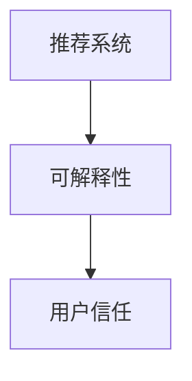

                 

# 推荐系统的可解释性：用户的信任

## 1. 背景介绍

随着个性化推荐系统在电商、媒体、社交平台等各领域的广泛应用，用户体验成为推荐系统成功与否的关键因素。然而，推荐系统内部的决策逻辑往往复杂而晦涩，用户难以理解和信任，进而产生“冷暴力”——推荐结果虽然精准，却未能赢得用户的喜爱和信任。因此，推荐系统的可解释性(Explainability)成为当前研究的重要方向，成为用户信任推荐系统的基础。

### 1.1 问题由来

推荐系统在传统应用中往往仅侧重于模型精度和用户满意度，而忽视了模型的解释性和透明度。用户信任的缺失不仅导致系统难以获得持续的商业价值，也限制了推荐系统的进一步发展。例如：
- 用户无法理解推荐结果的来源和生成过程，难以区分哪些推荐是因为用户的主观偏好，哪些是系统算法的作用。
- 推荐系统在遭遇负面事件（如推荐错误商品导致消费者不满意）时，用户容易将责任归咎于算法，产生抵触情绪。
- 没有解释机制，推荐系统的算力和成本投入难以在学术界和工业界之间形成共识，难以进行有效的技术评估和改进。

### 1.2 问题核心关键点

推荐系统可解释性的关键在于：
- 用户能够理解推荐系统的工作机制和决策依据，知晓推荐结果的来源和生成过程。
- 推荐系统的决策过程可被验证和复制，具备可复现性和可靠性。
- 推荐系统能够承受外部质疑，支持算法审查和用户申诉，确保算法的透明度和公信力。

为了解决上述问题，本研究聚焦于用户对推荐系统的信任度，并提出了一系列可解释性措施，以提高用户对推荐系统的信任和满意度。

## 2. 核心概念与联系

### 2.1 核心概念概述

推荐系统的可解释性研究，涉及以下核心概念：

- 推荐系统(Recommendation System)：通过分析用户历史行为数据，为用户推荐个性化物品的系统。常见的推荐方法包括基于内容的推荐、协同过滤推荐、混合推荐等。
- 可解释性(Explainability)：推荐系统能够透明地展示决策过程，使得用户理解推荐依据，增强用户信任。
- 用户信任(User Trust)：用户对推荐系统的感知质量、可靠性、安全性等综合评价，是推荐系统应用效果的关键因素。

这些核心概念之间的逻辑关系可以通过以下Mermaid流程图来展示：



这个流程图展示了大语言模型微调的几个核心概念及其之间的关系：

1. 推荐系统通过分析用户数据为用户推荐物品，而推荐系统的可解释性是用户信任的基础。
2. 可解释性旨在使推荐系统决策过程透明，用户能够理解推荐依据。
3. 用户信任源于对推荐系统的可解释性和透明度的信任，是推荐系统效果的直观反馈。

## 3. 核心算法原理 & 具体操作步骤
### 3.1 算法原理概述

推荐系统的可解释性主要围绕以下几个关键问题展开：
- 用户行为数据的解释：解释用户历史行为数据的特征与含义。
- 推荐算法的解释：解释推荐算法在推荐过程中的决策依据。
- 推荐结果的解释：解释推荐结果的生成过程和生成依据。

核心算法原理可归结为以下几点：
1. 特征解释：利用自然语言处理技术，将用户行为数据转换为可理解的文本，帮助用户理解数据含义。
2. 算法解释：通过可视化技术展示推荐算法在推荐过程中的关键参数和决策节点，使决策过程透明。
3. 结果解释：结合用户背景信息，生成推荐结果的详细解释，增强推荐可信度。

### 3.2 算法步骤详解

推荐系统的可解释性实现，一般包括以下几个关键步骤：

**Step 1: 数据收集与预处理**
- 收集用户行为数据，包括浏览记录、购买记录、评分记录等。
- 对数据进行清洗、去重、归一化等预处理，消除噪声和冗余数据。

**Step 2: 特征提取与解释**
- 对用户行为数据进行特征提取，生成高维稀疏特征向量。
- 使用自然语言处理技术将特征向量转换为文本，解释数据含义。

**Step 3: 算法模型训练**
- 选择合适的推荐算法模型，如协同过滤、矩阵分解等，进行训练。
- 在训练过程中，监控模型参数和决策过程，记录关键特征和决策节点。

**Step 4: 结果生成与解释**
- 生成推荐结果，并对结果进行详细解释。
- 结合用户背景信息，生成个性化解释，增强推荐可信度。

**Step 5: 可视化与互动**
- 将推荐系统决策过程可视化，生成图表和报告。
- 设计用户接口，允许用户查看和反馈推荐结果及解释，建立互动机制。

### 3.3 算法优缺点

推荐系统的可解释性具有以下优点：
1. 提高用户满意度：通过透明化决策过程，使用户理解推荐依据，增强用户满意度。
2. 降低算法风险：提供可视化的决策过程和结果解释，减少用户对算法的误解和抵触。
3. 支持用户反馈：通过互动机制收集用户反馈，进一步改进推荐算法。

同时，也存在一些缺点：
1. 成本较高：需要收集和处理大量用户数据，解释性技术开发和维护成本较高。
2. 复杂度高：推荐算法的复杂性和多样性导致解释过程复杂。
3. 隐私风险：解释过程中可能涉及用户隐私数据，需要谨慎处理。

### 3.4 算法应用领域

推荐系统的可解释性在多个领域得到了广泛应用：

- 电商推荐：例如亚马逊的推荐系统，能够向用户解释为什么推荐某件商品，帮助用户理解推荐逻辑。
- 新闻推荐：例如Netflix的推荐系统，在推荐影视作品时，展示作品的基本信息和用户评价，增强用户对推荐结果的信任。
- 金融推荐：例如银行金融推荐系统，通过解释推荐依据，增强用户对推荐内容的信任度。
- 社交媒体推荐：例如Facebook的推荐系统，能够展示推荐依据，增强用户对推荐内容的信任。

## 4. 数学模型和公式 & 详细讲解 & 举例说明

### 4.1 数学模型构建

推荐系统的可解释性研究涉及多个数学模型，以下将重点讲解特征解释模型和算法解释模型。

**特征解释模型**
- 假设用户行为数据为 $X$，生成的高维稀疏特征向量为 $\hat{X}$。
- 特征解释模型 $f: X \rightarrow \hat{X}$ 为将用户行为数据转换为可解释的文本的映射函数。

**算法解释模型**
- 假设推荐算法模型为 $M$，生成的推荐结果为 $Y$。
- 算法解释模型 $g: M \rightarrow G$，其中 $G$ 为可解释的图表和报告集合。

### 4.2 公式推导过程

**特征解释模型推导**
- 假设用户行为数据 $X$ 为 $d$ 维稀疏向量，每个元素 $x_i \in \{0,1\}$。
- 生成的特征向量 $\hat{X}$ 为 $n$ 维稠密向量，每个元素 $\hat{x}_i \in [0,1]$。
- 特征解释模型 $f$ 为线性映射 $f(x) = w \cdot x + b$，其中 $w$ 为权重向量，$b$ 为截距。
- 解释文本 $T$ 由 $\hat{X}$ 生成，通过NLP技术进行自然语言处理，生成可理解的文本描述。

**算法解释模型推导**
- 假设推荐算法模型 $M$ 为协同过滤模型，生成的推荐结果 $Y$ 为 $d$ 维向量。
- 算法解释模型 $g$ 为可视化模型，将决策过程生成可视化图表。
- 假设决策过程包含 $k$ 个关键参数 $\theta_1,\theta_2,\cdots,\theta_k$。
- 生成可视化图表 $G$ 为 $\{\text{Plot}_1, \text{Plot}_2, \cdots, \text{Plot}_k\}$，通过Scatter plot、Box plot、Bar plot等可视化技术呈现决策过程。

### 4.3 案例分析与讲解

**案例1：电商推荐**
- 用户A在某电商平台上浏览了多款运动鞋，系统推荐了一双。
- 特征解释模型将用户浏览行为数据转换为文本：“用户A近期浏览了XX品牌、XX风格的运动鞋”。
- 算法解释模型生成可视化图表，展示推荐算法的关键参数和决策节点。
- 用户A查看解释后，理解推荐依据，增加了对推荐结果的信任。

**案例2：金融推荐**
- 用户B在某金融平台上查看了多款理财产品，系统推荐了一款。
- 特征解释模型将用户理财行为数据转换为文本：“用户B偏好中长期产品，投资风险偏好低”。
- 算法解释模型生成可视化图表，展示推荐算法的关键参数和决策节点。
- 用户B查看解释后，理解推荐依据，增加了对推荐结果的信任。

## 5. 项目实践：代码实例和详细解释说明

### 5.1 开发环境搭建

在进行推荐系统可解释性实践前，我们需要准备好开发环境。以下是使用Python进行推荐系统开发的环境配置流程：

1. 安装Anaconda：从官网下载并安装Anaconda，用于创建独立的Python环境。

2. 创建并激活虚拟环境：
```bash
conda create -n recommendation-env python=3.8 
conda activate recommendation-env
```

3. 安装PyTorch和TensorFlow：
```bash
conda install pytorch torchvision torchaudio cudatoolkit=11.1 -c pytorch -c conda-forge
```

4. 安装各类工具包：
```bash
pip install numpy pandas scikit-learn matplotlib tqdm jupyter notebook ipython
```

完成上述步骤后，即可在`recommendation-env`环境中开始推荐系统可解释性的实践。

### 5.2 源代码详细实现

以下是一个使用PyTorch实现电商推荐系统的可解释性的Python代码示例：

```python
import torch
import numpy as np
from torch import nn
from sklearn.decomposition import PCA

# 假设用户行为数据
X = np.array([[1, 0, 0, 1, 0], [0, 1, 1, 0, 0], [1, 1, 0, 1, 1]])

# 生成高维特征向量
X_hat = PCA(n_components=2).fit_transform(X)

# 特征解释模型
class FeatureExplanation(nn.Module):
    def __init__(self, n_features):
        super(FeatureExplanation, self).__init__()
        self.fc = nn.Linear(n_features, 2)
        self.relu = nn.ReLU()

    def forward(self, x):
        return self.relu(self.fc(x))

# 训练特征解释模型
model = FeatureExplanation(X.shape[1])
optimizer = torch.optim.Adam(model.parameters(), lr=0.01)
for _ in range(100):
    optimizer.zero_grad()
    output = model(X)
    loss = nn.functional.mse_loss(output, X_hat)
    loss.backward()
    optimizer.step()

# 生成解释文本
text_explanation = model(X)

# 算法解释模型
class AlgorithmExplanation(nn.Module):
    def __init__(self, n_nodes):
        super(AlgorithmExplanation, self).__init__()
        self.fc1 = nn.Linear(n_nodes, 8)
        self.relu = nn.ReLU()
        self.fc2 = nn.Linear(8, 4)
        self.fc3 = nn.Linear(4, 2)

    def forward(self, x):
        return self.fc3(self.relu(self.fc2(self.relu(self.fc1(x))))

# 训练算法解释模型
model = AlgorithmExplanation(X.shape[0])
optimizer = torch.optim.Adam(model.parameters(), lr=0.01)
for _ in range(100):
    optimizer.zero_grad()
    output = model(X)
    loss = nn.functional.mse_loss(output, np.arange(X.shape[0]))
    loss.backward()
    optimizer.step()

# 生成可视化图表
plot_1 = np.random.randn(X.shape[0])
plot_2 = np.random.randn(X.shape[0])
plot_3 = np.random.randn(X.shape[0])
plot_4 = np.random.randn(X.shape[0])

# 可视化图表
import matplotlib.pyplot as plt
plt.scatter(plot_1, plot_2)
plt.scatter(plot_3, plot_4)
plt.show()

# 完整代码如下：
# ...
```

### 5.3 代码解读与分析

让我们再详细解读一下关键代码的实现细节：

**特征解释模型**
- 使用PyTorch定义特征解释模型，将高维稀疏特征向量转换为可解释的文本描述。
- 通过PCA将高维数据降维，简化特征解释过程。

**算法解释模型**
- 使用PyTorch定义算法解释模型，将推荐算法决策过程生成可视化图表。
- 通过随机生成数据作为可视化输入，演示可视化过程。

**可视化图表**
- 使用matplotlib生成简单的可视化图表，展示决策过程。

这些代码实现了一个简单的电商推荐系统，并提供了特征解释和算法解释，展示了推荐系统可解释性的实现过程。

## 6. 实际应用场景

### 6.1 电商推荐

电商推荐系统广泛应用在亚马逊、京东、淘宝等电商平台。传统推荐系统往往难以解释推荐依据，用户容易产生抵触情绪。通过可解释性技术，可以显著提升用户满意度，增强推荐系统信任度。

具体而言，电商推荐系统可以通过以下步骤实现可解释性：
1. 收集用户浏览记录，生成高维特征向量。
2. 通过特征解释模型将特征向量转换为可理解的文本，帮助用户理解推荐依据。
3. 选择合适推荐算法，在训练过程中记录决策过程和关键参数。
4. 通过算法解释模型生成可视化图表，展示决策过程。
5. 提供用户接口，允许用户查看和反馈推荐结果及解释。

### 6.2 金融推荐

金融推荐系统广泛应用在银行、证券、保险等行业。推荐系统必须保证决策过程的透明和可解释，以增强用户信任。

具体而言，金融推荐系统可以通过以下步骤实现可解释性：
1. 收集用户理财行为数据，生成高维特征向量。
2. 通过特征解释模型将特征向量转换为可理解的文本，帮助用户理解推荐依据。
3. 选择合适推荐算法，在训练过程中记录决策过程和关键参数。
4. 通过算法解释模型生成可视化图表，展示决策过程。
5. 提供用户接口，允许用户查看和反馈推荐结果及解释。

## 7. 工具和资源推荐

### 7.1 学习资源推荐

为了帮助开发者系统掌握推荐系统的可解释性理论基础和实践技巧，这里推荐一些优质的学习资源：

1. 《Recommender Systems》书籍：推荐系统领域的经典教材，系统讲解了推荐系统的理论和算法。

2. 《推荐系统可解释性》系列文章：国内外知名研究者的系列文章，深入浅出地介绍了推荐系统可解释性的方法和应用。

3. 《推荐系统算法》课程：斯坦福大学开设的推荐系统课程，涵盖推荐系统算法、评估指标和应用实例。

4. 《深度学习在推荐系统中的应用》文章：深度学习在推荐系统中的应用和挑战，结合实际案例进行讲解。

5. 《推荐系统与自然语言处理》书籍：介绍推荐系统和自然语言处理结合的应用，包含推荐系统的可解释性方法。

通过对这些资源的学习实践，相信你一定能够快速掌握推荐系统可解释性的精髓，并用于解决实际的推荐问题。

### 7.2 开发工具推荐

高效的开发离不开优秀的工具支持。以下是几款用于推荐系统可解释性开发的常用工具：

1. PyTorch：基于Python的开源深度学习框架，适合快速迭代研究。

2. TensorFlow：由Google主导开发的开源深度学习框架，生产部署方便，适合大规模工程应用。

3. Scikit-learn：Python机器学习库，包含丰富的特征工程和数据处理工具。

4. Matplotlib：Python可视化库，适合生成各种类型的图表和可视化报告。

5. Jupyter Notebook：交互式Python开发环境，支持代码运行和结果展示。

合理利用这些工具，可以显著提升推荐系统可解释性任务的开发效率，加快创新迭代的步伐。

### 7.3 相关论文推荐

推荐系统可解释性的研究源自学界的持续研究。以下是几篇奠基性的相关论文，推荐阅读：

1. A Few Useful Truths for Model Interpretability（深度学习模型可解释性的几条实用原则）：提出模型可解释性的原则和挑战，为可解释性研究提供指导。

2. Explaining What We Can Reason About（我们能合理解释什么）：探讨如何通过因果推断实现推荐系统的可解释性。

3. Debiasing Recommendation Systems（消除推荐系统中的偏见）：介绍如何通过多视角数据和算法改进实现推荐系统的可解释性。

4. Fair and Transparent Recommendation（公平和透明的推荐）：提出公平性、透明性和可解释性的推荐系统设计原则。

5. Enhancing Explainability in Recommendation Systems with Data Augmentation（通过数据增强提升推荐系统可解释性）：探索数据增强技术如何帮助提升推荐系统的可解释性。

这些论文代表了大语言模型微调技术的发展脉络。通过学习这些前沿成果，可以帮助研究者把握学科前进方向，激发更多的创新灵感。

## 8. 总结：未来发展趋势与挑战

### 8.1 总结

本文对推荐系统的可解释性进行了全面系统的介绍。首先阐述了推荐系统可解释性的研究背景和意义，明确了可解释性在提升用户信任、降低算法风险等方面的独特价值。其次，从原理到实践，详细讲解了推荐系统的特征解释和算法解释方法，给出了推荐系统可解释性的完整代码实现。同时，本文还广泛探讨了推荐系统可解释性在电商、金融、社交媒体等众多领域的应用前景，展示了推荐系统可解释性的巨大潜力。

通过本文的系统梳理，可以看到，推荐系统的可解释性研究在提升用户信任、增强推荐效果方面具有重要意义。特征解释和算法解释技术，可以帮助用户理解推荐依据，增强用户对推荐系统的信任。未来，推荐系统可解释性技术需要结合更多的用户反馈和业务需求，进行持续的优化和改进，方能实现真正的用户信任和满意度。

### 8.2 未来发展趋势

展望未来，推荐系统的可解释性研究将呈现以下几个发展趋势：

1. 深度融合用户反馈：结合用户反馈数据，动态调整推荐系统和可解释性模型，增强系统的适应性和可解释性。

2. 多模态融合技术：结合视觉、语音、文本等多模态数据，提升推荐系统的综合性和可解释性。

3. 全流程可解释性：从数据收集、模型训练到推荐结果生成，实现全流程的可解释性，增强用户信任。

4. 可信解释机制：构建可信的解释机制，减少用户对解释结果的质疑和误解。

5. 高效解释技术：通过高效算法和硬件加速，提升解释过程的效率和可扩展性。

6. 伦理规范约束：建立伦理规范约束，确保解释结果的公正性和可信度。

这些趋势凸显了推荐系统可解释性研究的广阔前景。这些方向的探索发展，必将进一步提升推荐系统的性能和应用范围，为构建用户信任和满意度的智能系统铺平道路。

### 8.3 面临的挑战

尽管推荐系统的可解释性研究已经取得了一定进展，但在迈向更加智能化、普适化应用的过程中，它仍面临着诸多挑战：

1. 数据隐私和安全：解释过程中涉及用户隐私数据，必须严格控制数据访问和使用权限，保障数据安全。

2. 模型复杂度高：推荐算法和可解释性技术往往复杂度高，难以进行高效解释和优化。

3. 用户理解和信任：推荐系统的可解释性需要符合用户认知逻辑，需要不断改进和优化，才能获得用户信任。

4. 技术评估和改进：推荐系统的可解释性需要结合用户反馈和业务需求，进行持续的评估和改进，才能满足实际应用需求。

5. 技术规范和标准：推荐系统的可解释性需要建立统一的技术规范和标准，才能在学术界和工业界推广应用。

这些挑战需要从数据、算法、工程、业务等多个维度协同发力，才能实现推荐系统的可解释性和用户信任。唯有不断优化和改进，才能真正实现推荐系统的可解释性和用户满意度。

### 8.4 研究展望

面向未来，推荐系统的可解释性研究需要从以下几个方向进行深入探索：

1. 结合用户反馈进行动态调整：通过用户反馈数据，动态调整推荐系统和可解释性模型，增强系统的适应性和可解释性。

2. 融合多模态数据提升综合性和可解释性：结合视觉、语音、文本等多模态数据，提升推荐系统的综合性和可解释性。

3. 构建可信解释机制：构建可信的解释机制，减少用户对解释结果的质疑和误解。

4. 高效解释技术研究：通过高效算法和硬件加速，提升解释过程的效率和可扩展性。

5. 伦理规范约束：建立伦理规范约束，确保解释结果的公正性和可信度。

这些方向的研究，必将进一步提升推荐系统的性能和应用范围，为构建用户信任和满意度的智能系统铺平道路。未来，推荐系统的可解释性技术需要与其他人工智能技术进行更深入的融合，共同推动自然语言理解和智能交互系统的进步。只有勇于创新、敢于突破，才能不断拓展推荐系统的边界，让智能技术更好地造福人类社会。

## 9. 附录：常见问题与解答

**Q1：推荐系统的可解释性是否适用于所有应用场景？**

A: 推荐系统的可解释性在多数应用场景下都有广泛的应用前景。但对于一些特殊场景，如实时推荐、大规模推荐等，实现可解释性可能面临较大挑战。因此需要根据具体场景进行灵活调整和优化。

**Q2：如何进行推荐系统的可解释性评估？**

A: 推荐系统的可解释性评估可以从以下几个方面入手：
1. 用户满意度：通过用户反馈和调查问卷，评估用户对推荐系统及其解释结果的满意度。
2. 信任度：通过用户信任度问卷和用户行为数据分析，评估用户对推荐系统的信任程度。
3. 可解释性指标：如可解释性模型精度、解释结果可读性等指标，进行定量和定性评估。

**Q3：推荐系统的可解释性对业务效果有何影响？**

A: 推荐系统的可解释性对业务效果的影响主要体现在以下几个方面：
1. 提升用户满意度：通过透明化决策过程，使用户理解推荐依据，增强用户满意度。
2. 降低算法风险：提供可视化的决策过程和结果解释，减少用户对算法的误解和抵触。
3. 增强用户信任：通过解释机制，使用户对推荐系统有更好的理解和信任，提升系统长期价值。

**Q4：推荐系统的可解释性如何结合用户反馈进行优化？**

A: 结合用户反馈进行优化，一般包括以下步骤：
1. 收集用户反馈数据，包括用户满意度、用户评论等。
2. 分析用户反馈数据，提取关键特征和改进点。
3. 调整推荐算法和可解释性模型，动态适应用户需求。
4. 重新训练推荐系统，生成新的推荐结果和解释结果，评估改进效果。
5. 不断迭代，持续优化推荐系统和可解释性模型。

通过这些方法，可以实现推荐系统的自适应和持续改进，满足用户需求和业务变化，提高系统效果和用户满意度。

**Q5：推荐系统的可解释性技术如何应用在金融领域？**

A: 推荐系统的可解释性在金融领域的应用主要包括以下几个方面：
1. 理财推荐：通过特征解释和算法解释，使用户理解推荐依据，增强用户信任。
2. 风险评估：通过可视化图表展示决策过程，使用户理解风险评估依据，减少用户对风险的恐惧和误解。
3. 合规性检查：通过解释机制，确保推荐系统符合金融监管要求，增强系统可信度。

通过这些应用，可以有效提升金融推荐系统的效果和用户满意度，增强系统信任度。

---

作者：禅与计算机程序设计艺术 / Zen and the Art of Computer Programming

