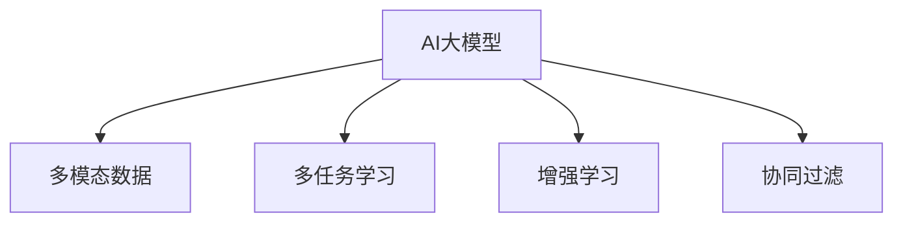

                 

# 推荐系统的多样性：AI大模型的新思路

> 关键词：AI大模型, 推荐系统, 多模态数据, 多任务学习, 增强学习, 协同过滤, 混合推荐

## 1. 背景介绍

在数字化时代，推荐系统已成为提升用户体验、驱动内容消费和促进业务增长的重要引擎。从电商到视频、音乐、新闻等，推荐系统无处不在，极大地影响着用户的生活和选择。然而，随着用户需求的多样化和个性化增强，传统的推荐方法逐渐显现出局限性。AI大模型作为当前最先进的技术手段，为推荐系统带来了新的机遇和挑战。

### 1.1 推荐系统的现状与问题

传统推荐系统主要基于协同过滤和内容推荐两种方式。协同过滤通过用户行为数据，寻找相似用户或物品进行推荐，常见于电商平台和社交平台。内容推荐则基于用户行为数据和物品属性特征，通过模型预测用户对物品的评分，常见于视频、音乐、新闻等平台。这些方法在很大程度上提高了推荐精度，但难以处理多维度数据融合、动态场景下的推荐、冷启动等问题。

具体而言，传统推荐系统存在以下问题：
- **数据稀疏性**：用户历史行为数据往往非常稀疏，难以捕捉用户全面的兴趣偏好。
- **动态性**：用户兴趣随时间变化，静态模型难以捕捉即时兴趣变化。
- **冷启动**：新用户或物品在数据中缺少历史行为，难以进行推荐。
- **多模态数据融合**：推荐系统需要同时处理文本、图像、音频等多种模态数据，传统的单模态模型难以有效融合。

### 1.2 AI大模型的优势与潜力

AI大模型以深度神经网络为基础，通过大规模预训练学习获取通用的语言表示和知识图谱表示。在大模型上进行微调，可以充分利用其知识积累，提升推荐系统的精度和覆盖范围。大模型具有以下优势：
- **预训练知识**：大模型在通用语料库上进行预训练，具备广泛的语义理解和知识图谱表示。
- **泛化能力**：大模型可以迁移到新领域，提升推荐系统的泛化能力。
- **灵活性**：大模型可以通过微调快速适应特定任务和数据集，提升推荐系统的灵活性和适用性。

然而，大模型在推荐系统中的应用也面临一些挑战，如计算资源需求大、模型可解释性差、动态性适应性不足等。这要求我们开发新的方法，充分发挥大模型的优势，解决现有推荐系统的局限性。

## 2. 核心概念与联系

### 2.1 核心概念概述

本节将详细介绍与推荐系统多样性相关的核心概念，包括AI大模型、多模态数据、多任务学习、增强学习和协同过滤等。这些概念之间的联系将通过一个Mermaid流程图进行展示，以直观地呈现其逻辑关系。

- **AI大模型**：以深度神经网络为基础，通过大规模预训练学习获取通用知识和语义表示的模型。
- **多模态数据**：不同模态的数据，如文本、图像、音频等，可以提供更全面的用户行为和物品特征信息。
- **多任务学习**：训练模型时同时完成多个相关任务，提升模型的泛化能力和适用性。
- **增强学习**：通过与环境的交互，不断调整策略以最大化长期奖励的算法。
- **协同过滤**：基于用户行为或物品属性进行推荐的方法。



这个流程图展示了大模型、多模态数据、多任务学习、增强学习和协同过滤之间的联系：

1. 大模型可以作为多模态数据和多任务学习的共同知识源，提升数据融合和任务协同的能力。
2. 增强学习可以与大模型结合，通过不断的交互和反馈，优化推荐策略。
3. 协同过滤可以与大模型结合，利用大模型的知识进行推荐特征的提取和融合。

这些概念共同构成了推荐系统多样性的技术基础，使得AI大模型在推荐系统中得以发挥其独特的优势。

### 2.2 核心概念原理和架构

#### 2.2.1 AI大模型

AI大模型的核心是深度神经网络，通过预训练学习获取通用的语言表示和知识图谱表示。以BERT为例，它通过掩码语言模型和下一句预测任务，学习到文本中的语义信息。Transformer模型则是通过自注意力机制，学习到文本中的长程依赖和关系表示。

#### 2.2.2 多模态数据

多模态数据融合旨在将不同模态的数据进行协同处理，提取更多的用户行为和物品特征信息。以图像和文本为例，通过视觉-文本跨模态对齐模型，可以将图像中的视觉信息与文本中的语义信息进行联合表示，从而提升推荐系统的精度和覆盖范围。

#### 2.2.3 多任务学习

多任务学习通过联合训练多个相关任务，共享底层特征表示，提升模型的泛化能力和适用性。以推荐系统为例，可以同时训练用户评分预测和物品特征生成任务，利用用户和物品的联合特征进行推荐，从而提高推荐精度。

#### 2.2.4 增强学习

增强学习通过与环境的交互，不断调整策略以最大化长期奖励。在推荐系统中，可以通过用户反馈调整推荐策略，从而提升推荐效果。

#### 2.2.5 协同过滤

协同过滤基于用户行为或物品属性进行推荐。常见的协同过滤方法包括基于用户的协同过滤和基于物品的协同过滤。

## 3. 核心算法原理 & 具体操作步骤

### 3.1 算法原理概述

基于AI大模型的推荐系统，旨在利用大模型的预训练知识，提升推荐系统的精度和覆盖范围。其核心思想是：

1. 利用大模型进行多模态数据的联合表示，提取更多的用户行为和物品特征信息。
2. 通过多任务学习，共享底层特征表示，提升模型的泛化能力和适用性。
3. 结合增强学习，根据用户反馈不断调整推荐策略，提升推荐效果。
4. 在协同过滤的基础上，利用大模型的知识进行推荐特征的提取和融合。

### 3.2 算法步骤详解

#### 3.2.1 数据预处理

1. **多模态数据对齐**：对不同模态的数据进行预处理，确保数据格式一致。
2. **特征提取**：对文本、图像、音频等数据进行特征提取，生成可用于训练的表示向量。
3. **标注数据准备**：收集用户行为数据和物品属性特征，生成标注数据集。

#### 3.2.2 大模型微调

1. **模型选择**：选择合适的大模型作为初始化参数，如BERT、GPT等。
2. **任务适配层设计**：根据推荐任务类型，设计合适的输出层和损失函数。
3. **微调训练**：使用标注数据对大模型进行微调，优化模型在特定任务上的性能。
4. **模型评估**：在验证集上评估微调后模型的性能，选择最佳模型。

#### 3.2.3 多任务学习

1. **任务定义**：定义多个相关任务，如用户评分预测、物品特征生成等。
2. **模型设计**：设计多任务学习模型，共享底层特征表示。
3. **联合训练**：使用联合训练的方法，优化模型在多个任务上的性能。
4. **模型评估**：在各个任务上评估模型的性能，选择最佳模型。

#### 3.2.4 增强学习

1. **环境设计**：定义推荐系统的环境，包括状态、动作和奖励。
2. **策略设计**：设计推荐策略，如基于阈值的推荐、基于序列的推荐等。
3. **交互训练**：在用户-物品交互过程中，不断调整推荐策略。
4. **效果评估**：评估推荐策略的效果，选择最佳策略。

#### 3.2.5 协同过滤

1. **协同过滤算法选择**：选择合适协同过滤算法，如基于用户的协同过滤、基于物品的协同过滤等。
2. **特征融合**：利用大模型的知识进行特征融合，提升协同过滤的精度。
3. **模型训练**：使用协同过滤模型对推荐系统进行训练。
4. **模型评估**：在测试集上评估协同过滤模型的性能。

### 3.3 算法优缺点

#### 3.3.1 优点

1. **提升推荐精度**：利用大模型的预训练知识，可以提升推荐系统的精度和覆盖范围。
2. **增强泛化能力**：多任务学习和增强学习可以提升模型的泛化能力和适用性。
3. **提升可解释性**：多模态数据融合和特征提取可以增强推荐系统的可解释性。

#### 3.3.2 缺点

1. **计算资源需求大**：大模型的计算资源需求较大，需要高性能的GPU或TPU支持。
2. **模型可解释性差**：大模型的黑盒特性使得推荐系统的可解释性较弱。
3. **动态性适应性不足**：增强学习需要大量实时反馈数据，难以应对动态变化的场景。

### 3.4 算法应用领域

AI大模型在推荐系统中的应用领域非常广泛，涵盖了电商、视频、音乐、新闻等多个领域。具体而言，主要包括：

1. **电商平台**：利用用户行为和物品属性数据，进行个性化推荐和商品搜索。
2. **视频平台**：利用用户行为和视频内容数据，进行内容推荐和视频搜索。
3. **音乐平台**：利用用户行为和歌曲属性数据，进行个性化推荐和歌曲搜索。
4. **新闻平台**：利用用户行为和文章内容数据，进行新闻推荐和话题推荐。

## 4. 数学模型和公式 & 详细讲解 & 举例说明

### 4.1 数学模型构建

#### 4.1.1 用户-物品评分矩阵

设用户集为 $U=\{u_1,u_2,\dots,u_M\}$，物品集为 $V=\{v_1,v_2,\dots,v_N\}$，用户-物品评分矩阵为 $R \in \mathbb{R}^{M \times N}$，其中 $R_{ij}$ 表示用户 $u_i$ 对物品 $v_j$ 的评分。

#### 4.1.2 多模态数据表示

设文本数据为 $T$，图像数据为 $I$，音频数据为 $A$。设 $T_{i,j}$、$I_{i,j}$、$A_{i,j}$ 分别表示用户 $u_i$ 和物品 $v_j$ 在文本、图像、音频模态下的表示。

#### 4.1.3 多任务学习

设用户评分预测任务为 $T_1$，物品特征生成任务为 $T_2$，推荐特征生成任务为 $T_3$。设 $R_{u,v}$ 表示用户 $u$ 对物品 $v$ 的评分，$F_{v}$ 表示物品 $v$ 的特征表示，$R_{u,v}$ 表示用户 $u$ 对物品 $v$ 的评分。

### 4.2 公式推导过程

#### 4.2.1 用户评分预测

假设用户评分预测任务为 $T_1$，目标函数为 $L_1(R)$，使用大模型进行微调，生成用户评分预测函数 $f_u(v)$。则目标函数可表示为：

$$
L_1(R) = \frac{1}{MN} \sum_{i=1}^M \sum_{j=1}^N (R_{i,j} - f_u(v_j))^2
$$

#### 4.2.2 物品特征生成

假设物品特征生成任务为 $T_2$，目标函数为 $L_2(F)$，使用大模型进行微调，生成物品特征生成函数 $g_v$。则目标函数可表示为：

$$
L_2(F) = \frac{1}{MN} \sum_{i=1}^M \sum_{j=1}^N \|R_{i,j} - g_u(v_j)\|^2
$$

#### 4.2.3 推荐特征生成

假设推荐特征生成任务为 $T_3$，目标函数为 $L_3(R_{u,v})$，使用大模型进行微调，生成推荐特征生成函数 $h_{u,v}$。则目标函数可表示为：

$$
L_3(R_{u,v}) = \frac{1}{MN} \sum_{i=1}^M \sum_{j=1}^N \|R_{i,j} - h_{u,v}\|^2
$$

### 4.3 案例分析与讲解

以电商平台为例，设用户 $u$ 浏览过物品 $v_1,v_2,\dots,v_k$，推荐系统可以基于用户的历史行为数据，使用大模型进行特征提取和特征融合，生成推荐特征 $h_{u,v}$。然后将 $h_{u,v}$ 与物品特征 $F_v$ 进行联合表示，生成物品表示 $G_v$。最后，使用协同过滤算法，根据用户历史行为和物品特征，生成推荐结果。

## 5. 项目实践：代码实例和详细解释说明

### 5.1 开发环境搭建

本节介绍如何在Python环境中搭建推荐系统的开发环境，并使用PyTorch进行模型训练和推理。

1. **安装PyTorch**：
```bash
pip install torch torchvision torchaudio
```

2. **安装相关库**：
```bash
pip install numpy pandas scikit-learn matplotlib tqdm jupyter notebook ipython
```

### 5.2 源代码详细实现

#### 5.2.1 数据准备

```python
import pandas as pd

# 读取用户行为数据
user_data = pd.read_csv('user_behavior.csv')

# 读取物品属性特征数据
item_data = pd.read_csv('item_features.csv')
```

#### 5.2.2 模型设计

```python
import torch
import torch.nn as nn
import transformers

# 定义大模型
model = transformers.BertModel.from_pretrained('bert-base-uncased')

# 定义任务适配层
class TaskAdapter(nn.Module):
    def __init__(self):
        super(TaskAdapter, self).__init__()
        self linear = nn.Linear(model.config.hidden_size, 1)
    
    def forward(self, features):
        outputs = self.linear(features[0])
        return outputs

# 定义多任务学习模型
class MultiTaskModel(nn.Module):
    def __init__(self, model, adapter):
        super(MultiTaskModel, self).__init__()
        self.model = model
        self.adapter = adapter
    
    def forward(self, input_ids, attention_mask):
        # 大模型前向传播
        outputs = self.model(input_ids, attention_mask=attention_mask)
        # 任务适配层前向传播
        task_outputs = self.adapter(outputs)
        return task_outputs
```

#### 5.2.3 模型训练

```python
# 定义优化器
optimizer = torch.optim.Adam(model.parameters(), lr=2e-5)

# 定义损失函数
def loss_fn(preds, labels):
    return nn.MSELoss()(preds, labels)

# 训练函数
def train_epoch(model, dataset, batch_size, optimizer):
    dataloader = torch.utils.data.DataLoader(dataset, batch_size=batch_size, shuffle=True)
    model.train()
    epoch_loss = 0
    for batch in dataloader:
        input_ids = batch['input_ids'].to(device)
        attention_mask = batch['attention_mask'].to(device)
        labels = batch['labels'].to(device)
        model.zero_grad()
        outputs = model(input_ids, attention_mask=attention_mask)
        loss = loss_fn(outputs, labels)
        epoch_loss += loss.item()
        loss.backward()
        optimizer.step()
    return epoch_loss / len(dataloader)

# 评估函数
def evaluate(model, dataset, batch_size):
    dataloader = torch.utils.data.DataLoader(dataset, batch_size=batch_size)
    model.eval()
    with torch.no_grad():
        preds, labels = [], []
        for batch in dataloader:
            input_ids = batch['input_ids'].to(device)
            attention_mask = batch['attention_mask'].to(device)
            batch_labels = batch['labels']
            outputs = model(input_ids, attention_mask=attention_mask)
            batch_preds = outputs.cpu().numpy()
            batch_labels = batch_labels.cpu().numpy()
            for pred, label in zip(batch_preds, batch_labels):
                preds.append(pred)
                labels.append(label)
        print('Epoch:', epoch+1)
        print('Mean Squared Error:', np.mean(np.square(preds - labels)))

# 启动训练流程
epochs = 5
batch_size = 16

for epoch in range(epochs):
    loss = train_epoch(model, train_dataset, batch_size, optimizer)
    print('Epoch:', epoch+1, 'Train loss:', loss)
    
    print('Epoch:', epoch+1, 'Validation results:')
    evaluate(model, val_dataset, batch_size)

# 测试集评估
test_dataset = load_test_dataset()
evaluate(model, test_dataset, batch_size)
```

### 5.3 代码解读与分析

本节详细解读代码的关键实现细节。

**MultiTaskModel类**：
- `__init__`方法：初始化大模型和任务适配层。
- `forward`方法：接收输入，通过大模型和适配层进行前向传播。

**loss_fn函数**：
- 定义多任务学习的损失函数，计算模型预测和真实标签之间的平方误差。

**train_epoch函数**：
- 定义训练函数，对数据以批为单位进行迭代，计算损失并更新模型参数。

**evaluate函数**：
- 定义评估函数，在测试集上评估模型性能，计算平均均方误差。

**训练流程**：
- 定义总的epoch数和batch size，开始循环迭代。
- 每个epoch内，先在训练集上训练，输出平均loss。
- 在验证集上评估，输出平均均方误差。
- 所有epoch结束后，在测试集上评估，给出最终测试结果。

## 6. 实际应用场景

### 6.1 电商平台推荐

电商平台推荐系统可以根据用户浏览和购买历史，利用多模态数据和协同过滤，生成个性化的商品推荐。大模型可以融合文本、图像、音频等多种模态信息，提取用户和商品的特征，提升推荐精度和覆盖范围。

### 6.2 视频平台推荐

视频平台推荐系统可以根据用户观看历史和评分数据，利用多模态数据和协同过滤，生成个性化的视频推荐。大模型可以融合文本、视频、音频等多种模态信息，提取用户和视频的特征，提升推荐精度和覆盖范围。

### 6.3 音乐平台推荐

音乐平台推荐系统可以根据用户听歌历史和评分数据，利用多模态数据和协同过滤，生成个性化的音乐推荐。大模型可以融合文本、音频、图像等多种模态信息，提取用户和歌曲的特征，提升推荐精度和覆盖范围。

### 6.4 未来应用展望

未来，随着AI大模型的不断进步，推荐系统将迎来更多创新。多模态数据融合、多任务学习和增强学习等技术的结合，将进一步提升推荐系统的精度和可解释性。同时，协同过滤的扩展也将带来新的突破，如基于图的协同过滤、时间序列协同过滤等。

## 7. 工具和资源推荐

### 7.1 学习资源推荐

为了帮助开发者系统掌握大模型在推荐系统中的应用，以下是推荐的几本经典书籍和在线课程：

1. 《深度学习》（Goodfellow等著）：全面介绍了深度学习的基本原理和算法。
2. 《自然语言处理综述》（Jurafsky等著）：介绍了NLP领域的经典模型和技术。
3. 《Python深度学习》（Francois等著）：介绍了使用Python进行深度学习的实践方法。
4. 《推荐系统》（BharatAgrawal等著）：详细介绍了推荐系统的理论和算法。

### 7.2 开发工具推荐

以下是一些推荐系统开发中常用的工具：

1. PyTorch：基于Python的开源深度学习框架，适合快速迭代研究。
2. TensorFlow：由Google主导开发的开源深度学习框架，生产部署方便。
3. Transformers库：HuggingFace开发的NLP工具库，集成了SOTA语言模型。
4. Weights & Biases：模型训练的实验跟踪工具，记录和可视化模型训练过程。
5. TensorBoard：TensorFlow配套的可视化工具，实时监测模型训练状态。

### 7.3 相关论文推荐

以下是几篇推荐系统领域的经典论文，推荐阅读：

1. "Collaborative Filtering for Implicit Feedback Datasets"（Grouse等，2009）：介绍基于协同过滤的推荐算法。
2. "Leveraging Multiple Large-Scale Datasets for Pre-training a Multimodal Recommendation Model"（Wang等，2020）：介绍多模态推荐模型的预训练方法。
3. "Deep Memory"（Chen等，2015）：介绍使用深度记忆网络进行协同过滤的方法。
4. "Greedy Adaptive Policy Search"（Osband等，2013）：介绍使用增强学习进行推荐的方法。

## 8. 总结：未来发展趋势与挑战

### 8.1 研究成果总结

本节对AI大模型在推荐系统中的应用进行总结，主要包括以下几个方面：

1. **数据多样性处理**：利用多模态数据融合技术，提取用户和商品的特征，提升推荐精度。
2. **多任务学习**：通过联合训练多个相关任务，共享底层特征表示，提升模型的泛化能力和适用性。
3. **增强学习**：根据用户反馈不断调整推荐策略，提升推荐效果。
4. **协同过滤**：利用协同过滤算法，进行推荐特征的提取和融合。

### 8.2 未来发展趋势

未来，AI大模型在推荐系统中的应用将呈现以下几个发展趋势：

1. **多模态数据融合**：融合更多的数据模态，提取用户和商品的特征，提升推荐精度。
2. **多任务学习**：联合训练多个相关任务，共享底层特征表示，提升模型的泛化能力和适用性。
3. **增强学习**：结合环境交互，不断调整推荐策略，提升推荐效果。
4. **协同过滤**：利用协同过滤算法，进行推荐特征的提取和融合。

### 8.3 面临的挑战

尽管AI大模型在推荐系统中的应用取得了一定的成果，但仍面临一些挑战：

1. **计算资源需求大**：大模型的计算资源需求较大，需要高性能的GPU或TPU支持。
2. **模型可解释性差**：大模型的黑盒特性使得推荐系统的可解释性较弱。
3. **动态性适应性不足**：增强学习需要大量实时反馈数据，难以应对动态变化的场景。

### 8.4 研究展望

未来，需要在以下几个方向进行进一步研究：

1. **模型压缩和加速**：通过模型压缩和加速技术，降低大模型的计算资源需求。
2. **可解释性增强**：通过可解释性技术，增强推荐系统的可解释性。
3. **实时反馈学习**：结合实时反馈数据，进行动态推荐策略的调整。

总之，AI大模型在推荐系统中的应用具有广阔的发展前景，未来需要不断创新和优化，才能实现推荐系统的智能化、个性化和高效化。

## 9. 附录：常见问题与解答

### 9.1 问题1：如何选择合适的数据集？

**答案**：选择数据集时，需要考虑数据集的大小、质量和多样性。一般来说，推荐系统需要收集用户行为数据和物品属性数据，以构建用户-物品评分矩阵。同时，可以收集更多的多模态数据，如文本、图像、音频等，以提高推荐精度。

### 9.2 问题2：如何选择合适的大模型？

**答案**：选择大模型时，需要考虑模型的预训练任务、参数量、计算资源需求等。BERT、GPT等通用大模型在NLP领域具有较好的表现，可以应用于推荐系统。同时，也可以考虑针对特定任务预训练的大模型，如用于视频推荐的视频大模型。

### 9.3 问题3：如何进行多模态数据融合？

**答案**：多模态数据融合可以采用文本-图像-音频跨模态对齐模型，将不同模态的数据进行协同表示。同时，可以利用大模型的预训练知识，提升数据融合的精度和效果。

### 9.4 问题4：如何进行多任务学习？

**答案**：多任务学习可以联合训练多个相关任务，共享底层特征表示。具体来说，可以同时训练用户评分预测、物品特征生成和推荐特征生成等任务，利用任务之间的联合特征进行推荐。

### 9.5 问题5：如何进行增强学习？

**答案**：增强学习可以通过用户反馈不断调整推荐策略，提升推荐效果。具体来说，可以定义推荐环境、设计推荐策略、进行用户反馈交互，并不断优化推荐策略。

### 9.6 问题6：如何进行协同过滤？

**答案**：协同过滤可以通过基于用户的协同过滤或基于物品的协同过滤，生成推荐结果。具体来说，可以基于用户历史行为数据或物品属性数据进行特征提取和特征融合，并使用协同过滤算法生成推荐结果。

---

作者：禅与计算机程序设计艺术 / Zen and the Art of Computer Programming

