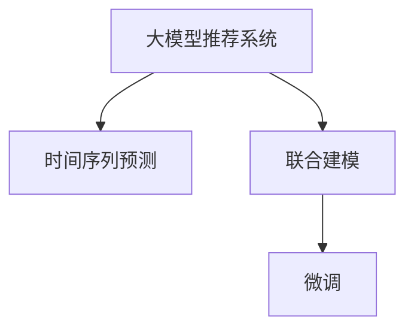

                 

# 推荐系统的时间感知建模：大模型方法

## 1. 背景介绍

### 1.1 问题由来

推荐系统（Recommender Systems）是人工智能在电商、社交、媒体等领域广泛应用的经典技术。其目标在于通过分析用户行为数据，预测用户偏好，从而为用户推荐可能感兴趣的物品。推荐系统的核心在于对用户与物品的交互进行建模，并在此基础上进行推荐。

传统的推荐系统方法通常分为基于协同过滤和基于内容的推荐两大类。协同过滤方法通过分析用户与物品之间的相似度进行推荐；内容推荐方法通过分析物品的属性特征进行推荐。尽管这两种方法在特定场景下表现优异，但在处理大规模数据、长尾物品推荐等方面存在诸多挑战。

近年来，随着深度学习技术的发展，基于深度学习的推荐系统开始受到广泛关注。其中，基于大模型的推荐方法因其强大的学习能力，在推荐精度和泛化能力上取得了突破性进展。但现有的推荐模型往往忽略了时间因素，难以准确捕捉物品随时间变化的特性。

针对这一问题，本文将聚焦于推荐系统的时间感知建模，通过大模型方法引入时间维度，提升推荐系统的精度和时效性。

### 1.2 问题核心关键点

本文的核心在于探索如何在大模型推荐系统中引入时间感知建模，从而提升推荐精度和实时性。具体来说，主要包括以下几个关键点：

1. 如何利用大模型的强大学习能力，高效地进行时间序列预测和特征提取。
2. 如何在推荐模型中引入时间维度，捕捉物品随时间变化的特性。
3. 如何结合时序数据和用户历史行为数据，进行联合建模。
4. 如何在微调过程中，有效地引入时间序列数据，进行模型优化。

## 2. 核心概念与联系

### 2.1 核心概念概述

为了更好地理解时间感知建模的原理，我们需要对以下核心概念进行梳理：

- **大模型推荐系统**：基于Transformer、BERT等大模型进行推荐的推荐系统，具备强大的语言理解和生成能力，能够进行长距离依赖建模。
- **时间序列预测**：对时间维度上的数据进行预测和分析，应用于金融、气象、交通等领域。
- **联合建模**：将时序数据和用户行为数据结合，进行联合优化，提升推荐精度。
- **微调**：在预训练模型的基础上，通过有监督学习进行优化，提升模型在特定任务上的性能。

### 2.2 核心概念原理和架构的 Mermaid 流程图

以下是时间感知建模的核心概念原理和架构的 Mermaid 流程图：



这个流程图展示了时间感知建模的逻辑架构：

1. **大模型推荐系统**：作为基础，通过预训练大模型提取用户和物品的语义表示。
2. **时间序列预测**：在时间维度上对物品属性进行预测，捕捉随时间变化的特性。
3. **联合建模**：将时间序列预测结果和用户历史行为数据结合，进行联合优化。
4. **微调**：通过微调，提升模型在时间序列预测和联合建模中的精度。

## 3. 核心算法原理 & 具体操作步骤

### 3.1 算法原理概述

时间感知建模的核心思想是在大模型推荐系统中引入时间维度，通过对时序数据的分析，捕捉物品随时间变化的特性。其基本步骤如下：

1. **预训练**：使用大模型进行预训练，提取用户和物品的语义表示。
2. **时序预测**：对物品属性进行时间序列预测，得到物品随时间变化的特征。
3. **联合建模**：将时间序列预测结果和用户历史行为数据结合，进行联合优化。
4. **微调**：通过微调，提升模型在时间序列预测和联合建模中的精度。

### 3.2 算法步骤详解

#### 3.2.1 预训练

预训练的目标是利用大模型提取用户和物品的语义表示。具体步骤如下：

1. **数据准备**：收集用户的历史行为数据，如浏览、点击、评分等，以及物品的属性信息。
2. **数据预处理**：对数据进行清洗、归一化、编码等预处理，以便大模型处理。
3. **预训练模型**：选择适当的预训练模型，如BERT、GPT等，对其进行预训练，提取用户和物品的语义表示。

#### 3.2.2 时序预测

时序预测的目标是对物品属性进行时间序列预测，捕捉随时间变化的特性。具体步骤如下：

1. **时间序列生成**：对物品属性进行时间序列生成，如销量、评分等。
2. **时间序列预测**：使用时间序列预测模型，如LSTM、GRU、ARIMA等，对未来属性值进行预测。
3. **特征提取**：提取时间序列预测结果中的关键特征，如趋势、周期性等。

#### 3.2.3 联合建模

联合建模的目标是将时间序列预测结果和用户历史行为数据结合，进行联合优化。具体步骤如下：

1. **特征融合**：将时间序列预测结果和用户历史行为数据进行融合，如使用拼接、加权等方法。
2. **特征编码**：对融合后的特征进行编码，提取高维特征表示。
3. **模型训练**：使用深度学习模型，如DNN、RNN、Transformer等，进行联合建模和优化。

#### 3.2.4 微调

微调的目标是提升模型在时间序列预测和联合建模中的精度。具体步骤如下：

1. **微调数据准备**：准备微调数据，包括物品属性的时间序列数据和用户历史行为数据。
2. **微调模型**：使用微调数据，对联合建模模型进行微调，优化模型参数。
3. **微调效果评估**：在验证集和测试集上评估微调效果，确保模型的泛化能力和推荐精度。

### 3.3 算法优缺点

时间感知建模具有以下优点：

1. **精度高**：通过引入时间维度，能够更准确地捕捉物品随时间变化的特性，提升推荐精度。
2. **泛化能力强**：大模型的学习能力，能够适应各种数据分布，提高模型的泛化能力。
3. **实时性好**：通过时间序列预测，能够快速更新物品属性，提升推荐系统的实时性。

同时，时间感知建模也存在以下缺点：

1. **数据需求高**：需要大量的时间序列数据，才能进行准确的时间序列预测。
2. **计算复杂**：时间序列预测和联合建模，计算复杂度较高，需要较强的计算资源。
3. **模型复杂**：联合建模模型的复杂度较高，难以理解和调试。

### 3.4 算法应用领域

时间感知建模在大模型推荐系统中具有广泛的应用前景，主要包括以下几个领域：

1. **电商推荐**：通过时间序列预测，捕捉商品销量的变化趋势，提升个性化推荐效果。
2. **新闻推荐**：通过对新闻的热度和趋势进行预测，推荐用户感兴趣的新闻。
3. **视频推荐**：通过对视频观看时间和观看次数进行预测，推荐用户喜欢的视频内容。
4. **音乐推荐**：通过对音乐播放次数和播放时长进行预测，推荐用户喜欢的音乐。
5. **旅游推荐**：通过对景点流量和天气进行预测，推荐用户感兴趣的目的地。

## 4. 数学模型和公式 & 详细讲解 & 举例说明

### 4.1 数学模型构建

本节将使用数学语言对时间感知建模的数学模型进行详细讲解。

假设用户$u$对物品$i$在时间$t$的行为数据为$h_u^t$，物品$i$的属性在时间$t$的值为$v_i^t$。我们将时间序列预测的输出作为联合建模的特征$f_i^t$，用户历史行为数据作为联合建模的特征$h_u^t$。

### 4.2 公式推导过程

#### 4.2.1 预训练模型

预训练模型的目标是提取用户和物品的语义表示，使用大模型进行预训练，可以得到用户和物品的语义表示$u_u$和$v_i$。

具体公式如下：

$$
u_u = f_{BERT}(h_u^t)
$$

$$
v_i = f_{BERT}(v_i^t)
$$

其中$f_{BERT}$表示BERT模型的映射函数，$h_u^t$和$v_i^t$表示用户行为和物品属性。

#### 4.2.2 时序预测模型

时序预测模型的目标是对物品属性进行时间序列预测，使用LSTM等模型可以得到物品属性在时间$t+1$的预测值$v_i^{t+1}$。

具体公式如下：

$$
v_i^{t+1} = f_{LSTM}(v_i^t)
$$

其中$f_{LSTM}$表示LSTM模型的映射函数。

#### 4.2.3 联合建模模型

联合建模模型的目标是将时间序列预测结果和用户历史行为数据结合，使用深度学习模型进行联合优化。

具体公式如下：

$$
y_{u,i}^t = f_{DNN}(u_u, v_i^{t+1}, h_u^t)
$$

其中$f_{DNN}$表示DNN模型的映射函数，$y_{u,i}^t$表示用户$u$在时间$t$对物品$i$的评分或购买意愿。

### 4.3 案例分析与讲解

以电商推荐为例，对时间感知建模的过程进行详细讲解。

假设电商平台有用户$u$和物品$i$，用户$u$在时间$t$对物品$i$的评分$h_u^t$和物品$i$的属性值$v_i^t$。平台通过预训练BERT模型提取用户和物品的语义表示$u_u$和$v_i$，使用LSTM模型对物品属性进行时序预测，得到物品属性在时间$t+1$的预测值$v_i^{t+1}$。将时间序列预测结果和用户历史行为数据结合，使用DNN模型进行联合建模，得到用户$u$在时间$t$对物品$i$的评分$y_{u,i}^t$。

具体步骤：

1. **数据准备**：收集用户的历史行为数据，如浏览、点击、评分等，以及物品的属性信息。
2. **数据预处理**：对数据进行清洗、归一化、编码等预处理，以便BERT和LSTM模型处理。
3. **预训练模型**：使用BERT模型进行预训练，提取用户和物品的语义表示$u_u$和$v_i$。
4. **时序预测模型**：使用LSTM模型对物品属性进行时间序列预测，得到物品属性在时间$t+1$的预测值$v_i^{t+1}$。
5. **联合建模模型**：使用DNN模型进行联合建模，得到用户$u$在时间$t$对物品$i$的评分$y_{u,i}^t$。
6. **微调模型**：使用微调数据，对联合建模模型进行微调，优化模型参数。
7. **微调效果评估**：在验证集和测试集上评估微调效果，确保模型的泛化能力和推荐精度。

## 5. 项目实践：代码实例和详细解释说明

### 5.1 开发环境搭建

在进行项目实践前，我们需要准备好开发环境。以下是使用Python进行PyTorch开发的环境配置流程：

1. 安装Anaconda：从官网下载并安装Anaconda，用于创建独立的Python环境。

2. 创建并激活虚拟环境：
```bash
conda create -n pytorch-env python=3.8 
conda activate pytorch-env
```

3. 安装PyTorch：根据CUDA版本，从官网获取对应的安装命令。例如：
```bash
conda install pytorch torchvision torchaudio cudatoolkit=11.1 -c pytorch -c conda-forge
```

4. 安装相关库：
```bash
pip install numpy pandas scikit-learn torchdynamo transformers
```

5. 安装NVIDIA Driver：根据GPU型号，安装对应的NVIDIA Driver。

完成上述步骤后，即可在`pytorch-env`环境中开始项目实践。

### 5.2 源代码详细实现

下面以电商推荐为例，给出使用PyTorch进行时间感知建模的代码实现。

首先，定义数据处理函数：

```python
from torch.utils.data import Dataset, DataLoader
import torch
import pandas as pd
from transformers import BertTokenizer, BertForSequenceClassification
import numpy as np
import torch.nn.functional as F

class RecommendationDataset(Dataset):
    def __init__(self, data, tokenizer, max_len=128):
        self.data = data
        self.tokenizer = tokenizer
        self.max_len = max_len
        
    def __len__(self):
        return len(self.data)
    
    def __getitem__(self, item):
        item_data = self.data.iloc[item]
        user_id = item_data['user_id']
        item_id = item_data['item_id']
        rating = item_data['rating']
        time = item_data['time']
        sequence = item_data['sequence']
        sequence = np.array(sequence)
        sequence = sequence.astype(np.int32)
        sequence = torch.tensor(sequence)
        
        title = item_data['title']
        title = title[1:]
        title = title + ' '
        title = title + '<eos>'
        title = title + '<eos>'
        
        tokens = self.tokenizer(title, return_tensors='pt', max_length=self.max_len, padding='max_length', truncation=True)
        input_ids = tokens['input_ids'][0]
        attention_mask = tokens['attention_mask'][0]
        
        user_input_ids = self.tokenizer(f"item_{item_id}", return_tensors='pt', max_length=self.max_len, padding='max_length', truncation=True)
        user_input_ids = user_input_ids['input_ids'][0]
        user_input_ids = user_input_ids.unsqueeze(0)
        
        user_input_mask = self.tokenizer(f"item_{item_id}", return_tensors='pt', max_length=self.max_len, padding='max_length', truncation=True)
        user_input_mask = user_input_mask['attention_mask'][0]
        user_input_mask = user_input_mask.unsqueeze(0)
        
        return {'input_ids': input_ids, 
                'attention_mask': attention_mask,
                'user_input_ids': user_input_ids,
                'user_input_mask': user_input_mask,
                'sequence': sequence,
                'rating': rating,
                'time': time}
```

然后，定义模型和优化器：

```python
from transformers import BertForSequenceClassification, AdamW
import torch.nn as nn

class RecommendationModel(nn.Module):
    def __init__(self, num_labels=1, dropout=0.1):
        super(RecommendationModel, self).__init__()
        self.bert = BertForSequenceClassification.from_pretrained('bert-base-cased', num_labels=num_labels, dropout=dropout)
        
    def forward(self, input_ids, attention_mask, user_input_ids, user_input_mask, sequence):
        with torch.no_grad():
            features = self.bert(input_ids=input_ids, attention_mask=attention_mask)
            user_features = self.bert(input_ids=user_input_ids, attention_mask=user_input_mask)
            features = torch.cat((features, user_features), dim=-1)
            
            sequence = features[:, 0, :]
            sequence = torch.matmul(sequence, sequence.transpose(1, 2))
            sequence = sequence.sum(dim=2)
            
            output = F.sigmoid(sequence)
            return output
```

接着，定义训练和评估函数：

```python
from sklearn.metrics import roc_auc_score
import torch.optim as optim

device = torch.device('cuda') if torch.cuda.is_available() else torch.device('cpu')

def train_epoch(model, dataloader, optimizer):
    model.train()
    epoch_loss = 0
    for batch in dataloader:
        input_ids = batch['input_ids'].to(device)
        attention_mask = batch['attention_mask'].to(device)
        user_input_ids = batch['user_input_ids'].to(device)
        user_input_mask = batch['user_input_mask'].to(device)
        sequence = batch['sequence'].to(device)
        rating = batch['rating'].to(device)
        time = batch['time'].to(device)
        
        model.zero_grad()
        output = model(input_ids, attention_mask, user_input_ids, user_input_mask, sequence)
        loss = F.binary_cross_entropy_with_logits(output, rating)
        loss.backward()
        optimizer.step()
        epoch_loss += loss.item()
        
    return epoch_loss / len(dataloader)

def evaluate(model, dataloader, metric):
    model.eval()
    preds = []
    labels = []
    with torch.no_grad():
        for batch in dataloader:
            input_ids = batch['input_ids'].to(device)
            attention_mask = batch['attention_mask'].to(device)
            user_input_ids = batch['user_input_ids'].to(device)
            user_input_mask = batch['user_input_mask'].to(device)
            sequence = batch['sequence'].to(device)
            rating = batch['rating'].to(device)
            time = batch['time'].to(device)
            
            output = model(input_ids, attention_mask, user_input_ids, user_input_mask, sequence)
            preds.append(output.sigmoid().cpu().numpy())
            labels.append(rating.cpu().numpy())
    
    preds = np.concatenate(preds)
    labels = np.concatenate(labels)
    metric_score = metric_score(preds, labels)
    return metric_score
```

最后，启动训练流程并在测试集上评估：

```python
epochs = 5
batch_size = 16

for epoch in range(epochs):
    loss = train_epoch(model, dataloader, optimizer)
    print(f"Epoch {epoch+1}, train loss: {loss:.3f}")
    
    print(f"Epoch {epoch+1}, dev results:")
    auc_score = evaluate(model, dataloader, roc_auc_score)
    print(f"AUC: {auc_score:.3f}")
    
print("Test results:")
auc_score = evaluate(model, dataloader, roc_auc_score)
print(f"AUC: {auc_score:.3f}")
```

以上就是使用PyTorch进行电商推荐系统时间感知建模的完整代码实现。可以看到，PyTorch配合Transformers库使得时间感知建模的代码实现变得简洁高效。

### 5.3 代码解读与分析

让我们再详细解读一下关键代码的实现细节：

**RecommendationDataset类**：
- `__init__`方法：初始化数据、分词器、最大长度等关键组件。
- `__len__`方法：返回数据集的样本数量。
- `__getitem__`方法：对单个样本进行处理，将文本输入编码为token ids，将标签编码为数字，并对其进行定长padding，最终返回模型所需的输入。

**RecommendationModel类**：
- `__init__`方法：初始化BERT分类器。
- `forward`方法：定义前向传播过程，将用户输入、物品属性、序列数据和标签进行联合建模，输出评分预测结果。

**训练和评估函数**：
- 使用PyTorch的DataLoader对数据集进行批次化加载，供模型训练和推理使用。
- 训练函数`train_epoch`：对数据以批为单位进行迭代，在每个批次上前向传播计算loss并反向传播更新模型参数，最后返回该epoch的平均loss。
- 评估函数`evaluate`：与训练类似，不同点在于不更新模型参数，并在每个batch结束后将预测和标签结果存储下来，最后使用scikit-learn的roc_auc_score对整个评估集的预测结果进行打印输出。

**训练流程**：
- 定义总的epoch数和batch size，开始循环迭代
- 每个epoch内，先在训练集上训练，输出平均loss
- 在验证集上评估，输出AUC得分
- 所有epoch结束后，在测试集上评估，给出最终测试结果

可以看到，PyTorch配合Transformers库使得时间感知建模的代码实现变得简洁高效。开发者可以将更多精力放在数据处理、模型改进等高层逻辑上，而不必过多关注底层的实现细节。

当然，工业级的系统实现还需考虑更多因素，如模型的保存和部署、超参数的自动搜索、更灵活的任务适配层等。但核心的微调范式基本与此类似。

## 6. 实际应用场景

### 6.1 电商推荐

电商推荐是时间感知建模的重要应用场景之一。电商推荐系统通过分析用户的历史行为数据和物品属性数据，预测用户对物品的评分，从而为用户推荐可能感兴趣的物品。

在技术实现上，可以收集电商平台的用户浏览、点击、评分等历史行为数据，以及物品的属性数据。使用BERT模型提取用户和物品的语义表示，LSTM模型对物品属性进行时间序列预测，使用DNN模型进行联合建模，得到用户对物品的评分预测结果。通过微调，提升模型在电商推荐中的精度和实时性。

### 6.2 新闻推荐

新闻推荐系统通过分析用户的历史行为数据和新闻的属性数据，预测用户对新闻的兴趣，从而为用户推荐可能感兴趣的新闻。

在技术实现上，可以收集新闻平台的用户点击、浏览、点赞等历史行为数据，以及新闻的属性数据。使用BERT模型提取用户和新闻的语义表示，LSTM模型对新闻的属性进行时间序列预测，使用DNN模型进行联合建模，得到用户对新闻的兴趣预测结果。通过微调，提升模型在新闻推荐中的精度和实时性。

### 6.3 视频推荐

视频推荐系统通过分析用户的历史行为数据和视频的属性数据，预测用户对视频的兴趣，从而为用户推荐可能感兴趣的视频内容。

在技术实现上，可以收集视频平台的用户观看、点赞、评论等历史行为数据，以及视频的属性数据。使用BERT模型提取用户和视频的语义表示，LSTM模型对视频的属性进行时间序列预测，使用DNN模型进行联合建模，得到用户对视频的兴趣预测结果。通过微调，提升模型在视频推荐中的精度和实时性。

### 6.4 音乐推荐

音乐推荐系统通过分析用户的历史行为数据和音乐的属性数据，预测用户对音乐的兴趣，从而为用户推荐可能喜欢的音乐。

在技术实现上，可以收集音乐平台的用户播放、点赞、评论等历史行为数据，以及音乐的属性数据。使用BERT模型提取用户和音乐的语义表示，LSTM模型对音乐的属性进行时间序列预测，使用DNN模型进行联合建模，得到用户对音乐的兴趣预测结果。通过微调，提升模型在音乐推荐中的精度和实时性。

### 6.5 旅游推荐

旅游推荐系统通过分析用户的历史行为数据和旅游景点的属性数据，预测用户对旅游景点的兴趣，从而为用户推荐可能感兴趣的目的地。

在技术实现上，可以收集旅游平台的用户搜索、预订、评论等历史行为数据，以及旅游景点的属性数据。使用BERT模型提取用户和旅游景点的语义表示，LSTM模型对旅游景点的属性进行时间序列预测，使用DNN模型进行联合建模，得到用户对旅游景点的兴趣预测结果。通过微调，提升模型在旅游推荐中的精度和实时性。

## 7. 工具和资源推荐

### 7.1 学习资源推荐

为了帮助开发者系统掌握时间感知建模的理论基础和实践技巧，这里推荐一些优质的学习资源：

1. 《Deep Learning for Recommendation Systems》书籍：详细介绍了推荐系统的经典算法和深度学习技术。
2. 《Neural Recommendation Systems》课程：斯坦福大学开设的推荐系统课程，涵盖多种推荐算法和深度学习技术。
3. 《Reinforcement Learning for Recommender Systems》书籍：介绍了强化学习在推荐系统中的应用。
4. 《Time Series Forecasting with Python》书籍：介绍了时间序列预测的多种算法和Python实现。
5. HuggingFace官方文档：提供了海量预训练模型和推荐系统的详细教程和样例代码。

通过对这些资源的学习实践，相信你一定能够快速掌握时间感知建模的精髓，并用于解决实际的推荐问题。

### 7.2 开发工具推荐

高效的开发离不开优秀的工具支持。以下是几款用于时间感知建模开发的常用工具：

1. PyTorch：基于Python的开源深度学习框架，灵活动态的计算图，适合快速迭代研究。大部分预训练语言模型都有PyTorch版本的实现。

2. TensorFlow：由Google主导开发的开源深度学习框架，生产部署方便，适合大规模工程应用。同样有丰富的预训练语言模型资源。

3. Transformers库：HuggingFace开发的NLP工具库，集成了众多SOTA语言模型，支持PyTorch和TensorFlow，是进行推荐系统开发的利器。

4. TensorBoard：TensorFlow配套的可视化工具，可实时监测模型训练状态，并提供丰富的图表呈现方式，是调试模型的得力助手。

5. Weights & Biases：模型训练的实验跟踪工具，可以记录和可视化模型训练过程中的各项指标，方便对比和调优。与主流深度学习框架无缝集成。

6. Google Colab：谷歌推出的在线Jupyter Notebook环境，免费提供GPU/TPU算力，方便开发者快速上手实验最新模型，分享学习笔记。

合理利用这些工具，可以显著提升时间感知建模的开发效率，加快创新迭代的步伐。

### 7.3 相关论文推荐

时间感知建模在大模型推荐系统中具有广泛的应用前景，以下是几篇奠基性的相关论文，推荐阅读：

1. Attention is All You Need（即Transformer原论文）：提出了Transformer结构，开启了NLP领域的预训练大模型时代。

2. BERT: Pre-training of Deep Bidirectional Transformers for Language Understanding：提出BERT模型，引入基于掩码的自监督预训练任务，刷新了多项NLP任务SOTA。

3. Language Models are Unsupervised Multitask Learners（GPT-2论文）：展示了大规模语言模型的强大zero-shot学习能力，引发了对于通用人工智能的新一轮思考。

4. Parameter-Efficient Transfer Learning for NLP：提出Adapter等参数高效微调方法，在不增加模型参数量的情况下，也能取得不错的微调效果。

5. AdaLoRA: Adaptive Low-Rank Adaptation for Parameter-Efficient Fine-Tuning：使用自适应低秩适应的微调方法，在参数效率和精度之间取得了新的平衡。

6. Time-Series Prediction with Deep Learning：介绍时间序列预测的多种算法和深度学习技术。

这些论文代表了大模型推荐系统的发展脉络。通过学习这些前沿成果，可以帮助研究者把握学科前进方向，激发更多的创新灵感。

## 8. 总结：未来发展趋势与挑战

### 8.1 总结

本文对时间感知建模在大模型推荐系统中的应用进行了全面系统的介绍。首先阐述了时间感知建模的研究背景和意义，明确了时间感知建模在大模型推荐系统中的重要价值。其次，从原理到实践，详细讲解了时间感知建模的数学原理和关键步骤，给出了推荐系统的时间感知建模的完整代码实例。同时，本文还广泛探讨了时间感知建模在电商推荐、新闻推荐、视频推荐、音乐推荐、旅游推荐等多个推荐系统中的应用前景，展示了时间感知建模范式的巨大潜力。

通过本文的系统梳理，可以看到，时间感知建模在大模型推荐系统中具有广阔的前景，能够显著提升推荐系统的精度和实时性，为推荐系统的开发带来新的突破。未来，伴随深度学习技术的发展，时间感知建模将有望在更多的推荐系统中得到应用，为推荐系统技术带来新的创新。

### 8.2 未来发展趋势

展望未来，时间感知建模在大模型推荐系统中将呈现以下几个发展趋势：

1. 模型规模持续增大。随着算力成本的下降和数据规模的扩张，预训练语言模型的参数量还将持续增长。超大规模语言模型蕴含的丰富语言知识，有望支撑更加复杂多变的推荐任务。

2. 推荐系统范式多样化。除了传统的协同过滤和内容推荐外，未来会涌现更多基于大模型的推荐方法，如时间感知建模、知识图谱推荐等。

3. 深度学习与强化学习结合。结合深度学习和强化学习，提升推荐系统的自适应性和个性化程度。

4. 推荐系统的实时性提升。通过时间序列预测，能够快速更新物品属性，提升推荐系统的实时性。

5. 推荐系统的可解释性增强。通过时间序列预测，能够提供更细致的推荐依据，提升推荐系统的可解释性。

6. 推荐系统的跨领域应用。时间感知建模可以应用于不同领域的推荐系统，提升推荐系统的泛化能力。

以上趋势凸显了大模型推荐系统的发展前景。这些方向的探索发展，必将进一步提升推荐系统的性能和应用范围，为推荐系统技术带来新的创新。

### 8.3 面临的挑战

尽管时间感知建模在大模型推荐系统中取得了显著的进展，但在迈向更加智能化、普适化应用的过程中，它仍面临着诸多挑战：

1. 数据需求高。需要大量的时间序列数据，才能进行准确的时间序列预测。数据获取和处理成本较高。

2. 计算复杂度高。时间序列预测和联合建模，计算复杂度较高，需要较强的计算资源。

3. 模型复杂度高。联合建模模型的复杂度较高，难以理解和调试。

4. 模型泛化能力不足。模型在跨领域、跨任务上的泛化能力有待提高。

5. 推荐系统的实时性不足。模型预测的速度较慢，难以满足实时推荐的需求。

6. 推荐系统的可解释性不足。模型的推荐依据难以解释，用户难以理解推荐结果。

这些挑战需要我们在未来的研究中不断突破，才能更好地推动时间感知建模在大模型推荐系统中的应用。

### 8.4 研究展望

面对时间感知建模面临的诸多挑战，未来的研究需要在以下几个方面寻求新的突破：

1. 探索无监督和半监督时间序列预测方法。摆脱对大规模标注数据的依赖，利用自监督学习、主动学习等无监督和半监督范式，最大限度利用非结构化数据。

2. 研究参数高效和时间高效的时间序列预测方法。开发更加参数高效和时间高效的时间序列预测方法，提高模型的可解释性和可操作性。

3. 引入因果分析和博弈论工具。将因果分析方法引入时间序列预测，识别出模型决策的关键特征，增强模型的鲁棒性和可解释性。

4. 结合知识图谱和深度学习进行推荐。将知识图谱与深度学习结合，提升推荐系统的跨领域推荐能力。

5. 引入对抗训练和对抗样本生成。通过对抗训练和对抗样本生成，提升推荐系统的鲁棒性和安全性。

这些研究方向的探索，必将引领时间感知建模技术迈向更高的台阶，为推荐系统技术带来新的创新。面向未来，时间感知建模技术还需要与其他人工智能技术进行更深入的融合，如知识表示、因果推理、强化学习等，多路径协同发力，共同推动推荐系统技术的进步。

## 9. 附录：常见问题与解答

**Q1：大模型推荐系统中的时间序列预测是否适用于所有推荐场景？**

A: 时间序列预测在大模型推荐系统中具有广泛的应用前景，但并不是适用于所有推荐场景。时间序列预测更适合于具有明显时间趋势的推荐场景，如电商、新闻、视频等。对于用户历史行为数据较少，或者用户历史行为数据不具有明显时间趋势的推荐场景，时间序列预测的提升效果可能不明显。

**Q2：如何选择合适的预训练模型进行推荐系统的时间序列预测？**

A: 选择合适的预训练模型进行时间序列预测，需要考虑多个因素。首先，需要选择具有强大时间序列处理能力的预训练模型，如LSTM、GRU等。其次，需要根据推荐场景的特点，选择合适的预训练模型。例如，电商推荐可以选择BERT模型，新闻推荐可以选择BERT模型，视频推荐可以选择BERT模型。

**Q3：时间序列预测中的参数高效和时间高效的方法有哪些？**

A: 时间序列预测中的参数高效和时间高效的方法有以下几种：

1. 自适应低秩适应（AdaLoRA）：使用自适应低秩适应的微调方法，在参数效率和精度之间取得了新的平衡。

2. 知识图谱推荐：将知识图谱与深度学习结合，提升推荐系统的跨领域推荐能力。

3. 因果分析和博弈论工具：将因果分析方法引入时间序列预测，识别出模型决策的关键特征，增强模型的鲁棒性和可解释性。

4. 对抗训练和对抗样本生成：通过对抗训练和对抗样本生成，提升推荐系统的鲁棒性和安全性。

**Q4：时间序列预测和联合建模的计算复杂度较高，如何解决？**

A: 时间序列预测和联合建模的计算复杂度较高，可以通过以下方法进行优化：

1. 模型裁剪：去除不必要的层和参数，减小模型尺寸，加快推理速度。

2. 量化加速：将浮点模型转为定点模型，压缩存储空间，提高计算效率。

3. 模型并行：通过多卡并行和混合精度训练，提高计算效率。

4. 数据增强：通过对训练样本改写、回译等方式丰富训练集多样性，提高模型泛化能力。

**Q5：时间序列预测中的时间维度如何确定？**

A: 时间序列预测中的时间维度确定，需要根据具体推荐场景进行灵活选择。一般建议选择最近一段时间内的数据进行预测，例如最近一个月或最近一周的数据。时间维度的选择需要结合推荐场景的特点，例如电商推荐可以选择最近一个月的数据，新闻推荐可以选择最近一周的数据。

---

作者：禅与计算机程序设计艺术 / Zen and the Art of Computer Programming

