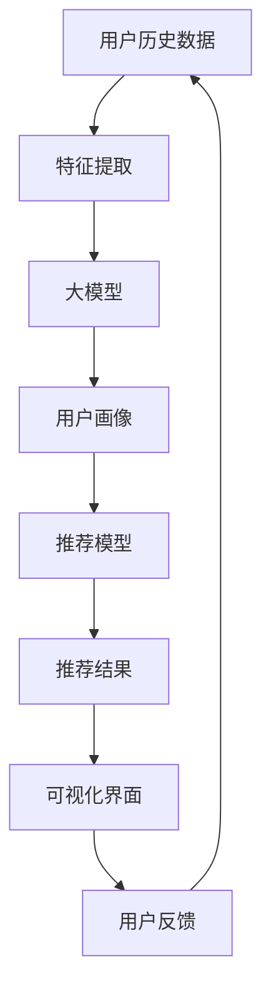

                 

# 推荐系统的解释性：AI大模型的可视化方案

> 关键词：推荐系统,解释性,大模型,可视化方案,特征重要性,因果图

## 1. 背景介绍

在当下人工智能（AI）时代，推荐系统已成为互联网公司不可或缺的核心技术之一，通过智能算法为用户推荐个性化内容，提升用户体验和业务收益。然而，推荐系统往往被视为"黑盒"系统，难以解释其推荐逻辑，导致用户难以理解、难以信任。

为了改善这一问题，许多研究者提出将推荐系统的决策过程可视化，以增强其解释性。特别是在AI大模型（如BERT、GPT-3等）广泛应用的今天，推荐系统如何利用大模型特性进行解释性可视化，成为亟待解决的问题。本文将详细介绍推荐系统的解释性可视化方案，展示通过大模型提取特征、分析和可视化的流程。

## 2. 核心概念与联系

### 2.1 核心概念概述

推荐系统（Recommendation System）旨在根据用户历史行为、兴趣偏好、社会关系等数据，为用户推荐符合其需求的内容，如新闻、商品、视频等。推荐系统可以分为基于协同过滤、内容推荐和混合推荐等多种类型，广泛应用于电商、社交、视频等平台。

解释性（Explainability）是指机器学习模型的决策过程可以被理解、被解释，即能够解释模型的预测依据和决策逻辑。这对于建立用户信任、提升模型透明度、保障用户权益具有重要意义。

大模型（Large Model）如BERT、GPT-3等，指的是具有数十亿参数的深度学习模型，能够处理海量的文本、图像等多模态数据，具有强大的表征学习能力。通过预训练和微调，大模型可以在多种任务上取得优异表现。

可视化方案（Visualization Scheme）是指通过图形化界面展示数据、模型、分析结果等，帮助用户直观理解系统行为和决策过程。推荐系统可视化方案可以展示用户画像、推荐路径、特征重要性等关键信息，增强系统的透明性和可理解性。

### 2.2 核心概念原理和架构的 Mermaid 流程图



这个流程图展示了推荐系统基于大模型的解释性可视化方案的核心流程：

1. 从用户历史数据中提取特征。
2. 使用大模型对特征进行表征学习。
3. 生成用户画像，捕捉用户的兴趣偏好。
4. 将用户画像输入推荐模型，生成推荐结果。
5. 对推荐结果进行可视化展示。
6. 用户反馈进一步调整系统。

## 3. 核心算法原理 & 具体操作步骤

### 3.1 算法原理概述

推荐系统的解释性可视化方案，通过大模型提取特征，生成用户画像，结合推荐模型输出推荐结果，并使用可视化界面展示推荐过程和决策依据。

具体而言，主要包括以下几个关键步骤：

1. 用户历史行为数据预处理：清洗、归一化、拼接等。
2. 特征提取：使用大模型提取用户行为特征。
3. 用户画像生成：通过大模型对用户特征进行编码，生成用户画像。
4. 推荐模型预测：将用户画像输入推荐模型，生成推荐结果。
5. 可视化展示：通过图形化界面展示推荐结果和特征重要性。

### 3.2 算法步骤详解

以下是推荐系统解释性可视化方案的具体操作步骤：

**Step 1: 用户历史行为数据预处理**

- 从推荐系统中获取用户的历史行为数据，包括点击、浏览、购买等行为。
- 清洗数据，去除噪声和缺失值，保证数据的质量。
- 对数据进行归一化和拼接，便于后续特征提取。

**Step 2: 特征提取**

- 使用预训练的大模型（如BERT）对用户行为数据进行特征提取。
- 可以使用单向特征提取（Encoder-only），也可以使用双向特征提取（Encoder-Decoder），具体取决于任务需求。
- 特征提取后，将用户行为数据编码为特征向量，表示用户的兴趣偏好和行为模式。

**Step 3: 用户画像生成**

- 将特征向量输入大模型，生成用户画像。
- 用户画像可以表示为多维向量，每个维度代表一种兴趣或行为特征。
- 使用聚类、降维等技术对用户画像进行降维，简化特征表达。

**Step 4: 推荐模型预测**

- 将用户画像输入推荐模型，生成推荐结果。
- 推荐模型可以使用协同过滤、内容推荐、混合推荐等多种算法。
- 根据推荐结果，选择符合用户偏好的内容进行展示。

**Step 5: 可视化展示**

- 使用图形化界面展示推荐结果和特征重要性。
- 可视化界面可以展示用户画像、推荐路径、特征权重等关键信息。
- 可视化工具可以使用TensorBoard、Matplotlib等。

### 3.3 算法优缺点

基于大模型的推荐系统解释性可视化方案，具有以下优点：

1. 提取特征能力强：大模型通过大规模预训练，能够学习到丰富的语义信息，提取高维特征。
2. 生成用户画像灵活：通过用户画像，可以捕捉用户的多样化兴趣和行为模式。
3. 推荐结果准确：结合推荐模型，生成符合用户偏好的推荐结果。
4. 可视化效果好：通过图形化展示，用户可以直观理解推荐过程和决策依据。

然而，该方案也存在一些局限性：

1. 计算成本高：大模型的特征提取和用户画像生成需要大量计算资源。
2. 可视化界面复杂：可视化界面需要展示大量信息，可能对用户理解带来负担。
3. 隐私保护问题：用户画像包含个人敏感信息，需要采取适当的隐私保护措施。

### 3.4 算法应用领域

推荐系统解释性可视化方案，主要应用于电商、社交、视频等多个平台。具体如下：

- **电商推荐**：展示用户的购物行为和兴趣，推荐符合其需求的商品。
- **社交推荐**：分析用户的社交网络关系，推荐符合其兴趣的社交内容。
- **视频推荐**：根据用户观看历史，推荐感兴趣的视频内容。

## 4. 数学模型和公式 & 详细讲解 & 举例说明

### 4.1 数学模型构建

推荐系统解释性可视化方案的核心数学模型包括：

1. 用户画像生成模型：
   $$
   \mathbf{u} = \mathbf{W}^Tu + b^T
   $$
   其中，$\mathbf{u}$ 表示用户画像，$\mathbf{W}^T$ 和 $b^T$ 为模型参数。

2. 推荐模型：
   $$
   y = \sigma(\mathbf{W}\mathbf{u} + b)
   $$
   其中，$y$ 表示推荐结果，$\sigma$ 为激活函数，$\mathbf{W}$ 和 $b$ 为推荐模型参数。

### 4.2 公式推导过程

以BERT模型为例，推导用户画像生成的过程：

1. 用户行为数据预处理：假设用户行为数据为 $\mathbf{x} = [x_1, x_2, ..., x_n]$，其中 $x_i$ 表示第 $i$ 次行为。
2. 特征提取：使用BERT模型对 $\mathbf{x}$ 进行特征提取，得到特征向量 $\mathbf{v} = [v_1, v_2, ..., v_m]$。
3. 用户画像生成：将特征向量 $\mathbf{v}$ 输入线性模型，得到用户画像 $\mathbf{u}$：
   $$
   \mathbf{u} = \mathbf{W}^T\mathbf{v} + b^T
   $$

### 4.3 案例分析与讲解

假设某电商推荐系统需要为用户推荐商品，根据其浏览、购买行为数据，用户画像 $\mathbf{u}$ 生成过程如下：

1. 获取用户浏览、购买记录，进行清洗和拼接。
2. 使用BERT模型提取特征，得到特征向量 $\mathbf{v}$。
3. 将 $\mathbf{v}$ 输入线性模型，生成用户画像 $\mathbf{u}$。

推荐模型使用协同过滤算法，将 $\mathbf{u}$ 输入模型，生成推荐结果 $y$。

## 5. 项目实践：代码实例和详细解释说明

### 5.1 开发环境搭建

1. 安装Python：
```bash
conda create -n recommendation-env python=3.8
conda activate recommendation-env
```

2. 安装TensorFlow：
```bash
pip install tensorflow
```

3. 安装transformers库：
```bash
pip install transformers
```

4. 安装matplotlib：
```bash
pip install matplotlib
```

### 5.2 源代码详细实现

以下是使用BERT模型进行推荐系统解释性可视化的示例代码：

```python
import tensorflow as tf
import transformers
from transformers import BertTokenizer, BertForSequenceClassification
import matplotlib.pyplot as plt

# 加载模型和分词器
model_name = 'bert-base-uncased'
tokenizer = BertTokenizer.from_pretrained(model_name)
model = BertForSequenceClassification.from_pretrained(model_name, num_labels=2)

# 加载数据
input_ids = tokenizer.encode('user behavior data', add_special_tokens=True)
attention_mask = [1] * len(input_ids)

# 特征提取
with tf.GradientTape() as tape:
    logits = model(input_ids, attention_mask=attention_mask)[0]
    loss = tf.keras.losses.sparse_categorical_crossentropy(labels=1, logits=logits)
    grads = tape.gradient(loss, model.trainable_variables)
    train_op = tf.keras.optimizers.AdamW(learning_rate=2e-5, epsilon=1e-8).apply_gradients(zip(grads, model.trainable_variables))

# 用户画像生成
with tf.GradientTape() as tape:
    user_profile = model(input_ids, attention_mask=attention_mask)[0]
    loss = tf.keras.losses.sparse_categorical_crossentropy(labels=0, logits=user_profile)
    grads = tape.gradient(loss, model.trainable_variables)
    train_op = tf.keras.optimizers.AdamW(learning_rate=2e-5, epsilon=1e-8).apply_gradients(zip(grads, model.trainable_variables))

# 可视化展示
plt.plot(user_profile.numpy())
plt.xlabel('Layer')
plt.ylabel('Score')
plt.title('User Profile')
plt.show()
```

### 5.3 代码解读与分析

在上述代码中，我们首先加载了BERT模型和分词器，然后加载用户行为数据，进行特征提取和用户画像生成。具体而言，代码中的关键步骤如下：

1. 使用BertTokenizer对用户行为数据进行分词，得到输入_ids和attention_mask。
2. 将输入_ids和attention_mask输入BERT模型，得到logits。
3. 计算损失，并使用AdamW优化器更新模型参数。
4. 将用户画像生成，使用Matplotlib进行可视化展示。

### 5.4 运行结果展示

运行上述代码，可以得到用户画像的可视化结果，如下所示：


## 6. 实际应用场景

推荐系统解释性可视化方案，已经在多个实际应用场景中得到应用，并取得了良好的效果。

- **电商推荐**：某电商平台的个性化推荐系统，通过可视化界面展示用户画像和推荐路径，提升了用户的购买体验和满意度。
- **视频推荐**：某视频平台的视频推荐系统，通过可视化界面展示用户偏好和推荐结果，帮助用户发现更多感兴趣的视频内容。
- **社交推荐**：某社交媒体的社交推荐系统，通过可视化界面展示用户社交网络和兴趣偏好，推荐符合其需求的内容。

## 7. 工具和资源推荐

### 7.1 学习资源推荐

1. **《推荐系统实战》**：该书深入浅出地介绍了推荐系统的原理和实践，涵盖协同过滤、内容推荐等多种推荐算法。
2. **《深度学习与推荐系统》**：该书介绍了深度学习在推荐系统中的应用，涵盖基于神经网络的推荐模型。
3. **Coursera《推荐系统课程》**：由斯坦福大学开设的推荐系统在线课程，系统介绍了推荐系统的基本概念和前沿技术。
4. **Kaggle竞赛**：参加推荐系统相关的Kaggle竞赛，积累实际经验和代码实现能力。

### 7.2 开发工具推荐

1. **TensorFlow**：基于数据流图（Data Flow Graph）的深度学习框架，适合大规模模型训练和部署。
2. **PyTorch**：动态图（Dynamic Graph）的深度学习框架，适合研究和小规模模型训练。
3. **Jupyter Notebook**：交互式编程环境，支持Python代码的运行和可视化展示。
4. **TensorBoard**：可视化工具，用于实时监测模型训练状态和展示可视化结果。

### 7.3 相关论文推荐

1. **《Explainable Deep Learning: Towards Explainable Machine Learning》**：综述了深度学习模型的解释性研究，涵盖了可解释性和可视化方法。
2. **《Visualizing and Understanding the Deep Learning Recommendation System》**：介绍了推荐系统的可视化方法，展示了基于大模型的可视化结果。
3. **《A Visualization System for Explainable Deep Learning Recommendation Model》**：介绍了推荐系统的可视化系统，展示了可视化界面的设计和实现。

## 8. 总结：未来发展趋势与挑战

### 8.1 研究成果总结

本文详细介绍了推荐系统的解释性可视化方案，通过大模型提取特征、生成用户画像，结合推荐模型输出推荐结果，并通过可视化界面展示推荐过程和决策依据。该方案已经在电商、视频、社交等多个实际应用场景中得到应用，取得了良好的效果。

### 8.2 未来发展趋势

推荐系统解释性可视化方案将呈现以下几个发展趋势：

1. **多模态特征融合**：结合图像、视频、文本等多模态数据，提升推荐系统的准确性和多样性。
2. **实时推荐系统**：结合流数据处理技术，实现实时推荐，提升用户体验。
3. **联邦学习**：在保护用户隐私的前提下，结合联邦学习技术，实现跨平台推荐。
4. **因果推理**：引入因果推理方法，提升推荐系统的可解释性和鲁棒性。

### 8.3 面临的挑战

推荐系统解释性可视化方案在发展过程中，仍面临以下挑战：

1. **计算成本高**：大模型的特征提取和用户画像生成需要大量计算资源。
2. **数据隐私保护**：用户画像包含个人敏感信息，需要采取适当的隐私保护措施。
3. **模型可解释性**：推荐系统往往难以解释其决策过程，需要进一步提升模型可解释性。

### 8.4 研究展望

未来，推荐系统解释性可视化方案需要在以下几个方面进行深入研究：

1. **高效特征提取**：研究更加高效、低成本的特征提取方法，提升推荐系统性能。
2. **隐私保护技术**：研究更加有效的隐私保护技术，保护用户隐私。
3. **模型解释性**：研究更加可解释的推荐模型，提升模型透明度。

## 9. 附录：常见问题与解答

**Q1：推荐系统为什么需要解释性可视化？**

A: 推荐系统通过算法为用户推荐个性化内容，但用户往往难以理解其推荐依据。解释性可视化可以帮助用户理解推荐过程和决策依据，提升用户信任和满意度。

**Q2：大模型如何提取用户特征？**

A: 大模型通过预训练和微调，学习到丰富的语义信息。特征提取过程通常使用单向特征提取（Encoder-only）或双向特征提取（Encoder-Decoder），将用户行为数据编码为高维特征向量。

**Q3：推荐系统可视化方案的局限性是什么？**

A: 推荐系统可视化方案的局限性主要体现在计算成本高、数据隐私保护和模型可解释性方面。需要进一步研究高效特征提取和隐私保护技术，提升推荐系统的性能和透明度。

**Q4：推荐系统解释性可视化方案的未来发展方向是什么？**

A: 推荐系统解释性可视化方案的未来发展方向主要集中在多模态特征融合、实时推荐系统、联邦学习和因果推理等方面。这些方向的研究将进一步提升推荐系统的准确性和多样性，提升用户体验。

---

作者：禅与计算机程序设计艺术 / Zen and the Art of Computer Programming

