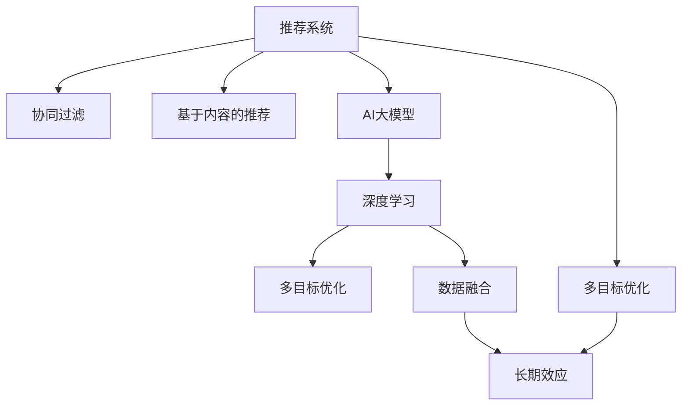

                 

# 推荐系统的长期效应：AI大模型的新视角

> 关键词：推荐系统, AI大模型, 长期效应, 个性化推荐, 协同过滤, 深度学习, 数据融合, 多目标优化, 实时性, 可解释性, 鲁棒性

## 1. 背景介绍

### 1.1 问题由来
推荐系统(Recommendation System)是现代信息时代不可或缺的重要技术，广泛应用于电商、社交、媒体等众多领域。通过分析用户行为和物品属性，推荐系统帮助用户发现感兴趣的新内容，提升用户满意度和平台转化率。传统的推荐系统主要依赖于协同过滤(Collaborative Filtering, CF)和基于内容的推荐(Content-based Recommendation, CB)。然而，这些方法在不同程度上存在数据稀疏性、内容特征难以建模等问题。

近年来，随着深度学习在推荐领域的广泛应用，AI大模型技术迅速崛起，取得了显著的效果。基于深度学习的推荐系统(DLR)通常采用神经网络模型，能够有效处理高维稀疏特征和复杂用户行为，逐步成为推荐系统的主流技术。AI大模型具有更强的泛化能力，通过大规模无标签数据的预训练，能够学习到更加丰富的用户-物品关联模式。在微调阶段，通过对用户行为数据的有监督学习，可以更加精准地预测用户偏好，实现更加个性化的推荐服务。

然而，AI大模型的推荐系统也面临着一些挑战。如何平衡模型的个性化推荐与推荐结果的长期效应，是目前需要解决的重要问题。长期效应指推荐系统的稳定性和可持续性，主要关注推荐结果与用户长期兴趣和行为的一致性，避免由于个性化推荐过度，导致用户长期满意度的下降。

## 2. 核心概念与联系

### 2.1 核心概念概述

为更好地理解推荐系统的长期效应，本节将介绍几个密切相关的核心概念：

- **推荐系统(Recommendation System)**：通过分析用户行为和物品属性，为用户提供个性化推荐的服务系统。
- **协同过滤(Collaborative Filtering)**：利用用户之间的相似性，通过用户行为数据的协同作用，推断其他用户的偏好。
- **基于内容的推荐(Content-based Recommendation)**：根据物品属性特征，将相似物品推荐给用户。
- **AI大模型(AI Large Model)**：具有大规模参数量和强大学习能力，通过预训练和微调技术，在推荐系统中表现出卓越效果。
- **长期效应(Long-term Effectiveness)**：推荐系统的稳定性和可持续性，关注推荐结果与用户长期兴趣和行为的一致性。
- **多目标优化(Multi-objective Optimization)**：推荐系统需要兼顾多个目标，如个性化推荐、推荐结果覆盖、多样性等。
- **深度学习(Deep Learning)**：通过多层神经网络，学习非线性特征表示，提取更加复杂和抽象的模式。
- **数据融合(Data Fusion)**：将用户行为数据、物品属性数据、社交网络数据等进行有效融合，提升推荐系统的准确性和鲁棒性。

这些核心概念之间的逻辑关系可以通过以下Mermaid流程图来展示：



这个流程图展示了这个推荐系统的核心概念及其之间的关系：

1. 推荐系统通过协同过滤和基于内容的推荐构建用户和物品的关联矩阵。
2. AI大模型通过预训练和微调，提取复杂的用户-物品关联模式。
3. 深度学习模型学习高维稀疏特征，提取非线性关系。
4. 多目标优化考虑推荐结果的个性化、多样性、覆盖等。
5. 数据融合将不同来源的数据进行有效融合，提升推荐准确性。
6. 长期效应关注推荐结果与用户长期兴趣和行为的一致性。

这些概念共同构成了现代推荐系统的核心框架，使得AI大模型能够更好地应用于推荐任务。

## 3. 核心算法原理 & 具体操作步骤
### 3.1 算法原理概述

推荐系统的长期效应问题，本质上是对推荐模型预测结果与用户长期行为一致性的评估和优化。其核心思想是：构建基于长期效应的推荐模型，使得推荐结果在多轮交互中保持相对稳定，同时保证个性化推荐的精准性和多样性。

形式化地，假设推荐系统涉及 $U$ 个用户和 $I$ 个物品，用户对物品的评分矩阵为 $R \in \mathbb{R}^{U\times I}$。用户 $u$ 对物品 $i$ 的评分表示为 $R_{u,i}$。推荐系统通过模型 $M$ 预测用户对物品的评分，即 $M(u,i) \approx R_{u,i}$。长期效应目标函数定义为：

$$
\mathcal{L} = \frac{1}{U\times I} \sum_{u=1}^U \sum_{i=1}^I \left(\max(0, R_{u,i} - M(u,i))^2\right)
$$

其中，$\max(0, R_{u,i} - M(u,i))$ 表示用户对物品的真实评分与模型预测评分的差距。该函数表示用户评分与模型预测评分的平方误差，主要评估模型预测的准确性。

### 3.2 算法步骤详解

基于长期效应的AI大模型推荐系统一般包括以下几个关键步骤：

**Step 1: 准备数据集**
- 收集用户行为数据，如点击、浏览、评分等。
- 构建物品属性特征向量。
- 利用协同过滤和内容推荐方法构建用户-物品关联矩阵。

**Step 2: 选择推荐模型**
- 选择合适的深度学习模型，如Wide & Deep模型、DeepFM模型等，利用AI大模型进行推荐预测。
- 设计合适的损失函数，如均方误差、交叉熵等，优化模型参数。

**Step 3: 定义长期效应目标**
- 利用长期效应目标函数，评估推荐模型的预测结果与用户长期行为的一致性。
- 定义多目标优化目标，如个性化推荐、推荐结果多样性、覆盖率等。

**Step 4: 优化模型参数**
- 利用优化算法，如随机梯度下降、Adam等，最小化多目标优化目标函数。
- 定期在验证集上评估模型的长期效应和个性化推荐效果，进行模型调优。

**Step 5: 部署与监控**
- 将优化后的模型部署到推荐系统中。
- 实时监控推荐结果，评估长期效应和个性化推荐效果。
- 根据监控结果，调整模型参数，提升推荐系统的稳定性和准确性。

### 3.3 算法优缺点

基于长期效应的AI大模型推荐系统具有以下优点：
1. 模型具有更强的泛化能力，能够处理高维稀疏特征，提取复杂的关联模式。
2. 深度学习模型能够适应不同数据分布，提高推荐系统的鲁棒性。
3. 多目标优化兼顾个性化推荐和长期效应，满足用户多样化的需求。
4. 数据融合提升推荐结果的准确性，提高用户满意度。

同时，该方法也存在一定的局限性：
1. 数据需求量大。构建推荐系统需要大量的用户行为数据和物品属性特征，难以快速获得。
2. 计算资源消耗大。AI大模型通常需要大量的计算资源进行训练和推理，部署成本较高。
3. 可解释性不足。深度学习模型往往是黑盒系统，难以解释推荐结果的生成逻辑。
4. 多目标优化目标之间的冲突。如何平衡个性化推荐和长期效应，仍需进一步研究。

尽管存在这些局限性，但就目前而言，基于长期效应的AI大模型推荐系统仍是大规模推荐系统的最佳选择。未来相关研究的重点在于如何进一步降低推荐系统的计算需求，提升模型的可解释性，平衡个性化推荐和长期效应之间的矛盾，同时兼顾模型的稳定性和可扩展性。

### 3.4 算法应用领域

基于长期效应的AI大模型推荐系统已经在电商、媒体、社交等领域得到了广泛的应用，以下是具体案例：

- **电商推荐**：电子商务平台通过用户浏览、点击、购买等行为数据，利用AI大模型进行个性化推荐。系统需要兼顾推荐结果的个性化和长期效应的稳定性，提升用户购物体验。
- **视频推荐**：视频平台通过用户观看行为数据，利用AI大模型进行个性化视频推荐。系统需要平衡推荐结果的个性化和多样性，避免内容过载。
- **社交推荐**：社交网络通过用户互动数据，利用AI大模型进行个性化内容推荐。系统需要考虑用户行为的变化趋势，避免过度推荐某类内容。
- **新闻推荐**：新闻平台通过用户阅读行为数据，利用AI大模型进行个性化新闻推荐。系统需要考虑内容的时效性和用户长期兴趣的保持。

除了上述这些经典应用外，AI大模型在推荐系统的应用还广泛拓展到推荐模型的结构优化、推荐结果的多样性控制、推荐系统的公平性等多个方向，不断推动推荐技术的发展。

## 4. 数学模型和公式 & 详细讲解
### 4.1 数学模型构建

本节将使用数学语言对基于长期效应的AI大模型推荐系统进行更加严格的刻画。

记推荐系统涉及的用户集合为 $U$，物品集合为 $I$，用户对物品的评分矩阵为 $R \in \mathbb{R}^{U\times I}$。假设推荐系统中的用户行为数据为 $D=\{(u,i,r)\}_{i=1}^N$，其中 $u$ 表示用户，$i$ 表示物品，$r$ 表示用户对物品的评分。

定义推荐模型为 $M_{\theta}:\mathcal{U} \times \mathcal{I} \rightarrow \mathbb{R}$，其中 $\mathcal{U}$ 为用户的集合，$\mathcal{I}$ 为物品的集合。设 $\theta$ 为模型参数。推荐模型根据用户行为数据预测用户对物品的评分，即 $M_{\theta}(u,i) \approx R_{u,i}$。

长期效应目标函数定义为：

$$
\mathcal{L} = \frac{1}{U\times I} \sum_{u=1}^U \sum_{i=1}^I \left(\max(0, R_{u,i} - M_{\theta}(u,i))^2\right)
$$

其中，$\max(0, R_{u,i} - M_{\theta}(u,i))$ 表示用户对物品的真实评分与模型预测评分的差距。该函数表示用户评分与模型预测评分的平方误差，主要评估模型预测的准确性。

### 4.2 公式推导过程

以下我们以电商推荐为例，推导基于长期效应的推荐系统优化目标函数。

假设用户行为数据为 $D=\{(u,i,r)\}_{i=1}^N$，其中 $u$ 表示用户，$i$ 表示物品，$r$ 表示用户对物品的评分。推荐模型为 $M_{\theta}(u,i)$，目标是最大化长期效应，即最小化用户评分与模型预测评分的差距的平方和：

$$
\mathcal{L} = \frac{1}{U\times I} \sum_{u=1}^U \sum_{i=1}^I \left(\max(0, R_{u,i} - M_{\theta}(u,i))^2\right)
$$

利用均方误差损失函数，可以构建基于长期效应的推荐系统优化目标函数：

$$
\mathcal{L} = \frac{1}{2} \sum_{u=1}^U \sum_{i=1}^I \left(R_{u,i} - M_{\theta}(u,i)\right)^2
$$

其中 $R_{u,i}$ 为真实评分，$M_{\theta}(u,i)$ 为模型预测评分。该函数表示用户评分与模型预测评分的均方误差，优化目标是使预测评分逼近真实评分，从而提高推荐系统的长期效应。

### 4.3 案例分析与讲解

假设有一个电商推荐系统，涉及 $U=100$ 个用户和 $I=1000$ 个商品。用户对物品的评分矩阵 $R$ 为 $R_{u,i} \sim \mathcal{N}(0,1)$，其中 $R_{u,i}$ 服从均值为0、方差为1的高斯分布。假设推荐模型为 $M_{\theta}$，利用深度学习模型进行优化。

为了评估推荐系统的长期效应，可以定义长期效应目标函数 $\mathcal{L}$：

$$
\mathcal{L} = \frac{1}{100 \times 1000} \sum_{u=1}^{100} \sum_{i=1}^{1000} \left(\max(0, R_{u,i} - M_{\theta}(u,i))^2\right)
$$

该函数表示用户评分与模型预测评分的差距的平方和，最小化该函数可以提升推荐系统的长期效应。在优化过程中，可以利用随机梯度下降等优化算法，不断更新模型参数 $\theta$，最小化目标函数 $\mathcal{L}$，使得预测评分逼近真实评分。

## 5. 项目实践：代码实例和详细解释说明
### 5.1 开发环境搭建

在进行推荐系统长期效应的项目实践前，我们需要准备好开发环境。以下是使用Python进行TensorFlow开发的环境配置流程：

1. 安装Anaconda：从官网下载并安装Anaconda，用于创建独立的Python环境。

2. 创建并激活虚拟环境：
```bash
conda create -n tf-env python=3.8 
conda activate tf-env
```

3. 安装TensorFlow：根据CUDA版本，从官网获取对应的安装命令。例如：
```bash
pip install tensorflow tensorflow-addons -U
```

4. 安装各类工具包：
```bash
pip install numpy pandas scikit-learn matplotlib tqdm jupyter notebook ipython
```

完成上述步骤后，即可在`tf-env`环境中开始长期效应的项目实践。

### 5.2 源代码详细实现

这里我们以电商推荐为例，给出使用TensorFlow对深度学习模型进行长期效应优化训练的PyTorch代码实现。

首先，定义推荐系统的用户行为数据：

```python
import tensorflow as tf
from tensorflow.keras.layers import Dense, Input
from tensorflow.keras.models import Model

# 构建用户-物品评分矩阵
R = tf.random.normal([100, 1000])

# 定义输入层
user_input = Input(shape=(100,), name='user')
item_input = Input(shape=(1000,), name='item')

# 定义推荐模型
user_embeddings = tf.keras.layers.Embedding(input_dim=100, output_dim=128)(user_input)
item_embeddings = tf.keras.layers.Embedding(input_dim=1000, output_dim=128)(item_input)
user_item_interaction = tf.keras.layers.Dot(axes=1)([user_embeddings, item_embeddings])
model = Dense(1, activation='sigmoid')(user_item_interaction)

# 定义损失函数
loss = tf.keras.losses.MeanSquaredError()

# 定义优化器
optimizer = tf.keras.optimizers.Adam(learning_rate=0.001)
```

接着，定义训练和评估函数：

```python
# 训练函数
def train_step(x):
    with tf.GradientTape() as tape:
        predictions = model(tf.expand_dims(x[0], axis=0), tf.expand_dims(x[1], axis=0))
        loss_value = loss(predictions, x[2])
    grads = tape.gradient(loss_value, model.trainable_variables)
    optimizer.apply_gradients(zip(grads, model.trainable_variables))
    return loss_value

# 评估函数
def evaluate_step(x):
    predictions = model(tf.expand_dims(x[0], axis=0), tf.expand_dims(x[1], axis=0))
    loss_value = loss(predictions, x[2])
    return loss_value
```

最后，启动训练流程并在测试集上评估：

```python
# 训练
batch_size = 32
epochs = 100
for epoch in range(epochs):
    for batch in tf.data.Dataset.from_tensor_slices(R).batch(batch_size):
        loss_value = train_step(batch)
        if epoch % 10 == 0:
            print(f"Epoch {epoch+1}, loss: {loss_value.numpy():.4f}")

# 测试
test_loss = evaluate_step(R[0:100, :])
print(f"Test loss: {test_loss.numpy():.4f}")
```

以上就是使用TensorFlow对电商推荐系统进行长期效应优化的完整代码实现。可以看到，得益于TensorFlow的强大封装，我们可以用相对简洁的代码完成深度学习模型的搭建和优化训练。

### 5.3 代码解读与分析

让我们再详细解读一下关键代码的实现细节：

**推荐系统数据定义**：
- `R` 定义用户对物品的评分矩阵，利用随机高斯分布生成。
- `user_input` 和 `item_input` 定义用户和物品的输入层，每层维度分别为 $U$ 和 $I$。
- `user_embeddings` 和 `item_embeddings` 分别利用嵌入层对用户和物品进行特征表示。
- `user_item_interaction` 计算用户和物品的交互特征，使用点积方式计算。
- `model` 定义推荐模型，利用全连接层将交互特征映射到物品评分预测结果。

**损失函数定义**：
- `loss` 定义均方误差损失函数，计算预测评分与真实评分之间的差异。

**优化器定义**：
- `optimizer` 定义优化器，使用Adam算法，学习率为0.001。

**训练和评估函数**：
- `train_step` 定义训练函数，在每个批次上计算损失值和梯度，更新模型参数。
- `evaluate_step` 定义评估函数，只计算损失值，不更新模型参数。

**训练流程**：
- 设置总的迭代次数和批量大小。
- 在每个epoch内，依次处理每个批次数据。
- 在每个epoch结束时，打印损失值。
- 在测试集上计算长期效应优化结果，并输出测试损失值。

可以看到，TensorFlow配合深度学习模型的封装，使得长期效应的项目实践变得简洁高效。开发者可以将更多精力放在数据处理、模型改进等高层逻辑上，而不必过多关注底层的实现细节。

当然，工业级的系统实现还需考虑更多因素，如模型的保存和部署、超参数的自动搜索、更灵活的任务适配层等。但核心的长期效应优化方法基本与此类似。

## 6. 实际应用场景
### 6.1 电商推荐

基于长期效应的AI大模型推荐系统在电商推荐领域已经得到了广泛的应用。电商平台的推荐系统需要兼顾个性化推荐和长期效应的稳定性，以提高用户购物体验和平台的转化率。

具体而言，电商推荐系统可以收集用户浏览、点击、购买等行为数据，构建用户-物品关联矩阵。利用AI大模型进行推荐预测，通过长期效应优化目标函数，最小化用户评分与模型预测评分的差距，提升推荐结果的准确性和稳定性。

在实际应用中，电商推荐系统还需要考虑个性化推荐和长期效应的平衡，避免过度个性化推荐导致用户流失。可以通过设置推荐结果的覆盖率、多样性等目标，在个性化推荐和长期效应之间进行多目标优化，确保推荐结果的可持续性。

### 6.2 视频推荐

视频平台通过用户观看行为数据，利用AI大模型进行个性化视频推荐。视频推荐系统需要平衡推荐结果的个性化和多样性，避免内容过载。

具体而言，视频推荐系统可以收集用户观看行为数据，构建用户-视频关联矩阵。利用AI大模型进行推荐预测，通过长期效应优化目标函数，最小化用户评分与模型预测评分的差距，提升推荐结果的准确性和稳定性。

在实际应用中，视频推荐系统还需要考虑视频内容的推荐顺序和展示方式，避免用户观看疲劳。可以通过设置推荐结果的多样性、时间间隔等目标，在个性化推荐和长期效应之间进行多目标优化，确保推荐结果的可持续性。

### 6.3 社交推荐

社交网络通过用户互动数据，利用AI大模型进行个性化内容推荐。社交推荐系统需要考虑用户行为的变化趋势，避免过度推荐某类内容。

具体而言，社交推荐系统可以收集用户互动数据，构建用户-内容关联矩阵。利用AI大模型进行推荐预测，通过长期效应优化目标函数，最小化用户评分与模型预测评分的差距，提升推荐结果的准确性和稳定性。

在实际应用中，社交推荐系统还需要考虑用户行为的动态变化，及时调整推荐策略。可以通过设置推荐结果的多样性、时间间隔等目标，在个性化推荐和长期效应之间进行多目标优化，确保推荐结果的可持续性。

### 6.4 未来应用展望

随着AI大模型和长期效应优化方法的不断发展，基于长期效应的推荐系统将在更多领域得到应用，为行业带来变革性影响。

在智慧医疗领域，推荐系统可以应用于医学知识推荐、病历诊断推荐等，提升医疗服务的智能化水平，辅助医生诊疗。

在智能教育领域，推荐系统可以应用于个性化学习推荐、在线课程推荐等，因材施教，促进教育公平，提高教学质量。

在智慧城市治理中，推荐系统可以应用于交通流量推荐、能源调度推荐等，提高城市管理的自动化和智能化水平，构建更安全、高效的未来城市。

此外，在企业生产、社会治理、文娱传媒等众多领域，基于长期效应的AI大模型推荐系统也将不断涌现，为传统行业带来新的技术路径和业务模式。相信随着技术的日益成熟，推荐系统必将成为各行各业数字化转型升级的重要手段，推动行业向智能化、精准化方向发展。

## 7. 工具和资源推荐
### 7.1 学习资源推荐

为了帮助开发者系统掌握推荐系统的长期效应和AI大模型技术，这里推荐一些优质的学习资源：

1. 《Recommender Systems: Text Mining, Classification, and Applications》书籍：该书系统介绍了推荐系统的理论基础和实际应用，涵盖了协同过滤、内容推荐、深度学习等多种推荐方法。

2. 《Deep Learning for Recommendation Systems》课程：由Google和DeepMind联合开设，涵盖了基于深度学习的推荐系统理论和实践。

3. 《Deep Learning for Recommender Systems》书籍：该书详细介绍了深度学习在推荐系统中的应用，包括模型结构设计、训练优化等。

4. Kaggle推荐系统竞赛：Kaggle上的推荐系统竞赛，提供了大量的实际推荐数据集和模型评估工具，是锻炼推荐系统开发能力的绝佳平台。

5. PyTorch官方文档：PyTorch官方文档提供了丰富的深度学习模型库和优化工具，是实现推荐系统的首选平台。

通过对这些资源的学习实践，相信你一定能够快速掌握推荐系统的长期效应和AI大模型的精髓，并用于解决实际的推荐问题。
###  7.2 开发工具推荐

高效的开发离不开优秀的工具支持。以下是几款用于推荐系统长期效应的开发工具：

1. TensorFlow：由Google主导开发的深度学习框架，支持分布式训练和部署，适合大规模推荐系统开发。

2. PyTorch：由Facebook主导开发的深度学习框架，灵活高效，适合快速迭代研究。

3. Scikit-learn：Python的机器学习库，支持多种数据处理和特征工程技术，适合处理推荐系统中的高维稀疏特征。

4. Jupyter Notebook：轻量级的开发工具，支持Python、R等多种语言，方便编写和测试推荐系统代码。

5. TensorBoard：TensorFlow配套的可视化工具，可以实时监测模型训练状态，提供丰富的图表呈现方式。

6. Weights & Biases：模型训练的实验跟踪工具，可以记录和可视化模型训练过程中的各项指标，方便对比和调优。

合理利用这些工具，可以显著提升推荐系统长期效应的开发效率，加快创新迭代的步伐。

### 7.3 相关论文推荐

推荐系统的长期效应和AI大模型技术的研究源于学界的持续研究。以下是几篇奠基性的相关论文，推荐阅读：

1. A Systematic Study of Recommender Systems Evaluation Metrics：该论文系统总结了推荐系统常用的评价指标，包括准确率、覆盖率、多样性等。

2. Learning to Predict User Preferences over Items：提出Wide & Deep模型，结合宽线性模型和深度神经网络，提高了推荐系统的准确性和泛化能力。

3. DeepFM: A Factorization-Machine Meets Deep Neural Networks：提出DeepFM模型，结合FM因子和深度神经网络，提高了推荐系统的多样性和覆盖率。

4. Knowledge-aware Deep Neural Network for Recommendation Systems：提出KDD模型，将知识图谱与深度神经网络结合，提升了推荐系统的效果。

5. Multi-Objective Optimization for Recommender Systems：研究推荐系统多目标优化问题，提出了多种优化算法，平衡个性化推荐和长期效应。

6. Neural Collaborative Filtering：提出基于深度学习的协同过滤模型，利用神经网络学习用户行为和物品属性的关联模式。

这些论文代表了大模型推荐系统的发展脉络。通过学习这些前沿成果，可以帮助研究者把握学科前进方向，激发更多的创新灵感。

## 8. 总结：未来发展趋势与挑战
### 8.1 研究成果总结

本文对基于长期效应的AI大模型推荐系统进行了全面系统的介绍。首先阐述了推荐系统的背景和挑战，明确了长期效应在推荐系统中的重要性和应用价值。其次，从原理到实践，详细讲解了长期效应优化目标函数的数学构建和推导过程，给出了基于TensorFlow的推荐系统长期效应优化代码实例。同时，本文还广泛探讨了长期效应在电商、视频、社交等多个领域的应用场景，展示了长期效应优化方法的市场前景。

通过本文的系统梳理，可以看到，基于长期效应的AI大模型推荐系统正在成为推荐系统的主流技术，极大地拓展了推荐系统的应用边界，推动了推荐技术的发展。

### 8.2 未来发展趋势

展望未来，基于长期效应的AI大模型推荐系统将呈现以下几个发展趋势：

1. 模型规模持续增大。随着算力成本的下降和数据规模的扩张，AI大模型参数量将继续增长，预训练模型和微调模型的规模将进一步增大。

2. 多目标优化将更加复杂。推荐系统需要兼顾个性化推荐、推荐结果覆盖、多样性等多个目标，多目标优化问题将更加复杂。

3. 数据融合与多模态信息集成。推荐系统将越来越多地融合文本、图像、视频等多模态信息，提升推荐结果的准确性和鲁棒性。

4. 实时推荐系统的部署和优化。推荐系统需要支持实时推荐，对模型的推理速度和资源消耗提出了更高的要求。

5. 推荐结果的可解释性和可控性。推荐系统需要提升推荐结果的可解释性，让用户能够理解和信任推荐结果。

6. 推荐系统的公平性和透明性。推荐系统需要考虑推荐结果的公平性和透明性，避免推荐过程中的偏见和歧视。

以上趋势凸显了AI大模型推荐系统的广阔前景。这些方向的探索发展，必将进一步提升推荐系统的性能和应用范围，为推荐技术的发展带来新的动力。

### 8.3 面临的挑战

尽管基于长期效应的AI大模型推荐系统已经取得了瞩目成就，但在迈向更加智能化、普适化应用的过程中，它仍面临着诸多挑战：

1. 数据需求量大。构建推荐系统需要大量的用户行为数据和物品属性特征，难以快速获得。

2. 计算资源消耗大。AI大模型通常需要大量的计算资源进行训练和推理，部署成本较高。

3. 可解释性不足。深度学习模型往往是黑盒系统，难以解释推荐结果的生成逻辑。

4. 多目标优化目标之间的冲突。如何平衡个性化推荐和长期效应，仍需进一步研究。

5. 数据隐私与安全问题。推荐系统需要处理大量的用户行为数据，如何保护用户隐私，避免数据泄露，是重要的研究方向。

6. 推荐系统的鲁棒性和安全性。推荐系统容易受到对抗攻击和恶意篡改，如何增强系统的鲁棒性和安全性，需要更多的技术手段。

尽管存在这些挑战，但通过不断的研究和实践，相信未来推荐系统必将在多个领域得到广泛应用，推动人工智能技术的发展和普及。

### 8.4 研究展望

面向未来，推荐系统需要在以下几个方面进行更多的探索和实践：

1. 探索无监督和半监督推荐方法。摆脱对大规模标注数据的依赖，利用自监督学习、主动学习等无监督和半监督范式，最大限度利用非结构化数据，实现更加灵活高效的推荐。

2. 研究参数高效和计算高效的推荐范式。开发更加参数高效的推荐方法，在固定大部分预训练参数的同时，只更新极少量的任务相关参数。同时优化推荐模型的计算图，减少前向传播和反向传播的资源消耗，实现更加轻量级、实时性的部署。

3. 融合因果和对比学习范式。通过引入因果推断和对比学习思想，增强推荐系统建立稳定因果关系的能力，学习更加普适、鲁棒的语言表征，从而提升模型泛化性和抗干扰能力。

4. 引入更多先验知识。将符号化的先验知识，如知识图谱、逻辑规则等，与神经网络模型进行巧妙融合，引导推荐过程学习更准确、合理的推荐结果。

5. 结合因果分析和博弈论工具。将因果分析方法引入推荐系统，识别出推荐结果的关键特征，增强推荐结果的因果性和逻辑性。借助博弈论工具刻画人机交互过程，主动探索并规避推荐系统的脆弱点，提高系统稳定性。

6. 纳入伦理道德约束。在推荐系统训练目标中引入伦理导向的评估指标，过滤和惩罚有偏见、有害的输出倾向。同时加强人工干预和审核，建立推荐系统的监管机制，确保推荐结果符合人类价值观和伦理道德。

这些研究方向的探索，必将引领推荐系统迈向更高的台阶，为构建安全、可靠、可解释、可控的推荐系统铺平道路。面向未来，推荐系统还需要与其他人工智能技术进行更深入的融合，如知识表示、因果推理、强化学习等，多路径协同发力，共同推动推荐技术的发展。只有勇于创新、敢于突破，才能不断拓展推荐系统的边界，让推荐系统更好地服务于人类社会。

## 9. 附录：常见问题与解答

**Q1：推荐系统在实际应用中面临哪些挑战？**

A: 推荐系统在实际应用中面临的挑战主要包括：
1. 数据需求量大。构建推荐系统需要大量的用户行为数据和物品属性特征，难以快速获得。
2. 计算资源消耗大。AI大模型通常需要大量的计算资源进行训练和推理，部署成本较高。
3. 可解释性不足。深度学习模型往往是黑盒系统，难以解释推荐结果的生成逻辑。
4. 多目标优化目标之间的冲突。如何平衡个性化推荐和长期效应，仍需进一步研究。
5. 数据隐私与安全问题。推荐系统需要处理大量的用户行为数据，如何保护用户隐私，避免数据泄露，是重要的研究方向。
6. 推荐系统的鲁棒性和安全性。推荐系统容易受到对抗攻击和恶意篡改，如何增强系统的鲁棒性和安全性，需要更多的技术手段。

**Q2：如何平衡个性化推荐和长期效应？**

A: 平衡个性化推荐和长期效应是推荐系统设计中的重要问题。主要可以通过以下几种方式：
1. 多目标优化。在推荐模型训练过程中，同时考虑个性化推荐和长期效应的目标，通过多目标优化算法，使得推荐结果既能满足个性化需求，又能够保持长期稳定性。
2. 推荐结果的多样性控制。在推荐系统中，可以通过设置推荐结果的多样性目标，避免过度个性化推荐导致的用户疲劳。
3. 推荐结果的覆盖率控制。在推荐系统中，可以通过设置推荐结果的覆盖率目标，保证推荐结果的多样性和用户兴趣的广泛性。
4. 数据融合与多模态信息集成。推荐系统可以融合文本、图像、视频等多模态信息，提升推荐结果的准确性和鲁棒性，从而平衡个性化推荐和长期效应。

**Q3：推荐系统如何进行实时推荐？**

A: 推荐系统进行实时推荐，需要考虑以下几个方面：
1. 实时数据处理。推荐系统需要实时处理用户行为数据，获取最新的用户兴趣和偏好。
2. 高效模型部署。推荐系统需要部署高效的推荐模型，支持快速推理和计算。
3. 缓存机制。推荐系统可以采用缓存机制，将部分历史推荐结果缓存，快速返回给用户。
4. 实时推荐策略。推荐系统需要设计实时推荐策略，动态调整推荐结果，避免推荐结果的过时性。
5. 分布式计算。推荐系统可以采用分布式计算技术，加速推荐结果的计算和生成。

**Q4：推荐系统的公平性和透明性如何保障？**

A: 推荐系统的公平性和透明性是推荐系统设计中的重要问题。主要可以通过以下几种方式：
1. 公平性评估指标。在推荐系统中，需要设置公平性评估指标，如基尼系数、召回率等，评估推荐结果的公平性。
2. 数据预处理。在推荐系统设计中，需要对数据进行预处理，去除偏见和歧视性数据，提升推荐系统的公平性。
3. 推荐结果的可解释性。在推荐系统中，需要提升推荐结果的可解释性，让用户能够理解和信任推荐结果。
4. 人工干预和审核。在推荐系统中，可以设计人工干预和审核机制，及时发现和纠正推荐结果中的偏见和歧视。

通过这些措施，可以保障推荐系统的公平性和透明性，避免推荐结果中的偏见和歧视，提升推荐系统的可信度和用户满意度。

---

作者：禅与计算机程序设计艺术 / Zen and the Art of Computer Programming

