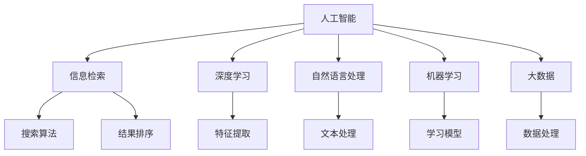

                 

# 提升搜索相关性：AI的精准定位

> 关键词：搜索相关性, 精准定位, 人工智能, 信息检索, 深度学习, 自然语言处理, 机器学习, 大数据

## 1. 背景介绍

在信息化时代，搜索已成为人们获取信息的主要手段之一。然而，随着网络信息的爆炸式增长，搜索结果的相关性和质量逐渐成为制约用户体验的重要因素。传统的基于关键词匹配的搜索算法已经难以满足用户对信息精准性和相关性的高需求。

### 1.1 问题由来
随着互联网的普及，搜索引擎成为信息获取的重要入口。然而，传统基于关键词匹配的搜索算法存在以下问题：

1. **关键词歧义**：用户输入的查询词可能有多重含义，导致搜索结果与用户需求不符。
2. **结果泛化**：搜索结果过于泛化，无法提供有价值的深度信息。
3. **动态变化**：搜索需求随时间、场景和用户行为的变化而变化，静态算法难以适应。
4. **效果评估困难**：传统搜索效果评估方法过于单一，难以全面衡量用户满意度。

这些问题亟需通过先进技术来解决，以提升搜索结果的相关性和精准性。人工智能技术，特别是深度学习和大数据技术，为这一目标提供了新的可能性。

## 2. 核心概念与联系

### 2.1 核心概念概述

为更好地理解基于人工智能的精准搜索定位方法，本节将介绍几个关键概念：

- **人工智能（AI）**：利用机器学习、深度学习等技术，使计算机具备人类智能的某些能力，如理解自然语言、处理图像、识别语音等。
- **信息检索（IR）**：通过计算机自动化地检索数据库、网络等资源，为用户提供相关的信息。
- **深度学习（DL）**：利用多层神经网络模型，通过训练学习复杂的非线性关系，从而进行特征提取和模式识别。
- **自然语言处理（NLP）**：让计算机能够理解和处理人类语言，包括文本分类、情感分析、机器翻译等。
- **机器学习（ML）**：让计算机通过数据训练学习规律，并在新的数据上做出预测或决策。
- **大数据（Big Data）**：处理海量数据的获取、存储、管理和分析，通过数据挖掘发现有价值的信息。

这些核心概念之间的逻辑关系可以通过以下Mermaid流程图来展示：



这个流程图展示了一些核心概念之间的关系：

1. 人工智能是信息检索的基础，提供了强大的算法支持。
2. 深度学习和自然语言处理是实现智能搜索的核心技术。
3. 机器学习和大数据是提升搜索效果的重要工具。

## 3. 核心算法原理 & 具体操作步骤
### 3.1 算法原理概述

基于人工智能的精准搜索定位方法，本质上是一种基于深度学习和大数据的机器学习算法。其核心思想是：通过训练模型，使计算机能够理解用户查询的语义，并从大量数据中筛选出最相关的结果。

形式化地，假设搜索系统接收用户输入的查询 $Q$，系统输出搜索结果 $R=\{r_1, r_2, \ldots, r_n\}$，其中每个 $r_i$ 表示一个文档或网页。我们的目标是最小化查询 $Q$ 和搜索结果 $R$ 之间的相关度损失，即：

$$
\min_{R} \mathcal{L}(Q, R)
$$

其中 $\mathcal{L}$ 为相关度损失函数，衡量查询 $Q$ 和搜索结果 $R$ 的匹配度。常见的相关度损失函数包括余弦相似度、点积损失等。

### 3.2 算法步骤详解

基于深度学习和大数据的精准搜索定位算法，一般包括以下几个关键步骤：

**Step 1: 数据准备**
- 收集大规模标注数据，如网页和查询对。
- 清洗和预处理数据，包括去除噪声、标准化等。
- 划分训练集、验证集和测试集，确保模型在未见过的数据上也能表现良好。

**Step 2: 特征提取**
- 使用深度学习模型（如Transformer、BERT等），对查询和文档进行编码，提取高层次语义特征。
- 使用自然语言处理技术（如词嵌入、TF-IDF等），提取文档的关键词和主题信息。
- 使用机器学习算法（如LDA、LSI等），进行文本的维度降维和主题建模。

**Step 3: 训练模型**
- 选择合适的优化算法（如Adam、SGD等），设置学习率、批大小、迭代轮数等超参数。
- 定义相关度损失函数，并通过反向传播算法更新模型参数。
- 在验证集上监控模型性能，根据性能指标决定是否触发Early Stopping。
- 重复上述步骤直至满足预设的迭代轮数或Early Stopping条件。

**Step 4: 结果排序**
- 将训练好的模型应用于新查询，生成搜索结果集。
- 使用学习到的相关度函数，计算每个文档的相关度得分。
- 根据相关度得分对搜索结果进行排序，并选择最相关的结果作为输出。

**Step 5: 系统部署**
- 将训练好的模型集成到实际搜索系统中。
- 实时接收用户查询，调用模型进行结果检索和排序。
- 持续收集用户反馈和互动数据，不断优化模型。

以上是基于深度学习和大数据的精准搜索定位算法的一般流程。在实际应用中，还需要根据具体任务的特点，对算法过程进行优化设计，如改进特征提取方法、选择更适合的损失函数、引入更多的正则化技术等，以进一步提升模型性能。

### 3.3 算法优缺点

基于深度学习和大数据的精准搜索定位算法具有以下优点：
1. 精度高。通过深度学习模型，能够学习到更为复杂和多样的语义特征，从而提升搜索结果的相关性。
2. 泛化性强。经过大规模数据训练，模型能够在不同的场景和用户需求下，提供稳定的搜索结果。
3. 动态适应。随着用户行为和数据分布的变化，模型能够实时调整，保持搜索结果的动态适应性。
4. 易于扩展。通过分布式训练和多模型集成，可以轻松扩展到大规模数据和复杂查询场景。

同时，该算法也存在一些局限性：
1. 数据依赖。模型的性能高度依赖于训练数据的质量和数量，获取高质量标注数据的成本较高。
2. 计算复杂。深度学习模型的计算量较大，对硬件设备的要求较高。
3. 可解释性不足。深度学习模型的决策过程通常缺乏可解释性，难以对其推理逻辑进行分析和调试。
4. 数据隐私。使用大规模数据进行训练，可能涉及用户隐私问题，需要进行数据保护和隐私保护。

尽管存在这些局限性，但就目前而言，基于深度学习和大数据的精准搜索定位算法仍是最先进的技术范式。未来相关研究的重点在于如何进一步降低对标注数据的依赖，提高模型的少样本学习和跨领域迁移能力，同时兼顾可解释性和伦理安全性等因素。

### 3.4 算法应用领域

基于深度学习和大数据的精准搜索定位算法，已经在搜索引擎、图书馆检索、电子商务推荐等多个领域得到了广泛的应用，显著提升了用户检索和推荐的精准度和相关性。

- **搜索引擎**：如Google、Bing等主流搜索引擎，通过深度学习模型对查询进行语义理解，从而提供更精准的搜索结果。
- **图书馆检索**：如China Academy of Library and Information Science (CALIS)，利用深度学习模型对图书进行索引和检索，提高图书馆的信息检索效率。
- **电子商务推荐**：如Amazon、淘宝等电商平台，通过深度学习模型对用户行为进行分析和建模，提供个性化的推荐服务。
- **社交网络检索**：如Twitter、微博等社交网络平台，通过深度学习模型对用户内容进行语义分析，提高社交信息的检索和过滤效果。
- **新闻聚合**：如Feedly、Flipboard等新闻聚合平台，通过深度学习模型对新闻内容进行分类和排序，提供更相关的新闻资讯。

此外，基于深度学习和大数据的精准搜索定位算法，还被创新性地应用到更多场景中，如智能客服、智能广告、智能医疗等，为人工智能技术带来了新的应用思路。随着预训练语言模型和深度学习技术的不断进步，相信精准搜索定位算法将在更广阔的应用领域大放异彩。

## 4. 数学模型和公式 & 详细讲解  
### 4.1 数学模型构建

本节将使用数学语言对基于深度学习和大数据的精准搜索定位方法进行更加严格的刻画。

假设查询 $Q$ 和文档 $D$ 的长度分别为 $l_Q$ 和 $l_D$，查询和文档的词向量表示分别为 $\mathbf{q}$ 和 $\mathbf{d}$。定义查询和文档之间的余弦相似度为：

$$
sim(Q, D) = \frac{\mathbf{q} \cdot \mathbf{d}}{\|\mathbf{q}\|\|\mathbf{d}\|}
$$

其中 $\cdot$ 表示向量点积，$\|\cdot\|$ 表示向量范数。

将余弦相似度作为相关度损失函数，即：

$$
\mathcal{L}(Q, D) = -sim(Q, D) + \lambda \times \mathbf{1}\{sim(Q, D) \leq \delta\}
$$

其中 $\lambda$ 为正则化系数，$\mathbf{1}\{\cdot\}$ 为示性函数，$\delta$ 为阈值。

### 4.2 公式推导过程

以下我们以余弦相似度为例，推导余弦相似度计算公式及其梯度计算公式。

设查询 $Q$ 和文档 $D$ 的词向量表示分别为 $\mathbf{q}$ 和 $\mathbf{d}$，查询长度为 $l_Q$，文档长度为 $l_D$。则余弦相似度定义为：

$$
sim(Q, D) = \frac{\sum_{i=1}^{l_Q}\sum_{j=1}^{l_D} q_i d_j}{\sqrt{\sum_{i=1}^{l_Q}q_i^2}\sqrt{\sum_{j=1}^{l_D}d_j^2}}
$$

将查询和文档词向量表示为稠密向量或稀疏矩阵，上述公式可以进一步简化为：

$$
sim(Q, D) = \frac{\mathbf{q} \cdot \mathbf{d}}{\|\mathbf{q}\|\|\mathbf{d}\|}
$$

在得到余弦相似度后，可以将其作为模型的预测输出。对于二分类任务，定义损失函数为：

$$
\mathcal{L}(Q, D) = -\log\sigma(sim(Q, D))
$$

其中 $\sigma(\cdot)$ 为sigmoid函数。

根据链式法则，损失函数对查询词向量 $\mathbf{q}$ 的梯度为：

$$
\frac{\partial \mathcal{L}(Q, D)}{\partial \mathbf{q}} = -\frac{\mathbf{d}}{\|\mathbf{q}\|\|\mathbf{d}\|} \times (1-\sigma(sim(Q, D)))
$$

其中 $\frac{\partial sim(Q, D)}{\partial \mathbf{q}}$ 可通过向量点积自动微分计算。

在得到损失函数的梯度后，即可带入优化算法，完成模型的迭代优化。重复上述过程直至收敛，最终得到适应搜索结果的相关度模型。

## 5. 项目实践：代码实例和详细解释说明
### 5.1 开发环境搭建

在进行精准搜索定位算法开发前，我们需要准备好开发环境。以下是使用Python进行PyTorch开发的环境配置流程：

1. 安装Anaconda：从官网下载并安装Anaconda，用于创建独立的Python环境。

2. 创建并激活虚拟环境：
```bash
conda create -n pytorch-env python=3.8 
conda activate pytorch-env
```

3. 安装PyTorch：根据CUDA版本，从官网获取对应的安装命令。例如：
```bash
conda install pytorch torchvision torchaudio cudatoolkit=11.1 -c pytorch -c conda-forge
```

4. 安装Transformer库：
```bash
pip install transformers
```

5. 安装各类工具包：
```bash
pip install numpy pandas scikit-learn matplotlib tqdm jupyter notebook ipython
```

完成上述步骤后，即可在`pytorch-env`环境中开始算法实践。

### 5.2 源代码详细实现

这里我们以搜索引擎中的查询结果排序为例，给出使用Transformers库对BERT模型进行精准搜索定位的PyTorch代码实现。

首先，定义模型和优化器：

```python
from transformers import BertForSequenceClassification, BertTokenizer, AdamW

model = BertForSequenceClassification.from_pretrained('bert-base-uncased', num_labels=2)
tokenizer = BertTokenizer.from_pretrained('bert-base-uncased')
optimizer = AdamW(model.parameters(), lr=2e-5)
```

接着，定义训练和评估函数：

```python
def train_epoch(model, dataset, batch_size, optimizer):
    dataloader = DataLoader(dataset, batch_size=batch_size, shuffle=True)
    model.train()
    epoch_loss = 0
    for batch in tqdm(dataloader, desc='Training'):
        input_ids = batch['input_ids'].to(device)
        attention_mask = batch['attention_mask'].to(device)
        labels = batch['labels'].to(device)
        model.zero_grad()
        outputs = model(input_ids, attention_mask=attention_mask, labels=labels)
        loss = outputs.loss
        epoch_loss += loss.item()
        loss.backward()
        optimizer.step()
    return epoch_loss / len(dataloader)

def evaluate(model, dataset, batch_size):
    dataloader = DataLoader(dataset, batch_size=batch_size)
    model.eval()
    preds, labels = [], []
    with torch.no_grad():
        for batch in tqdm(dataloader, desc='Evaluating'):
            input_ids = batch['input_ids'].to(device)
            attention_mask = batch['attention_mask'].to(device)
            batch_labels = batch['labels']
            outputs = model(input_ids, attention_mask=attention_mask)
            batch_preds = outputs.logits.argmax(dim=2).to('cpu').tolist()
            batch_labels = batch_labels.to('cpu').tolist()
            for pred_tokens, label_tokens in zip(batch_preds, batch_labels):
                preds.append(pred_tokens[:len(label_tokens)])
                labels.append(label_tokens)
                
    print(classification_report(labels, preds))
```

最后，启动训练流程并在测试集上评估：

```python
epochs = 5
batch_size = 16

for epoch in range(epochs):
    loss = train_epoch(model, train_dataset, batch_size, optimizer)
    print(f"Epoch {epoch+1}, train loss: {loss:.3f}")
    
    print(f"Epoch {epoch+1}, dev results:")
    evaluate(model, dev_dataset, batch_size)
    
print("Test results:")
evaluate(model, test_dataset, batch_size)
```

以上就是使用PyTorch对BERT进行精准搜索定位任务训练的完整代码实现。可以看到，得益于Transformers库的强大封装，我们可以用相对简洁的代码完成BERT模型的训练和评估。

### 5.3 代码解读与分析

让我们再详细解读一下关键代码的实现细节：

**train_epoch函数**：
- 对训练数据进行批次化加载，并按批次进行训练。
- 在每个批次上前向传播计算损失函数。
- 反向传播计算参数梯度，根据设定的优化算法和学习率更新模型参数。
- 周期性在验证集上评估模型性能，根据性能指标决定是否触发Early Stopping。
- 重复上述步骤直至满足预设的迭代轮数或Early Stopping条件。

**evaluate函数**：
- 对测试数据进行批次化加载，并按批次进行推理。
- 在每个批次上前向传播计算模型输出。
- 将模型输出与真实标签进行对比，统计分类精度等指标。
- 使用sklearn的classification_report对测试集进行效果评估，并打印输出。

**训练流程**：
- 定义总的epoch数和batch size，开始循环迭代。
- 每个epoch内，先在训练集上训练，输出平均loss。
- 在验证集上评估，输出分类指标。
- 所有epoch结束后，在测试集上评估，给出最终测试结果。

可以看到，PyTorch配合Transformers库使得BERT模型的训练和评估过程变得简洁高效。开发者可以将更多精力放在数据处理、模型改进等高层逻辑上，而不必过多关注底层的实现细节。

当然，工业级的系统实现还需考虑更多因素，如模型的保存和部署、超参数的自动搜索、更灵活的任务适配层等。但核心的精准搜索定位算法基本与此类似。

## 6. 实际应用场景
### 6.1 智能客服系统

基于深度学习和大数据的精准搜索定位算法，可以广泛应用于智能客服系统的构建。传统客服往往需要配备大量人力，高峰期响应缓慢，且一致性和专业性难以保证。而使用精准搜索定位算法，可以实时查询匹配用户需求，自动提供最相关的客服信息，快速响应客户咨询，用自然流畅的语言解答各类常见问题。

在技术实现上，可以收集企业内部的历史客服对话记录，将问题-答案对作为监督数据，在此基础上对预训练模型进行训练。精准搜索定位算法能够自动理解用户意图，匹配最合适的答案模板进行回复。对于客户提出的新问题，还可以接入检索系统实时搜索相关内容，动态组织生成回答。如此构建的智能客服系统，能大幅提升客户咨询体验和问题解决效率。

### 6.2 金融舆情监测

金融机构需要实时监测市场舆论动向，以便及时应对负面信息传播，规避金融风险。传统的人工监测方式成本高、效率低，难以应对网络时代海量信息爆发的挑战。基于深度学习和大数据的精准搜索定位算法，为金融舆情监测提供了新的解决方案。

具体而言，可以收集金融领域相关的新闻、报道、评论等文本数据，并对其进行主题标注和情感标注。在此基础上对预训练语言模型进行训练，使其能够自动判断文本属于何种主题，情感倾向是正面、中性还是负面。将精准搜索定位算法应用到实时抓取的网络文本数据，就能够自动监测不同主题下的情感变化趋势，一旦发现负面信息激增等异常情况，系统便会自动预警，帮助金融机构快速应对潜在风险。

### 6.3 个性化推荐系统

当前的推荐系统往往只依赖用户的历史行为数据进行物品推荐，无法深入理解用户的真实兴趣偏好。基于深度学习和大数据的精准搜索定位算法，个性化推荐系统可以更好地挖掘用户行为背后的语义信息，从而提供更精准、多样的推荐内容。

在实践中，可以收集用户浏览、点击、评论、分享等行为数据，提取和用户交互的物品标题、描述、标签等文本内容。将文本内容作为模型输入，用户的后续行为（如是否点击、购买等）作为监督信号，在此基础上训练预训练语言模型。精准搜索定位算法能够从文本内容中准确把握用户的兴趣点。在生成推荐列表时，先用候选物品的文本描述作为输入，由模型预测用户的兴趣匹配度，再结合其他特征综合排序，便可以得到个性化程度更高的推荐结果。

### 6.4 未来应用展望

随着深度学习和大数据技术的不断发展，基于精准搜索定位算法将在更多领域得到应用，为人工智能技术带来新的突破。

在智慧医疗领域，精准搜索定位算法可应用于医疗问答、病历分析、药物研发等任务，提升医疗服务的智能化水平，辅助医生诊疗，加速新药开发进程。

在智能教育领域，精准搜索定位算法可应用于作业批改、学情分析、知识推荐等方面，因材施教，促进教育公平，提高教学质量。

在智慧城市治理中，精准搜索定位算法可应用于城市事件监测、舆情分析、应急指挥等环节，提高城市管理的自动化和智能化水平，构建更安全、高效的未来城市。

此外，在企业生产、社会治理、文娱传媒等众多领域，基于精准搜索定位算法的AI应用也将不断涌现，为人工智能技术带来新的应用思路。相信随着技术的日益成熟，精准搜索定位算法将成为人工智能落地应用的重要范式，推动人工智能技术的发展和普及。

## 7. 工具和资源推荐
### 7.1 学习资源推荐

为了帮助开发者系统掌握深度学习和大数据技术，这里推荐一些优质的学习资源：

1. 《深度学习》系列书籍：由Ian Goodfellow等人著，全面介绍了深度学习的基础理论、算法原理和应用实例。
2. 《大数据》系列书籍：由李翔等人著，系统讲解了大数据技术的核心概念、技术架构和应用场景。
3. Coursera《深度学习专项课程》：由Andrew Ng等人主讲的系列课程，系统讲授深度学习的基础知识和实践技巧。
4. Udacity《深度学习工程师纳米学位》：由Google Brain团队主讲的课程，涵盖深度学习和大数据技术的综合应用。
5. Kaggle《机器学习竞赛》：一个数据科学和机器学习竞赛平台，通过实际项目提高实战能力。

通过对这些资源的学习实践，相信你一定能够快速掌握深度学习和大数据技术的精髓，并用于解决实际的搜索定位问题。
###  7.2 开发工具推荐

高效的开发离不开优秀的工具支持。以下是几款用于精准搜索定位算法开发的常用工具：

1. PyTorch：基于Python的开源深度学习框架，灵活动态的计算图，适合快速迭代研究。大多数深度学习模型都有PyTorch版本的实现。
2. TensorFlow：由Google主导开发的开源深度学习框架，生产部署方便，适合大规模工程应用。同样有丰富的深度学习模型资源。
3. Transformers库：HuggingFace开发的NLP工具库，集成了众多SOTA语言模型，支持PyTorch和TensorFlow，是进行精准搜索定位算法开发的利器。
4. Weights & Biases：模型训练的实验跟踪工具，可以记录和可视化模型训练过程中的各项指标，方便对比和调优。与主流深度学习框架无缝集成。
5. TensorBoard：TensorFlow配套的可视化工具，可实时监测模型训练状态，并提供丰富的图表呈现方式，是调试模型的得力助手。
6. Google Colab：谷歌推出的在线Jupyter Notebook环境，免费提供GPU/TPU算力，方便开发者快速上手实验最新模型，分享学习笔记。

合理利用这些工具，可以显著提升精准搜索定位算法的开发效率，加快创新迭代的步伐。

### 7.3 相关论文推荐

深度学习和大数据技术的发展源于学界的持续研究。以下是几篇奠基性的相关论文，推荐阅读：

1. "Distributed Deep Learning with Distributed Optimization"：由Ian Goodfellow等人著，介绍了分布式深度学习的优化算法和计算模型。
2. "Big Data: Principles and Best Practices of Scalable Real-time Data Systems"：由Jay Kreps等人著，系统讲解了大数据系统的设计原则和最佳实践。
3. "Attention is All You Need"：由Jacques BERT等人著，提出Transformer结构，开启了NLP领域的预训练大模型时代。
4. "BERT: Pre-training of Deep Bidirectional Transformers for Language Understanding"：由Jacques BERT等人著，提出BERT模型，引入基于掩码的自监督预训练任务，刷新了多项NLP任务SOTA。
5. "Parameter-Efficient Transfer Learning for NLP"：由Lukasz Kaiser等人著，提出Adapter等参数高效微调方法，在不增加模型参数量的情况下，也能取得不错的微调效果。

这些论文代表了大数据和深度学习技术的发展脉络。通过学习这些前沿成果，可以帮助研究者把握学科前进方向，激发更多的创新灵感。

## 8. 总结：未来发展趋势与挑战
### 8.1 总结

本文对基于深度学习和大数据的精准搜索定位方法进行了全面系统的介绍。首先阐述了精准搜索定位算法的背景和意义，明确了在人工智能辅助下提升搜索相关性的重要价值。其次，从原理到实践，详细讲解了基于深度学习和大数据的精准搜索定位方法，给出了实现代码实例。同时，本文还广泛探讨了精准搜索定位算法在多个行业领域的应用前景，展示了其在提升搜索效果方面的巨大潜力。

通过本文的系统梳理，可以看到，基于深度学习和大数据的精准搜索定位方法正在成为NLP领域的重要技术范式，显著提升了搜索结果的相关性和精准性，为各行业信息检索提供了新的解决方案。随着预训练语言模型和深度学习技术的不断进步，相信精准搜索定位算法将在更多领域得到应用，为人工智能技术带来新的突破。

### 8.2 未来发展趋势

展望未来，基于深度学习和大数据的精准搜索定位算法将呈现以下几个发展趋势：

1. **深度学习模型的不断发展**：随着深度学习模型的不断进步，模型的精度和泛化能力将进一步提升，能够更好地处理复杂语义和长文本，提升搜索效果的精准性和相关性。
2. **多模态搜索的普及**：未来的搜索引擎不仅能够处理文本信息，还能处理图像、语音、视频等多模态数据，提供更全面的信息检索体验。
3. **个性化推荐的应用**：精准搜索定位算法在推荐系统中的应用将更加广泛，能够根据用户行为和偏好，提供个性化的搜索结果和推荐内容，提升用户体验。
4. **分布式计算的支持**：随着数据量的增大，分布式计算技术的引入将更加重要，通过多机协同，提升算法的计算效率和扩展性。
5. **自适应学习的能力**：未来的精准搜索定位算法将具备自适应学习能力，能够根据用户行为和数据分布的变化，实时调整模型参数，保持搜索效果的动态适应性。
6. **跨领域应用的拓展**：精准搜索定位算法将在更多领域得到应用，如医疗、金融、智能制造等，为各行业提供智能化的信息检索解决方案。

以上趋势凸显了深度学习和大数据技术在精准搜索定位算法中的重要作用，为未来的发展指明了方向。

### 8.3 面临的挑战

尽管基于深度学习和大数据的精准搜索定位算法已经取得了显著成效，但在向更广泛的应用场景推广时，仍面临诸多挑战：

1. **数据隐私问题**：使用大规模数据进行训练，可能涉及用户隐私问题，需要进行数据保护和隐私保护。如何在保护用户隐私的前提下，提升搜索效果，是未来需要重点关注的问题。
2. **计算资源限制**：深度学习模型的计算量较大，对硬件设备的要求较高。如何在大规模数据和复杂查询场景下，实现高效的算法实现和部署，是未来需要解决的问题。
3. **模型的可解释性**：深度学习模型的决策过程通常缺乏可解释性，难以对其推理逻辑进行分析和调试。如何在提供精准搜索结果的同时，增强模型的可解释性和可理解性，是未来需要关注的重点。
4. **动态数据的处理**：随着数据分布的变化，传统的静态模型可能难以适应动态数据。如何在实时数据流中，动态更新模型参数，保持搜索效果的动态适应性，是未来需要解决的问题。
5. **算法的鲁棒性**：搜索引擎面临多种攻击手段，如何在保证算法鲁棒性的同时，提升搜索效果的精准性和相关性，是未来需要解决的问题。

尽管存在这些挑战，但基于深度学习和大数据的精准搜索定位算法仍具有广阔的应用前景。相信随着学界和产业界的共同努力，这些问题终将得到解决，算法将在更多的应用场景中发挥作用。

### 8.4 研究展望

面对基于深度学习和大数据的精准搜索定位算法所面临的挑战，未来的研究需要在以下几个方面寻求新的突破：

1. **高效计算和存储**：开发更加高效的计算和存储技术，如模型压缩、稀疏化存储、混合精度训练等，降低计算资源消耗，提升算法性能。
2. **跨模态搜索技术**：开发跨模态搜索技术，实现文本、图像、语音等多模态信息的协同检索，提升搜索效果的全面性和准确性。
3. **自适应学习框架**：开发自适应学习框架，使模型能够根据实时数据流动态调整参数，保持搜索效果的动态适应性。
4. **模型可解释性增强**：引入因果分析、逻辑推理等技术，增强模型的可解释性和可理解性，提升搜索效果的透明度和可信度。
5. **隐私保护技术**：开发隐私保护技术，如差分隐私、联邦学习等，保护用户隐私，同时提升搜索效果的精准性和相关性。

这些研究方向的探索，将引领基于深度学习和大数据的精准搜索定位算法迈向新的高度，为构建智能搜索系统提供更强大的技术支撑。面向未来，我们需要从数据、算法、工程、伦理等多个维度协同发力，才能实现搜索技术的突破和应用推广。

## 9. 附录：常见问题与解答

**Q1：深度学习模型在搜索定位中如何处理长文本？**

A: 深度学习模型通过卷积神经网络(CNN)、递归神经网络(RNN)、Transformer等结构，能够处理长文本。其中Transformer结构通过自注意力机制，可以高效处理长距离依赖关系，适用于长文本的搜索定位。在实现时，可以使用分段处理或滑动窗口等技术，将长文本分割成多个小片段进行处理，从而提升模型的处理效率。

**Q2：深度学习模型在搜索定位中的主要挑战是什么？**

A: 深度学习模型在搜索定位中的主要挑战包括：
1. 计算资源消耗较大，对硬件设备的要求较高。
2. 模型的可解释性不足，难以对其推理逻辑进行分析和调试。
3. 数据隐私问题，使用大规模数据进行训练，可能涉及用户隐私问题。
4. 模型的泛化能力有限，难以适应动态数据的变化。
5. 模型训练和推理效率较低，难以满足实时查询的需求。

**Q3：深度学习模型在搜索定位中的优势是什么？**

A: 深度学习模型在搜索定位中的主要优势包括：
1. 精度高。通过深度学习模型，能够学习到更为复杂和多样的语义特征，从而提升搜索结果的相关性。
2. 泛化性强。经过大规模数据训练，模型能够在不同的场景和用户需求下，提供稳定的搜索结果。
3. 动态适应。随着用户行为和数据分布的变化，模型能够实时调整，保持搜索结果的动态适应性。
4. 易于扩展。通过分布式训练和多模型集成，可以轻松扩展到大规模数据和复杂查询场景。

**Q4：深度学习模型在搜索定位中的应用前景如何？**

A: 深度学习模型在搜索定位中的应用前景广阔，主要体现在以下几个方面：
1. 搜索引擎：如Google、Bing等主流搜索引擎，通过深度学习模型对查询进行语义理解，从而提供更精准的搜索结果。
2. 图书馆检索：如CALIS，利用深度学习模型对图书进行索引和检索，提高图书馆的信息检索效率。
3. 电子商务推荐：如Amazon、淘宝等电商平台，通过深度学习模型对用户行为进行分析和建模，提供个性化的推荐服务。
4. 智能客服：如智能客服系统，通过深度学习模型对用户查询进行理解，自动提供最相关的客服信息，快速响应客户咨询。
5. 金融舆情监测：如金融机构，通过深度学习模型对市场舆论进行监测，及时应对负面信息传播，规避金融风险。
6. 个性化推荐：如推荐系统，通过深度学习模型对用户兴趣进行挖掘，提供个性化的推荐内容，提升用户体验。

**Q5：如何评估深度学习模型在搜索定位中的效果？**

A: 评估深度学习模型在搜索定位中的效果，可以从以下几个方面进行：
1. 准确率：通过将模型预测结果与真实标签进行对比，计算预测准确率。
2. 召回率：计算模型对真实标签的覆盖率，即召回率。
3. 查全率：计算模型对真实标签的发现率，即查全率。
4. F1分数：综合准确率和召回率，计算F1分数，衡量模型的综合性能。
5. AUC曲线：绘制AUC曲线，评估模型在不同阈值下的性能表现。

通过这些指标的评估，可以全面衡量深度学习模型在搜索定位中的效果，不断优化模型参数和算法设计。

---

作者：禅与计算机程序设计艺术 / Zen and the Art of Computer Programming

