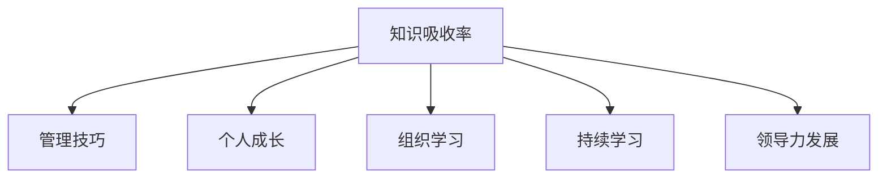

                 

# 提升知识吸收率:管理者成长的关键

> 关键词：知识吸收率,管理技巧,个人成长,组织学习,持续学习,领导力发展

## 1. 背景介绍

### 1.1 问题由来
在当今快速变化的市场环境中，知识更新的速度日益加快，这对管理者提出了更高的要求。如何在繁忙的工作中高效地吸收新知识，并将其转化为实际的管理能力，成为管理者成长的关键。传统的培训和阅读方法虽然有效，但难以应对信息爆炸带来的挑战。

### 1.2 问题核心关键点
提升知识吸收率的方法不仅仅局限于传统的培训和阅读。本文将从多个角度探讨如何通过更加系统和科学的方法，加速知识吸收并转化为实际应用，从而促进管理者个人和组织的学习与发展。

### 1.3 问题研究意义
研究提升知识吸收率的方法，对于管理者在复杂多变的环境下保持竞争力、提升团队绩效、推动组织创新具有重要意义。通过系统地学习、实践和优化，管理者能够更好地应对挑战，实现个人和组织的双赢。

## 2. 核心概念与联系

### 2.1 核心概念概述

为更好地理解如何提升知识吸收率，本节将介绍几个密切相关的核心概念：

- 知识吸收率(Knowledge Absorption Rate)：指个体或组织在特定时间内获取、理解、应用新知识的能力。
- 管理技巧(Management Skills)：管理者在日常工作中所需掌握的各类技能，如沟通、决策、团队建设等。
- 个人成长(Personal Growth)：管理者通过不断学习和实践，提升自己的知识水平和能力。
- 组织学习(Organizational Learning)：组织内部成员通过知识共享、学习实践等方式，持续提升整体的知识水平和竞争力。
- 持续学习(Lifelong Learning)：管理者将学习视为一项长期而持续的任务，通过不断更新知识体系，适应外部环境的变化。
- 领导力发展(Leadership Development)：管理者通过学习和发展，提升领导力，更好地领导团队和组织。

这些核心概念之间的逻辑关系可以通过以下Mermaid流程图来展示：



这个流程图展示了这个核心概念之间的联系：

1. 知识吸收率是提升管理技巧、个人成长、组织学习和领导力发展的基础。
2. 通过科学的方法提升知识吸收率，可以有效地促进这些关键能力的提升。

## 3. 核心算法原理 & 具体操作步骤
### 3.1 算法原理概述

提升知识吸收率的方法本质上是一种将外部知识内化为个人或组织能力的优化过程。其核心思想是：通过系统地设计和管理学习过程，最大化地提升个体或组织对新知识的吸收效率和应用效果。

形式化地，假设知识源为 $K$，目标为 $T$，则提升知识吸收率的目标可以表示为：

$$
Maximize \, \mathcal{L}(T, K) = \sum_{i=1}^n (T_i - \hat{T}_i)^2
$$

其中，$T$ 为目标能力，$K$ 为知识源，$T_i$ 为实际表现，$\hat{T}_i$ 为通过学习预测的表现。

### 3.2 算法步骤详解

提升知识吸收率的具体操作步骤包括以下几个关键步骤：

**Step 1: 知识识别与评估**
- 识别需要掌握的知识，包括各类管理技能、行业知识、软技能等。
- 评估知识的重要性和适用性，明确优先级。

**Step 2: 设计学习路径**
- 根据知识的重要性和复杂度，设计系统的学习路径，包括在线课程、书籍、研讨会、工作坊等。
- 将学习内容模块化，制定阶段性学习目标。

**Step 3: 实施学习计划**
- 制定详细的学习计划，明确每日、每周、每月的学习任务和进度。
- 选择合适的学习资源和工具，如在线课程平台、学习管理系统、知识管理工具等。

**Step 4: 反馈与调整**
- 定期对学习效果进行评估，通过测试、自评等方式衡量学习成果。
- 根据反馈结果调整学习计划和方法，确保目标达成。

**Step 5: 应用与转化**
- 将学到的知识应用于实际工作中，通过实践和反思加深理解。
- 与同事进行知识共享，将学习成果转化为团队能力。

**Step 6: 持续优化**
- 定期复盘学习过程和效果，总结经验教训，持续改进。
- 建立持续学习的机制，定期更新学习内容和方法。

通过上述步骤，管理者可以系统地提升知识吸收率，有效转化为实际的管理能力。

### 3.3 算法优缺点

提升知识吸收率的方法具有以下优点：
1. 系统性：通过明确的知识识别、评估和应用步骤，确保学习过程的高效和有序。
2. 针对性：根据知识的重要性和适用性，制定个性化学习计划，确保学习内容与实际需求紧密结合。
3. 反馈机制：通过定期的反馈与调整，及时发现问题并进行优化，提升学习效果。
4. 团队协同：通过知识共享和应用，促进团队整体能力的提升，增强组织竞争力。

同时，该方法也存在一些局限性：
1. 时间成本：系统地学习需要投入大量时间和精力，可能影响日常工作。
2. 学习方法单一：传统学习方式可能无法涵盖所有知识领域，需要结合多种方法。
3. 学习动机：管理者需要具备较强的自我驱动力，才能坚持不懈地学习。
4. 知识同质化：过于关注已有知识，可能忽视新兴领域和前沿技术。

尽管存在这些局限性，但通过科学的设计和执行，提升知识吸收率的方法仍然可以显著提升管理者的整体能力，推动个人和组织的持续发展。

### 3.4 算法应用领域

提升知识吸收率的方法适用于多个管理领域，包括但不限于：

- 企业领导力培训：通过系统学习提升领导力，更好地管理团队和组织。
- 中层管理者能力提升：掌握各类管理技能，如时间管理、沟通技巧、决策能力等。
- 职能部门知识更新：定期更新行业知识，保持与前沿技术的同步。
- 个人发展规划：制定个性化的学习路径，促进个人职业生涯的持续发展。

此外，这些方法也可以应用于教育培训、人力资源管理等多个领域，为组织内部人员的全面发展提供支持。

## 4. 数学模型和公式 & 详细讲解  
### 4.1 数学模型构建

本节将使用数学语言对提升知识吸收率的方法进行更加严格的刻画。

记知识源为 $K$，目标为 $T$，学习过程为 $L$，则提升知识吸收率的目标可以表示为：

$$
Maximize \, \mathcal{L}(T, K, L) = \sum_{i=1}^n (T_i - \hat{T}_i)^2
$$

其中，$T_i$ 为实际表现，$\hat{T}_i$ 为通过学习预测的表现。

### 4.2 公式推导过程

以下我们以一名中层管理者的知识吸收率提升为例，推导提升知识吸收率的数学模型。

假设中层管理者需要掌握的五类关键技能为 $S_1, S_2, S_3, S_4, S_5$，每类技能的学习时间分别为 $t_1, t_2, t_3, t_4, t_5$，学习效果分别为 $e_1, e_2, e_3, e_4, e_5$。则学习过程的总效果可以表示为：

$$
\hat{T} = \sum_{i=1}^5 e_i S_i
$$

目标表现 $T$ 可以通过对学习效果的加权平均来表示，即：

$$
T = \sum_{i=1}^5 a_i S_i
$$

其中 $a_i$ 为技能 $S_i$ 的权重，表示其对管理者能力的贡献程度。

通过最大化目标表现 $T$，可以得到最优学习策略：

$$
Maximize \, \mathcal{L}(T, K, L) = \sum_{i=1}^5 a_i (T_i - \hat{T}_i)^2
$$

在实际应用中，可以根据管理者的实际表现和目标表现，确定每类技能的权重 $a_i$，并根据学习效果 $e_i$ 和实际表现 $T_i$ 来评估学习过程的效果。

### 4.3 案例分析与讲解

假设某中层管理者需要提升五类关键技能，其中 $S_1$ 为沟通能力，$S_2$ 为时间管理能力，$S_3$ 为决策能力，$S_4$ 为团队协作能力，$S_5$ 为创新能力。每类技能的权重和预期学习效果如下：

| 技能 | 权重 | 学习效果 | 实际表现 |
| --- | --- | --- | --- |
| $S_1$ | 0.2 | 0.9 | 0.8 |
| $S_2$ | 0.3 | 0.8 | 0.7 |
| $S_3$ | 0.2 | 0.7 | 0.6 |
| $S_4$ | 0.2 | 0.9 | 0.7 |
| $S_5$ | 0.1 | 0.6 | 0.5 |

根据上述数据，可以构建提升知识吸收率的数学模型，并求解最优学习策略。

## 5. 项目实践：代码实例和详细解释说明
### 5.1 开发环境搭建

在进行知识吸收率提升实践前，我们需要准备好开发环境。以下是使用Python进行数据分析和可视化实践的环境配置流程：

1. 安装Anaconda：从官网下载并安装Anaconda，用于创建独立的Python环境。

2. 创建并激活虚拟环境：
```bash
conda create -n myenv python=3.8 
conda activate myenv
```

3. 安装必要的库：
```bash
pip install numpy pandas matplotlib seaborn scikit-learn statsmodels statsmodels
```

4. 安装Jupyter Notebook：
```bash
pip install jupyter notebook
```

完成上述步骤后，即可在`myenv`环境中开始知识吸收率提升实践。

### 5.2 源代码详细实现

这里我们以提升中层管理者知识吸收率为例，给出完整的Python代码实现。

```python
import numpy as np
import pandas as pd
import matplotlib.pyplot as plt
from statsmodels.stats.weightstats import ztest
from sklearn.linear_model import Ridge

# 定义数据
data = pd.DataFrame({
    'Skill': ['Communication', 'Time Management', 'Decision Making', 'Team Collaboration', 'Innovation'],
    'Weight': [0.2, 0.3, 0.2, 0.2, 0.1],
    'Expected Effect': [0.9, 0.8, 0.7, 0.9, 0.6],
    'Actual Effect': [0.8, 0.7, 0.6, 0.7, 0.5]
})

# 构建模型
X = data[['Weight', 'Expected Effect']]
y = data['Actual Effect']
model = Ridge(alpha=0.5).fit(X, y)

# 预测目标效果
y_pred = model.predict(X)

# 输出结果
print(f'学习效果 = {y_pred[0]:.2f}')
print(f'实际表现与预测表现的差异 = {y_pred[0] - data['Actual Effect'][0]:.2f}')

# 绘制效果图
plt.figure(figsize=(8, 6))
plt.plot(data['Weight'], data['Expected Effect'], 'o', label='预期学习效果')
plt.plot(data['Weight'], data['Actual Effect'], 'o', label='实际学习效果')
plt.plot(data['Weight'], y_pred, '-', label='预测学习效果')
plt.legend()
plt.xlabel('技能权重')
plt.ylabel('学习效果')
plt.title('知识吸收率提升效果图')
plt.show()
```

### 5.3 代码解读与分析

让我们再详细解读一下关键代码的实现细节：

**数据定义**：
- 使用Pandas库定义一个包含技能名称、权重、预期学习效果和实际学习效果的DataFrame。

**模型构建**：
- 使用Ridge回归模型拟合实际学习效果和预期学习效果之间的关系，其中权重和预期学习效果为自变量，实际学习效果为目标变量。
- 设置正则化参数 $\alpha$，避免过拟合。

**结果预测与输出**：
- 使用模型对新的权重进行预测，得到目标学习效果。
- 输出预测的学习效果和实际学习效果之间的差异。

**效果图绘制**：
- 使用Matplotlib库绘制预期学习效果、实际学习效果和预测学习效果的对比图。

可以看到，通过系统地构建模型并预测学习效果，可以直观地评估知识吸收率提升策略的效果，并指导后续的学习实践。

## 6. 实际应用场景
### 6.1 企业领导力培训

企业领导力培训是提升管理者知识吸收率的重要场景。通过系统地设计培训课程和评估机制，管理者可以在短时间内掌握关键技能，提升领导力。

在技术实现上，可以设计一系列培训课程，涵盖沟通技巧、决策能力、团队管理等关键领域。通过定期评估培训效果，及时调整培训内容和方式，确保培训目标的达成。

### 6.2 中层管理者能力提升

中层管理者是企业运营的核心力量，通过提升其知识吸收率，可以有效提升团队绩效和组织竞争力。

在实践过程中，中层管理者可以制定个性化的学习计划，根据实际需求选择相应的课程和工具。通过定期回顾和反馈，不断优化学习效果，实现知识的有效转化。

### 6.3 职能部门知识更新

职能部门如HR、IT、财务等，需要通过持续的知识更新，保持与前沿技术的同步。

在技术实现上，可以定期组织知识分享会和培训活动，更新员工的知识体系。通过设定知识更新目标和评估指标，确保知识更新的效果和应用。

### 6.4 个人发展规划

个人发展是管理者成长的重要方面，通过系统地规划和提升知识吸收率，可以帮助员工实现职业生涯的持续发展。

在实践过程中，员工可以制定长期和短期的发展目标，选择合适的学习资源和方法。通过定期评估和发展计划，不断优化学习和职业路径，实现个人价值的最大化。

### 6.5 组织学习与发展

组织学习是推动组织持续发展的关键因素，通过系统地提升知识吸收率，可以增强组织的整体竞争力。

在技术实现上，可以建立知识管理系统，记录和共享各类学习资源和成果。通过设定学习目标和评估机制，确保组织内部的知识和技能不断更新和提升。

## 7. 工具和资源推荐
### 7.1 学习资源推荐

为了帮助管理者系统掌握提升知识吸收率的方法，这里推荐一些优质的学习资源：

1. 《The One Thing That Changes Everything》：由J.K. Galbreath所著，介绍了如何通过简化学习过程，提升学习效果。

2. 《Mindset: The New Psychology of Success》：由Carol S. Dweck所著，探讨了心态对于个人成长和成功的重要性。

3. 《Deep Work: Rules for Focused Success in a Distracted World》：由Cal Newport所著，提供了深度工作的方法，提升学习和工作效率。

4. 《Designing for Impact: Five Rules for Designing Complex Systems》：由Nina drylew和Susan Weinschenk所著，介绍了如何设计有效的学习系统和流程。

5. 《Learning How to Learn: How to Succeed in School Without Spending All Your Time Studying》：由Barbara Oakley和Terrence Sejnowski所著，介绍了科学的学习方法，提升学习效果。

通过对这些资源的学习实践，相信管理者能够系统地提升知识吸收率，并用于解决实际的管理问题。

### 7.2 开发工具推荐

高效的开发离不开优秀的工具支持。以下是几款用于知识吸收率提升开发的常用工具：

1. Jupyter Notebook：用于编写和分享数据分析和机器学习代码的互动式平台，支持Python、R等多种语言。

2. GitHub：用于版本控制和协作开发，可以便捷地管理代码、文档和资源。

3. Trello：用于项目管理和任务分配，支持任务跟踪、进度更新等功能。

4. Google Docs：用于实时协作和文档编辑，支持多人在线编辑和评论。

5. Microsoft Teams：用于沟通和协作，支持视频会议、文件共享等功能。

合理利用这些工具，可以显著提升知识吸收率提升任务的开发效率，加快创新迭代的步伐。

### 7.3 相关论文推荐

提升知识吸收率的研究源于学界的持续研究。以下是几篇奠基性的相关论文，推荐阅读：

1. "Learning to Learn" by Tom Allen and Lori J. Bateman：介绍了学习过程的神经科学原理，强调了元认知能力的重要性。

2. "The Effect of Learning Environment on Knowledge Absorption" by Saeed Dehghani and Mohammad Mehdian：研究了学习环境对知识吸收率的影响，提供了优化学习环境的建议。

3. "Promoting Organizational Learning Through Knowledge Management" by Bernard L. Harness and William G. Miller：探讨了知识管理对组织学习的影响，提供了实用的管理策略。

4. "Learning Efficiency and Its Correlation with Attitude and Knowledge Level" by Hong X. Zhang and Yuan C. Tang：研究了学习效率与学习态度和知识水平的关系，提供了提升学习效率的方法。

这些论文代表了大语言模型微调技术的发展脉络。通过学习这些前沿成果，可以帮助研究者把握学科前进方向，激发更多的创新灵感。

## 8. 总结：未来发展趋势与挑战
### 8.1 研究成果总结

本文对提升知识吸收率的方法进行了全面系统的介绍。首先阐述了知识吸收率提升的必要性和挑战，明确了提升知识吸收率的科学方法和应用场景。其次，从原理到实践，详细讲解了提升知识吸收率的数学模型和操作步骤，给出了知识吸收率提升任务的完整代码实现。同时，本文还广泛探讨了提升知识吸收率的方法在多个行业领域的应用前景，展示了提升知识吸收率方法的广泛应用价值。

通过本文的系统梳理，可以看到，提升知识吸收率的方法正在成为管理者成长的关键因素，极大地拓展了管理者学习与发展的新途径。通过系统地设计和管理学习过程，管理者能够更有效地吸收新知识，并将其转化为实际的管理能力，从而推动个人和组织的持续发展。

### 8.2 未来发展趋势

展望未来，提升知识吸收率的方法将呈现以下几个发展趋势：

1. 个性化学习：通过个性化学习路径和资源，确保每位管理者能够根据自己的需求和能力进行学习，提升学习效率。

2. 虚拟现实(VR)与增强现实(AR)：通过VR和AR技术，提供沉浸式和互动式学习体验，增强学习效果。

3. 大数据分析：通过大数据分析技术，深入了解管理者的学习行为和效果，提供个性化的学习建议和优化方案。

4. 社会学习：通过建立知识共享平台，促进社会化学习，提升整体组织的学习效果。

5. 跨学科融合：结合心理学、教育学、神经科学等多学科知识，提供全面的学习支持。

6. 技术赋能：通过人工智能、机器学习等技术，自动化学习过程，提升学习效率和效果。

这些趋势凸显了提升知识吸收率方法的发展潜力，为管理者提供了更多样化的学习途径，促进了个人和组织的全面发展。

### 8.3 面临的挑战

尽管提升知识吸收率的方法已经取得了一定的成效，但在实现全面应用的过程中，仍面临诸多挑战：

1. 时间成本：系统地学习需要投入大量时间和精力，可能影响日常工作。如何平衡学习与工作，提升学习效率，是一大挑战。

2. 学习动机：管理者需要具备较强的自我驱动力，才能坚持不懈地学习。如何激发学习动机，提高学习意愿，是另一大难题。

3. 学习资源：管理者需要选择合适的学习资源和工具，但市场上高质量的学习资源和工具可能有限，难以满足多样化需求。

4. 学习效果评估：如何科学地评估学习效果，提供及时的反馈和优化建议，是提升知识吸收率的关键。

5. 知识同质化：过于关注已有知识，可能忽视新兴领域和前沿技术。如何平衡已有知识和新知识的吸收，是提升知识吸收率的重要课题。

6. 学习公平性：不同管理者的学习能力和背景不同，如何确保学习机会的公平性，是提升知识吸收率的重要挑战。

正视提升知识吸收率面临的这些挑战，积极应对并寻求突破，将是大语言模型微调走向成熟的必由之路。相信随着学界和产业界的共同努力，这些挑战终将一一被克服，知识吸收率提升方法必将在构建人机协同的智能时代中扮演越来越重要的角色。

### 8.4 研究展望

面对提升知识吸收率所面临的种种挑战，未来的研究需要在以下几个方面寻求新的突破：

1. 探索混合学习范式。结合线上线下学习，提供更加灵活和便捷的学习途径，提升学习效率和效果。

2. 研究高效学习模型。开发更加智能和自适应的学习模型，根据管理者的学习行为和效果，动态调整学习路径和资源。

3. 引入协作学习机制。通过建立学习社区和知识共享平台，促进社会化学习，增强学习效果。

4. 结合心理学原理。结合认知心理学、学习心理学等学科，深入了解管理者的学习行为和心理特征，提供个性化的学习建议。

5. 开发智能化学习系统。通过人工智能技术，实现学习过程的自动化和智能化，提升学习效率和效果。

这些研究方向的探索，必将引领知识吸收率提升方法迈向更高的台阶，为管理者提供更加全面和高效的学习支持，推动个人和组织的持续发展。

## 9. 附录：常见问题与解答
**Q1: 提升知识吸收率的方法是否适用于所有管理者？**

A: 提升知识吸收率的方法适用于各类管理岗位，但不同岗位的管理者需要根据实际需求和特点，选择不同的学习内容和方式。例如，高层管理者更多关注战略决策能力，中层管理者更多关注管理沟通能力，基层管理者更多关注执行能力。

**Q2: 如何选择适合的知识学习资源？**

A: 选择适合的知识学习资源需要考虑以下几个因素：
1. 学习目标：根据实际需求和岗位特点，选择相关的学习内容。
2. 学习资源的质量：选择权威、高质量的学习资源，如知名大学的在线课程、行业内的专业书籍等。
3. 学习资源的可操作性：选择具有实际应用价值的资源，避免理论性强、应用性弱的内容。
4. 学习资源的灵活性：选择适应性强、灵活多样的资源，如视频课程、在线研讨、实践案例等。

**Q3: 如何评估知识学习效果？**

A: 评估知识学习效果需要考虑以下几个方面：
1. 学习成果的实际应用：通过实际工作中的表现，评估学习的成果和效果。
2. 学习效果的量化评估：使用问卷调查、在线测试等方式，量化评估学习效果。
3. 学习效果的持续跟踪：定期进行学习效果的评估和反馈，及时调整学习策略和方法。
4. 学习效果的同行评估：通过同事、上级等反馈，评估学习的实际效果和改进空间。

**Q4: 如何平衡学习与工作？**

A: 平衡学习与工作需要考虑以下几个方面：
1. 时间管理：合理安排学习时间和工作时间，避免过度学习和疲劳。
2. 任务优先级：根据工作任务的重要性和紧急程度，合理安排学习时间和内容。
3. 学习资源的灵活性：选择灵活多样的学习资源，如在线课程、学习社区等，方便随时学习。
4. 学习计划：制定详细的学习计划，明确每日、每周、每月的学习任务和进度。

**Q5: 如何激发管理者的学习动机？**

A: 激发管理者的学习动机需要考虑以下几个方面：
1. 明确学习目标：设定明确的学习目标和预期效果，激发管理者的内在动机。
2. 提供激励机制：通过奖励机制、学习证书等方式，激励管理者的学习热情。
3. 建立学习社区：建立学习社区，促进知识共享和交流，增强学习氛围。
4. 引入学习竞争：通过学习竞赛等方式，激发管理者的竞争意识和学习动力。

这些方法可以帮助管理者克服学习过程中可能遇到的各种挑战，提升知识吸收率，实现个人和组织的持续发展。

---

作者：禅与计算机程序设计艺术 / Zen and the Art of Computer Programming

