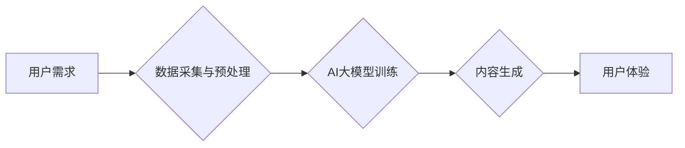

                 

## AI大模型在电商平台内容生成中的应用

> 关键词：电商平台、AI大模型、内容生成、自然语言处理、推荐系统、个性化体验、文本摘要、产品描述、营销文案

## 1. 背景介绍

随着电商平台的蓬勃发展，内容已成为其核心竞争力之一。优质、丰富、个性化的内容能够吸引用户、提升用户体验，最终促进交易转化。然而，传统的内容创作方式往往面临着效率低下、成本高昂、难以满足个性化需求等问题。

近年来，人工智能（AI）技术，特别是大模型的快速发展，为电商平台内容生成提供了全新的解决方案。AI大模型凭借其强大的文本理解和生成能力，能够自动生成高质量、符合用户需求的内容，极大地提升了内容创作效率和个性化程度。

## 2. 核心概念与联系

### 2.1  电商平台内容生成

电商平台内容生成是指利用技术手段自动生成各种电商平台所需的文本内容，例如：

* **产品描述：**  详细介绍产品的功能、特点、规格等信息。
* **营销文案：**  用于促销、推广产品的宣传语、广告语等。
* **商品评论：**  模拟用户对产品的评价和反馈。
* **推荐内容：**  根据用户的兴趣和购买历史，推荐相关商品或内容。
* **客服回复：**  自动回复用户的咨询和问题。

### 2.2  AI大模型

AI大模型是指在海量数据上训练的深度学习模型，具有强大的文本理解和生成能力。常见的AI大模型包括：

* **GPT-3:** 由OpenAI开发，能够生成流畅、连贯的文本，并具备多种语言理解和生成能力。
* **BERT:** 由Google开发，擅长理解文本语义，能够准确识别文本中的关键词和关系。
* **T5:** 由Google开发，能够处理多种自然语言处理任务，例如文本摘要、翻译、问答等。

### 2.3  核心架构

AI大模型在电商平台内容生成中的应用，通常采用以下架构：



**数据采集与预处理:** 收集电商平台相关数据，例如商品信息、用户行为、市场趋势等，并进行清洗、格式化、标注等预处理工作。

**AI大模型训练:** 利用预处理后的数据训练AI大模型，使其能够理解电商平台内容的特点和用户需求。

**内容生成:** 根据用户需求，利用训练好的AI大模型生成符合要求的内容。

**用户体验:** 用户使用生成的內容，例如浏览商品描述、阅读营销文案等，从而提升用户体验。

## 3. 核心算法原理 & 具体操作步骤

### 3.1  算法原理概述

AI大模型在电商平台内容生成中主要采用基于Transformer的深度学习算法。Transformer是一种新型的网络架构，能够有效处理序列数据，例如文本。其核心思想是利用注意力机制，使得模型能够关注文本中重要的信息，并根据上下文关系生成更准确、更流畅的文本。

### 3.2  算法步骤详解

1. **数据预处理:** 将原始数据清洗、格式化、标注，例如将商品描述转换为词向量表示。
2. **模型训练:** 利用预处理后的数据训练Transformer模型，训练目标通常是最大化模型生成文本的概率。
3. **模型评估:** 使用测试数据评估模型的性能，例如计算生成文本的BLEU分数。
4. **模型调优:** 根据评估结果，调整模型参数，例如学习率、隐藏层数等，以提高模型性能。
5. **内容生成:** 利用训练好的模型，根据用户需求生成目标内容。

### 3.3  算法优缺点

**优点:**

* **生成高质量内容:** Transformer模型能够生成流畅、连贯、语法正确的文本。
* **个性化定制:** 模型可以根据用户需求和偏好生成个性化的内容。
* **效率提升:** 自动化内容生成可以大幅提升内容创作效率。

**缺点:**

* **训练成本高:** 训练大型Transformer模型需要大量的计算资源和时间。
* **数据依赖性强:** 模型性能取决于训练数据的质量和数量。
* **可解释性差:** Transformer模型的内部机制较为复杂，难以解释其生成内容的逻辑。

### 3.4  算法应用领域

* **电商平台内容生成:** 生成产品描述、营销文案、商品评论等。
* **搜索引擎结果优化:** 生成更相关的搜索结果描述。
* **聊天机器人:** 生成更自然、更人性化的对话内容。
* **新闻报道:** 自动生成新闻摘要和报道。

## 4. 数学模型和公式 & 详细讲解 & 举例说明

### 4.1  数学模型构建

Transformer模型的核心是注意力机制，其数学模型可以表示为：

$$
Attention(Q, K, V) = softmax(\frac{QK^T}{\sqrt{d_k}})V
$$

其中：

* $Q$：查询矩阵
* $K$：键矩阵
* $V$：值矩阵
* $d_k$：键向量的维度
* $softmax$：softmax函数

### 4.2  公式推导过程

注意力机制的目的是计算查询向量 $Q$ 与键向量 $K$ 之间的相关性，并根据相关性加权值向量 $V$。

* $QK^T$：计算查询向量与键向量的点积，得到一个得分矩阵。
* $\frac{QK^T}{\sqrt{d_k}}$：对得分矩阵进行归一化，使得每个元素的范围在0到1之间。
* $softmax$：对归一化后的得分矩阵应用softmax函数，得到每个键向量的权重。
* $softmax(\frac{QK^T}{\sqrt{d_k}})V$：将权重与值向量相乘，得到加权后的值向量，即注意力输出。

### 4.3  案例分析与讲解

假设我们有一个句子 "The cat sat on the mat"，我们想计算 "cat" 与 "sat" 之间的注意力得分。

* $Q$：表示 "cat" 的词向量
* $K$：表示 "sat" 的词向量
* $V$：表示 "sat" 的词向量

通过计算 $QK^T$，我们可以得到一个得分，该得分表示 "cat" 与 "sat" 之间的相关性。

## 5. 项目实践：代码实例和详细解释说明

### 5.1  开发环境搭建

* Python 3.7+
* TensorFlow 或 PyTorch
* CUDA 和 cuDNN (可选，用于GPU加速)

### 5.2  源代码详细实现

```python
import tensorflow as tf

# 定义Transformer模型
class Transformer(tf.keras.Model):
    def __init__(self, vocab_size, embedding_dim, num_heads, num_layers):
        super(Transformer, self).__init__()
        self.embedding = tf.keras.layers.Embedding(vocab_size, embedding_dim)
        self.transformer_layers = tf.keras.Sequential([
            tf.keras.layers.MultiHeadAttention(num_heads=num_heads, key_dim=embedding_dim)
            for _ in range(num_layers)
        ])
        self.dense = tf.keras.layers.Dense(vocab_size)

    def call(self, inputs):
        # Embedding
        x = self.embedding(inputs)
        # Transformer layers
        x = self.transformer_layers(x)
        # Output layer
        x = self.dense(x)
        return x

# 训练模型
model = Transformer(vocab_size=10000, embedding_dim=128, num_heads=8, num_layers=6)
model.compile(optimizer='adam', loss='sparse_categorical_crossentropy', metrics=['accuracy'])
model.fit(train_data, train_labels, epochs=10)

```

### 5.3  代码解读与分析

* **模型定义:** 定义了一个Transformer模型，包含嵌入层、多头注意力层和全连接层。
* **训练模型:** 使用训练数据训练模型，并使用Adam优化器、交叉熵损失函数和准确率作为评估指标。

### 5.4  运行结果展示

训练完成后，可以使用测试数据评估模型的性能，例如计算生成文本的BLEU分数。

## 6. 实际应用场景

### 6.1  产品描述生成

AI大模型可以自动生成产品描述，包括产品的功能、特点、规格、使用方法等信息。

### 6.2  营销文案生成

AI大模型可以根据产品的特点和目标用户，自动生成吸引人的营销文案，例如广告语、促销语等。

### 6.3  商品评论生成

AI大模型可以模拟用户对产品的评价和反馈，生成真实的商品评论，提升商品的信誉度。

### 6.4  未来应用展望

* **个性化推荐:** 根据用户的兴趣和购买历史，AI大模型可以生成个性化的商品推荐内容。
* **智能客服:** AI大模型可以自动回复用户的咨询和问题，提升客服效率。
* **内容创作辅助:** AI大模型可以帮助内容创作者生成创意内容，提高创作效率。

## 7. 工具和资源推荐

### 7.1  学习资源推荐

* **课程:** Coursera、edX、Udacity 等平台提供深度学习和自然语言处理相关的课程。
* **书籍:** 《深度学习》、《自然语言处理》等书籍可以帮助读者深入了解相关知识。
* **博客:** TensorFlow、PyTorch 等框架的官方博客以及其他技术博客，可以获取最新的技术资讯和实践经验。

### 7.2  开发工具推荐

* **TensorFlow:** Google开发的开源深度学习框架。
* **PyTorch:** Facebook开发的开源深度学习框架。
* **HuggingFace:** 提供各种预训练的AI大模型和工具。

### 7.3  相关论文推荐

* **Attention Is All You Need:** https://arxiv.org/abs/1706.03762
* **BERT: Pre-training of Deep Bidirectional Transformers for Language Understanding:** https://arxiv.org/abs/1810.04805
* **T5: Text-to-Text Transfer Transformer:** https://arxiv.org/abs/1910.10683

## 8. 总结：未来发展趋势与挑战

### 8.1  研究成果总结

AI大模型在电商平台内容生成领域取得了显著成果，能够自动生成高质量、个性化的内容，提升用户体验和商业效益。

### 8.2  未来发展趋势

* **模型规模和能力提升:** 未来AI大模型的规模和能力将进一步提升，能够处理更复杂的任务，生成更精细的内容。
* **多模态内容生成:** AI大模型将能够处理多种模态数据，例如文本、图像、音频等，生成更丰富的多模态内容。
* **个性化定制:** AI大模型将更加注重用户个性化需求，生成更符合用户偏好的内容。

### 8.3  面临的挑战

* **数据安全和隐私:** AI大模型的训练需要大量数据，如何保证数据安全和用户隐私是一个重要挑战。
* **模型可解释性:** AI大模型的内部机制较为复杂，难以解释其生成内容的逻辑，如何提高模型的可解释性是一个关键问题。
* **伦理问题:** AI大模型生成的內容可能存在偏见或误导性，如何确保AI大模型的伦理使用是一个需要认真思考的问题。

### 8.4  研究展望

未来研究将继续探索AI大模型在电商平台内容生成领域的应用，例如：

* 开发更安全、更可靠、更可解释的AI大模型。
* 研究AI大模型与其他技术的融合，例如推荐系统、搜索引擎等。
* 探索AI大模型在电商平台内容生成中的伦理问题，并制定相应的规范和指南。

## 9. 附录：常见问题与解答

**Q1: AI大模型生成的內容质量如何？**

A1: AI大模型生成的內容质量取决于模型的训练数据、模型架构和训练方法。经过精心训练的AI大模型能够生成高质量、流畅、语法正确的文本。

**Q2: 如何评估AI大模型的性能？**

A2: 可以使用BLEU分数、ROUGE分数等指标评估AI大模型的性能，这些指标可以衡量生成文本的准确性和流畅度。

**Q3: 如何防止AI大模型生成偏见或误导性内容？**

A3: 

* 使用多样化、高质量的训练数据。
* 在训练过程中加入公平性约束。
* 对生成内容进行人工审核和评估。

**Q4: AI大模型的应用场景有哪些？**

A4: AI大模型在电商平台内容生成领域有广泛的应用场景，例如产品描述生成、营销文案生成、商品评论生成等。

**Q5: 如何学习AI大模型的知识和技术？**

A5: 可以通过在线课程、书籍、博客等方式学习AI大模型的知识和技术。


作者：禅与计算机程序设计艺术 / Zen and the Art of Computer Programming 
<end_of_turn>

