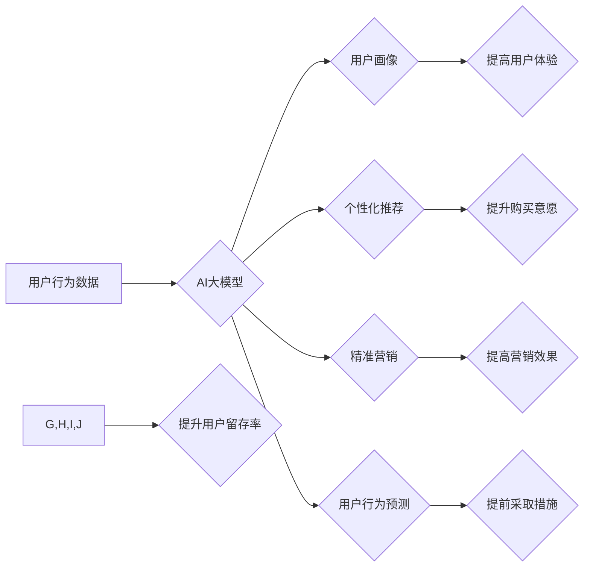

                 

## AI大模型在电商平台用户留存策略中的应用

> 关键词：电商平台、用户留存、AI大模型、推荐系统、个性化营销、深度学习、自然语言处理

## 1. 背景介绍

在当今激烈的电商竞争环境中，用户留存率已成为衡量平台成功与否的关键指标。用户留存率高意味着用户对平台的满意度高，重复购买率高，从而为平台带来持续的收益。然而，传统的用户留存策略往往依赖于简单的行为分析和规则引擎，难以应对用户行为的多样性和复杂性。

近年来，随着深度学习和自然语言处理技术的飞速发展，AI大模型在电商平台用户留存策略中的应用逐渐成为热点。AI大模型能够通过学习海量用户数据，挖掘用户行为模式和偏好，从而实现更精准、更个性化的用户留存策略。

## 2. 核心概念与联系

### 2.1 用户留存

用户留存是指用户在一段时间内持续使用平台的比率。通常用 DAU（每日活跃用户）/MAU（每月活跃用户）来衡量，例如，7天留存率是指在过去7天内仍然活跃的用户占过去一个月活跃用户的比例。

### 2.2 AI大模型

AI大模型是指在海量数据上训练的深度学习模型，具有强大的学习和推理能力。常见的AI大模型类型包括：

* **Transformer模型**: 擅长处理文本数据，例如BERT、GPT-3等。
* **Recurrent Neural Network (RNN)**: 擅长处理序列数据，例如LSTM、GRU等。
* **Graph Neural Network (GNN)**: 擅长处理图数据，例如Node2Vec、GraphSAGE等。

### 2.3 核心概念联系

电商平台用户留存策略的优化可以借助AI大模型的强大能力，通过以下方式实现：

* **用户画像构建**: 利用AI大模型分析用户行为数据，构建用户画像，包括用户兴趣、购买习惯、偏好等信息。
* **个性化推荐**: 基于用户画像，AI大模型可以推荐个性化的商品和服务，提高用户体验和购买意愿。
* **精准营销**: AI大模型可以根据用户行为和特征，精准推送营销信息，提高营销效果。
* **用户行为预测**: AI大模型可以预测用户的未来行为，例如是否会再次购买、是否会流失等，帮助平台提前采取措施。

**Mermaid 流程图**



## 3. 核心算法原理 & 具体操作步骤

### 3.1 算法原理概述

AI大模型在电商平台用户留存策略中的应用主要基于以下核心算法：

* **深度学习**: 通过多层神经网络，学习用户行为数据中的复杂模式和关系。
* **自然语言处理**: 对用户评论、聊天记录等文本数据进行分析，挖掘用户需求和反馈。
* **推荐系统**: 基于用户历史行为和偏好，推荐个性化的商品和服务。

### 3.2 算法步骤详解

1. **数据收集**: 收集用户行为数据，包括用户浏览记录、购买记录、评价记录、评论记录等。
2. **数据预处理**: 对收集到的数据进行清洗、转换和特征工程，使其适合AI模型训练。
3. **模型训练**: 选择合适的AI模型，并利用训练数据进行模型训练。
4. **模型评估**: 使用测试数据评估模型的性能，并进行模型调优。
5. **模型部署**: 将训练好的模型部署到线上环境，用于实时预测和决策。

### 3.3 算法优缺点

**优点**:

* **精准度高**: AI大模型能够学习用户行为数据中的复杂模式，实现更精准的用户画像和推荐。
* **个性化强**: AI大模型可以根据用户的个性化需求，提供个性化的商品和服务推荐。
* **自动化程度高**: AI大模型可以自动化完成用户画像构建、推荐系统和精准营销等任务。

**缺点**:

* **数据依赖性强**: AI大模型的性能取决于训练数据的质量和数量。
* **计算资源消耗大**: 训练大型AI模型需要大量的计算资源。
* **解释性差**: AI模型的决策过程往往难以解释，这可能导致用户信任度降低。

### 3.4 算法应用领域

AI大模型在电商平台用户留存策略中的应用领域广泛，包括：

* **用户画像构建**: 构建用户兴趣、购买习惯、偏好等信息的用户画像。
* **个性化推荐**: 推荐个性化的商品和服务，提高用户体验和购买意愿。
* **精准营销**: 根据用户行为和特征，精准推送营销信息，提高营销效果。
* **用户行为预测**: 预测用户的未来行为，例如是否会再次购买、是否会流失等，帮助平台提前采取措施。

## 4. 数学模型和公式 & 详细讲解 & 举例说明

### 4.1 数学模型构建

用户留存率可以看作是一个时间序列问题，可以使用以下数学模型进行建模：

* **指数衰减模型**: 假设用户留存率随着时间的推移呈指数衰减趋势。

$$
L(t) = L_0 * e^{-kt}
$$

其中：

* $L(t)$:  t时刻的用户留存率
* $L_0$:  初始用户留存率
* $k$:  衰减系数
* $t$:  时间

* **Gompertz模型**:  更适合描述现实世界中用户留存率的趋势，其特点是留存率在初期快速下降，然后逐渐趋于稳定。

$$
L(t) = L_0 * e^{-e^{a(t-b)}}
$$

其中：

* $L(0)$:  初始用户留存率
* $a$:  衰减系数
* $b$:  时间常数

### 4.2 公式推导过程

以上模型的推导过程涉及到概率论、微积分等数学知识，具体推导过程可以参考相关文献。

### 4.3 案例分析与讲解

假设电商平台在第一天有1000个用户，初始留存率为$L_0 = 0.8$，衰减系数为$k = 0.1$。

根据指数衰减模型，我们可以计算出不同时间点的用户留存率：

* $t = 1$ 天: $L(1) = 1000 * e^{-0.1 * 1} = 904.8$
* $t = 3$ 天: $L(3) = 1000 * e^{-0.1 * 3} = 740.8$

我们可以看到，用户留存率随着时间的推移呈指数衰减趋势。

## 5. 项目实践：代码实例和详细解释说明

### 5.1 开发环境搭建

* Python 3.7+
* TensorFlow/PyTorch
* Jupyter Notebook

### 5.2 源代码详细实现

```python
# 导入必要的库
import pandas as pd
from sklearn.model_selection import train_test_split
from tensorflow.keras.models import Sequential
from tensorflow.keras.layers import Dense

# 加载用户行为数据
data = pd.read_csv('user_behavior.csv')

# 数据预处理
# ...

# 将数据分为训练集和测试集
X_train, X_test, y_train, y_test = train_test_split(data[['feature1', 'feature2', ...]], data['label'], test_size=0.2)

# 定义模型
model = Sequential()
model.add(Dense(64, activation='relu', input_shape=(X_train.shape[1],)))
model.add(Dense(32, activation='relu'))
model.add(Dense(1, activation='sigmoid'))

# 编译模型
model.compile(loss='binary_crossentropy', optimizer='adam', metrics=['accuracy'])

# 训练模型
model.fit(X_train, y_train, epochs=10, batch_size=32)

# 评估模型
loss, accuracy = model.evaluate(X_test, y_test)
print('Loss:', loss)
print('Accuracy:', accuracy)
```

### 5.3 代码解读与分析

* 代码首先导入必要的库，然后加载用户行为数据。
* 数据预处理步骤根据实际情况进行调整，例如特征工程、数据归一化等。
* 数据分为训练集和测试集，用于训练和评估模型。
* 定义一个简单的深度学习模型，包含多个全连接层和激活函数。
* 编译模型，指定损失函数、优化器和评价指标。
* 训练模型，指定训练轮数和批处理大小。
* 评估模型，计算模型在测试集上的损失和准确率。

### 5.4 运行结果展示

运行代码后，会输出模型的损失和准确率，可以根据结果评估模型的性能。

## 6. 实际应用场景

### 6.1 用户画像构建

AI大模型可以分析用户浏览记录、购买记录、评价记录等数据，构建用户画像，包括用户兴趣、购买习惯、偏好等信息。例如，可以根据用户的购买历史，推荐与之相关的商品，或者根据用户的评价内容，了解用户的需求和反馈。

### 6.2 个性化推荐

AI大模型可以根据用户的个性化需求，推荐个性化的商品和服务。例如，可以根据用户的浏览历史和购买记录，推荐用户可能感兴趣的商品；或者根据用户的年龄、性别、兴趣等信息，推荐个性化的广告和促销活动。

### 6.3 精准营销

AI大模型可以根据用户的行为和特征，精准推送营销信息，提高营销效果。例如，可以根据用户的购买习惯，发送个性化的优惠券和促销信息；或者根据用户的浏览记录，推送与之相关的广告和推荐。

### 6.4 未来应用展望

随着AI技术的不断发展，AI大模型在电商平台用户留存策略中的应用将更加广泛和深入。例如，可以利用AI大模型进行用户行为预测，提前识别用户流失风险，并采取相应的措施进行挽留；或者利用AI大模型进行个性化客服，为用户提供更精准、更便捷的客户服务。

## 7. 工具和资源推荐

### 7.1 学习资源推荐

* **书籍**:
    * 深度学习
    * 自然语言处理
    * 机器学习实战
* **在线课程**:
    * Coursera
    * edX
    * Udacity

### 7.2 开发工具推荐

* **Python**: 
    * TensorFlow
    * PyTorch
    * scikit-learn
* **云平台**:
    * AWS
    * Azure
    * Google Cloud

### 7.3 相关论文推荐

* **Attention Is All You Need**
* **BERT: Pre-training of Deep Bidirectional Transformers for Language Understanding**
* **Recurrent Neural Networks for Sequence Learning**

## 8. 总结：未来发展趋势与挑战

### 8.1 研究成果总结

AI大模型在电商平台用户留存策略中的应用取得了显著成果，能够提高用户留存率、提升用户体验和营销效果。

### 8.2 未来发展趋势

* **模型更加复杂**: 未来，AI大模型将更加复杂，能够学习更丰富的用户数据和行为模式。
* **应用更加广泛**: AI大模型的应用将更加广泛，覆盖电商平台的各个环节，例如用户画像构建、个性化推荐、精准营销、用户行为预测等。
* **解释性更强**: 未来，AI模型的解释性将更加强，能够更好地解释模型的决策过程，提高用户信任度。

### 8.3 面临的挑战

* **数据质量**: AI大模型的性能取决于训练数据的质量和数量，如何获取高质量的训练数据仍然是一个挑战。
* **计算资源**: 训练大型AI模型需要大量的计算资源，这对于中小企业来说是一个负担。
* **伦理问题**: AI大模型的应用也面临着伦理问题，例如数据隐私、算法偏见等，需要引起足够的重视。

### 8.4 研究展望

未来，AI大模型在电商平台用户留存策略中的应用将继续深入发展，需要进一步研究以下问题：

* 如何提高AI模型的解释性，增强用户信任度。
* 如何解决数据质量和计算资源问题，降低AI模型的应用成本。
* 如何应对AI模型的伦理问题，确保其安全和可持续发展。

## 9. 附录：常见问题与解答

* **Q1: AI大模型的训练需要多长时间？**

A1: AI模型的训练时间取决于模型的复杂度、训练数据的规模和计算资源等因素。一般来说，训练一个大型AI模型可能需要几天甚至几周的时间。

* **Q2: 如何评估AI模型的性能？**

A2: AI模型的性能可以通过多种指标进行评估，例如准确率、召回率、F1-score等。具体指标的选择取决于具体的应用场景。

* **Q3: 如何解决AI模型的算法偏见问题？**

A3: 算法偏见问题可以通过多种方法解决，例如数据预处理、模型调优、算法设计等。


作者：禅与计算机程序设计艺术 / Zen and the Art of Computer Programming 
<end_of_turn>

