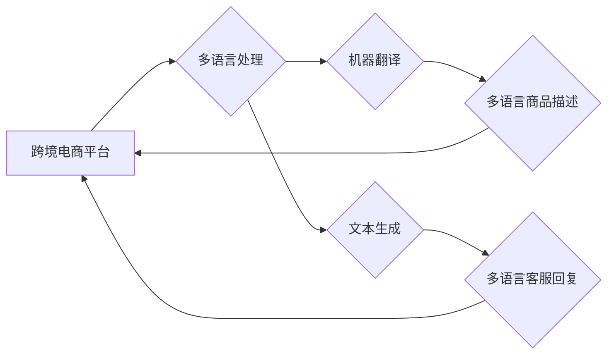

                 

## AI大模型在跨境电商中的多语言应用

> 关键词：AI大模型、跨境电商、多语言处理、机器翻译、文本生成、客户服务、个性化推荐

## 1. 背景介绍

跨境电商的蓬勃发展为全球贸易带来了新的机遇，但也带来了新的挑战。其中，语言障碍是跨境电商发展面临的重大瓶颈之一。不同国家和地区的消费者使用不同的语言，这使得跨境电商平台难以与全球用户有效沟通，从而限制了其发展潜力。

近年来，人工智能（AI）技术取得了长足进步，特别是大语言模型（LLM）的出现，为跨境电商的多语言应用提供了新的解决方案。LLM 拥有强大的文本理解和生成能力，能够理解和生成多种语言的文本，为跨境电商平台提供多语言支持，打破语言壁垒，提升用户体验。

## 2. 核心概念与联系

### 2.1 跨境电商

跨境电商是指跨越国家或地区边界进行的电子商务交易。它涵盖了商品的销售、采购、物流、支付等环节，并利用互联网平台连接全球买家和卖家。

### 2.2 多语言处理

多语言处理（Multilingual Processing）是指处理多种语言的文本信息的技术。它涉及到语言识别、机器翻译、文本摘要、情感分析等多个子领域。

### 2.3 大语言模型

大语言模型（Large Language Model，LLM）是一种基于深度学习的强大人工智能模型，能够理解和生成人类语言。它通过训练大量的文本数据，学习语言的语法、语义和上下文关系，从而具备强大的文本理解和生成能力。

### 2.4 架构图



## 3. 核心算法原理 & 具体操作步骤

### 3.1 算法原理概述

LLM 在跨境电商中的多语言应用主要基于以下核心算法：

* **Transformer模型**: Transformer模型是一种基于注意力机制的深度学习模型，能够有效处理长文本序列，并具有强大的文本理解和生成能力。

* **机器翻译模型**: 机器翻译模型利用统计方法或深度学习算法，将一种语言的文本翻译成另一种语言的文本。

* **文本生成模型**: 文本生成模型能够根据给定的输入文本，生成新的文本内容，例如商品描述、客服回复等。

### 3.2 算法步骤详解

**1. 数据预处理**: 收集并清洗跨境电商平台的数据，包括商品信息、用户评论、客服对话等，并将其转换为模型可识别的格式。

**2. 模型训练**: 使用 Transformer模型等算法，对预处理后的数据进行训练，学习语言的语法、语义和上下文关系。

**3. 模型评估**: 使用测试数据评估模型的性能，例如机器翻译的准确率、文本生成的流畅度等。

**4. 模型部署**: 将训练好的模型部署到跨境电商平台，并将其集成到相关功能模块中。

**5. 持续优化**: 持续收集用户反馈和数据，对模型进行调整和优化，提高其性能和准确性。

### 3.3 算法优缺点

**优点**:

* 能够有效解决跨境电商平台的多语言问题。
* 提升用户体验，扩大用户群体。
* 自动化处理大量文本信息，提高效率。

**缺点**:

* 需要大量的训练数据，训练成本较高。
* 模型的性能受数据质量影响较大。
* 难以完全模拟人类的语言理解和生成能力。

### 3.4 算法应用领域

* **机器翻译**: 将商品描述、产品信息等文本翻译成不同语言，方便全球用户理解。
* **文本生成**: 自动生成多语言的商品描述、产品评论、客服回复等文本内容。
* **个性化推荐**: 根据用户的语言偏好和购买历史，推荐相关商品。
* **客户服务**: 提供多语言的在线客服服务，解决用户的疑问和问题。

## 4. 数学模型和公式 & 详细讲解 & 举例说明

### 4.1 数学模型构建

LLM 的训练过程本质上是一个优化问题，目标是找到一个模型参数向量，使得模型在训练数据上的损失函数最小。损失函数通常采用交叉熵损失函数，用于衡量模型预测结果与真实标签之间的差异。

**交叉熵损失函数**:

$$
H(p, q) = - \sum_{i=1}^{n} p(i) \log q(i)
$$

其中：

* $p(i)$ 是真实标签的概率分布。
* $q(i)$ 是模型预测的概率分布。

### 4.2 公式推导过程

交叉熵损失函数的推导过程基于信息论的原理。信息熵衡量了随机变量的不确定性，而交叉熵则衡量了两个概率分布之间的差异。

### 4.3 案例分析与讲解

假设我们训练一个机器翻译模型，目标是将英文文本翻译成中文文本。训练数据包含大量的英文-中文文本对。模型的输出是一个概率分布，表示每个中文单词出现的概率。

在训练过程中，模型会不断调整参数，使得模型预测的概率分布与真实标签的概率分布之间的差异最小化。

## 5. 项目实践：代码实例和详细解释说明

### 5.1 开发环境搭建

* Python 3.7+
* TensorFlow 或 PyTorch 深度学习框架
* NLTK 自然语言处理库
* Transformers 库

### 5.2 源代码详细实现

```python
from transformers import AutoModelForSeq2SeqLM, AutoTokenizer

# 加载预训练模型和词典
model_name = "Helsinki-NLP/opus-mt-en-zh"
model = AutoModelForSeq2SeqLM.from_pretrained(model_name)
tokenizer = AutoTokenizer.from_pretrained(model_name)

# 输入英文文本
input_text = "Hello, world!"

# 对文本进行编码
input_ids = tokenizer.encode(input_text, return_tensors="pt")

# 使用模型进行翻译
output = model.generate(input_ids)

# 将输出解码成中文文本
translated_text = tokenizer.decode(output[0], skip_special_tokens=True)

# 打印翻译结果
print(translated_text)
```

### 5.3 代码解读与分析

* 该代码示例使用 HuggingFace Transformers 库加载预训练的英文-中文机器翻译模型。
* `AutoModelForSeq2SeqLM` 类用于加载序列到序列的预训练模型，例如机器翻译模型。
* `AutoTokenizer` 类用于加载模型对应的词典。
* `encode()` 方法将输入文本转换为模型可识别的数字表示。
* `generate()` 方法使用模型进行翻译，生成中文文本。
* `decode()` 方法将模型输出的数字表示解码成文本。

### 5.4 运行结果展示

```
你好，世界！
```

## 6. 实际应用场景

### 6.1 商品描述翻译

跨境电商平台可以利用机器翻译模型将商品描述翻译成不同语言，方便全球用户了解商品信息。

### 6.2 客服对话翻译

跨境电商平台可以利用机器翻译模型将客服对话翻译成不同语言，方便全球用户与客服进行沟通。

### 6.3 个性化推荐

跨境电商平台可以根据用户的语言偏好和购买历史，推荐相关商品。

### 6.4 未来应用展望

* **更精准的翻译**: 随着大语言模型的不断发展，机器翻译的准确率和流畅度将会进一步提高。
* **多模态交互**: 将文本翻译与图像识别、语音识别等技术结合，实现更丰富的跨境电商交互体验。
* **个性化定制**: 利用大语言模型生成个性化的商品描述、客服回复等内容，提升用户体验。

## 7. 工具和资源推荐

### 7.1 学习资源推荐

* **HuggingFace Transformers 库**: https://huggingface.co/docs/transformers/index
* **OpenAI GPT-3 API**: https://openai.com/api/

### 7.2 开发工具推荐

* **TensorFlow**: https://www.tensorflow.org/
* **PyTorch**: https://pytorch.org/

### 7.3 相关论文推荐

* **BERT: Pre-training of Deep Bidirectional Transformers for Language Understanding**: https://arxiv.org/abs/1810.04805
* **GPT-3: Language Models are Few-Shot Learners**: https://arxiv.org/abs/2005.14165

## 8. 总结：未来发展趋势与挑战

### 8.1 研究成果总结

AI大模型在跨境电商中的多语言应用取得了显著进展，能够有效解决跨境电商平台的多语言问题，提升用户体验，并促进跨境贸易发展。

### 8.2 未来发展趋势

* **模型规模和能力的提升**: 未来，大语言模型的规模和能力将会进一步提升，能够处理更复杂的任务，提供更精准的翻译和生成文本。
* **多模态融合**: 将文本翻译与图像识别、语音识别等技术结合，实现更丰富的跨境电商交互体验。
* **个性化定制**: 利用大语言模型生成个性化的商品描述、客服回复等内容，提升用户体验。

### 8.3 面临的挑战

* **数据质量**: 大语言模型的性能受数据质量影响较大，需要不断收集和清洗高质量的跨境电商数据。
* **模型解释性**: 大语言模型的决策过程较为复杂，难以解释模型的决策结果，这可能会影响用户的信任度。
* **伦理问题**: 大语言模型的应用可能会带来一些伦理问题，例如数据隐私、信息安全等，需要谨慎考虑和解决。

### 8.4 研究展望

未来，研究者将继续探索大语言模型在跨境电商中的更多应用场景，并致力于解决模型的挑战，推动大语言模型在跨境电商领域的健康发展。

## 9. 附录：常见问题与解答

**1. 如何选择合适的机器翻译模型？**

选择合适的机器翻译模型需要考虑多种因素，例如目标语言对、数据量、模型精度等。可以参考 HuggingFace 模型库中的预训练模型，并根据实际需求进行选择。

**2. 如何评估机器翻译模型的性能？**

机器翻译模型的性能通常使用 BLEU 分数、ROUGE 分数等指标进行评估。

**3. 如何解决机器翻译模型的输出结果不流畅的问题？**

可以使用文本后处理技术，例如语法校正、语义重组等，提高机器翻译模型的输出结果的流畅度。


作者：禅与计算机程序设计艺术 / Zen and the Art of Computer Programming 
<end_of_turn>

