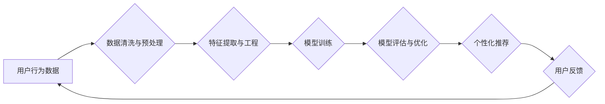

                 

## AI如何优化电商平台的营销策略

> 关键词：电商平台、人工智能、营销策略、推荐系统、个性化推荐、预测分析、机器学习、深度学习

## 1. 背景介绍

电子商务平台在当今数字经济时代扮演着越来越重要的角色。随着消费者需求的多样化和竞争加剧，电商平台需要不断探索新的方式来提升用户体验、提高转化率和增强盈利能力。人工智能（AI）作为一种强大的技术工具，为电商平台的营销策略优化提供了前所未有的机遇。

传统电商平台的营销策略往往依赖于人工经验和规则制定，缺乏针对性和灵活性。而AI技术能够通过数据分析和模式识别，洞察用户行为、预测市场趋势，从而制定更精准、更有效的营销策略。

## 2. 核心概念与联系

### 2.1  电商平台营销策略

电商平台营销策略是指为了吸引用户、促进交易而采取的一系列行动和措施。常见的营销策略包括：

* **产品推荐:** 根据用户的浏览历史、购买记录和兴趣偏好，推荐相关产品。
* **广告投放:** 通过搜索引擎、社交媒体等平台，向目标用户展示广告。
* **促销活动:** 定期举办限时折扣、满减优惠等促销活动，刺激用户消费。
* **内容营销:** 通过博客、视频、社交媒体等渠道，发布有价值的内容，吸引用户关注并建立品牌形象。

### 2.2  人工智能在电商平台营销中的应用

AI技术在电商平台营销中的应用主要体现在以下几个方面：

* **个性化推荐:** 利用机器学习算法分析用户行为数据，为每个用户提供个性化的产品推荐。
* **精准广告投放:** 通过深度学习模型识别用户画像，精准投放广告，提高广告转化率。
* **预测分析:** 利用时间序列分析和预测模型，预测用户需求和市场趋势，优化库存管理和营销活动。
* **智能客服:** 利用自然语言处理技术，开发智能客服机器人，为用户提供24小时在线服务。

### 2.3  AI流程图



## 3. 核心算法原理 & 具体操作步骤

### 3.1  算法原理概述

在电商平台营销中，常用的AI算法包括：

* **协同过滤:** 基于用户的相似度或商品的相似度进行推荐。
* **内容过滤:** 根据商品的属性和用户偏好进行推荐。
* **深度学习:** 利用多层神经网络，从海量数据中学习用户行为模式，进行更精准的推荐。

### 3.2  算法步骤详解

以协同过滤算法为例，其具体步骤如下：

1. **数据收集:** 收集用户行为数据，例如用户浏览记录、购买记录、评分等。
2. **数据预处理:** 清洗数据，处理缺失值和异常值，并对数据进行标准化处理。
3. **用户-商品矩阵构建:** 将用户和商品映射到一个矩阵中，其中每个元素表示用户对商品的评分或交互行为。
4. **相似度计算:** 计算用户之间的相似度或商品之间的相似度，常用的方法包括余弦相似度、皮尔逊相关系数等。
5. **推荐生成:** 根据用户与相似用户的交互行为，推荐用户可能感兴趣的商品。

### 3.3  算法优缺点

**协同过滤算法的优点:**

* 能够发现隐含的用户偏好。
* 推荐结果通常具有较高的准确率。

**协同过滤算法的缺点:**

* 数据稀疏性问题: 当用户行为数据稀疏时，算法难以准确计算相似度。
* 冷启动问题: 新用户或新商品难以获得推荐。

### 3.4  算法应用领域

协同过滤算法广泛应用于以下领域:

* **电商平台推荐:** 为用户推荐商品。
* **音乐平台推荐:** 为用户推荐歌曲。
* **电影平台推荐:** 为用户推荐电影。

## 4. 数学模型和公式 & 详细讲解 & 举例说明

### 4.1  数学模型构建

协同过滤算法的核心是用户-商品矩阵，其数学模型可以表示为：

$$
R = \begin{bmatrix}
r_{11} & r_{12} & \cdots & r_{1m} \\
r_{21} & r_{22} & \cdots & r_{2m} \\
\vdots & \vdots & \ddots & \vdots \\
r_{n1} & r_{n2} & \cdots & r_{nm}
\end{bmatrix}
$$

其中：

* $R$ 是用户-商品矩阵。
* $r_{ij}$ 表示用户 $i$ 对商品 $j$ 的评分或交互行为。
* $n$ 是用户数量。
* $m$ 是商品数量。

### 4.2  公式推导过程

协同过滤算法的相似度计算公式可以根据不同的方法有所不同，例如：

**余弦相似度:**

$$
\text{sim}(u_i, u_j) = \frac{u_i \cdot u_j}{||u_i|| ||u_j||}
$$

其中：

* $u_i$ 和 $u_j$ 是用户 $i$ 和用户 $j$ 的评分向量。
* $u_i \cdot u_j$ 是两个向量的点积。
* $||u_i||$ 和 $||u_j||$ 是两个向量的模长。

### 4.3  案例分析与讲解

假设有两个用户 $A$ 和 $B$，他们的评分向量分别为：

* $u_A = [5, 4, 3, 2, 1]$
* $u_B = [4, 3, 2, 1, 5]$

使用余弦相似度计算 $A$ 和 $B$ 的相似度:

$$
\text{sim}(A, B) = \frac{5 \cdot 4 + 4 \cdot 3 + 3 \cdot 2 + 2 \cdot 1 + 1 \cdot 5}{\sqrt{5^2 + 4^2 + 3^2 + 2^2 + 1^2} \sqrt{4^2 + 3^2 + 2^2 + 1^2 + 5^2}}
$$

经过计算，得到 $A$ 和 $B$ 的相似度为 $0.8$，说明 $A$ 和 $B$ 的评分偏好度较高。

## 5. 项目实践：代码实例和详细解释说明

### 5.1  开发环境搭建

* Python 3.x
* scikit-learn 库
* pandas 库
* numpy 库

### 5.2  源代码详细实现

```python
import pandas as pd
from sklearn.metrics.pairwise import cosine_similarity

# 加载用户-商品评分数据
data = pd.read_csv('ratings.csv')

# 构建用户-商品矩阵
user_item_matrix = data.pivot_table(index='user_id', columns='item_id', values='rating')

# 计算用户之间的余弦相似度
user_similarity = cosine_similarity(user_item_matrix)

# 获取用户 A 的相似用户
user_A_id = 1
similar_users = user_similarity[user_A_id].argsort()[:-6:-1]  # 排序获取前 5 个相似用户

# 推荐商品
recommended_items = []
for user_B_id in similar_users:
    user_B_ratings = user_item_matrix.loc[user_B_id].dropna()
    for item_id in user_B_ratings.index:
        if item_id not in user_item_matrix.loc[user_A_id].index:
            recommended_items.append(item_id)

# 打印推荐结果
print(f'用户 {user_A_id} 的推荐商品: {recommended_items}')
```

### 5.3  代码解读与分析

* 代码首先加载用户-商品评分数据，并构建用户-商品矩阵。
* 然后使用 scikit-learn 库的 `cosine_similarity` 函数计算用户之间的余弦相似度。
* 通过获取用户 A 的相似用户，并遍历其评分记录，推荐用户 A 尚未评分的商品。

### 5.4  运行结果展示

运行代码后，将输出用户 A 的推荐商品列表。

## 6. 实际应用场景

### 6.1  个性化推荐

AI技术可以根据用户的浏览历史、购买记录、兴趣偏好等数据，为每个用户提供个性化的商品推荐，提高用户体验和转化率。

### 6.2  精准广告投放

AI算法可以识别用户的画像，精准投放广告，提高广告的点击率和转化率。

### 6.3  促销活动优化

AI可以预测用户的消费行为，帮助电商平台优化促销活动的时间、力度和目标用户，提高活动效果。

### 6.4  未来应用展望

未来，AI技术在电商平台营销领域的应用将更加广泛和深入，例如：

* **智能客服:** 利用自然语言处理技术，开发更智能、更人性化的智能客服机器人，为用户提供24小时在线服务。
* **虚拟试衣间:** 利用计算机视觉技术，实现虚拟试衣间，让用户在家就能体验商品的穿着效果。
* **个性化营销内容:** 利用AI生成个性化的营销内容，例如推荐视频、个性化文案等，提高用户参与度。

## 7. 工具和资源推荐

### 7.1  学习资源推荐

* **书籍:**
    * 《深度学习》
    * 《机器学习实战》
    * 《Python机器学习》
* **在线课程:**
    * Coursera
    * edX
    * Udacity

### 7.2  开发工具推荐

* **Python:** 
    * scikit-learn
    * TensorFlow
    * PyTorch

### 7.3  相关论文推荐

* **协同过滤算法:**
    * "Collaborative Filtering: A User-Based Approach"
    * "Memory-Based Collaborative Filtering"
* **深度学习推荐系统:**
    * "Deep Learning for Recommender Systems"
    * "Neural Collaborative Filtering"

## 8. 总结：未来发展趋势与挑战

### 8.1  研究成果总结

AI技术在电商平台营销领域的应用取得了显著成果，例如个性化推荐、精准广告投放、促销活动优化等，有效提升了用户体验和商业效益。

### 8.2  未来发展趋势

未来，AI技术在电商平台营销领域的应用将更加智能化、个性化和自动化，例如：

* **更精准的推荐:** 利用更先进的深度学习算法，从海量数据中学习用户行为模式，提供更精准的商品推荐。
* **更个性化的营销内容:** 利用AI生成个性化的营销内容，例如推荐视频、个性化文案等，提高用户参与度。
* **更智能的客服:** 利用自然语言处理技术，开发更智能、更人性化的智能客服机器人，为用户提供24小时在线服务。

### 8.3  面临的挑战

AI技术在电商平台营销领域的应用也面临一些挑战，例如：

* **数据隐私:** AI算法需要大量用户数据进行训练，如何保护用户隐私是一个重要问题。
* **算法解释性:** 深度学习算法的决策过程往往难以解释，如何提高算法的透明度和可解释性是一个挑战。
* **技术成本:** 开发和部署AI系统需要一定的技术成本，中小电商平台难以负担。

### 8.4  研究展望

未来，需要进一步研究以下问题:

* 如何开发更安全、更隐私的AI算法。
* 如何提高深度学习算法的解释性。
* 如何降低AI技术的开发和部署成本，使其更易于推广应用。


## 9. 附录：常见问题与解答

### 9.1  Q1: 协同过滤算法的冷启动问题如何解决？

**A1:** 冷启动问题是指新用户或新商品难以获得推荐。解决方法包括：

* **利用用户画像:** 根据用户的基本信息，例如年龄、性别、兴趣爱好等，进行推荐。
* **利用商品属性:** 根据商品的类别、价格、品牌等属性，进行推荐。
* **使用混合推荐算法:** 将协同过滤算法与其他推荐算法结合使用，例如内容过滤算法。

### 9.2  Q2: 深度学习推荐系统有哪些优势？

**A2:** 深度学习推荐系统相比传统推荐系统具有以下优势:

* **更精准的推荐:** 深度学习算法能够从海量数据中学习更复杂的模式，提供更精准的推荐。
* **更强的泛化能力:** 深度学习模型能够更好地泛化到新的用户和商品。
* **更灵活的特征表达:** 深度学习模型能够自动学习特征，无需人工特征工程。


作者：禅与计算机程序设计艺术 / Zen and the Art of Computer Programming 
<end_of_turn>

