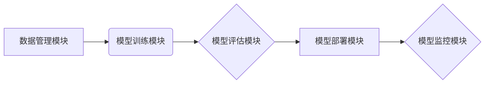

                 

## AI开发工具链：Lepton AI的一站式平台

> 关键词：人工智能、开发工具链、Lepton AI、机器学习、深度学习、模型训练、部署、平台

## 1. 背景介绍

人工智能（AI）正以惊人的速度发展，其应用领域不断扩展，从自动驾驶到医疗诊断，再到个性化推荐，AI正在深刻地改变着我们的生活。然而，开发和部署AI应用仍然面临着诸多挑战。传统的AI开发流程通常需要程序员具备深入的机器学习和深度学习知识，并掌握多种不同的工具和框架。这对于许多开发者来说是一个门槛，阻碍了AI技术的普及和应用。

为了解决这些问题，Lepton AI应运而生。Lepton AI是一个面向人工智能开发者的全栈平台，旨在提供一站式解决方案，简化AI开发流程，降低开发门槛，并加速AI应用的落地。

## 2. 核心概念与联系

Lepton AI平台的核心概念是将整个AI开发流程整合在一个统一的平台上，包括数据准备、模型训练、模型评估、模型部署和模型监控等各个环节。平台采用模块化设计，开发者可以根据自己的需求选择和组合不同的模块，构建自己的AI应用。

Lepton AI平台的架构可以概括为以下几个关键模块：

* **数据管理模块:** 提供数据存储、数据清洗、数据预处理等功能，帮助开发者高效地管理和准备数据。
* **模型训练模块:** 提供多种主流机器学习和深度学习算法，并支持自定义模型训练。
* **模型评估模块:** 提供多种模型评估指标和工具，帮助开发者评估模型性能。
* **模型部署模块:** 支持将训练好的模型部署到不同的环境，例如云端、边缘设备等。
* **模型监控模块:** 提供模型性能监控和日志分析功能，帮助开发者及时发现和解决模型问题。

Lepton AI平台的架构图如下：



## 3. 核心算法原理 & 具体操作步骤

Lepton AI平台支持多种主流机器学习和深度学习算法，例如线性回归、逻辑回归、决策树、支持向量机、神经网络等。

### 3.1  算法原理概述

机器学习算法的核心思想是通过学习数据中的模式，建立一个模型，以便对新的数据进行预测或分类。

深度学习算法是机器学习算法的一种，它利用多层神经网络来学习数据中的复杂模式。深度学习算法在图像识别、自然语言处理等领域取得了突破性的进展。

### 3.2  算法步骤详解

Lepton AI平台提供了一个直观的界面，开发者可以轻松地选择和配置不同的算法。

**例如，使用线性回归算法进行预测的步骤如下：**

1. **准备数据:** 将数据导入Lepton AI平台，并进行清洗和预处理。
2. **选择算法:** 选择线性回归算法。
3. **设置参数:** 设置算法的参数，例如学习率、迭代次数等。
4. **训练模型:** 训练模型，让模型学习数据中的模式。
5. **评估模型:** 使用测试数据评估模型的性能。
6. **部署模型:** 将训练好的模型部署到不同的环境。

### 3.3  算法优缺点

不同的算法有不同的优缺点，开发者需要根据自己的需求选择合适的算法。

**例如，线性回归算法的优点是简单易懂，训练速度快；缺点是只能处理线性关系的数据。**

### 3.4  算法应用领域

Lepton AI平台支持的算法应用于各个领域，例如：

* **图像识别:** 用于识别图像中的物体、场景等。
* **自然语言处理:** 用于理解和生成自然语言文本。
* **预测分析:** 用于预测未来的趋势，例如销售预测、风险预测等。
* **个性化推荐:** 用于推荐用户感兴趣的内容，例如商品推荐、电影推荐等。

## 4. 数学模型和公式 & 详细讲解 & 举例说明

Lepton AI平台基于数学模型和公式实现各种算法。

### 4.1  数学模型构建

例如，线性回归模型的数学模型如下：

$$
y = w_0 + w_1x_1 + w_2x_2 + ... + w_nx_n + \epsilon
$$

其中：

* $y$ 是预测值
* $w_0, w_1, w_2, ..., w_n$ 是模型参数
* $x_1, x_2, ..., x_n$ 是输入特征
* $\epsilon$ 是误差项

### 4.2  公式推导过程

Lepton AI平台使用梯度下降算法来训练模型参数。梯度下降算法的目标是找到使误差最小化的模型参数。

梯度下降算法的公式如下：

$$
w_i = w_i - \alpha \frac{\partial Loss}{\partial w_i}
$$

其中：

* $w_i$ 是模型参数
* $\alpha$ 是学习率
* $\frac{\partial Loss}{\partial w_i}$ 是损失函数对模型参数的梯度

### 4.3  案例分析与讲解

例如，假设我们使用线性回归模型预测房价。输入特征包括房屋面积、房间数量等，输出特征是房价。

Lepton AI平台会根据训练数据，学习到房屋面积和房间数量与房价之间的关系，并建立一个线性回归模型。

## 5. 项目实践：代码实例和详细解释说明

Lepton AI平台提供了一个Python SDK，开发者可以使用Python代码与平台交互。

### 5.1  开发环境搭建

开发者需要安装Python和Lepton AI SDK。

### 5.2  源代码详细实现

```python
import lepton_ai as la

# 连接Lepton AI平台
client = la.Client("your_api_key")

# 加载数据集
dataset = client.datasets.get("your_dataset_id")

# 选择算法
model = la.models.LinearRegression()

# 训练模型
model.fit(dataset)

# 预测新数据
prediction = model.predict(new_data)
```

### 5.3  代码解读与分析

这段代码首先连接Lepton AI平台，然后加载数据集。

接着，选择线性回归算法，并训练模型。最后，使用训练好的模型预测新数据。

### 5.4  运行结果展示

Lepton AI平台会显示训练过程中的信息，以及模型的性能指标。

## 6. 实际应用场景

Lepton AI平台可以应用于各个领域，例如：

### 6.1  医疗诊断

Lepton AI平台可以帮助医生更快、更准确地诊断疾病。

### 6.2  金融风险评估

Lepton AI平台可以帮助金融机构评估客户的信用风险。

### 6.3  客户服务自动化

Lepton AI平台可以帮助企业自动处理客户服务请求。

### 6.4  未来应用展望

Lepton AI平台将继续发展，支持更多算法和应用场景。

## 7. 工具和资源推荐

### 7.1  学习资源推荐

* Lepton AI官方文档：https://docs.lepton.ai/
* 机器学习入门书籍：
    * 《机器学习》 - 周志华
    * 《深度学习》 - Ian Goodfellow

### 7.2  开发工具推荐

* Python编程语言
* Jupyter Notebook

### 7.3  相关论文推荐

* 《ImageNet Classification with Deep Convolutional Neural Networks》 - Alex Krizhevsky, Ilya Sutskever, Geoffrey E. Hinton

## 8. 总结：未来发展趋势与挑战

Lepton AI平台为AI开发提供了便捷的工具和平台，加速了AI技术的普及和应用。

### 8.1  研究成果总结

Lepton AI平台已经取得了显著的成果，在多个领域得到了应用。

### 8.2  未来发展趋势

Lepton AI平台将继续发展，支持更多算法和应用场景，并提供更强大的功能。

### 8.3  面临的挑战

Lepton AI平台面临着一些挑战，例如：

* 如何提高模型的准确性和效率
* 如何降低模型的部署成本
* 如何解决数据安全和隐私问题

### 8.4  研究展望

Lepton AI平台的研究方向包括：

* 开发更先进的算法
* 构建更强大的平台
* 推广AI技术的应用


## 9. 附录：常见问题与解答

* **Q: Lepton AI平台需要付费吗？**

A: Lepton AI平台提供免费试用和付费订阅服务。

* **Q: Lepton AI平台支持哪些编程语言？**

A: Lepton AI平台目前支持Python编程语言。

* **Q: Lepton AI平台如何保证数据安全？**

A: Lepton AI平台采用多种安全措施来保护用户数据，例如数据加密、访问控制等。


作者：禅与计算机程序设计艺术 / Zen and the Art of Computer Programming 
<end_of_turn>

