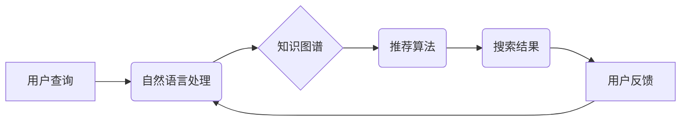

                 

## AI搜索引擎如何应对信息过载问题

> 关键词：信息过载、AI搜索引擎、知识图谱、自然语言处理、推荐算法、信息过滤、用户体验

## 1. 背景介绍

随着互联网的蓬勃发展，信息爆炸式增长已成为当今社会面临的重大挑战。海量数据涌入，用户在获取所需信息时面临着信息过载的困境。传统的搜索引擎依靠关键词匹配，难以有效地处理复杂查询和理解用户意图，导致搜索结果不精准、冗余，甚至难以找到所需信息。

人工智能技术的快速发展为解决信息过载问题提供了新的思路。AI搜索引擎通过深度学习、自然语言处理等技术，能够更深入地理解用户需求，提供更精准、个性化的搜索结果。

## 2. 核心概念与联系

**2.1 核心概念**

* **信息过载:** 指用户在面对大量信息时，难以有效地筛选、处理和理解信息，导致认知负担过重，效率低下。
* **AI搜索引擎:** 基于人工智能技术的搜索引擎，能够通过深度学习、自然语言处理等技术，理解用户意图，提供更精准、个性化的搜索结果。
* **知识图谱:**  一种结构化的知识表示形式，将实体和关系以图的形式表示，能够帮助搜索引擎理解信息之间的关联性，提供更深入的搜索结果。
* **自然语言处理 (NLP):**  使计算机能够理解、处理和生成人类语言的技术，能够帮助搜索引擎理解用户的自然语言查询，并进行语义分析。
* **推荐算法:**  根据用户的历史行为、偏好等信息，推荐用户可能感兴趣的内容的技术，能够帮助搜索引擎提供个性化的搜索结果。

**2.2 架构关系**



## 3. 核心算法原理 & 具体操作步骤

**3.1 算法原理概述**

AI搜索引擎的核心算法原理是基于深度学习和自然语言处理技术，通过训练模型来理解用户查询意图，并从海量数据中检索出最相关的结果。

**3.2 算法步骤详解**

1. **数据预处理:** 收集海量数据，进行清洗、格式化、标记等预处理工作，以便模型训练。
2. **特征提取:** 使用自然语言处理技术，从文本数据中提取关键词、语义信息、实体关系等特征。
3. **模型训练:** 使用深度学习算法，训练模型以学习用户查询与搜索结果之间的关系。
4. **查询理解:** 当用户提出查询时，使用训练好的模型对查询进行理解，识别用户意图和关键词。
5. **结果检索:** 根据用户意图和关键词，从知识图谱和海量数据中检索出最相关的结果。
6. **结果排序:** 使用推荐算法，对检索结果进行排序，并根据用户历史行为、偏好等信息进行个性化推荐。
7. **结果展示:** 将排序后的结果以用户友好的方式展示，并提供相关信息和链接。

**3.3 算法优缺点**

* **优点:** 能够理解用户意图，提供更精准、个性化的搜索结果；能够处理复杂查询，并提供更深入的搜索结果；能够不断学习和改进，随着数据量的增加，搜索结果的质量会不断提高。
* **缺点:** 需要大量的训练数据，训练成本较高；模型训练需要较长的时间；对数据质量要求较高，数据不准确或不完整会影响模型性能。

**3.4 算法应用领域**

AI搜索引擎的应用领域非常广泛，包括：

* **搜索引擎:** 提供更精准、个性化的搜索结果。
* **电商平台:**  推荐用户可能感兴趣的商品。
* **新闻资讯:**  推荐用户可能感兴趣的新闻资讯。
* **医疗健康:**  帮助用户查找相关疾病信息和医疗机构。
* **教育培训:**  帮助用户查找学习资源和在线课程。

## 4. 数学模型和公式 & 详细讲解 & 举例说明

**4.1 数学模型构建**

AI搜索引擎的核心算法通常基于深度学习模型，例如Transformer模型。Transformer模型使用注意力机制来学习文本序列之间的关系，能够捕捉到长距离依赖关系，提高搜索结果的准确性。

**4.2 公式推导过程**

Transformer模型的注意力机制使用以下公式计算每个词的权重：

$$
Attention(Q, K, V) = softmax(\frac{QK^T}{\sqrt{d_k}})V
$$

其中：

* $Q$：查询矩阵
* $K$：键矩阵
* $V$：值矩阵
* $d_k$：键向量的维度
* $softmax$：softmax函数

**4.3 案例分析与讲解**

假设用户查询“苹果公司最新产品”，搜索引擎需要从海量数据中找到与该查询相关的苹果公司最新产品的相关信息。Transformer模型会将查询语句和相关数据进行编码，并使用注意力机制计算每个词的权重。

通过注意力机制，模型可以识别出“苹果公司”和“最新产品”这两个关键词的重要性，并根据这些关键词的权重，从海量数据中检索出与这两个关键词相关的苹果公司最新产品的相关信息。

## 5. 项目实践：代码实例和详细解释说明

**5.1 开发环境搭建**

* Python 3.7+
* TensorFlow 2.0+
* PyTorch 1.0+
* CUDA Toolkit 10.2+

**5.2 源代码详细实现**

```python
# 使用 TensorFlow 构建 Transformer 模型
import tensorflow as tf

# 定义 Transformer 模型的结构
class Transformer(tf.keras.Model):
    def __init__(self, vocab_size, embedding_dim, num_heads, num_layers):
        super(Transformer, self).__init__()
        self.embedding = tf.keras.layers.Embedding(vocab_size, embedding_dim)
        self.transformer_layers = tf.keras.layers.StackedRNNCells([
            tf.keras.layers.MultiHeadAttention(num_heads=num_heads, key_dim=embedding_dim)
            for _ in range(num_layers)
        ])

    def call(self, inputs):
        embeddings = self.embedding(inputs)
        outputs = self.transformer_layers(embeddings)
        return outputs

# 实例化 Transformer 模型
model = Transformer(vocab_size=10000, embedding_dim=128, num_heads=8, num_layers=6)

# 训练模型
model.compile(optimizer='adam', loss='mse')
model.fit(train_data, train_labels, epochs=10)

# 使用模型进行预测
predictions = model.predict(test_data)
```

**5.3 代码解读与分析**

* 代码首先定义了一个 Transformer 模型的类，并指定了模型的结构参数，例如词汇大小、嵌入维度、注意力头数、层数等。
* 然后，代码实例化了一个 Transformer 模型，并使用 Adam 优化器和均方误差损失函数对模型进行训练。
* 最后，代码使用训练好的模型对测试数据进行预测，并输出预测结果。

**5.4 运行结果展示**

训练完成后，可以使用测试数据评估模型的性能。例如，可以使用准确率、召回率、F1-score 等指标来衡量模型的性能。

## 6. 实际应用场景

**6.1 搜索引擎优化**

AI搜索引擎可以帮助搜索引擎优化 (SEO) 专家更好地理解用户搜索意图，并优化网站内容以满足用户需求。例如，AI搜索引擎可以分析用户搜索的关键词、点击率、停留时间等数据，帮助SEO专家了解用户对哪些内容感兴趣，并根据这些信息优化网站内容和关键词。

**6.2 个性化推荐**

AI搜索引擎可以根据用户的历史行为、偏好等信息，提供个性化的搜索结果和推荐。例如，电商平台可以使用AI搜索引擎推荐用户可能感兴趣的商品，新闻平台可以使用AI搜索引擎推荐用户可能感兴趣的新闻资讯。

**6.3 智能客服**

AI搜索引擎可以帮助构建智能客服系统，能够理解用户的自然语言查询，并提供准确、及时、个性化的回复。例如，客服系统可以使用AI搜索引擎查找用户问题的答案，并提供解决方案。

**6.4 内容创作辅助**

AI搜索引擎可以帮助内容创作者更好地理解用户需求，并创作更符合用户兴趣的内容。例如，作家可以使用AI搜索引擎查找相关主题的信息，并从中获取灵感；记者可以使用AI搜索引擎查找新闻线索，并撰写更深入的报道。

**6.4 未来应用展望**

随着人工智能技术的不断发展，AI搜索引擎的应用场景将会更加广泛。例如，AI搜索引擎可以应用于医疗诊断、法律咨询、教育培训等领域，为人们提供更智能、更便捷的服务。

## 7. 工具和资源推荐

**7.1 学习资源推荐**

* **书籍:**
    * 《深度学习》 by Ian Goodfellow, Yoshua Bengio, and Aaron Courville
    * 《自然语言处理》 by Dan Jurafsky and James H. Martin
* **在线课程:**
    * Coursera: Deep Learning Specialization
    * Udacity: Natural Language Processing Nanodegree
* **博客和网站:**
    * TensorFlow Blog: https://blog.tensorflow.org/
    * PyTorch Blog: https://pytorch.org/blog/

**7.2 开发工具推荐**

* **TensorFlow:** https://www.tensorflow.org/
* **PyTorch:** https://pytorch.org/
* **Hugging Face Transformers:** https://huggingface.co/transformers/

**7.3 相关论文推荐**

* Attention Is All You Need (Vaswani et al., 2017)
* BERT: Pre-training of Deep Bidirectional Transformers for Language Understanding (Devlin et al., 2018)
* GPT-3: Language Models are Few-Shot Learners (Brown et al., 2020)

## 8. 总结：未来发展趋势与挑战

**8.1 研究成果总结**

AI搜索引擎在信息过载问题解决方面取得了显著进展，能够理解用户意图，提供更精准、个性化的搜索结果。深度学习和自然语言处理技术的不断发展，为AI搜索引擎的未来发展提供了强大的技术支撑。

**8.2 未来发展趋势**

* **更深层次的理解:** AI搜索引擎将能够更深入地理解用户意图，并提供更个性化的搜索结果。
* **多模态搜索:** AI搜索引擎将能够处理多种数据类型，例如文本、图像、音频等，提供更全面的搜索体验。
* **实时搜索:** AI搜索引擎将能够实时更新搜索结果，并提供更及时、更准确的信息。
* **解释性搜索:** AI搜索引擎将能够解释搜索结果背后的逻辑，帮助用户更好地理解信息。

**8.3 面临的挑战**

* **数据质量:** AI搜索引擎的性能依赖于高质量的数据，数据不准确或不完整会影响模型性能。
* **模型可解释性:** 深度学习模型的决策过程往往难以理解，这使得AI搜索引擎的搜索结果难以解释，难以获得用户信任。
* **公平性与偏见:** AI搜索引擎的训练数据可能存在偏见，导致搜索结果不公平。
* **隐私保护:** AI搜索引擎需要处理大量用户数据，如何保护用户隐私是一个重要的挑战。

**8.4 研究展望**

未来，AI搜索引擎的研究将继续朝着更深层次的理解、更全面的搜索体验、更强的解释性、更高的公平性和更有效的隐私保护方向发展。


## 9. 附录：常见问题与解答

**9.1 如何评估AI搜索引擎的性能？**

AI搜索引擎的性能可以使用准确率、召回率、F1-score、用户满意度等指标进行评估。

**9.2 如何解决AI搜索引擎的数据质量问题？**

可以通过数据清洗、数据标注、数据增强等方法来提高数据质量。

**9.3 如何提高AI搜索引擎的模型可解释性？**

可以通过使用可解释的机器学习模型、进行模型分析、提供搜索结果背后的逻辑解释等方法来提高模型可解释性。


作者：禅与计算机程序设计艺术 / Zen and the Art of Computer Programming 
<end_of_turn>

