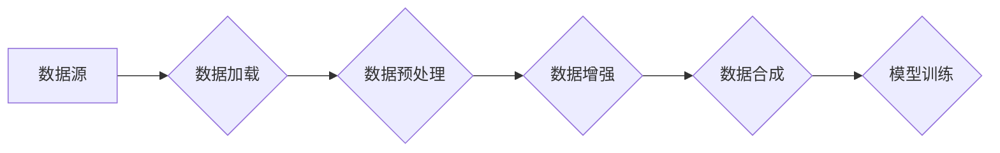

                 

## AI数据集处理：从加载到合成生成

> 关键词：AI数据集、数据加载、数据预处理、数据增强、数据合成、迁移学习、深度学习、数据质量

## 1. 背景介绍

在人工智能（AI）领域，数据是至关重要的资源。深度学习模型的性能直接取决于训练数据的质量和数量。然而，现实世界中获取高质量、大规模的标注数据往往面临着成本高、效率低、隐私问题等挑战。因此，高效地处理和利用AI数据集，从加载到合成生成，成为推动AI技术发展的重要课题。

本文将深入探讨AI数据集处理的各个环节，包括数据加载、预处理、增强和合成，并分析其核心算法原理、数学模型以及实际应用场景。

## 2. 核心概念与联系

**数据处理流程**



**数据处理环节之间的联系:**

* **数据源:** 包括各种形式的数据，如文本、图像、音频、视频等。
* **数据加载:** 将数据从源头读取并转换为模型可处理的格式。
* **数据预处理:** 对数据进行清洗、转换、规范化等操作，提高数据质量和模型训练效率。
* **数据增强:** 通过对数据进行人工或自动的修改，增加数据多样性，提高模型泛化能力。
* **数据合成:** 利用算法生成新的数据样本，弥补真实数据不足，解决数据标注成本高的问题。
* **模型训练:** 利用处理后的数据训练AI模型，使其能够完成特定任务。

## 3. 核心算法原理 & 具体操作步骤

### 3.1  算法原理概述

数据处理算法的核心在于如何高效地从原始数据中提取有价值的信息，并将其转换为模型可理解的形式。常见的算法包括：

* **数据清洗:** 识别和处理数据中的缺失值、异常值、重复值等问题。
* **数据转换:** 将数据转换为模型所需的格式，例如将文本数据转换为词向量表示。
* **数据规范化:** 将数据映射到特定范围，例如将数值数据标准化到0到1之间。
* **数据增强:** 通过随机变换、噪声添加等方式生成新的数据样本。
* **数据合成:** 利用生成对抗网络（GAN）等算法生成逼真的合成数据。

### 3.2  算法步骤详解

**数据清洗步骤:**

1. **缺失值处理:** 采用平均值填充、插值法或删除缺失数据等方法处理缺失值。
2. **异常值处理:** 通过箱线图、z-score等方法识别异常值，并采用删除、替换或转换等方法处理。
3. **重复值处理:** 识别并删除重复数据。

**数据转换步骤:**

1. **文本数据转换:** 使用词袋模型、TF-IDF或Word2Vec等方法将文本数据转换为词向量表示。
2. **图像数据转换:** 将图像数据转换为灰度图像、调整尺寸或进行特征提取等操作。

**数据规范化步骤:**

1. **最小-最大规范化:** 将数据映射到0到1之间的范围。
2. **标准化:** 将数据映射到均值为0、标准差为1的范围。

**数据增强步骤:**

1. **图像数据增强:** 旋转、翻转、裁剪、缩放、添加噪声等操作。
2. **文本数据增强:** 词语替换、句子重排序、插入噪声等操作。

**数据合成步骤:**

1. **选择合适的生成模型:** GAN、VAE等。
2. **训练生成模型:** 使用真实数据训练生成模型，使其能够生成逼真的合成数据。
3. **评估合成数据质量:** 使用指标如Inception Score、Fréchet Inception Distance等评估合成数据的质量。

### 3.3  算法优缺点

**数据清洗算法:**

* **优点:** 提高数据质量，减少模型训练中的错误。
* **缺点:** 需要根据具体数据情况选择合适的处理方法，可能会导致数据信息丢失。

**数据转换算法:**

* **优点:** 将数据转换为模型可理解的形式，提高模型训练效率。
* **缺点:** 转换过程可能会导致数据信息丢失或变形。

**数据规范化算法:**

* **优点:** 缩小数据范围，提高模型训练稳定性。
* **缺点:** 可能会导致数据分布失真。

**数据增强算法:**

* **优点:** 增加数据多样性，提高模型泛化能力。
* **缺点:** 可能生成不真实的数据样本，影响模型性能。

**数据合成算法:**

* **优点:** 可以生成大量高质量的合成数据，解决数据标注成本高的问题。
* **缺点:** 生成的数据样本可能与真实数据存在差异，需要仔细评估合成数据质量。

### 3.4  算法应用领域

数据处理算法广泛应用于各个AI领域，例如：

* **计算机视觉:** 图像分类、目标检测、图像分割等任务。
* **自然语言处理:** 文本分类、情感分析、机器翻译等任务。
* **语音识别:** 语音转文本、语音合成等任务。
* **推荐系统:** 商品推荐、用户画像等任务。

## 4. 数学模型和公式 & 详细讲解 & 举例说明

### 4.1  数学模型构建

数据处理算法通常基于数学模型进行构建，例如：

* **线性回归模型:** 用于预测连续值，其数学表达式为：

$$y = w_0 + w_1x_1 + w_2x_2 + ... + w_nx_n + \epsilon$$

其中，$y$为预测值，$x_1, x_2, ..., x_n$为输入特征，$w_0, w_1, w_2, ..., w_n$为模型参数，$\epsilon$为误差项。

* **支持向量机 (SVM) 模型:** 用于分类任务，其数学表达式为：

$$f(x) = sign(w^T x + b)$$

其中，$f(x)$为分类结果，$w$为模型参数，$x$为输入特征，$b$为偏置项。

### 4.2  公式推导过程

数据处理算法的具体公式推导过程取决于具体的算法和应用场景。例如，数据规范化算法的公式推导过程如下：

* **最小-最大规范化:**

$$x_{norm} = \frac{x - x_{min}}{x_{max} - x_{min}}$$

其中，$x_{norm}$为规范化后的数据，$x$为原始数据，$x_{min}$为数据最小值，$x_{max}$为数据最大值。

### 4.3  案例分析与讲解

**数据清洗案例:**

假设有一个包含学生成绩的数据集，其中存在一些缺失值。可以使用平均值填充法处理缺失值，例如，如果某个学生的数学成绩缺失，可以使用该学生的平均成绩填充。

**数据增强案例:**

在图像分类任务中，可以使用随机裁剪、旋转、翻转等操作对图像数据进行增强，增加数据多样性，提高模型泛化能力。

## 5. 项目实践：代码实例和详细解释说明

### 5.1  开发环境搭建

* **操作系统:** Linux、macOS或Windows
* **编程语言:** Python
* **深度学习框架:** TensorFlow、PyTorch等
* **数据处理库:** Pandas、NumPy等

### 5.2  源代码详细实现

```python
import pandas as pd
from sklearn.model_selection import train_test_split
from sklearn.linear_model import LogisticRegression

# 加载数据
data = pd.read_csv('data.csv')

# 数据清洗
data.dropna(inplace=True)  # 删除缺失值
data.replace('?', None, inplace=True)  # 替换特殊字符

# 数据预处理
X = data.drop('label', axis=1)
y = data['label']

# 数据划分
X_train, X_test, y_train, y_test = train_test_split(X, y, test_size=0.2, random_state=42)

# 模型训练
model = LogisticRegression()
model.fit(X_train, y_train)

# 模型评估
accuracy = model.score(X_test, y_test)
print(f'Accuracy: {accuracy}')
```

### 5.3  代码解读与分析

* **数据加载:** 使用Pandas库读取数据文件。
* **数据清洗:** 删除缺失值和替换特殊字符。
* **数据预处理:** 将特征数据和标签数据分离。
* **数据划分:** 将数据划分为训练集和测试集。
* **模型训练:** 使用LogisticRegression模型训练模型。
* **模型评估:** 使用测试集评估模型性能。

### 5.4  运行结果展示

运行代码后，会输出模型在测试集上的准确率。

## 6. 实际应用场景

### 6.1  医疗领域

* **疾病诊断:** 利用AI模型对患者的医疗影像数据进行分析，辅助医生诊断疾病。
* **药物研发:** 利用AI模型分析药物分子结构和生物活性，加速药物研发过程。

### 6.2  金融领域

* **欺诈检测:** 利用AI模型分析交易数据，识别异常交易行为，防止欺诈行为。
* **风险评估:** 利用AI模型评估客户的信用风险，为贷款决策提供参考。

### 6.3  零售领域

* **商品推荐:** 利用AI模型分析用户的购买历史和行为数据，推荐个性化的商品。
* **库存管理:** 利用AI模型预测商品需求，优化库存管理。

### 6.4  未来应用展望

随着AI技术的不断发展，数据处理技术将发挥越来越重要的作用。未来，数据处理技术将更加智能化、自动化，并应用于更多领域，例如：

* **自动驾驶:** 利用AI模型处理来自传感器的数据，实现自动驾驶功能。
* **个性化教育:** 利用AI模型分析学生的学习情况，提供个性化的学习方案。
* **智能制造:** 利用AI模型优化生产流程，提高生产效率。

## 7. 工具和资源推荐

### 7.1  学习资源推荐

* **书籍:**
    * "Hands-On Machine Learning with Scikit-Learn, Keras & TensorFlow" by Aurélien Géron
    * "Deep Learning" by Ian Goodfellow, Yoshua Bengio, and Aaron Courville
* **在线课程:**
    * Coursera: Machine Learning by Andrew Ng
    * Udacity: Deep Learning Nanodegree

### 7.2  开发工具推荐

* **Python:** 
    * Pandas: 数据处理
    * NumPy: 数值计算
    * Scikit-learn: 机器学习算法
    * TensorFlow: 深度学习框架
    * PyTorch: 深度学习框架

### 7.3  相关论文推荐

* "Generative Adversarial Networks" by Ian Goodfellow et al.
* "Attention Is All You Need" by Ashish Vaswani et al.
* "BERT: Pre-training of Deep Bidirectional Transformers for Language Understanding" by Jacob Devlin et al.

## 8. 总结：未来发展趋势与挑战

### 8.1  研究成果总结

近年来，AI数据集处理技术取得了显著进展，包括数据清洗、预处理、增强和合成等方面的算法和模型不断发展。这些技术进步推动了AI技术的快速发展，并在各个领域取得了广泛应用。

### 8.2  未来发展趋势

* **自动化数据处理:** 利用机器学习算法自动完成数据清洗、预处理等任务，提高效率和准确性。
* **联邦学习:** 在不共享原始数据的情况下，利用分布式训练方法进行数据处理和模型训练，保护数据隐私。
* **数据合成技术:** 开发更加先进的数据合成算法，生成更加逼真的合成数据，解决数据标注成本高的问题。

### 8.3  面临的挑战

* **数据质量问题:** 现实世界中的数据往往存在噪声、缺失值、不一致性等问题，需要开发更加 robust 的数据处理算法。
* **数据隐私保护:** 如何在保证数据安全和隐私的前提下进行数据处理和共享，是一个重要的挑战。
* **数据解释性:** 如何解释AI模型的决策过程，提高模型的可解释性和可信度，也是一个重要的研究方向。

### 8.4  研究展望

未来，AI数据集处理技术将继续朝着自动化、隐私保护、可解释性等方向发展，并与其他AI技术融合，推动AI技术的更广泛应用。


## 9. 附录：常见问题与解答

**Q1: 如何处理数据中的缺失值？**

**A1:** 常见的处理方法包括平均值填充、插值法、删除缺失数据等。选择合适的处理方法需要根据具体数据情况进行判断。

**Q2: 数据规范化有什么作用？**

**A2:** 数据规范化可以缩小数据范围，提高模型训练稳定性。

**Q3: 数据增强有什么好处？**

**A3:** 数据增强可以增加数据多样性，提高模型泛化能力。

**Q4: 如何评估合成数据的质量？**

**A4:** 可以使用Inception Score、Fréchet Inception Distance等指标评估合成数据的质量。

**Q5: 联邦学习是什么？**

**A5:** 联邦学习是一种在不共享原始数据的情况下，利用分布式训练方法进行数据处理和模型训练的技术。


作者：禅与计算机程序设计艺术 / Zen and the Art of Computer Programming 
<end_of_turn>

