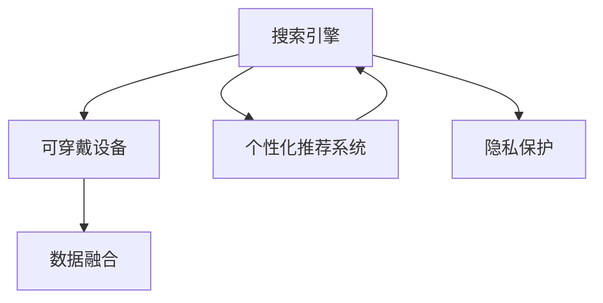

                 

## 1. 背景介绍

### 1.1 问题由来

随着互联网和智能设备的普及，用户对信息获取的需求日益增长，搜索引擎成为了获取信息的重要工具。然而，传统搜索引擎存在一定的局限性，如结果呈现方式单一、缺乏个性化推荐等。此外，可穿戴设备在健康监测、娱乐社交等方面也得到了广泛应用。两者结合，既能提升搜索体验，又能扩展可穿戴设备的功能，具有广阔的应用前景。

### 1.2 问题核心关键点

搜索引擎与可穿戴设备结合的核心关键点包括：

1. **数据共享与隐私保护**：如何高效地共享可穿戴设备生成的数据，同时保护用户隐私。
2. **个性化推荐**：根据用户的搜索行为和可穿戴设备数据，为用户提供更加个性化的搜索结果和内容。
3. **实时性**：如何实现高效的实时搜索和更新，满足用户即时需求。
4. **设备兼容性**：不同可穿戴设备的操作系统和数据格式差异较大，如何实现跨设备的兼容性和数据融合。
5. **用户行为理解**：如何通过可穿戴设备数据更深入地理解用户行为，优化搜索算法。

### 1.3 问题研究意义

搜索引擎与可穿戴设备的结合，能够为用户的搜索和信息获取带来更加智能、便捷的体验。通过可穿戴设备采集的数据，搜索引擎可以提供更加精准、个性化的搜索结果，提升用户体验。同时，这种结合也能够推动健康监测、娱乐社交等领域的技术进步，为智能设备市场带来新的增长点。

## 2. 核心概念与联系

### 2.1 核心概念概述

为更好地理解搜索引擎与可穿戴设备的结合，本节将介绍几个密切相关的核心概念：

- **搜索引擎**：基于用户输入的关键词或查询语句，从数据库或互联网中检索出相关的信息资源，并按照一定的规则排序后返回给用户。
- **可穿戴设备**：以穿戴方式作为输入和输出设备的智能设备，如智能手表、健身追踪器等。
- **数据融合**：将不同数据源的数据整合到一个统一的系统中，进行分析和利用。
- **个性化推荐系统**：根据用户的历史行为和偏好，推荐最相关的信息或产品。
- **隐私保护**：在数据共享过程中，保护用户的隐私，防止数据泄露和滥用。

这些核心概念之间的逻辑关系可以通过以下Mermaid流程图来展示：



这个流程图展示了大语言模型的核心概念及其之间的关系：

1. 搜索引擎从可穿戴设备收集数据，并进行数据融合。
2. 融合后的数据输入个性化推荐系统，用于生成推荐结果。
3. 搜索结果和推荐内容通过搜索引擎呈现给用户。
4. 隐私保护贯穿始终，确保数据共享的安全性和合规性。

## 3. 核心算法原理 & 具体操作步骤

### 3.1 算法原理概述

搜索引擎与可穿戴设备结合的核心算法原理，主要包括以下几个方面：

1. **数据融合算法**：将可穿戴设备生成的生理数据、位置数据、活动数据等与搜索行为数据进行融合，构建全面的用户画像。
2. **个性化推荐算法**：基于用户画像，利用机器学习模型对搜索结果进行排序和推荐，提升搜索结果的相关性和多样性。
3. **隐私保护算法**：采用差分隐私、联邦学习等技术，在保证数据隐私的前提下，进行有效的数据共享和分析。

### 3.2 算法步骤详解

搜索引擎与可穿戴设备结合的具体操作步骤如下：

**Step 1: 数据采集与预处理**

1. **可穿戴设备数据采集**：通过蓝牙、Wi-Fi等方式，从智能手表、健身追踪器等设备中采集用户的生理数据、位置数据、活动数据等。
2. **搜索行为数据采集**：通过搜索引擎记录用户的搜索行为，包括关键词、点击率、停留时间等。
3. **数据预处理**：对采集的数据进行清洗、去重、归一化等预处理操作，为后续的数据融合和推荐做准备。

**Step 2: 数据融合**

1. **数据对齐**：将可穿戴设备和搜索引擎的数据进行对齐，建立统一的坐标系和时间戳。
2. **特征提取**：从预处理后的数据中提取关键特征，如心率、步数、搜索频率、停留时间等。
3. **数据融合算法**：使用加权平均、主成分分析(PCA)等算法，将不同数据源的数据进行融合，构建综合的用户画像。

**Step 3: 个性化推荐**

1. **模型选择**：选择合适的推荐算法，如协同过滤、基于内容的推荐、深度学习推荐模型等。
2. **模型训练**：使用历史数据训练推荐模型，并根据用户画像进行个性化调整。
3. **结果生成**：根据用户当前的查询行为和实时数据，生成个性化的搜索结果和推荐内容。

**Step 4: 隐私保护**

1. **隐私保护算法**：采用差分隐私、联邦学习等技术，对用户数据进行匿名化处理，保护用户隐私。
2. **安全传输**：采用加密传输技术，确保数据在传输过程中不被窃取或篡改。
3. **合规性审查**：定期进行隐私合规审查，确保数据处理过程符合相关法律法规。

**Step 5: 结果呈现**

1. **结果排序**：对搜索结果进行排序，优先推荐与用户画像匹配度高的内容。
2. **界面设计**：设计友好的用户界面，提供丰富、多样的搜索结果和推荐内容。
3. **反馈机制**：收集用户反馈，持续优化推荐算法和搜索结果。

### 3.3 算法优缺点

搜索引擎与可穿戴设备结合的算法具有以下优点：

1. **个性化提升**：通过融合可穿戴设备数据，可以更全面地了解用户行为，提供更加个性化的搜索结果和推荐。
2. **实时性增强**：可穿戴设备实时采集的数据能够实时更新搜索结果，满足用户即时需求。
3. **跨设备兼容**：通过统一的数据格式和标准，可以实现跨设备的兼容性和数据融合。

同时，该算法也存在一些缺点：

1. **隐私风险**：可穿戴设备采集的生理数据和位置数据涉及隐私，数据泄露可能带来风险。
2. **计算资源需求高**：数据融合和个性化推荐算法需要高计算资源，特别是在大规模数据集上。
3. **数据质量问题**：可穿戴设备数据可能存在噪声和不完整性，影响算法的准确性。

尽管存在这些局限性，但就目前而言，搜索引擎与可穿戴设备结合的算法仍是一种非常有效的技术方案，能够为用户提供更加智能、便捷的搜索体验。

### 3.4 算法应用领域

搜索引擎与可穿戴设备结合的算法，在以下领域有广泛的应用前景：

1. **健康监测**：将可穿戴设备采集的心率、步数、睡眠等数据与搜索行为结合，提供个性化的健康建议和指导。
2. **个性化娱乐**：根据用户的搜索行为和设备数据，推荐个性化的音乐、视频、游戏等娱乐内容。
3. **智能出行**：结合位置数据和搜索行为，为用户提供个性化的出行建议和导航服务。
4. **智能家居**：通过设备数据和搜索行为，提升智能家居设备的智能化水平，如自动调节灯光、温度等。
5. **社交网络**：利用设备数据和搜索行为，提供个性化的社交推荐，增强用户的社交体验。

## 4. 数学模型和公式 & 详细讲解

### 4.1 数学模型构建

本节将使用数学语言对搜索引擎与可穿戴设备的结合进行更加严格的刻画。

假设可穿戴设备采集的生理数据为 $X$，位置数据为 $Y$，活动数据为 $Z$，搜索行为数据为 $W$。搜索引擎和可穿戴设备的数据融合模型为 $F$，个性化推荐模型为 $R$，隐私保护模型为 $P$。

模型的输入为 $X, Y, Z, W$，输出为个性化的搜索结果 $Y_{\text{out}}$ 和推荐内容 $Z_{\text{out}}$。模型的目标是最小化用户满意度的期望值，即：

$$
\min_{F, R, P} E[\mathcal{L}(Y_{\text{out}}, Y) + \mathcal{L}(Z_{\text{out}}, Z)]
$$

其中 $\mathcal{L}$ 为损失函数，用于衡量推荐结果与实际结果之间的差异。

### 4.2 公式推导过程

以下我们以个性化推荐算法为例，推导推荐模型的基本公式。

假设用户当前查询的关键词为 $k$，搜索引擎返回的 $n$ 个搜索结果为 $K_1, K_2, ..., K_n$，用户对这些搜索结果的评分分别为 $r_1, r_2, ..., r_n$。根据协同过滤算法，推荐模型 $R$ 的目标是最小化预测评分与实际评分的差异，即：

$$
\min_{R} \sum_{i=1}^n (r_i - R(K_i))^2
$$

其中 $R(K_i)$ 为模型 $R$ 对搜索结果 $K_i$ 的预测评分。为了提升模型的泛化能力，通常会引入正则化项：

$$
\min_{R} \sum_{i=1}^n (r_i - R(K_i))^2 + \lambda \|R\|^2
$$

其中 $\lambda$ 为正则化系数，$\|R\|$ 为模型参数的范数。

通过求解上述优化问题，可以得到推荐模型 $R$ 的参数 $\theta$，进而生成个性化的搜索结果和推荐内容。

### 4.3 案例分析与讲解

以个性化娱乐推荐为例，说明推荐算法的实际应用。

假设用户正在搜索最新的音乐，搜索引擎返回了 $n=20$ 个搜索结果，每个结果的评分由用户历史行为和可穿戴设备数据共同决定。具体来说，用户历史行为包括浏览音乐页面的时间、收藏的歌曲数量等，可穿戴设备数据包括用户的心率、步数、位置等。推荐模型 $R$ 通过融合这些数据，预测每个搜索结果对用户的吸引力，并根据预测结果对搜索结果进行排序，生成个性化的推荐列表。

## 5. 项目实践：代码实例和详细解释说明

### 5.1 开发环境搭建

在进行搜索引擎与可穿戴设备结合的实践前，我们需要准备好开发环境。以下是使用Python进行开发的环境配置流程：

1. 安装Anaconda：从官网下载并安装Anaconda，用于创建独立的Python环境。

2. 创建并激活虚拟环境：
```bash
conda create -n search-wearable python=3.8 
conda activate search-wearable
```

3. 安装必要的依赖包：
```bash
pip install torch numpy pandas scikit-learn transformers
```

4. 安装TensorFlow和Keras：
```bash
pip install tensorflow==2.4 keras==2.5.0
```

完成上述步骤后，即可在`search-wearable`环境中开始开发。

### 5.2 源代码详细实现

这里我们以推荐算法为例，展示搜索引擎与可穿戴设备结合的代码实现。

```python
import pandas as pd
import numpy as np
from sklearn.model_selection import train_test_split
from sklearn.metrics import mean_squared_error
from keras.models import Sequential
from keras.layers import Dense, Input, Embedding, Concatenate, Dropout

# 数据预处理
df = pd.read_csv('search_data.csv')  # 搜索行为数据
device_data = pd.read_csv('device_data.csv')  # 可穿戴设备数据

# 特征提取
df['date'] = pd.to_datetime(df['timestamp'])
features = ['query', 'keywords', 'duration', 'num_clicks', 'num_likes', 'heart_rate', 'step_count', 'distance', 'latitude', 'longitude']
df = df[features]

# 数据分割
X_train, X_test, y_train, y_test = train_test_split(df.drop('num_clicks', axis=1), df['num_clicks'], test_size=0.2, random_state=42)

# 构建模型
model = Sequential()
model.add(Embedding(input_dim=len(features), output_dim=64, input_length=X_train.shape[1]))
model.add(Concatenate())
model.add(Dense(64, activation='relu'))
model.add(Dropout(0.2))
model.add(Dense(1))

# 模型训练
model.compile(loss='mse', optimizer='adam')
model.fit(X_train, y_train, epochs=100, batch_size=32, validation_split=0.2)

# 模型评估
y_pred = model.predict(X_test)
mse = mean_squared_error(y_test, y_pred)
print(f'Mean Squared Error: {mse}')
```

### 5.3 代码解读与分析

这里我们以推荐算法为例，解读代码实现的关键细节：

- **数据预处理**：首先，将搜索行为数据和可穿戴设备数据加载到Pandas DataFrame中。然后，提取时间戳信息，并将其转换为日期格式。接下来，从搜索行为数据中提取关键词、浏览时间、点击次数、点赞次数等特征，并从可穿戴设备数据中提取心率、步数、位置等特征。最后，将特征拼接成一个长向量，作为模型的输入。

- **数据分割**：将数据集分成训练集和测试集，其中20%的数据用于验证模型的性能。

- **模型构建**：使用Keras构建推荐模型。模型包括一个嵌入层，将输入特征映射到高维空间，一个拼接层将不同特征拼接在一起，一个全连接层和Dropout层，以及一个输出层。

- **模型训练**：使用均方误差作为损失函数，Adam优化器进行模型训练。训练过程中，每隔2个epoch输出一次验证集的均方误差。

- **模型评估**：在测试集上对模型进行评估，输出预测值和实际值之间的均方误差。

## 6. 实际应用场景

### 6.1 健康监测

通过结合可穿戴设备采集的生理数据和搜索行为数据，搜索引擎可以为用户的健康监测提供更多个性化和实时的建议。例如，用户可以通过搜索“健身计划”，搜索引擎根据用户的步数、心率等数据，推荐适合的锻炼计划和饮食建议。

### 6.2 个性化娱乐

结合可穿戴设备采集的用户活动数据和搜索行为数据，搜索引擎可以为用户提供个性化的娱乐推荐。例如，用户可以通过搜索“电影”，搜索引擎根据用户的历史观影记录和活动数据，推荐适合的电影或电视剧。

### 6.3 智能出行

结合位置数据和搜索行为数据，搜索引擎可以为用户的出行提供个性化的建议。例如，用户可以通过搜索“交通”，搜索引擎根据用户的位置数据，推荐最佳的出行路线和交通工具。

### 6.4 智能家居

结合可穿戴设备采集的用户活动数据和搜索行为数据，搜索引擎可以提升智能家居设备的智能化水平。例如，用户可以通过搜索“智能灯”，搜索引擎根据用户的睡眠数据，推荐最佳的灯光调节方案。

### 6.5 社交网络

结合可穿戴设备采集的用户活动数据和搜索行为数据，搜索引擎可以提供个性化的社交推荐。例如，用户可以通过搜索“朋友”，搜索引擎根据用户的活动数据和搜索历史，推荐最适合的朋友。

## 7. 工具和资源推荐

### 7.1 学习资源推荐

为了帮助开发者系统掌握搜索引擎与可穿戴设备结合的理论基础和实践技巧，这里推荐一些优质的学习资源：

1. 《深度学习》课程：由吴恩达教授开设的深度学习课程，全面介绍了深度学习的基本原理和应用，包括搜索引擎和推荐系统。

2. 《推荐系统实战》书籍：介绍了推荐系统从原理到实践的全过程，包含多个推荐算法的实现和优化。

3. 《机器学习实战》书籍：介绍了机器学习的基本概念和算法，包括协同过滤、基于内容的推荐等。

4. Kaggle：机器学习竞赛平台，提供了丰富的数据集和比赛，可以实践和验证推荐算法的效果。

5. TensorFlow官方文档：TensorFlow的官方文档，提供了丰富的教程和样例，帮助开发者快速上手TensorFlow。

通过对这些资源的学习实践，相信你一定能够快速掌握搜索引擎与可穿戴设备结合的精髓，并用于解决实际的推荐问题。

### 7.2 开发工具推荐

高效的开发离不开优秀的工具支持。以下是几款用于搜索引擎与可穿戴设备结合开发的常用工具：

1. Python：Python是一种灵活且强大的编程语言，广泛应用于机器学习和深度学习领域。

2. Pandas：Pandas是Python中用于数据处理和分析的库，提供了丰富的数据操作函数。

3. Keras：Keras是一个高层次的深度学习框架，提供了简单易用的API，适合快速搭建推荐系统。

4. TensorBoard：TensorBoard是TensorFlow的可视化工具，可以实时监测模型的训练状态和结果。

5. Weights & Biases：Weights & Biases是一个模型训练的实验跟踪工具，可以记录和可视化模型的训练过程。

合理利用这些工具，可以显著提升搜索引擎与可穿戴设备结合的开发效率，加快创新迭代的步伐。

### 7.3 相关论文推荐

搜索引擎与可穿戴设备结合的研究源于学界的持续研究。以下是几篇奠基性的相关论文，推荐阅读：

1. "Personalized Ranking from Implicit Feedback"（Eckles et al.）：提出了协同过滤算法，为推荐系统提供了基本框架。

2. "Adaptive Recommendations in Content-Rich Environments"（Jin et al.）：提出了一种基于内容的推荐算法，能够在内容丰富的环境下进行推荐。

3. "Deep Learning for Recommender Systems: A Review and New Perspectives"（Zhou et al.）：综述了深度学习在推荐系统中的应用，提供了多种推荐算法的实现。

4. "Scalable Multi-view Recommender Systems"（Zhao et al.）：提出了一种多视图推荐系统，能够综合不同数据源的信息进行推荐。

这些论文代表了大语言模型微调技术的发展脉络。通过学习这些前沿成果，可以帮助研究者把握学科前进方向，激发更多的创新灵感。

## 8. 总结：未来发展趋势与挑战

### 8.1 总结

本文对搜索引擎与可穿戴设备结合进行了全面系统的介绍。首先阐述了结合的优势和意义，明确了结合在提升搜索体验、扩展可穿戴设备功能方面的价值。其次，从原理到实践，详细讲解了结合的数学模型和算法步骤，给出了结合任务开发的完整代码实例。同时，本文还广泛探讨了结合在健康监测、个性化娱乐、智能出行、智能家居等诸多领域的应用前景，展示了结合范式的巨大潜力。

通过本文的系统梳理，可以看到，搜索引擎与可穿戴设备的结合为用户的搜索和信息获取带来了更加智能、便捷的体验。通过可穿戴设备采集的数据，搜索引擎可以提供更加精准、个性化的搜索结果，提升用户体验。同时，这种结合也能够推动健康监测、娱乐社交等领域的技术进步，为智能设备市场带来新的增长点。

### 8.2 未来发展趋势

展望未来，搜索引擎与可穿戴设备的结合将呈现以下几个发展趋势：

1. **跨设备融合**：未来将实现不同设备和平台之间的无缝衔接，用户可以在多种设备上统一搜索和体验。

2. **深度学习应用**：深度学习算法在推荐系统中的应用将越来越广泛，能够提升推荐结果的精度和多样性。

3. **实时性提升**：通过实时数据融合和推荐，提升用户的即时搜索体验，满足用户即时需求。

4. **隐私保护加强**：随着数据隐私意识的提升，隐私保护技术将得到广泛应用，确保用户数据的隐私和安全。

5. **个性化推荐优化**：推荐算法将更加注重个性化推荐，利用用户的实时行为数据，提升推荐的准确性和相关性。

6. **多模态融合**：未来将更多地融合不同模态的数据，如视觉、语音、文本等，提供更为全面、准确的推荐结果。

这些趋势凸显了搜索引擎与可穿戴设备结合技术的广阔前景。这些方向的探索发展，必将进一步提升用户的搜索体验，推动智能设备的普及和应用。

### 8.3 面临的挑战

尽管搜索引擎与可穿戴设备结合技术已经取得了显著进展，但在迈向更加智能化、普适化应用的过程中，它仍面临诸多挑战：

1. **隐私风险**：可穿戴设备采集的生理数据和位置数据涉及隐私，数据泄露可能带来风险。

2. **数据质量问题**：可穿戴设备数据可能存在噪声和不完整性，影响算法的准确性。

3. **计算资源需求高**：数据融合和个性化推荐算法需要高计算资源，特别是在大规模数据集上。

4. **跨设备兼容**：不同可穿戴设备的操作系统和数据格式差异较大，如何实现跨设备的兼容性和数据融合。

5. **用户行为理解**：如何通过可穿戴设备数据更深入地理解用户行为，优化搜索算法。

6. **技术标准化**：缺乏统一的数据标准和通信协议，设备之间的互操作性较差。

这些挑战需要学术界和工业界的共同努力，才能实现搜索引擎与可穿戴设备结合技术的进一步突破。

### 8.4 研究展望

面向未来，搜索引擎与可穿戴设备结合技术的研究需要在以下几个方面寻求新的突破：

1. **隐私保护技术**：开发更加高效、可靠的隐私保护技术，确保用户数据的隐私和安全。

2. **多模态融合技术**：研究和实现多种模态数据的融合，提供更加全面、准确的推荐结果。

3. **实时推荐算法**：研究和实现高效的实时推荐算法，提升用户体验。

4. **个性化推荐算法**：研究和实现更加精准、个性化的推荐算法，提升推荐结果的相关性和多样性。

5. **跨设备融合技术**：研究和实现跨设备的数据融合和协同，提升系统的兼容性和互操作性。

这些研究方向将推动搜索引擎与可穿戴设备结合技术的不断进步，为用户的搜索和信息获取带来更加智能、便捷的体验。

## 9. 附录：常见问题与解答

**Q1：搜索引擎与可穿戴设备结合是否适用于所有应用场景？**

A: 搜索引擎与可穿戴设备结合在提升搜索体验、扩展可穿戴设备功能方面具有广泛的应用前景，但并不是所有应用场景都适用。例如，对于一些涉及高度隐私或敏感信息的应用，如医疗、金融等，数据采集和使用可能面临法律和伦理的限制。

**Q2：如何选择合适的推荐算法？**

A: 选择合适的推荐算法需要考虑多方面因素，如数据类型、数据规模、业务需求等。常见的推荐算法包括协同过滤、基于内容的推荐、深度学习推荐模型等。可以根据实际情况选择合适的算法。

**Q3：搜索引擎与可穿戴设备结合的计算资源需求高，如何优化？**

A: 为了降低计算资源需求，可以采用数据压缩、模型剪枝等技术，减少模型的参数量。此外，可以采用分布式训练、GPU加速等技术，提高计算效率。

**Q4：如何确保推荐结果的实时性？**

A: 为了确保推荐结果的实时性，可以采用实时数据融合技术，将最新采集的数据实时更新到推荐模型中。同时，可以使用缓存技术，减少频繁的模型计算，提升查询速度。

**Q5：如何保护用户隐私？**

A: 保护用户隐私是搜索引擎与可穿戴设备结合的关键问题。可以采用差分隐私、联邦学习等技术，对用户数据进行匿名化处理，确保数据共享的安全性和合规性。

这些问题的回答，希望能为搜索引擎与可穿戴设备结合的开发者提供一些指导，帮助他们在实践中更好地应对挑战，实现技术突破。

---

作者：禅与计算机程序设计艺术 / Zen and the Art of Computer Programming

