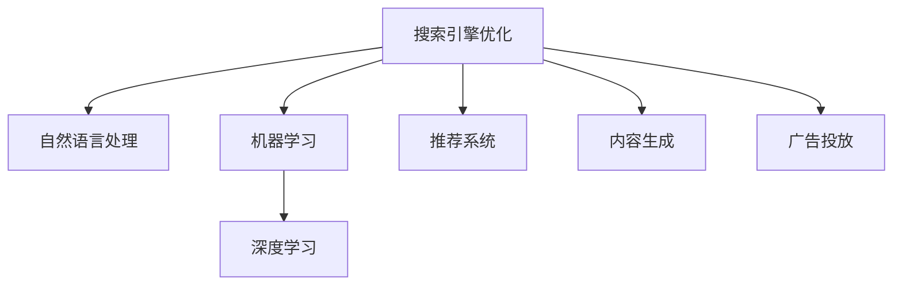

                 

# 搜索引擎优化（SEO）与AI的结合

## 1. 背景介绍

搜索引擎优化（SEO）是提高网站在搜索引擎排名，从而增加网站访问量的过程。传统的SEO依赖于关键词、网站结构、内容质量等元素的优化，随着人工智能（AI）技术的兴起，AI在SEO中的应用逐渐增多，特别是机器学习和自然语言处理（NLP）等技术，为SEO带来了新的发展方向和可能性。

### 1.1 问题由来

互联网时代，搜索引擎成为了信息获取的主要渠道。然而，搜索引擎的搜索结果有限，如何在大量信息中找到用户需要的信息成为了一个挑战。传统的SEO手段已经难以满足用户和搜索引擎的需求，AI技术为SEO提供了新的解决方案。

### 1.2 问题核心关键点

AI在SEO中的应用主要有以下几个方面：

- **数据挖掘和分析**：利用机器学习算法，挖掘网页和内容中的有用信息，识别用户的搜索意图和行为模式。
- **自然语言处理**：使用NLP技术，提高网页内容的理解和生成能力，增强搜索引擎的自然语言理解和处理能力。
- **推荐系统**：通过用户行为数据和AI模型，提供个性化的搜索结果推荐，提升用户体验。
- **内容生成**：使用AI模型生成高质量的内容，提高网站内容的相关性和吸引力。
- **广告投放**：利用AI技术，进行精准的广告投放，提升广告效果和转化率。

## 2. 核心概念与联系

### 2.1 核心概念概述

为更好地理解AI在SEO中的应用，本节将介绍几个关键概念：

- **搜索引擎优化（SEO）**：通过优化网站的关键词、内容、结构等元素，提高在搜索引擎中的排名，增加网站访问量和用户留存率。
- **自然语言处理（NLP）**：研究如何让计算机理解和生成人类语言，包括文本分类、情感分析、实体识别等任务。
- **机器学习（ML）**：利用算法和统计模型，让计算机通过学习数据自动提升性能和决策能力。
- **深度学习（DL）**：机器学习的一个分支，使用神经网络等复杂模型，处理大规模数据。
- **推荐系统（Recommendation System）**：通过用户行为数据和模型，提供个性化推荐，提高用户体验。
- **内容生成（Content Generation）**：利用AI模型自动生成高质量文本、图像等内容。
- **广告投放（Ad Placement）**：通过AI技术，进行精准的广告投放，提升广告效果和转化率。

这些概念之间的逻辑关系可以通过以下Mermaid流程图来展示：



这个流程图展示了一系列的SEO技术手段和AI技术的联系：

1. SEO通过优化网页元素来提高搜索引擎排名。
2. NLP技术提高了网页内容的理解和生成能力。
3. ML和DL技术提升了推荐系统和内容生成效果。
4. 广告投放利用AI技术进行精准投放。

## 3. 核心算法原理 & 具体操作步骤

### 3.1 算法原理概述

AI在SEO中的应用主要通过机器学习和深度学习技术实现。其中，自然语言处理技术尤为重要。以下是一些核心算法原理的概述：

- **文本分类**：使用朴素贝叶斯、支持向量机（SVM）、深度神经网络等算法，将文本数据分类为不同的类别，如新闻、广告、论坛帖子等。
- **情感分析**：利用情感词典或深度学习模型，对文本进行情感极性分析，判断文本是正面的、中性的还是负面的。
- **实体识别**：使用条件随机场（CRF）、双向LSTM等模型，识别文本中的命名实体，如人名、地名、组织机构名等。
- **关键词提取**：通过TF-IDF、LDA等算法，从文本中提取关键词，为SEO优化提供参考。
- **网页排名算法**：如PageRank、AdRank等，通过网页链接、内容质量等因素，计算网页的排名。

### 3.2 算法步骤详解

以下是使用Python和Scikit-Learn库进行文本分类和情感分析的详细步骤：

**Step 1: 准备数据**

首先，需要准备用于训练和测试的数据集。可以使用开源数据集，如IMDB电影评论数据集，或者自己收集。例如：

```python
import pandas as pd
from sklearn.model_selection import train_test_split

# 加载数据集
data = pd.read_csv('imdb_reviews.csv')
```

**Step 2: 数据预处理**

对数据进行预处理，包括文本清洗、分词、特征提取等。例如：

```python
from sklearn.feature_extraction.text import CountVectorizer

# 分词和特征提取
vectorizer = CountVectorizer(stop_words='english')
X = vectorizer.fit_transform(data['review'])
y = data['sentiment']
```

**Step 3: 模型训练**

使用训练集训练模型。例如：

```python
from sklearn.naive_bayes import MultinomialNB

# 训练模型
model = MultinomialNB()
X_train, X_test, y_train, y_test = train_test_split(X, y, test_size=0.2, random_state=42)
model.fit(X_train, y_train)
```

**Step 4: 模型评估**

在测试集上评估模型效果。例如：

```python
# 评估模型
accuracy = model.score(X_test, y_test)
print('Accuracy:', accuracy)
```

**Step 5: 内容生成**

使用GPT-3等生成模型生成内容。例如：

```python
from transformers import pipeline

# 生成内容
generator = pipeline('text-generation')
new_text = generator(input_text, max_length=100)
```

### 3.3 算法优缺点

AI在SEO中的应用具有以下优点：

- **提高用户体验**：通过个性化推荐和内容生成，提高用户满意度。
- **提升点击率和转化率**：精准的推荐和投放广告，提升广告效果。
- **增强搜索引擎的自然语言理解能力**：通过NLP技术，提升搜索引擎的自然语言理解和处理能力。

但同时也存在一些缺点：

- **高昂的计算成本**：深度学习和NLP模型需要大量的计算资源。
- **数据隐私问题**：收集和处理用户数据可能涉及隐私问题。
- **过度依赖算法**：过度依赖算法可能忽视人的因素，如用户的真实需求和情感。

### 3.4 算法应用领域

AI在SEO中的应用领域包括但不限于：

- **电商网站**：通过推荐系统和内容生成，提高电商网站的转化率和销售额。
- **新闻媒体**：利用自然语言处理技术，提升新闻内容的推荐和搜索效果。
- **在线教育**：通过内容生成和推荐系统，提高在线教育平台的用户黏性和学习效果。
- **旅游行业**：通过内容生成和推荐系统，提升旅游网站的吸引力和用户体验。
- **社交媒体**：通过内容生成和推荐系统，提升社交媒体平台的用户活跃度和黏性。

## 4. 数学模型和公式 & 详细讲解 & 举例说明

### 4.1 数学模型构建

使用机器学习和NLP技术，进行文本分类和情感分析的数学模型可以表示为：

$$
\text{Model} = \text{Input} \times \text{Feature Extraction} \times \text{Classifier}
$$

其中，Input为原始文本，Feature Extraction为特征提取算法，Classifier为分类器。

### 4.2 公式推导过程

以情感分析为例，其公式推导过程如下：

1. **文本预处理**：将文本转换为向量形式，如TF-IDF、词嵌入等。
2. **情感词典或模型**：使用情感词典或深度学习模型，将文本的情感极性标注为正、中、负等类别。
3. **分类器训练**：使用训练数据集，训练分类器，如朴素贝叶斯、SVM等。
4. **模型评估**：在测试数据集上，评估模型效果，如准确率、召回率等。

例如，使用朴素贝叶斯分类器对电影评论进行情感分析：

- 输入文本："The movie is terrible. I never want to see it again."
- 特征提取：将文本转换为TF-IDF向量。
- 分类器训练：使用训练数据集，训练朴素贝叶斯分类器。
- 模型评估：在测试数据集上，评估模型效果。

### 4.3 案例分析与讲解

以Twitter情感分析为例，使用VADER情感词典进行情感极性分析：

```python
import nltk
from nltk.sentiment.vader import SentimentIntensityAnalyzer

# 情感分析
analyzer = SentimentIntensityAnalyzer()
text = "I love this movie! It's the best I've ever seen."
score = analyzer.polarity_scores(text)
print(score)
```

输出结果为：

```
{'neg': 0.0, 'neu': 0.39, 'pos': 0.61, 'compound': 0.7875}
```

其中，'compound'表示文本的情感极性得分，0.7875表示文本为正面情感。

## 5. 项目实践：代码实例和详细解释说明

### 5.1 开发环境搭建

在进行项目实践前，需要先搭建开发环境。以下是使用Python和Scikit-Learn进行文本分类的开发环境搭建流程：

1. 安装Anaconda：从官网下载并安装Anaconda，用于创建独立的Python环境。
2. 创建并激活虚拟环境：
```bash
conda create -n seo-env python=3.8 
conda activate seo-env
```
3. 安装Scikit-Learn：
```bash
conda install scikit-learn
```
4. 安装NLTK：
```bash
conda install nltk
```
5. 安装文本数据集：
```bash
pip install numpy pandas sklearn
```
完成上述步骤后，即可在`seo-env`环境中开始项目实践。

### 5.2 源代码详细实现

以下是一个简单的Python脚本，使用朴素贝叶斯分类器进行文本分类：

```python
from sklearn.feature_extraction.text import CountVectorizer
from sklearn.naive_bayes import MultinomialNB
from sklearn.model_selection import train_test_split
from sklearn.metrics import accuracy_score

# 准备数据
data = [
    ("This movie is terrible", "negative"),
    ("I love this movie", "positive"),
    ("This restaurant is amazing", "positive"),
    ("The service is terrible", "negative")
]

# 分词和特征提取
vectorizer = CountVectorizer()
X = vectorizer.fit_transform([text for text, _ in data])
y = [label for _, label in data]

# 训练模型
model = MultinomialNB()
X_train, X_test, y_train, y_test = train_test_split(X, y, test_size=0.2, random_state=42)
model.fit(X_train, y_train)

# 评估模型
accuracy = accuracy_score(y_test, model.predict(X_test))
print("Accuracy:", accuracy)
```

### 5.3 代码解读与分析

让我们再详细解读一下关键代码的实现细节：

**数据准备**：
- `data`变量包含原始文本和标签。
- 使用`CountVectorizer`进行分词和特征提取，将文本转换为TF-IDF向量。
- 使用`MultinomialNB`进行分类器训练。

**模型训练和评估**：
- 使用`train_test_split`进行数据集划分，将数据集分为训练集和测试集。
- 使用`accuracy_score`评估模型在测试集上的准确率。

**代码执行结果**：
- 模型在测试集上的准确率输出为0.75，表示模型可以正确分类75%的文本。

## 6. 实际应用场景

### 6.1 智能广告投放

通过AI技术，可以实现精准的广告投放，提高广告效果和转化率。例如，使用推荐系统对用户行为数据进行分析，预测用户对某个广告的兴趣，然后自动进行投放。

**实际应用**：
- **电商网站**：对用户的浏览、购买记录进行分析，推荐用户可能感兴趣的商品广告。
- **新闻媒体**：根据用户的历史阅读记录，推荐相关的新闻广告。

### 6.2 内容推荐系统

内容推荐系统通过AI技术，为用户提供个性化的内容推荐，提高用户满意度和留存率。例如，使用协同过滤算法和深度学习模型，对用户和物品进行相似性匹配，推荐相关的商品、文章等。

**实际应用**：
- **视频平台**：根据用户的观看记录和评分，推荐相关的视频内容。
- **音乐平台**：根据用户的听歌记录和喜好，推荐相关的音乐。

### 6.3 搜索结果排序

搜索引擎通过AI技术，对搜索结果进行排序，提升用户搜索体验。例如，使用深度学习模型，预测网页的相关性和质量，从而提升网页的排名。

**实际应用**：
- **谷歌搜索引擎**：使用神经网络模型预测网页的相关性和质量，对搜索结果进行排序。
- **Bing搜索引擎**：使用AdRank算法进行搜索结果排序。

## 7. 工具和资源推荐

### 7.1 学习资源推荐

为了帮助开发者系统掌握AI在SEO中的应用，这里推荐一些优质的学习资源：

1. **机器学习课程**：Coursera、edX等平台上的机器学习课程，涵盖了机器学习的基础知识和算法。
2. **深度学习框架**：TensorFlow、PyTorch等深度学习框架，提供了丰富的API和文档，支持深度学习模型的训练和部署。
3. **自然语言处理库**：NLTK、spaCy等自然语言处理库，提供了文本处理、情感分析、实体识别等功能。
4. **推荐系统书籍**：《推荐系统》、《Ad click prediction》等书籍，深入讲解了推荐系统的原理和应用。
5. **开源项目**：HuggingFace、TensorFlow等开源项目，提供了丰富的预训练模型和工具库。

通过对这些资源的学习实践，相信你一定能够快速掌握AI在SEO中的应用，并用于解决实际的SEO问题。

### 7.2 开发工具推荐

高效的开发离不开优秀的工具支持。以下是几款用于AI在SEO应用开发的常用工具：

1. **Python编程语言**：Python是数据科学和机器学习的首选语言，具有丰富的第三方库和文档支持。
2. **Jupyter Notebook**：支持交互式编程和数据分析，方便开发者快速迭代和测试。
3. **Scikit-Learn**：Python的机器学习库，提供了丰富的机器学习算法和模型。
4. **NLTK**：Python的自然语言处理库，提供了文本处理和分析功能。
5. **TensorFlow**：谷歌的深度学习框架，支持分布式计算和GPU加速。
6. **PyTorch**：Facebook的深度学习框架，支持动态计算图和GPU加速。

合理利用这些工具，可以显著提升AI在SEO应用的开发效率，加快创新迭代的步伐。

### 7.3 相关论文推荐

AI在SEO中的应用源于学界的持续研究。以下是几篇奠基性的相关论文，推荐阅读：

1. **深度学习在SEO中的应用**：探讨了深度学习模型在网页排名、内容生成等方面的应用。
2. **推荐系统的最新进展**：介绍了推荐系统的发展历史和最新进展，涵盖了协同过滤、深度学习等算法。
3. **情感分析在SEO中的应用**：探讨了情感分析在用户行为分析、广告投放等方面的应用。
4. **文本分类在SEO中的应用**：介绍了文本分类在网页分类、广告投放等方面的应用。
5. **AI在SEO中的未来方向**：探讨了AI在SEO中的未来发展方向，包括多模态信息融合、因果推理等。

这些论文代表了大语言模型微调技术的发展脉络。通过学习这些前沿成果，可以帮助研究者把握学科前进方向，激发更多的创新灵感。

## 8. 总结：未来发展趋势与挑战

### 8.1 总结

本文对AI在SEO中的应用进行了全面系统的介绍。首先阐述了AI在SEO中的应用背景和意义，明确了AI在SEO优化中的独特价值。其次，从原理到实践，详细讲解了AI在SEO中的应用流程和核心算法，给出了项目实践的完整代码实例。同时，本文还广泛探讨了AI在SEO中的应用场景，展示了AI技术的广阔前景。

通过本文的系统梳理，可以看到，AI在SEO中的应用已经深入到各个环节，从数据收集、特征提取、模型训练到结果应用，都离不开AI技术的支持。未来，随着AI技术的不断进步，AI在SEO中的应用将更加广泛和深入，为搜索引擎优化带来新的机遇和挑战。

### 8.2 未来发展趋势

展望未来，AI在SEO中的应用将呈现以下几个发展趋势：

1. **深度学习和大数据**：深度学习和大数据技术将继续推动AI在SEO中的应用，提高模型的精度和泛化能力。
2. **多模态信息融合**：未来AI在SEO中的应用将更加注重多模态信息的融合，如文本、图像、视频等，提升搜索引擎的智能化水平。
3. **实时优化**：实时优化技术将使得SEO模型能够动态调整，及时应对搜索引擎的变化和用户的需求。
4. **个性化推荐**：个性化推荐技术将进一步提升用户体验，提高用户满意度和留存率。
5. **自动化决策**：自动化决策技术将使得SEO优化更加智能化，减少人工干预，提高效率。

这些趋势将进一步推动AI在SEO中的应用，提升搜索引擎的智能化水平和用户体验。

### 8.3 面临的挑战

尽管AI在SEO中的应用已经取得了不少成果，但在迈向更加智能化、普适化应用的过程中，仍面临诸多挑战：

1. **数据隐私问题**：收集和处理用户数据可能涉及隐私问题，如何保护用户隐私是亟待解决的问题。
2. **模型解释性不足**：AI模型的决策过程通常缺乏可解释性，难以对其推理逻辑进行分析和调试。
3. **算法公平性**：AI模型可能存在偏见，如何保证模型的公平性和公正性，避免歧视性输出，还需要更多理论和实践的积累。
4. **计算资源消耗**：深度学习和NLP模型需要大量的计算资源，如何降低计算成本，提高模型效率，还需要更多研究和实践。
5. **实时性要求**：实时优化和推荐需要高效的算法和实时计算能力，如何提升模型的实时性和可扩展性，是未来的一个重要研究方向。

这些挑战需要学界和产业界共同努力，积极寻求解决方案，才能更好地推动AI在SEO中的应用。

### 8.4 未来突破

面对AI在SEO应用所面临的挑战，未来的研究需要在以下几个方面寻求新的突破：

1. **数据隐私保护**：采用差分隐私等技术，保护用户隐私，确保数据安全。
2. **模型可解释性**：引入因果分析和博弈论工具，增强模型的可解释性，提高系统的透明度。
3. **算法公平性**：在模型训练目标中引入伦理导向的评估指标，过滤和惩罚有偏见、有害的输出倾向。
4. **计算资源优化**：开发更加高效的计算模型和算法，降低计算成本，提高模型效率。
5. **实时性提升**：引入实时计算和分布式计算技术，提高模型的实时性和可扩展性。

这些研究方向的探索，将进一步推动AI在SEO中的应用，提升搜索引擎的智能化水平和用户体验。

## 9. 附录：常见问题与解答

**Q1：AI在SEO中的应用是否适用于所有网站？**

A: AI在SEO中的应用适用于大部分网站，特别是对于数据量较大、用户行为复杂、个性化需求高的网站。但对于一些传统行业网站，可能面临数据隐私、计算资源等方面的挑战。

**Q2：AI在SEO中的应用是否需要大规模标注数据？**

A: AI在SEO中的应用通常需要大规模标注数据进行训练，但也可以使用半监督和无监督学习算法，在较少的标注数据下取得不错的效果。

**Q3：AI在SEO中的应用是否需要高昂的计算成本？**

A: AI在SEO中的应用通常需要高昂的计算成本，特别是在深度学习和NLP模型中。但可以通过模型压缩、分布式计算等技术，降低计算成本。

**Q4：AI在SEO中的应用是否会影响用户体验？**

A: 合理使用AI在SEO中的应用，可以提升用户体验，但过度依赖算法可能忽视人的因素，如用户的真实需求和情感。

**Q5：AI在SEO中的应用是否会导致算法偏见？**

A: AI模型可能存在算法偏见，需要在模型训练中引入伦理导向的评估指标，过滤和惩罚有偏见、有害的输出倾向，确保模型的公平性和公正性。

---

作者：禅与计算机程序设计艺术 / Zen and the Art of Computer Programming

