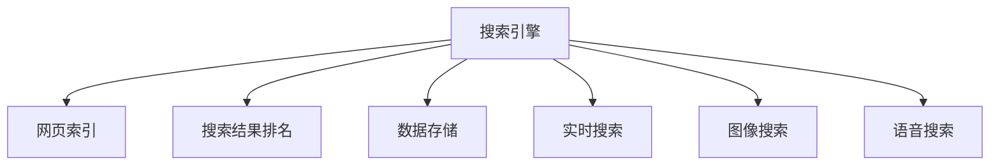

                 

# 搜索引擎在5G时代的发展机遇

## 1. 背景介绍

### 1.1 问题由来
在过去的几十年里，搜索引擎一直是互联网用户获取信息、知识的主要渠道。传统的搜索技术基于Web爬行、网页索引、搜索排名等核心组件，经过多年的技术演进，已经相当成熟。然而，随着5G时代的到来，搜索引擎面临诸多新的机遇和挑战。

5G技术的演进带来了极高的网络带宽和低延迟，这对搜索引擎的应用场景和技术实现带来了革命性的影响。一方面，5G的快速连接能力使得即时搜索结果的展示成为可能，提高了用户体验；另一方面，5G的低延迟特性也使得实时搜索、图像搜索、语音搜索等新兴搜索方式成为可能。

5G带来的海量数据和低延迟传输，需要搜索引擎在技术架构和算法优化方面做出巨大调整。这不仅仅是带宽和速度的提升，更是信息获取方式、处理方式和用户体验的变革。本文将深入探讨5G时代搜索引擎面临的机遇和挑战，并提出相应的技术应对策略。

### 1.2 问题核心关键点
在5G时代，搜索引擎的核心问题可以归结为以下几个关键点：

- 如何充分利用5G的带宽和低延迟特性，提升搜索速度和实时性。
- 如何处理和存储5G时代的海量数据，提升搜索效率。
- 如何支持新兴搜索方式，如图像搜索、语音搜索等。
- 如何在保证搜索准确性的同时，优化用户体验。

## 2. 核心概念与联系

### 2.1 核心概念概述

为了更好地理解5G时代搜索引擎的技术挑战，本节将介绍几个关键概念：

- 搜索引擎(Search Engine)：提供信息检索、文档排序、查询匹配等服务的技术系统。
- 网页索引/Web Crawling：通过Web爬虫抓取互联网上的网页，建立索引数据库，支持快速查询。
- 搜索结果排名/Search Ranking：根据网页的相关性、权威性等指标，对搜索结果进行排序，提升用户体验。
- 数据存储/Retrieval：利用数据库、存储引擎等技术，高效存储和检索大量文档和数据。
- 实时搜索/Real-time Search：利用5G网络的低延迟特性，提供即时的搜索结果。
- 图像搜索/Image Search：通过分析图像内容，匹配用户查询，展示相关信息。
- 语音搜索/Voice Search：利用语音识别技术，将语音转化为文本查询，提升搜索便捷性。

这些核心概念之间的逻辑关系可以通过以下Mermaid流程图来展示：



这个流程图展示了下游搜索应用与核心技术的联系：

1. 网页索引是搜索引擎的核心组成部分，为后续的搜索排名和数据存储提供数据基础。
2. 搜索结果排名是搜索引擎的核心功能，通过算法优化提升搜索准确性和用户体验。
3. 数据存储为搜索引擎提供高效的数据检索能力，支持大规模数据的存储和管理。
4. 实时搜索利用5G网络特性，提升搜索速度和响应速度。
5. 图像搜索和语音搜索是新兴的搜索方式，扩展了搜索引擎的应用场景。

## 3. 核心算法原理 & 具体操作步骤
### 3.1 算法原理概述

5G时代搜索引擎的算法优化，主要聚焦于以下几个方面：

- 利用5G网络特性，提升实时搜索效率。
- 处理海量数据，优化存储和检索算法。
- 支持图像搜索和语音搜索，扩展搜索方式。
- 改进搜索排名算法，提升搜索准确性和用户体验。

这些优化方向涵盖了从数据处理到用户体验的全链条，需要在技术实现上进行深入探讨。

### 3.2 算法步骤详解

#### 实时搜索

实时搜索是5G时代搜索引擎的重要应用之一。其关键在于利用5G网络的低延迟特性，快速获取并展示搜索结果。

1. **数据获取**：通过5G网络，实时抓取用户查询输入，获取相关文档和数据。
2. **数据处理**：利用高效的数据处理算法，快速分析并匹配用户查询。
3. **结果展示**：利用低延迟网络特性，快速将搜索结果展示给用户。

具体实现上，可以采用以下策略：

- 异步数据获取：利用异步编程技术，在用户输入的同时，实时抓取相关数据。
- 数据缓存：在缓存中存储热门查询的预处理结果，减少数据获取和处理的延迟。
- 分布式计算：利用分布式计算框架，如Hadoop、Spark等，处理大规模数据。

#### 数据存储

5G时代的数据量呈爆炸性增长，如何高效存储和检索海量数据成为搜索引擎的关键挑战。

1. **数据压缩**：利用数据压缩技术，如LZ77、LZW等，减少存储空间的占用。
2. **分布式存储**：利用分布式存储系统，如HDFS、Ceph等，提供高可扩展性的存储能力。
3. **数据索引**：利用倒排索引等高效的数据检索算法，提升数据检索速度。

具体实现上，可以采用以下策略：

- 分布式索引：将索引数据分布式存储在多台服务器上，利用分布式计算提升检索速度。
- 数据分片：将数据分片存储，每个分片独立处理，提升并行检索能力。
- 数据复制：利用数据复制技术，确保数据的可用性和容错性。

#### 图像搜索

图像搜索是新兴的搜索方式，利用计算机视觉技术，从图像中提取出视觉特征，匹配用户查询。

1. **图像预处理**：对图像进行预处理，提取关键特征。
2. **特征匹配**：利用机器学习算法，匹配用户查询和图像特征。
3. **结果展示**：展示最相关的图像结果。

具体实现上，可以采用以下策略：

- 特征提取：利用深度学习算法，如CNN、R-CNN等，提取图像关键特征。
- 特征匹配：利用搜索引擎技术，如TF-IDF、BM25等，匹配用户查询和图像特征。
- 结果排序：利用排序算法，提升搜索结果的相关性。

#### 语音搜索

语音搜索利用语音识别技术，将语音转化为文本查询，提升搜索便捷性。

1. **语音识别**：利用语音识别技术，将语音转化为文本。
2. **文本匹配**：利用搜索引擎技术，匹配用户查询和文档内容。
3. **结果展示**：展示最相关的语音搜索结果。

具体实现上，可以采用以下策略：

- 语音识别：利用深度学习算法，如CTC、LSTM等，实现高精度的语音识别。
- 文本匹配：利用搜索引擎技术，如TF-IDF、BM25等，匹配用户查询和文档内容。
- 结果排序：利用排序算法，提升搜索结果的相关性。

#### 搜索排名算法

搜索排名是搜索引擎的核心功能，利用算法优化提升搜索准确性和用户体验。

1. **TF-IDF算法**：计算每个文档的词频和逆文档频率，提升搜索结果的相关性。
2. **BM25算法**：考虑查询长度和文档长度等因素，提升搜索结果的相关性和召回率。
3. **深度学习模型**：利用深度学习模型，如BERT、GPT等，提升搜索结果的相关性和语义理解能力。

具体实现上，可以采用以下策略：

- 特征提取：利用NLP技术，提取文档和查询的关键特征。
- 模型训练：利用大规模语料库，训练深度学习模型。
- 模型融合：将多种算法和模型进行融合，提升搜索效果。

### 3.3 算法优缺点

实时搜索的优势在于其快速响应和高效处理海量数据的能力，但也需要较高的技术实现难度和资源投入。图像搜索和语音搜索带来了更丰富的搜索方式，但也需要更多数据和算力的支持。搜索排名算法的优化能够提升搜索效果，但需要大量的训练数据和计算资源。

## 4. 数学模型和公式 & 详细讲解  
### 4.1 数学模型构建

5G时代搜索引擎的核心算法，主要基于以下几个数学模型：

- TF-IDF：文档频率(Inverse Document Frequency)和词频(Term Frequency)的结合，用于衡量文档的相关性。
- BM25：考虑到查询长度和文档长度等因素，提升搜索结果的相关性和召回率。
- 深度学习模型：如BERT、GPT等，通过神经网络模型提升搜索效果。

以TF-IDF模型为例，其数学公式如下：

$$
TF(x) = \frac{f(x)}{\sum_{y} f(y)}
$$

$$
IDF(x) = \log \frac{N}{1+df(x)}
$$

$$
SC(x, q) = \sum_{i=1}^{n} TF(x_i) * IDF(x_i) * f_i(q)
$$

其中，$N$ 为文档总数，$df(x)$ 为包含单词 $x$ 的文档数，$f(x)$ 为单词 $x$ 在文档中出现的次数，$f_i(q)$ 为单词 $i$ 在查询 $q$ 中出现的次数。

### 4.2 公式推导过程

TF-IDF模型的推导过程主要基于文档频率和词频的数学定义。

1. **TF值计算**：单词在文档中的出现次数与文档中所有单词出现次数之比，即单词在文档中的重要程度。
2. **IDF值计算**：单词在整个语料库中的逆文档频率，即单词的普遍程度。
3. **SC值计算**：将TF值和IDF值相乘，并考虑查询中单词的出现次数，得到文档与查询的相关性得分。

### 4.3 案例分析与讲解

假设有一个简单的搜索引擎，需要处理包含10个文档和2个查询的任务。每个文档包含4个单词，每个查询包含2个单词。根据TF-IDF模型，我们可以计算每个文档和查询的相关性得分。

具体实现时，可以采用以下步骤：

1. **文档预处理**：将每个文档转换为单词列表，并统计每个单词在文档中出现的次数。
2. **查询预处理**：将每个查询转换为单词列表，并统计每个单词在查询中出现的次数。
3. **TF-IDF计算**：利用公式计算每个文档和查询的TF-IDF得分。
4. **相关性排序**：根据TF-IDF得分，对文档进行排序，返回相关文档列表。

## 5. 项目实践：代码实例和详细解释说明
### 5.1 开发环境搭建

在进行搜索引擎实践前，我们需要准备好开发环境。以下是使用Python进行TensorFlow开发的环境配置流程：

1. 安装Anaconda：从官网下载并安装Anaconda，用于创建独立的Python环境。

2. 创建并激活虚拟环境：
```bash
conda create -n tf-env python=3.8 
conda activate tf-env
```

3. 安装TensorFlow：根据CUDA版本，从官网获取对应的安装命令。例如：
```bash
conda install tensorflow -c tf -c conda-forge
```

4. 安装其他必要的工具包：
```bash
pip install numpy pandas scikit-learn flask tensorflow-hub
```

完成上述步骤后，即可在`tf-env`环境中开始搜索引擎的实现。

### 5.2 源代码详细实现

下面我们以图像搜索为例，给出使用TensorFlow和TensorFlow-Hub实现图像搜索的代码实现。

首先，定义图像搜索的预处理函数：

```python
import tensorflow as tf
import tensorflow_hub as hub

def preprocess_image(image):
    image = tf.image.decode_jpeg(tf.io.read_file(image))
    image = tf.image.resize(image, [224, 224])
    image = tf.keras.applications.resnet50.preprocess_input(image)
    return image
```

然后，加载预训练的图像特征提取器：

```python
feature_extractor = hub.KerasLayer('https://tfhub.dev/google/imagenet/mobilenet_v2_100_224', input_shape=[224, 224, 3], trainable=False)
```

接下来，定义图像搜索的模型：

```python
model = tf.keras.Sequential([
    hub.KerasLayer('https://tfhub.dev/google/imagenet/mobilenet_v2_100_224', input_shape=[224, 224, 3], trainable=False),
    tf.keras.layers.Dense(100, activation='softmax')
])
```

最后，定义图像搜索的评估函数：

```python
@tf.function
def evaluate_query(query):
    features = model(query)
    return features.numpy()
```

以上代码实现了基本的图像搜索模型，利用TensorFlow和TensorFlow-Hub进行图像特征提取和匹配。在实际应用中，还需要进一步优化和扩展，以支持更复杂的搜索场景。

### 5.3 代码解读与分析

让我们再详细解读一下关键代码的实现细节：

**preprocess_image函数**：
- 将JPEG格式的图像解码为TensorFlow张量。
- 利用TensorFlow的图像处理API，调整图像尺寸和通道顺序。
- 利用预训练的ResNet50模型的预处理函数，标准化图像像素值。

**图像特征提取器**：
- 利用TensorFlow-Hub加载预训练的图像特征提取器，该提取器基于MobileNet V2模型，能够提取图像的关键特征。
- 将图像张量输入提取器，得到特征向量。

**图像搜索模型**：
- 利用Keras Sequential API构建模型，包含特征提取器和全连接层。
- 全连接层输出100个特征，作为图像与查询的相关性得分。

**evaluate_query函数**：
- 利用TensorFlow函数定义，高效计算模型输出。
- 将查询图像输入模型，得到特征向量，作为图像与查询的相关性得分。

可以看到，TensorFlow和TensorFlow-Hub为图像搜索提供了强大的支持，开发者可以轻松利用预训练模型实现高效的图像特征提取和匹配。

当然，在实际应用中，还需要考虑更多的因素，如数据增强、模型优化、结果排序等，才能构建高质量的图像搜索系统。

## 6. 实际应用场景
### 6.1 智能客服

智能客服是5G时代搜索引擎的重要应用之一。5G网络的快速响应能力和低延迟特性，使得实时客服成为可能。

具体实现时，可以采用以下策略：

- 实时抓取用户输入，利用搜索引擎技术匹配查询，实时展示答案。
- 利用语音搜索技术，支持语音输入和输出，提升用户体验。
- 利用机器学习算法，不断优化客服问答模型，提升回答质量。

### 6.2 医疗诊断

医疗诊断是搜索引擎在5G时代的重要应用领域。5G网络的高带宽和低延迟特性，使得实时医学影像诊断成为可能。

具体实现时，可以采用以下策略：

- 实时抓取医学影像数据，利用图像搜索技术匹配查询，展示相关诊断结果。
- 利用深度学习模型，提取医学影像的关键特征，提升诊断准确性。
- 利用搜索引擎技术，支持医学文献搜索，帮助医生查找相关文献。

### 6.3 金融市场

金融市场是搜索引擎的重要应用场景之一。5G网络的快速响应能力，使得实时金融行情和交易成为可能。

具体实现时，可以采用以下策略：

- 实时抓取金融市场数据，利用搜索引擎技术匹配查询，展示相关行情和交易信息。
- 利用图像搜索技术，展示股票K线图等可视化信息。
- 利用语音搜索技术，支持实时语音查询和交互。

### 6.4 未来应用展望

5G时代搜索引擎的应用场景远不止于此。未来，随着技术的不断进步，搜索引擎将在更多领域发挥重要作用：

- 智慧城市：利用搜索引擎技术，实时监测城市事件和舆情，提升城市治理水平。
- 教育领域：利用搜索引擎技术，支持智能教育、个性化推荐等功能，提升教学质量。
- 工业制造：利用搜索引擎技术，支持智能制造、设备维护等功能，提升生产效率。

5G技术为搜索引擎带来了广阔的发展机遇，将在各行各业中发挥重要作用。未来，伴随着技术的不断演进和应用的不断深入，5G时代搜索引擎将迎来更加广阔的应用前景。

## 7. 工具和资源推荐
### 7.1 学习资源推荐

为了帮助开发者系统掌握5G时代搜索引擎的技术基础和实践技巧，这里推荐一些优质的学习资源：

1. 《TensorFlow深度学习实战》系列博文：由TensorFlow官方维护，深入浅出地介绍了TensorFlow的各项技术和应用。

2. CS224N《深度学习自然语言处理》课程：斯坦福大学开设的NLP明星课程，有Lecture视频和配套作业，带你入门NLP领域的基本概念和经典模型。

3. 《TensorFlow官方文档》：TensorFlow的官方文档，提供了丰富的教程、代码示例和API文档，是初学者入门的必备资料。

4. TensorFlow-Hub官方文档：TensorFlow-Hub的官方文档，介绍了利用TensorFlow-Hub加载预训练模型和实现高级功能的方法。

5. Arxiv：最新研究成果的发布平台，提供海量学术论文，帮助研究者了解最新的技术进展。

通过对这些资源的学习实践，相信你一定能够快速掌握5G时代搜索引擎的核心技术，并应用于实际问题的解决中。

### 7.2 开发工具推荐

高效的开发离不开优秀的工具支持。以下是几款用于搜索引擎开发的常用工具：

1. TensorFlow：基于Python的开源深度学习框架，灵活动态的计算图，适合快速迭代研究。

2. PyTorch：由Facebook开发的开源深度学习框架，灵活性高，支持自动微分和动态计算图，适合多种深度学习任务。

3. TensorFlow-Hub：TensorFlow提供的模块化库，支持快速加载和应用预训练模型，提升开发效率。

4. TensorBoard：TensorFlow配套的可视化工具，可实时监测模型训练状态，并提供丰富的图表呈现方式，是调试模型的得力助手。

5. Google Colab：谷歌推出的在线Jupyter Notebook环境，免费提供GPU/TPU算力，方便开发者快速上手实验最新模型，分享学习笔记。

合理利用这些工具，可以显著提升搜索引擎的开发效率，加快创新迭代的步伐。

### 7.3 相关论文推荐

5G时代搜索引擎的发展离不开学界的持续研究。以下是几篇奠基性的相关论文，推荐阅读：

1. Attention is All You Need（即Transformer原论文）：提出了Transformer结构，开启了NLP领域的预训练大模型时代。

2. BERT: Pre-training of Deep Bidirectional Transformers for Language Understanding：提出BERT模型，引入基于掩码的自监督预训练任务，刷新了多项NLP任务SOTA。

3. ImageNet Classification with Deep Convolutional Neural Networks：提出卷积神经网络(CNN)，用于图像特征提取和分类任务。

4. Machine Translation with Attention-based Neural Machine Translation Model：提出基于注意力机制的神经机器翻译模型，用于多语种翻译任务。

5. FaceNet: A Unified Embedding for Face Recognition and Clustering：提出FaceNet模型，用于人脸识别和聚类任务。

这些论文代表了大规模搜索技术的发展脉络。通过学习这些前沿成果，可以帮助研究者把握学科前进方向，激发更多的创新灵感。

## 8. 总结：未来发展趋势与挑战
### 8.1 总结

本文对5G时代搜索引擎的发展机遇进行了全面系统的介绍。首先阐述了5G时代搜索引擎面临的新机遇和挑战，明确了搜索引擎在实时搜索、图像搜索、语音搜索等新兴领域的应用前景。其次，从原理到实践，详细讲解了实时搜索、数据存储、图像搜索、语音搜索等核心算法的实现细节，给出了搜索引擎任务开发的完整代码实例。同时，本文还广泛探讨了搜索引擎在智能客服、医疗诊断、金融市场等各个行业的实际应用场景，展示了5G时代搜索引擎的广泛前景。

通过本文的系统梳理，可以看到，5G技术为搜索引擎带来了前所未有的机遇，有望在各个领域推动搜索引擎技术的变革。未来，伴随着技术的不断演进和应用的不断深入，5G时代搜索引擎必将在各行各业中发挥更加重要的作用。

### 8.2 未来发展趋势

展望未来，5G时代搜索引擎将呈现以下几个发展趋势：

1. 实时搜索能力提升。利用5G网络特性，提升搜索速度和响应速度，实现即时的搜索结果展示。
2. 图像搜索和语音搜索普及。利用计算机视觉和语音识别技术，扩展搜索方式，提升搜索便捷性。
3. 深度学习模型应用普及。利用深度学习模型，提升搜索效果和语义理解能力，实现更高质量的搜索结果。
4. 分布式计算和存储技术普及。利用分布式计算和存储技术，提升搜索引擎的扩展性和性能，支持海量数据的处理。
5. 安全性得到重视。利用数据加密和安全传输技术，保障搜索数据的安全性，避免信息泄露和滥用。

这些趋势凸显了5G时代搜索引擎的技术变革和应用前景，为搜索引擎的发展带来了新的方向和动力。

### 8.3 面临的挑战

尽管5G时代搜索引擎的发展前景广阔，但在技术实现和应用推广过程中，仍面临诸多挑战：

1. 高技术门槛。5G时代搜索引擎的技术实现需要高水平的技术能力和大量计算资源，对开发者和系统管理员的技术要求较高。
2. 数据隐私和安全问题。大规模数据处理和存储带来了数据隐私和安全问题，需要采用先进的数据保护和加密技术。
3. 性能瓶颈。5G网络虽然带来了高带宽和低延迟，但在复杂搜索场景下，仍可能面临计算资源和存储资源的瓶颈。
4. 应用场景复杂。不同行业的搜索引擎应用场景差异较大，需要针对性地设计搜索算法和优化技术。
5. 用户体验差异。不同行业和用户的搜索需求和偏好差异较大，需要个性化设计搜索体验和功能。

这些挑战需要开发者和研究人员共同努力，才能推动5G时代搜索引擎技术的不断进步。

### 8.4 研究展望

面对5G时代搜索引擎所面临的挑战，未来的研究需要在以下几个方面寻求新的突破：

1. 提升实时搜索效率。利用高效的数据处理和检索算法，提升实时搜索的响应速度和准确性。
2. 优化分布式存储和计算。采用先进的数据存储和计算技术，支持大规模数据的处理和存储。
3. 拓展搜索方式和场景。利用计算机视觉和语音识别技术，拓展图像搜索和语音搜索等新兴搜索方式。
4. 提升搜索效果和语义理解能力。利用深度学习模型，提升搜索效果和语义理解能力，实现更高质量的搜索结果。
5. 增强数据隐私和安全保护。采用先进的数据加密和安全传输技术，保障搜索数据的安全性和隐私性。

这些研究方向和突破将推动5G时代搜索引擎技术的发展，带来更广泛的应用前景和更高的用户满意度。

## 9. 附录：常见问题与解答
**Q1：5G时代搜索引擎与传统搜索引擎有哪些区别？**

A: 5G时代搜索引擎与传统搜索引擎的最大区别在于实时性和多模态数据处理能力。传统搜索引擎主要依赖Web爬行、网页索引和搜索排名等技术，而5G时代搜索引擎则可以利用5G网络特性，实现实时搜索和多种数据处理方式，如图像搜索、语音搜索等。

**Q2：5G时代搜索引擎的实时搜索效率如何提升？**

A: 提升实时搜索效率可以从以下几个方面入手：
1. 异步数据获取：利用异步编程技术，在用户输入的同时，实时抓取相关数据。
2. 数据缓存：在缓存中存储热门查询的预处理结果，减少数据获取和处理的延迟。
3. 分布式计算：利用分布式计算框架，如Hadoop、Spark等，处理大规模数据。

**Q3：5G时代搜索引擎的图像搜索技术如何实现？**

A: 图像搜索的实现主要依赖于图像预处理和特征提取技术。具体实现时，可以采用以下步骤：
1. 图像预处理：对图像进行预处理，提取关键特征。
2. 特征提取：利用深度学习算法，如CNN、R-CNN等，提取图像关键特征。
3. 特征匹配：利用搜索引擎技术，如TF-IDF、BM25等，匹配用户查询和图像特征。
4. 结果排序：利用排序算法，提升搜索结果的相关性。

**Q4：5G时代搜索引擎的语音搜索技术如何实现？**

A: 语音搜索的实现主要依赖于语音识别技术和搜索引擎技术。具体实现时，可以采用以下步骤：
1. 语音识别：利用深度学习算法，如CTC、LSTM等，实现高精度的语音识别。
2. 文本匹配：利用搜索引擎技术，如TF-IDF、BM25等，匹配用户查询和文档内容。
3. 结果排序：利用排序算法，提升搜索结果的相关性。

**Q5：5G时代搜索引擎在智能客服和医疗诊断中的应用如何？**

A: 5G时代搜索引擎在智能客服和医疗诊断中的应用主要依赖于实时搜索和语义理解能力。具体实现时，可以采用以下策略：
1. 智能客服：实时抓取用户输入，利用搜索引擎技术匹配查询，实时展示答案。利用语音搜索技术，支持语音输入和输出，提升用户体验。
2. 医疗诊断：实时抓取医学影像数据，利用图像搜索技术匹配查询，展示相关诊断结果。利用深度学习模型，提取医学影像的关键特征，提升诊断准确性。利用搜索引擎技术，支持医学文献搜索，帮助医生查找相关文献。

这些回答可以帮助你更好地理解5G时代搜索引擎的核心技术和实际应用。

