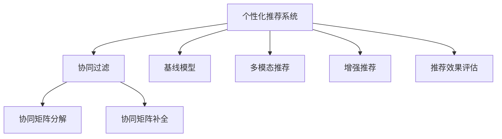

                 

# 搜索引擎的个性化推荐算法

## 1. 背景介绍

### 1.1 问题由来

在信息爆炸的时代，搜索引擎需要高效地从海量数据中找出符合用户需求的网页，但仅仅基于关键词匹配的传统方法已不能满足用户日益增长的个性化需求。为了提高搜索体验，搜索引擎逐渐引入个性化推荐算法，根据用户的历史行为、偏好等信息，动态地调整搜索结果排序，使用户能够快速找到最相关、最感兴趣的内容。

### 1.2 问题核心关键点

个性化推荐的核心在于理解用户的行为模式，预测其可能感兴趣的内容，并在搜索结果中加以排序。这涉及以下几个关键点：

- 用户画像构建：如何通过用户的行为数据（点击、浏览、收藏等）构建精准的用户画像。
- 协同过滤：如何根据用户行为历史和相似用户的行为数据，推荐可能感兴趣的内容。
- 实时推荐：如何实时更新推荐结果，适应用户不断变化的兴趣。
- 多样性和新颖性：如何平衡推荐结果的多样性、新颖性和相关性，避免重复推荐。
- 效果评估：如何客观评估推荐系统的性能，识别改进的方向。

### 1.3 问题研究意义

研究个性化推荐算法，对于提升用户体验，提高搜索引擎的竞争力，具有重要意义：

1. 增强搜索相关性：通过个性化的推荐，提高搜索结果的相关性和准确性，使用户快速找到所需信息。
2. 提升搜索满意度：推荐算法能够理解和满足用户隐性需求，提升用户搜索满意度。
3. 提升点击率和停留时间：个性化推荐可以显著提高网页的点击率和用户的停留时间，从而提升广告收入。
4. 发现新内容：个性化推荐能够帮助用户发现原本可能错过的内容，增加信息的覆盖面。
5. 优化用户体验：通过个性化推荐，可以提供定制化的搜索体验，让用户感到被理解和重视。

## 2. 核心概念与联系

### 2.1 核心概念概述

为了更好地理解个性化推荐算法，本节将介绍几个密切相关的核心概念：

- 个性化推荐系统：利用用户行为数据和外部信息，动态调整搜索结果，提供个性化推荐的系统。
- 协同过滤：基于用户历史行为数据，推断用户偏好，通过相似用户的行为预测目标用户可能感兴趣的内容。
- 协同矩阵分解：将用户行为数据表示为低维矩阵，通过矩阵分解算法发现用户和物品的潜在特征。
- 协同矩阵补全：将稀疏的用户行为数据进行补全，以获取完整的用户-物品互动矩阵。
- 基线模型：如线性模型、矩阵分解模型、深度神经网络等，作为推荐算法的基础模型。
- 多模态推荐：结合文本、图像、视频等多种信息模态，提升推荐结果的丰富性和多样性。
- 增强推荐：通过引入外界的知识、规则，提升推荐结果的精度和可解释性。
- 推荐效果评估：使用精度、召回率、F1-score等指标，评估推荐系统的性能。

这些核心概念之间的逻辑关系可以通过以下Mermaid流程图来展示：



这个流程图展示了个性化推荐系统的核心概念及其之间的关系：

1. 个性化推荐系统利用协同过滤、矩阵分解、多模态推荐等方法，构建用户-物品互动矩阵。
2. 基线模型如线性模型、矩阵分解模型、深度神经网络等，是推荐算法的基础。
3. 协同矩阵补全技术用于处理稀疏数据，获取完整的用户-物品互动矩阵。
4. 增强推荐结合外部知识，提升推荐结果的精度和可解释性。
5. 推荐效果评估指标如精度、召回率、F1-score等，用于衡量推荐系统的性能。

这些概念共同构成了个性化推荐系统的学习和应用框架，使其能够在各种场景下提供高质量的推荐结果。通过理解这些核心概念，我们可以更好地把握个性化推荐算法的原理和优化方向。

## 3. 核心算法原理 & 具体操作步骤
### 3.1 算法原理概述

搜索引擎的个性化推荐算法本质上是将用户行为数据和外部信息结合起来，构建用户画像，并使用推荐算法进行推荐。其核心思想是：通过用户的浏览、点击、收藏等行为，构建一个用户-物品的互动矩阵，并通过协同过滤等技术，预测用户可能感兴趣的内容。

形式化地，假设搜索引擎的个性化推荐系统为 $R$，用户集为 $U$，物品集为 $V$，用户行为数据表示为 $I_{uv} \in \{0,1\}$，其中 $I_{uv}=1$ 表示用户 $u$ 对物品 $v$ 有行为记录。推荐目标是通过用户-物品互动矩阵 $M \in \mathbb{R}^{N \times D}$ 进行推荐，其中 $N$ 为用户数，$D$ 为物品数。推荐算法 $A$ 将 $M$ 映射到推荐结果集合 $\mathcal{R}$。

推荐系统的目标是最小化预测误差：

$$
\min_{A} \sum_{u=1}^N \sum_{v=1}^D \mathbb{I}(I_{uv} \neq A(M_{uv}))
$$

其中 $\mathbb{I}$ 为指示函数，$\mathbb{I}(x)=1$ 当 $x$ 为真，$\mathbb{I}(x)=0$ 当 $x$ 为假。

### 3.2 算法步骤详解

搜索引擎的个性化推荐算法一般包括以下几个关键步骤：

**Step 1: 数据采集与处理**
- 收集用户的历史行为数据，如点击、浏览、收藏等。
- 处理数据以去除噪音、填补缺失，构建用户-物品互动矩阵 $M$。
- 将数据分为训练集和测试集，用于评估算法效果。

**Step 2: 用户画像构建**
- 利用协同过滤、矩阵分解等技术，构建用户画像 $P_u$。
- 通过用户画像 $P_u$，对物品进行评分，计算推荐得分。

**Step 3: 推荐算法选择**
- 选择合适的推荐算法，如基于协同过滤的模型、矩阵分解模型、深度学习模型等。
- 训练推荐算法，优化预测误差。

**Step 4: 实时推荐**
- 对新输入的用户行为数据进行实时处理，更新用户画像。
- 实时计算推荐结果，排序并返回推荐列表。

**Step 5: 效果评估与迭代**
- 使用准确率、召回率、F1-score等指标评估推荐系统性能。
- 根据评估结果调整模型参数，优化推荐结果。

以上是搜索引擎个性化推荐的一般流程。在实际应用中，还需要针对具体任务和数据特点进行优化设计，如引入多模态信息、结合增强推荐、优化推荐结果排序等，以进一步提升推荐效果。

### 3.3 算法优缺点

个性化推荐算法具有以下优点：
1. 用户满意度提升：通过个性化的推荐，提高搜索结果的相关性和准确性，提升用户满意度。
2. 提升点击率和停留时间：推荐算法能够理解和满足用户隐性需求，提高网页的点击率和用户的停留时间。
3. 发现新内容：个性化推荐能够帮助用户发现原本可能错过的内容，增加信息的覆盖面。

同时，该算法也存在一定的局限性：
1. 数据隐私问题：收集和处理用户行为数据时可能涉及到隐私问题，需注意数据保护和用户隐私。
2. 冷启动问题：对于新用户，由于缺乏历史行为数据，推荐系统难以给出准确的推荐。
3. 推荐多样性不足：个性化推荐算法倾向于推荐与用户历史行为相似的内容，导致推荐结果多样性不足。
4. 推荐结果的可解释性：推荐算法通常是黑盒模型，难以解释其内部决策逻辑。
5. 动态变化的用户兴趣：用户兴趣可能会随时间变化，静态推荐模型可能无法适应。

尽管存在这些局限性，但就目前而言，个性化推荐算法仍然是搜索引擎推荐系统中最为成熟和有效的技术。未来相关研究的重点在于如何进一步降低数据隐私风险，提升推荐结果的多样性，同时兼顾可解释性和动态性等因素。

### 3.4 算法应用领域

个性化推荐算法在搜索引擎中主要应用于以下几个领域：

- 网页推荐：根据用户的浏览、点击行为，推荐可能感兴趣的相关网页。
- 搜索建议：根据用户的搜索词，推荐可能相关的其他搜索词。
- 广告定向：根据用户的兴趣和行为，定向展示广告内容。
- 个性化搜索结果排序：结合搜索词、用户画像、历史行为等，动态调整搜索结果排序。
- 动态内容展示：根据用户的行为数据，动态调整搜索结果中的内容展示方式。

除了搜索引擎外，个性化推荐算法还被广泛应用于电商、新闻、视频等多个领域，如推荐商品、新闻、视频等。随着推荐技术的发展，个性化推荐将成为多个行业数字化转型的重要手段，极大地提升用户体验和业务价值。

## 4. 数学模型和公式 & 详细讲解 & 举例说明
### 4.1 数学模型构建

本节将使用数学语言对搜索引擎个性化推荐算法进行更加严格的刻画。

假设搜索引擎的个性化推荐系统为 $R$，用户集为 $U$，物品集为 $V$，用户行为数据表示为 $I_{uv} \in \{0,1\}$，其中 $I_{uv}=1$ 表示用户 $u$ 对物品 $v$ 有行为记录。推荐目标是通过用户-物品互动矩阵 $M \in \mathbb{R}^{N \times D}$ 进行推荐，其中 $N$ 为用户数，$D$ 为物品数。推荐算法 $A$ 将 $M$ 映射到推荐结果集合 $\mathcal{R}$。

推荐系统的目标是最小化预测误差：

$$
\min_{A} \sum_{u=1}^N \sum_{v=1}^D \mathbb{I}(I_{uv} \neq A(M_{uv}))
$$

在实践中，我们通常使用基于梯度的优化算法（如SGD、Adam等）来近似求解上述最优化问题。设 $\eta$ 为学习率，则参数的更新公式为：

$$
\theta \leftarrow \theta - \eta \nabla_{\theta}\mathcal{L}(\theta)
$$

其中 $\nabla_{\theta}\mathcal{L}(\theta)$ 为损失函数对参数 $\theta$ 的梯度，可通过反向传播算法高效计算。

### 4.2 公式推导过程

以下我们以基于协同过滤的模型为例，推导推荐算法中的评分函数和优化公式。

假设协同过滤模型将用户-物品互动矩阵 $M$ 分解为用户矩阵 $U$ 和物品矩阵 $V$，即 $M=UV^T$。则推荐算法 $A$ 的评分函数为：

$$
f_{uv} = u^Tv
$$

其中 $u$ 和 $v$ 分别为用户 $u$ 和物品 $v$ 的潜在特征向量。

为了最小化预测误差，我们需要最大化评分函数 $f_{uv}$ 与实际行为 $I_{uv}$ 的匹配度。因此，优化目标为：

$$
\min_{u,v} \sum_{u=1}^N \sum_{v=1}^D \mathbb{I}(I_{uv} \neq u^Tv)
$$

为了求解该优化问题，我们使用矩阵分解技术将 $U$ 和 $V$ 表示为低秩矩阵：

$$
U = W_U \Sigma_U V_U^T, V = W_V \Sigma_V V_V^T
$$

其中 $W_U$ 和 $W_V$ 为投影矩阵，$\Sigma_U$ 和 $\Sigma_V$ 为低秩矩阵。

通过矩阵乘法，可以得到推荐算法 $A$ 的评分函数：

$$
f_{uv} = u^Tv = (W_U \Sigma_U V_U^T)(W_V \Sigma_V V_V^T) v = (\Sigma_U V_U^T)(\Sigma_V V_V^T) v
$$

进一步简化，可以得到优化目标：

$$
\min_{W_U, W_V, \Sigma_U, \Sigma_V} \sum_{u=1}^N \sum_{v=1}^D \mathbb{I}(I_{uv} \neq (\Sigma_U V_U^T)(\Sigma_V V_V^T) v)
$$

通过求解该优化问题，可以得到用户和物品的潜在特征向量 $u$ 和 $v$，进而得到评分函数 $f_{uv}$ 的优化值。

### 4.3 案例分析与讲解

为了更好地理解搜索引擎的个性化推荐算法，下面以一个具体的案例进行分析。

假设用户 $u$ 有行为记录 $M_{uv}=1$ 表示用户对物品 $v$ 感兴趣，$M_{uv}=0$ 表示不感兴趣。推荐系统需要对物品 $v$ 进行评分，排序推荐给用户。

协同过滤模型的评分函数为：

$$
f_{uv} = u^Tv
$$

假设用户矩阵 $U$ 和物品矩阵 $V$ 分解后的低秩矩阵为：

$$
U = \begin{bmatrix} 0.8 & 0.1 \\ 0.2 & 0.7 \end{bmatrix}, V = \begin{bmatrix} 0.3 & 0.2 \\ 0.1 & 0.4 \end{bmatrix}
$$

则物品 $v=2$ 的评分函数为：

$$
f_{u2} = (U)_{12} (V)_{21} = 0.1 \times 0.4 = 0.04
$$

这意味着物品 $v=2$ 可能对用户 $u$ 的评分较低，推荐系统不会将其推荐给用户 $u$。

通过以上案例分析，可以看到协同过滤模型的评分函数能够根据用户和物品的潜在特征向量，预测用户对物品的评分。而优化算法通过最小化预测误差，进一步提升评分函数的精度，从而提供高质量的推荐结果。

## 5. 项目实践：代码实例和详细解释说明
### 5.1 开发环境搭建

在进行推荐系统开发前，我们需要准备好开发环境。以下是使用Python进行TensorFlow开发的环境配置流程：

1. 安装Anaconda：从官网下载并安装Anaconda，用于创建独立的Python环境。

2. 创建并激活虚拟环境：
```bash
conda create -n tf-env python=3.8 
conda activate tf-env
```

3. 安装TensorFlow：根据CUDA版本，从官网获取对应的安装命令。例如：
```bash
pip install tensorflow==2.4
```

4. 安装各类工具包：
```bash
pip install numpy pandas scikit-learn matplotlib tqdm jupyter notebook ipython
```

完成上述步骤后，即可在`tf-env`环境中开始推荐系统开发。

### 5.2 源代码详细实现

下面我们以协同过滤的矩阵分解为例，给出使用TensorFlow对推荐系统进行开发的PyTorch代码实现。

首先，定义推荐系统中的矩阵分解函数：

```python
import tensorflow as tf

def matrix_factorization(X, num_factors=5, num_epochs=10, learning_rate=0.01):
    N, D = X.shape
    U = tf.Variable(tf.random.normal([N, num_factors]))
    V = tf.Variable(tf.random.normal([D, num_factors]))
    X_pred = tf.matmul(U, V, transpose_b=True)
    
    loss = tf.reduce_mean(tf.square(X_pred - X))
    optimizer = tf.keras.optimizers.Adam(learning_rate)
    for epoch in range(num_epochs):
        with tf.GradientTape() as tape:
            loss = loss
        gradients = tape.gradient(loss, [U, V])
        optimizer.apply_gradients(zip(gradients, [U, V]))
        if epoch % 1 == 0:
            print(f'Epoch {epoch+1}, Loss: {loss.numpy()}')
    return U, V
```

然后，加载推荐数据集并进行矩阵分解：

```python
import numpy as np

X = np.array([[1, 1, 1, 0, 0],
              [1, 0, 1, 1, 0],
              [0, 1, 1, 0, 1],
              [0, 1, 0, 1, 1],
              [1, 0, 0, 0, 1]])
U, V = matrix_factorization(X, num_epochs=10)
```

接着，进行推荐排序：

```python
# 计算推荐评分
X_pred = tf.matmul(U, V, transpose_b=True)

# 排序推荐结果
sort_indices = np.argsort(X_pred.numpy())[:, ::-1]
recommendations = X_pred.numpy()[:, sort_indices]
print(recommendations)
```

最后，将推荐结果可视化：

```python
import matplotlib.pyplot as plt

plt.bar(range(len(X)), recommendations)
plt.show()
```

以上就是使用TensorFlow对协同过滤推荐系统进行开发的完整代码实现。可以看到，TensorFlow的Keras API提供了丰富的优化器和损失函数，使得推荐系统模型开发变得简单高效。

### 5.3 代码解读与分析

让我们再详细解读一下关键代码的实现细节：

**matrix_factorization函数**：
- `X` 为输入的推荐矩阵。
- `num_factors` 为分解后的潜在特征维度。
- `num_epochs` 为模型训练的轮数。
- `learning_rate` 为优化器的学习率。
- 函数中定义了用户矩阵 `U` 和物品矩阵 `V`，通过矩阵乘法得到预测评分矩阵 `X_pred`。
- 定义了损失函数为均方误差，使用Adam优化器进行训练。
- 每轮训练输出损失值，用于调试和监控。

**加载推荐数据集**：
- `X` 为示例推荐矩阵，表示用户对物品的行为记录。
- 使用`matrix_factorization`函数进行矩阵分解。

**推荐排序**：
- 通过计算预测评分矩阵 `X_pred`，得到推荐得分。
- 使用`np.argsort`函数对推荐得分排序，获得推荐顺序。
- 使用`numpy`数组，输出推荐结果。

**可视化推荐结果**：
- 使用`matplotlib`库，将推荐结果可视化。

可以看到，TensorFlow的Keras API使得推荐系统的开发和训练变得简单便捷。开发者可以专注于模型设计、参数调优等高层逻辑，而不必过多关注底层的实现细节。

当然，工业级的系统实现还需考虑更多因素，如推荐模型的实时性、扩展性、可解释性等。但核心的推荐算法基本与此类似。

## 6. 实际应用场景
### 6.1 电商推荐

基于协同过滤的个性化推荐系统，在电商领域已经得到了广泛的应用。电商网站需要向用户推荐商品，以提高用户购买率、增加销售额。推荐系统通过分析用户的历史购买行为和浏览记录，结合物品的特征信息，动态调整推荐列表，使用户能够快速找到心仪的商品。

在技术实现上，可以收集用户的浏览、点击、购买等行为数据，将物品的特征（如品牌、价格、类别等）作为输入，构建用户-物品互动矩阵，并使用协同过滤算法进行推荐。推荐系统还需要定期更新模型，以适应用户兴趣的变化，确保推荐结果的实时性和相关性。

### 6.2 新闻推荐

新闻网站和聚合平台需要为用户推荐感兴趣的新闻内容，以提高用户留存率和点击率。推荐系统通过分析用户的历史阅读行为，结合新闻的标签、作者、时间等信息，动态调整推荐列表，使用户能够快速获取有价值的信息。

在技术实现上，可以收集用户的点击、浏览、收藏等行为数据，将新闻的标签和内容作为输入，构建用户-新闻互动矩阵，并使用协同过滤算法进行推荐。推荐系统还需要实时更新模型，以适应用户兴趣的变化，确保推荐结果的实时性和相关性。

### 6.3 视频推荐

视频平台需要为用户推荐感兴趣的视频内容，以提高用户观看率和平台粘性。推荐系统通过分析用户的观看行为，结合视频的标签、时长、播放量等信息，动态调整推荐列表，使用户能够快速获取有价值的视频内容。

在技术实现上，可以收集用户的观看、点赞、分享等行为数据，将视频的标签和内容作为输入，构建用户-视频互动矩阵，并使用协同过滤算法进行推荐。推荐系统还需要实时更新模型，以适应用户兴趣的变化，确保推荐结果的实时性和相关性。

### 6.4 未来应用展望

随着个性化推荐技术的发展，推荐系统将在更多领域得到应用，为传统行业数字化转型升级提供新的技术路径。

在智慧医疗领域，基于个性化推荐系统的智能诊疗系统能够根据患者的病史和症状，推荐适合的医疗方案和专家。在智能教育领域，个性化推荐系统能够根据学生的学习习惯和兴趣，推荐合适的学习资源和课程，提高学习效率和效果。

在智慧城市治理中，个性化推荐系统能够根据用户的出行习惯和需求，推荐最优的交通路径和出行方式，提升城市的智能化管理水平。在智能制造领域，个性化推荐系统能够根据设备的运行状态和维护记录，推荐适合的维护方案和备件，降低设备故障率，提高生产效率。

除了以上行业外，个性化推荐技术还将应用于更多场景，如智能家居、智慧旅游、智慧办公等，为各行各业带来数字化、智能化的新变革。

## 7. 工具和资源推荐
### 7.1 学习资源推荐

为了帮助开发者系统掌握推荐算法的理论基础和实践技巧，这里推荐一些优质的学习资源：

1. 《推荐系统实战》系列博文：由推荐系统专家撰写，深入浅出地介绍了推荐算法的原理、应用和优化技巧。

2. CS229《机器学习》课程：斯坦福大学开设的机器学习明星课程，涵盖了推荐系统在内的众多经典算法。

3. 《机器学习实战》书籍：该书介绍了推荐系统、协同过滤等经典推荐算法，并提供了大量示例代码。

4. KDD Cup 2021推荐系统竞赛数据集：包含用户行为数据和物品信息，是推荐系统竞赛的优秀数据集，适合实战练习。

5. TensorFlow官方文档：TensorFlow的官方文档提供了丰富的推荐系统示例和API接口，是学习推荐算法的必备资料。

通过对这些资源的学习实践，相信你一定能够快速掌握推荐算法的精髓，并用于解决实际的推荐问题。

### 7.2 开发工具推荐

高效的开发离不开优秀的工具支持。以下是几款用于推荐系统开发的常用工具：

1. TensorFlow：由Google主导开发的深度学习框架，生产部署方便，适合大规模工程应用。

2. PyTorch：基于Python的开源深度学习框架，灵活动态的计算图，适合快速迭代研究。

3. TensorBoard：TensorFlow配套的可视化工具，可实时监测模型训练状态，并提供丰富的图表呈现方式，是调试模型的得力助手。

4. Weights & Biases：模型训练的实验跟踪工具，可以记录和可视化模型训练过程中的各项指标，方便对比和调优。

5. Jupyter Notebook：开源的交互式编程环境，支持多种编程语言和数据可视化，是进行推荐算法研究和开发的理想工具。

合理利用这些工具，可以显著提升推荐系统的开发效率，加快创新迭代的步伐。

### 7.3 相关论文推荐

推荐系统的发展源于学界的持续研究。以下是几篇奠基性的相关论文，推荐阅读：

1. Context-aware Matrix Factorization for Recommendations（CTR预训练论文）：提出基于上下文信息的矩阵分解算法，提升了推荐系统的精度和可解释性。

2. Deep Collaborative Filtering（深度协同过滤论文）：提出使用深度神经网络进行协同过滤，提升了推荐系统的表现力和适应性。

3. CoRR: Co-regularized Recommender Systems（协同正则化推荐系统）：提出协同正则化算法，提升了推荐系统的多样性和泛化能力。

4. Pairwise Ranking: The Future of Recommender Systems（Pairwise排名推荐系统）：提出基于Pairwise排名损失函数的推荐算法，提升了推荐系统的精度和鲁棒性。

5. A Random Walk Model for Recommender Systems（随机游走推荐系统）：提出基于随机游走的推荐算法，提升了推荐系统的网络结构。

这些论文代表了大推荐系统的发展脉络。通过学习这些前沿成果，可以帮助研究者把握学科前进方向，激发更多的创新灵感。

## 8. 总结：未来发展趋势与挑战

### 8.1 总结

本文对搜索引擎的个性化推荐算法进行了全面系统的介绍。首先阐述了推荐算法的背景和意义，明确了个性化推荐系统的作用和目标。其次，从原理到实践，详细讲解了协同过滤算法的基本原理和具体操作步骤，给出了推荐系统开发的完整代码实现。同时，本文还广泛探讨了推荐算法在电商、新闻、视频等多个领域的应用前景，展示了推荐系统的广阔应用空间。最后，本文精选了推荐算法的各类学习资源，力求为读者提供全方位的技术指引。

通过本文的系统梳理，可以看到，基于协同过滤的个性化推荐算法已经广泛应用于搜索引擎中，成为提升搜索体验的重要手段。未来随着推荐技术的发展，个性化推荐系统将在更多领域得到应用，为传统行业带来数字化、智能化的新变革。

### 8.2 未来发展趋势

展望未来，推荐系统的个性化推荐算法将呈现以下几个发展趋势：

1. 数据来源多元化。推荐系统将利用更多的数据源，如社交网络、GPS位置、搜索历史等，获取更全面的用户信息，提升推荐结果的精准度。

2. 多模态推荐。结合文本、图像、视频等多种信息模态，提升推荐结果的丰富性和多样性。

3. 实时推荐。实时更新推荐模型，适应用户兴趣的变化，提升推荐结果的实时性。

4. 可解释性和可控性。推荐系统将通过引入更多的先验知识，提升推荐结果的可解释性和可控性，帮助用户理解推荐逻辑。

5. 动态推荐。动态调整推荐策略，如引入动态卷积、自适应学习等方法，提升推荐系统的适应性和灵活性。

6. 自动化推荐。通过自动化推荐算法，如强化学习、进化算法等，实现推荐策略的自适应优化，提升推荐系统的效率和效果。

以上趋势凸显了推荐算法的技术进步和应用潜力的不断提升。这些方向的探索发展，必将进一步提升推荐系统的性能和应用范围，为各行各业带来更多的创新和发展机遇。

### 8.3 面临的挑战

尽管个性化推荐技术已经取得了显著成就，但在迈向更加智能化、普适化应用的过程中，它仍面临诸多挑战：

1. 数据隐私问题。收集和处理用户行为数据时可能涉及到隐私问题，需注意数据保护和用户隐私。

2. 推荐冷启动问题。对于新用户，由于缺乏历史行为数据，推荐系统难以给出准确的推荐。

3. 推荐多样性不足。个性化推荐算法倾向于推荐与用户历史行为相似的内容，导致推荐结果多样性不足。

4. 推荐结果的可解释性。推荐算法通常是黑盒模型，难以解释其内部决策逻辑。

5. 动态变化的用户兴趣。用户兴趣可能会随时间变化，静态推荐模型可能无法适应。

尽管存在这些挑战，但通过不断地技术创新和优化，推荐系统有望在未来得到更好的发展。

### 8.4 研究展望

未来推荐系统需要在以下几个方向进行深入研究：

1. 探索无监督和半监督推荐方法。摆脱对大规模标注数据的依赖，利用自监督学习、主动学习等无监督和半监督范式，最大限度利用非结构化数据。

2. 研究参数高效和计算高效的推荐范式。开发更加参数高效的推荐方法，在固定大部分预训练参数的情况下，只更新极少量的任务相关参数。

3. 融合因果和对比学习范式。通过引入因果推断和对比学习思想，增强推荐模型建立稳定因果关系的能力，学习更加普适、鲁棒的语言表征。

4. 引入更多先验知识。将符号化的先验知识，如知识图谱、逻辑规则等，与神经网络模型进行巧妙融合，引导推荐过程学习更准确、合理的语言模型。

5. 结合因果分析和博弈论工具。将因果分析方法引入推荐模型，识别出模型决策的关键特征，增强输出解释的因果性和逻辑性。借助博弈论工具刻画人机交互过程，主动探索并规避模型的脆弱点，提高系统稳定性。

6. 纳入伦理道德约束。在模型训练目标中引入伦理导向的评估指标，过滤和惩罚有偏见、有害的输出倾向。加强人工干预和审核，建立模型行为的监管机制，确保输出符合人类价值观和伦理道德。

这些研究方向代表了推荐算法的未来趋势，将有助于进一步提升推荐系统的性能和应用范围，为各行各业带来更多的创新和发展机遇。

## 9. 附录：常见问题与解答

**Q1：个性化推荐算法是否适用于所有领域？**

A: 个性化推荐算法在电子商务、新闻、视频等多个领域中已经取得了广泛的应用，提升了用户的体验和业务的收入。但对于一些特定领域，如医疗、教育等，推荐系统的应用还需要更多的研究和优化。

**Q2：个性化推荐算法是否需要大规模数据支持？**

A: 个性化推荐算法需要用户行为数据和物品特征数据来构建推荐模型。大规模数据是推荐系统高性能的基础，但并不意味着数据量越大越好。推荐系统可以根据数据规模的不同，选择不同的算法模型，如基于矩阵分解的模型适用于数据规模较小的应用，而深度神经网络模型适用于数据规模较大的应用。

**Q3：推荐算法中的参数高效方法有哪些？**

A: 推荐算法中的参数高效方法包括但不限于：
1. 矩阵分解：将用户-物品矩阵分解为低秩矩阵，减少需要优化的参数量。
2. 矩阵补全：将稀疏的推荐矩阵补全为完整的矩阵，提高模型的表示能力。
3. 自适应推荐：动态调整推荐策略，提高推荐的个性化和多样性。
4. 强化学习：通过强化学习算法，优化推荐策略，提升推荐效果。

**Q4：推荐算法中的多模态信息指的是什么？**

A: 推荐算法中的多模态信息指的是结合文本、图像、视频等多种信息模态，提升推荐结果的丰富性和多样性。例如，结合用户浏览网页的文本内容和网页的图像特征，进行推荐排序。

**Q5：推荐算法中的基线模型包括哪些？**

A: 推荐算法中的基线模型包括但不限于：
1. 矩阵分解模型：如SVD、ALS等，通过矩阵分解技术，提升推荐效果。
2. 协同过滤模型：基于用户-物品互动矩阵，进行推荐排序。
3. 深度学习模型：如FM、MLP、RNN等，通过神经网络模型，提升推荐效果。

这些基线模型为推荐系统提供了不同的实现方式，可以根据具体应用场景选择适合的方法。

