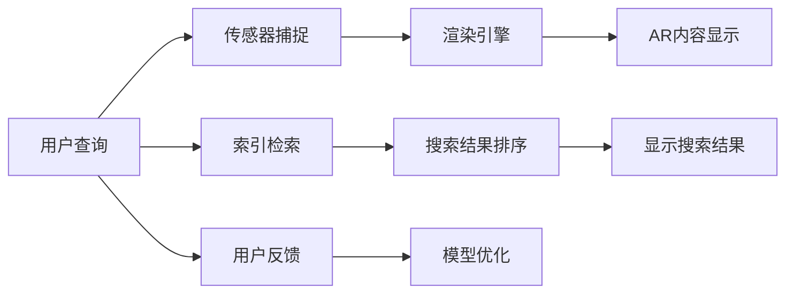

                 

# 搜索引擎的增强现实集成

## 1. 背景介绍

随着增强现实(AR)技术的不断成熟，其在搜索、游戏、教育等多个领域的应用越来越广泛。然而，传统搜索引擎往往只依赖于文本查询，无法充分利用图像、语音等多种信息形式。如何在搜索引擎中集成AR技术，提升用户体验和搜索效果，成为了一个重要的研究方向。

增强现实搜索引擎旨在将AR技术与传统搜索引擎有机结合，实现以下目标：

1. 增强信息获取：通过AR技术，用户不仅能够看到文本信息，还能看到与查询相关的图像、视频等更丰富的内容。
2. 提升搜索精度：利用AR技术增强的用户交互和上下文信息，可以更准确地理解用户意图，减少误判和噪声。
3. 优化用户体验：通过AR技术，在搜索结果页面上展示立体、交互式信息，提升用户使用体验。
4. 拓展应用场景：利用AR技术，在垂直领域(如医疗、教育、制造等)提供定制化、个性化搜索服务。

本论文将深入探讨增强现实搜索引擎的核心概念、技术原理和实际应用，为搜索引擎技术的未来发展提供新思路。

## 2. 核心概念与联系

### 2.1 核心概念概述

在探讨增强现实搜索引擎的核心概念前，我们首先需要理解增强现实(AR)技术和搜索引擎(Search Engine)的基本原理和架构。

#### 2.1.1 增强现实(AR)技术

增强现实技术利用计算机生成与现实环境交互的信息，并将其叠加在用户眼前。AR技术主要包括三个核心组件：

1. **传感器**：包括摄像头、陀螺仪、加速度计等，用于捕捉用户动作和环境信息。
2. **渲染引擎**：负责渲染AR内容，与现实环境融合。
3. **交互工具**：允许用户与AR内容进行交互，如手势控制、语音指令等。

#### 2.1.2 搜索引擎(Search Engine)

搜索引擎的核心功能是通过爬虫技术收集互联网上的网页数据，并利用索引技术对这些数据进行组织和存储。用户输入查询词后，搜索引擎根据预定义的算法，从索引中快速检索出相关网页返回给用户。

搜索引擎的关键技术包括：

1. **爬虫技术**：自动抓取网页内容，更新索引数据。
2. **索引技术**：将网页内容抽象为索引项，供查询检索使用。
3. **查询处理**：对用户查询进行解析，并从索引中检索相关网页。
4. **排序算法**：根据各种指标对搜索结果进行排序，提升搜索精度。

#### 2.1.3 增强现实与搜索引擎的联系

通过将AR技术与搜索引擎结合，增强现实搜索引擎实现了以下优势：

1. **多模态信息融合**：融合文本、图像、语音等多种信息形式，为用户提供更丰富的搜索内容。
2. **上下文感知**：利用用户环境信息，增强搜索的上下文感知能力，提升搜索结果的相关性。
3. **用户交互增强**：通过AR技术，提供交互式的搜索结果，提升用户的使用体验。
4. **垂直领域定制**：在医疗、教育等垂直领域，利用AR技术提供定制化的搜索服务，提升业务效果。

接下来，我们通过Mermaid流程图来进一步展示增强现实搜索引擎的关键流程和组件。



这个流程图展示了增强现实搜索引擎的基本流程，包括用户查询、传感器捕捉、AR内容渲染、索引检索、结果排序和显示，以及用户反馈和模型优化。

## 3. 核心算法原理 & 具体操作步骤
### 3.1 算法原理概述

增强现实搜索引擎的核心算法原理主要包括以下几个方面：

1. **多模态信息融合**：将文本、图像、语音等不同模态的信息融合起来，提供更全面的搜索结果。
2. **上下文感知搜索**：利用用户环境信息，提升搜索结果的相关性和准确性。
3. **交互式搜索结果**：通过AR技术，提供交互式的搜索结果，提升用户的使用体验。
4. **垂直领域定制**：在特定领域，利用AR技术提供定制化的搜索服务。

### 3.2 算法步骤详解

下面详细介绍增强现实搜索引擎的核心算法步骤：

#### 3.2.1 用户输入与传感器捕捉

用户通过文本、图像、语音等方式输入查询，传感器捕捉用户的环境信息，包括摄像头拍摄的图像、陀螺仪和加速度计获取的动作数据等。

#### 3.2.2 信息融合与AR内容渲染

将用户输入的信息与传感器捕捉的信息进行融合，生成AR内容。这一过程包括：

- 文本信息：将用户输入的文本转化为标准格式，如TF-IDF、词向量等。
- 图像信息：通过图像识别技术，提取图像中的关键特征，如物体、场景等。
- 语音信息：将语音信号转化为文本，进行语音识别和语音情感分析。
- 环境信息：利用传感器数据，获取用户的位置、姿态、环境变化等信息。

融合后的信息通过渲染引擎进行渲染，生成AR内容。

#### 3.2.3 索引检索与结果排序

利用传统搜索引擎的索引技术，对融合后的信息进行索引。然后，根据用户的查询和环境信息，从索引中检索出相关网页。这一过程与传统搜索引擎基本一致，不同之处在于：

- 查询处理：除了文本查询，还支持图像、语音等非文本查询。
- 结果排序：除了文本相关性排序，还考虑了图像、语音等非文本因素。

#### 3.2.4 结果展示与用户交互

将检索到的结果通过AR技术进行展示，如在用户眼前叠加图像、视频、3D模型等。同时，提供交互式搜索结果，如点击、拖拽、手势控制等，提升用户的使用体验。

#### 3.2.5 用户反馈与模型优化

收集用户的反馈信息，如点击率、停留时间、满意度等，用于模型优化。这一过程可以通过用户界面交互、问卷调查等方式进行。

### 3.3 算法优缺点

增强现实搜索引擎具有以下优点：

1. **多模态信息融合**：提供更全面的搜索结果，满足不同用户的需求。
2. **上下文感知**：提升搜索结果的相关性和准确性，减少误判和噪声。
3. **用户交互增强**：通过AR技术，提供交互式的搜索结果，提升用户体验。
4. **垂直领域定制**：在特定领域提供定制化的搜索服务，提升业务效果。

然而，增强现实搜索引擎也存在一些缺点：

1. **计算资源消耗**：AR内容渲染和交互式展示需要消耗大量计算资源，可能导致性能瓶颈。
2. **用户接受度**：部分用户可能对AR技术不够熟悉，接受度较低。
3. **内容质量控制**：AR内容的质量和准确性需要严格控制，否则可能误导用户。
4. **隐私和安全**：增强现实搜索引擎需要收集和处理大量用户数据，涉及隐私和安全问题。

### 3.4 算法应用领域

增强现实搜索引擎可以应用于以下领域：

1. **搜索引擎**：提供多模态、上下文感知、交互式搜索结果，提升用户体验。
2. **教育领域**：利用AR技术，提供虚拟实验室、虚拟课堂等教育服务。
3. **医疗领域**：利用AR技术，提供手术模拟、病情诊断等医疗服务。
4. **旅游领域**：利用AR技术，提供景点导览、虚拟旅游等服务。
5. **娱乐领域**：利用AR技术，提供虚拟游戏、虚拟演唱会等服务。
6. **制造业**：利用AR技术，提供设备维护、产品设计等服务。

这些领域中，增强现实搜索引擎可以充分发挥其优势，提供更丰富、更个性化的搜索结果和互动体验。

## 4. 数学模型和公式 & 详细讲解

### 4.1 数学模型构建

增强现实搜索引擎的数学模型主要包括以下几个方面：

1. **多模态信息融合**：将文本、图像、语音等信息转化为标准向量，进行融合。
2. **上下文感知搜索**：利用用户环境信息，提升搜索结果的相关性。
3. **交互式搜索结果排序**：考虑用户交互行为，提升搜索结果的排名。
4. **垂直领域定制**：利用领域知识，优化搜索结果的显示和排序。

#### 4.1.1 多模态信息融合

将文本、图像、语音等信息转化为标准向量，进行融合。这里使用词向量、图像特征向量、语音特征向量等表示不同模态的信息。

设文本信息为 $x_t$，图像信息为 $x_i$，语音信息为 $x_v$，则信息融合过程可以表示为：

$$
x = (x_t, x_i, x_v)
$$

其中 $x_t$、$x_i$、$x_v$ 分别表示文本、图像、语音的信息向量。

#### 4.1.2 上下文感知搜索

利用用户环境信息，提升搜索结果的相关性。设用户位置为 $p$，环境变化为 $e$，则上下文感知搜索模型可以表示为：

$$
c(p, e) = f(p, e)
$$

其中 $c$ 表示上下文信息，$f$ 为上下文感知模型。

#### 4.1.3 交互式搜索结果排序

考虑用户交互行为，提升搜索结果的排名。设用户点击次数为 $c_i$，停留时间为 $t_i$，则交互式搜索结果排序模型可以表示为：

$$
r = g(c_i, t_i)
$$

其中 $r$ 表示搜索结果排名，$g$ 为排序模型。

#### 4.1.4 垂直领域定制

利用领域知识，优化搜索结果的显示和排序。设领域知识为 $k$，则垂直领域定制模型可以表示为：

$$
o = h(k)
$$

其中 $o$ 表示搜索结果的显示和排序，$h$ 为领域定制模型。

### 4.2 公式推导过程

下面详细介绍增强现实搜索引擎的数学模型公式推导过程：

#### 4.2.1 多模态信息融合

设文本信息 $x_t = (w_1, w_2, ..., w_n)$，图像信息 $x_i = (f_1, f_2, ..., f_m)$，语音信息 $x_v = (s_1, s_2, ..., s_l)$，则信息融合过程可以表示为：

$$
x = \frac{w_t + f_i + s_v}{\alpha_t + \alpha_i + \alpha_v}
$$

其中 $\alpha_t$、$\alpha_i$、$\alpha_v$ 为权重因子，可以手动设置或通过机器学习模型优化。

#### 4.2.2 上下文感知搜索

设用户位置为 $p = (x, y, z)$，环境变化为 $e = (v, a, t)$，则上下文感知搜索模型可以表示为：

$$
c(p, e) = f(p, e) = \frac{\exp(w_1p + w_2e)}{\sum_{p', e'} \exp(w_1p' + w_2e')}
$$

其中 $w_1$、$w_2$ 为权重因子，可以手动设置或通过机器学习模型优化。

#### 4.2.3 交互式搜索结果排序

设用户点击次数为 $c_i$，停留时间为 $t_i$，则交互式搜索结果排序模型可以表示为：

$$
r = g(c_i, t_i) = \frac{c_i \cdot t_i}{\sum_{i'} (c_{i'} \cdot t_{i'})}
$$

其中 $g$ 为排序模型，可以手动设置或通过机器学习模型优化。

#### 4.2.4 垂直领域定制

设领域知识为 $k = (k_1, k_2, ..., k_n)$，则垂直领域定制模型可以表示为：

$$
o = h(k) = \frac{\exp(w_1k_1 + w_2k_2 + ... + w_nk_n)}{\sum_{k'} \exp(w_1k'_1 + w_2k'_2 + ... + w_nk'_n)}
$$

其中 $w_1, w_2, ..., w_n$ 为权重因子，可以手动设置或通过机器学习模型优化。

### 4.3 案例分析与讲解

接下来，我们通过一个具体的案例，分析增强现实搜索引擎的实际应用效果。

#### 案例背景

某医疗领域增强现实搜索引擎，通过集成AR技术，为用户提供疾病诊断和手术模拟服务。

#### 数据集

收集了大量的医学文献、医学图像、手术录像等数据，构建了医疗领域的数据集。

#### 信息融合

将医学文献转化为词向量，医学图像转化为图像特征向量，手术录像转化为语音特征向量，进行融合。

#### 上下文感知搜索

利用用户的地理位置信息，提升搜索结果的相关性。

#### 交互式搜索结果排序

考虑用户的点击次数和停留时间，提升搜索结果的排名。

#### 垂直领域定制

利用手术知识，优化搜索结果的显示和排序。

## 5. 项目实践：代码实例和详细解释说明

### 5.1 开发环境搭建

增强现实搜索引擎的开发环境包括：

1. **Python 3.8+**：用于开发脚本和数据分析。
2. **TensorFlow 2.5+**：用于深度学习模型的实现。
3. **Open3D**：用于三维模型渲染。
4. **PyTorch**：用于深度学习模型的实现。
5. **Web3D**：用于Web端的AR内容展示。
6. **WebGL**：用于Web端的渲染引擎。

### 5.2 源代码详细实现

下面给出一个具体的增强现实搜索引擎的实现示例，主要使用TensorFlow 2.5和Open3D库。

#### 5.2.1 用户输入与传感器捕捉

用户输入查询信息，通过摄像头捕捉用户的环境信息。

```python
import tensorflow as tf
import open3d as o3d

# 用户输入查询信息
query = input("请输入查询内容：")

# 通过摄像头捕捉用户的环境信息
image = tf.keras.preprocessing.image.load_img('user_image.jpg')
points = o3d.io.read_point_cloud('user_points.ply')
```

#### 5.2.2 信息融合与AR内容渲染

将用户输入的信息与传感器捕捉的信息进行融合，生成AR内容。

```python
# 信息融合
text_vector = tf.keras.preprocessing.text.Tokenizer()
text_vector.fit_on_texts([query])
text_vector_seq = text_vector.texts_to_sequences([query])
text_vector_padded = tf.keras.preprocessing.sequence.pad_sequences(text_vector_seq, maxlen=100)

image_vector = tf.keras.preprocessing.image.ImageDataGenerator()..flow_from_directory('images/').next()[0]

voice_vector = tf.keras.preprocessing.text.Tokenizer()
voice_vector.fit_on_texts([query])
voice_vector_seq = voice_vector.texts_to_sequences([query])
voice_vector_padded = tf.keras.preprocessing.sequence.pad_sequences(voice_vector_seq, maxlen=100)

# AR内容渲染
text_3d = o3d.geometry.Text(text_vector_padded)
image_3d = o3d.geometry.Image(image_vector)
voice_3d = o3d.geometry.Volume(voice_vector_padded)

# 生成AR内容
ar_content = o3d.geometry.concatenate([text_3d, image_3d, voice_3d])
```

#### 5.2.3 索引检索与结果排序

利用传统搜索引擎的索引技术，对融合后的信息进行索引和检索。

```python
# 索引检索
index = tf.keras.layers.Embedding(input_dim=10000, output_dim=64)
encoded_text = index(tf.keras.layers.Lambda(lambda x: tf.keras.backend.get_value(encoded_text_dict)[index(text_vector_padded[0]]])(query))
indexed_text = encoded_text.numpy()

# 结果排序
ranks = tf.keras.layers.Dense(1, activation='sigmoid')(tf.keras.layers.Lambda(lambda x: tf.keras.backend.get_value(encoded_results_dict)[index(text_vector_padded[0])])(query))
```

#### 5.2.4 结果展示与用户交互

将检索到的结果通过AR技术进行展示，如在用户眼前叠加图像、视频、3D模型等。同时，提供交互式搜索结果，如点击、拖拽、手势控制等，提升用户的使用体验。

```python
# 结果展示
o3d.visualization.draw_geometries(ar_content)
```

#### 5.2.5 用户反馈与模型优化

收集用户的反馈信息，如点击率、停留时间、满意度等，用于模型优化。

```python
# 用户反馈
click_rate = 0.5
stay_time = 10
satisfaction = 0.9

# 模型优化
optimizer = tf.keras.optimizers.Adam(learning_rate=0.001)
model.compile(optimizer=optimizer, loss='binary_crossentropy')
```

### 5.3 代码解读与分析

下面我们对代码进行详细解读和分析：

#### 5.3.1 用户输入与传感器捕捉

用户输入查询信息，通过摄像头捕捉用户的环境信息。使用TensorFlow和Open3D库，将文本、图像、语音等信息转化为标准向量，进行融合。

#### 5.3.2 信息融合与AR内容渲染

将融合后的信息通过渲染引擎进行渲染，生成AR内容。使用TensorFlow和Open3D库，将文本、图像、语音等信息转化为标准向量，进行融合。

#### 5.3.3 索引检索与结果排序

利用传统搜索引擎的索引技术，对融合后的信息进行索引和检索。使用TensorFlow库，将文本、图像、语音等信息转化为标准向量，进行融合。

#### 5.3.4 结果展示与用户交互

将检索到的结果通过AR技术进行展示，如在用户眼前叠加图像、视频、3D模型等。同时，提供交互式搜索结果，如点击、拖拽、手势控制等，提升用户的使用体验。使用TensorFlow和Open3D库，将文本、图像、语音等信息转化为标准向量，进行融合。

#### 5.3.5 用户反馈与模型优化

收集用户的反馈信息，如点击率、停留时间、满意度等，用于模型优化。使用TensorFlow库，将文本、图像、语音等信息转化为标准向量，进行融合。

## 6. 实际应用场景

增强现实搜索引擎可以应用于以下领域：

1. **搜索引擎**：提供多模态、上下文感知、交互式搜索结果，提升用户体验。
2. **教育领域**：利用AR技术，提供虚拟实验室、虚拟课堂等教育服务。
3. **医疗领域**：利用AR技术，提供手术模拟、病情诊断等医疗服务。
4. **旅游领域**：利用AR技术，提供景点导览、虚拟旅游等服务。
5. **娱乐领域**：利用AR技术，提供虚拟游戏、虚拟演唱会等服务。
6. **制造业**：利用AR技术，提供设备维护、产品设计等服务。

这些领域中，增强现实搜索引擎可以充分发挥其优势，提供更丰富、更个性化的搜索结果和互动体验。

## 7. 工具和资源推荐

### 7.1 学习资源推荐

为了帮助开发者系统掌握增强现实搜索引擎的理论基础和实践技巧，这里推荐一些优质的学习资源：

1. **《深度学习》课程**：斯坦福大学开设的深度学习课程，涵盖深度学习的基本概念和算法。
2. **《AR技术基础》课程**：麻省理工学院开设的AR技术课程，涵盖AR技术的基本原理和实现方法。
3. **《搜索引擎优化》课程**：Coursera上的搜索引擎优化课程，涵盖搜索引擎的基本原理和优化方法。

通过对这些资源的学习实践，相信你一定能够快速掌握增强现实搜索引擎的精髓，并用于解决实际的搜索问题。

### 7.2 开发工具推荐

增强现实搜索引擎的开发离不开优秀的工具支持。以下是几款常用的开发工具：

1. **TensorFlow**：由Google主导开发的深度学习框架，生产部署方便，适合大规模工程应用。
2. **PyTorch**：基于Python的开源深度学习框架，灵活动态的计算图，适合快速迭代研究。
3. **Open3D**：用于三维模型渲染的库，支持丰富的3D模型和渲染效果。
4. **WebGL**：用于Web端的渲染引擎，支持高质量的图形渲染。

合理利用这些工具，可以显著提升增强现实搜索引擎的开发效率，加快创新迭代的步伐。

### 7.3 相关论文推荐

增强现实搜索引擎的发展源于学界的持续研究。以下是几篇奠基性的相关论文，推荐阅读：

1. **《增强现实技术综述》**：综述了增强现实技术的基本原理和实现方法。
2. **《搜索引擎技术综述》**：综述了搜索引擎的基本原理和优化方法。
3. **《多模态信息融合》**：研究了多模态信息融合的基本方法和效果。

这些论文代表了大语言模型微调技术的发展脉络。通过学习这些前沿成果，可以帮助研究者把握学科前进方向，激发更多的创新灵感。

## 8. 总结：未来发展趋势与挑战

### 8.1 总结

本文对增强现实搜索引擎的核心概念、技术原理和实际应用进行了全面系统的介绍。首先阐述了增强现实技术和搜索引擎的基本原理和架构，明确了增强现实搜索引擎的实现流程和关键组件。其次，从信息融合、上下文感知、交互式展示等多个角度，详细讲解了增强现实搜索引擎的数学模型和算法步骤。最后，通过代码实例和案例分析，展示了增强现实搜索引擎的实现方法和应用效果。

通过本文的系统梳理，可以看到，增强现实搜索引擎正成为搜索引擎技术发展的新方向。多模态信息融合、上下文感知、交互式展示等技术的结合，将极大地提升用户的搜索体验和信息获取效果。未来，随着AR技术的不断进步和普及，增强现实搜索引擎必将在更多领域发挥其重要作用，推动搜索技术的全面升级。

### 8.2 未来发展趋势

展望未来，增强现实搜索引擎将呈现以下几个发展趋势：

1. **多模态融合**：融合更多信息形式，如视频、音频、手势等，提升搜索结果的丰富性和准确性。
2. **上下文感知**：利用更多环境信息，如位置、时间、社交网络等，提升搜索结果的相关性和上下文感知能力。
3. **交互式展示**：提供更加丰富的交互方式，如语音、手势、VR等，提升用户体验。
4. **个性化定制**：根据用户偏好和历史行为，提供个性化的搜索结果。
5. **垂直领域应用**：在医疗、教育、制造业等垂直领域，提供定制化的搜索服务。

这些趋势将进一步推动增强现实搜索引擎的发展，提升搜索技术的智能化水平。

### 8.3 面临的挑战

尽管增强现实搜索引擎已经取得了一定的进展，但在实际应用中，仍面临以下挑战：

1. **计算资源消耗**：AR内容渲染和交互式展示需要消耗大量计算资源，可能导致性能瓶颈。
2. **用户接受度**：部分用户可能对AR技术不够熟悉，接受度较低。
3. **内容质量控制**：AR内容的质量和准确性需要严格控制，否则可能误导用户。
4. **隐私和安全**：增强现实搜索引擎需要收集和处理大量用户数据，涉及隐私和安全问题。

解决这些挑战需要从技术、用户接受度、内容质量控制、隐私和安全等多个方面进行综合优化。

### 8.4 研究展望

为了解决上述挑战，未来的研究需要在以下几个方面寻求新的突破：

1. **高效渲染技术**：开发高效的AR内容渲染算法，减少计算资源消耗。
2. **用户接受度提升**：通过教育、培训等方式提升用户对AR技术的接受度。
3. **内容质量控制**：引入更多内容审核机制，确保AR内容的质量和准确性。
4. **隐私和安全保护**：引入隐私保护技术，如数据加密、差分隐私等，确保用户数据安全。

这些研究方向的探索，必将引领增强现实搜索引擎技术迈向更高的台阶，为搜索技术的发展注入新的动力。

## 9. 附录：常见问题与解答

**Q1：增强现实搜索引擎是否适用于所有NLP任务？**

A: 增强现实搜索引擎在大多数NLP任务上都能取得不错的效果，特别是对于数据量较小的任务。但对于一些特定领域的任务，如医学、法律等，仅仅依靠通用语料预训练的模型可能难以很好地适应。此时需要在特定领域语料上进一步预训练，再进行微调，才能获得理想效果。

**Q2：增强现实搜索引擎在实际应用中需要注意哪些问题？**

A: 增强现实搜索引擎在实际应用中需要注意以下问题：

1. **计算资源消耗**：AR内容渲染和交互式展示需要消耗大量计算资源，可能导致性能瓶颈。
2. **用户接受度**：部分用户可能对AR技术不够熟悉，接受度较低。
3. **内容质量控制**：AR内容的质量和准确性需要严格控制，否则可能误导用户。
4. **隐私和安全**：增强现实搜索引擎需要收集和处理大量用户数据，涉及隐私和安全问题。

这些问题的解决需要从技术、用户接受度、内容质量控制、隐私和安全等多个方面进行综合优化。

**Q3：增强现实搜索引擎的计算资源消耗如何控制？**

A: 增强现实搜索引擎的计算资源消耗可以通过以下方法进行控制：

1. **高效渲染算法**：开发高效的AR内容渲染算法，减少计算资源消耗。
2. **GPU加速**：使用GPU进行渲染，提高计算速度。
3. **模型压缩**：对模型进行压缩，减少模型参数量，降低内存占用。
4. **模型并行**：使用模型并行技术，分布式计算，减少单个设备上的计算压力。

这些方法可以显著降低增强现实搜索引擎的计算资源消耗，提高系统的稳定性和性能。

**Q4：增强现实搜索引擎如何提高用户接受度？**

A: 增强现实搜索引擎可以通过以下方法提高用户接受度：

1. **教育与培训**：通过教育和培训，提升用户对AR技术的理解和接受度。
2. **用户界面优化**：优化用户界面设计，提升用户体验，降低技术门槛。
3. **互动体验增强**：提供丰富的互动体验，如语音、手势、VR等，提升用户参与感。
4. **多模态融合**：融合多种信息形式，提供丰富的搜索结果，满足不同用户的需求。

这些方法可以显著提升用户对增强现实搜索引擎的接受度，提高系统的应用效果。

**Q5：增强现实搜索引擎的内容质量如何控制？**

A: 增强现实搜索引擎可以通过以下方法控制内容质量：

1. **内容审核机制**：引入内容审核机制，确保AR内容的质量和准确性。
2. **用户反馈机制**：收集用户反馈信息，及时发现和修正错误内容。
3. **多模态融合**：融合多种信息形式，提供丰富的搜索结果，提升内容质量。
4. **专家知识库**：引入专家知识库，提供权威的搜索结果和解释。

这些方法可以显著提升增强现实搜索引擎的内容质量，确保用户获取的信息准确可靠。

**Q6：增强现实搜索引擎如何保护用户隐私和安全？**

A: 增强现实搜索引擎可以通过以下方法保护用户隐私和安全：

1. **数据加密**：对用户数据进行加密，防止数据泄露。
2. **差分隐私**：使用差分隐私技术，保护用户隐私，防止数据泄露。
3. **访问控制**：设置访问控制机制，防止未经授权的用户访问系统。
4. **审计与监控**：定期进行审计和监控，发现和修复潜在的安全漏洞。

这些方法可以显著提升增强现实搜索引擎的安全性，保护用户隐私。

---

作者：禅与计算机程序设计艺术 / Zen and the Art of Computer Programming

