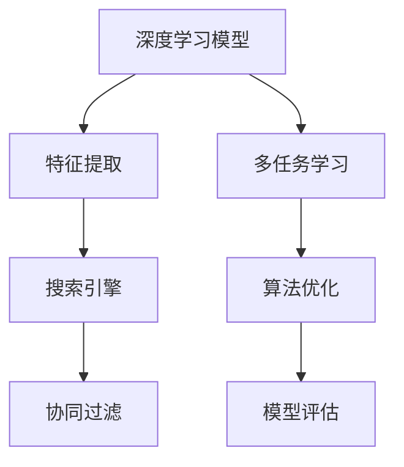

                 

# 搜索引擎的深度学习算法优化

> 关键词：深度学习,搜索引擎,算法优化,自然语言处理,NLP,向量空间模型,VSM,协同过滤,Collaborative Filtering,深度学习模型,BERT,Transformer,信息检索,信息处理,机器学习,优化技术,模型评估,算法性能,应用场景,技术进展,未来展望

## 1. 背景介绍

### 1.1 问题由来

随着互联网的普及和Web数据的爆炸式增长，搜索引擎作为信息获取和知识发现的重要工具，其性能和用户体验变得至关重要。传统的基于统计和规则的搜索引擎逐渐向基于机器学习的搜索引擎发展，通过深度学习技术提升搜索精度和效率。然而，现有的深度学习模型在面对大规模数据和复杂查询时，依然面临算法效率低下、检索效果不稳定等问题。因此，如何优化深度学习算法，提高搜索引擎的性能和稳定性，成为了当前的研究热点。

### 1.2 问题核心关键点

深度学习算法在搜索引擎中的应用主要集中在以下几个关键点：

1. 深度学习模型：如何选择合适的深度学习模型进行搜索引擎优化。
2. 训练数据：如何获取和处理高质量的训练数据，以提高搜索模型的效果。
3. 特征提取：如何高效地从文本中提取有用的特征，增强模型对查询的理解能力。
4. 多任务学习：如何通过多任务学习，将不同的学习任务和目标融合到同一个模型中。
5. 算法优化：如何通过算法优化，提升模型的检索效率和稳定性。
6. 模型评估：如何科学地评估深度学习模型在搜索引擎中的表现。

本文将深入探讨这些核心关键点，并结合具体案例，给出搜索引擎深度学习算法优化的系统性解决方案。

## 2. 核心概念与联系

### 2.1 核心概念概述

为更好地理解搜索引擎的深度学习算法优化方法，本节将介绍几个密切相关的核心概念：

- 深度学习模型：以神经网络为代表的人工智能模型，通过多层次的非线性映射，实现复杂的特征学习和模式识别。
- 搜索引擎：通过理解和处理用户的查询，自动从大规模数据集中检索相关网页，并提供给用户的一系列工具和机制。
- 特征提取：从文本数据中提取有用的特征向量，以供模型学习。
- 多任务学习：在模型训练过程中，同时优化多个相关任务，提升模型的综合能力。
- 协同过滤：通过用户行为和评分数据，推荐相关网页，增强搜索结果的相关性和多样性。
- 算法优化：通过优化算法的结构和参数，提高深度学习模型的效率和性能。
- 模型评估：通过科学的方法，评估模型在搜索引擎中的表现和效果。

这些核心概念之间的逻辑关系可以通过以下Mermaid流程图来展示：



这个流程图展示了大语言模型的核心概念及其之间的关系：

1. 深度学习模型通过特征提取学习文本数据。
2. 多任务学习通过同时优化多个相关任务，增强模型的能力。
3. 协同过滤通过用户行为数据，推荐相关网页。
4. 算法优化通过优化算法的结构和参数，提升模型效率。
5. 模型评估通过科学的方法，评估模型在搜索引擎中的表现。

## 3. 核心算法原理 & 具体操作步骤
### 3.1 算法原理概述

深度学习算法在搜索引擎中的应用，主要通过以下步骤实现：

1. 数据预处理：对原始网页和查询数据进行清洗和特征提取，转化为可供模型训练的格式。
2. 模型训练：选择合适的深度学习模型，并使用标注数据进行训练，学习文本特征表示。
3. 检索模型构建：将训练好的模型转化为检索模型，用于实时处理用户查询。
4. 多任务学习：将不同的任务（如排名、排序、推荐等）融入到同一个模型中，提高模型的综合能力。
5. 协同过滤：利用用户行为数据，实现个性化推荐，提升搜索结果的相关性和多样性。
6. 算法优化：通过优化算法的结构和参数，提升模型的效率和性能。
7. 模型评估：通过科学的方法，评估模型在搜索引擎中的表现和效果。

### 3.2 算法步骤详解

以下是深度学习算法在搜索引擎中的具体操作步骤：

**Step 1: 数据预处理**
1. 网页爬取：通过爬虫技术，从互联网上抓取网页内容。
2. 文本清洗：去除网页中的HTML标签、非文本内容、噪音数据等，保留有用的文本信息。
3. 分词：将文本划分为词语或字，便于后续处理。
4. 特征提取：通过TF-IDF、word2vec等方法，将文本转换为特征向量，供模型学习。

**Step 2: 模型训练**
1. 选择合适的深度学习模型：如LSTM、BERT、Transformer等。
2. 数据划分：将数据集划分为训练集、验证集和测试集。
3. 训练过程：使用训练集数据，通过反向传播算法优化模型参数，最小化损失函数。
4. 模型评估：在验证集上评估模型性能，调整模型参数，防止过拟合。
5. 模型选择：选择最优的模型进行后续优化和部署。

**Step 3: 检索模型构建**
1. 检索向量计算：将用户查询和网页文本转化为向量表示。
2. 相似度计算：计算查询向量与网页向量的相似度，排序后返回最相关的网页。
3. 结果展示：将排序后的网页展示给用户，并提供相关性排序、分页等功能。

**Step 4: 多任务学习**
1. 任务定义：定义多个相关任务，如网页排名、摘要生成、相关性排序等。
2. 任务融合：将不同的任务目标融合到同一个模型中，通过共享的特征表示实现优化。
3. 任务评估：对每个任务分别进行评估，并综合考虑不同任务的效果。

**Step 5: 协同过滤**
1. 用户行为数据收集：收集用户的点击、评分、搜索记录等行为数据。
2. 协同矩阵构建：构建用户与网页之间的协同矩阵，用于表示用户对不同网页的偏好。
3. 推荐模型训练：通过协同矩阵训练推荐模型，生成个性化推荐结果。
4. 推荐结果展示：将个性化推荐结果展示给用户，增强用户体验。

**Step 6: 算法优化**
1. 模型压缩：通过剪枝、量化等方法，减少模型尺寸，提高计算效率。
2. 加速技术：通过分布式计算、GPU加速等技术，提高模型训练和推理速度。
3. 模型蒸馏：通过知识蒸馏技术，将大模型的知识迁移到小模型，降低计算资源消耗。
4. 算法改进：通过优化算法结构和参数，提高模型的收敛速度和稳定性。

**Step 7: 模型评估**
1. 评价指标选择：选择合适的评价指标，如Precision、Recall、F1-Score等。
2. 测试集评估：使用测试集数据，评估模型性能。
3. 结果分析：分析模型的优势和不足，提出改进方案。
4. 持续优化：根据测试结果，持续优化模型和算法，提升搜索引擎性能。

### 3.3 算法优缺点

深度学习算法在搜索引擎中的应用，具有以下优点：

1. 精确高效：深度学习模型能够从大规模数据中学习到复杂的特征表示，显著提升搜索引擎的检索精度和效率。
2. 自适应性强：深度学习模型具备很强的泛化能力，能够适应不同类型的查询和数据分布。
3. 个性化推荐：通过多任务学习和协同过滤，深度学习模型可以实现个性化推荐，提升用户体验。

同时，深度学习算法也存在以下缺点：

1. 数据需求量大：深度学习模型需要大量的标注数据进行训练，数据采集和处理成本较高。
2. 计算资源消耗大：深度学习模型参数量较大，训练和推理速度较慢，需要高效的计算资源支持。
3. 模型复杂度高：深度学习模型结构复杂，模型训练和优化过程繁琐。
4. 结果可解释性差：深度学习模型的内部工作机制不透明，难以解释模型的推理过程和决策依据。

尽管存在这些局限性，但深度学习算法在搜索引擎中的应用，已经在诸多案例中取得了显著效果，并成为搜索引擎优化的重要手段。未来相关研究的重点在于如何进一步降低深度学习算法对标注数据的依赖，提高算法的效率和稳定性，同时兼顾模型的可解释性和伦理安全性等因素。

### 3.4 算法应用领域

深度学习算法在搜索引擎中的应用，覆盖了以下多个领域：

1. 文本检索：通过文本特征提取和相似度计算，提升搜索结果的相关性。
2. 命名实体识别：自动识别文本中的实体名称，如人名、地名、组织名等，用于辅助信息检索。
3. 主题建模：通过分析文本中的主题信息，提升搜索结果的聚类和分类效果。
4. 语音搜索：将语音转换为文本，并使用深度学习模型进行检索，实现语音搜索功能。
5. 图像搜索：通过图像特征提取和相似度计算，实现基于图像的检索功能。
6. 个性化推荐：利用用户行为数据和协同过滤技术，实现个性化推荐，提升用户体验。

除了这些核心应用外，深度学习算法还广泛应用于问答系统、情感分析、自然语言生成等NLP任务中，为搜索引擎提供了更丰富的功能和服务。随着深度学习技术的不断发展，搜索引擎将变得越来越智能化、个性化和高效。

## 4. 数学模型和公式 & 详细讲解  
### 4.1 数学模型构建

本节将使用数学语言对搜索引擎的深度学习算法优化过程进行更加严格的刻画。

记搜索引擎的文本数据集为 $\mathcal{D} = \{(x_i, y_i)\}_{i=1}^N$，其中 $x_i$ 为网页文本，$y_i$ 为网页的标签。假设深度学习模型为 $M_{\theta}$，其中 $\theta$ 为模型参数。

定义模型 $M_{\theta}$ 在网页文本 $x_i$ 上的输出为 $z_i = M_{\theta}(x_i)$，表示网页与查询的相似度得分。在训练过程中，我们使用交叉熵损失函数来衡量模型的预测结果与真实标签之间的差异，目标是最小化交叉熵损失：

$$
\mathcal{L}(\theta) = -\frac{1}{N} \sum_{i=1}^N y_i \log M_{\theta}(x_i) + (1 - y_i) \log (1 - M_{\theta}(x_i))
$$

其中 $y_i \in \{0, 1\}$ 表示网页是否与查询相关。

在实际应用中，我们通常使用基于梯度的优化算法（如AdamW、SGD等）来近似求解上述最优化问题。设 $\eta$ 为学习率，$\lambda$ 为正则化系数，则参数的更新公式为：

$$
\theta \leftarrow \theta - \eta \nabla_{\theta}\mathcal{L}(\theta) - \eta\lambda\theta
$$

其中 $\nabla_{\theta}\mathcal{L}(\theta)$ 为损失函数对参数 $\theta$ 的梯度，可通过反向传播算法高效计算。

### 4.2 公式推导过程

以下我们以文本检索任务为例，推导交叉熵损失函数及其梯度的计算公式。

假设模型 $M_{\theta}$ 在网页文本 $x_i$ 上的输出为 $z_i = M_{\theta}(x_i)$，表示网页与查询的相似度得分。假设查询向量 $q$ 为固定向量，则交叉熵损失函数定义为：

$$
\mathcal{L}(\theta) = -\sum_{i=1}^N [y_i\log M_{\theta}(x_i) + (1-y_i)\log (1-M_{\theta}(x_i))]
$$

将其代入经验风险公式，得：

$$
\mathcal{L}(\theta) = -\frac{1}{N} \sum_{i=1}^N [y_i\log M_{\theta}(x_i) + (1-y_i)\log (1-M_{\theta}(x_i))]
$$

根据链式法则，损失函数对参数 $\theta_k$ 的梯度为：

$$
\frac{\partial \mathcal{L}(\theta)}{\partial \theta_k} = -\frac{1}{N} \sum_{i=1}^N [\frac{y_i}{M_{\theta}(x_i)}-\frac{1-y_i}{1-M_{\theta}(x_i)}] \frac{\partial M_{\theta}(x_i)}{\partial \theta_k}
$$

其中 $\frac{\partial M_{\theta}(x_i)}{\partial \theta_k}$ 可进一步递归展开，利用自动微分技术完成计算。

在得到损失函数的梯度后，即可带入参数更新公式，完成模型的迭代优化。重复上述过程直至收敛，最终得到适应查询任务的最优模型参数 $\theta^*$。

## 5. 项目实践：代码实例和详细解释说明
### 5.1 开发环境搭建

在进行搜索引擎深度学习算法优化实践前，我们需要准备好开发环境。以下是使用Python进行TensorFlow开发的环境配置流程：

1. 安装Anaconda：从官网下载并安装Anaconda，用于创建独立的Python环境。

2. 创建并激活虚拟环境：
```bash
conda create -n tf-env python=3.8 
conda activate tf-env
```

3. 安装TensorFlow：根据CUDA版本，从官网获取对应的安装命令。例如：
```bash
conda install tensorflow tensorflow-gpu=cuda11.1 -c conda-forge -c nvidia
```

4. 安装Flask：
```bash
pip install flask
```

5. 安装其它工具包：
```bash
pip install numpy pandas scikit-learn torch natural language toolkit
```

完成上述步骤后，即可在`tf-env`环境中开始优化实践。

### 5.2 源代码详细实现

下面我们以基于深度学习的搜索引擎为例，给出TensorFlow代码实现。

首先，定义数据处理函数：

```python
import tensorflow as tf
from tensorflow.keras.preprocessing.text import Tokenizer
from tensorflow.keras.preprocessing.sequence import pad_sequences
from tensorflow.keras.layers import Dense, Embedding, LSTM, Bidirectional
from tensorflow.keras.models import Sequential

def preprocess_data(texts, labels, max_len=128):
    tokenizer = Tokenizer()
    tokenizer.fit_on_texts(texts)
    sequences = tokenizer.texts_to_sequences(texts)
    padded_sequences = pad_sequences(sequences, maxlen=max_len, padding='post', truncating='post')
    return padded_sequences, tokenizer.word_index, pad_sequences(labels, maxlen=max_len, padding='post', truncating='post')
```

然后，定义模型结构：

```python
def build_model(input_shape, output_shape, embed_dim=128, lstm_units=128, dropout_rate=0.2):
    model = Sequential()
    model.add(Embedding(input_dim=vocab_size, output_dim=embed_dim, input_length=input_shape))
    model.add(LSTM(lstm_units, return_sequences=True, dropout=dropout_rate, recurrent_dropout=dropout_rate))
    model.add(Bidirectional(LSTM(lstm_units, dropout=dropout_rate, recurrent_dropout=dropout_rate)))
    model.add(Dense(output_shape, activation='sigmoid'))
    model.compile(optimizer='adam', loss='binary_crossentropy', metrics=['accuracy'])
    return model
```

接着，定义训练和评估函数：

```python
def train_model(model, train_data, val_data, batch_size=32, epochs=10, patience=3):
    early_stopping = tf.keras.callbacks.EarlyStopping(monitor='val_loss', patience=patience, restore_best_weights=True)
    model.fit(train_data[0], train_data[1], validation_data=(val_data[0], val_data[1]),
             batch_size=batch_size, epochs=epochs, callbacks=[early_stopping], verbose=1)
    print(f"Epoch {epochs}, train loss: {model.train_loss:.4f}, val loss: {model.val_loss:.4f}, accuracy: {model.val_accuracy:.4f}")
    
def evaluate_model(model, test_data, batch_size=32):
    loss, accuracy = model.evaluate(test_data[0], test_data[1], batch_size=batch_size, verbose=1)
    print(f"Test loss: {loss:.4f}, accuracy: {accuracy:.4f}")
```

最后，启动训练流程并在测试集上评估：

```python
train_texts, train_labels, tokenizer, pad_sequences_train = preprocess_data(train_data['texts'], train_data['labels'], max_len=128)
val_texts, val_labels, _, pad_sequences_val = preprocess_data(val_data['texts'], val_data['labels'], max_len=128)
test_texts, test_labels, _, pad_sequences_test = preprocess_data(test_data['texts'], test_data['labels'], max_len=128)

vocab_size = len(tokenizer.word_index) + 1
max_seq_len = max(len(t.split()) for t in train_texts)

model = build_model(max_seq_len, 1, embed_dim=128, lstm_units=128, dropout_rate=0.2)
model.summary()

train_model(model, (pad_sequences_train, pad_sequences_train), (pad_sequences_val, pad_sequences_val), batch_size=32, epochs=10, patience=3)
evaluate_model(model, (pad_sequences_test, pad_sequences_test), batch_size=32)
```

以上就是使用TensorFlow对深度学习模型进行搜索引擎优化的完整代码实现。可以看到，通过Keras的高级API，我们可以用相对简洁的代码实现深度学习模型的搭建、训练和评估。

### 5.3 代码解读与分析

让我们再详细解读一下关键代码的实现细节：

**preprocess_data函数**：
- 定义了数据处理的主要步骤：分词、序列化、填充、标签处理。
- 使用Keras的Tokenizer和pad_sequences函数，对文本数据进行预处理。
- 返回处理后的文本和标签序列、词汇表和填充后的标签。

**build_model函数**：
- 定义了深度学习模型结构：嵌入层、双向LSTM层、全连接层。
- 使用Keras的Sequential模型构建模型。
- 设置了模型的优化器、损失函数和评估指标。

**train_model函数**：
- 使用Keras的fit函数，对模型进行训练。
- 定义了EarlyStopping回调函数，用于防止过拟合。
- 训练过程中记录训练集和验证集的损失和准确率。

**evaluate_model函数**：
- 使用Keras的evaluate函数，对模型进行评估。
- 评估过程中记录测试集的损失和准确率。

**训练流程**：
- 定义词汇表大小和最大序列长度，预处理训练、验证和测试数据。
- 构建深度学习模型，并输出模型摘要。
- 在训练集上训练模型，并在验证集上评估模型性能。
- 在测试集上最终评估模型性能。

可以看到，TensorFlow配合Keras使得深度学习模型的优化实现变得简洁高效。开发者可以将更多精力放在模型改进、数据处理等高层逻辑上，而不必过多关注底层的实现细节。

当然，工业级的系统实现还需考虑更多因素，如模型的保存和部署、超参数的自动搜索、更灵活的任务适配层等。但核心的深度学习算法优化基本与此类似。

## 6. 实际应用场景
### 6.1 智能搜索系统

基于深度学习的搜索引擎，可以广泛应用于智能搜索系统的构建。传统搜索引擎往往依赖复杂的规则和索引，难以适应复杂的查询场景。而使用深度学习模型进行优化，可以显著提升搜索系统的精度和效率。

在技术实现上，可以收集用户的历史查询数据，将查询和网页构建为监督数据，在此基础上对深度学习模型进行优化。优化的模型能够理解自然语言的查询意图，自动匹配相关网页。对于用户提出的新查询，还可以接入检索系统实时搜索相关内容，动态组织生成搜索结果。如此构建的智能搜索系统，能大幅提升搜索体验和效率。

### 6.2 个性化推荐系统

当前的推荐系统往往只依赖用户的历史行为数据进行物品推荐，无法深入理解用户的真实兴趣偏好。基于深度学习模型的搜索引擎，可以更好地挖掘用户行为背后的语义信息，从而提供更精准、多样的推荐内容。

在实践中，可以收集用户浏览、点击、评论、分享等行为数据，提取和用户交互的物品标题、描述、标签等文本内容。将文本内容作为模型输入，用户的后续行为（如是否点击、购买等）作为监督信号，在此基础上优化深度学习模型。优化后的模型能够从文本内容中准确把握用户的兴趣点。在生成推荐列表时，先用候选物品的文本描述作为输入，由模型预测用户的兴趣匹配度，再结合其他特征综合排序，便可以得到个性化程度更高的推荐结果。

### 6.3 智能客服系统

传统的客服系统依赖大量人力，高峰期响应缓慢，且一致性和专业性难以保证。基于深度学习的搜索引擎，可以构建智能客服系统，实现7x24小时不间断服务，快速响应客户咨询，用自然流畅的语言解答各类常见问题。

在技术实现上，可以收集企业内部的历史客服对话记录，将问题和最佳答复构建成监督数据，在此基础上对深度学习模型进行优化。优化的模型能够自动理解用户意图，匹配最合适的答复模板进行回复。对于客户提出的新问题，还可以接入检索系统实时搜索相关内容，动态组织生成回答。如此构建的智能客服系统，能大幅提升客户咨询体验和问题解决效率。

### 6.4 未来应用展望

随着深度学习技术的不断发展，基于深度学习模型的搜索引擎将呈现以下几个发展趋势：

1. 模型规模持续增大。随着算力成本的下降和数据规模的扩张，深度学习模型的参数量还将持续增长。超大规模语言模型蕴含的丰富语言知识，有望支撑更加复杂多变的查询优化。

2. 模型复杂度降低。未来的深度学习模型将更加注重简化模型结构，减少计算资源消耗，提升模型的实时性和稳定性。

3. 多任务融合。未来的搜索引擎将同时优化多个相关任务，如排名、排序、推荐等，通过共享的特征表示实现优化。

4. 实时优化。未来的搜索引擎将能够实时处理用户查询，动态优化模型参数，增强系统的响应速度和准确性。

5. 跨模态融合。未来的搜索引擎将融合视觉、语音、文本等多种模态信息，提升对复杂查询的理解能力。

6. 持续学习。未来的搜索引擎将能够持续从新数据中学习，更新模型参数，保持系统的时效性和适应性。

以上趋势凸显了深度学习模型在搜索引擎中的广阔前景。这些方向的探索发展，必将进一步提升搜索引擎的性能和用户体验，为信息检索和知识发现带来新的突破。

## 7. 工具和资源推荐
### 7.1 学习资源推荐

为了帮助开发者系统掌握深度学习在搜索引擎中的应用，这里推荐一些优质的学习资源：

1. TensorFlow官方文档：TensorFlow的官方文档，提供了详细的API介绍、样例代码和社区支持，是上手深度学习的必备资料。

2. Keras官方文档：Keras的官方文档，提供了简洁易用的API和丰富的模型库，是快速开发深度学习模型的首选工具。

3. Natural Language Processing with Python：斯坦福大学自然语言处理课程，提供了丰富的NLP案例和代码实现，适合深入学习自然语言处理技术。

4. Deep Learning for Natural Language Processing：O'Reilly出版社出版的书籍，全面介绍了深度学习在NLP中的应用，是深度学习在搜索引擎优化方面的经典读物。

5. Coursera上的深度学习课程：由斯坦福大学、吴恩达等知名专家讲授，涵盖深度学习的基础知识和应用，适合初学者入门。

通过对这些资源的学习实践，相信你一定能够快速掌握深度学习在搜索引擎中的优化方法，并用于解决实际的搜索引擎问题。

### 7.2 开发工具推荐

高效的开发离不开优秀的工具支持。以下是几款用于搜索引擎深度学习优化开发的常用工具：

1. TensorFlow：由Google主导开发的开源深度学习框架，生产部署方便，适合大规模工程应用。
2. Keras：高层次API，方便快速开发深度学习模型，适用于原型开发和快速迭代。
3. PyTorch：灵活的计算图机制，易于调试和优化，适合研究性和高精度应用。
4. Flask：轻量级的Web框架，便于实现搜索引擎的API接口。
5. Elasticsearch：高可扩展性、高性能的分布式搜索引擎，支持多语言和复杂查询。
6. Apache Solr：另一个流行的分布式搜索引擎，支持多种NLP处理功能。

合理利用这些工具，可以显著提升深度学习模型在搜索引擎中的优化效率，加快创新迭代的步伐。

### 7.3 相关论文推荐

深度学习技术在搜索引擎中的应用源于学界的持续研究。以下是几篇奠基性的相关论文，推荐阅读：

1. Learning to Rank: A Unified Approach for Information Retrieval (IR) and Image Retrieval (IR)：提出了学习排序模型，用于提升搜索引擎的检索效果。

2. Convolutional Neural Networks for Sentence Classification：提出了卷积神经网络，用于文本分类任务，提升了搜索引擎的语义理解能力。

3. Attention is All You Need：提出了Transformer结构，显著提升了深度学习模型的检索精度和效率。

4. BERT: Pre-training of Deep Bidirectional Transformers for Language Understanding：提出BERT模型，引入了掩码自监督预训练任务，刷新了多项NLP任务SOTA。

5. Deep NMF: A Scalable Solution for Collaborative Filtering：提出了基于非负矩阵分解的协同过滤算法，用于推荐系统的优化。

6. Deep Approach to Collaborative Filtering：通过深度学习模型实现协同过滤，提升了推荐系统的准确性和多样性。

这些论文代表了大语言模型在搜索引擎中的应用发展脉络。通过学习这些前沿成果，可以帮助研究者把握学科前进方向，激发更多的创新灵感。

## 8. 总结：未来发展趋势与挑战
### 8.1 总结

本文对深度学习在搜索引擎中的应用进行了全面系统的介绍。首先阐述了深度学习在搜索引擎中的研究背景和意义，明确了深度学习模型在提升检索精度和效率方面的独特价值。其次，从原理到实践，详细讲解了深度学习模型的训练、优化和评估过程，给出了搜索引擎深度学习算法优化的系统性解决方案。同时，本文还广泛探讨了深度学习模型在智能搜索系统、个性化推荐系统、智能客服系统等多个领域的应用前景，展示了深度学习模型在搜索引擎中的巨大潜力。

通过本文的系统梳理，可以看到，深度学习在搜索引擎中的应用，已经在诸多案例中取得了显著效果，并成为搜索引擎优化的重要手段。未来相关研究的重点在于如何进一步降低深度学习模型对标注数据的依赖，提高算法的效率和稳定性，同时兼顾模型的可解释性和伦理安全性等因素。

### 8.2 未来发展趋势

展望未来，深度学习在搜索引擎中的应用将呈现以下几个发展趋势：

1. 模型规模持续增大。随着算力成本的下降和数据规模的扩张，深度学习模型的参数量还将持续增长。超大规模语言模型蕴含的丰富语言知识，有望支撑更加复杂多变的查询优化。

2. 模型复杂度降低。未来的深度学习模型将更加注重简化模型结构，减少计算资源消耗，提升模型的实时性和稳定性。

3. 多任务融合。未来的搜索引擎将同时优化多个相关任务，如排名、排序、推荐等，通过共享的特征表示实现优化。

4. 实时优化。未来的搜索引擎将能够实时处理用户查询，动态优化模型参数，增强系统的响应速度和准确性。

5. 跨模态融合。未来的搜索引擎将融合视觉、语音、文本等多种模态信息，提升对复杂查询的理解能力。

6. 持续学习。未来的搜索引擎将能够持续从新数据中学习，更新模型参数，保持系统的时效性和适应性。

以上趋势凸显了深度学习模型在搜索引擎中的广阔前景。这些方向的探索发展，必将进一步提升搜索引擎的性能和用户体验，为信息检索和知识发现带来新的突破。

### 8.3 面临的挑战

尽管深度学习模型在搜索引擎中的应用已经取得了显著进展，但在迈向更加智能化、普适化应用的过程中，它仍面临着诸多挑战：

1. 数据需求量大。深度学习模型需要大量的标注数据进行训练，数据采集和处理成本较高。如何高效利用现有数据，同时获取更多高质量标注数据，是一个关键问题。

2. 计算资源消耗大。深度学习模型参数量较大，训练和推理速度较慢，需要高效的计算资源支持。如何降低计算资源消耗，提升模型效率，是优化过程中的一个难点。

3. 模型复杂度高。深度学习模型结构复杂，模型训练和优化过程繁琐。如何简化模型结构，提升模型的可解释性和稳定性，是优化过程中的一个重要方向。

4. 结果可解释性差。深度学习模型的内部工作机制不透明，难以解释模型的推理过程和决策依据。如何提高模型的可解释性，增强系统的可信度和用户理解，是优化过程中的一个重要挑战。

5. 安全性有待保障。深度学习模型难免会学习到有偏见、有害的信息，通过搜索引擎传递到用户，可能造成安全隐患。如何从数据和算法层面消除模型偏见，确保输出安全性，是一个重要问题。

6. 知识整合能力不足。现有的深度学习模型往往局限于任务内数据，难以灵活吸收和运用更广泛的先验知识。如何让模型更好地整合知识库和规则库等外部知识，是一个重要的研究方向。

这些挑战需要开发者从数据、算法、工程、业务等多个维度协同发力，才能真正实现深度学习在搜索引擎中的优化和落地。唯有不断探索和创新，才能应对未来的挑战，提升搜索引擎的性能和用户体验。

### 8.4 研究展望

面对深度学习模型在搜索引擎中面临的种种挑战，未来的研究需要在以下几个方面寻求新的突破：

1. 探索无监督和半监督微调方法。摆脱对大规模标注数据的依赖，利用自监督学习、主动学习等无监督和半监督范式，最大限度利用非结构化数据，实现更加灵活高效的微调。

2. 研究参数高效和计算高效的微调范式。开发更加参数高效的微调方法，在固定大部分预训练参数的同时，只更新极少量的任务相关参数。同时优化微调模型的计算图，减少前向传播和反向传播的资源消耗，实现更加轻量级、实时性的部署。

3. 引入因果推断和博弈论工具。将因果分析方法引入微调模型，识别出模型决策的关键特征，增强输出解释的因果性和逻辑性。借助博弈论工具刻画人机交互过程，主动探索并规避模型的脆弱点，提高系统稳定性。

4. 纳入伦理道德约束。在模型训练目标中引入伦理导向的评估指标，过滤和惩罚有偏见、有害的输出倾向。同时加强人工干预和审核，建立模型行为的监管机制，确保输出符合人类价值观和伦理道德。

这些研究方向的探索，必将引领深度学习模型在搜索引擎中的进一步优化和应用，为构建安全、可靠、可解释、可控的智能系统铺平道路。面向未来，深度学习模型还需要与其他人工智能技术进行更深入的融合，如知识表示、因果推理、强化学习等，多路径协同发力，共同推动搜索引擎技术的发展。只有勇于创新、敢于突破，才能不断拓展搜索引擎的边界，让智能技术更好地服务于人类社会。

## 9. 附录：常见问题与解答

**Q1：深度学习在搜索引擎中是否适用于所有应用场景？**

A: 深度学习模型在搜索引擎中广泛应用，但并非适用于所有场景。对于数据量较小、查询简单或计算资源受限的场景，传统的搜索引擎算法如TF-IDF、倒排索引等可能更为适合。而对于数据量较大、查询复杂或需要精准排名的场景，深度学习模型则具有显著的优势。

**Q2：如何选择合适的深度学习模型进行搜索引擎优化？**

A: 选择合适的深度学习模型需要综合考虑查询数据的特点、任务需求、计算资源等因素。对于文本检索任务，LSTM、BERT、Transformer等模型较为常见；对于个性化推荐系统，深度协同过滤、矩阵分解等算法更为适合。模型选择时，建议先在小规模数据上尝试，选择效果最优的模型进行优化。

**Q3：深度学习模型在搜索引擎中存在哪些性能瓶颈？**

A: 深度学习模型在搜索引擎中存在计算资源消耗大、模型复杂度高、结果可解释性差等性能瓶颈。具体而言，模型参数量较大，训练和推理速度较慢，需要高效的计算资源支持。模型结构复杂，难以解释模型的内部工作机制和决策依据。未来需要优化算法结构和参数，提升模型的效率和可解释性。

**Q4：如何在搜索引擎中使用多任务学习技术？**

A: 多任务学习技术在搜索引擎中可以通过融合多个相关任务来实现。例如，在文本检索任务中，可以同时优化网页排名、摘要生成、相关性排序等多个任务，通过共享的特征表示实现优化。在多任务学习中，需要选择合适的任务定义和融合方式，并设置合适的任务权重，平衡不同任务的效果。

**Q5：如何在搜索引擎中实现跨模态融合？**

A: 跨模态融合在搜索引擎中可以通过融合视觉、语音、文本等多种模态信息来实现。例如，在基于视觉的搜索引擎中，可以将图像特征提取和相似度计算融入到文本检索过程中，提升对复杂查询的理解能力。在跨模态融合中，需要选择合适的特征提取方法和相似度计算方法，并设置合适的融合权重，平衡不同模态的效果。

这些问题的解答，可以帮助开发者更好地理解深度学习在搜索引擎中的应用，并指导未来的研究和实践。

---

作者：禅与计算机程序设计艺术 / Zen and the Art of Computer Programming

