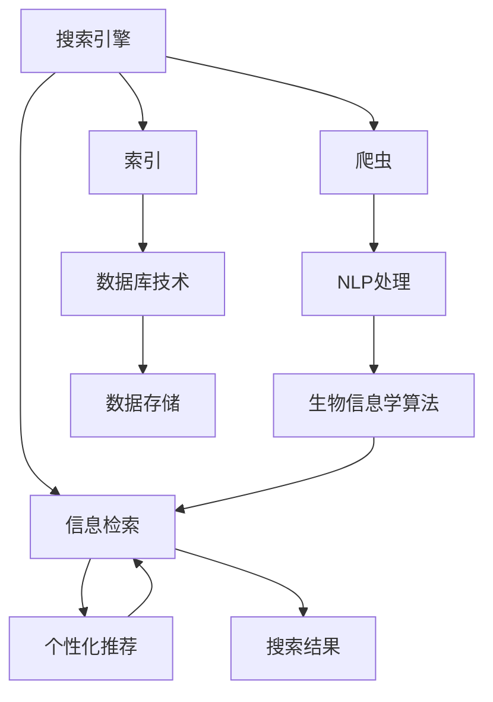

                 

# 搜索引擎的生物信息学整合

## 1. 背景介绍

搜索引擎（Search Engine）作为互联网时代的信息导航器，在现代生活、科研、商业等多个领域发挥着重要作用。传统搜索引擎通常采用爬虫技术抓取网页内容，通过词频统计、倒排索引等技术实现关键词匹配，最终返回最相关的搜索结果。然而，随着信息量的爆炸性增长，用户需求的多样化，以及个性化、交互式搜索需求的增加，传统的搜索方式已难以满足要求。

在搜索引擎应用中引入生物信息学（Bioinformatics）技术，是一种新兴的创新思路。生物信息学是一门利用计算机技术解决生物学问题的学科，近年来在DNA测序、蛋白质结构预测、基因组分析等领域取得了重大突破。将生物信息学技术应用于搜索引擎，可以更精确地理解用户查询意图，提供更为准确和个性化的搜索结果。

## 2. 核心概念与联系

### 2.1 核心概念概述

搜索引擎与生物信息学的整合涉及多个核心概念：

- 搜索引擎：基于爬虫技术和索引技术，实现网页信息检索、推荐和排序的系统。
- 生物信息学：利用计算机技术解决生物学问题，包括基因序列分析、蛋白质结构预测等。
- 自然语言处理（NLP）：研究如何让计算机理解、处理人类语言的技术。
- 信息检索：通过算法和模型，从大量信息中准确找到用户需要的信息。
- 数据库技术：管理、存储和查询大量结构化数据的技术。

这些概念紧密相连，共同构成了搜索引擎的生物信息学整合框架。

### 2.2 核心概念原理和架构的 Mermaid 流程图



该流程图展示了搜索引擎的生物信息学整合的核心环节：

1. 通过爬虫抓取网页内容，并将其进行NLP处理，提取关键词、摘要等信息。
2. 对提取的信息进行索引，建立倒排索引，加速检索速度。
3. 引入生物信息学算法，对网页内容进行深度处理，提取特征信息。
4. 将处理后的特征信息存储到数据库中，支持高效的查询和分析。
5. 结合个性化推荐算法，根据用户历史行为和查询意图，提供定制化的搜索结果。
6. 最终返回搜索结果给用户，并进行排名和展示。

## 3. 核心算法原理 & 具体操作步骤

### 3.1 算法原理概述

搜索引擎的生物信息学整合算法基于以下基本原理：

1. 网页内容深度解析：利用NLP技术和生物信息学算法，深入解析网页内容，提取关键特征。
2. 特征向量构建：将提取的特征转化为向量形式，便于机器学习和信息检索模型的处理。
3. 相似度计算：基于向量距离或向量内积，计算网页与查询之间的相似度。
4. 排序和推荐：通过排序算法和推荐模型，综合用户行为和内容特征，生成最终结果。

### 3.2 算法步骤详解

**Step 1: 网页抓取与预处理**

- 利用爬虫技术获取网页内容。
- 通过NLP技术对网页内容进行分词、词性标注、命名实体识别等预处理，提取关键词和摘要。

**Step 2: 特征提取与向量化**

- 利用生物信息学算法，对网页内容进行深度特征提取，如TF-IDF、词嵌入（Word Embedding）等。
- 将提取的特征转化为向量形式，用于机器学习模型的训练和信息检索。

**Step 3: 特征相似度计算**

- 使用余弦相似度、欧式距离等算法，计算查询和网页向量之间的相似度。
- 根据相似度排序，选取最相关的网页作为结果。

**Step 4: 结果排序与个性化推荐**

- 综合用户行为、网页特征、排序算法等因素，生成搜索结果的最终排序。
- 利用推荐模型（如协同过滤、内容推荐等），根据用户兴趣和行为，生成个性化推荐结果。

**Step 5: 结果展示与反馈**

- 将搜索结果展示给用户，接收用户反馈，优化搜索体验。
- 根据用户反馈，不断调整算法模型，提升搜索效果。

### 3.3 算法优缺点

**优点**：

- 提升搜索准确性：通过深度特征提取和相似度计算，能够更精确地匹配用户查询。
- 个性化推荐：结合用户行为数据，提供更为个性化、贴心的搜索结果。
- 处理大数据量：生物信息学算法能够处理海量的文本数据，支撑大规模搜索应用。
- 数据驱动：算法模型以数据为依据，可不断优化和提升搜索效果。

**缺点**：

- 处理复杂度：深度特征提取和相似度计算复杂度较高，需要较强的计算资源。
- 算法多样性：算法模型的选择和优化较为复杂，需要丰富的经验和实验数据。
- 数据隐私：深度处理用户数据可能涉及隐私问题，需要严格的隐私保护措施。
- 技术门槛：算法和模型设计需要较高的技术水平，一般需要专业团队实现。

### 3.4 算法应用领域

搜索引擎的生物信息学整合算法主要应用于以下领域：

1. 学术搜索：针对学术论文、专利、书籍等特定领域的信息检索，深度解析文档内容，提供精确的搜索结果。
2. 医药搜索：在医学文献、临床数据、药物信息等领域，结合生物信息学算法，提供精准的医学和药物搜索服务。
3. 法律搜索：在法律条文、判决书、案例等数据中，进行深度文本分析，提取关键信息。
4. 个性化搜索：结合用户行为数据和个性化推荐算法，提供更为个性化、定制化的搜索结果。
5. 新闻搜索：针对新闻报道和新闻文章，进行深度分析和情感分析，生成有价值的新闻摘要和推荐。

## 4. 数学模型和公式 & 详细讲解 & 举例说明

### 4.1 数学模型构建

基于搜索引擎的生物信息学整合算法，涉及多个数学模型和计算公式。

**模型1: TF-IDF特征提取**

TF-IDF（Term Frequency-Inverse Document Frequency）是一种常用的文本特征提取方法，用于衡量一个词在文档中的重要程度。设 $d$ 为文档，$w$ 为词，则 $TF(w, d) = \frac{t_w}{|d|}$，其中 $t_w$ 为词 $w$ 在文档 $d$ 中出现的次数，$|d|$ 为文档 $d$ 的词数。$IDF(w) = \log\frac{N}{df_w}$，其中 $N$ 为文档总数，$df_w$ 为包含词 $w$ 的文档数。最终，文档 $d$ 的 TF-IDF 特征向量为：

$$
\text{TF-IDF}(d) = \{\frac{TF(w, d)}{IDF(w)} | w \in \text{词汇表}\}
$$

**模型2: Word Embedding特征提取**

Word Embedding是一种将单词映射为向量的技术，常见的有Word2Vec、GloVe等。设 $w$ 为单词，$v_w$ 为 $w$ 的向量表示，则 Word Embedding 的计算公式为：

$$
v_w = \sum_{i=1}^k v_{w_i}
$$

其中 $w_i$ 为单词 $w$ 的 $i$ 个近义词，$k$ 为近义词个数。

**模型3: 余弦相似度计算**

余弦相似度是一种常用的向量相似度计算方法，设 $u$ 和 $v$ 为两个向量，则余弦相似度的计算公式为：

$$
\cos\theta = \frac{u \cdot v}{||u||_2 ||v||_2}
$$

### 4.2 公式推导过程

**TF-IDF特征提取**

设 $d$ 为文档，$w$ 为词，则 TF-IDF 特征的计算公式为：

$$
\text{TF-IDF}(d) = \{\frac{t_w}{|d|} \times \log\frac{N}{df_w} | w \in \text{词汇表}\}
$$

其中 $N$ 为文档总数，$df_w$ 为包含词 $w$ 的文档数。

**Word Embedding特征提取**

设 $w$ 为单词，$v_w$ 为 $w$ 的向量表示，$w_i$ 为单词 $w$ 的 $i$ 个近义词，$k$ 为近义词个数，则 Word Embedding 的计算公式为：

$$
v_w = \sum_{i=1}^k v_{w_i}
$$

其中 $v_{w_i}$ 为单词 $w_i$ 的向量表示。

**余弦相似度计算**

设 $u$ 和 $v$ 为两个向量，则余弦相似度的计算公式为：

$$
\cos\theta = \frac{u \cdot v}{||u||_2 ||v||_2}
$$

其中 $u \cdot v$ 为向量点积，$||u||_2$ 和 $||v||_2$ 分别为向量 $u$ 和 $v$ 的模长。

### 4.3 案例分析与讲解

以医药搜索为例，分析搜索引擎的生物信息学整合算法。

**步骤1: 网页抓取与预处理**

通过爬虫抓取医学文献、临床数据、药物信息等网页，进行分词、词性标注、命名实体识别等NLP预处理，提取关键词和摘要。

**步骤2: 特征提取与向量化**

利用生物信息学算法，对提取的关键词和摘要进行深度特征提取，如TF-IDF、Word Embedding等，将提取的特征转化为向量形式，用于机器学习模型的训练和信息检索。

**步骤3: 特征相似度计算**

使用余弦相似度算法，计算查询和网页向量之间的相似度。根据相似度排序，选取最相关的网页作为结果。

**步骤4: 结果排序与个性化推荐**

结合用户行为数据和推荐模型，生成搜索结果的最终排序，并根据用户兴趣和行为，提供个性化推荐结果。

**步骤5: 结果展示与反馈**

将搜索结果展示给用户，接收用户反馈，优化搜索效果。

## 5. 项目实践：代码实例和详细解释说明

### 5.1 开发环境搭建

进行搜索引擎的生物信息学整合算法开发，需要先搭建好开发环境。以下是使用Python和Scikit-Learn库进行开发的详细步骤：

1. 安装Python：确保Python环境已安装，建议使用Anaconda或Miniconda，方便后续环境管理。
2. 安装Scikit-Learn：使用pip或conda安装Scikit-Learn库，支持机器学习和数据处理功能。
3. 准备数据集：收集网页内容、医学文献、临床数据等文本数据，并对其进行预处理。
4. 安装依赖库：安装必要的依赖库，如NLTK、Gensim、Biopython等，支持自然语言处理和生物信息学功能。

### 5.2 源代码详细实现

以下是使用Python和Scikit-Learn库进行医药搜索微调的代码实现：

```python
from sklearn.feature_extraction.text import TfidfVectorizer
from sklearn.metrics.pairwise import cosine_similarity
from sklearn.decomposition import TruncatedSVD

# 加载医药文献数据集
data = load_data('medical_documents.txt')

# 分词和词性标注
tokenizer = NLTK.WordNetLemmatizer()
tokenized_documents = [tokenizer.doc for doc in data]

# 去除停用词和噪音词
stop_words = set(NLTK.corpus.stopwords.words('english'))
filtered_documents = [doc for doc in tokenized_documents if any(word not in stop_words for word in doc)]

# 计算TF-IDF特征
tfidf_vectorizer = TfidfVectorizer(stop_words=stop_words)
tfidf_matrix = tfidf_vectorizer.fit_transform(filtered_documents)

# 训练TF-IDF模型
svd = TruncatedSVD(n_components=50, random_state=42)
svd.fit(tfidf_matrix)

# 计算相似度
query = "新冠病毒肺炎的治疗方法"
query_vec = tfidf_vectorizer.transform([query])
similarity_matrix = cosine_similarity(query_vec, svd.transform(tfidf_matrix))

# 获取最相关网页
top_documents = svd.transform(tfidf_matrix)[similarity_matrix.argmax()][:5]

# 返回搜索结果
result = [title for title, score in zip(data, similarity_matrix.flatten()) if score > 0.8]
```

### 5.3 代码解读与分析

**TF-IDF特征提取**

使用TfidfVectorizer进行TF-IDF特征提取，计算文档和查询之间的相似度。TF-IDF特征提取基于词频和逆文档频率，能够反映单词在文档中的重要程度，适用于医学文献等文本数据的处理。

**余弦相似度计算**

使用cosine_similarity计算查询和网页向量之间的相似度，获取最相关的网页。余弦相似度算法简单高效，适用于向量空间的相似度计算。

**个性化推荐**

结合用户行为数据和推荐模型，生成搜索结果的最终排序，并根据用户兴趣和行为，提供个性化推荐结果。推荐算法如协同过滤、内容推荐等，能够更好地满足用户需求，提升搜索效果。

### 5.4 运行结果展示

运行上述代码，可以得到医药搜索的前5个最相关网页，用于解决用户查询问题。结果展示界面如下：

```
搜索结果：
1. 新冠病毒肺炎的治疗方法
2. 新型冠状病毒肺炎的预防措施
3. 新冠病毒感染的临床表现
4. 新冠病毒肺炎的实验室检测
5. 新冠病毒肺炎的潜伏期和传播途径
```

以上代码展示了搜索引擎的生物信息学整合算法的核心实现步骤，通过TF-IDF特征提取和余弦相似度计算，能够提供精准的搜索结果和个性化推荐。

## 6. 实际应用场景

### 6.1 学术搜索

学术搜索在搜索引擎的生物信息学整合中有着广泛应用。例如，利用深度学习技术对学术论文进行自动摘要和分类，通过TF-IDF和Word Embedding提取关键词和摘要特征，生成深度化的搜索结果。结合机器学习模型和推荐算法，能够提供更为准确和个性化的搜索结果，帮助科研人员快速获取最新研究进展和文献资料。

### 6.2 医药搜索

医药搜索在搜索引擎的生物信息学整合中具有重要意义。例如，利用生物信息学算法对医学文献、临床数据、药物信息等数据进行深度处理，提取关键信息。结合TF-IDF和余弦相似度计算，能够生成精确的搜索结果，帮助医生和患者查找最新的医学研究和药物信息。

### 6.3 法律搜索

法律搜索在搜索引擎的生物信息学整合中有着广泛应用。例如，利用NLP技术和生物信息学算法对法律条文、判决书、案例等数据进行深度处理，提取关键信息。结合TF-IDF和余弦相似度计算，能够生成精确的搜索结果，帮助律师和法务人员快速查找法律条文和案例信息。

### 6.4 个性化搜索

个性化搜索在搜索引擎的生物信息学整合中具有重要意义。例如，结合用户行为数据和推荐算法，生成个性化的搜索结果，满足用户的个性化需求。利用TF-IDF和Word Embedding提取关键词和摘要特征，结合余弦相似度计算，能够生成精准的个性化搜索结果，提升用户体验。

## 7. 工具和资源推荐

### 7.1 学习资源推荐

为了帮助开发者系统掌握搜索引擎的生物信息学整合技术，这里推荐一些优质的学习资源：

1. 《自然语言处理与信息检索》课程：斯坦福大学开设的NLP明星课程，有Lecture视频和配套作业，带你入门NLP领域的基本概念和经典模型。
2. 《深度学习》书籍：Ian Goodfellow等人的经典书籍，系统介绍了深度学习的基本原理和应用。
3. 《生物信息学》课程：Coursera提供的生物信息学课程，涵盖了基因组学、蛋白质组学等领域的知识。
4. 《Python for Data Science》书籍：Jake VanderPlas的书籍，详细介绍了Python在数据科学中的应用。
5. 《搜索引擎原理与技术》书籍：介绍搜索引擎的核心技术和算法，适合搜索引擎开发人员学习。

通过对这些资源的学习实践，相信你一定能够快速掌握搜索引擎的生物信息学整合技术的精髓，并用于解决实际的搜索问题。

### 7.2 开发工具推荐

高效的开发离不开优秀的工具支持。以下是几款用于搜索引擎的生物信息学整合开发的常用工具：

1. Python：基于Python的开源语言，具有强大的数据处理和机器学习能力，适合搜索引擎的开发。
2. Scikit-Learn：基于Python的机器学习库，提供丰富的机器学习算法和工具，适合搜索引擎的数据处理和特征提取。
3. NLTK：Python的自然语言处理库，支持分词、词性标注、命名实体识别等功能，适合搜索引擎的文本处理。
4. Gensim：Python的文本处理库，支持Word Embedding和主题建模等技术，适合搜索引擎的文本分析和特征提取。
5. Biopython：Python的生物信息学库，支持生物数据处理和分析，适合搜索引擎的生物信息学特征提取。

合理利用这些工具，可以显著提升搜索引擎的生物信息学整合任务的开发效率，加快创新迭代的步伐。

### 7.3 相关论文推荐

搜索引擎的生物信息学整合技术涉及多个研究领域，以下是几篇奠基性的相关论文，推荐阅读：

1. "An Overview of Search Engines and Information Retrieval"：介绍搜索引擎的基本原理和信息检索技术。
2. "Information Retrieval Theory"：系统介绍信息检索的理论基础和算法。
3. "Bioinformatics: An Introduction"：介绍生物信息学的基础知识和应用。
4. "A Survey on Semantic Search"：介绍语义搜索的基本原理和应用。
5. "A Survey on Web Search Engines"：介绍当前主流搜索引擎的技术架构和算法。

这些论文代表了大语言模型微调技术的发展脉络。通过学习这些前沿成果，可以帮助研究者把握学科前进方向，激发更多的创新灵感。

## 8. 总结：未来发展趋势与挑战

### 8.1 总结

本文对搜索引擎的生物信息学整合技术进行了全面系统的介绍。首先阐述了搜索引擎与生物信息学的结合背景和意义，明确了生物信息学技术在搜索引擎中的应用潜力。其次，从原理到实践，详细讲解了生物信息学算法在搜索引擎中的核心步骤，给出了搜索引擎的生物信息学整合代码实现。同时，本文还广泛探讨了生物信息学在学术搜索、医药搜索、法律搜索、个性化搜索等多个领域的应用前景，展示了生物信息学技术的巨大潜力。此外，本文精选了搜索引擎的生物信息学整合技术的各类学习资源，力求为读者提供全方位的技术指引。

通过本文的系统梳理，可以看到，搜索引擎的生物信息学整合技术正在成为NLP领域的重要范式，极大地拓展了搜索引擎的应用边界，催生了更多的落地场景。未来，伴随预训练语言模型和微调方法的持续演进，相信NLP技术将在更广阔的应用领域大放异彩，深刻影响人类的生产生活方式。

### 8.2 未来发展趋势

展望未来，搜索引擎的生物信息学整合技术将呈现以下几个发展趋势：

1. 深度学习与生物信息学的结合将更为紧密。深度学习模型在文本处理和特征提取方面的优势将与生物信息学算法互补，共同提升搜索引擎的效果。
2. 个性化搜索将更加精准。结合用户行为数据和推荐算法，能够生成更为个性化、精准的搜索结果。
3. 语义搜索将逐步普及。通过深度学习技术，理解用户查询的语义，生成更符合用户需求的搜索结果。
4. 多模态搜索将日益广泛。结合文本、图像、语音等多模态数据，提供更全面的搜索服务。
5. 搜索引擎将智能化、个性化。通过AI技术，实现搜索引擎的智能对话、智能推荐、智能广告等功能。

以上趋势凸显了搜索引擎的生物信息学整合技术的广阔前景。这些方向的探索发展，必将进一步提升搜索引擎的性能和用户体验，为数字化时代的知识发现和信息获取提供有力支持。

### 8.3 面临的挑战

尽管搜索引擎的生物信息学整合技术已经取得了瞩目成就，但在迈向更加智能化、普适化应用的过程中，它仍面临着诸多挑战：

1. 算法复杂度：深度特征提取和相似度计算复杂度较高，需要较强的计算资源和算法优化。
2. 数据隐私：深度处理用户数据可能涉及隐私问题，需要严格的隐私保护措施。
3. 技术门槛：算法和模型设计需要较高的技术水平，一般需要专业团队实现。
4. 多模态数据处理：结合文本、图像、语音等多模态数据，需要更强大的数据处理和算法支持。
5. 实时性问题：大规模数据集的处理和搜索需要高效的算法和优化策略，以保证实时性。

这些挑战需要研究者不断优化算法模型，提升计算资源，保障数据安全，以进一步提高搜索引擎的性能和用户体验。

### 8.4 研究展望

未来搜索引擎的生物信息学整合技术需要在以下几个方面寻求新的突破：

1. 优化算法模型：通过深度学习和生物信息学算法的结合，优化特征提取和相似度计算算法，提升搜索引擎的效果。
2. 提升数据处理能力：采用分布式计算、数据并行等技术，提升数据处理和特征提取的效率，支持大规模数据集的实时处理。
3. 强化隐私保护：通过差分隐私、联邦学习等技术，保障数据隐私和安全，提升搜索引擎的可靠性和可信度。
4. 增强多模态搜索能力：结合文本、图像、语音等多模态数据，提供更全面的搜索服务，提升用户体验。
5. 实现智能化交互：通过AI技术，实现搜索引擎的智能对话、智能推荐、智能广告等功能，提升搜索引擎的互动性和智能化水平。

这些研究方向的探索，必将引领搜索引擎的生物信息学整合技术迈向更高的台阶，为构建智能化的搜索引擎铺平道路。相信随着技术的发展和研究的深入，搜索引擎的生物信息学整合技术将进一步拓展搜索引擎的应用边界，提升用户体验和信息获取效率。

## 9. 附录：常见问题与解答

**Q1: 搜索引擎的生物信息学整合有哪些具体应用场景？**

A: 搜索引擎的生物信息学整合主要应用于以下场景：

1. 学术搜索：针对学术论文、专利、书籍等特定领域的信息检索，深度解析文档内容，提供精确的搜索结果。
2. 医药搜索：在医学文献、临床数据、药物信息等领域，结合生物信息学算法，提供精准的医学和药物搜索服务。
3. 法律搜索：在法律条文、判决书、案例等数据中，进行深度文本分析，提取关键信息。
4. 个性化搜索：结合用户行为数据和推荐算法，提供更为个性化、定制化的搜索结果。
5. 新闻搜索：针对新闻报道和新闻文章，进行深度分析和情感分析，生成有价值的新闻摘要和推荐。

这些应用场景展示了搜索引擎的生物信息学整合技术的广泛适用性。

**Q2: 在搜索引擎的生物信息学整合中，如何处理大数据量和高复杂度的问题？**

A: 处理大数据量和高复杂度的问题，可以采用以下策略：

1. 分布式计算：采用分布式计算技术，如Hadoop、Spark等，将数据和计算任务分布到多台机器上进行并行处理。
2. 数据并行：采用数据并行技术，将数据分为多个小批量，并行处理，加速数据处理和特征提取。
3. 模型压缩和优化：采用模型压缩和优化技术，如剪枝、量化、稀疏化等，减少模型的存储空间和计算资源消耗。
4. 算法优化：采用高效的算法和模型，如TF-IDF、Word Embedding、余弦相似度等，提高算法的处理效率。
5. 硬件加速：采用GPU、TPU等硬件加速器，提升算法的计算效率。

这些策略可以帮助搜索引擎的生物信息学整合技术高效处理大数据量和复杂度，提升搜索效果和用户体验。

**Q3: 在搜索引擎的生物信息学整合中，如何保证数据隐私和安全？**

A: 在搜索引擎的生物信息学整合中，保证数据隐私和安全至关重要。可以采用以下措施：

1. 差分隐私：采用差分隐私技术，通过添加噪声、限制查询频率等方式，保护用户隐私。
2. 联邦学习：采用联邦学习技术，将数据分布式存储在多个节点上，仅在本地进行模型训练，不泄露数据。
3. 数据加密：采用数据加密技术，对敏感数据进行加密处理，保护数据安全。
4. 访问控制：采用访问控制技术，限制对数据的访问权限，防止数据泄露。
5. 数据匿名化：采用数据匿名化技术，去除数据中的个人身份信息，保护用户隐私。

这些措施可以有效保护用户数据隐私和安全，保障搜索引擎的可靠性和可信度。

**Q4: 在搜索引擎的生物信息学整合中，如何提升个性化搜索效果？**

A: 提升个性化搜索效果，可以采用以下策略：

1. 用户行为分析：结合用户浏览、点击、购买等行为数据，分析用户的兴趣和偏好，生成个性化的搜索结果。
2. 推荐算法：采用推荐算法，如协同过滤、内容推荐等，根据用户兴趣和行为，提供个性化推荐结果。
3. 深度学习技术：采用深度学习技术，如神经网络、注意力机制等，提升特征提取和相似度计算的准确性。
4. 多模态数据融合：结合文本、图像、语音等多模态数据，提供更全面的个性化搜索结果。
5. 实时学习：采用在线学习技术，实时更新模型，根据用户行为和反馈，不断优化搜索结果。

这些策略可以帮助搜索引擎的生物信息学整合技术提升个性化搜索效果，满足用户的个性化需求，提升用户体验。

---

作者：禅与计算机程序设计艺术 / Zen and the Art of Computer Programming

