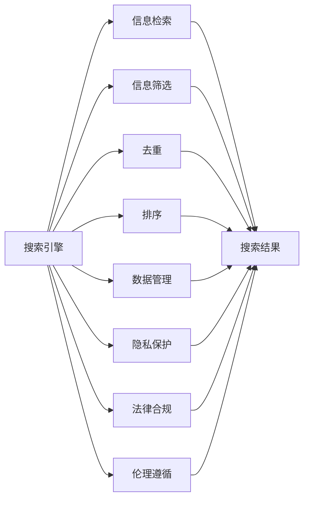

                 

## 1. 背景介绍

随着互联网的普及和数字技术的快速发展，搜索引擎已成为了现代社会不可或缺的信息获取工具。然而，搜索引擎在为用户服务的同时，也面临着众多挑战，尤其是如何提供可靠的信息。在全球范围内，搜索引擎扮演着传播知识、普及教育、引导舆论等重要角色，对社会治理和民众认知产生着深远影响。因此，搜索引擎不仅需要追求技术上的进步，更需要在伦理、社会责任等方面进行深入思考和持续改进。

### 1.1 问题由来

在信息时代，搜索引擎承担着传递全球资讯的重任。它既是知识传播的渠道，也是民意表达的舞台。然而，搜索引擎在实际运行过程中，却常常因信息质量不高、算法偏见、假信息泛滥等问题受到公众质疑，甚至引发了诸如“算法霸权”、“隐私泄露”、“信息操控”等社会话题。这些问题不仅影响用户体验，还可能对社会稳定、公共决策产生干扰。

为应对这些挑战，搜索引擎需要在技术算法、数据管理、隐私保护等方面进行多维度优化，同时加强与政策制定者的合作，推动信息获取的公正、公平、透明。本文旨在从技术、伦理、法律三个层面，探讨搜索引擎在提供可靠信息方面的社会责任，并提出相应的改进建议。

## 2. 核心概念与联系

### 2.1 核心概念概述

搜索引擎（Search Engine）是指用于搜索信息的系统，通过抓取互联网上的网页，并对其进行索引和排名，使用户可以方便地获取相关内容。在信息检索领域，搜索引擎广泛应用各种算法和数据结构，如倒排索引、PageRank算法、自然语言处理（NLP）等，以提升搜索结果的相关性和准确性。

可靠信息（Trustworthy Information）是指对真实世界描述准确、逻辑清晰、来源可靠的信息。搜索引擎需要不断提升信息筛选、去重、排序等能力，确保用户获取的信息具有真实性、权威性、准确性。

社会责任（Social Responsibility）是指企业或组织在经济、法律、伦理等方面对社会承担的义务和责任。搜索引擎作为信息传播平台，不仅应具备技术先进性，还应关注社会伦理、公共利益，遵循法律法规，保障用户权益。

### 2.2 核心概念原理和架构的 Mermaid 流程图



此流程图展示的核心概念之间的逻辑关系：

1. 搜索引擎抓取互联网上的网页信息。
2. 对网页进行信息筛选、去重、排序等预处理。
3. 在数据管理方面，需要确保信息源的真实性和权威性。
4. 在隐私保护方面，需尊重用户隐私，保障数据安全。
5. 在法律合规方面，需遵循法律法规，合法合规使用信息。
6. 在伦理遵循方面，需确保信息的真实性和准确性，避免误导。
7. 最终，搜索引擎将处理后的信息呈现给用户。

## 3. 核心算法原理 & 具体操作步骤

### 3.1 算法原理概述

搜索引擎提供可靠信息的核心在于其强大的信息检索、筛选、去重、排序等算法技术。这些技术的核心原理是通过对网页内容的分析，识别出关键信息，并在搜索结果中对其进行准确排序。算法技术的优劣，直接决定了用户获取信息的真实性和可靠性。

### 3.2 算法步骤详解

#### 3.2.1 信息检索

信息检索是指搜索引擎抓取互联网上的网页，并对其进行索引的过程。常见的信息检索技术包括倒排索引和词频-逆文档频率（TF-IDF）算法。

- **倒排索引**：将文本中的单词映射到包含该单词的网页，构成倒排索引表。通过查询单词，可以迅速定位到包含该单词的网页。
- **TF-IDF算法**：通过计算单词在文档中的词频和在整个语料库中的逆文档频率，衡量单词的重要性，从而进行文档排序。

#### 3.2.2 信息筛选

信息筛选是指对搜索结果进行过滤，去除不相关、低质量的信息。常见的信息筛选方法包括垃圾过滤、关键词过滤等。

- **垃圾过滤**：通过过滤低质量、广告信息等无用内容，提升搜索结果的质量。
- **关键词过滤**：去除与查询不相关的信息，确保搜索结果的聚焦性。

#### 3.2.3 去重

去重是指对搜索结果进行去重处理，避免重复信息。常见的去重技术包括MD5校验、内容相似度匹配等。

- **MD5校验**：通过计算网页MD5值，进行去重。
- **内容相似度匹配**：通过计算网页之间的相似度，去除重复内容。

#### 3.2.4 排序

排序是指对处理后的搜索结果进行排序，确保最相关的信息出现在首位。常见的排序算法包括PageRank算法和机器学习排序算法。

- **PageRank算法**：通过计算网页的权威度，进行排序。
- **机器学习排序算法**：通过训练模型，预测用户对不同搜索结果的偏好，进行排序。

### 3.3 算法优缺点

#### 3.3.1 优点

- **准确性高**：通过先进的算法技术，确保搜索结果的相关性和准确性。
- **效率高**：倒排索引等技术大大提高了搜索效率，支持大规模信息检索。
- **可扩展性强**：可处理海量信息，支持多语言、多领域的信息检索。

#### 3.3.2 缺点

- **算法偏见**：由于训练数据的不均衡，可能导致搜索结果偏向某些特定的观点。
- **假信息问题**：部分搜索结果可能存在误导性、虚假性，难以进行准确判断。
- **用户隐私问题**：搜索引擎需要收集和分析用户行为数据，可能侵犯用户隐私。

### 3.4 算法应用领域

搜索引擎提供可靠信息的应用领域非常广泛，涵盖了新闻、知识、商业、科研等多个领域。以下是一些具体的应用场景：

- **学术研究**：搜索引擎能够快速获取相关领域的最新研究论文、报告等，帮助科研人员进行知识发现和创新。
- **商业决策**：通过分析搜索结果中的商业数据，帮助企业制定市场策略，优化产品设计。
- **教育培训**：搜索引擎能够提供丰富的学习资源和教学材料，支持在线教育和终身学习。
- **公共服务**：政府可以利用搜索引擎进行舆情分析、公共咨询等，提升公共服务的质量和效率。

## 4. 数学模型和公式 & 详细讲解 & 举例说明

### 4.1 数学模型构建

搜索引擎的核心算法模型可以简单地描述为：

$$
S = F(Q, D)
$$

其中，$S$ 表示搜索结果，$Q$ 表示用户查询，$D$ 表示互联网上的网页。$F$ 表示信息检索和排序函数，包括倒排索引、TF-IDF、PageRank等算法。

### 4.2 公式推导过程

#### 4.2.1 倒排索引

倒排索引的基本公式为：

$$
I(Q) = \{d_i \mid t_j \in Q \wedge d_i:t_j \in D \wedge t_j:d_k \in I_d\}
$$

其中，$I(Q)$ 表示查询词$Q$的倒排列表，$d_i$表示网页，$t_j$表示网页中的单词，$d_i:t_j$表示网页$d_i$包含单词$t_j$，$t_j:d_k$表示单词$t_j$出现在网页$d_k$中，$I_d$表示单词$t_j$在所有网页中的出现记录。

#### 4.2.2 TF-IDF算法

TF-IDF算法的基本公式为：

$$
TF(t_j, d_i) = \frac{\text{频次}}{\text{总单词数}}
$$

$$
IDF(t_j) = \log\left(\frac{N}{\text{包含}t_j\text{的文档数}}\right)
$$

$$
\text{重要性} = TF(t_j, d_i) \times IDF(t_j)
$$

其中，$TF(t_j, d_i)$表示单词$t_j$在文档$d_i$中的词频，$IDF(t_j)$表示单词$t_j$的逆文档频率，$\text{重要性}$表示单词$t_j$在文档$d_i$中的重要性。

### 4.3 案例分析与讲解

#### 4.3.1 新闻信息检索

以新闻信息检索为例，假设有以下网页：

| 网页ID | 网页内容 | 关键词 |
|-------|---------|-------|
| 1     | 公司发布最新财报 | 公司，财报 |
| 2     | 政府宣布新政策 | 政府，政策 |
| 3     | 科学家发现新病毒 | 科学家，病毒 |
| 4     | 股市下跌原因分析 | 股市，下跌 |

当用户查询“政府政策”时，搜索引擎可以执行以下步骤：

1. 使用倒排索引获取包含“政府”和“政策”的网页，得到$I(Q) = \{2\}$。
2. 对网页2进行TF-IDF排序，得到$\text{重要性} = 1$。
3. 将网页2排序为第一，返回给用户。

## 5. 项目实践：代码实例和详细解释说明

### 5.1 开发环境搭建

在搭建搜索引擎项目环境时，需要使用Python语言和相应的第三方库，如NLTK、Scikit-learn、Tkinter等。以下是搭建环境的详细步骤：

1. 安装Python 3.6及以上版本，并设置系统路径。
2. 安装虚拟环境管理工具virtualenv。
3. 创建虚拟环境，并激活环境。
4. 安装必要的第三方库，如NLTK、Scikit-learn等。

```bash
pip install virtualenv
virtualenv env
source env/bin/activate
pip install nltk scikit-learn tkinter
```

### 5.2 源代码详细实现

以下是一个简单的搜索结果排序示例代码，展示如何使用倒排索引和TF-IDF算法实现搜索结果排序：

```python
from nltk.tokenize import word_tokenize
from sklearn.feature_extraction.text import TfidfVectorizer

# 构建倒排索引
def build_inverted_index(documents):
    inverted_index = {}
    for doc_id, doc in documents.items():
        words = word_tokenize(doc)
        for word in words:
            if word not in inverted_index:
                inverted_index[word] = []
            inverted_index[word].append(doc_id)
    return inverted_index

# 计算TF-IDF值
def calculate_tfidf(documents, inverted_index):
    tfidf = {}
    for word in inverted_index:
        doc_counts = len(inverted_index[word])
        total_docs = len(documents)
        idf = math.log(total_docs / doc_counts)
        for doc_id in inverted_index[word]:
            tf = documents[doc_id].count(word)
            tfidf[doc_id] = tf * idf
    return tfidf

# 获取搜索结果
def search(documents, inverted_index, query):
    results = []
    for word in query.split():
        if word in inverted_index:
            results.extend(inverted_index[word])
    return results

# 排序搜索结果
def sort_results(results, tfidf):
    sorted_results = sorted(results, key=lambda doc_id: tfidf[doc_id], reverse=True)
    return sorted_results
```

### 5.3 代码解读与分析

1. **build_inverted_index函数**：实现倒排索引的构建，将每个网页中的单词映射到包含该单词的网页ID列表。
2. **calculate_tfidf函数**：计算每个单词的TF-IDF值，并返回每个文档的TF-IDF分数。
3. **search函数**：根据查询词检索包含该词的网页ID列表。
4. **sort_results函数**：根据TF-IDF分数对搜索结果进行降序排序，返回排序后的网页ID列表。

## 6. 实际应用场景

### 6.1 新闻信息检索

新闻信息检索是搜索引擎的重要应用场景之一。通过搜索引擎，用户可以迅速获取到最新的国内外新闻，进行知识更新和决策参考。以下是一个实际应用示例：

#### 6.1.1 示例场景

假设有两个新闻网站A和B，它们分别发布了以下新闻：

| 网站A | 网站B |
|------|------|
| 公司发布最新财报 | 公司发布最新财报 |
| 政府宣布新政策 | 政府宣布新政策 |

当用户查询“公司财报”时，搜索引擎可以执行以下步骤：

1. 使用倒排索引获取包含“公司”和“财报”的网页，得到$I(Q) = \{1, 3\}$。
2. 对网页1和3进行TF-IDF排序，得到$\text{重要性} = 1$。
3. 将网页1和3排序为第一，返回给用户。

#### 6.1.2 应用效果

通过搜索和排序，用户可以快速获取到包含“公司财报”信息的相关网页，进行深入阅读。这大大提升了用户获取新闻信息的效率，支持了新闻信息的广泛传播。

### 6.2 学术研究

学术研究需要大量的文献资料支持，搜索引擎通过提供丰富的学术资源，极大地方便了科研人员的信息获取。以下是一个实际应用示例：

#### 6.2.1 示例场景

科研人员需要查找一篇关于“人工智能发展趋势”的论文。通过搜索引擎，科研人员可以执行以下步骤：

1. 输入查询“人工智能发展趋势”。
2. 搜索引擎检索到包含“人工智能”和“发展趋势”的网页，进行TF-IDF排序。
3. 返回排序后的网页，科研人员选择最相关的论文进行阅读。

#### 6.2.2 应用效果

通过搜索引擎，科研人员可以迅速找到最新的学术资源，获取前沿科技知识，提升研究效率。这极大地方便了科研人员的信息获取，支持了科学研究的快速发展。

### 6.3 商业决策

搜索引擎在商业决策中也发挥着重要作用，帮助企业快速获取市场信息，制定经营策略。以下是一个实际应用示例：

#### 6.3.1 示例场景

一家电商公司需要了解“电商物流”的市场情况。通过搜索引擎，公司可以执行以下步骤：

1. 输入查询“电商物流”。
2. 搜索引擎检索到包含“电商”和“物流”的网页，进行TF-IDF排序。
3. 返回排序后的网页，公司选择最相关的网页进行市场分析。

#### 6.3.2 应用效果

通过搜索引擎，公司可以迅速获取到市场信息，制定科学的电商物流策略，提升运营效率。这极大地方便了企业的商业决策，支持了企业的持续发展。

## 7. 工具和资源推荐

### 7.1 学习资源推荐

为了帮助开发者系统掌握搜索引擎的相关知识，这里推荐一些优质的学习资源：

1. 《搜索引擎原理与实践》：深入浅出地介绍了搜索引擎的原理和实践，涵盖倒排索引、TF-IDF、信息检索等核心技术。
2. 《NLP实战》：由自然语言处理专家撰写，涵盖自然语言处理的基本概念和经典模型，适合入门学习。
3. 《深度学习与搜索引擎》：介绍了深度学习在搜索引擎中的应用，涵盖语义理解、智能推荐等前沿话题。
4. CS229《机器学习》：斯坦福大学开设的机器学习经典课程，有Lecture视频和配套作业，是学习机器学习的必备资料。
5. Google Scholar：全球最大的学术论文数据库，支持快速查找学术资源，支持关键词检索、作者检索等功能。

通过对这些资源的学习实践，相信你一定能够全面掌握搜索引擎的核心技术，并用于解决实际问题。

### 7.2 开发工具推荐

搜索引擎的开发涉及众多技术和工具，以下是几款常用的开发工具：

1. Python：开源的高级编程语言，支持动态类型、面向对象编程，非常适合搜索引擎的开发。
2. NLTK：自然语言处理工具包，支持分词、词性标注、命名实体识别等基本功能。
3. Scikit-learn：机器学习库，支持分类、回归、聚类等算法。
4. Elasticsearch：分布式搜索引擎，支持高并发搜索、全文检索等高级功能。
5. TensorFlow：开源深度学习框架，支持大规模机器学习模型的训练和推理。

合理利用这些工具，可以显著提升搜索引擎的开发效率，加速创新迭代的步伐。

### 7.3 相关论文推荐

搜索引擎的核心技术涉及众多前沿研究成果，以下是几篇奠基性的相关论文，推荐阅读：

1. "A Distributed Approach to Indexing Large Document Collections"：提出了倒排索引的基本思想，开创了现代搜索引擎的基础。
2. "The PageRank Citation Rank: Bringing Order to the Web"：提出了PageRank算法，奠定了现代搜索引擎排名算法的基础。
3. "TextRank: Bringing Order into Texts"：提出TextRank算法，用于文本聚类和信息排序。
4. "A Neural Probabilistic Language Model"：提出了神经网络语言模型，为机器学习在搜索引擎中的应用提供了基础。
5. "BERT: Pre-training of Deep Bidirectional Transformers for Language Understanding"：提出BERT模型，引入自监督学习，提升了搜索引擎的信息筛选和排序能力。

这些论文代表了大语言模型微调技术的发展脉络，是深入研究搜索引擎技术的必备资料。

## 8. 总结：未来发展趋势与挑战

### 8.1 总结

本文从技术、伦理、法律三个层面，探讨了搜索引擎在提供可靠信息方面的社会责任，并提出相应的改进建议。通过倒排索引、TF-IDF等核心算法，搜索引擎实现了快速准确的信息检索和排序，大大提升了用户获取信息的效率。然而，搜索引擎在实际应用中仍面临诸多挑战，如算法偏见、假信息泛滥、用户隐私问题等，需要进一步优化和改进。

### 8.2 未来发展趋势

搜索引擎在未来将呈现以下几个发展趋势：

1. **智能推荐**：基于深度学习和协同过滤技术，提升搜索结果的相关性和个性化。
2. **跨媒体搜索**：支持语音、图像、视频等多媒体信息的搜索和分析。
3. **联邦学习**：通过分布式训练，保护用户隐私的同时提升搜索质量。
4. **知识图谱**：结合知识图谱技术，提升搜索结果的准确性和全面性。
5. **跨领域融合**：与其他AI技术进行融合，提升搜索应用的广度和深度。

这些趋势将极大提升搜索引擎的信息获取能力，为用户提供更优质、更可靠的信息服务。

### 8.3 面临的挑战

搜索引擎在提供可靠信息的过程中，仍面临诸多挑战：

1. **算法偏见**：搜索引擎的排序算法可能因训练数据的不均衡，导致搜索结果偏向某些特定的观点。
2. **假信息问题**：部分搜索结果可能存在误导性、虚假性，难以进行准确判断。
3. **用户隐私问题**：搜索引擎需要收集和分析用户行为数据，可能侵犯用户隐私。
4. **数据质量问题**：搜索结果的准确性和可靠性依赖于数据的质量和多样性，数据不足或数据质量低下将影响搜索结果。

这些挑战需要搜索引擎在技术、伦理、法律等多个层面进行改进和优化。

### 8.4 研究展望

为应对未来挑战，搜索引擎需要在以下几个方面进行持续研究：

1. **算法优化**：提升搜索引擎的排序算法，减少算法偏见，提高搜索结果的准确性和公正性。
2. **隐私保护**：加强用户隐私保护，采用联邦学习等技术，提升数据隐私性。
3. **数据质量**：优化数据采集和处理技术，提升搜索结果的数据质量。
4. **跨领域融合**：与其他AI技术进行融合，提升搜索引擎的广泛应用能力。

总之，搜索引擎的未来发展需要多方共同努力，通过技术创新、伦理遵循、法律保障，实现更公正、更可靠、更高效的信息获取。

## 9. 附录：常见问题与解答

### Q1: 搜索引擎如何防止假信息传播？

A: 搜索引擎防止假信息传播的方法包括：
1. **算法优化**：通过改进搜索引擎的算法，提升信息筛选和排序的准确性。
2. **用户反馈机制**：允许用户标记假信息，进行人工干预。
3. **第三方验证**：引入可信的新闻源和专业机构进行信息验证。
4. **区块链技术**：采用区块链技术记录信息来源和传播路径，提升信息的可信度。

### Q2: 搜索引擎如何保护用户隐私？

A: 搜索引擎保护用户隐私的方法包括：
1. **匿名化处理**：对用户行为数据进行匿名化处理，保护用户隐私。
2. **用户控制权**：允许用户控制自己的数据使用，如选择退出数据收集、删除数据等。
3. **联邦学习**：采用分布式训练技术，保护用户数据隐私。
4. **数据最小化**：只收集必要的用户数据，避免数据滥用。

### Q3: 搜索引擎如何提升搜索结果的相关性和个性化？

A: 搜索引擎提升搜索结果的相关性和个性化的主要方法包括：
1. **深度学习**：通过深度学习模型，学习用户行为和偏好，进行个性化推荐。
2. **协同过滤**：结合用户行为数据和物品特征，进行协同过滤推荐。
3. **上下文感知**：结合用户上下文信息，进行精准推荐。
4. **自然语言处理**：通过自然语言处理技术，理解用户查询意图，进行精确匹配。

### Q4: 搜索引擎的未来发展方向是什么？

A: 搜索引擎的未来发展方向包括：
1. **跨媒体搜索**：支持语音、图像、视频等多媒体信息的搜索和分析。
2. **智能推荐**：基于深度学习和协同过滤技术，提升搜索结果的相关性和个性化。
3. **联邦学习**：通过分布式训练，保护用户隐私的同时提升搜索质量。
4. **知识图谱**：结合知识图谱技术，提升搜索结果的准确性和全面性。
5. **跨领域融合**：与其他AI技术进行融合，提升搜索应用的广度和深度。

### Q5: 搜索引擎如何提升算法的公正性？

A: 搜索引擎提升算法公正性的主要方法包括：
1. **数据多样化**：采用多样化数据进行模型训练，避免数据偏见。
2. **算法透明化**：公开算法原理和实现过程，增加算法的透明性。
3. **模型解释**：采用可解释模型，如LIME、SHAP等，解释模型决策过程。
4. **多模型集成**：结合多个模型进行结果融合，减少单一模型偏见。

总之，搜索引擎需要从多个方面入手，提升算法的公正性和可信度，为用户提供更可靠的信息服务。

---

作者：禅与计算机程序设计艺术 / Zen and the Art of Computer Programming

