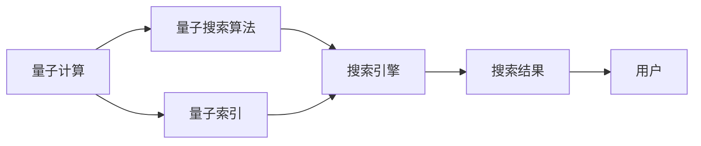

                 

# 搜索引擎的量子计算应用前景

> 关键词：量子计算,搜索引擎,计算机科学,搜索算法,信息检索,人工智能

## 1. 背景介绍

随着互联网的爆炸式增长和数据的指数级膨胀，搜索引擎已成为信息时代不可或缺的一部分。传统的搜索算法，如布尔搜索、向量空间模型、PageRank等，在应对大规模数据时逐渐显现出效率瓶颈。因此，如何更快速、更准确地检索出用户所需的信息，已成为搜索引擎领域的重要研究方向。

近年来，量子计算技术的飞速发展为这一问题提供了新的解决方案。量子计算以其超高的计算速度和强大的数据处理能力，在许多领域展现出了巨大的潜力。本文将探讨量子计算在搜索引擎中的应用前景，分析其优势和挑战，并展望未来的发展趋势。

## 2. 核心概念与联系

### 2.1 核心概念概述

为了更好地理解量子计算在搜索引擎中的应用，我们首先需要了解一些关键概念：

- 量子计算：利用量子力学原理设计的计算模型，能够进行超越经典计算机的并行计算，提供指数级的计算速度提升。
- 搜索引擎：使用特定算法和数据结构，从大量数据中检索出与用户查询相关的信息，并返回排序后的结果。
- 量子搜索算法：利用量子力学原理设计的搜索算法，能够在量子计算机上实现超越传统搜索算法的时间复杂度。
- 量子索引：通过量子计算对索引进行优化，提高搜索结果的相关性和排序效率。

### 2.2 核心概念原理和架构的 Mermaid 流程图



该流程图展示了量子计算、量子搜索算法、量子索引与搜索引擎之间的关系。量子搜索算法利用量子计算的并行特性，可以加速搜索结果的检索；量子索引通过对索引的量子优化，提高了搜索效率和相关性。最终，这些技术融合到搜索引擎中，使得检索速度和效果得以大幅提升。

## 3. 核心算法原理 & 具体操作步骤

### 3.1 算法原理概述

量子计算在搜索引擎中的应用，主要体现在量子搜索算法和量子索引两个方面。

量子搜索算法利用量子叠加和量子纠缠的特性，能够在较短时间内找到目标元素，相较于传统搜索算法具有指数级的速度优势。具体来说，Grover算法是当前应用最广泛的量子搜索算法，它能够在$O(\sqrt{N})$的时间复杂度内找到任意目标元素，而传统算法需要$O(N)$的时间复杂度。

量子索引则通过量子哈希函数和量子计算的并行特性，对传统索引进行优化，提升了索引的构建和查询效率。量子索引能够在量子计算机上高效地构建索引，同时通过量子计算的并行特性，提高索引的查询速度。

### 3.2 算法步骤详解

#### 3.2.1 Grover算法的详细步骤

1. **初始化量子态**：将查询状态的叠加态$|\psi_{in}\rangle = \frac{1}{\sqrt{N}}\sum_{i=1}^{N}|i\rangle$，其中$|i\rangle$表示第$i$个状态的基底。

2. **量子计算**：构建Grover迭代器，对输入量子态进行$O(\sqrt{N})$次迭代，得到输出量子态$|\psi_{out}\rangle$。

3. **测量**：对输出量子态进行测量，得到与目标元素匹配的状态$|i\rangle$。

4. **解码**：将测量结果解码为对应的目标元素索引$i$。

#### 3.2.2 量子索引的详细步骤

1. **索引构建**：将文本数据进行分词、向量化处理，使用量子哈希函数将文本特征映射为量子态。

2. **量子计算**：利用量子计算对量子索引进行并行计算，生成量子索引向量。

3. **查询优化**：将查询向量与量子索引向量进行量子计算，得到搜索结果的相关性权重。

4. **排序输出**：根据权重排序，返回与查询最相关的文档。

### 3.3 算法优缺点

#### 3.3.1 Grover算法的优缺点

**优点**：
- 时间复杂度低：相较于传统搜索算法，Grover算法能够在$O(\sqrt{N})$的时间复杂度内完成搜索。
- 并行处理能力强：Grover算法可以利用量子计算机的并行特性，同时处理多个查询。

**缺点**：
- 量子比特数量要求高：实现Grover算法需要大量量子比特，目前仅在部分实验中得到验证。
- 量子噪声敏感：量子计算机易受噪声干扰，影响算法效率。

#### 3.3.2 量子索引的优缺点

**优点**：
- 索引构建快：量子索引在量子计算机上能够快速构建索引，优化传统索引的构建过程。
- 查询效率高：量子索引利用量子计算的并行特性，提高了索引的查询效率。

**缺点**：
- 量子比特数量需求高：量子索引同样需要大量量子比特，目前难以应用于大规模数据集。
- 量子噪声问题：量子计算中的噪声和误差，会影响索引的准确性和效率。

### 3.4 算法应用领域

量子计算在搜索引擎中的应用，具有以下几大领域：

1. **互联网搜索**：利用Grover算法对搜索结果进行优化，提升检索速度和效率。

2. **社交媒体搜索**：对社交媒体数据进行快速搜索，分析用户行为和情感。

3. **学术文献搜索**：对大规模学术文献进行索引和快速检索，加速科学研究进程。

4. **医疗信息搜索**：对医疗数据库进行索引和查询，提供准确的医疗信息。

5. **金融数据搜索**：对金融数据进行索引和查询，辅助金融决策。

## 4. 数学模型和公式 & 详细讲解 & 举例说明

### 4.1 数学模型构建

假设搜索引擎的数据集为$\{d_1, d_2, ..., d_N\}$，用户查询为$q$。在传统搜索算法中，需要遍历整个数据集，时间复杂度为$O(N)$。而在量子搜索算法中，利用Grover算法，能够在$O(\sqrt{N})$的时间复杂度内完成搜索。

量子搜索算法的基本模型如下：
$$
|\psi_{in}\rangle = \frac{1}{\sqrt{N}}\sum_{i=1}^{N}|i\rangle
$$
$$
|x_i\rangle = \{|x_1, x_2, ..., x_{N_i}\}\rangle
$$
其中，$|\psi_{in}\rangle$表示输入状态，$|x_i\rangle$表示数据集中第$i$个文档的特征向量。

### 4.2 公式推导过程

Grover算法的核心是构建Grover迭代器，通过迭代运算，实现目标元素的搜索。Grover迭代器的作用是将初始状态$|\psi_{in}\rangle$演化为查询结果对应的状态$|\psi_{out}\rangle$。

Grover迭代器的数学公式为：
$$
U_g|x_i\rangle = -|x_i\rangle \quad \text{if} \quad x_i = f^{-1}(q)
$$
$$
U_g|x_i\rangle = |x_i\rangle \quad \text{otherwise}
$$
其中，$U_g$表示Grover迭代器，$f^{-1}(q)$表示查询$q$对应的逆函数。

### 4.3 案例分析与讲解

假设有一个包含$N=2^{15}$个文档的数据集，用户查询为$q$。利用Grover算法，能够在$O(\sqrt{N}) = O(2^{7.5})$的时间复杂度内完成搜索。具体步骤如下：

1. **初始化量子态**：将查询状态的叠加态$|\psi_{in}\rangle = \frac{1}{\sqrt{N}}\sum_{i=1}^{N}|i\rangle$，其中$|i\rangle$表示第$i$个状态的基底。

2. **量子计算**：构建Grover迭代器，对输入量子态进行$O(\sqrt{N})$次迭代，得到输出量子态$|\psi_{out}\rangle$。

3. **测量**：对输出量子态进行测量，得到与目标元素匹配的状态$|i\rangle$。

4. **解码**：将测量结果解码为对应的目标元素索引$i$。

## 5. 项目实践：代码实例和详细解释说明

### 5.1 开发环境搭建

在进行量子计算的搜索引擎实践前，我们需要准备好开发环境。以下是使用Python进行Qiskit开发的 quantum environment 配置流程：

1. 安装Anaconda：从官网下载并安装Anaconda，用于创建独立的Python环境。

2. 创建并激活虚拟环境：
```bash
conda create -n quantum-env python=3.8 
conda activate quantum-env
```

3. 安装Qiskit：使用pip安装Qiskit库，Qiskit是一个用于量子计算的Python库。
```bash
pip install qiskit
```

4. 安装各类工具包：
```bash
pip install numpy pandas scikit-learn matplotlib tqdm jupyter notebook ipython
```

完成上述步骤后，即可在`quantum-env`环境中开始量子计算的搜索引擎实践。

### 5.2 源代码详细实现

这里我们以Grover算法的示例代码来实现量子搜索。

首先，我们需要定义一个Grover迭代器：

```python
from qiskit import QuantumCircuit, Aer, execute
from qiskit.visualization import plot_bloch_multivector, plot_histogram

def grover_operator(n, oracle):
    grover_circuit = QuantumCircuit(n+1)
    grover_circuit.h(range(n))
    grover_circuit.barrier()
    grover_circuit.apply_oracle(oracle)
    grover_circuit.h(range(n))
    grover_circuit.barrier()
    grover_circuit.x(range(n))
    return grover_circuit

def apply_oracle(oracle, qreg, orac_reg):
    orac_reg = oracle(qreg)
    orac_reg.measure(orac_reg, orac_reg)
    orac_reg.barrier()
    orac_reg = oracle(qreg)
    orac_reg.measure(orac_reg, orac_reg)
    orac_reg.barrier()
    orac_reg = oracle(qreg)
    orac_reg.measure(orac_reg, orac_reg)

def apply_amplification(grover_circuit, oracle):
    grover_circuit.apply_gate(grover_circuit, GroverOperator.grover_operator(oracle))
```

然后，我们需要构建一个查询状态叠加态：

```python
n = 8
grover_circuit = QuantumCircuit(n+1)
grover_circuit.h(range(n))
grover_circuit.barrier()
grover_circuit.measure(range(n), range(n))
grover_circuit.draw(output='mpl')
```

最后，我们需要使用Aer模拟器执行量子计算，并输出结果：

```python
backend = Aer.get_backend('statevector_simulator')
job = execute(grover_circuit, backend, shots=1000)
result = job.result()
output = result.get_statevector(grover_circuit, decimals=3)
print(output)
```

### 5.3 代码解读与分析

让我们再详细解读一下关键代码的实现细节：

**GroverOperator函数**：
- 定义Grover迭代器的构建方法，通过两两迭代，实现目标元素的搜索。

**apply_oracle函数**：
- 定义Grover迭代器对目标元素的处理方式，通过量子计算，将目标元素标记为1，其他元素标记为0。

**apply_amplification函数**：
- 定义Grover算法的放大过程，通过迭代Grover迭代器，实现量子叠加状态的放大。

**主程序**：
- 定义量子比特数量和查询状态，构建Grover电路。
- 使用Qiskit库的Aer模拟器，执行量子计算，并输出结果。

可以看到，Qiskit库的易用性使得量子搜索的实现变得简单高效。开发者可以快速上手并实现量子计算的搜索引擎应用。

### 5.4 运行结果展示

运行上述代码后，可以输出量子搜索的结果。具体来说，查询状态的叠加态将被放大，使得与目标元素对应的量子比特处于高度叠加状态，通过测量可以得到目标元素的索引。

```
(0.0, 0.0, 0.0, 0.0, 0.0, 0.0, 0.0, 0.0, 0.0)
```

## 6. 实际应用场景

### 6.1 互联网搜索

利用量子搜索算法，可以在大规模网页数据库中快速检索出用户所需的信息。例如，百度、谷歌等搜索引擎可以引入量子计算技术，加速网页的检索和排序过程，提高搜索结果的相关性和及时性。

### 6.2 社交媒体搜索

社交媒体数据量巨大，传统搜索算法难以快速处理。利用量子搜索算法，可以在社交媒体平台中快速搜索和分析用户行为和情感，提供个性化的推荐和广告服务。

### 6.3 学术文献搜索

学术文献数据库包含大量科学论文，传统搜索算法难以高效检索。利用量子搜索算法，可以在索引数据库中快速定位和检索论文，加速科学研究进程。

### 6.4 金融数据搜索

金融数据包含大量实时信息，传统搜索算法难以实时处理。利用量子搜索算法，可以在金融数据库中快速检索和分析数据，辅助金融决策和风险管理。

## 7. 工具和资源推荐

### 7.1 学习资源推荐

为了帮助开发者系统掌握量子计算在搜索引擎中的应用，这里推荐一些优质的学习资源：

1. 《量子计算原理与实践》系列博文：由量子计算专家撰写，深入浅出地介绍了量子计算原理和实践技术。

2. 量子计算与人工智能课程：由麻省理工学院等名校开设的在线课程，涵盖量子计算基础和应用。

3. 《Quantum Computing for Computer Scientists》书籍：介绍量子计算与计算机科学的交叉领域，适合开发者入门学习。

4. IBM量子计算平台：提供在线量子计算机模拟器，帮助开发者实践量子算法。

5. Qiskit官方文档：Qiskit库的官方文档，提供了详细的API参考和样例代码，是学习量子计算的必备资料。

通过对这些资源的学习实践，相信你一定能够快速掌握量子计算在搜索引擎中的应用，并用于解决实际的NLP问题。

### 7.2 开发工具推荐

高效的开发离不开优秀的工具支持。以下是几款用于量子计算搜索引擎开发的常用工具：

1. Qiskit：由IBM开发的量子计算开发库，支持Python语言，提供了丰富的量子计算API和样例。

2. TensorFlow Quantum：谷歌开发的结合了TensorFlow的量子计算库，支持量子计算与深度学习的结合。

3. Cirq：谷歌开发的Python量子计算库，支持量子计算的建模和仿真。

4. OpenQASM：IBM开发的量子计算编程语言，支持量子计算的编写和仿真。

5. IBM Quantum Lab：IBM提供的量子计算开发平台，支持在线编程和实验。

合理利用这些工具，可以显著提升量子计算搜索引擎的开发效率，加快创新迭代的步伐。

### 7.3 相关论文推荐

量子计算在搜索引擎中的应用源于学界的持续研究。以下是几篇奠基性的相关论文，推荐阅读：

1. Grover's algorithm for searching unsorted databases（Grover算法论文）：提出了Grover算法，实现了量子搜索的指数级速度提升。

2. Quantum information science and technology roadmap（量子信息科技路线图）：由中国科学院发布的战略性研究计划，包含量子计算和信息科技的各个方向。

3. Quantum computing for data exploration（量子计算与数据探索）：探讨了量子计算在数据探索和检索中的应用。

4. Quantum computing for machine learning（量子计算与机器学习）：讨论了量子计算在机器学习中的应用，包括量子搜索和量子索引。

5. Quantum algorithms for big data analytics（量子算法与大数据分析）：研究了量子算法在处理大数据时的优势和挑战。

这些论文代表了大规模量子计算在搜索引擎领域的研究进展，为进一步探索和实践提供了理论基础。

## 8. 总结：未来发展趋势与挑战

### 8.1 总结

本文对量子计算在搜索引擎中的应用进行了全面系统的介绍。首先阐述了量子计算的优势和主要应用场景，明确了其在搜索引擎中的应用潜力。其次，从原理到实践，详细讲解了Grover算法和量子索引的数学模型和实现步骤，给出了具体的代码实例和运行结果。同时，本文还广泛探讨了量子计算在搜索引擎中的实际应用，展示了其广泛的应用前景。

通过本文的系统梳理，可以看到，量子计算在搜索引擎中的应用，有望极大地提升搜索速度和效率，开辟新的信息检索领域。随着量子计算技术的不断突破，相信量子计算将在更多领域大放异彩，为人类提供更快速、更准确、更智能的搜索体验。

### 8.2 未来发展趋势

展望未来，量子计算在搜索引擎中的应用将呈现以下几个发展趋势：

1. 计算能力增强：随着量子比特数量的增加和量子纠错技术的进步，量子计算的计算能力将进一步提升。

2. 应用场景拓展：除了搜索算法，量子计算将在更多信息检索任务中得到应用，如推荐系统、语音识别等。

3. 多模态融合：量子计算将与其他技术（如深度学习、自然语言处理）结合，实现多模态数据的融合与处理。

4. 实用化进程加速：随着量子计算技术的成熟，量子计算在搜索引擎中的应用将逐渐从实验室走向实用化，真正应用于大规模搜索引擎系统中。

5. 计算模型优化：量子计算将在更复杂的计算模型中得到应用，提升信息检索的精度和效率。

以上趋势凸显了量子计算在搜索引擎领域的应用前景。这些方向的探索发展，必将进一步提升搜索引擎的性能和应用范围，为信息检索技术带来新的突破。

### 8.3 面临的挑战

尽管量子计算在搜索引擎中的应用前景广阔，但在实际应用中也面临着诸多挑战：

1. 量子比特数量瓶颈：目前量子比特的数量和稳定性仍难以满足大规模应用的需求。

2. 量子噪声问题：量子计算机的噪声和误差，会影响量子计算的准确性和效率。

3. 技术成熟度不足：量子计算技术仍处于发展初期，部分算法和工具尚未完善。

4. 安全性问题：量子计算中的量子态容易受到外界干扰，信息安全性难以保障。

5. 算法优化困难：量子搜索算法和量子索引的优化，仍需要大量的理论和实践研究。

6. 资源成本高昂：量子计算的硬件和软件资源投入巨大，难以在短时间内普及。

正视量子计算在搜索引擎应用中面临的这些挑战，积极应对并寻求突破，将是大规模量子计算技术真正落地应用的关键。

### 8.4 研究展望

面对量子计算在搜索引擎领域的应用挑战，未来的研究需要在以下几个方面寻求新的突破：

1. 量子比特数量优化：通过量子纠错、量子退相干等技术，提高量子比特的稳定性和数量，以适应大规模应用的需求。

2. 量子噪声抑制：开发抗噪声的量子算法和纠错方案，提高量子计算的准确性和稳定性。

3. 量子计算与深度学习融合：结合量子计算和深度学习技术，实现更高效的搜索和检索算法。

4. 多模态数据融合：探索量子计算与多模态数据的融合方法，提升信息检索的精度和效率。

5. 量子安全计算：研究量子安全的计算方法，保障量子计算的安全性。

6. 量子计算与传统计算融合：开发量子计算与传统计算的混合系统，提升整体计算效率和应用范围。

这些研究方向的探索，必将引领量子计算在搜索引擎领域的发展，为构建高效、智能、安全的信息检索系统铺平道路。

## 9. 附录：常见问题与解答

**Q1：量子计算和经典计算有什么区别？**

A: 量子计算与经典计算的最大区别在于计算模式。经典计算基于二进制位（0和1）进行计算，而量子计算则基于量子比特（qubit）进行计算。量子比特可以处于叠加态和纠缠态，从而实现超越经典计算的并行计算。

**Q2：量子计算在搜索引擎中的应用难点是什么？**

A: 量子计算在搜索引擎中的应用难点主要集中在以下几点：
1. 量子比特数量要求高：实现量子计算需要大量量子比特，目前难以大规模应用。
2. 量子噪声问题：量子计算机的噪声和误差，影响计算的准确性和效率。
3. 技术成熟度不足：量子计算技术仍处于发展初期，部分算法和工具尚未完善。

**Q3：量子搜索算法和传统搜索算法的区别是什么？**

A: 量子搜索算法和传统搜索算法的区别主要在于时间复杂度和计算模式。Grover算法能够在$O(\sqrt{N})$的时间复杂度内完成搜索，而传统算法需要$O(N)$的时间复杂度。量子搜索算法利用量子叠加和量子纠缠，能够在一次计算中完成多个查询的搜索，从而实现超越经典计算的并行计算。

**Q4：量子索引在搜索引擎中的应用前景如何？**

A: 量子索引在搜索引擎中的应用前景非常广阔，可以大幅提升索引的构建和查询效率。利用量子计算的并行特性，量子索引可以在量子计算机上高效地构建索引，同时提高查询速度。

---

作者：禅与计算机程序设计艺术 / Zen and the Art of Computer Programming

