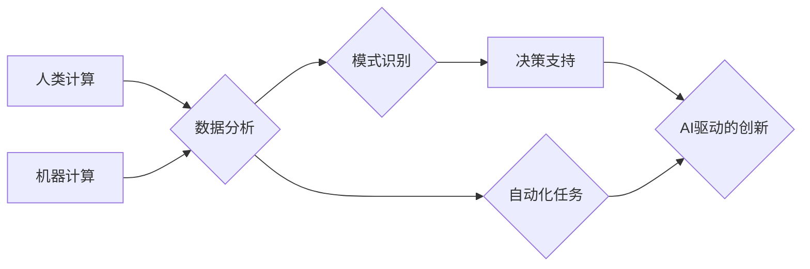

                 

## AI驱动的创新：人类计算在商业中的潜力

> 关键词：人工智能、商业创新、人类计算、机器学习、深度学习、自然语言处理、计算机视觉

### 1. 背景介绍

人工智能（AI）正以惊人的速度发展，其影响力正在深刻地改变着我们生活的方方面面。从自动驾驶汽车到智能家居，从医疗诊断到金融交易，AI技术的应用场景日益广泛。在商业领域，AI也展现出巨大的潜力，能够帮助企业提高效率、降低成本、创造新的价值。

传统商业模式往往依赖于人类的经验和判断，而AI则能够通过分析海量数据，识别出人类难以察觉的模式和趋势，从而提供更精准、更有效的决策支持。此外，AI还可以自动化许多重复性任务，释放人力资源，让员工能够专注于更具创造性和战略性的工作。

然而，AI技术的应用并非一帆风顺。目前，AI技术还面临着一些挑战，例如数据获取和处理、算法模型的训练和优化、伦理和安全等问题。

### 2. 核心概念与联系

**2.1 人类计算与机器计算**

人类计算是指人类利用自身的认知能力进行计算和推理的过程。它具有灵活性、创造力和适应性，能够处理复杂、模糊和开放式的任务。然而，人类计算的速度和效率有限，容易受到情绪、疲劳和认知偏差的影响。

机器计算是指利用计算机硬件和软件进行计算和推理的过程。它具有速度快、效率高、精确度高等特点，能够处理大量数据和复杂计算。然而，机器计算缺乏人类的灵活性和创造力，难以处理复杂、模糊和开放式的任务。

**2.2 人工智能与人类计算的融合**

AI驱动的创新在于将人类计算和机器计算相结合，发挥各自的优势，实现协同工作。

* **增强人类计算能力:** AI可以辅助人类进行数据分析、模式识别、决策支持等任务，提高人类的计算效率和准确性。例如，AI辅助诊断系统可以帮助医生更快、更准确地诊断疾病。
* **拓展机器计算能力:** 人类可以为AI提供领域知识、经验和直觉，帮助AI更好地理解和处理复杂问题。例如，人类可以为AI提供文本注释和语义解释，帮助AI更好地理解自然语言。

**2.3 AI驱动的商业创新**

AI技术的融合将为商业领域带来一系列创新，例如：

* **个性化定制:** AI可以根据用户的行为数据和偏好，提供个性化的产品、服务和体验。
* **智能自动化:** AI可以自动化许多重复性任务，例如数据录入、客户服务、订单处理等，提高效率和降低成本。
* **数据驱动决策:** AI可以分析海量数据，识别出隐藏的模式和趋势，为企业决策提供更精准的依据。
* **新产品和服务创新:** AI可以帮助企业开发新的产品和服务，例如智能家居、自动驾驶汽车、个性化医疗等。

**2.4 Mermaid 流程图**



### 3. 核心算法原理 & 具体操作步骤

**3.1 算法原理概述**

机器学习是AI的核心技术之一，它通过算法训练模型，使模型能够从数据中学习，并对新数据进行预测或分类。常见的机器学习算法包括：

* **监督学习:** 利用标记数据训练模型，例如分类和回归问题。
* **无监督学习:** 利用未标记数据发现数据中的模式和结构，例如聚类和降维。
* **强化学习:** 通过试错学习，使模型在特定环境中获得最大奖励。

**3.2 算法步骤详解**

1. **数据收集和预处理:** 收集相关数据，并进行清洗、转换和特征工程等预处理操作。
2. **模型选择:** 根据具体任务选择合适的机器学习算法。
3. **模型训练:** 利用训练数据训练模型，调整模型参数，使模型能够准确地预测或分类。
4. **模型评估:** 利用测试数据评估模型的性能，例如准确率、召回率、F1-score等。
5. **模型部署:** 将训练好的模型部署到实际应用场景中，用于预测或分类新数据。

**3.3 算法优缺点**

* **优点:** 能够自动学习数据中的模式，无需人工编程，具有强大的泛化能力。
* **缺点:** 需要大量的数据进行训练，训练过程可能耗时和耗资源，模型解释性较差。

**3.4 算法应用领域**

机器学习算法广泛应用于各个领域，例如：

* **图像识别:** 人脸识别、物体检测、图像分类等。
* **自然语言处理:** 文本分类、情感分析、机器翻译等。
* **推荐系统:** 商品推荐、内容推荐、用户画像等。
* **金融预测:** 股票预测、信用风险评估、欺诈检测等。

### 4. 数学模型和公式 & 详细讲解 & 举例说明

**4.1 数学模型构建**

机器学习模型通常可以用数学公式来表示。例如，线性回归模型的数学公式如下：

$$
y = \theta_0 + \theta_1 x_1 + \theta_2 x_2 + ... + \theta_n x_n + \epsilon
$$

其中：

* $y$ 是预测值
* $\theta_0, \theta_1, ..., \theta_n$ 是模型参数
* $x_1, x_2, ..., x_n$ 是输入特征
* $\epsilon$ 是误差项

**4.2 公式推导过程**

机器学习模型的训练过程就是通过优化模型参数，使模型的预测值与真实值之间的误差最小化。常用的优化算法包括梯度下降法、随机梯度下降法等。

**4.3 案例分析与讲解**

假设我们想要预测房价，输入特征包括房屋面积、房间数量、地理位置等。我们可以使用线性回归模型来构建预测模型。通过训练模型，我们可以得到模型参数，例如房屋面积每增加1平方米，房价会增加多少元。

### 5. 项目实践：代码实例和详细解释说明

**5.1 开发环境搭建**

可以使用Python语言和相关的机器学习库，例如Scikit-learn、TensorFlow、PyTorch等，搭建机器学习开发环境。

**5.2 源代码详细实现**

```python
from sklearn.linear_model import LinearRegression
from sklearn.model_selection import train_test_split
from sklearn.metrics import mean_squared_error

# 加载数据
data = ...

# 将数据分为训练集和测试集
X_train, X_test, y_train, y_test = train_test_split(data.drop('price', axis=1), data['price'], test_size=0.2)

# 创建线性回归模型
model = LinearRegression()

# 训练模型
model.fit(X_train, y_train)

# 预测测试集数据
y_pred = model.predict(X_test)

# 计算模型性能
mse = mean_squared_error(y_test, y_pred)
print(f'Mean Squared Error: {mse}')
```

**5.3 代码解读与分析**

这段代码演示了如何使用Scikit-learn库训练一个线性回归模型来预测房价。

* 首先，加载数据并将其分为训练集和测试集。
* 然后，创建线性回归模型并使用训练集训练模型。
* 最后，使用测试集数据预测房价，并计算模型性能。

**5.4 运行结果展示**

运行结果会显示出模型的平均平方误差（MSE），该值越小，模型的预测性能越好。

### 6. 实际应用场景

**6.1 个性化推荐系统**

AI驱动的个性化推荐系统可以根据用户的行为数据和偏好，推荐个性化的产品、服务和内容。例如，电商平台可以根据用户的购买历史和浏览记录，推荐相关的商品；音乐平台可以根据用户的听歌习惯，推荐喜欢的音乐。

**6.2 智能客服系统**

AI驱动的智能客服系统可以自动处理客户的咨询和投诉，提高客户服务效率。例如，银行可以利用AI客服系统，自动回答客户关于账户余额、交易记录等常见问题；航空公司可以利用AI客服系统，自动处理客户的航班预订、改签、退票等业务。

**6.3 医疗诊断辅助系统**

AI驱动的医疗诊断辅助系统可以帮助医生更快、更准确地诊断疾病。例如，AI可以分析患者的影像数据，识别出潜在的肿瘤或其他疾病；AI也可以分析患者的病历和症状，提供可能的诊断建议。

**6.4 未来应用展望**

AI技术的应用前景广阔，未来将有更多新的应用场景出现，例如：

* **自动驾驶汽车:** AI可以帮助汽车自动驾驶，提高交通安全和效率。
* **个性化教育:** AI可以根据学生的学习进度和能力，提供个性化的学习方案。
* **智能制造:** AI可以帮助工厂自动化生产，提高生产效率和产品质量。

### 7. 工具和资源推荐

**7.1 学习资源推荐**

* **在线课程:** Coursera、edX、Udacity等平台提供丰富的AI课程。
* **书籍:** 《深度学习》、《机器学习实战》等书籍是学习AI的经典教材。
* **博客和论坛:** Kaggle、Towards Data Science等网站提供大量的AI技术博客和论坛讨论。

**7.2 开发工具推荐**

* **Python:** Python是机器学习开发最常用的编程语言。
* **Scikit-learn:** Scikit-learn是Python最流行的机器学习库。
* **TensorFlow:** TensorFlow是Google开发的开源机器学习框架。
* **PyTorch:** PyTorch是Facebook开发的开源机器学习框架。

**7.3 相关论文推荐**

* **《ImageNet Classification with Deep Convolutional Neural Networks》**
* **《Attention Is All You Need》**
* **《BERT: Pre-training of Deep Bidirectional Transformers for Language Understanding》**

### 8. 总结：未来发展趋势与挑战

**8.1 研究成果总结**

近年来，AI技术取得了长足的进步，在各个领域都取得了显著的应用成果。例如，图像识别、自然语言处理、语音识别等领域都取得了突破性的进展。

**8.2 未来发展趋势**

未来，AI技术将继续朝着以下方向发展：

* **更强大的计算能力:** 随着硬件技术的进步，AI模型将能够处理更复杂的数据，并实现更精细的预测和分类。
* **更广泛的应用场景:** AI技术将应用于更多新的领域，例如医疗、教育、金融等。
* **更智能的算法:** AI算法将更加智能化，能够更好地理解和处理复杂问题。

**8.3 面临的挑战**

AI技术的发展也面临着一些挑战，例如：

* **数据获取和隐私问题:** AI模型的训练需要大量的数据，如何获取高质量的数据，并保护用户隐私是一个重要的挑战。
* **算法解释性和可信度:** 许多AI算法的内部机制难以理解，这使得AI模型的决策结果难以解释和信任。
* **伦理和社会影响:** AI技术的应用可能带来一些伦理和社会问题，例如就业替代、算法偏见等，需要引起重视和探讨。

**8.4 研究展望**

未来，我们需要继续加强对AI技术的研发和应用，并积极应对AI技术带来的挑战，确保AI技术能够真正造福人类。


### 9. 附录：常见问题与解答

**9.1 如何选择合适的机器学习算法？**

选择合适的机器学习算法取决于具体的任务和数据特点。例如，对于分类问题，可以考虑使用逻辑回归、支持向量机、决策树等算法；对于回归问题，可以考虑使用线性回归、支持向量回归、神经网络等算法。

**9.2 如何评估机器学习模型的性能？**

常用的机器学习模型性能评估指标包括准确率、召回率、F1-score、AUC等。

**9.3 如何处理机器学习模型中的过拟合问题？**

过拟合是指模型在训练数据上表现很好，但在测试数据上表现较差。

处理过拟合的方法包括：

* **增加训练数据量**
* **使用正则化技术**
* **使用交叉验证**
* **减少模型复杂度**


作者：禅与计算机程序设计艺术 / Zen and the Art of Computer Programming 
<end_of_turn>

