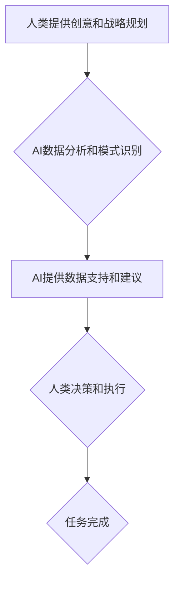

                 

## AI驱动的创新：人类计算在未来的工作

> 关键词：人工智能、人类计算、未来工作、自动化、协作、伦理、可持续发展、创新

### 1. 背景介绍

人工智能（AI）正以惊人的速度发展，深刻地改变着我们生活的方方面面。从自动驾驶汽车到个性化医疗，从智能家居到金融风控，AI技术的应用日益广泛。然而，AI的发展也引发了人们对未来工作格局的担忧和思考。

传统上，人们认为AI将取代人类工作，导致大量失业。但实际上，AI更像是人类工作能力的增强器，它将帮助我们更高效地完成工作，释放出更多的时间和精力去从事更具创造性和战略性的工作。

未来，人类和AI将协同工作，共同创造更加美好的未来。这种协作模式将需要我们重新思考工作方式，培养新的技能，并建立新的伦理规范。

### 2. 核心概念与联系

**2.1 人类计算与AI计算**

人类计算是指人类利用自身的认知能力、创造力、情感智能等进行信息处理和决策的过程。AI计算是指利用人工智能算法和模型，模拟人类智能，进行数据分析、模式识别、决策推理等任务。

**2.2 协同计算**

协同计算是指人类和AI共同完成任务的模式。在这种模式下，人类提供创意、战略规划和情感判断，而AI负责执行重复性任务、处理大量数据和提供数据分析支持。

**2.3 流程图**



**2.4 核心概念联系**

人类计算和AI计算是两种不同的计算模式，但它们可以相互补充，协同工作。协同计算将人类的优势与AI的优势结合起来，创造出更大的价值。

### 3. 核心算法原理 & 具体操作步骤

**3.1 算法原理概述**

深度学习是AI领域的核心算法之一，它能够学习复杂的数据模式，并进行精准的预测和分类。深度学习算法的核心是多层神经网络，这些神经网络由大量的节点组成，每个节点都连接着其他节点，并通过权重进行信息传递。

**3.2 算法步骤详解**

1. **数据预处理:** 将原始数据转换为深度学习算法可以理解的格式，例如归一化、编码等。
2. **网络结构设计:** 根据任务需求设计多层神经网络的结构，包括神经网络的层数、节点数量、激活函数等。
3. **模型训练:** 使用训练数据训练神经网络，通过调整网络权重，使模型能够准确地预测或分类数据。
4. **模型评估:** 使用测试数据评估模型的性能，例如准确率、召回率、F1-score等。
5. **模型调优:** 根据评估结果，调整网络结构、训练参数等，进一步提高模型性能。

**3.3 算法优缺点**

**优点:**

* 能够学习复杂的数据模式，实现高精度预测和分类。
* 具有强大的泛化能力，能够应用于多种不同的任务。

**缺点:**

* 需要大量的训练数据，训练时间较长。
* 模型解释性较差，难以理解模型的决策过程。

**3.4 算法应用领域**

* **图像识别:** 人脸识别、物体检测、图像分类等。
* **自然语言处理:** 文本分类、机器翻译、情感分析等。
* **语音识别:** 语音转文本、语音助手等。
* **推荐系统:** 商品推荐、内容推荐等。

### 4. 数学模型和公式 & 详细讲解 & 举例说明

**4.1 数学模型构建**

深度学习模型可以看作是一个复杂的函数映射，将输入数据映射到输出结果。

假设输入数据为 $x$，输出结果为 $y$，则深度学习模型可以表示为：

$$y = f(x; \theta)$$

其中，$f$ 是神经网络的激活函数，$\theta$ 是模型的参数。

**4.2 公式推导过程**

深度学习模型的训练过程是通过优化参数 $\theta$ 来实现的，目标是找到最优的参数，使得模型的预测结果与真实结果之间的误差最小。

常用的优化算法包括梯度下降法、Adam算法等。梯度下降法的核心思想是通过计算模型参数的梯度，沿着梯度负方向更新参数，逐步逼近最优解。

**4.3 案例分析与讲解**

假设我们训练一个图像分类模型，目标是将图像分类为猫或狗。

训练数据包括大量猫和狗的图像，以及对应的标签。模型的输入是图像像素值，输出是猫或狗的概率。

通过训练数据，模型学习到图像特征，并能够将图像映射到相应的类别。

**举例说明:**

假设模型输入一张猫的图像，经过多层神经网络的处理，最终输出猫的概率为0.9，狗的概率为0.1。

根据概率阈值，模型将图像分类为猫。

### 5. 项目实践：代码实例和详细解释说明

**5.1 开发环境搭建**

* Python 3.x
* TensorFlow 或 PyTorch 深度学习框架
* Jupyter Notebook 或 VS Code 开发环境

**5.2 源代码详细实现**

```python
import tensorflow as tf

# 定义模型结构
model = tf.keras.models.Sequential([
    tf.keras.layers.Conv2D(32, (3, 3), activation='relu', input_shape=(28, 28, 1)),
    tf.keras.layers.MaxPooling2D((2, 2)),
    tf.keras.layers.Conv2D(64, (3, 3), activation='relu'),
    tf.keras.layers.MaxPooling2D((2, 2)),
    tf.keras.layers.Flatten(),
    tf.keras.layers.Dense(10, activation='softmax')
])

# 编译模型
model.compile(optimizer='adam',
              loss='sparse_categorical_crossentropy',
              metrics=['accuracy'])

# 训练模型
model.fit(x_train, y_train, epochs=10)

# 评估模型
loss, accuracy = model.evaluate(x_test, y_test)
print('Test loss:', loss)
print('Test accuracy:', accuracy)
```

**5.3 代码解读与分析**

这段代码定义了一个简单的卷积神经网络模型，用于图像分类任务。

* `tf.keras.models.Sequential` 创建了一个顺序模型，将层级依次连接。
* `tf.keras.layers.Conv2D` 定义了一个卷积层，用于提取图像特征。
* `tf.keras.layers.MaxPooling2D` 定义了一个最大池化层，用于降低特征图尺寸，提高模型鲁棒性。
* `tf.keras.layers.Flatten` 将多维特征图转换为一维向量。
* `tf.keras.layers.Dense` 定义了一个全连接层，用于分类。
* `model.compile` 编译模型，指定优化器、损失函数和评价指标。
* `model.fit` 训练模型，使用训练数据进行迭代训练。
* `model.evaluate` 评估模型，使用测试数据计算模型的损失和准确率。

**5.4 运行结果展示**

训练完成后，模型能够对新的图像进行分类，并输出相应的类别概率。

### 6. 实际应用场景

**6.1 自动化办公**

AI可以自动化许多重复性办公任务，例如数据录入、邮件分类、日程安排等，释放人力资源，提高工作效率。

**6.2 个性化教育**

AI可以根据学生的学习进度和特点，提供个性化的学习内容和辅导，提高学习效率和效果。

**6.3 智能医疗**

AI可以辅助医生进行诊断、治疗方案制定和疾病预测，提高医疗诊断的准确性和效率。

**6.4 智能客服**

AI可以构建智能客服系统，自动回答客户常见问题，提供24小时在线服务，提高客户满意度。

**6.5 未来应用展望**

随着AI技术的不断发展，其应用场景将更加广泛，例如：

* **自动驾驶:** AI将推动自动驾驶汽车的普及，改变交通出行方式。
* **个性化推荐:** AI将提供更加精准的商品、内容和服务推荐，满足用户个性化需求。
* **科学研究:** AI将加速科学研究的进程，帮助科学家发现新的知识和解决复杂问题。

### 7. 工具和资源推荐

**7.1 学习资源推荐**

* **在线课程:** Coursera、edX、Udacity 等平台提供丰富的AI课程。
* **书籍:** 《深度学习》、《人工智能：一种现代方法》等书籍。
* **开源项目:** TensorFlow、PyTorch 等开源深度学习框架。

**7.2 开发工具推荐**

* **Python:** AI开发的主要编程语言。
* **Jupyter Notebook:** 用于代码编写、数据分析和可视化。
* **VS Code:** 强大的代码编辑器，支持Python和深度学习框架。

**7.3 相关论文推荐**

* **《ImageNet Classification with Deep Convolutional Neural Networks》**
* **《Attention Is All You Need》**
* **《BERT: Pre-training of Deep Bidirectional Transformers for Language Understanding》**

### 8. 总结：未来发展趋势与挑战

**8.1 研究成果总结**

近年来，AI技术取得了长足的进步，在图像识别、自然语言处理、语音识别等领域取得了突破性进展。

**8.2 未来发展趋势**

* **模型规模和能力的提升:** 未来AI模型将更加强大，能够处理更复杂的任务。
* **边缘计算和分布式训练:** AI计算将更加分散，部署在边缘设备和分布式计算集群上。
* **AI伦理和可解释性:** 随着AI应用的广泛，AI伦理和可解释性将成为更加重要的研究方向。

**8.3 面临的挑战**

* **数据获取和隐私保护:** AI模型需要大量的训练数据，如何获取高质量数据并保护用户隐私是一个挑战。
* **算法偏见和公平性:** AI算法可能存在偏见，导致不公平的结果，需要解决算法公平性问题。
* **AI安全和可控性:** 如何确保AI系统的安全性和可控性，防止其被恶意利用，是一个重要的挑战。

**8.4 研究展望**

未来，AI研究将更加注重可解释性、公平性、安全性和可持续发展，推动AI技术朝着更加安全、可靠、可控的方向发展。

### 9. 附录：常见问题与解答

**9.1 如何学习AI？**

* 关注AI领域的最新进展和研究成果。
* 学习Python编程语言和深度学习框架。
* 参加在线课程、阅读书籍和开源项目。
* 参与AI社区，与其他AI爱好者交流学习。

**9.2 AI会取代人类工作吗？**

AI更像是人类工作能力的增强器，它将帮助我们更高效地完成工作，释放出更多的时间和精力去从事更具创造性和战略性的工作。

**9.3 如何应对AI带来的挑战？**

* 培养新的技能，适应未来工作环境的变化。
* 关注AI伦理和社会影响，推动AI技术朝着更加安全、可靠、可控的方向发展。
* 积极参与AI领域的讨论和决策，共同构建AI美好的未来。


作者：禅与计算机程序设计艺术 / Zen and the Art of Computer Programming 
<end_of_turn>

