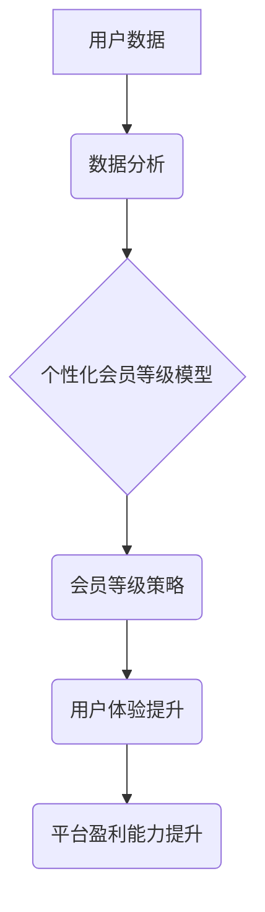

                 

## AI驱动的电商平台个性化会员等级策略

> 关键词：电商平台、会员等级、个性化推荐、机器学习、深度学习、数据分析、用户画像

## 1. 背景介绍

在当今竞争激烈的电商市场，用户体验和客户忠诚度至关重要。传统的会员等级制度通常采用简单的消费金额或积分作为评判标准，缺乏个性化和针对性。随着人工智能技术的快速发展，电商平台可以利用AI技术构建更智能、更个性化的会员等级策略，从而提升用户满意度、促进用户复购和提高平台盈利能力。

## 2. 核心概念与联系

### 2.1 会员等级策略

会员等级策略是指电商平台根据用户行为、消费习惯、偏好等因素，将用户划分为不同等级，并为不同等级的用户提供相应的权益和服务。传统的会员等级策略通常基于简单的规则，例如消费金额、积分累积等，缺乏个性化和针对性。

### 2.2 人工智能

人工智能 (AI) 是一种模拟人类智能的计算机科学领域，涵盖了机器学习、深度学习、自然语言处理等多个分支。AI技术可以帮助电商平台分析海量用户数据，识别用户行为模式，并根据这些模式进行个性化推荐和服务。

### 2.3 数据驱动

数据驱动是指利用数据分析和机器学习等技术，为决策提供依据。在电商平台的会员等级策略中，数据驱动意味着利用用户行为数据、消费数据、偏好数据等，构建个性化会员等级模型，并根据模型预测结果进行策略调整。

**核心概念架构图:**



## 3. 核心算法原理 & 具体操作步骤

### 3.1 算法原理概述

AI驱动的个性化会员等级策略通常采用机器学习算法，例如K-means聚类算法、决策树算法、支持向量机算法等，将用户划分为不同的等级。这些算法通过分析用户行为数据、消费数据、偏好数据等，识别用户之间的相似性，并根据相似性将用户分组。

### 3.2 算法步骤详解

1. **数据收集和预处理:** 收集用户行为数据、消费数据、偏好数据等，并进行清洗、转换、标准化等预处理操作。
2. **特征工程:** 从原始数据中提取特征，例如用户购买频率、平均消费金额、喜欢的商品类别等，这些特征可以用于训练机器学习模型。
3. **模型选择和训练:** 选择合适的机器学习算法，例如K-means聚类算法，并根据训练数据训练模型。
4. **模型评估和优化:** 使用测试数据评估模型性能，并根据评估结果调整模型参数，优化模型效果。
5. **会员等级划分:** 将训练好的模型应用于所有用户数据，将用户划分为不同的会员等级。
6. **策略制定和实施:** 根据不同会员等级的用户特征，制定相应的权益和服务，并通过平台系统实施。

### 3.3 算法优缺点

**优点:**

* **个性化:** 可以根据用户的实际情况，提供个性化的会员等级和服务。
* **精准度高:** 利用机器学习算法，可以识别用户之间的细微差异，实现更精准的会员等级划分。
* **动态调整:** 可以根据用户行为变化，动态调整会员等级策略，保持策略的有效性。

**缺点:**

* **数据依赖:** 需要大量用户数据进行训练和评估，数据质量直接影响模型效果。
* **算法复杂:** 需要专业的机器学习知识和技术，才能选择和训练合适的算法。
* **解释性差:** 一些机器学习算法的决策过程难以解释，难以理解模型是如何划分会员等级的。

### 3.4 算法应用领域

AI驱动的个性化会员等级策略可以应用于各种电商平台，例如：

* **服装电商:** 根据用户的购买历史、体型、风格偏好等信息，划分不同的会员等级，提供个性化的服装推荐和优惠活动。
* **食品电商:** 根据用户的饮食习惯、过敏信息、口味偏好等信息，划分不同的会员等级，提供个性化的食品推荐和健康饮食建议。
* **电子产品电商:** 根据用户的购买历史、使用习惯、技术偏好等信息，划分不同的会员等级，提供个性化的电子产品推荐和技术支持。

## 4. 数学模型和公式 & 详细讲解 & 举例说明

### 4.1 数学模型构建

在构建AI驱动的个性化会员等级策略的数学模型时，可以采用K-means聚类算法。K-means算法的目标是将数据点划分为K个簇，每个簇的中心点称为聚类中心。

### 4.2 公式推导过程

K-means算法的迭代过程如下：

1. **随机初始化K个聚类中心:** 
   $$
   \mu_1, \mu_2, ..., \mu_K
   $$

2. **计算每个数据点到每个聚类中心的距离:** 
   $$
   d(x_i, \mu_j) = ||x_i - \mu_j||^2
   $$

3. **将每个数据点分配到距离最近的聚类中心:** 
   $$
   c_i = argmin_j d(x_i, \mu_j)
   $$

4. **重新计算每个聚类中心的坐标:** 
   $$
   \mu_j = \frac{1}{N_j} \sum_{i \in C_j} x_i
   $$

   其中，$N_j$是属于第j个聚类的样本数量。

5. **重复步骤2-4，直到聚类中心不再变化:**

### 4.3 案例分析与讲解

假设我们有一个电商平台，有100个用户，我们想使用K-means算法将用户划分为3个会员等级。

1. 我们随机初始化3个聚类中心。
2. 我们计算每个用户到每个聚类中心的距离。
3. 我们将每个用户分配到距离最近的聚类中心。
4. 我们重新计算每个聚类中心的坐标。
5. 我们重复步骤2-4，直到聚类中心不再变化。

最终，我们将得到3个会员等级，每个等级的用户具有相似的消费习惯和偏好。

## 5. 项目实践：代码实例和详细解释说明

### 5.1 开发环境搭建

* Python 3.x
* scikit-learn 库
* Pandas 库
* Matplotlib 库

### 5.2 源代码详细实现

```python
import pandas as pd
from sklearn.cluster import KMeans

# 加载用户数据
data = pd.read_csv('user_data.csv')

# 选择特征
features = ['购买频率', '平均消费金额', '喜欢的商品类别']
X = data[features]

# 训练K-means模型
kmeans = KMeans(n_clusters=3, random_state=0)
kmeans.fit(X)

# 获取聚类结果
labels = kmeans.labels_

# 将聚类结果添加到用户数据中
data['会员等级'] = labels

# 保存结果
data.to_csv('user_data_with_level.csv', index=False)
```

### 5.3 代码解读与分析

* 首先，我们加载用户数据，并选择需要用于训练模型的特征。
* 然后，我们使用KMeans类训练模型，指定聚类数量为3。
* 训练完成后，我们可以获取每个用户的聚类标签，并将其添加到用户数据中。
* 最后，我们将结果保存到新的CSV文件中。

### 5.4 运行结果展示

运行代码后，我们将得到一个新的CSV文件，其中包含了用户的会员等级信息。我们可以根据会员等级信息，为不同等级的用户提供相应的权益和服务。

## 6. 实际应用场景

AI驱动的个性化会员等级策略在电商平台的实际应用场景非常广泛，例如：

* **会员推荐:** 根据用户的会员等级和偏好，推荐个性化的商品和服务。
* **优惠活动:** 为不同会员等级的用户提供不同的优惠活动和折扣。
* **会员权益:** 为不同会员等级的用户提供不同的会员权益，例如积分奖励、专属客服、优先发货等。
* **用户画像:** 通过分析不同会员等级的用户行为数据，构建用户画像，更好地了解用户的需求和偏好。

### 6.4 未来应用展望

未来，AI驱动的个性化会员等级策略将更加智能化和个性化，例如：

* **实时调整:** 根据用户的实时行为变化，动态调整会员等级和服务。
* **多维个性化:** 考虑用户的更多维度信息，例如年龄、性别、职业、兴趣爱好等，进行更精准的个性化推荐和服务。
* **跨平台融合:** 将不同平台的用户数据融合，构建更全面的用户画像，实现跨平台的个性化会员服务。

## 7. 工具和资源推荐

### 7.1 学习资源推荐

* **书籍:**
    * 《Python机器学习》
    * 《深入理解机器学习》
    * 《数据挖掘：概念与技术》
* **在线课程:**
    * Coursera: 机器学习
    * edX: 数据科学
    * Udemy: Python机器学习

### 7.2 开发工具推荐

* **Python:** 
    * scikit-learn: 机器学习库
    * Pandas: 数据分析库
    * Matplotlib: 数据可视化库
* **云平台:**
    * AWS
    * Azure
    * Google Cloud

### 7.3 相关论文推荐

* **K-means聚类算法:**
    * Lloyd, S. (1982). Least squares quantization in PCM. IEEE Transactions on Information Theory, 28(4), 40-48.
* **个性化推荐系统:**
    * Adomavicius, G., & Tuzhilin, A. (2005). Toward the next generation of recommender systems: A data-driven approach. IEEE Transactions on Knowledge and Data Engineering, 17(6), 734-749.

## 8. 总结：未来发展趋势与挑战

### 8.1 研究成果总结

AI驱动的个性化会员等级策略已经取得了显著的成果，能够有效提升用户体验和平台盈利能力。

### 8.2 未来发展趋势

未来，AI驱动的个性化会员等级策略将朝着更加智能化、个性化、跨平台的方向发展。

### 8.3 面临的挑战

* **数据隐私:** 如何保护用户数据隐私，是AI驱动的个性化会员等级策略面临的重大挑战。
* **算法解释性:** 一些机器学习算法的决策过程难以解释，难以理解模型是如何划分会员等级的。
* **公平性:** 如何确保AI驱动的会员等级策略公平公正，避免歧视和偏见，也是需要解决的问题。

### 8.4 研究展望

未来，我们需要继续研究如何解决上述挑战，并探索新的AI技术应用于会员等级策略，以实现更智能、更个性化的用户体验。

## 9. 附录：常见问题与解答

* **Q: 如何选择合适的K值？**
    * A: 可以使用肘部法则或Silhouette分析等方法来确定合适的K值。
* **Q: 如何处理缺失数据？**
    * A: 可以使用均值填充、中位数填充或其他缺失值处理方法。
* **Q: 如何评估模型性能？**
    * A: 可以使用SSE、Silhouette score等指标来评估模型性能。


作者：禅与计算机程序设计艺术 / Zen and the Art of Computer Programming 
<end_of_turn>

