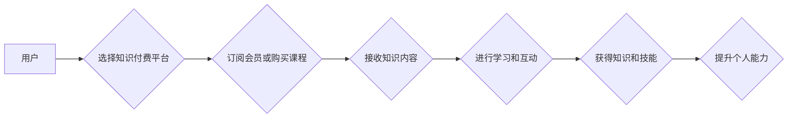

                 

## 5G时代知识付费将迎来哪些新的变革

> 关键词：5G、知识付费、虚拟现实、增强现实、云计算、人工智能、大数据

## 1. 背景介绍

知识付费作为一种新型的商业模式，近年来发展迅速，已成为互联网经济的重要组成部分。随着5G技术的普及，万物互联的时代即将到来，这将对知识付费行业带来前所未有的变革。5G网络的高带宽、低延迟和海量连接能力，为知识付费提供了全新的技术基础和应用场景。

传统知识付费模式主要以线上课程、付费文章、会员订阅等形式存在，受限于网络带宽和用户体验等因素，难以满足用户对沉浸式、互动式学习的需求。而5G技术的到来，将打破这些限制，为知识付费带来以下几方面的变革：

* **沉浸式学习体验:** 5G网络的高带宽和低延迟，可以支持更高质量的视频、音频和3D模型传输，为用户提供更加沉浸式的学习体验。
* **增强现实和虚拟现实应用:** 5G技术可以支持AR/VR技术的快速发展，将知识付费应用于虚拟课堂、模拟实验等场景，提升学习的趣味性和互动性。
* **个性化定制化学习:** 5G网络可以支持大数据分析和人工智能技术，帮助平台更好地了解用户的学习需求，提供更加个性化和定制化的学习内容。
* **实时互动和协作学习:** 5G网络的低延迟特性，可以支持实时互动和协作学习，让用户可以与老师和同学进行实时交流，共同学习和进步。

## 2. 核心概念与联系

### 2.1 5G技术概述

5G是第五代移动通信技术，相比于4G，5G具有以下特点：

* **更高的带宽:** 5G网络的理论峰值速率可达10Gbps，比4G快10倍以上。
* **更低的延迟:** 5G网络的延迟时间可低至1毫秒，比4G低10倍以上。
* **更高的连接密度:** 5G网络可以支持100万台设备连接同一个基站。

### 2.2 知识付费模式

知识付费是指通过付费的方式获取知识和技能的商业模式。常见的知识付费模式包括：

* **线上课程:** 提供各种主题的线上课程，用户可以通过付费购买课程内容。
* **付费文章:** 提供高质量的付费文章，用户可以通过付费阅读文章内容。
* **会员订阅:** 用户通过付费订阅平台，可以获得平台提供的各种知识付费内容。

### 2.3 5G与知识付费的融合

5G技术的优势可以为知识付费模式带来以下方面的提升：

* **提升学习体验:** 5G网络的高带宽和低延迟，可以支持更高质量的视频、音频和3D模型传输，为用户提供更加沉浸式的学习体验。
* **拓展应用场景:** 5G网络可以支持AR/VR技术的快速发展，将知识付费应用于虚拟课堂、模拟实验等场景，提升学习的趣味性和互动性。
* **促进个性化定制:** 5G网络可以支持大数据分析和人工智能技术，帮助平台更好地了解用户的学习需求，提供更加个性化和定制化的学习内容。

**Mermaid 流程图**



## 3. 核心算法原理 & 具体操作步骤

### 3.1  算法原理概述

知识付费平台的推荐算法是基于用户行为数据和知识内容特征，通过机器学习模型预测用户对特定知识内容的兴趣，并推荐相关内容。常用的推荐算法包括协同过滤、内容过滤和混合推荐。

* **协同过滤:** 基于用户的历史行为数据，推荐与用户兴趣相似的其他用户喜欢的知识内容。
* **内容过滤:** 基于知识内容的特征信息，推荐与用户兴趣相符的内容。
* **混合推荐:** 将协同过滤和内容过滤相结合，提高推荐的准确性和个性化程度。

### 3.2  算法步骤详解

1. **数据收集:** 收集用户行为数据，例如用户浏览记录、购买记录、评论记录等，以及知识内容的特征信息，例如主题、作者、标签等。
2. **数据预处理:** 对收集到的数据进行清洗、转换和特征提取，以便于算法模型的训练。
3. **模型训练:** 选择合适的推荐算法模型，并利用预处理后的数据进行模型训练。
4. **模型评估:** 使用测试数据对训练好的模型进行评估，并根据评估结果进行模型调优。
5. **推荐结果输出:** 将训练好的模型应用于新的用户行为数据，预测用户对特定知识内容的兴趣，并输出推荐结果。

### 3.3  算法优缺点

**优点:**

* **个性化推荐:** 可以根据用户的兴趣和需求，推荐个性化的知识内容。
* **提高用户粘性:** 通过精准推荐，可以提高用户对平台的粘性，促进用户付费。
* **数据驱动:** 基于用户行为数据和知识内容特征，推荐结果更加客观和科学。

**缺点:**

* **数据依赖:** 推荐算法的准确性依赖于数据的质量和数量。
* **冷启动问题:** 对新用户和新知识内容的推荐效果较差。
* **算法复杂度:** 一些推荐算法模型的训练和部署需要较高的计算资源和技术水平。

### 3.4  算法应用领域

推荐算法广泛应用于各个领域，例如：

* **电商:** 推荐商品、优惠券和促销活动。
* **社交媒体:** 推荐好友、帖子和话题。
* **视频网站:** 推荐视频、电视剧和电影。
* **音乐平台:** 推荐歌曲、专辑和音乐人。
* **新闻资讯:** 推荐新闻文章、视频和音频。

## 4. 数学模型和公式 & 详细讲解 & 举例说明

### 4.1  数学模型构建

协同过滤推荐算法的核心是计算用户之间和知识内容之间的相似度。常用的相似度度量方法包括余弦相似度和皮尔逊相关系数。

**余弦相似度:**

$$
\text{cosine similarity}(u, v) = \frac{u \cdot v}{||u|| ||v||}
$$

其中，u和v分别表示两个用户的向量表示，u·v表示两个向量的点积，||u||和||v||分别表示两个向量的模长。

**皮尔逊相关系数:**

$$
\text{pearson correlation}(u, v) = \frac{\sum_{i=1}^{n}(u_i - \bar{u})(v_i - \bar{v})}{\sqrt{\sum_{i=1}^{n}(u_i - \bar{u})^2} \sqrt{\sum_{i=1}^{n}(v_i - \bar{v})^2}}
$$

其中，u和v分别表示两个用户的评分向量，$\bar{u}$和$\bar{v}$分别表示两个用户的平均评分，n表示知识内容的数量。

### 4.2  公式推导过程

余弦相似度的推导过程如下：

1. 假设有两个用户u和v，他们的评分向量分别为$u = (u_1, u_2, ..., u_n)$和$v = (v_1, v_2, ..., v_n)$，其中$u_i$和$v_i$分别表示用户u和v对第i个知识内容的评分。
2. 两个向量的点积为$u \cdot v = u_1v_1 + u_2v_2 + ... + u_nv_n$。
3. 两个向量的模长分别为$||u|| = \sqrt{u_1^2 + u_2^2 + ... + u_n^2}$和$||v|| = \sqrt{v_1^2 + v_2^2 + ... + v_n^2}$。
4. 因此，余弦相似度为$cosine similarity(u, v) = \frac{u \cdot v}{||u|| ||v||}$。

### 4.3  案例分析与讲解

假设有两个用户A和B，他们的评分向量分别为$A = (5, 4, 3, 2)$和$B = (4, 3, 2, 1)$，其中每个数字表示用户对对应知识内容的评分。

使用余弦相似度计算A和B之间的相似度：

1. $A \cdot B = 5 \cdot 4 + 4 \cdot 3 + 3 \cdot 2 + 2 \cdot 1 = 20 + 12 + 6 + 2 = 40$
2. $||A|| = \sqrt{5^2 + 4^2 + 3^2 + 2^2} = \sqrt{25 + 16 + 9 + 4} = \sqrt{54}$
3. $||B|| = \sqrt{4^2 + 3^2 + 2^2 + 1^2} = \sqrt{16 + 9 + 4 + 1} = \sqrt{30}$
4. $cosine similarity(A, B) = \frac{40}{\sqrt{54} \sqrt{30}} = \frac{40}{\sqrt{1620}} \approx 0.816$

因此，A和B之间的余弦相似度约为0.816，说明他们之间的兴趣相近。

## 5. 项目实践：代码实例和详细解释说明

### 5.1  开发环境搭建

* **操作系统:** Ubuntu 20.04 LTS
* **编程语言:** Python 3.8
* **库依赖:** pandas, numpy, scikit-learn

### 5.2  源代码详细实现

```python
import pandas as pd
from sklearn.metrics.pairwise import cosine_similarity

# 加载用户评分数据
ratings_data = pd.read_csv('ratings.csv')

# 计算用户之间的余弦相似度
user_similarity = cosine_similarity(ratings_data)

# 获取用户A的相似用户
user_A_id = 1
similar_users = pd.DataFrame(user_similarity[user_A_id], index=ratings_data.user_id, columns=['similarity'])
similar_users = similar_users.sort_values(by='similarity', ascending=False)

# 打印相似用户
print(similar_users)
```

### 5.3  代码解读与分析

1. **加载用户评分数据:** 使用pandas库读取用户评分数据，数据格式为CSV文件，包含用户ID、知识内容ID和评分信息。
2. **计算用户之间的余弦相似度:** 使用scikit-learn库的`cosine_similarity`函数计算用户之间的余弦相似度矩阵。
3. **获取用户A的相似用户:** 根据用户A的ID，从相似度矩阵中获取其与其他用户的相似度值。
4. **排序相似用户:** 将相似度值降序排序，得到用户A的相似用户列表。
5. **打印相似用户:** 打印用户A的相似用户列表，包括用户ID和相似度值。

### 5.4  运行结果展示

运行代码后，将输出用户A的相似用户列表，列表中包含用户ID和相似度值，可以根据相似度值的大小，选择与用户A兴趣相似的用户进行推荐。

## 6. 实际应用场景

### 6.1  虚拟课堂

5G网络的高带宽和低延迟，可以支持虚拟课堂的实时互动和协作学习。用户可以身临其境地体验虚拟课堂，与老师和同学进行实时交流，共同学习和进步。

### 6.2  模拟实验

5G网络可以支持AR/VR技术的快速发展，将知识付费应用于模拟实验场景。用户可以身临其境地体验虚拟实验，进行操作和观察，提升学习的趣味性和互动性。

### 6.3  个性化学习路径

5G网络可以支持大数据分析和人工智能技术，帮助平台更好地了解用户的学习需求，提供更加个性化和定制化的学习路径。

### 6.4  未来应用展望

随着5G技术的普及和发展，知识付费行业将迎来更加蓬勃的发展。未来，5G技术将进一步推动知识付费的创新，例如：

* **沉浸式学习体验:** 5G网络将支持更加逼真的虚拟现实和增强现实应用，为用户提供更加沉浸式的学习体验。
* **智能化学习助手:** 5G网络将支持人工智能技术的快速发展，将智能化学习助手应用于知识付费平台，帮助用户个性化学习和提升学习效率。
* **跨界融合:** 5G网络将促进知识付费与其他行业之间的融合，例如医疗、教育、娱乐等，为用户提供更加丰富和多元化的知识付费服务。

## 7. 工具和资源推荐

### 7.1  学习资源推荐

* **Coursera:** https://www.coursera.org/
* **edX:** https://www.edx.org/
* **Udacity:** https://www.udacity.com/
* **Fast.ai:** https://www.fast.ai/

### 7.2  开发工具推荐

* **Python:** https://www.python.org/
* **pandas:** https://pandas.pydata.org/
* **numpy:** https://numpy.org/
* **scikit-learn:** https://scikit-learn.org/

### 7.3  相关论文推荐

* **Collaborative Filtering for Recommender Systems** by Su-Yin Lee and Wei-Chun Lee
* **Matrix Factorization Techniques for Recommender Systems** by Yehuda Koren
* **Deep Learning for Recommender Systems** by Xiangnan He et al.

## 8. 总结：未来发展趋势与挑战

### 8.1  研究成果总结

5G技术为知识付费行业带来了新的机遇和挑战。5G网络的高带宽、低延迟和海量连接能力，可以支持更加沉浸式、互动式和个性化的学习体验，推动知识付费模式的创新发展。

### 8.2  未来发展趋势

* **沉浸式学习体验:** 5G网络将支持更加逼真的虚拟现实和增强现实应用，为用户提供更加沉浸式的学习体验。
* **智能化学习助手:** 5G网络将支持人工智能技术的快速发展，将智能化学习助手应用于知识付费平台，帮助用户个性化学习和提升学习效率。
* **跨界融合:** 5G网络将促进知识付费与其他行业之间的融合，例如医疗、教育、娱乐等，为用户提供更加丰富和多元化的知识付费服务。

### 8.3  面临的挑战

* **技术标准和生态建设:** 5G技术的标准化和生态建设尚未完善，需要进一步的完善和发展。
* **数据安全和隐私保护:** 5G网络的应用涉及大量用户数据，需要加强数据安全和隐私保护措施。
* **内容质量和用户体验:** 5G网络带来的新技术和应用场景，需要高质量的知识内容和良好的用户体验来支撑。

### 8.4  研究展望

未来，研究者将继续探索5G技术在知识付费领域的应用，例如：

* **开发更加沉浸式和互动式的虚拟课堂和模拟实验平台。**
* **利用人工智能技术，开发更加智能化的学习助手，为用户提供个性化学习建议和支持。**
* **探索5G技术与其他行业之间的融合，开发更加丰富和多元化的知识付费服务。**

## 9. 附录：常见问题与解答

**Q1: 5G技术对知识付费的影响是什么？**

A1: 5G技术可以为知识付费行业带来以下影响：

* **提升学习体验:** 5G网络的高带宽和低延迟，可以支持更高质量的视频、音频和3D模型传输，为用户提供更加沉浸式的学习体验。
* **拓展应用场景:** 5G网络可以支持AR/VR技术的快速发展，将知识付费应用于虚拟课堂、模拟实验等场景，提升学习的趣味性和互动性。
* **促进个性化定制:** 5G网络可以支持大数据分析和人工智能技术，帮助平台更好地了解用户的学习需求，提供更加个性化和定制化的学习内容。

**Q2: 5G技术如何应用于知识付费平台？**

A2: 5G技术可以应用于知识付费平台的多个方面，例如：

* **直播课程:** 5G网络可以支持高质量的直播课程，用户可以实时观看课程内容，与老师和同学进行互动交流。
* **虚拟课堂:** 5G网络可以支持虚拟课堂的建设，用户可以身临其境地体验虚拟课堂，与老师和同学进行实时互动学习。
* **模拟实验:** 5G网络可以支持AR/VR技术的快速发展，将知识付费应用于模拟实验场景，用户可以身临其境地体验虚拟实验，进行操作和观察。
* **个性化推荐:** 5G网络可以支持大数据分析和人工智能技术，帮助平台更好地了解用户的学习需求，提供更加个性化和定制化的学习内容推荐。

**Q3: 5G技术对知识付费行业有哪些挑战？**

A3: 5G技术对知识付费行业也带来了一些挑战：

* **技术标准和生态建设:** 5G技术的标准化和生态建设尚未完善，需要进一步的完善和发展。
* **数据安全和隐私保护:** 5G网络的应用涉及大量用户数据，需要加强数据安全和隐私保护措施。
* **内容质量和用户体验:** 5G网络带来的新技术和应用场景，需要高质量的知识内容和良好的用户体验来支撑。


作者：禅与计算机程序设计艺术 / Zen and the Art of Computer Programming<end_of_turn>
<end_of_turn>


