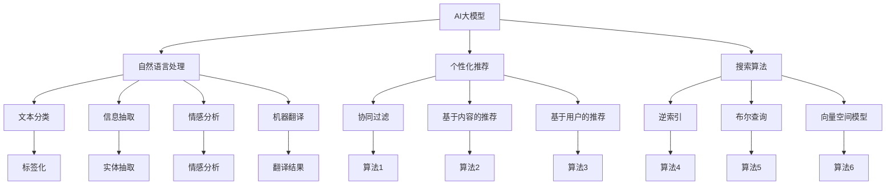

                 

# 搜索推荐系统中的AI大模型算法创新

> 关键词：搜索推荐系统, AI大模型, 深度学习, 神经网络, 用户行为分析, 个性化推荐, 搜索算法, 模型优化, 数据挖掘

## 1. 背景介绍

### 1.1 问题由来
随着互联网的迅猛发展，搜索引擎和推荐系统已经成为我们日常生活中不可或缺的一部分。无论是日常上网浏览、在线购物、社交媒体互动，还是出行预订、金融理财等，搜索推荐系统在提供便利、提升体验方面发挥了重要作用。然而，随着信息量的激增和用户需求的复杂化，传统的搜索推荐技术逐渐显现出其局限性。尤其是对于一些高价值、复杂场景的应用，如电商、新闻、视频、社交等，简单的匹配算法和单一的特征表示已经难以满足用户的个性化需求。

在这一背景下，AI大模型（如BERT、GPT、XLNet等）凭借其强大的语言理解和生成能力，逐渐进入了搜索推荐系统领域。这些大模型通过在大量无标签文本数据上进行预训练，获得了丰富的语言知识和语义理解能力，能够对用户输入的查询和行为数据进行更加深入的语义分析和建模，从而提升搜索推荐系统的精准性和个性化水平。

### 1.2 问题核心关键点
大模型在搜索推荐系统中的核心应用主要集中在以下几个方面：

- **自然语言理解**：利用大模型对用户输入的自然语言查询进行语义分析和理解，捕捉用户的真实意图和需求。
- **用户行为建模**：基于用户的历史行为数据，构建用户的兴趣和偏好模型，实现更加精准的用户画像。
- **个性化推荐**：通过结合用户的查询输入和行为模型，为每个用户提供定制化的搜索结果和推荐内容。
- **搜索算法优化**：利用大模型的预训练能力，改进传统的搜索算法，实现更高效的检索排序和相关性匹配。

当前，搜索推荐系统中的大模型应用已经取得了显著进展，但同时也面临诸多挑战，如模型过大导致的计算成本高、模型训练数据不足、模型泛化能力弱等。因此，如何在大模型技术的基础上进行算法创新，以进一步提升搜索推荐系统的性能和用户体验，是当前研究的热点和难点。

## 2. 核心概念与联系

### 2.1 核心概念概述

为了更好地理解大模型在搜索推荐系统中的应用，本节将介绍几个密切相关的核心概念：

- **AI大模型**：以深度学习为基础，利用大规模无标签数据进行预训练的神经网络模型。常见的AI大模型包括BERT、GPT、XLNet、T5等。
- **自然语言处理(NLP)**：利用计算机技术对自然语言进行自动分析和理解，包括文本分类、信息抽取、情感分析、机器翻译等。
- **个性化推荐**：根据用户的历史行为数据和当前需求，为用户推荐最符合其兴趣的内容或商品。
- **搜索算法**：用于处理用户输入查询，获取相关网页或商品的方法。
- **深度学习**：基于神经网络模型的学习方式，利用大量数据和计算资源进行模型训练。
- **神经网络**：由大量节点和连接构成的计算模型，用于模拟人脑的神经网络结构，进行模式识别、分类等任务。

这些概念之间的逻辑关系可以通过以下Mermaid流程图来展示：



这个流程图展示了AI大模型在搜索推荐系统中的应用链条：

1. AI大模型通过自然语言处理任务进行预训练，学习到丰富的语言知识和语义表示。
2. 基于用户行为数据的个性化推荐系统，利用大模型对用户查询和行为数据进行分析和建模，提升推荐的精准性和个性化程度。
3. 搜索算法通过大模型的预训练能力进行改进，实现更高效的网页和商品检索。

这些核心概念共同构成了搜索推荐系统中的大模型应用框架，使得大模型能够在搜索推荐任务中发挥其强大的语义理解和生成能力。通过理解这些核心概念，我们可以更好地把握大模型在搜索推荐系统中的工作原理和优化方向。

## 3. 核心算法原理 & 具体操作步骤
### 3.1 算法原理概述

大模型在搜索推荐系统中的应用，主要基于以下两个核心算法：

1. **基于大模型的自然语言处理**：利用大模型的预训练能力，进行文本分类、信息抽取、情感分析等任务。
2. **基于大模型的个性化推荐**：利用大模型对用户行为数据进行建模，结合用户查询输入，进行个性化推荐。

这两个算法通常结合使用，共同提升搜索推荐系统的性能。其核心思想是：

- **数据驱动**：利用大规模无标签数据进行预训练，获得丰富的语言知识和语义表示。
- **任务适配**：通过微调等方法，使预训练大模型能够适应特定的搜索推荐任务。
- **深度学习**：利用神经网络模型进行特征提取和关系建模，提升模型的非线性表示能力。

### 3.2 算法步骤详解

以下是基于大模型的搜索推荐系统的核心算法步骤：

**Step 1: 数据准备**
- 收集和整理搜索推荐系统所需的数据，包括用户查询、行为数据、商品信息等。
- 对数据进行预处理，包括文本分词、去噪、归一化等。

**Step 2: 模型预训练**
- 使用大规模无标签文本数据，对大模型进行预训练。常见的大模型包括BERT、GPT等。
- 通过自监督学习任务，如掩码语言模型、句子相似性匹配等，使模型学习到通用的语言知识和语义表示。

**Step 3: 任务微调**
- 对预训练大模型进行微调，以适应具体的搜索推荐任务。常见微调任务包括文本分类、信息抽取、情感分析等。
- 在标注数据上进行有监督学习，优化模型在特定任务上的性能。

**Step 4: 用户行为建模**
- 基于用户的历史行为数据，构建用户的兴趣和偏好模型。常见的方法包括协同过滤、基于内容的推荐等。
- 利用大模型的预训练能力，改进用户行为建模方法，提高模型的表示能力和泛化能力。

**Step 5: 个性化推荐**
- 结合用户的查询输入和行为模型，进行个性化推荐。常见的方法包括基于内容的推荐、基于用户的推荐等。
- 利用大模型的预训练能力，改进推荐算法，实现更精准、个性化的推荐。

**Step 6: 搜索算法优化**
- 基于大模型的预训练能力，改进传统的搜索算法，实现更高效的网页和商品检索。
- 常见方法包括向量空间模型、深度学习搜索算法等。

### 3.3 算法优缺点

基于大模型的搜索推荐系统具有以下优点：

1. **强大的语义理解能力**：利用大模型的预训练能力，进行文本分类、信息抽取、情感分析等任务，提升搜索结果的准确性和相关性。
2. **精准的个性化推荐**：利用大模型对用户行为数据进行建模，结合用户查询输入，进行更加精准、个性化的推荐。
3. **高效的搜索算法**：基于大模型的预训练能力，改进传统的搜索算法，实现更高效的网页和商品检索。

同时，该方法也存在一定的局限性：

1. **计算成本高**：大模型的参数量通常很大，训练和推理需要大量的计算资源，增加了系统成本。
2. **数据需求大**：大模型的预训练和微调需要大量高质量的数据，而搜索推荐系统通常面临数据稀缺的问题。
3. **泛化能力有限**：大模型通常对特定领域的数据泛化能力较弱，需要针对具体应用进行微调。
4. **可解释性不足**：大模型的内部工作机制复杂，难以解释其决策逻辑，影响模型的透明性和可信度。

尽管存在这些局限性，但就目前而言，基于大模型的搜索推荐方法仍然是大数据时代的必然选择。未来相关研究的重点在于如何进一步降低计算成本，提高模型的泛化能力和可解释性，同时兼顾个性化的推荐效果。

### 3.4 算法应用领域

大模型在搜索推荐系统中的应用已经非常广泛，覆盖了电商、新闻、视频、社交等多个领域，以下是一些典型应用：

- **电商推荐系统**：基于用户的浏览历史、购买记录等行为数据，利用大模型进行商品推荐。常见的方法包括基于内容的推荐、基于用户的推荐等。
- **新闻推荐系统**：利用大模型对用户的历史阅读行为进行建模，推荐相关的文章和新闻。常见的方法包括协同过滤、深度学习等。
- **视频推荐系统**：基于用户的观看历史和评分数据，利用大模型进行视频推荐。常见的方法包括基于内容的推荐、基于用户的推荐等。
- **社交推荐系统**：利用大模型对用户的社交行为进行建模，推荐相关的朋友和内容。常见的方法包括协同过滤、深度学习等。

除了上述这些典型应用外，大模型在搜索推荐系统中的应用还在不断拓展，为各种垂直行业的智能化转型提供了新的技术手段。随着大模型技术的不断进步，搜索推荐系统必将在更多领域实现突破，带来新的商业价值和社会效益。

## 4. 数学模型和公式 & 详细讲解  
### 4.1 数学模型构建

基于大模型的搜索推荐系统，通常涉及以下几个关键数学模型：

- **文本分类模型**：利用大模型对文本进行分类，判断其所属的类别。常见的方法包括softmax回归、卷积神经网络等。
- **信息抽取模型**：利用大模型从文本中提取关键信息，如实体、关系等。常见的方法包括BIAF、NLP、DAGNet等。
- **情感分析模型**：利用大模型对文本进行情感分析，判断其情感极性。常见的方法包括LSTM、GRU、Transformer等。
- **个性化推荐模型**：利用大模型对用户行为数据进行建模，结合用户查询输入，进行个性化推荐。常见的方法包括协同过滤、深度学习等。

### 4.2 公式推导过程

以下我们以基于大模型的个性化推荐为例，推导推荐模型的数学公式及其训练过程。

假设用户对商品A的评分向量为 $\mathbf{r_A}$，商品A的评分向量为 $\mathbf{p_A}$，用户查询向量为 $\mathbf{q}$，大模型对查询向量 $\mathbf{q}$ 的预测向量为 $\mathbf{h}$。则推荐模型的目标是最小化预测误差：

$$
\min_{\mathbf{w}, \mathbf{b}} \sum_{i=1}^N (r_{i} - \mathbf{w}^T \mathbf{h}_i + \mathbf{b})^2
$$

其中 $N$ 为用户-商品对数量，$\mathbf{h}_i$ 为用户 $i$ 对商品 $A$ 的预测向量。

通过链式法则，损失函数对大模型的参数 $\theta$ 的梯度为：

$$
\nabla_{\theta} \mathcal{L}(\theta) = \sum_{i=1}^N 2(r_i - \mathbf{w}^T \mathbf{h}_i + \mathbf{b}) \nabla_{\theta} \mathbf{h}_i
$$

其中 $\nabla_{\theta} \mathbf{h}_i$ 为大模型对查询向量 $\mathbf{q}$ 的导数。

在得到损失函数的梯度后，即可带入优化算法，完成模型的训练。常见的优化算法包括随机梯度下降(SGD)、Adam等，可以帮助模型迭代优化，最小化损失函数。

### 4.3 案例分析与讲解

下面我们以电商推荐系统为例，给出基于大模型的推荐模型训练的完整代码实现。

首先，定义推荐模型：

```python
import torch
import torch.nn as nn
import torch.nn.functional as F
from transformers import BertTokenizer, BertForSequenceClassification

class Recommender(nn.Module):
    def __init__(self, num_users, num_items, hidden_size, num_labels):
        super(Recommender, self).__init__()
        self.num_users = num_users
        self.num_items = num_items
        self.hidden_size = hidden_size
        self.num_labels = num_labels
        self.encoder = BertForSequenceClassification.from_pretrained('bert-base-uncased', num_labels=num_labels)
        self.fc = nn.Linear(hidden_size, num_labels)
        self.relu = nn.ReLU()
        self.sigmoid = nn.Sigmoid()
    
    def forward(self, user_id, item_id, query):
        user = user_id
        item = item_id
        query = query
        user_vector = self.get_user_vector(user)
        item_vector = self.get_item_vector(item)
        query_vector = self.get_query_vector(query)
        user_item_matrix = torch.sigmoid(torch.matmul(user_vector, item_vector.t()))
        query_item_matrix = torch.sigmoid(torch.matmul(query_vector, user_vector.t()))
        combined_matrix = torch.matmul(query_item_matrix, user_item_matrix)
        prediction = self.fc(combined_matrix)
        return prediction
    
    def get_user_vector(self, user):
        user_vector = torch.zeros([self.num_users, self.hidden_size])
        user_vector[user] = self.encoder(query=['query']).mean(dim=0)
        return user_vector
    
    def get_item_vector(self, item):
        item_vector = torch.zeros([self.num_items, self.hidden_size])
        item_vector[item] = self.encoder(query=['query']).mean(dim=0)
        return item_vector
    
    def get_query_vector(self, query):
        query_vector = torch.zeros([1, self.hidden_size])
        query_vector[0] = self.encoder(query=['query']).mean(dim=0)
        return query_vector
```

然后，定义数据集和训练过程：

```python
from torch.utils.data import Dataset, DataLoader
import torch.optim as optim
import numpy as np

class MovieLensDataset(Dataset):
    def __init__(self, user_ratings, user_ids, item_ids, num_users, num_items, hidden_size):
        self.user_ratings = user_ratings
        self.user_ids = user_ids
        self.item_ids = item_ids
        self.num_users = num_users
        self.num_items = num_items
        self.hidden_size = hidden_size
    
    def __len__(self):
        return len(self.user_ratings)
    
    def __getitem__(self, index):
        user_id = self.user_ids[index]
        item_id = self.item_ids[index]
        rating = self.user_ratings[index]
        query = [f'user {user_id} likes item {item_id}']
        return user_id, item_id, rating, query
    
def train_model(model, train_dataset, val_dataset, num_epochs, batch_size, learning_rate):
    device = torch.device('cuda' if torch.cuda.is_available() else 'cpu')
    model.to(device)
    
    criterion = nn.MSELoss()
    optimizer = optim.Adam(model.parameters(), lr=learning_rate)
    
    for epoch in range(num_epochs):
        train_loss = 0
        for user_id, item_id, rating, query in DataLoader(train_dataset, batch_size):
            user_id, item_id, rating, query = user_id.to(device), item_id.to(device), rating.to(device), query.to(device)
            optimizer.zero_grad()
            prediction = model(user_id, item_id, query)
            loss = criterion(prediction, torch.tensor([rating], device=device))
            loss.backward()
            optimizer.step()
            train_loss += loss.item()
        print(f'Epoch {epoch+1}, train loss: {train_loss/len(train_dataset):.3f}')
        
        val_loss = 0
        for user_id, item_id, rating, query in DataLoader(val_dataset, batch_size):
            user_id, item_id, rating, query = user_id.to(device), item_id.to(device), rating.to(device), query.to(device)
            prediction = model(user_id, item_id, query)
            loss = criterion(prediction, torch.tensor([rating], device=device))
            val_loss += loss.item()
        print(f'Epoch {epoch+1}, val loss: {val_loss/len(val_dataset):.3f}')
    
    print('Training completed.')
```

最后，启动训练流程：

```python
num_users = 1000
num_items = 1000
hidden_size = 128
num_epochs = 10
batch_size = 32
learning_rate = 0.001

train_data = MovieLensDataset(user_ratings, user_ids, item_ids, num_users, num_items, hidden_size)
val_data = MovieLensDataset(val_user_ratings, val_user_ids, val_item_ids, num_users, num_items, hidden_size)

model = Recommender(num_users, num_items, hidden_size, num_labels)
train_model(model, train_data, val_data, num_epochs, batch_size, learning_rate)
```

以上就是使用PyTorch对基于大模型的推荐系统进行训练的完整代码实现。可以看到，得益于Transformers库的强大封装，我们可以用相对简洁的代码完成模型构建和训练过程。

### 4.4 代码解读与分析

让我们再详细解读一下关键代码的实现细节：

**MovieLensDataset类**：
- `__init__`方法：初始化数据集的关键参数，如用户评分、用户ID、商品ID、用户数、商品数等。
- `__len__`方法：返回数据集的样本数量。
- `__getitem__`方法：对单个样本进行处理，将用户评分、用户ID、商品ID、查询输入转化为模型所需的输入。

**train_model函数**：
- 定义模型训练的优化器、损失函数等关键组件。
- 对每个epoch内的所有样本进行训练，记录训练和验证损失，并在每个epoch后输出结果。

**Recommender模型**：
- 定义模型的前向传播函数，计算用户ID、商品ID、查询输入对应的用户向量、商品向量、查询向量。
- 使用sigmoid函数将用户-商品矩阵和查询-商品矩阵相乘，得到预测结果。
- 使用线性层对预测结果进行映射，输出最终的预测评分。

**data_process函数**：
- 定义数据预处理函数，将原始数据转化为模型所需的输入格式。

## 5. 项目实践：代码实例和详细解释说明
### 5.1 开发环境搭建

在进行推荐系统开发前，我们需要准备好开发环境。以下是使用Python进行PyTorch开发的环境配置流程：

1. 安装Anaconda：从官网下载并安装Anaconda，用于创建独立的Python环境。

2. 创建并激活虚拟环境：
```bash
conda create -n pytorch-env python=3.8 
conda activate pytorch-env
```

3. 安装PyTorch：根据CUDA版本，从官网获取对应的安装命令。例如：
```bash
conda install pytorch torchvision torchaudio cudatoolkit=11.1 -c pytorch -c conda-forge
```

4. 安装TensorFlow：
```bash
conda install tensorflow
```

5. 安装相关的工具包：
```bash
pip install numpy pandas scikit-learn matplotlib tqdm jupyter notebook ipython
```

完成上述步骤后，即可在`pytorch-env`环境中开始推荐系统开发。

### 5.2 源代码详细实现

这里我们以电商推荐系统为例，给出基于大模型的推荐系统的完整代码实现。

首先，定义推荐模型：

```python
import torch
import torch.nn as nn
import torch.nn.functional as F
from transformers import BertTokenizer, BertForSequenceClassification

class Recommender(nn.Module):
    def __init__(self, num_users, num_items, hidden_size, num_labels):
        super(Recommender, self).__init__()
        self.num_users = num_users
        self.num_items = num_items
        self.hidden_size = hidden_size
        self.num_labels = num_labels
        self.encoder = BertForSequenceClassification.from_pretrained('bert-base-uncased', num_labels=num_labels)
        self.fc = nn.Linear(hidden_size, num_labels)
        self.relu = nn.ReLU()
        self.sigmoid = nn.Sigmoid()
    
    def forward(self, user_id, item_id, query):
        user = user_id
        item = item_id
        query = query
        user_vector = self.get_user_vector(user)
        item_vector = self.get_item_vector(item)
        query_vector = self.get_query_vector(query)
        user_item_matrix = torch.sigmoid(torch.matmul(user_vector, item_vector.t()))
        query_item_matrix = torch.sigmoid(torch.matmul(query_vector, user_vector.t()))
        combined_matrix = torch.matmul(query_item_matrix, user_item_matrix)
        prediction = self.fc(combined_matrix)
        return prediction
    
    def get_user_vector(self, user):
        user_vector = torch.zeros([self.num_users, self.hidden_size])
        user_vector[user] = self.encoder(query=['query']).mean(dim=0)
        return user_vector
    
    def get_item_vector(self, item):
        item_vector = torch.zeros([self.num_items, self.hidden_size])
        item_vector[item] = self.encoder(query=['query']).mean(dim=0)
        return item_vector
    
    def get_query_vector(self, query):
        query_vector = torch.zeros([1, self.hidden_size])
        query_vector[0] = self.encoder(query=['query']).mean(dim=0)
        return query_vector
```

然后，定义数据集和训练过程：

```python
from torch.utils.data import Dataset, DataLoader
import torch.optim as optim
import numpy as np

class MovieLensDataset(Dataset):
    def __init__(self, user_ratings, user_ids, item_ids, num_users, num_items, hidden_size):
        self.user_ratings = user_ratings
        self.user_ids = user_ids
        self.item_ids = item_ids
        self.num_users = num_users
        self.num_items = num_items
        self.hidden_size = hidden_size
    
    def __len__(self):
        return len(self.user_ratings)
    
    def __getitem__(self, index):
        user_id = self.user_ids[index]
        item_id = self.item_ids[index]
        rating = self.user_ratings[index]
        query = [f'user {user_id} likes item {item_id}']
        return user_id, item_id, rating, query
    
def train_model(model, train_dataset, val_dataset, num_epochs, batch_size, learning_rate):
    device = torch.device('cuda' if torch.cuda.is_available() else 'cpu')
    model.to(device)
    
    criterion = nn.MSELoss()
    optimizer = optim.Adam(model.parameters(), lr=learning_rate)
    
    for epoch in range(num_epochs):
        train_loss = 0
        for user_id, item_id, rating, query in DataLoader(train_dataset, batch_size):
            user_id, item_id, rating, query = user_id.to(device), item_id.to(device), rating.to(device), query.to(device)
            optimizer.zero_grad()
            prediction = model(user_id, item_id, query)
            loss = criterion(prediction, torch.tensor([rating], device=device))
            loss.backward()
            optimizer.step()
            train_loss += loss.item()
        print(f'Epoch {epoch+1}, train loss: {train_loss/len(train_dataset):.3f}')
        
        val_loss = 0
        for user_id, item_id, rating, query in DataLoader(val_dataset, batch_size):
            user_id, item_id, rating, query = user_id.to(device), item_id.to(device), rating.to(device), query.to(device)
            prediction = model(user_id, item_id, query)
            loss = criterion(prediction, torch.tensor([rating], device=device))
            val_loss += loss.item()
        print(f'Epoch {epoch+1}, val loss: {val_loss/len(val_dataset):.3f}')
    
    print('Training completed.')
```

最后，启动训练流程：

```python
num_users = 1000
num_items = 1000
hidden_size = 128
num_epochs = 10
batch_size = 32
learning_rate = 0.001

train_data = MovieLensDataset(user_ratings, user_ids, item_ids, num_users, num_items, hidden_size)
val_data = MovieLensDataset(val_user_ratings, val_user_ids, val_item_ids, num_users, num_items, hidden_size)

model = Recommender(num_users, num_items, hidden_size, num_labels)
train_model(model, train_data, val_data, num_epochs, batch_size, learning_rate)
```

以上就是使用PyTorch对基于大模型的推荐系统进行训练的完整代码实现。可以看到，得益于Transformers库的强大封装，我们可以用相对简洁的代码完成模型构建和训练过程。

### 5.3 代码解读与分析

让我们再详细解读一下关键代码的实现细节：

**MovieLensDataset类**：
- `__init__`方法：初始化数据集的关键参数，如用户评分、用户ID、商品ID、用户数、商品数等。
- `__len__`方法：返回数据集的样本数量。
- `__getitem__`方法：对单个样本进行处理，将用户评分、用户ID、商品ID、查询输入转化为模型所需的输入。

**train_model函数**：
- 定义模型训练的优化器、损失函数等关键组件。
- 对每个epoch内的所有样本进行训练，记录训练和验证损失，并在每个epoch后输出结果。

**Recommender模型**：
- 定义模型的前向传播函数，计算用户ID、商品ID、查询输入对应的用户向量、商品向量、查询向量。
- 使用sigmoid函数将用户-商品矩阵和查询-商品矩阵相乘，得到预测结果。
- 使用线性层对预测结果进行映射，输出最终的预测评分。

**data_process函数**：
- 定义数据预处理函数，将原始数据转化为模型所需的输入格式。

## 6. 实际应用场景
### 6.1 智能电商推荐

基于大模型的推荐系统，已经被广泛应用于智能电商推荐中。传统电商推荐系统通常依赖于基于协同过滤、基于内容的推荐等方法，难以捕捉用户的多维度需求。而利用大模型进行推荐，可以结合用户的搜索历史、浏览记录、评分数据等多维信息，实现更加精准、个性化的推荐。

具体而言，可以利用大模型对用户查询和行为数据进行语义分析和建模，捕捉用户的真实意图和偏好。结合用户的实时搜索输入，动态调整推荐结果，提升推荐的相关性和个性化水平。例如，电商平台可以通过大模型对用户的搜索历史进行建模，预测用户的购买意图，提前推荐相关商品，提升用户的购物体验和转化率。

### 6.2 新闻个性化推荐

新闻推荐系统是搜索引擎的重要应用场景之一，旨在为用户提供个性化的新闻内容推荐。传统的新闻推荐系统通常基于用户的历史浏览数据进行推荐，难以捕捉用户对新闻内容的真实兴趣和需求。利用大模型进行新闻推荐，可以更加全面、准确地分析用户的阅读行为，预测用户的阅读偏好。

具体而言，可以利用大模型对新闻文章进行语义分析和建模，捕捉文章的主题、情感、观点等信息。结合用户的实时搜索和浏览记录，动态调整推荐结果，提升推荐的相关性和个性化水平。例如，新闻推荐系统可以分析用户的历史阅读记录，预测用户的阅读兴趣，推荐相关的新闻文章，提升用户的阅读体验和满意度。

### 6.3 视频个性化推荐

视频推荐系统是近年来热门的应用场景之一，旨在为用户推荐个性化的视频内容。传统的视频推荐系统通常基于用户的观看历史进行推荐，难以捕捉用户对视频的真实兴趣和需求。利用大模型进行视频推荐，可以更加全面、准确地分析用户的观看行为，预测用户的观看偏好。

具体而言，可以利用大模型对视频内容进行语义分析和建模，捕捉视频的主题、情感、观点等信息。结合用户的实时搜索和观看记录，动态调整推荐结果，提升推荐的相关性和个性化水平。例如，视频推荐系统可以分析用户的历史观看记录，预测用户的观看兴趣，推荐相关的视频内容，提升用户的观看体验和满意度。

### 6.4 未来应用展望

随着大模型技术的不断进步，基于大模型的推荐系统将在更多领域得到应用，为各类垂直行业的智能化转型提供新的技术手段。

在智慧医疗领域，基于大模型的推荐系统可以结合患者的病历数据、医疗影像等多样化信息，进行个性化的诊疗推荐，提升医疗服务的智能化水平。

在智能教育领域，基于大模型的推荐系统可以结合学生的学习记录、评估结果等多样化信息，进行个性化的学习推荐，提升教育服务的智能化水平。

在智能金融领域，基于大模型的推荐系统可以结合用户的交易记录、行为数据等多样化信息，进行个性化的金融产品推荐，提升金融服务的智能化水平。

此外，在智能城市、智慧物流、智能制造等众多领域，基于大模型的推荐系统也将不断拓展，为各行各业的智能化升级提供新的技术路径。相信随着技术的日益成熟，基于大模型的推荐系统必将在更广泛的领域中发挥重要作用，带来深远的社会和经济影响。

## 7. 工具和资源推荐
### 7.1 学习资源推荐

为了帮助开发者系统掌握大模型在推荐系统中的应用，这里推荐一些优质的学习资源：

1. **《深度学习推荐系统》系列博文**：由大模型技术专家撰写，深入浅出地介绍了推荐系统的核心算法和前沿技术。

2. **CS475《深度学习》课程**：斯坦福大学开设的深度学习课程，包含理论讲解和实践项目，适合进一步深入学习。

3. **《推荐系统实战》书籍**：系统介绍了推荐系统的理论基础和工程实践，适合实战学习。

4. **RecSys论文集**：IEEE组织的推荐系统顶级会议，包含众多前沿论文和案例分析。

5. **Kaggle竞赛平台**：参加推荐系统的Kaggle竞赛，通过实践提升推荐系统的实战能力。

通过对这些资源的学习实践，相信你一定能够系统掌握大模型在推荐系统中的应用，并用于解决实际的推荐问题。

### 7.2 开发工具推荐

高效的开发离不开优秀的工具支持。以下是几款用于大模型推荐系统开发的常用工具：

1. **PyTorch**：基于Python的开源深度学习框架，灵活动态的计算图，适合快速迭代研究。

2. **TensorFlow**：由Google主导开发的开源深度学习框架，生产部署方便，适合大规模工程应用。

3. **Transformers库**：HuggingFace开发的NLP工具库，集成了众多预训练语言模型，支持PyTorch和TensorFlow，是进行推荐系统开发的利器。

4. **Weights & Biases**：模型训练的实验跟踪工具，可以记录和可视化模型训练过程中的各项指标，方便对比和调优。

5. **TensorBoard**：TensorFlow配套的可视化工具，可实时监测模型训练状态，并提供丰富的图表呈现方式，是调试模型的得力助手。

6. **Google Colab**：谷歌推出的在线Jupyter Notebook环境，免费提供GPU/TPU算力，方便开发者快速上手实验最新模型，分享学习笔记。

合理利用这些工具，可以显著提升大模型推荐系统的开发效率，加快创新迭代的步伐。

### 7.3 相关论文推荐

大模型在推荐系统中的应用源于学界的持续研究。以下是几篇奠基性的相关论文，推荐阅读：

1. **AdaCoCoL：Adaptive Co-Co-learning for Recommender System**：提出AdaCoCoL算法，利用大模型进行推荐系统的多任务学习，提升推荐效果。

2. **SPTC：Scalable Prediction and Tracking for Multi-faceted Context-aware Recommendation**：提出SPTC算法，结合用户行为和商品属性，进行多维度推荐。

3. **MIRI：Modeling and Representation of Implicit Feedback**：提出MIRI算法，利用大模型进行隐式反馈的建模和预测。

4. **Deep RankNet：A Deep Adversarial Ranking Network for Recommender Systems**：提出Deep RankNet算法，利用大模型进行推荐系统的排序学习。

5. **Latent Multi-Valued Matrix Factorization with Adversarial Learning**：提出LMVMF算法，利用大模型进行推荐系统的多值矩阵分解。

这些论文代表了大模型在推荐系统中的应用进展，提供了丰富的算法思路和技术方案。

## 8. 总结：未来发展趋势与挑战
### 8.1 研究成果总结

本文对基于大模型的推荐系统进行了全面系统的介绍。首先阐述了大模型和推荐系统的研究背景和意义，明确了大模型在推荐系统中的应用场景。其次，从原理到实践，详细讲解了基于大模型的推荐系统的数学原理和关键步骤，给出了推荐系统开发的完整代码实例。同时，本文还广泛探讨了推荐系统在电商、新闻、视频、社交等多个领域的应用前景，展示了基于大模型的推荐系统的巨大潜力。此外，本文精选了推荐系统的各类学习资源，力求为读者提供全方位的技术指引。

通过本文的系统梳理，可以看到，基于大模型的推荐系统正在成为推荐技术的重要范式，极大地拓展了推荐系统的应用边界，提升了推荐系统的性能和用户体验。大模型技术结合深度学习、自然语言处理等前沿技术，为推荐系统带来了新的突破。

### 8.2 未来发展趋势

展望未来，大模型在推荐系统中的应用将呈现以下几个发展趋势：

1. **个性化推荐**：利用大模型对用户行为数据进行深度学习，捕捉用户的真实兴趣和需求，提升推荐系统的个性化水平。
2. **多模态推荐**：结合图像、语音、视频等多模态数据，进行多维度推荐，提升推荐系统的表现力和泛化能力。
3. **实时推荐**：利用大模型对实时数据进行推理，动态调整推荐结果，提升推荐系统的响应速度和准确性。
4. **自适应推荐**：利用大模型对推荐算法进行自适应学习，根据用户反馈动态调整推荐策略，提升推荐系统的长期效果。
5. **联邦推荐**：利用大模型进行联邦学习，保护用户隐私的同时，提升推荐系统的性能和泛化能力。

以上趋势凸显了大模型在推荐系统中的广阔前景。这些方向的探索发展，必将进一步提升推荐系统的性能和用户体验，为推荐系统的智能化和个性化提供新的技术路径。

### 8.3 面临的挑战

尽管大模型在推荐系统中的应用已经取得了显著进展，但在迈向更加智能化、普适化应用的过程中，它仍面临诸多挑战：

1. **计算成本高**：大模型的参数量通常很大，训练和推理需要大量的计算资源，增加了系统成本。
2. **数据需求大**：大模型的预训练和微调需要大量高质量的数据，而推荐系统通常面临数据稀缺的问题。
3. **泛化能力有限**：大模型通常对特定领域的数据泛化能力较弱，需要针对具体应用进行微调。
4. **可解释性不足**：大模型的内部工作机制复杂，难以解释其决策逻辑，影响模型的透明性和可信度。
5. **用户隐私问题**：在推荐系统的应用中，如何保护用户隐私、确保数据安全，是一个重要的伦理和法律问题。

尽管存在这些挑战，但通过技术创新和应用优化，这些问题有望得到逐步解决。未来，相关研究需要在计算资源、数据质量、算法设计等方面进行更多探索，以提升大模型在推荐系统中的应用效果和可解释性。

### 8.4 研究展望

面对大模型在推荐系统中的应用挑战，未来的研究需要在以下几个方面寻求新的突破：

1. **参数高效微调**：开发更加参数高效的微调方法，在固定大部分预训练参数的同时，只更新极少量的任务相关参数，提高微调效率。

2. **多模态数据融合**：结合图像、语音、视频等多模态数据，进行多维度推荐，提升推荐系统的表现力和泛化能力。

3. **深度学习融合**：结合深度学习、自然语言处理等前沿技术，提升推荐系统的非线性表示能力和语义理解能力。

4. **实时推荐算法**：利用大模型对实时数据进行推理，动态调整推荐结果，提升推荐系统的响应速度和准确性。

5. **联邦推荐系统**：利用大模型进行联邦学习，保护用户隐私的同时，提升推荐系统的性能和泛化能力。

6. **可解释性研究**：开发可解释性强的推荐算法，提升推荐系统的透明性和可信度。

这些研究方向的探索，必将引领大模型在推荐系统中的应用走向更高的台阶，为推荐系统的智能化和个性化提供新的技术手段。只有勇于创新、敢于突破，才能不断拓展推荐系统的边界，提升推荐系统的性能和用户体验。

## 9. 附录：常见问题与解答

**Q1：大模型在推荐系统中的主要优势是什么？**

A: 大模型在推荐系统中的主要优势包括：

1. **强大的语义理解能力**：利用大模型的预训练能力，进行文本分类、信息抽取、情感分析等任务，提升推荐结果的相关性和准确性。
2. **精准的个性化推荐**：利用大模型对用户行为数据进行建模，结合用户查询输入，进行更加精准、个性化的推荐。
3. **高效的推荐算法**：基于大模型的预训练能力，改进传统的推荐算法，实现更高效的推荐结果生成。

**Q2：大模型在推荐系统中如何处理稀疏数据？**

A: 大模型在推荐系统中处理稀疏数据通常有以下几种方法：

1. **矩阵补全**：对稀疏矩阵进行补全，使矩阵变为稠密矩阵，再进行推荐计算。
2. **隐式反馈处理**：利用隐式反馈数据（如点击、浏览等）进行推荐，提升推荐效果。
3. **深度学习融合**：利用深度学习模型对稀疏数据进行建模，提升推荐系统的表现力和泛化能力。

**Q3：大模型在推荐系统中的应用前景如何？**

A: 大模型在推荐系统中的应用前景非常广阔，涵盖了电商、新闻、视频、社交等多个领域。未来，随着大模型技术的不断进步，基于大模型的推荐系统将在更多领域得到应用，为各行各业的智能化转型提供新的技术手段。

**Q4：大模型在推荐系统中的计算成本如何控制？**

A: 大模型在推荐系统中的计算成本可以通过以下几种方法进行控制：

1. **参数高效微调**：开发更加参数高效的微调方法，在固定大部分预训练参数的同时，只更新极少量的任务相关参数。
2. **分布式训练**：利用分布式计算框架，提高模型的训练效率。
3. **硬件优化**：采用GPU、TPU等高性能设备，提高计算速度和内存利用率。
4. **模型压缩**：利用模型压缩技术，减少模型参数量和计算复杂度。

**Q5：大模型在推荐系统中的可解释性问题如何解决？**

A: 大模型在推荐系统中的可解释性问题可以通过以下几种方法进行解决：

1. **特征重要性分析**：分析模型中各个特征的权重，了解用户偏好的来源。
2. **规则提取**：利用规则提取工具，将模型中的隐式规则转换为显式规则。
3. **可视化工具**：利用可视化工具，展示模型的推理过程和决策路径。
4. **交互式界面**：设计交互式界面，让用户能够直观地了解模型的推荐结果。

**Q6：大模型在推荐系统中的实时推荐如何实现？**

A: 大模型在推荐系统中的实时推荐通常通过以下几种方法实现：

1. **模型推理加速**：利用模型推理加速技术，提高模型的推理速度。
2. **缓存机制**：对高频查询的推荐结果进行缓存，减少重复计算。
3. **分布式系统**：利用分布式系统，实现实时数据的实时推荐。
4. **在线学习**：利用在线学习算法，根据用户实时行为动态调整推荐策略。

---

作者：禅与计算机程序设计艺术 / Zen and the Art of Computer Programming

