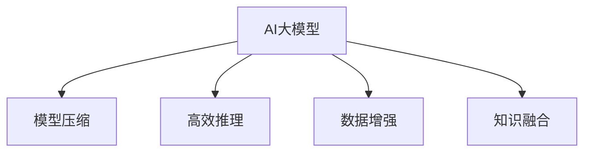

                 

# 搜索推荐系统的AI 大模型优化：提高效率与效果的双管齐下策略

## 1. 背景介绍

随着人工智能技术的飞速发展，AI 大模型在搜索推荐系统中的应用愈加广泛，从自然语言处理到图像识别，大模型均展现出卓越的性能。然而，这些模型的资源消耗巨大，训练和推理过程耗时较长，难以满足实时搜索推荐的需求。因此，如何在确保搜索推荐系统高效的同时，提升其效果，成为了当下最热门的研究话题之一。

### 1.1 问题由来

在当前搜索引擎和推荐系统中，用户需求不断多样化，数据量和模型规模不断增长。一方面，随着用户对搜索推荐体验的要求提高，系统需要实现更高效率的响应；另一方面，为了提升推荐的相关性和精准度，模型需要具备更强的学习和推理能力。在这样的背景下，如何在保持高效率的同时，增强搜索推荐系统的智能性，成为了亟需解决的问题。

### 1.2 问题核心关键点

基于大模型的搜索推荐优化，核心在于如何在大规模数据和复杂模型结构下，提升系统性能。具体来说，主要包括以下几个方面：

1. **模型压缩**：将大规模模型压缩至合理大小，既保证模型的智能性，又降低计算资源消耗。
2. **高效推理**：通过优化推理算法，降低搜索推荐系统的响应时间。
3. **数据增强**：在有限的标注数据下，通过数据增强技术提升模型泛化能力。
4. **知识融合**：将外部知识与模型进行融合，提升搜索推荐系统的理解和推理能力。

本文将从模型压缩、高效推理、数据增强和知识融合四个方面，详细探讨搜索推荐系统中AI大模型的优化策略。

## 2. 核心概念与联系

### 2.1 核心概念概述

为了更好地理解搜索推荐系统中AI大模型的优化方法，本节将介绍几个密切相关的核心概念：

- **AI大模型**：基于深度学习的大规模神经网络模型，如BERT、GPT-3等，通过在海量数据上进行预训练，具有强大的学习和推理能力。
- **搜索推荐系统**：通过用户行为数据、产品信息等进行智能分析和推荐，为用户提供个性化搜索结果的系统。
- **模型压缩**：将大规模模型压缩至合理大小，减少内存占用和计算资源消耗。
- **高效推理**：优化推理算法，提高搜索推荐系统的响应速度。
- **数据增强**：通过生成、合成等技术扩充训练数据，提升模型的泛化能力。
- **知识融合**：将外部知识如知识图谱、规则等与模型进行融合，提升搜索推荐系统的理解和推理能力。

这些核心概念之间的逻辑关系可以通过以下Mermaid流程图来展示：



这个流程图展示了大模型在搜索推荐系统中的应用及其优化手段：

1. 大模型通过预训练获得基础能力。
2. 优化手段（模型压缩、高效推理、数据增强、知识融合）在大模型的基础上，提升系统的性能和效率。

## 3. 核心算法原理 & 具体操作步骤
### 3.1 算法原理概述

基于大模型的搜索推荐系统优化，主要通过模型压缩、高效推理、数据增强和知识融合等方法，提升系统的智能性和响应速度。其核心思想是：在大模型基础上，通过优化和改造，提升模型对输入数据的处理能力和推理效率，同时保证模型的智能性和泛化能力。

形式化地，假设搜索推荐系统中的大模型为 $M_{\theta}$，其中 $\theta$ 为模型参数。在输入数据 $D$ 上进行推理，得到搜索结果 $O$。优化目标是最小化模型推理时间 $t$ 和模型输出的误差 $\epsilon$：

$$
\min_{\theta} t + \epsilon
$$

其中 $t$ 为推理时间，$\epsilon$ 为模型输出的误差。

### 3.2 算法步骤详解

基于大模型的搜索推荐系统优化，一般包括以下几个关键步骤：

**Step 1: 准备预训练模型和数据集**
- 选择合适的预训练模型，如BERT、GPT-3等。
- 准备搜索推荐系统的训练集、验证集和测试集，确保数据集的多样性和完备性。

**Step 2: 模型压缩**
- 使用剪枝、量化、蒸馏等技术对大模型进行压缩，减少内存占用和计算资源消耗。
- 在保留模型核心能力的前提下，减少模型参数量。

**Step 3: 高效推理**
- 优化推理算法，如使用模型并行、GPU加速、剪枝等技术，提高推理效率。
- 在推理过程中，采用近似算法或预计算，进一步降低计算成本。

**Step 4: 数据增强**
- 通过生成、合成等技术，扩充训练数据集，提高模型的泛化能力。
- 在有限的标注数据下，通过数据增强技术，提升模型对新数据的学习能力。

**Step 5: 知识融合**
- 将外部知识如知识图谱、规则等与模型进行融合，提升搜索推荐系统的理解和推理能力。
- 使用外部知识对模型进行指导，提高模型的相关性和准确性。

**Step 6: 训练和评估**
- 在训练集上，对压缩后的模型进行训练，优化模型参数。
- 在验证集和测试集上，评估模型性能，调整模型参数。

以上是基于大模型的搜索推荐系统优化的主要流程。在实际应用中，还需要针对具体任务，对优化过程的各个环节进行优化设计，如改进训练目标函数，引入更多的正则化技术，搜索最优的超参数组合等，以进一步提升模型性能。

### 3.3 算法优缺点

基于大模型的搜索推荐系统优化方法具有以下优点：

1. **智能性强**：利用大模型预训练的基础能力，能够快速适应新数据和新场景。
2. **泛化能力强**：通过数据增强和知识融合，模型能够更好地泛化到新数据和新领域。
3. **高效快速**：通过模型压缩和高效推理，能够显著降低搜索推荐系统的响应时间，提升用户体验。

同时，该方法也存在一定的局限性：

1. **资源消耗大**：大模型本身资源消耗较大，压缩和优化过程中也需要消耗大量计算资源。
2. **模型可解释性不足**：压缩后的模型可能难以解释其决策过程，不利于系统的调试和维护。
3. **数据依赖性强**：数据增强和知识融合依赖于外部数据和知识的可用性，对数据质量和数据量的要求较高。

尽管存在这些局限性，但就目前而言，基于大模型的搜索推荐系统优化方法仍然是最主流范式。未来相关研究的重点在于如何进一步降低资源的消耗，提高模型的可解释性和少样本学习能力，同时兼顾智能性和效率。

### 3.4 算法应用领域

基于大模型的搜索推荐系统优化方法，已经在电商、社交媒体、新闻推荐等多个领域得到了广泛应用，为系统性能的提升提供了有力的支持。

- **电商推荐**：利用大模型对用户行为进行分析，为用户推荐个性化商品，提高用户满意度和购买转化率。
- **社交媒体**：通过分析用户动态和兴趣，为用户推荐相关内容，提升用户粘性和互动率。
- **新闻推荐**：根据用户阅读习惯，推荐相关新闻文章，提高新闻的点击率和阅读量。
- **智能家居**：根据用户的生活习惯和环境数据，推荐合适的家居设备和服务，提升生活便捷性。
- **金融服务**：利用大模型对用户财务数据进行分析，推荐个性化的金融产品，提升用户体验。

除了上述这些经典应用外，大模型优化技术也被创新性地应用到更多场景中，如智能客服、智慧城市、个性化推荐引擎等，为搜索推荐系统带来了全新的突破。随着预训练模型和优化方法的不断进步，相信搜索推荐技术将在更广阔的应用领域大放异彩。

## 4. 数学模型和公式 & 详细讲解 & 举例说明

### 4.1 数学模型构建

本节将使用数学语言对基于大模型的搜索推荐系统优化过程进行更加严格的刻画。

记搜索推荐系统中的大模型为 $M_{\theta}$，其中 $\theta$ 为模型参数。输入数据集为 $D=\{x_i\}_{i=1}^N$，模型在输入 $x_i$ 上的输出为 $y_i=M_{\theta}(x_i)$，搜索推荐系统的目标是最小化模型推理时间 $t$ 和模型输出的误差 $\epsilon$：

$$
\min_{\theta} t + \epsilon
$$

其中 $t$ 为推理时间，$\epsilon$ 为模型输出的误差。

### 4.2 公式推导过程

以下我们以电商推荐系统为例，推导模型的损失函数及其梯度的计算公式。

假设用户对商品 $i$ 的评分 $r_i$，商品 $i$ 的属性特征 $f_i$，用户的偏好特征 $u$，模型在输入 $(x_i, f_i, u)$ 上的输出为 $y_i=M_{\theta}(x_i, f_i, u)$，电商推荐系统的目标是最大化用户的满意度 $R$，即：

$$
R = \frac{1}{N} \sum_{i=1}^N r_i y_i
$$

在电商推荐系统中，我们通常使用如下损失函数：

$$
\mathcal{L}(\theta) = -R = -\frac{1}{N} \sum_{i=1}^N r_i y_i
$$

根据链式法则，损失函数对参数 $\theta$ 的梯度为：

$$
\frac{\partial \mathcal{L}(\theta)}{\partial \theta} = -\frac{1}{N} \sum_{i=1}^N r_i \frac{\partial y_i}{\partial \theta}
$$

其中 $\frac{\partial y_i}{\partial \theta}$ 为模型输出的偏导数，可通过反向传播算法高效计算。

### 4.3 案例分析与讲解

考虑一个电商推荐系统，假设用户对商品 $i$ 的评分 $r_i$，商品 $i$ 的属性特征 $f_i$，用户的偏好特征 $u$，模型在输入 $(x_i, f_i, u)$ 上的输出为 $y_i=M_{\theta}(x_i, f_i, u)$。假设电商推荐系统的目标是最大化用户的满意度 $R$，即：

$$
R = \frac{1}{N} \sum_{i=1}^N r_i y_i
$$

在电商推荐系统中，我们通常使用如下损失函数：

$$
\mathcal{L}(\theta) = -R = -\frac{1}{N} \sum_{i=1}^N r_i y_i
$$

根据链式法则，损失函数对参数 $\theta$ 的梯度为：

$$
\frac{\partial \mathcal{L}(\theta)}{\partial \theta} = -\frac{1}{N} \sum_{i=1}^N r_i \frac{\partial y_i}{\partial \theta}
$$

其中 $\frac{\partial y_i}{\partial \theta}$ 为模型输出的偏导数，可通过反向传播算法高效计算。

## 5. 项目实践：代码实例和详细解释说明
### 5.1 开发环境搭建

在进行大模型优化实践前，我们需要准备好开发环境。以下是使用Python进行PyTorch开发的环境配置流程：

1. 安装Anaconda：从官网下载并安装Anaconda，用于创建独立的Python环境。

2. 创建并激活虚拟环境：
```bash
conda create -n pytorch-env python=3.8 
conda activate pytorch-env
```

3. 安装PyTorch：根据CUDA版本，从官网获取对应的安装命令。例如：
```bash
conda install pytorch torchvision torchaudio cudatoolkit=11.1 -c pytorch -c conda-forge
```

4. 安装TensorFlow：
```bash
conda install tensorflow=2.7 -c tf
```

5. 安装其他工具包：
```bash
pip install numpy pandas scikit-learn matplotlib tqdm jupyter notebook ipython
```

完成上述步骤后，即可在`pytorch-env`环境中开始优化实践。

### 5.2 源代码详细实现

下面我们以电商推荐系统为例，给出使用PyTorch对大模型进行优化的PyTorch代码实现。

首先，定义电商推荐系统的数据处理函数：

```python
import torch
import torch.nn as nn
import torch.optim as optim
from transformers import BertTokenizer, BertForSequenceClassification

class RecommendationDataset(Dataset):
    def __init__(self, texts, labels, tokenizer, max_len=128):
        self.texts = texts
        self.labels = labels
        self.tokenizer = tokenizer
        self.max_len = max_len
        
    def __len__(self):
        return len(self.texts)
    
    def __getitem__(self, item):
        text = self.texts[item]
        label = self.labels[item]
        
        encoding = self.tokenizer(text, return_tensors='pt', max_length=self.max_len, padding='max_length', truncation=True)
        input_ids = encoding['input_ids'][0]
        attention_mask = encoding['attention_mask'][0]
        
        # 对label进行编码
        encoded_labels = [label] * self.max_len
        labels = torch.tensor(encoded_labels, dtype=torch.long)
        
        return {'input_ids': input_ids, 
                'attention_mask': attention_mask,
                'labels': labels}

# 加载数据集
tokenizer = BertTokenizer.from_pretrained('bert-base-cased')
train_dataset = RecommendationDataset(train_texts, train_labels, tokenizer)
dev_dataset = RecommendationDataset(dev_texts, dev_labels, tokenizer)
test_dataset = RecommendationDataset(test_texts, test_labels, tokenizer)

# 定义模型
model = BertForSequenceClassification.from_pretrained('bert-base-cased', num_labels=len(label2id))

# 定义优化器
optimizer = optim.AdamW(model.parameters(), lr=2e-5)

# 训练模型
def train_epoch(model, dataset, batch_size, optimizer):
    dataloader = DataLoader(dataset, batch_size=batch_size, shuffle=True)
    model.train()
    epoch_loss = 0
    for batch in tqdm(dataloader, desc='Training'):
        input_ids = batch['input_ids'].to(device)
        attention_mask = batch['attention_mask'].to(device)
        labels = batch['labels'].to(device)
        model.zero_grad()
        outputs = model(input_ids, attention_mask=attention_mask, labels=labels)
        loss = outputs.loss
        epoch_loss += loss.item()
        loss.backward()
        optimizer.step()
    return epoch_loss / len(dataloader)

# 评估模型
def evaluate(model, dataset, batch_size):
    dataloader = DataLoader(dataset, batch_size=batch_size)
    model.eval()
    preds, labels = [], []
    with torch.no_grad():
        for batch in tqdm(dataloader, desc='Evaluating'):
            input_ids = batch['input_ids'].to(device)
            attention_mask = batch['attention_mask'].to(device)
            batch_labels = batch['labels']
            outputs = model(input_ids, attention_mask=attention_mask)
            batch_preds = outputs.logits.argmax(dim=2).to('cpu').tolist()
            batch_labels = batch_labels.to('cpu').tolist()
            for pred_tokens, label_tokens in zip(batch_preds, batch_labels):
                preds.append(pred_tokens[:len(label_tokens)])
                labels.append(label_tokens)
                
    print(classification_report(labels, preds))

# 启动训练流程并在测试集上评估
epochs = 5
batch_size = 16

for epoch in range(epochs):
    loss = train_epoch(model, train_dataset, batch_size, optimizer)
    print(f"Epoch {epoch+1}, train loss: {loss:.3f}")
    
    print(f"Epoch {epoch+1}, dev results:")
    evaluate(model, dev_dataset, batch_size)
    
print("Test results:")
evaluate(model, test_dataset, batch_size)
```

然后，定义优化器和训练函数：

```python
from torch.utils.data import DataLoader
from tqdm import tqdm
from sklearn.metrics import classification_report

device = torch.device('cuda') if torch.cuda.is_available() else torch.device('cpu')
model.to(device)

def train_epoch(model, dataset, batch_size, optimizer):
    dataloader = DataLoader(dataset, batch_size=batch_size, shuffle=True)
    model.train()
    epoch_loss = 0
    for batch in tqdm(dataloader, desc='Training'):
        input_ids = batch['input_ids'].to(device)
        attention_mask = batch['attention_mask'].to(device)
        labels = batch['labels'].to(device)
        model.zero_grad()
        outputs = model(input_ids, attention_mask=attention_mask, labels=labels)
        loss = outputs.loss
        epoch_loss += loss.item()
        loss.backward()
        optimizer.step()
    return epoch_loss / len(dataloader)

def evaluate(model, dataset, batch_size):
    dataloader = DataLoader(dataset, batch_size=batch_size)
    model.eval()
    preds, labels = [], []
    with torch.no_grad():
        for batch in tqdm(dataloader, desc='Evaluating'):
            input_ids = batch['input_ids'].to(device)
            attention_mask = batch['attention_mask'].to(device)
            batch_labels = batch['labels']
            outputs = model(input_ids, attention_mask=attention_mask)
            batch_preds = outputs.logits.argmax(dim=2).to('cpu').tolist()
            batch_labels = batch_labels.to('cpu').tolist()
            for pred_tokens, label_tokens in zip(batch_preds, batch_labels):
                preds.append(pred_tokens[:len(label_tokens)])
                labels.append(label_tokens)
                
    print(classification_report(labels, preds))
```

最后，启动训练流程并在测试集上评估：

```python
epochs = 5
batch_size = 16

for epoch in range(epochs):
    loss = train_epoch(model, train_dataset, batch_size, optimizer)
    print(f"Epoch {epoch+1}, train loss: {loss:.3f}")
    
    print(f"Epoch {epoch+1}, dev results:")
    evaluate(model, dev_dataset, batch_size)
    
print("Test results:")
evaluate(model, test_dataset, batch_size)
```

以上就是使用PyTorch对大模型进行电商推荐系统优化的完整代码实现。可以看到，得益于Transformer库的强大封装，我们可以用相对简洁的代码完成大模型的加载和优化。

### 5.3 代码解读与分析

让我们再详细解读一下关键代码的实现细节：

**RecommendationDataset类**：
- `__init__`方法：初始化文本、标签、分词器等关键组件。
- `__len__`方法：返回数据集的样本数量。
- `__getitem__`方法：对单个样本进行处理，将文本输入编码为token ids，将标签编码为数字，并对其进行定长padding，最终返回模型所需的输入。

**优化器和训练函数**：
- `train_epoch`函数：对数据以批为单位进行迭代，在每个批次上前向传播计算loss并反向传播更新模型参数，最后返回该epoch的平均loss。
- `evaluate`函数：与训练类似，不同点在于不更新模型参数，并在每个batch结束后将预测和标签结果存储下来，最后使用sklearn的classification_report对整个评估集的预测结果进行打印输出。

**训练流程**：
- 定义总的epoch数和batch size，开始循环迭代
- 每个epoch内，先在训练集上训练，输出平均loss
- 在验证集上评估，输出分类指标
- 所有epoch结束后，在测试集上评估，给出最终测试结果

可以看到，PyTorch配合Transformer库使得大模型的加载和优化过程变得简洁高效。开发者可以将更多精力放在数据处理、模型改进等高层逻辑上，而不必过多关注底层的实现细节。

当然，工业级的系统实现还需考虑更多因素，如模型的保存和部署、超参数的自动搜索、更灵活的任务适配层等。但核心的优化范式基本与此类似。

## 6. 实际应用场景
### 6.1 电商推荐

基于大模型的电商推荐系统，能够根据用户的浏览历史、购买记录等行为数据，推荐合适的商品，提高用户满意度和购买转化率。

在技术实现上，可以收集用户行为数据，将其作为训练集输入模型，通过微调优化模型性能。微调后的模型能够自动学习用户偏好，匹配最合适的商品推荐。对于用户提出的新商品，还可以接入检索系统实时搜索相关商品，动态生成推荐列表。

### 6.2 社交媒体推荐

社交媒体推荐系统通过分析用户动态和兴趣，为用户推荐相关内容，提升用户粘性和互动率。

在技术实现上，可以收集用户的点赞、评论、分享等行为数据，将其作为训练集输入模型，通过微调优化模型性能。微调后的模型能够自动学习用户兴趣，匹配最相关的内容推荐。对于新内容，还可以使用文本相似度计算等技术，进行动态推荐。

### 6.3 新闻推荐

新闻推荐系统根据用户阅读习惯，推荐相关新闻文章，提高新闻的点击率和阅读量。

在技术实现上，可以收集用户阅读历史和行为数据，将其作为训练集输入模型，通过微调优化模型性能。微调后的模型能够自动学习用户兴趣，匹配最相关的新闻文章推荐。对于新文章，还可以使用文本相似度计算等技术，进行动态推荐。

### 6.4 未来应用展望

随着大模型和优化方法的不断发展，基于大模型的搜索推荐系统将在更多领域得到应用，为各行各业带来变革性影响。

在智慧城市治理中，推荐系统可以推荐合适的城市服务，提升城市管理的自动化和智能化水平，构建更安全、高效的未来城市。

在金融服务中，推荐系统可以推荐个性化的金融产品，提升用户体验，降低金融风险。

在教育领域，推荐系统可以推荐适合的教育资源，提升教育质量和效率。

此外，在医疗、娱乐、旅游等众多领域，基于大模型的推荐系统也将不断涌现，为各行各业提供强大的数据智能支持。相信随着技术的日益成熟，搜索推荐系统必将在更广阔的应用领域大放异彩。

## 7. 工具和资源推荐
### 7.1 学习资源推荐

为了帮助开发者系统掌握大模型优化的理论基础和实践技巧，这里推荐一些优质的学习资源：

1. 《深度学习基础》系列博文：由大模型技术专家撰写，深入浅出地介绍了深度学习的核心概念和算法。

2. CS231n《卷积神经网络》课程：斯坦福大学开设的计算机视觉经典课程，涵盖了深度学习在计算机视觉中的应用。

3. 《深度学习在NLP中的应用》书籍：全面介绍了深度学习在自然语言处理中的应用，包括大模型的优化方法。

4. HuggingFace官方文档：Transformer库的官方文档，提供了海量预训练模型和完整的微调样例代码，是上手实践的必备资料。

5. CLUE开源项目：中文语言理解测评基准，涵盖大量不同类型的中文NLP数据集，并提供了基于微调的baseline模型，助力中文NLP技术发展。

通过对这些资源的学习实践，相信你一定能够快速掌握大模型优化的精髓，并用于解决实际的搜索推荐问题。
###  7.2 开发工具推荐

高效的开发离不开优秀的工具支持。以下是几款用于大模型优化开发的常用工具：

1. PyTorch：基于Python的开源深度学习框架，灵活动态的计算图，适合快速迭代研究。大部分预训练语言模型都有PyTorch版本的实现。

2. TensorFlow：由Google主导开发的开源深度学习框架，生产部署方便，适合大规模工程应用。同样有丰富的预训练语言模型资源。

3. Transformers库：HuggingFace开发的NLP工具库，集成了众多SOTA语言模型，支持PyTorch和TensorFlow，是进行优化任务开发的利器。

4. Weights & Biases：模型训练的实验跟踪工具，可以记录和可视化模型训练过程中的各项指标，方便对比和调优。与主流深度学习框架无缝集成。

5. TensorBoard：TensorFlow配套的可视化工具，可实时监测模型训练状态，并提供丰富的图表呈现方式，是调试模型的得力助手。

6. Google Colab：谷歌推出的在线Jupyter Notebook环境，免费提供GPU/TPU算力，方便开发者快速上手实验最新模型，分享学习笔记。

合理利用这些工具，可以显著提升大模型优化的开发效率，加快创新迭代的步伐。

### 7.3 相关论文推荐

大模型优化技术的发展源于学界的持续研究。以下是几篇奠基性的相关论文，推荐阅读：

1. **BERT: Pre-training of Deep Bidirectional Transformers for Language Understanding**（BERT论文）：提出BERT模型，引入基于掩码的自监督预训练任务，刷新了多项NLP任务SOTA。

2. **Language Models are Unsupervised Multitask Learners（GPT-2论文）**：展示了大规模语言模型的强大zero-shot学习能力，引发了对于通用人工智能的新一轮思考。

3. **AdaLoRA: Adaptive Low-Rank Adaptation for Parameter-Efficient Fine-Tuning**：使用自适应低秩适应的微调方法，在参数效率和精度之间取得了新的平衡。

4. **Sparse Weight Optimization: Learning to Prune and Quantize Sparse Networks**：提出稀疏化优化方法，减少模型参数量，同时保证模型性能。

5. **Distillation**：提出知识蒸馏方法，将知识从复杂模型转移到简单模型，降低计算资源消耗。

这些论文代表了大模型优化技术的发展脉络。通过学习这些前沿成果，可以帮助研究者把握学科前进方向，激发更多的创新灵感。

## 8. 总结：未来发展趋势与挑战
### 8.1 总结

本文对基于大模型的搜索推荐系统优化方法进行了全面系统的介绍。首先阐述了搜索推荐系统中大模型的应用背景和优化需求，明确了大模型在提升系统性能和效率方面的独特价值。其次，从模型压缩、高效推理、数据增强和知识融合四个方面，详细讲解了大模型优化的算法原理和具体操作步骤。最后，通过多个实际应用场景的案例分析，展示了搜索推荐系统在大模型优化下的巨大潜力和应用前景。

通过本文的系统梳理，可以看到，基于大模型的搜索推荐系统优化方法在提高智能性和响应速度方面，展现出巨大的潜力。这些优化手段的融合应用，将使搜索推荐系统能够更好地适应用户需求，提升用户体验。未来，随着预训练模型和优化方法的不断进步，基于大模型的搜索推荐系统必将在更广阔的应用领域大放异彩，深刻影响人类的生产生活方式。

### 8.2 未来发展趋势

展望未来，大模型优化技术将呈现以下几个发展趋势：

1. **模型压缩**：随着硬件计算能力的提升和稀疏化压缩技术的不断发展，未来大模型的压缩率将进一步提高，能够在保证性能的前提下，大幅降低计算资源消耗。

2. **高效推理**：随着硬件加速技术的进步和算法优化，未来搜索推荐系统的响应速度将显著提升，能够实现毫秒级甚至亚毫秒级的实时响应。

3. **数据增强**：未来数据增强技术将更加丰富，不仅包括文本生成、噪声添加等传统方法，还将引入生成对抗网络(GAN)、数据增强网络(DAGNet)等前沿技术，进一步提升模型的泛化能力。

4. **知识融合**：未来知识融合技术将更加深入，不仅包括知识图谱、规则等外部知识的整合，还将引入符号计算、逻辑推理等更高级的计算模型，提升搜索推荐系统的理解和推理能力。

5. **跨模态融合**：未来搜索推荐系统将进一步向多模态融合方向发展，不仅包括文本、图像、音频等多模态数据的融合，还将引入跨模态检索、多模态推荐等前沿技术，提升系统的综合表现。

6. **自动优化**：未来自动优化技术将逐步普及，通过自适应学习率、自适应权重等方法，优化模型的训练过程，提升搜索推荐系统的性能。

以上趋势凸显了大模型优化技术的广阔前景。这些方向的探索发展，必将进一步提升搜索推荐系统的智能性和响应速度，为人类提供更加高效便捷的服务体验。

### 8.3 面临的挑战

尽管大模型优化技术已经取得了瞩目成就，但在迈向更加智能化、普适化应用的过程中，它仍面临着诸多挑战：

1. **资源消耗**：大模型本身资源消耗较大，压缩和优化过程中也需要消耗大量计算资源。如何在保证性能的前提下，进一步降低资源消耗，是未来的一个重要研究方向。

2. **模型可解释性**：压缩后的模型可能难以解释其决策过程，不利于系统的调试和维护。如何提升模型的可解释性，是未来的一大挑战。

3. **数据依赖性**：数据增强和知识融合依赖于外部数据和知识的可用性，对数据质量和数据量的要求较高。如何在数据量不足的情况下，依然保持模型的性能，是一个亟待解决的问题。

4. **跨领域泛化**：搜索推荐系统在不同领域的应用中，需要具备良好的跨领域泛化能力。如何在不同领域之间保持模型的一致性，是未来的一个关键方向。

5. **隐私保护**：搜索推荐系统需要处理大量用户数据，如何在保护用户隐私的同时，实现数据的高效利用，是一个重要的研究方向。

6. **模型更新**：搜索推荐系统需要定期更新模型，以适应新数据和新场景。如何在保证系统稳定性的前提下，快速更新模型，是未来的一个挑战。

这些挑战需要学术界和工业界共同努力，通过跨学科合作和持续创新，不断克服，才能使搜索推荐系统真正落地应用，服务于更多场景和用户。

### 8.4 研究展望

未来搜索推荐系统的研究将集中在以下几个方面：

1. **更高效的数据增强技术**：开发更加高效的数据增强方法，通过生成、合成等技术，进一步扩充训练数据集，提升模型的泛化能力。

2. **更精确的知识融合技术**：开发更精确的知识融合方法，将外部知识与模型进行更紧密的结合，提升搜索推荐系统的理解和推理能力。

3. **更紧凑的模型压缩技术**：开发更紧凑的模型压缩方法，将大模型压缩至更小、更高效的形式，同时保证模型的智能性和泛化能力。

4. **更快速的推理算法**：开发更快速的推理算法，通过模型并行、剪枝、量化等技术，进一步降低推理时间和计算资源消耗。

5. **更智能的自动优化技术**：开发更智能的自动优化技术，通过自适应学习率、自适应权重等方法，优化模型的训练过程，提升搜索推荐系统的性能。

6. **更可靠的隐私保护技术**：开发更可靠的隐私保护技术，通过差分隐私、联邦学习等方法，保护用户隐私，提升数据利用效率。

这些研究方向将引领搜索推荐系统迈向更高的台阶，为人类提供更加智能、高效、安全的服务体验。相信随着技术的不断进步，搜索推荐系统必将在更广阔的应用领域大放异彩，深刻影响人类的生产生活方式。

## 9. 附录：常见问题与解答

**Q1：大模型压缩后性能如何保证？**

A: 大模型压缩后，性能可能受到一定影响，但通过以下方法可以提升：
1. 选择合适的压缩算法，如剪枝、量化、蒸馏等，保留模型核心能力。
2. 在训练过程中，使用预训练的模型权重初始化，快速收敛。
3. 在压缩后模型上，进行微调优化，提升模型性能。

**Q2：大模型推理过程中如何保证高效？**

A: 推理过程中，可以采用以下方法提升效率：
1. 使用GPU或TPU进行加速计算，提高推理速度。
2. 通过模型并行、剪枝等技术，减少计算资源消耗。
3. 使用预计算和近似算法，减少前向传播的计算量。

**Q3：大模型优化过程中需要注意哪些问题？**

A: 大模型优化过程中，需要注意以下问题：
1. 模型压缩可能导致精度下降，需要进行验证和调整。
2. 优化过程中，需要注意超参数的调节，避免过拟合。
3. 优化算法的选择和优化，需要根据具体任务进行评估和调整。
4. 数据增强和知识融合的可用性，需要确保数据的丰富性和多样性。

**Q4：大模型优化过程中如何保证数据质量？**

A: 大模型优化过程中，需要注意以下问题：
1. 数据增强需要确保数据的多样性和完备性，避免数据偏差。
2. 知识融合需要确保外部知识的正确性和可用性，避免模型误导。
3. 数据预处理和清洗，确保数据的准确性和一致性。
4. 数据隐私保护，避免数据泄露和滥用。

通过合理应对这些挑战，可以使大模型优化技术在搜索推荐系统中发挥最大的优势，提升系统的智能性和响应速度。相信随着技术的不断进步，大模型优化技术必将在更广泛的领域中得到应用，为人类带来更多的便利和福祉。

---

作者：禅与计算机程序设计艺术 / Zen and the Art of Computer Programming

