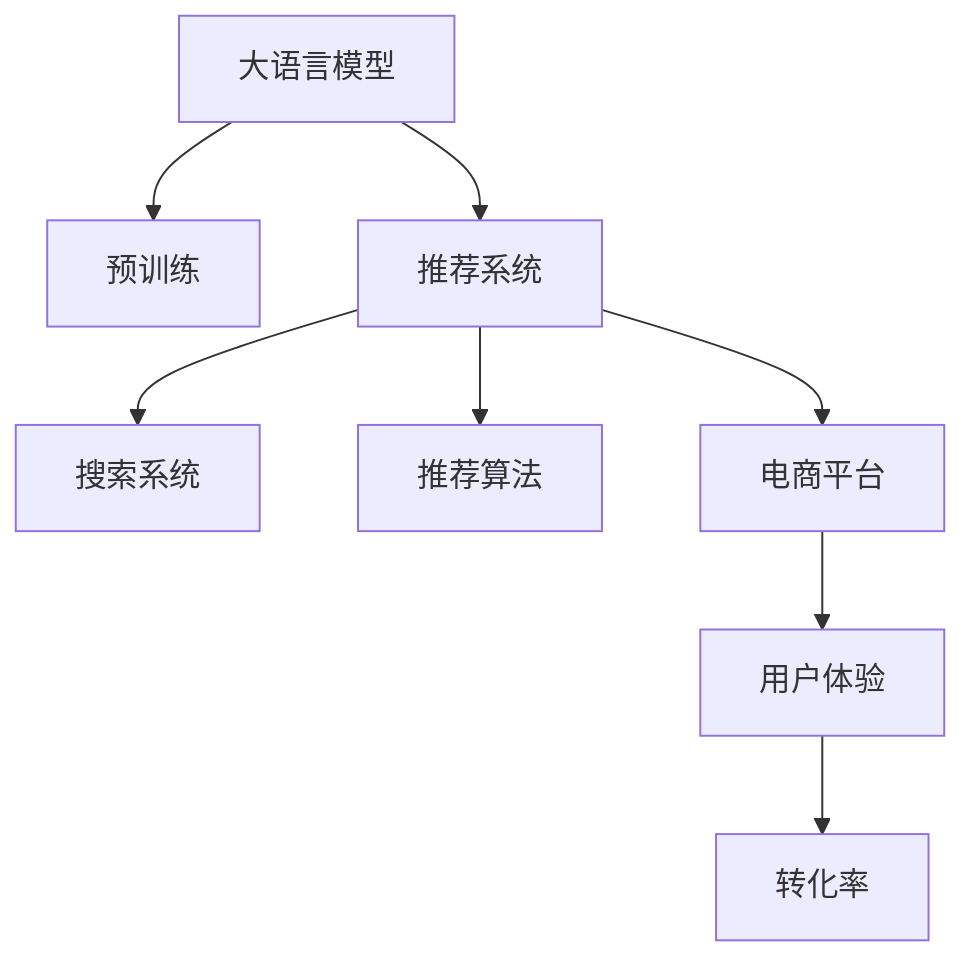

                 

# 搜索推荐系统的AI 大模型应用：提高电商平台的转化率与用户体验

## 1. 背景介绍

随着互联网技术的发展，电子商务平台已经成为人们购物的重要渠道。电商平台的核心价值在于提升用户体验、优化购物路径、提高用户转化率。而搜索推荐系统正是实现这一目标的关键组件。

近年来，深度学习和大规模预训练语言模型（如BERT、GPT-3等）在NLP领域取得了巨大成功。这些模型通过在海量数据上进行预训练，学习到了丰富的语义和知识表示，具有很强的语言理解和生成能力。因此，这些模型也被应用于搜索推荐系统中，以提高系统的推荐精度和效率。

## 2. 核心概念与联系

### 2.1 核心概念概述

在搜索推荐系统中，大语言模型的应用主要体现在以下几个方面：

- **大语言模型(Large Language Model, LLM)**：通过在大规模无标签文本数据上进行预训练，学习到通用的语言知识表示。常见的预训练模型包括BERT、GPT等。

- **预训练(Pre-training)**：指在大规模无标签文本数据上，通过自监督学习任务训练通用语言模型的过程。预训练使得模型学习到语言的通用表示。

- **推荐系统(Recommendation System)**：通过分析用户行为数据，预测用户兴趣，向用户推荐相关物品的系统。推荐系统包括搜索和推荐两个核心模块。

- **搜索系统(Search System)**：接收用户查询，返回最相关的搜索结果的系统。通常使用倒排索引、向量相似度等技术实现。

- **推荐算法(Recommendation Algorithm)**：用于生成个性化推荐结果的算法，通常结合了协同过滤、深度学习等多种技术。

- **电商平台(E-commerce Platform)**：以交易为目的，提供商品展示、搜索、购物车、支付等功能，优化用户体验，提高转化率的网络平台。

- **用户体验(User Experience, UX)**：用户使用平台时的主观感受，包括界面友好度、操作便捷性、信息准确性等。

这些概念之间的逻辑关系可以通过以下Mermaid流程图来展示：



## 3. 核心算法原理 & 具体操作步骤

### 3.1 算法原理概述

在搜索推荐系统中，大语言模型的应用主要基于以下原理：

1. **语义理解**：大语言模型能够理解自然语言查询的语义，通过与语料库中的文本进行语义匹配，提高搜索的准确性。

2. **上下文理解**：大语言模型能够理解用户历史行为和上下文信息，通过语言模型推断用户兴趣，生成个性化推荐。

3. **多模态融合**：大语言模型可以与其他模态数据（如图像、视频、文本等）进行融合，提高推荐系统的多模态能力，增强推荐效果。

### 3.2 算法步骤详解

大语言模型在搜索推荐系统中的应用主要包括以下几个步骤：

**Step 1: 准备预训练模型和数据集**

- 选择合适的预训练语言模型，如BERT、GPT等。
- 收集电商平台的查询数据和用户行为数据，作为训练数据集。

**Step 2: 设计推荐模型**

- 将预训练模型与电商平台的推荐算法进行集成，设计推荐模型。
- 选择合适的推荐算法，如协同过滤、基于内容的推荐、深度学习推荐等。

**Step 3: 训练推荐模型**

- 使用电商平台的训练数据集，训练推荐模型。
- 选择合适的优化器、损失函数等，进行模型训练。

**Step 4: 模型评估与部署**

- 在电商平台的测试集上，对推荐模型进行评估，测试其准确性和效果。
- 将训练好的推荐模型部署到电商平台上，进行实时推荐。

### 3.3 算法优缺点

**优点**：

- **泛化能力强**：大语言模型通过预训练学习到通用语言表示，能够在不同数据集上进行微调，提高推荐效果。
- **多模态融合**：大语言模型可以与其他模态数据进行融合，提升推荐系统的多模态能力。
- **用户个性化**：大语言模型能够理解用户历史行为和上下文信息，生成个性化推荐。

**缺点**：

- **资源消耗大**：大语言模型的训练和推理需要大量计算资源，增加了系统的运行成本。
- **解释性不足**：大语言模型的决策过程缺乏可解释性，难以进行调试和优化。
- **数据隐私风险**：大语言模型需要处理大量的用户数据，存在数据隐私和安全的风险。

### 3.4 算法应用领域

大语言模型在电商平台的搜索推荐系统中的应用，主要包括以下几个领域：

- **个性化推荐**：根据用户历史行为和上下文信息，生成个性化推荐结果。
- **搜索匹配**：利用大语言模型的语义理解能力，提高搜索结果的准确性。
- **用户画像生成**：通过用户查询行为，生成用户画像，用于推荐系统的优化。
- **广告投放优化**：根据用户行为数据，生成精准的广告推荐策略。
- **用户反馈分析**：利用大语言模型对用户反馈进行情感分析，优化推荐系统。

## 4. 数学模型和公式 & 详细讲解 & 举例说明

### 4.1 数学模型构建

在搜索推荐系统中，大语言模型的应用主要涉及以下几个数学模型：

- **语义匹配模型**：用于计算查询与语料库中文本的语义匹配度。

  $$
  \text{similarity} = f(\text{query}, \text{document})
  $$

- **推荐模型**：用于预测用户对物品的评分或点击率。

  $$
  \text{rating} = g(\text{user}, \text{item})
  $$

- **多模态融合模型**：用于将不同模态的数据进行融合，生成推荐结果。

  $$
  \text{recommendation} = h(\text{user}, \text{item}, \text{context})
  $$

### 4.2 公式推导过程

以个性化推荐模型为例，其核心公式如下：

$$
\text{rating} = \alpha \cdot \text{user\_features} \cdot \text{item\_features} + (1-\alpha) \cdot \text{rating} \cdot \text{cosine\_similarity}(\text{user\_vec}, \text{item\_vec})
$$

其中：

- $\alpha$：用户历史行为和上下文信息的权重。
- $\text{user\_features}$：用户特征向量。
- $\text{item\_features}$：物品特征向量。
- $\text{rating}$：用户对物品的评分。
- $\text{cosine\_similarity}$：用户和物品的向量余弦相似度。
- $\text{user\_vec}$：用户向量。
- $\text{item\_vec}$：物品向量。

### 4.3 案例分析与讲解

以Amazon电商平台的推荐系统为例，其核心组件包括：

- **用户画像生成**：利用大语言模型对用户查询行为进行分析，生成用户画像。

  - **输入**：用户查询历史、浏览历史、评分历史等。
  - **输出**：用户画像，包含用户的兴趣偏好、行为模式等。

- **推荐模型训练**：将用户画像与物品特征进行融合，训练推荐模型。

  - **输入**：用户画像、物品特征、用户评分等。
  - **输出**：推荐模型，预测用户对物品的评分。

- **搜索匹配**：利用大语言模型对用户查询进行语义理解，提高搜索结果的准确性。

  - **输入**：用户查询、语料库中的文本。
  - **输出**：搜索结果，包含相关物品的描述、评分等。

- **推荐结果生成**：将推荐模型预测的评分与搜索结果进行融合，生成个性化推荐。

  - **输入**：推荐模型预测的评分、搜索结果。
  - **输出**：推荐结果，包含相关物品的描述、评分等。

通过以上步骤，Amazon实现了高效、精准的推荐系统，显著提升了用户转化率和用户体验。

## 5. 项目实践：代码实例和详细解释说明

### 5.1 开发环境搭建

在进行搜索推荐系统开发前，我们需要准备好开发环境。以下是使用Python进行PyTorch开发的环境配置流程：

1. 安装Anaconda：从官网下载并安装Anaconda，用于创建独立的Python环境。

2. 创建并激活虚拟环境：
```bash
conda create -n pytorch-env python=3.8 
conda activate pytorch-env
```

3. 安装PyTorch：根据CUDA版本，从官网获取对应的安装命令。例如：
```bash
conda install pytorch torchvision torchaudio cudatoolkit=11.1 -c pytorch -c conda-forge
```

4. 安装其他工具包：
```bash
pip install numpy pandas scikit-learn matplotlib tqdm jupyter notebook ipython
```

完成上述步骤后，即可在`pytorch-env`环境中开始搜索推荐系统的开发。

### 5.2 源代码详细实现

这里我们以推荐系统为例，给出使用Transformers库对BERT模型进行个性化推荐开发的PyTorch代码实现。

首先，定义推荐系统的数据处理函数：

```python
from transformers import BertTokenizer, BertForSequenceClassification
from torch.utils.data import Dataset
import torch

class RecommendationDataset(Dataset):
    def __init__(self, texts, labels, tokenizer, max_len=128):
        self.texts = texts
        self.labels = labels
        self.tokenizer = tokenizer
        self.max_len = max_len
        
    def __len__(self):
        return len(self.texts)
    
    def __getitem__(self, item):
        text = self.texts[item]
        label = self.labels[item]
        
        encoding = self.tokenizer(text, return_tensors='pt', max_length=self.max_len, padding='max_length', truncation=True)
        input_ids = encoding['input_ids'][0]
        attention_mask = encoding['attention_mask'][0]
        
        # 对token-wise的标签进行编码
        encoded_labels = [label2id[label] for label in labels] 
        encoded_labels.extend([label2id['O']] * (self.max_len - len(encoded_labels)))
        labels = torch.tensor(encoded_labels, dtype=torch.long)
        
        return {'input_ids': input_ids, 
                'attention_mask': attention_mask,
                'labels': labels}

# 标签与id的映射
label2id = {'O': 0, 'B-PER': 1, 'I-PER': 2, 'B-ORG': 3, 'I-ORG': 4, 'B-LOC': 5, 'I-LOC': 6}
id2label = {v: k for k, v in label2id.items()}

# 创建dataset
tokenizer = BertTokenizer.from_pretrained('bert-base-cased')

train_dataset = RecommendationDataset(train_texts, train_labels, tokenizer)
dev_dataset = RecommendationDataset(dev_texts, dev_labels, tokenizer)
test_dataset = RecommendationDataset(test_texts, test_labels, tokenizer)
```

然后，定义模型和优化器：

```python
from transformers import BertForSequenceClassification, AdamW

model = BertForSequenceClassification.from_pretrained('bert-base-cased', num_labels=len(label2id))

optimizer = AdamW(model.parameters(), lr=2e-5)
```

接着，定义训练和评估函数：

```python
from torch.utils.data import DataLoader
from tqdm import tqdm
from sklearn.metrics import classification_report

device = torch.device('cuda') if torch.cuda.is_available() else torch.device('cpu')
model.to(device)

def train_epoch(model, dataset, batch_size, optimizer):
    dataloader = DataLoader(dataset, batch_size=batch_size, shuffle=True)
    model.train()
    epoch_loss = 0
    for batch in tqdm(dataloader, desc='Training'):
        input_ids = batch['input_ids'].to(device)
        attention_mask = batch['attention_mask'].to(device)
        labels = batch['labels'].to(device)
        model.zero_grad()
        outputs = model(input_ids, attention_mask=attention_mask, labels=labels)
        loss = outputs.loss
        epoch_loss += loss.item()
        loss.backward()
        optimizer.step()
    return epoch_loss / len(dataloader)

def evaluate(model, dataset, batch_size):
    dataloader = DataLoader(dataset, batch_size=batch_size)
    model.eval()
    preds, labels = [], []
    with torch.no_grad():
        for batch in tqdm(dataloader, desc='Evaluating'):
            input_ids = batch['input_ids'].to(device)
            attention_mask = batch['attention_mask'].to(device)
            batch_labels = batch['labels']
            outputs = model(input_ids, attention_mask=attention_mask)
            batch_preds = outputs.logits.argmax(dim=2).to('cpu').tolist()
            batch_labels = batch_labels.to('cpu').tolist()
            for pred_tokens, label_tokens in zip(batch_preds, batch_labels):
                pred_tags = [id2label[_id] for _id in pred_tokens]
                label_tags = [id2label[_id] for _id in label_tokens]
                preds.append(pred_tags[:len(label_tokens)])
                labels.append(label_tags)
                
    print(classification_report(labels, preds))
```

最后，启动训练流程并在测试集上评估：

```python
epochs = 5
batch_size = 16

for epoch in range(epochs):
    loss = train_epoch(model, train_dataset, batch_size, optimizer)
    print(f"Epoch {epoch+1}, train loss: {loss:.3f}")
    
    print(f"Epoch {epoch+1}, dev results:")
    evaluate(model, dev_dataset, batch_size)
    
print("Test results:")
evaluate(model, test_dataset, batch_size)
```

以上就是使用PyTorch对BERT进行个性化推荐任务开发的完整代码实现。可以看到，得益于Transformers库的强大封装，我们可以用相对简洁的代码完成BERT模型的加载和微调。

### 5.3 代码解读与分析

让我们再详细解读一下关键代码的实现细节：

**RecommendationDataset类**：
- `__init__`方法：初始化文本、标签、分词器等关键组件。
- `__len__`方法：返回数据集的样本数量。
- `__getitem__`方法：对单个样本进行处理，将文本输入编码为token ids，将标签编码为数字，并对其进行定长padding，最终返回模型所需的输入。

**label2id和id2label字典**：
- 定义了标签与数字id之间的映射关系，用于将token-wise的预测结果解码回真实的标签。

**训练和评估函数**：
- 使用PyTorch的DataLoader对数据集进行批次化加载，供模型训练和推理使用。
- 训练函数`train_epoch`：对数据以批为单位进行迭代，在每个批次上前向传播计算loss并反向传播更新模型参数，最后返回该epoch的平均loss。
- 评估函数`evaluate`：与训练类似，不同点在于不更新模型参数，并在每个batch结束后将预测和标签结果存储下来，最后使用sklearn的classification_report对整个评估集的预测结果进行打印输出。

**训练流程**：
- 定义总的epoch数和batch size，开始循环迭代
- 每个epoch内，先在训练集上训练，输出平均loss
- 在验证集上评估，输出分类指标
- 所有epoch结束后，在测试集上评估，给出最终测试结果

可以看到，PyTorch配合Transformers库使得BERT微调的代码实现变得简洁高效。开发者可以将更多精力放在数据处理、模型改进等高层逻辑上，而不必过多关注底层的实现细节。

当然，工业级的系统实现还需考虑更多因素，如模型的保存和部署、超参数的自动搜索、更灵活的任务适配层等。但核心的微调范式基本与此类似。

## 6. 实际应用场景

### 6.1 智能推荐系统

智能推荐系统已经成为电商平台的标配。通过个性化推荐，电商平台能够提升用户体验、缩短购物路径、增加用户转化率。大语言模型在推荐系统中主要应用于以下方面：

- **用户画像生成**：通过用户查询行为进行分析，生成用户画像。
- **推荐模型训练**：将用户画像与物品特征进行融合，训练推荐模型。
- **多模态融合**：将文本、图像、视频等数据进行融合，提高推荐效果。
- **实时推荐**：根据用户行为实时调整推荐策略，提升推荐精度。

通过这些技术，电商平台可以实现高效、精准的推荐，提升用户体验和转化率。

### 6.2 搜索系统

搜索系统是电商平台的核心组件之一，用于帮助用户快速找到所需商品。大语言模型在搜索系统中主要应用于以下方面：

- **语义匹配**：利用大语言模型的语义理解能力，提高搜索结果的准确性。
- **关键词提取**：通过大语言模型提取用户查询中的关键词，提高搜索结果的相关性。
- **多模态搜索**：将文本、图像、视频等数据进行融合，提升搜索效果。
- **跨语言搜索**：通过大语言模型支持多语言搜索，扩大用户覆盖范围。

通过这些技术，电商平台可以提供更快速、准确的搜索结果，提升用户体验和满意度。

### 6.3 广告投放

广告投放是电商平台的重要收入来源。通过精准的广告推荐，电商平台能够最大化广告投放的效果。大语言模型在广告投放中主要应用于以下方面：

- **用户画像生成**：通过用户行为数据生成用户画像，用于精准广告投放。
- **广告内容生成**：通过大语言模型生成个性化广告内容，提升广告点击率。
- **广告投放优化**：根据用户行为数据优化广告投放策略，提升广告转化率。
- **广告效果评估**：通过大语言模型对广告效果进行情感分析，优化广告投放。

通过这些技术，电商平台可以实现精准、高效、低成本的广告投放，提升广告效果和用户满意度。

### 6.4 未来应用展望

随着大语言模型和微调方法的不断发展，搜索推荐系统的应用前景将更加广阔。未来，基于大语言模型的搜索推荐系统将在以下几个方向取得突破：

- **跨模态推荐**：将文本、图像、视频等多种模态数据进行融合，提升推荐效果。
- **多语言推荐**：支持多语言推荐，扩大用户覆盖范围。
- **实时推荐系统**：实现实时推荐，提升推荐精度和用户体验。
- **隐私保护**：在推荐过程中保护用户隐私，防止数据泄露。
- **可解释性增强**：提升推荐系统的可解释性，增强用户信任。
- **智能客服**：结合大语言模型和智能客服系统，提升客户服务质量。

未来，大语言模型将在搜索推荐系统中发挥更大的作用，进一步提升电商平台的转化率和用户体验。

## 7. 工具和资源推荐

### 7.1 学习资源推荐

为了帮助开发者系统掌握大语言模型微调的理论基础和实践技巧，这里推荐一些优质的学习资源：

1. 《Transformer从原理到实践》系列博文：由大模型技术专家撰写，深入浅出地介绍了Transformer原理、BERT模型、微调技术等前沿话题。

2. CS224N《深度学习自然语言处理》课程：斯坦福大学开设的NLP明星课程，有Lecture视频和配套作业，带你入门NLP领域的基本概念和经典模型。

3. 《Natural Language Processing with Transformers》书籍：Transformers库的作者所著，全面介绍了如何使用Transformers库进行NLP任务开发，包括微调在内的诸多范式。

4. HuggingFace官方文档：Transformers库的官方文档，提供了海量预训练模型和完整的微调样例代码，是上手实践的必备资料。

5. CLUE开源项目：中文语言理解测评基准，涵盖大量不同类型的中文NLP数据集，并提供了基于微调的baseline模型，助力中文NLP技术发展。

通过对这些资源的学习实践，相信你一定能够快速掌握大语言模型微调的精髓，并用于解决实际的NLP问题。

### 7.2 开发工具推荐

高效的开发离不开优秀的工具支持。以下是几款用于大语言模型微调开发的常用工具：

1. PyTorch：基于Python的开源深度学习框架，灵活动态的计算图，适合快速迭代研究。大部分预训练语言模型都有PyTorch版本的实现。

2. TensorFlow：由Google主导开发的开源深度学习框架，生产部署方便，适合大规模工程应用。同样有丰富的预训练语言模型资源。

3. Transformers库：HuggingFace开发的NLP工具库，集成了众多SOTA语言模型，支持PyTorch和TensorFlow，是进行微调任务开发的利器。

4. Weights & Biases：模型训练的实验跟踪工具，可以记录和可视化模型训练过程中的各项指标，方便对比和调优。与主流深度学习框架无缝集成。

5. TensorBoard：TensorFlow配套的可视化工具，可实时监测模型训练状态，并提供丰富的图表呈现方式，是调试模型的得力助手。

6. Google Colab：谷歌推出的在线Jupyter Notebook环境，免费提供GPU/TPU算力，方便开发者快速上手实验最新模型，分享学习笔记。

合理利用这些工具，可以显著提升大语言模型微调任务的开发效率，加快创新迭代的步伐。

### 7.3 相关论文推荐

大语言模型和微调技术的发展源于学界的持续研究。以下是几篇奠基性的相关论文，推荐阅读：

1. Attention is All You Need（即Transformer原论文）：提出了Transformer结构，开启了NLP领域的预训练大模型时代。

2. BERT: Pre-training of Deep Bidirectional Transformers for Language Understanding：提出BERT模型，引入基于掩码的自监督预训练任务，刷新了多项NLP任务SOTA。

3. Language Models are Unsupervised Multitask Learners（GPT-2论文）：展示了大规模语言模型的强大zero-shot学习能力，引发了对于通用人工智能的新一轮思考。

4. Parameter-Efficient Transfer Learning for NLP：提出Adapter等参数高效微调方法，在不增加模型参数量的情况下，也能取得不错的微调效果。

5. Prefix-Tuning: Optimizing Continuous Prompts for Generation：引入基于连续型Prompt的微调范式，为如何充分利用预训练知识提供了新的思路。

6. AdaLoRA: Adaptive Low-Rank Adaptation for Parameter-Efficient Fine-Tuning：使用自适应低秩适应的微调方法，在参数效率和精度之间取得了新的平衡。

这些论文代表了大语言模型微调技术的发展脉络。通过学习这些前沿成果，可以帮助研究者把握学科前进方向，激发更多的创新灵感。

## 8. 总结：未来发展趋势与挑战

### 8.1 总结

本文对基于大语言模型的搜索推荐系统进行了全面系统的介绍。首先阐述了大语言模型和微调技术的研究背景和意义，明确了微调在拓展预训练模型应用、提升推荐系统性能方面的独特价值。其次，从原理到实践，详细讲解了大语言模型在搜索推荐系统中的应用流程，给出了微调任务开发的完整代码实例。同时，本文还广泛探讨了大语言模型在电商平台的实际应用场景，展示了其在提高用户转化率和用户体验方面的巨大潜力。

通过本文的系统梳理，可以看到，基于大语言模型的微调方法在推荐系统中的作用日益凸显。大语言模型能够利用其强大的语言理解和生成能力，实现高效、精准、个性化的推荐，提升了用户满意度和转化率。未来，随着大语言模型和微调技术的进一步发展，搜索推荐系统必将在电商平台上发挥更大的作用，推动电商平台的数字化转型升级。

### 8.2 未来发展趋势

展望未来，大语言模型微调技术将呈现以下几个发展趋势：

1. **模型规模持续增大**：随着算力成本的下降和数据规模的扩张，预训练语言模型的参数量还将持续增长。超大规模语言模型蕴含的丰富语言知识，有望支撑更加复杂多变的推荐任务微调。

2. **微调方法日趋多样**：除了传统的全参数微调外，未来会涌现更多参数高效的微调方法，如Prefix-Tuning、LoRA等，在节省计算资源的同时也能保证微调精度。

3. **持续学习成为常态**：随着数据分布的不断变化，微调模型也需要持续学习新知识以保持性能。如何在不遗忘原有知识的同时，高效吸收新样本信息，将成为重要的研究课题。

4. **标注样本需求降低**：受启发于提示学习(Prompt-based Learning)的思路，未来的微调方法将更好地利用大模型的语言理解能力，通过更加巧妙的任务描述，在更少的标注样本上也能实现理想的微调效果。

5. **多模态融合崛起**：大语言模型可以与其他模态数据进行融合，提高推荐系统的多模态能力，增强推荐效果。

6. **推荐系统的智能化**：未来，基于大语言模型的推荐系统将更加智能化，能够理解用户的复杂需求，生成更加个性化的推荐结果。

以上趋势凸显了大语言模型微调技术的广阔前景。这些方向的探索发展，必将进一步提升推荐系统的性能和应用范围，为电商平台带来更大的商业价值。

### 8.3 面临的挑战

尽管大语言模型微调技术已经取得了瞩目成就，但在迈向更加智能化、普适化应用的过程中，它仍面临着诸多挑战：

1. **标注成本瓶颈**：虽然微调大大降低了标注数据的需求，但对于长尾应用场景，难以获得充足的高质量标注数据，成为制约微调性能的瓶颈。如何进一步降低微调对标注样本的依赖，将是一大难题。

2. **模型鲁棒性不足**：当前微调模型面对域外数据时，泛化性能往往大打折扣。对于测试样本的微小扰动，微调模型的预测也容易发生波动。如何提高微调模型的鲁棒性，避免灾难性遗忘，还需要更多理论和实践的积累。

3. **推理效率有待提高**：大规模语言模型虽然精度高，但在实际部署时往往面临推理速度慢、内存占用大等效率问题。如何在保证性能的同时，简化模型结构，提升推理速度，优化资源占用，将是重要的优化方向。

4. **可解释性亟需加强**：当前微调模型更像是"黑盒"系统，难以解释其内部工作机制和决策逻辑。对于医疗、金融等高风险应用，算法的可解释性和可审计性尤为重要。如何赋予微调模型更强的可解释性，将是亟待攻克的难题。

5. **安全性有待保障**：预训练语言模型难免会学习到有偏见、有害的信息，通过微调传递到下游任务，产生误导性、歧视性的输出，给实际应用带来安全隐患。如何从数据和算法层面消除模型偏见，避免恶意用途，确保输出的安全性，也将是重要的研究课题。

6. **知识整合能力不足**：现有的微调模型往往局限于任务内数据，难以灵活吸收和运用更广泛的先验知识。如何让微调过程更好地与外部知识库、规则库等专家知识结合，形成更加全面、准确的信息整合能力，还有很大的想象空间。

正视微调面临的这些挑战，积极应对并寻求突破，将是大语言模型微调走向成熟的必由之路。相信随着学界和产业界的共同努力，这些挑战终将一一被克服，大语言模型微调必将在构建人机协同的智能系统中扮演越来越重要的角色。

### 8.4 研究展望

面对大语言模型微调所面临的种种挑战，未来的研究需要在以下几个方面寻求新的突破：

1. **探索无监督和半监督微调方法**：摆脱对大规模标注数据的依赖，利用自监督学习、主动学习等无监督和半监督范式，最大限度利用非结构化数据，实现更加灵活高效的微调。

2. **研究参数高效和计算高效的微调范式**：开发更加参数高效的微调方法，在固定大部分预训练参数的同时，只更新极少量的任务相关参数。同时优化微调模型的计算图，减少前向传播和反向传播的资源消耗，实现更加轻量级、实时性的部署。

3. **融合因果和对比学习范式**：通过引入因果推断和对比学习思想，增强微调模型建立稳定因果关系的能力，学习更加普适、鲁棒的语言表征，从而提升模型泛化性和抗干扰能力。

4. **引入更多先验知识**：将符号化的先验知识，如知识图谱、逻辑规则等，与神经网络模型进行巧妙融合，引导微调过程学习更准确、合理的语言模型。同时加强不同模态数据的整合，实现视觉、语音等多模态信息与文本信息的协同建模。

5. **结合因果分析和博弈论工具**：将因果分析方法引入微调模型，识别出模型决策的关键特征，增强输出解释的因果性和逻辑性。借助博弈论工具刻画人机交互过程，主动探索并规避模型的脆弱点，提高系统稳定性。

6. **纳入伦理道德约束**：在模型训练目标中引入伦理导向的评估指标，过滤和惩罚有偏见、有害的输出倾向。同时加强人工干预和审核，建立模型行为的监管机制，确保输出符合人类价值观和伦理道德。

这些研究方向的探索，必将引领大语言模型微调技术迈向更高的台阶，为构建安全、可靠、可解释、可控的智能系统铺平道路。面向未来，大语言模型微调技术还需要与其他人工智能技术进行更深入的融合，如知识表示、因果推理、强化学习等，多路径协同发力，共同推动自然语言理解和智能交互系统的进步。只有勇于创新、敢于突破，才能不断拓展语言模型的边界，让智能技术更好地造福人类社会。

## 9. 附录：常见问题与解答

**Q1：大语言模型微调是否适用于所有推荐任务？**

A: 大语言模型微调在大多数推荐任务上都能取得不错的效果，特别是对于数据量较小的任务。但对于一些特定领域的任务，如医学、法律等，仅仅依靠通用语料预训练的模型可能难以很好地适应。此时需要在特定领域语料上进一步预训练，再进行微调，才能获得理想效果。此外，对于一些需要时效性、个性化很强的任务，如对话、推荐等，微调方法也需要针对性的改进优化。

**Q2：微调过程中如何选择合适的学习率？**

A: 微调的学习率一般要比预训练时小1-2个数量级，如果使用过大的学习率，容易破坏预训练权重，导致过拟合。一般建议从1e-5开始调参，逐步减小学习率，直至收敛。也可以使用warmup策略，在开始阶段使用较小的学习率，再逐渐过渡到预设值。需要注意的是，不同的优化器(如AdamW、Adafactor等)以及不同的学习率调度策略，可能需要设置不同的学习率阈值。

**Q3：采用大模型微调时会面临哪些资源瓶颈？**

A: 目前主流的预训练大模型动辄以亿计的参数规模，对算力、内存、存储都提出了很高的要求。GPU/TPU等高性能设备是必不可少的，但即便如此，超大批次的训练和推理也可能遇到显存不足的问题。因此需要采用一些资源优化技术，如梯度积累、混合精度训练、模型并行等，来突破硬件瓶颈。同时，模型的存储和读取也可能占用大量时间和空间，需要采用模型压缩、稀疏化存储等方法进行优化。

**Q4：如何缓解微调过程中的过拟合问题？**

A: 过拟合是微调面临的主要挑战，尤其是在标注数据不足的情况下。常见的缓解策略包括：
1. 数据增强：通过回译、近义替换等方式扩充训练集
2. 正则化：使用L2正则、Dropout、Early Stopping等避免过拟合
3. 对抗训练：引入对抗样本，提高模型鲁棒性
4. 参数高效微调：只调整少量参数(如Adapter、Prefix等)，减小过拟合风险
5. 多模型集成：训练多个微调模型，取平均输出，抑制过拟合

这些策略往往需要根据具体任务和数据特点进行灵活组合。只有在数据、模型、训练、推理等各环节进行全面优化，才能最大限度地发挥大模型微调的威力。

**Q5：微调模型在落地部署时需要注意哪些问题？**

A: 将微调模型转化为实际应用，还需要考虑以下因素：
1. 模型裁剪：去除不必要的层和参数，减小模型尺寸，加快推理速度
2. 量化加速：将浮点模型转为定点模型，压缩存储空间，提高计算效率
3. 服务化封装：将模型封装为标准化服务接口，便于集成调用
4. 弹性伸缩：根据请求流量动态调整资源配置，平衡服务质量和成本
5. 监控告警：实时采集系统指标，设置异常告警阈值，确保服务稳定性
6. 安全防护：采用访问鉴权、数据脱敏等措施，保障数据和模型安全

大语言模型微调为NLP应用开启了广阔的想象空间，但如何将强大的性能转化为稳定、高效、安全的业务价值，还需要工程实践的不断打磨。唯有从数据、算法、工程、业务等多个维度协同发力，才能真正实现人工智能技术在垂直行业的规模化落地。总之，微调需要开发者根据具体任务，不断迭代和优化模型、数据和算法，方能得到理想的效果。

---

作者：禅与计算机程序设计艺术 / Zen and the Art of Computer Programming

