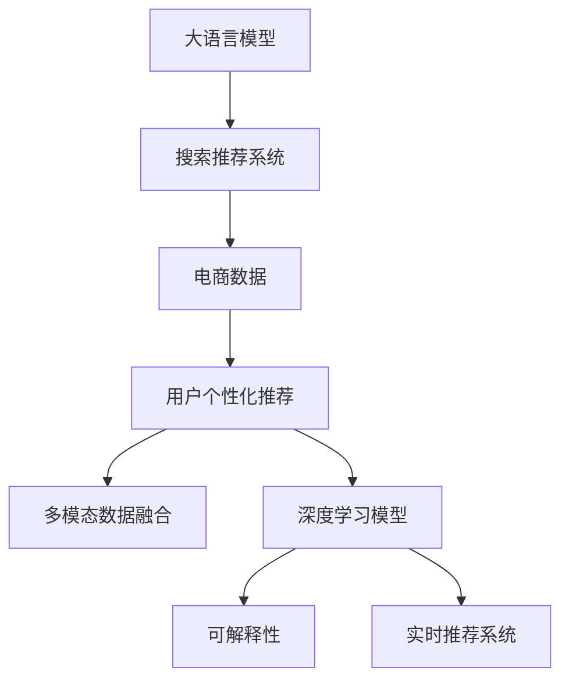

                 

# 搜索推荐系统的AI 大模型融合：电商平台的核心竞争力与可持续增长战略

## 1. 背景介绍

### 1.1 问题由来

随着电子商务的蓬勃发展，各大电商平台面临着巨大的竞争压力，需要不断提升用户体验、提高运营效率，从而实现可持续增长。搜索推荐系统作为电商平台的核心模块，通过智能算法对海量商品信息进行展示与匹配，极大提高了用户浏览和购买转化率，成为平台提升竞争力的重要手段。

然而，传统的基于规则、特征工程的推荐系统难以满足用户个性化需求的不断变化。随着人工智能技术的发展，基于深度学习的大模型推荐系统逐渐成为趋势。通过大模型学习用户的复杂行为和偏好，结合电商数据中的多维特征，可以大幅提升推荐准确性，解锁新的商业价值。

### 1.2 问题核心关键点

电商搜索推荐系统的核心在于如何构建一个高效、个性化的推荐引擎，以提升用户体验和平台营收。主要问题包括以下几个方面：

1. **数据多样性与复杂性**：电商数据具有多模态、多源的特点，包括用户行为数据、商品属性数据、社交数据等，如何有效整合与利用这些数据，是大模型推荐系统的难点。
2. **模型可解释性与鲁棒性**：大模型的复杂性带来难以解释、鲁棒性差的问题，电商推荐模型需要具备高透明性，避免因模型错误导致用户体验下降。
3. **实时性与扩展性**：大模型推荐系统需要支持实时推荐，同时具备高扩展性，能够快速响应大规模用户并发请求。
4. **模型泛化性与泛用性**：模型需要在不同业务场景下泛化能力强，具备广泛应用性。

## 2. 核心概念与联系

### 2.1 核心概念概述

为更好地理解大模型在电商平台搜索推荐系统中的应用，本节将介绍几个关键概念及其相互联系：

- **大语言模型(Large Language Model, LLM)**：以自回归(如GPT)或自编码(如BERT)模型为代表的大规模预训练语言模型。通过在大规模无标签文本语料上进行预训练，学习通用的语言表示，具备强大的语言理解和生成能力。
- **搜索推荐系统(Recommendation System)**：通过用户行为数据、商品数据等多维特征，结合机器学习模型，对用户进行个性化推荐，以提升用户满意度和转化率。
- **电商数据(Data)**：包括用户行为数据(点击、浏览、购买等)、商品属性数据(品牌、价格、评分等)、社交数据(评价、评论、互动等)等多维数据源。
- **用户个性化推荐(User Personalized Recommendation)**：根据用户历史行为和兴趣，生成个性化推荐结果，提高用户满意度和转化率。
- **多模态数据融合(Multimodal Data Fusion)**：将不同类型的数据(文本、图像、视频等)进行融合，提升推荐系统的准确性和鲁棒性。
- **深度学习模型(Deep Learning Model)**：如神经网络、卷积神经网络(CNN)、循环神经网络(RNN)、Transformer等，用于处理复杂非线性的电商数据。
- **可解释性(Explainability)**：模型的决策过程和输出结果能够被用户理解，提高用户信任度。
- **实时推荐系统(Real-time Recommendation System)**：能够快速响应用户请求，提供个性化推荐服务。

这些概念之间的逻辑关系可以通过以下Mermaid流程图来展示：



这个流程图展示了大语言模型在电商平台搜索推荐系统中的应用脉络：

1. 大语言模型通过预训练学习通用语言表示。
2. 在电商数据上，结合用户行为、商品属性等多维特征，进行个性化推荐。
3. 通过多模态数据融合，提升推荐系统的准确性和鲁棒性。
4. 采用深度学习模型进行建模，提高推荐效果。
5. 模型具备高可解释性，增强用户信任。
6. 构建实时推荐系统，支持高效推荐。

## 3. 核心算法原理 & 具体操作步骤

### 3.1 算法原理概述

基于大模型的电商搜索推荐系统，本质上是一种深度学习驱动的个性化推荐引擎。其核心思想是：利用大模型的强大表征能力，结合电商数据中的多维特征，构建一个高效的个性化推荐模型。

形式化地，假设电商平台的商品集为 $S$，用户集为 $U$，商品-用户交互矩阵为 $I \in \{0,1\}^{S \times U}$，其中 $I_{si} = 1$ 表示用户 $i$ 浏览过商品 $s$。电商平台的大模型推荐系统目标是最小化交互损失，即：

$$
\min_{M} \frac{1}{|U|} \sum_{i=1}^{|U|} \sum_{s=1}^{|S|} L_{si}(I_{si}, M(x_i))
$$

其中 $L_{si}(y, p)$ 为用户 $i$ 对商品 $s$ 的交互损失函数，$x_i$ 为用户 $i$ 的电商数据特征向量，$M(x_i)$ 为大模型在特征 $x_i$ 下的推荐输出。

通过梯度下降等优化算法，大模型在电商数据上不断迭代优化，学习到用户行为和偏好的表示，生成个性化推荐结果。

### 3.2 算法步骤详解

基于大模型的电商推荐系统一般包括以下几个关键步骤：

**Step 1: 数据预处理与特征工程**
- 收集电商平台的用户行为数据、商品数据、社交数据等，进行数据清洗、归一化处理。
- 设计合适的特征提取方法，将电商数据转化为机器学习模型可用的数值特征。

**Step 2: 数据分割与模型训练**
- 将电商数据划分为训练集、验证集和测试集，一般保持7:1:2的比例。
- 使用大模型进行预训练，通常使用GPT、BERT等结构。
- 在电商数据上微调大模型，添加任务特定的输出层和损失函数。

**Step 3: 模型评估与调参**
- 在验证集上评估模型性能，计算准确率、召回率、F1值等指标。
- 使用网格搜索、随机搜索等方法，对模型超参数进行调优，如学习率、批次大小、迭代轮数等。

**Step 4: 模型部署与实时推荐**
- 将训练好的模型部署到服务器上，支持实时推荐服务。
- 设计高效的推理引擎，确保模型在用户请求时能够快速响应。
- 持续监控模型性能，根据反馈数据进行动态调整。

### 3.3 算法优缺点

基于大模型的电商推荐系统具有以下优点：

1. **高准确性与泛化性**：大模型具备强大的语言理解能力和表征能力，能够处理复杂的多维数据，提升推荐准确性和泛化能力。
2. **实时性与扩展性**：基于深度学习的模型可以在用户请求时快速生成推荐结果，支持高效的实时推荐。
3. **可解释性**：大模型的黑盒特性通过预训练和微调可以得到部分解释，增强用户对推荐结果的信任度。
4. **灵活性与可扩展性**：模型能够适应不同的电商业务场景，具备良好的可扩展性。

同时，该方法也存在一些局限性：

1. **资源消耗大**：大模型参数量庞大，对计算资源要求高，训练和推理耗时较长。
2. **模型复杂度高**：模型结构复杂，难以调试和优化，可能存在过拟合风险。
3. **数据隐私问题**：电商数据包含大量用户隐私信息，如何保护数据隐私是重要问题。
4. **模型公平性**：模型可能存在隐性偏见，导致某些用户群体被不公平对待。
5. **解释性不足**：大模型推荐过程缺乏可解释性，用户难以理解推荐逻辑。

尽管存在这些局限性，但就目前而言，基于大模型的推荐系统仍是最先进的技术范式，能够显著提升电商平台的推荐效果。

### 3.4 算法应用领域

基于大模型的电商推荐系统已经在多个电商平台上得到了广泛应用，如淘宝、京东、亚马逊等，取得了显著的成效：

1. **用户个性化推荐**：根据用户浏览、购买历史，生成个性化推荐商品，提升用户体验。
2. **商品特征挖掘**：分析商品属性数据，提取商品的关键特征，辅助商品管理与优化。
3. **市场趋势预测**：利用电商数据预测商品销售趋势，优化库存管理和定价策略。
4. **广告精准投放**：通过用户行为数据，精准投放电商广告，提高广告投放效率和ROI。
5. **智能客服与智能搜索**：结合自然语言处理技术，提升智能客服和智能搜索的精准性和用户满意度。

除了这些经典应用外，大模型推荐系统还拓展到了更多场景中，如电商平台之间的跨域推荐、社交电商场景下的互动推荐等，展示了其在电商领域的广阔应用前景。

## 4. 数学模型和公式 & 详细讲解

### 4.1 数学模型构建

假设电商平台的大模型推荐系统采用基于 Transformer 结构的深度学习模型 $M$。设输入特征 $x_i \in \mathbb{R}^d$，输出推荐结果 $y \in \mathbb{R}^k$，其中 $k$ 为推荐结果的维度，通常与商品属性数量相对应。模型的输入输出关系可表示为：

$$
y = M(x)
$$

电商平台的数据模型 $D$ 包括用户行为数据、商品属性数据等，表示为矩阵 $X \in \mathbb{R}^{n \times d}$，其中 $n$ 为样本数量，$d$ 为特征维度。用户对商品 $s$ 的交互表示为向量 $I_s \in \{0,1\}^n$。

电商推荐系统的目标是最小化交互损失，即：

$$
\min_{M} \frac{1}{n} \sum_{i=1}^n \sum_{s=1}^m L_{si}(I_{si}, M(x_i))
$$

其中 $L_{si}(y, p)$ 为用户 $i$ 对商品 $s$ 的交互损失函数，通常采用二分类交叉熵损失函数。

### 4.2 公式推导过程

假设采用二分类交叉熵损失函数 $L_{si}(y, p) = -[y \log p + (1-y) \log (1-p)]$，其中 $p$ 为模型预测的概率。则电商推荐系统的损失函数可表示为：

$$
\mathcal{L}(M) = \frac{1}{n} \sum_{i=1}^n \sum_{s=1}^m [y_i^s \log M(x_i)^s + (1-y_i^s) \log (1-M(x_i)^s)]
$$

其中 $y_i^s$ 为第 $i$ 个用户对商品 $s$ 的交互标签。

根据链式法则，损失函数对模型参数 $w$ 的梯度为：

$$
\nabla_{w}\mathcal{L}(M) = \frac{1}{n} \sum_{i=1}^n \sum_{s=1}^m [y_i^s \nabla_{w}M(x_i)^s - (1-y_i^s) \nabla_{w}(1-M(x_i)^s)]
$$

在得到损失函数的梯度后，即可带入梯度下降等优化算法，完成模型的迭代优化。重复上述过程直至收敛，最终得到适应电商数据的最优模型参数 $w^*$。

### 4.3 案例分析与讲解

以商品属性推荐为例，假设有 $k$ 个商品属性，用户 $i$ 对商品 $s$ 的交互表示为 $I_{si} \in \{0,1\}^k$，其中 $I_{si}=1$ 表示用户 $i$ 对商品 $s$ 的某属性感兴趣。

假设大模型采用基于 Transformer 的结构，输入特征 $x_i \in \mathbb{R}^d$，输出向量 $y \in \mathbb{R}^k$。在训练时，将用户行为数据和商品属性数据作为模型输入，通过二分类交叉熵损失函数计算损失。优化算法更新模型参数，使得模型能够准确预测用户对商品属性的兴趣。

## 5. 项目实践：代码实例和详细解释说明

### 5.1 开发环境搭建

在进行电商推荐系统开发前，我们需要准备好开发环境。以下是使用Python进行PyTorch开发的环境配置流程：

1. 安装Anaconda：从官网下载并安装Anaconda，用于创建独立的Python环境。

2. 创建并激活虚拟环境：
```bash
conda create -n pytorch-env python=3.8 
conda activate pytorch-env
```

3. 安装PyTorch：根据CUDA版本，从官网获取对应的安装命令。例如：
```bash
conda install pytorch torchvision torchaudio cudatoolkit=11.1 -c pytorch -c conda-forge
```

4. 安装TensorFlow：
```bash
pip install tensorflow
```

5. 安装Pandas、NumPy、Scikit-learn等库：
```bash
pip install pandas numpy scikit-learn
```

6. 安装Flask和TensorFlow Serving：
```bash
pip install flask tensorflow-serving-api
```

完成上述步骤后，即可在`pytorch-env`环境中开始电商推荐系统的开发。

### 5.2 源代码详细实现

下面我们以电商平台商品属性推荐为例，给出使用TensorFlow进行深度学习模型训练和推理的PyTorch代码实现。

首先，定义商品属性推荐的数据处理函数：

```python
import pandas as pd
import numpy as np
from tensorflow.keras.preprocessing.text import Tokenizer
from tensorflow.keras.preprocessing.sequence import pad_sequences

# 读取电商数据
data = pd.read_csv('data.csv')

# 将用户行为数据和商品属性数据合并
combined_data = pd.merge(data[['user_id', 'item_id']], data[['item_name', 'item_category']], on='item_id')

# 构建输入特征
X = combined_data[['user_id', 'item_category']].values
y = combined_data[['item_name']].values

# 对特征进行编码
tokenizer = Tokenizer(num_words=10000)
tokenizer.fit_on_texts(X)
X = tokenizer.texts_to_sequences(X)
X = pad_sequences(X)

# 定义模型
model = Sequential([
    Dense(128, activation='relu', input_shape=(X.shape[1],)),
    Dense(64, activation='relu'),
    Dense(len(tokenizer.word_index)+1, activation='softmax')
])

# 编译模型
model.compile(loss='binary_crossentropy', optimizer='adam', metrics=['accuracy'])

# 训练模型
model.fit(X, y, epochs=10, batch_size=32, validation_split=0.2)
```

然后，定义模型推理函数：

```python
# 定义模型推理函数
def predict(model, X_test):
    y_pred = model.predict(X_test)
    return np.argmax(y_pred, axis=1)
```

接着，启动模型推理流程：

```python
# 读取测试数据
X_test = pd.read_csv('test_data.csv')

# 对测试数据进行编码和填充
X_test = tokenizer.texts_to_sequences(X_test)
X_test = pad_sequences(X_test)

# 进行模型推理
y_pred = predict(model, X_test)
print(y_pred)
```

以上就是使用PyTorch进行电商商品属性推荐系统的完整代码实现。可以看到，利用TensorFlow Serving和Flask可以快速部署深度学习模型，方便后续调用。

### 5.3 代码解读与分析

让我们再详细解读一下关键代码的实现细节：

**商品属性推荐数据处理函数**：
- 首先，从电商数据中提取用户行为数据和商品属性数据，进行合并处理。
- 将用户行为数据和商品属性数据作为模型输入，通过编码和填充，转化为机器学习模型可用的数值特征。
- 使用Tokenize和pad_sequences函数对特征进行编码和填充，确保模型输入一致。

**模型定义与训练函数**：
- 定义多层全连接神经网络模型，包括输入层、隐藏层和输出层。
- 编译模型，设置损失函数、优化器和评估指标。
- 使用fit函数对模型进行训练，迭代优化模型参数。

**模型推理函数**：
- 定义一个函数，用于对测试数据进行模型推理，生成推荐结果。
- 使用predict函数对测试数据进行推理，输出预测结果。

**模型推理流程**：
- 读取测试数据，进行编码和填充。
- 调用模型推理函数，对测试数据进行推理，输出推荐结果。

可以看到，使用PyTorch和TensorFlow进行电商推荐系统的开发，可以高效实现模型的训练和推理。此外，TensorFlow Serving和Flask的使用，使得模型可以方便部署，支持实时推荐服务。

当然，工业级的系统实现还需考虑更多因素，如模型的保存和部署、超参数的自动搜索、更灵活的任务适配层等。但核心的模型训练和推理范式基本与此类似。

## 6. 实际应用场景

### 6.1 智能推荐系统

基于大模型的智能推荐系统，已经成为电商平台的核心竞争力之一。通过深度学习模型学习用户行为和偏好，电商推荐系统能够智能生成个性化推荐商品，极大提升用户体验和平台营收。

在技术实现上，电商推荐系统可以采用多种深度学习模型，如卷积神经网络(CNN)、循环神经网络(RNN)、Transformer等，针对不同数据特点选择合适的模型结构。微调大模型，使其适应电商数据的多维特征，提升推荐效果。

### 6.2 用户行为分析

大模型推荐系统可以结合电商数据中的多维特征，对用户行为进行分析，挖掘用户兴趣和行为模式。例如，通过分析用户点击、浏览、购买等行为数据，可以预测用户的潜在购买意愿，优化商品推荐策略。

### 6.3 广告精准投放

基于大模型的广告精准投放系统，可以结合电商数据中的多维特征，精准投放广告，提高广告投放的ROI。通过分析用户行为数据和广告表现数据，实时调整广告投放策略，最大化广告效果。

### 6.4 跨域推荐

跨域推荐是电商推荐系统的重要应用方向之一。通过大模型学习不同电商平台之间的用户偏好和商品特征，能够实现跨域推荐，提升用户满意度。

### 6.5 社交电商推荐

社交电商推荐系统结合用户社交数据和电商数据，通过大模型进行推荐，实现更精准的个性化推荐。例如，通过分析用户在社交平台上的评论和互动信息，结合用户电商行为数据，生成更加符合用户兴趣的推荐结果。

## 7. 工具和资源推荐

### 7.1 学习资源推荐

为了帮助开发者系统掌握大模型在电商平台搜索推荐系统中的应用，这里推荐一些优质的学习资源：

1. 《深度学习与推荐系统》课程：由Coursera提供，系统介绍了深度学习在推荐系统中的应用，涵盖推荐模型的构建与优化、评估与调参等内容。

2. 《TensorFlow实战》书籍：谷歌官方出版的TensorFlow实战指南，详细介绍了TensorFlow的用法，包括模型构建、训练与推理、模型部署等。

3. 《Transformer之原理与实践》博文：Transformer专家撰写的系列博文，深入浅出地介绍了Transformer原理、BERT模型、微调技术等前沿话题。

4. 《Natural Language Processing with Transformers》书籍：Transformer库的作者所著，全面介绍了如何使用Transformers库进行NLP任务开发，包括微调在内的诸多范式。

5. Kaggle竞赛平台：全球最大的数据科学竞赛平台，提供丰富的电商推荐系统竞赛，可以实践大模型的电商推荐系统。

通过对这些资源的学习实践，相信你一定能够快速掌握大模型在电商推荐系统中的应用，并用于解决实际的电商推荐问题。

### 7.2 开发工具推荐

高效的开发离不开优秀的工具支持。以下是几款用于电商推荐系统开发的常用工具：

1. PyTorch：基于Python的开源深度学习框架，灵活动态的计算图，适合快速迭代研究。大部分深度学习模型都有PyTorch版本的实现。

2. TensorFlow：由Google主导开发的开源深度学习框架，生产部署方便，适合大规模工程应用。同样有丰富的深度学习模型资源。

3. TensorFlow Serving：谷歌开发的模型服务系统，支持高效部署深度学习模型，快速响应实时请求。

4. Flask：Python Web框架，方便构建Web服务接口，支持快速部署模型推理服务。

5. Gunicorn：Python Web服务器，支持多进程并发，提高服务响应速度。

6. Redis：内存数据库，支持高效的缓存和消息队列，优化模型推理性能。

合理利用这些工具，可以显著提升电商推荐系统的开发效率，加快创新迭代的步伐。

### 7.3 相关论文推荐

大模型在电商推荐系统中的应用，源于学界的持续研究。以下是几篇奠基性的相关论文，推荐阅读：

1. Attention is All You Need（即Transformer原论文）：提出了Transformer结构，开启了深度学习在大模型推荐系统中的应用。

2. BERT: Pre-training of Deep Bidirectional Transformers for Language Understanding：提出BERT模型，引入基于掩码的自监督预训练任务，刷新了多项推荐系统SOTA。

3. Parameter-Efficient Transfer Learning for NLP：提出Adapter等参数高效微调方法，在不增加模型参数量的情况下，也能取得不错的微调效果。

4. Premier Encoded Recommender Networks for Diverse Recommendation：提出Premier编码推荐网络，结合深度学习与传统推荐方法，实现多样化的推荐结果。

5. Real-time Recommender Systems with Memory-Aware LSTM：提出基于LSTM的记忆型推荐系统，支持实时推荐，具备良好扩展性。

这些论文代表了大模型在电商推荐系统中的应用发展脉络。通过学习这些前沿成果，可以帮助研究者把握学科前进方向，激发更多的创新灵感。

## 8. 总结：未来发展趋势与挑战

### 8.1 总结

本文对基于大模型的电商推荐系统进行了全面系统的介绍。首先阐述了电商推荐系统的背景和重要性，明确了大模型推荐系统的核心思想和算法框架。其次，从原理到实践，详细讲解了大模型的电商推荐系统构建过程，给出了代码实例和详细解释。最后，本文还探讨了大模型推荐系统的实际应用场景，提出了相关的学习资源、开发工具和研究论文。

通过本文的系统梳理，可以看到，基于大模型的电商推荐系统已经成为电商平台的重要竞争力，具备高准确性、实时性和可解释性等优势。未来，随着深度学习技术的不断进步，大模型推荐系统将进一步优化，拓展更多的应用场景。

### 8.2 未来发展趋势

展望未来，大模型在电商平台推荐系统中的应用将呈现以下几个发展趋势：

1. **大模型结构的不断优化**：深度学习模型的结构将更加复杂，能够处理更多的电商数据维度，提升推荐效果。
2. **跨模态推荐系统的兴起**：结合多模态数据(如图像、视频、音频等)，提升推荐系统的准确性和鲁棒性。
3. **实时推荐系统的进一步提升**：通过分布式计算和缓存优化，实现毫秒级的实时推荐，支持高效的用户体验。
4. **推荐算法的多样化**：结合协同过滤、矩阵分解等传统推荐算法，实现更精准、多样化的推荐结果。
5. **推荐系统的社会化与个性化**：结合用户社交数据，实现更个性化、多样化的推荐服务。

这些趋势凸显了大模型推荐系统的广阔前景，将进一步提升电商平台的用户体验和营收能力。

### 8.3 面临的挑战

尽管大模型推荐系统已经取得了瞩目成就，但在迈向更加智能化、普适化应用的过程中，它仍面临着诸多挑战：

1. **数据隐私与安全性**：电商数据包含大量用户隐私信息，如何保护数据隐私是重要问题。
2. **模型鲁棒性不足**：大模型推荐系统面对域外数据时，泛化性能往往大打折扣。
3. **实时性要求高**：电商平台需要支持实时推荐，对模型响应速度要求高，存在计算延迟问题。
4. **模型的可解释性与透明性**：大模型推荐过程缺乏可解释性，用户难以理解推荐逻辑。
5. **模型的公平性与公正性**：模型可能存在隐性偏见，导致某些用户群体被不公平对待。

尽管存在这些挑战，但随着深度学习技术的不断进步和优化，相信大模型推荐系统将不断突破，实现更高的性能和更广泛的应用。

### 8.4 研究展望

面对大模型推荐系统所面临的挑战，未来的研究需要在以下几个方面寻求新的突破：

1. **数据隐私保护**：开发高效的数据隐私保护技术，如差分隐私、联邦学习等，确保电商数据的隐私安全。
2. **鲁棒性增强**：引入对抗训练、泛化学习等方法，提高模型的泛化能力，提升对域外数据的适应性。
3. **实时性优化**：开发分布式计算框架，优化模型推理过程，提升实时推荐系统的性能。
4. **可解释性提升**：结合因果分析、符号学习等技术，增强模型的可解释性和透明性。
5. **公平性优化**：通过公平性学习、对抗训练等方法，确保模型的公平性和公正性。

这些研究方向的探索，必将引领大模型推荐系统迈向更高的台阶，为电商平台提供更加智能、高效的推荐服务。面向未来，大模型推荐系统需要与其他人工智能技术进行更深入的融合，如知识表示、因果推理、强化学习等，多路径协同发力，共同推动推荐技术的进步。只有勇于创新、敢于突破，才能不断拓展推荐系统的边界，让推荐技术更好地造福电商平台和用户。

## 9. 附录：常见问题与解答

**Q1：电商推荐系统如何处理大量数据？**

A: 电商推荐系统通常面临海量数据的处理问题，可以通过以下方法解决：
1. 数据预处理：对电商数据进行清洗、归一化、编码等预处理，减少数据噪声。
2. 特征工程：设计合适的特征提取方法，将电商数据转化为机器学习模型可用的数值特征。
3. 分布式计算：采用分布式计算框架，如Hadoop、Spark等，处理大规模数据。
4. 模型压缩：采用模型压缩技术，如知识蒸馏、参数剪枝等，减少模型参数量，提升模型推理速度。

**Q2：电商推荐系统如何进行个性化推荐？**

A: 电商推荐系统通常采用以下方法进行个性化推荐：
1. 用户行为数据建模：通过分析用户浏览、点击、购买等行为数据，挖掘用户兴趣和行为模式。
2. 商品特征提取：利用电商数据中的商品属性数据，提取商品的关键特征，辅助商品管理与优化。
3. 协同过滤推荐：结合用户行为数据和商品数据，构建用户-商品协同矩阵，生成推荐结果。
4. 深度学习推荐：采用深度学习模型，结合电商数据中的多维特征，生成个性化推荐结果。
5. 实时推荐：通过模型推理引擎，实时生成推荐结果，满足用户的即时需求。

**Q3：电商推荐系统如何优化模型性能？**

A: 电商推荐系统可以通过以下方法优化模型性能：
1. 模型调参：使用网格搜索、随机搜索等方法，对模型超参数进行调优，如学习率、批次大小、迭代轮数等。
2. 数据增强：通过数据增强技术，如回译、近义替换等，扩充训练集，提升模型泛化能力。
3. 对抗训练：引入对抗样本，提高模型鲁棒性，避免过拟合。
4. 模型融合：结合多种推荐模型，生成更准确的推荐结果。
5. 分布式计算：采用分布式计算框架，优化模型推理过程，提升实时推荐系统的性能。

这些方法可以结合具体应用场景和数据特点，灵活应用，提升电商推荐系统的性能。

**Q4：电商推荐系统如何保护用户隐私？**

A: 电商推荐系统可以采用以下方法保护用户隐私：
1. 数据脱敏：对电商数据进行脱敏处理，去除敏感信息，确保用户隐私安全。
2. 差分隐私：采用差分隐私技术，确保数据分析过程中不会泄露个人隐私信息。
3. 联邦学习：采用联邦学习技术，在本地设备上训练模型，避免数据集中存储。
4. 模型加密：采用模型加密技术，保护模型在传输和存储过程中的安全性。

这些方法可以有效保护用户隐私，确保电商推荐系统的安全性和可信性。

**Q5：电商推荐系统如何实现多模态推荐？**

A: 电商推荐系统可以采用以下方法实现多模态推荐：
1. 多模态特征融合：将图像、视频、音频等多模态数据与文本数据进行融合，提升推荐系统的准确性和鲁棒性。
2. 多模态模型构建：采用多模态深度学习模型，结合不同模态的数据，生成推荐结果。
3. 多模态交互设计：设计多模态推荐界面，提升用户交互体验。

通过多模态数据的融合，电商推荐系统可以实现更精准、多样化的推荐服务，满足用户的个性化需求。

---

作者：禅与计算机程序设计艺术 / Zen and the Art of Computer Programming

