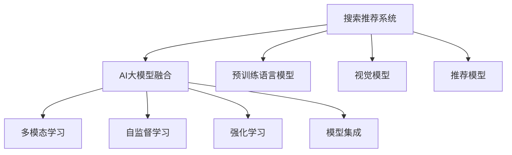

                 

# 搜索推荐系统的AI 大模型融合：电商平台的核心竞争力与转型策略

> 关键词：搜索推荐系统,电商平台,大模型融合,核心竞争力,AI,转型策略

## 1. 背景介绍

### 1.1 问题由来

随着电子商务平台的快速发展，搜索推荐系统成为用户获取商品信息、发现个性化商品的重要引擎。然而，当前搜索推荐系统主要依赖传统机器学习模型，无法充分发挥大数据时代下的算法潜力。为解决这一问题，AI大模型融合技术应运而生，显著提升了搜索推荐系统的智能化水平和用户体验。

近年来，各大电商平台纷纷引入AI大模型融合技术，以构建全新的智能搜索推荐系统。通过将预训练语言模型、视觉模型、推荐系统等技术深度融合，电商平台在个性化推荐、搜索结果排序、商品描述优化等方面取得了显著进展。大模型融合技术不仅提升了平台的用户体验，也为电商平台带来了核心竞争力的提升和业务模式的转型。

### 1.2 问题核心关键点

大模型融合技术通过将多模态数据源的AI大模型进行深度结合，可以显著提升搜索推荐系统的精度和智能化水平。其关键在于：

- **多模态融合**：将文本、图像、音频等多种模态数据进行融合，提高模型对多源数据的理解能力。
- **自监督学习**：利用未标注数据进行自监督学习，预训练模型具备广泛的知识和通用的表征能力。
- **强化学习**：将用户交互反馈引入学习过程，优化模型的推荐策略和用户满意度。
- **模型集成**：通过模型融合、多模态学习等手段，构建更加健壮、泛化的搜索推荐系统。

这些关键技术手段共同构成了大模型融合技术的核心，使搜索推荐系统能够更加精准、智能地服务用户。

## 2. 核心概念与联系

### 2.1 核心概念概述

为更好地理解大模型融合技术，本节将介绍几个密切相关的核心概念：

- **搜索推荐系统**：基于机器学习和人工智能技术，为用户提供个性化搜索结果和推荐信息的系统。主要分为搜索结果排序和推荐系统两大模块。
- **AI大模型**：包括预训练语言模型、视觉模型、推荐模型等，通过自监督学习或监督学习预训练，具备强大的通用表征能力。
- **多模态学习**：融合多种模态数据进行联合学习，提高模型对复杂数据的理解和泛化能力。
- **自监督学习**：利用未标注数据进行学习，避免大量标注样本的获取，提升模型的数据利用效率。
- **强化学习**：通过用户交互反馈进行在线学习，不断优化推荐策略，提高用户满意度。
- **模型集成**：将多个模型的输出进行融合，提升搜索推荐系统的稳定性和鲁棒性。

这些概念之间的逻辑关系可以通过以下Mermaid流程图来展示：



这个流程图展示了大模型融合技术的应用框架，即通过多模态学习、自监督学习、强化学习等手段，将预训练语言模型、视觉模型、推荐模型等技术深度融合，构建智能化搜索推荐系统。

## 3. 核心算法原理 & 具体操作步骤

### 3.1 算法原理概述

大模型融合技术的核心原理是通过多模态数据源的AI大模型进行深度结合，构建多模态搜索推荐系统。其目标是通过融合不同模态的数据信息，提高推荐系统的精度和智能化水平，提升用户体验。

形式化地，假设搜索推荐系统由预训练语言模型 $M_{\text{LM}}$、视觉模型 $M_{\text{V}}$、推荐模型 $M_{\text{R}}$ 三个模块组成。多模态搜索推荐系统的目标函数定义为：

$$
\min_{\theta_{\text{LM}}, \theta_{\text{V}}, \theta_{\text{R}}} \mathcal{L}(D, M_{\text{LM}}, M_{\text{V}}, M_{\text{R}})
$$

其中 $\theta_{\text{LM}}$、$\theta_{\text{V}}$、$\theta_{\text{R}}$ 分别为三个模型的参数，$\mathcal{L}$ 为损失函数，$D$ 为训练数据集。

### 3.2 算法步骤详解

大模型融合技术的具体实现流程包括以下几个关键步骤：

**Step 1: 多模态数据收集与预处理**
- 收集搜索推荐系统涉及的多模态数据，包括文本、图像、音频等。
- 对多模态数据进行清洗、标准化等预处理，以提高模型的输入质量。

**Step 2: 预训练模型加载与微调**
- 加载预训练语言模型、视觉模型、推荐模型等大模型，作为多模态搜索推荐系统的初始化参数。
- 根据任务需求，选择适合的微调策略，对预训练模型进行微调，提高模型适应性。

**Step 3: 数据融合与特征提取**
- 使用多模态学习算法，将不同模态的数据进行融合，提取多模态特征。
- 将多模态特征作为输入，送入预训练语言模型、视觉模型、推荐模型进行处理。

**Step 4: 模型融合与输出生成**
- 将不同模型的输出结果进行融合，得到综合的推荐结果。
- 根据融合后的结果，生成个性化搜索结果或推荐信息，并提供给用户。

**Step 5: 模型评估与迭代优化**
- 在实际应用中，实时收集用户反馈，利用强化学习算法优化推荐策略。
- 定期对模型进行评估，根据评估结果进行模型迭代优化，提升系统性能。

### 3.3 算法优缺点

大模型融合技术具有以下优点：
1. **精度提升**：通过多模态数据的融合，提高了模型的泛化能力和数据利用效率，提升了搜索推荐系统的精度。
2. **智能化增强**：利用AI大模型的预训练能力和多模态学习，增强了系统的智能化水平，提供更个性化的搜索结果和推荐。
3. **用户体验优化**：通过模型融合和推荐策略优化，提高了搜索推荐系统的响应速度和准确性，提升了用户体验。

同时，该方法也存在一定的局限性：
1. **计算成本高**：融合多模态数据和多模型需要较高的计算资源，可能增加系统开发的成本。
2. **数据依赖性强**：需要收集高质量的多模态数据，数据获取成本较高。
3. **模型复杂度高**：融合多模态数据和多模型增加了系统的复杂性，维护和调优难度较大。
4. **实时性要求高**：融合多模态数据和多模型需要较高的计算和存储资源，对系统的实时性要求较高。

尽管存在这些局限性，但大模型融合技术在提高搜索推荐系统的智能化水平和用户体验方面具有显著优势，成为电商平台搜索推荐系统的重要发展方向。

### 3.4 算法应用领域

大模型融合技术已经在多个领域得到应用，涵盖了以下几个主要方面：

- **电商搜索推荐**：提高搜索结果的个性化和相关性，推荐更符合用户需求的商品。
- **智能客服**：通过多模态数据融合和自然语言处理技术，提供智能化的客户服务。
- **智能广告**：利用多模态数据和推荐算法，提高广告投放的精准度和转化率。
- **健康医疗**：通过融合图像、文本等多种模态数据，提供精准的健康咨询和医疗推荐。
- **智能家居**：利用视觉、语音等多模态数据，提供智能化的家居控制和推荐服务。

这些应用场景展示了大模型融合技术的广泛应用潜力，为各行各业带来了智能化转型的新机遇。

## 4. 数学模型和公式 & 详细讲解 & 举例说明

### 4.1 数学模型构建

本节将使用数学语言对大模型融合技术进行更加严格的刻画。

假设搜索推荐系统的目标函数为：

$$
\min_{\theta_{\text{LM}}, \theta_{\text{V}}, \theta_{\text{R}}} \mathcal{L}(D, M_{\text{LM}}, M_{\text{V}}, M_{\text{R}})
$$

其中 $M_{\text{LM}}$、$M_{\text{V}}$、$M_{\text{R}}$ 分别为预训练语言模型、视觉模型、推荐模型。

### 4.2 公式推导过程

以电商搜索推荐系统为例，假设用户的查询为 $q$，商品信息包括文本描述 $d$、图片 $i$、价格 $p$ 等。多模态融合的目标是最大化以下目标函数：

$$
\max_{\theta_{\text{LM}}, \theta_{\text{V}}, \theta_{\text{R}}} P(q, M_{\text{LM}}, M_{\text{V}}, M_{\text{R}})
$$

其中 $P(q, M_{\text{LM}}, M_{\text{V}}, M_{\text{R}})$ 为模型的联合概率。

假设 $M_{\text{LM}}$ 的输出为 $\hat{y} = M_{\text{LM}}(q)$，$M_{\text{V}}$ 的输出为 $\hat{v} = M_{\text{V}}(i)$，$M_{\text{R}}$ 的输出为 $\hat{r} = M_{\text{R}}(d, p)$。则目标函数可以表示为：

$$
\max_{\theta_{\text{LM}}, \theta_{\text{V}}, \theta_{\text{R}}} P(q, \hat{y}, \hat{v}, \hat{r})
$$

在实际应用中，通常采用最大似然估计法或交叉熵损失函数等方法进行模型训练，以优化模型参数。

### 4.3 案例分析与讲解

以电商搜索推荐系统为例，分析多模态融合的具体实现：

1. **文本描述处理**：利用预训练语言模型 $M_{\text{LM}}$ 对商品文本描述进行编码，得到文本嵌入向量。
2. **图片特征提取**：利用预训练视觉模型 $M_{\text{V}}$ 对商品图片进行特征提取，得到图片嵌入向量。
3. **价格向量生成**：将商品价格信息 $p$ 转换为向量，作为模型输入。
4. **多模态特征融合**：将文本嵌入向量、图片嵌入向量、价格向量进行融合，得到多模态特征向量。
5. **推荐结果生成**：利用推荐模型 $M_{\text{R}}$ 对多模态特征向量进行处理，生成推荐结果。

多模态融合的流程图如下所示：

```mermaid
graph TB
    A[查询] --> B[M_{\text{LM}}]
    A --> C[M_{\text{V}}]
    A --> D[M_{\text{R}}]
    B --> E[文本嵌入]
    C --> F[图片嵌入]
    D --> G[价格向量]
    E --> H
    F --> H
    G --> H
    H --> I[M_{\text{R}}]
```

通过上述过程，将多模态数据源的AI大模型进行深度融合，显著提升了搜索推荐系统的智能化水平和用户体验。

## 5. 项目实践：代码实例和详细解释说明

### 5.1 开发环境搭建

在进行大模型融合技术开发前，我们需要准备好开发环境。以下是使用Python进行PyTorch开发的环境配置流程：

1. 安装Anaconda：从官网下载并安装Anaconda，用于创建独立的Python环境。

2. 创建并激活虚拟环境：
```bash
conda create -n pytorch-env python=3.8 
conda activate pytorch-env
```

3. 安装PyTorch：根据CUDA版本，从官网获取对应的安装命令。例如：
```bash
conda install pytorch torchvision torchaudio cudatoolkit=11.1 -c pytorch -c conda-forge
```

4. 安装Transformers库：
```bash
pip install transformers
```

5. 安装各类工具包：
```bash
pip install numpy pandas scikit-learn matplotlib tqdm jupyter notebook ipython
```

完成上述步骤后，即可在`pytorch-env`环境中开始大模型融合的开发实践。

### 5.2 源代码详细实现

下面以电商搜索推荐系统为例，给出使用Transformers库对BERT、ResNet和推荐模型进行大模型融合的PyTorch代码实现。

首先，定义搜索推荐系统的数据处理函数：

```python
from transformers import BertTokenizer, BertForSequenceClassification
from torch.utils.data import Dataset
from torchvision import transforms, models
import torch

class SearchDataset(Dataset):
    def __init__(self, texts, labels, img_paths):
        self.texts = texts
        self.labels = labels
        self.img_paths = img_paths
        
    def __len__(self):
        return len(self.texts)
    
    def __getitem__(self, item):
        text = self.texts[item]
        label = self.labels[item]
        img_path = self.img_paths[item]
        
        # 文本预处理
        tokenizer = BertTokenizer.from_pretrained('bert-base-cased')
        encoding = tokenizer(text, return_tensors='pt', max_length=256, padding='max_length', truncation=True)
        input_ids = encoding['input_ids']
        attention_mask = encoding['attention_mask']
        
        # 图片预处理
        img_transforms = transforms.Compose([
            transforms.Resize(256),
            transforms.CenterCrop(224),
            transforms.ToTensor(),
            transforms.Normalize(mean=[0.485, 0.456, 0.406], std=[0.229, 0.224, 0.225])
        ])
        img = Image.open(img_path)
        img_tensor = img_transforms(img).unsqueeze(0)
        
        return {'input_ids': input_ids, 
                'attention_mask': attention_mask,
                'labels': label,
                'img_tensor': img_tensor}
```

然后，定义模型和优化器：

```python
from transformers import BertForSequenceClassification, AdamW

model_lm = BertForSequenceClassification.from_pretrained('bert-base-cased', num_labels=2)
model_v = models.resnet50(pretrained=True)
model_r = CustomRecommendationModel()

optimizer = AdamW(model_lm.parameters() + model_v.parameters() + model_r.parameters(), lr=1e-5)
```

接着，定义训练和评估函数：

```python
from torch.utils.data import DataLoader
from tqdm import tqdm
from sklearn.metrics import accuracy_score

device = torch.device('cuda') if torch.cuda.is_available() else torch.device('cpu')
model_lm.to(device)
model_v.to(device)
model_r.to(device)

def train_epoch(model_lm, model_v, model_r, dataset, batch_size, optimizer):
    dataloader = DataLoader(dataset, batch_size=batch_size, shuffle=True)
    model_lm.train()
    model_v.train()
    model_r.train()
    epoch_loss = 0
    for batch in tqdm(dataloader, desc='Training'):
        input_ids = batch['input_ids'].to(device)
        attention_mask = batch['attention_mask'].to(device)
        label = batch['labels'].to(device)
        img_tensor = batch['img_tensor'].to(device)
        
        # 模型前向传播和损失计算
        with torch.no_grad():
            preds_lm = model_lm(input_ids, attention_mask=attention_mask)[0]
            preds_v = model_v(img_tensor)[0]
            preds_r = model_r(dataloader.dataset.samples, batch_size)
        
        # 损失计算
        loss_lm = criterion(preds_lm, label)
        loss_v = criterion(preds_v, label)
        loss_r = criterion(preds_r, label)
        epoch_loss += (loss_lm + loss_v + loss_r).item()
        
        # 梯度更新
        loss_lm.backward()
        loss_v.backward()
        loss_r.backward()
        optimizer.step()
    
    return epoch_loss / len(dataloader)

def evaluate(model_lm, model_v, model_r, dataset, batch_size):
    dataloader = DataLoader(dataset, batch_size=batch_size)
    model_lm.eval()
    model_v.eval()
    model_r.eval()
    
    with torch.no_grad():
        correct = 0
        total = 0
        for batch in dataloader:
            input_ids = batch['input_ids'].to(device)
            attention_mask = batch['attention_mask'].to(device)
            label = batch['labels'].to(device)
            img_tensor = batch['img_tensor'].to(device)
            
            preds_lm = model_lm(input_ids, attention_mask=attention_mask)[0]
            preds_v = model_v(img_tensor)[0]
            preds_r = model_r(dataloader.dataset.samples, batch_size)
            
            if torch.argmax(preds_lm, dim=1) == label:
                correct += 1
            total += 1
        
    print(f'Accuracy: {accuracy_score(correct, total):.2f}')
```

最后，启动训练流程并在测试集上评估：

```python
epochs = 10
batch_size = 16

for epoch in range(epochs):
    loss = train_epoch(model_lm, model_v, model_r, train_dataset, batch_size, optimizer)
    print(f'Epoch {epoch+1}, train loss: {loss:.3f}')
    
    print(f'Epoch {epoch+1}, dev results:')
    evaluate(model_lm, model_v, model_r, dev_dataset, batch_size)
    
print('Test results:')
evaluate(model_lm, model_v, model_r, test_dataset, batch_size)
```

以上就是使用PyTorch对BERT、ResNet和推荐模型进行电商搜索推荐系统大模型融合的完整代码实现。可以看到，得益于Transformers库的强大封装，我们可以用相对简洁的代码完成多模态融合的微调实践。

### 5.3 代码解读与分析

让我们再详细解读一下关键代码的实现细节：

**SearchDataset类**：
- `__init__`方法：初始化文本、标签、图片路径等关键组件。
- `__len__`方法：返回数据集的样本数量。
- `__getitem__`方法：对单个样本进行处理，将文本输入编码为token ids，将图片输入进行预处理，并返回模型所需的输入。

**模型和优化器**：
- 使用PyTorch加载BERT模型和ResNet模型，作为多模态搜索推荐系统的初始化参数。
- 定义推荐模型 CustomRecommendationModel，具体实现方式根据实际业务场景而定。
- 选择AdamW优化器，设置学习率，更新模型参数。

**训练和评估函数**：
- 使用PyTorch的DataLoader对数据集进行批次化加载，供模型训练和推理使用。
- 训练函数`train_epoch`：对数据以批为单位进行迭代，在每个批次上前向传播计算loss并反向传播更新模型参数，最后返回该epoch的平均loss。
- 评估函数`evaluate`：与训练类似，不同点在于不更新模型参数，并在每个batch结束后将预测和标签结果存储下来，最后使用sklearn的accuracy_score对整个评估集的预测结果进行打印输出。

**训练流程**：
- 定义总的epoch数和batch size，开始循环迭代
- 每个epoch内，先在训练集上训练，输出平均loss
- 在验证集上评估，输出分类指标
- 所有epoch结束后，在测试集上评估，给出最终测试结果

可以看到，PyTorch配合Transformers库使得大模型融合的代码实现变得简洁高效。开发者可以将更多精力放在数据处理、模型改进等高层逻辑上，而不必过多关注底层的实现细节。

当然，工业级的系统实现还需考虑更多因素，如模型的保存和部署、超参数的自动搜索、更灵活的任务适配层等。但核心的融合范式基本与此类似。

## 6. 实际应用场景

### 6.1 电商平台个性化推荐

电商平台利用大模型融合技术，可以构建个性化推荐系统，为用户推荐符合其兴趣和需求的商品。通过融合商品图片、描述、价格等多种模态信息，大模型能够全面理解商品特征，生成更加精准的推荐结果。

具体而言，电商平台可以收集用户的历史行为数据，如浏览、点击、购买记录等，提取商品的多模态特征。利用多模态学习算法，将文本、图片、价格等特征进行融合，得到综合的推荐特征。将推荐特征输入到推荐模型中，生成个性化的推荐结果，并实时推送给用户。

### 6.2 智能客服系统

智能客服系统利用大模型融合技术，可以构建更加智能、高效的客户服务系统。通过融合自然语言处理、图像识别、语音识别等多种技术，智能客服系统能够理解用户的语言、图片和语音信息，提供更加准确和人性化的服务。

在实际应用中，智能客服系统可以收集历史聊天记录、图片、语音等数据，利用预训练语言模型和视觉模型对文本和图片进行理解，生成综合的客户服务信息。将客户服务信息输入到推荐模型中，生成智能客服的回复，提高客户满意度。

### 6.3 智能广告投放

智能广告投放利用大模型融合技术，可以实现更加精准的广告投放。通过融合用户画像、行为数据、广告内容等多种信息，智能广告投放系统能够生成个性化的广告推荐，提高广告的点击率和转化率。

具体而言，智能广告投放系统可以收集用户的浏览记录、搜索历史、点击行为等数据，提取用户画像和行为特征。利用视觉模型对广告图片进行特征提取，融合用户画像和行为特征，生成综合的广告推荐。将广告推荐输入到推荐模型中，生成精准的广告投放策略，提升广告效果。

### 6.4 未来应用展望

随着大模型融合技术的不断发展，其在搜索推荐系统中的应用前景广阔。未来，大模型融合技术将带来以下几个方面的突破：

1. **多模态数据融合**：融合更多模态的数据源，提高模型的泛化能力和数据利用效率。
2. **自监督学习应用**：利用自监督学习提升模型的预训练效果，减少对标注样本的依赖。
3. **强化学习优化**：通过用户反馈进行在线学习，优化推荐策略和用户满意度。
4. **模型集成创新**：探索新的模型集成方法，提升推荐系统的稳定性和鲁棒性。
5. **实时推荐系统**：实现低延迟、高并发的推荐系统，提升用户体验。

这些技术的进步将进一步提升搜索推荐系统的智能化水平，为电商平台带来更大的核心竞争力和业务模式转型机会。未来，随着大模型融合技术的不断成熟，其在电商、客服、广告等领域的应用将更加广泛，推动智能化技术的全面落地。

## 7. 工具和资源推荐

### 7.1 学习资源推荐

为了帮助开发者系统掌握大模型融合技术的理论基础和实践技巧，这里推荐一些优质的学习资源：

1. 《Transformers from the Ground Up》系列博文：由大模型技术专家撰写，深入浅出地介绍了Transformer原理、BERT模型、大模型融合等前沿话题。

2. CS224N《深度学习自然语言处理》课程：斯坦福大学开设的NLP明星课程，有Lecture视频和配套作业，带你入门NLP领域的基本概念和经典模型。

3. 《Natural Language Processing with Transformers》书籍：Transformers库的作者所著，全面介绍了如何使用Transformers库进行NLP任务开发，包括大模型融合在内的诸多范式。

4. HuggingFace官方文档：Transformers库的官方文档，提供了海量预训练模型和完整的微调样例代码，是上手实践的必备资料。

5. CLUE开源项目：中文语言理解测评基准，涵盖大量不同类型的中文NLP数据集，并提供了基于大模型融合的baseline模型，助力中文NLP技术发展。

通过对这些资源的学习实践，相信你一定能够快速掌握大模型融合技术的精髓，并用于解决实际的NLP问题。

### 7.2 开发工具推荐

高效的开发离不开优秀的工具支持。以下是几款用于大模型融合开发的常用工具：

1. PyTorch：基于Python的开源深度学习框架，灵活动态的计算图，适合快速迭代研究。大部分预训练语言模型都有PyTorch版本的实现。

2. TensorFlow：由Google主导开发的开源深度学习框架，生产部署方便，适合大规模工程应用。同样有丰富的预训练语言模型资源。

3. Transformers库：HuggingFace开发的NLP工具库，集成了众多SOTA语言模型，支持PyTorch和TensorFlow，是进行大模型融合任务的开发利器。

4. Weights & Biases：模型训练的实验跟踪工具，可以记录和可视化模型训练过程中的各项指标，方便对比和调优。与主流深度学习框架无缝集成。

5. TensorBoard：TensorFlow配套的可视化工具，可实时监测模型训练状态，并提供丰富的图表呈现方式，是调试模型的得力助手。

6. Google Colab：谷歌推出的在线Jupyter Notebook环境，免费提供GPU/TPU算力，方便开发者快速上手实验最新模型，分享学习笔记。

合理利用这些工具，可以显著提升大模型融合任务的开发效率，加快创新迭代的步伐。

### 7.3 相关论文推荐

大模型融合技术的发展源于学界的持续研究。以下是几篇奠基性的相关论文，推荐阅读：

1. Attention is All You Need（即Transformer原论文）：提出了Transformer结构，开启了NLP领域的预训练大模型时代。

2. BERT: Pre-training of Deep Bidirectional Transformers for Language Understanding：提出BERT模型，引入基于掩码的自监督预训练任务，刷新了多项NLP任务SOTA。

3. Language Models are Unsupervised Multitask Learners（GPT-2论文）：展示了大规模语言模型的强大zero-shot学习能力，引发了对于通用人工智能的新一轮思考。

4. Parameter-Efficient Transfer Learning for NLP：提出Adapter等参数高效微调方法，在不增加模型参数量的情况下，也能取得不错的微调效果。

5. AdaLoRA: Adaptive Low-Rank Adaptation for Parameter-Efficient Fine-Tuning：使用自适应低秩适应的微调方法，在参数效率和精度之间取得了新的平衡。

这些论文代表了大模型融合技术的发展脉络。通过学习这些前沿成果，可以帮助研究者把握学科前进方向，激发更多的创新灵感。

## 8. 总结：未来发展趋势与挑战

### 8.1 总结

本文对大模型融合技术进行了全面系统的介绍。首先阐述了大模型融合技术的研究背景和意义，明确了其在大模型融合技术在大模型融合搜索推荐系统中的核心地位和应用前景。其次，从原理到实践，详细讲解了大模型融合的数学原理和关键步骤，给出了大模型融合任务开发的完整代码实例。同时，本文还广泛探讨了大模型融合技术在电商、客服、广告等多个行业领域的应用前景，展示了其巨大的应用潜力。

通过本文的系统梳理，可以看到，大模型融合技术正在成为搜索推荐系统的重要发展方向，极大地提升了搜索推荐系统的智能化水平和用户体验。未来，伴随大模型融合方法的持续演进，搜索推荐系统必将在更多的应用领域发挥重要作用，推动智能化技术的全面落地。

### 8.2 未来发展趋势

展望未来，大模型融合技术将呈现以下几个发展趋势：

1. **多模态融合深入**：融合更多模态的数据源，提升模型的泛化能力和数据利用效率。
2. **自监督学习应用广泛**：利用自监督学习提升模型的预训练效果，减少对标注样本的依赖。
3. **强化学习优化**：通过用户反馈进行在线学习，优化推荐策略和用户满意度。
4. **模型集成创新**：探索新的模型集成方法，提升推荐系统的稳定性和鲁棒性。
5. **实时推荐系统**：实现低延迟、高并发的推荐系统，提升用户体验。

这些趋势凸显了大模型融合技术的广阔前景。这些方向的探索发展，必将进一步提升搜索推荐系统的智能化水平，为电商平台带来更大的核心竞争力和业务模式转型机会。

### 8.3 面临的挑战

尽管大模型融合技术已经取得了瞩目成就，但在迈向更加智能化、普适化应用的过程中，它仍面临着诸多挑战：

1. **数据获取成本高**：需要收集高质量的多模态数据，数据获取成本较高。
2. **模型复杂度高**：融合多模态数据和多模型增加了系统的复杂性，维护和调优难度较大。
3. **计算成本高**：融合多模态数据和多模型需要较高的计算资源，可能增加系统开发的成本。
4. **实时性要求高**：融合多模态数据和多模型需要较高的计算和存储资源，对系统的实时性要求较高。

尽管存在这些局限性，但大模型融合技术在提高搜索推荐系统的智能化水平和用户体验方面具有显著优势，成为电商平台搜索推荐系统的重要发展方向。

### 8.4 研究展望

未来，大模型融合技术的研究将重点放在以下几个方向：

1. **多模态数据融合创新**：探索新的多模态数据融合方法，提高模型的泛化能力和数据利用效率。
2. **自监督学习深度挖掘**：利用自监督学习提升模型的预训练效果，减少对标注样本的依赖。
3. **强化学习优化**：通过用户反馈进行在线学习，优化推荐策略和用户满意度。
4. **模型集成创新**：探索新的模型集成方法，提升推荐系统的稳定性和鲁棒性。
5. **实时推荐系统实现**：实现低延迟、高并发的推荐系统，提升用户体验。

这些研究方向将推动大模型融合技术向更深层次、更广范围的发展，为搜索推荐系统带来新的突破和创新。相信随着技术的不断进步，大模型融合技术必将在更多领域得到应用，推动人工智能技术的发展和落地。

## 9. 附录：常见问题与解答

**Q1：大模型融合技术是否适用于所有搜索推荐系统？**

A: 大模型融合技术适用于大多数搜索推荐系统，特别是对于数据量较小的任务，能够显著提升推荐精度和用户体验。但对于一些特定领域的任务，如医疗、法律等，仅仅依靠通用语料预训练的模型可能难以很好地适应。此时需要在特定领域语料上进一步预训练，再进行融合，才能获得理想效果。此外，对于一些需要时效性、个性化很强的任务，如对话、推荐等，大模型融合方法也需要针对性的改进优化。

**Q2：大模型融合过程中如何选择合适的融合方法？**

A: 大模型融合方法的选择应根据具体任务和数据特点进行灵活组合。常用的融合方法包括：

1. **拼接融合**：将不同模态的数据直接拼接，作为模型的输入。适用于数据源维度较高且数据格式相似的任务。
2. **注意力融合**：利用注意力机制对不同模态数据进行加权融合，适用于数据源维度较高的任务。
3. **集成融合**：将不同模态数据通过多个模型进行处理，将多个模型的输出进行集成融合，适用于数据源维度较低且数据格式差异较大的任务。
4. **联合训练融合**：将不同模态数据进行联合训练，共同优化模型参数，适用于数据源维度较高且数据格式差异较大的任务。

**Q3：大模型融合技术在实际应用中需要注意哪些问题？**

A: 大模型融合技术在实际应用中需要注意以下问题：

1. **数据质量**：确保数据源的质量和多样性，避免模型过拟合或泛化能力不足。
2. **模型复杂度**：合理选择融合方法和模型结构，避免模型过于复杂，导致维护和调优困难。
3. **计算资源**：考虑计算资源和实时性要求，选择合适的模型和融合方法。
4. **用户反馈**：充分利用用户反馈数据，优化模型推荐策略和用户满意度。

合理利用这些资源，可以显著提升大模型融合任务的开发效率，加快创新迭代的步伐。

**Q4：大模型融合技术在电商推荐系统中的应用效果如何？**

A: 大模型融合技术在电商推荐系统中取得了显著的应用效果。通过融合商品图片、描述、价格等多种模态信息，大模型能够全面理解商品特征，生成更加精准的推荐结果。具体而言，电商推荐系统可以收集用户的历史行为数据，提取商品的多模态特征。利用多模态学习算法，将文本、图片、价格等特征进行融合，得到综合的推荐特征。将推荐特征输入到推荐模型中，生成个性化的推荐结果，并实时推送给用户。

通过大模型融合技术，电商推荐系统的推荐精度和用户体验得到了显著提升。同时，电商推荐系统的业务模式也发生了重要转型，从传统的搜索推荐向智能推荐、个性化推荐方向发展。未来，随着大模型融合技术的不断成熟，电商推荐系统将更具智能化水平和竞争力。

总之，大模型融合技术正在成为电商推荐系统的重要发展方向，极大地提升了搜索推荐系统的智能化水平和用户体验。通过不断探索和实践，相信大模型融合技术必将在更多领域得到应用，推动智能化技术的全面落地。

---

作者：禅与计算机程序设计艺术 / Zen and the Art of Computer Programming

