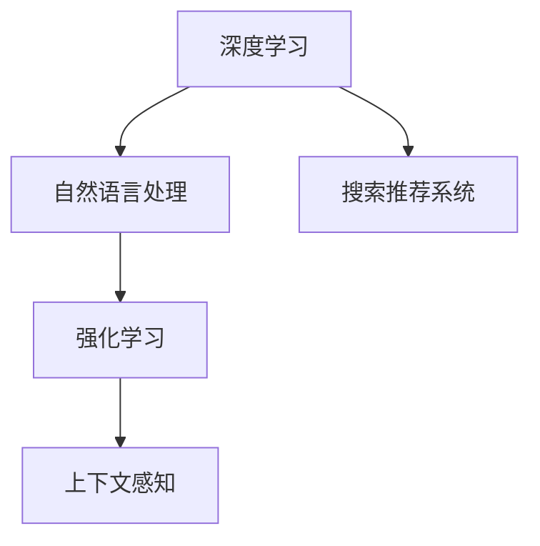

                 

# 搜索推荐系统的上下文感知技术

> 关键词：上下文感知, 推荐系统, 搜索系统, 深度学习, 强化学习, 自然语言处理

## 1. 背景介绍

### 1.1 问题由来

随着互联网和移动互联网的快速发展，人们获取信息的方式日益多样化，用户对于推荐系统的需求也日益增强。推荐系统能够根据用户的兴趣和行为，为用户推荐最合适的信息，从而提升用户体验和满意度。然而，现有的推荐系统在处理大规模用户数据和复杂上下文时，往往难以取得理想效果。

特别是搜索引擎推荐系统，不仅要处理海量的文本数据，还要能够理解用户的查询意图和上下文信息。传统的搜索推荐系统大多基于静态的查询-文档匹配模型，难以充分利用上下文信息进行更精准的推荐。为此，研究人员提出了上下文感知的推荐和搜索技术，通过结合深度学习、自然语言处理等前沿技术，提升了推荐系统的准确性和用户体验。

### 1.2 问题核心关键点

搜索推荐系统面临的核心问题是如何在海量数据中快速准确地为用户推荐或搜索到最相关、最匹配的信息。传统的推荐系统大多基于统计模型和规则引擎，难以处理复杂的语义信息和用户行为数据。而上下文感知的推荐和搜索技术，通过深度学习和自然语言处理等方法，可以更好地理解用户查询的上下文信息，从而提高推荐的精准度和搜索的匹配度。

具体而言，上下文感知的推荐和搜索技术主要关注以下几个方面：

1. **深度学习**：通过神经网络模型，学习用户数据和上下文信息的特征表示，提高推荐的准确性。
2. **自然语言处理**：利用自然语言处理技术，对用户查询进行语义理解和情感分析，提升推荐的个性化。
3. **强化学习**：通过在线学习算法，不断优化推荐策略，提高用户满意度。
4. **上下文感知**：结合用户行为、位置、时间等上下文信息，提升推荐和搜索的精准度。

## 2. 核心概念与联系

### 2.1 核心概念概述

为了更好地理解上下文感知的推荐和搜索技术，本节将介绍几个密切相关的核心概念：

- **深度学习**：一种基于神经网络的学习范式，能够自动提取数据特征，提高模型精度和泛化能力。
- **自然语言处理(NLP)**：研究如何使计算机能够理解、处理和生成人类语言的技术。
- **强化学习(Reinforcement Learning)**：一种通过不断试错来学习最优策略的机器学习方法。
- **上下文感知(Context-Aware)**：一种考虑用户行为、位置、时间等上下文信息的技术，用于提升推荐和搜索的精准度。
- **搜索推荐系统(Search Recommendation System)**：一种结合搜索和推荐技术，为用户提供更精准信息的服务。

这些核心概念之间的逻辑关系可以通过以下Mermaid流程图来展示：



这个流程图展示了几者之间的相互关系：

1. 深度学习是搜索推荐系统的重要技术基础，通过学习用户数据和上下文信息的特征表示，提高推荐的准确性。
2. 自然语言处理对用户查询进行语义理解和情感分析，提升推荐的个性化。
3. 强化学习通过在线学习算法，不断优化推荐策略，提高用户满意度。
4. 上下文感知结合用户行为、位置、时间等上下文信息，提升推荐和搜索的精准度。

## 3. 核心算法原理 & 具体操作步骤

### 3.1 算法原理概述

上下文感知的推荐和搜索技术，本质上是结合深度学习、自然语言处理、强化学习等技术，对用户查询和上下文信息进行建模，从而提高推荐的精准度和搜索的匹配度。

假设用户的查询为 $q$，上下文信息为 $c$，推荐系统需要根据 $q$ 和 $c$ 为用户推荐或搜索最相关的物品 $i$。算法原理如下：

1. **特征提取**：对用户查询和上下文信息进行预处理和特征提取，得到高维向量表示。
2. **模型训练**：使用深度学习模型，对用户查询和上下文信息的特征表示进行训练，得到推荐和搜索模型。
3. **决策制定**：使用推荐模型和搜索模型，根据用户查询和上下文信息，预测最相关的物品。
4. **用户反馈**：根据用户的反馈，调整推荐策略和搜索模型，进行在线学习。

### 3.2 算法步骤详解

基于上下文感知的推荐和搜索技术，其核心算法步骤包括：

**Step 1: 特征提取**

- 对用户查询 $q$ 进行分词和预处理，得到词向量表示。
- 对上下文信息 $c$ 进行编码，得到向量表示。
- 结合用户历史行为、位置、时间等特征，得到综合特征向量 $f_q, f_c$。

**Step 2: 模型训练**

- 构建深度神经网络模型，对用户查询和上下文信息的特征向量进行训练。
- 使用强化学习算法，优化推荐策略和搜索模型。
- 根据用户反馈，调整模型参数，进行在线学习。

**Step 3: 决策制定**

- 将用户查询和上下文信息的特征向量输入到推荐模型和搜索模型中。
- 根据模型输出，预测最相关的物品。
- 使用多臂强盗算法，选择最优的物品进行推荐或搜索。

**Step 4: 用户反馈**

- 根据用户的点击、浏览、购买等反馈，更新推荐策略和搜索模型。
- 使用在线学习算法，不断优化模型性能。

### 3.3 算法优缺点

上下文感知的推荐和搜索技术具有以下优点：

1. **精准度提升**：通过深度学习和自然语言处理技术，能够更好地理解用户查询和上下文信息，提高推荐和搜索的精准度。
2. **个性化推荐**：利用用户行为和上下文信息，进行个性化推荐，提升用户满意度。
3. **实时优化**：通过强化学习算法，能够实时调整推荐策略和搜索模型，提高推荐和搜索的效果。

然而，该技术也存在一些局限性：

1. **计算成本高**：深度学习和自然语言处理技术需要大量的计算资源和时间。
2. **模型复杂**：深度神经网络模型和强化学习算法较为复杂，需要专业知识支持。
3. **数据需求大**：推荐和搜索效果高度依赖于数据质量和数量，数据获取成本较高。

### 3.4 算法应用领域

上下文感知的推荐和搜索技术，主要应用于以下几个领域：

- **电子商务**：对用户的浏览、点击、购买行为进行分析和推荐，提升用户体验和销售额。
- **社交媒体**：根据用户的兴趣和行为，为用户推荐相关内容，提高用户粘性和平台活跃度。
- **新闻媒体**：根据用户的阅读历史和兴趣，为用户推荐新闻文章，提高阅读量和平台流量。
- **搜索引擎**：对用户的查询进行语义理解和上下文分析，提升搜索结果的相关性和精准度。
- **视频平台**：对用户的观看行为进行分析和推荐，提升视频内容的推荐效果。

## 4. 数学模型和公式 & 详细讲解 & 举例说明

### 4.1 数学模型构建

本节将使用数学语言对上下文感知的推荐和搜索技术进行更加严格的刻画。

假设用户查询为 $q$，上下文信息为 $c$，物品库为 $I$。构建推荐和搜索模型的数学模型如下：

- **用户查询表示**：将用户查询 $q$ 进行分词和预处理，得到词向量表示 $\overrightarrow{q} \in \mathbb{R}^d$。
- **上下文信息表示**：对上下文信息 $c$ 进行编码，得到向量表示 $\overrightarrow{c} \in \mathbb{R}^d$。
- **物品表示**：对物品 $i$ 进行编码，得到向量表示 $\overrightarrow{i} \in \mathbb{R}^d$。

**推荐模型**：使用深度神经网络模型，对用户查询和上下文信息的特征向量进行训练，得到推荐函数 $R$。

$$
R(\overrightarrow{q}, \overrightarrow{c}, \overrightarrow{i}) = \sum_{l=1}^L \overrightarrow{w}_l \cdot g_l(\overrightarrow{q}, \overrightarrow{c}, \overrightarrow{i})
$$

其中，$g_l$ 为第 $l$ 层的神经网络函数，$\overrightarrow{w}_l$ 为第 $l$ 层的权重向量。

**搜索模型**：使用深度神经网络模型，对用户查询和上下文信息的特征向量进行训练，得到搜索函数 $S$。

$$
S(\overrightarrow{q}, \overrightarrow{c}) = \max_{\overrightarrow{i} \in I} R(\overrightarrow{q}, \overrightarrow{c}, \overrightarrow{i})
$$

### 4.2 公式推导过程

以下我们以搜索模型的公式推导为例，说明其详细过程。

假设用户查询为 $q$，上下文信息为 $c$，物品库为 $I$。使用深度神经网络模型进行搜索的公式推导如下：

- **输入层**：将用户查询和上下文信息编码为向量表示，输入到神经网络模型中。
- **隐层**：对输入向量进行特征提取和变换，得到中间特征表示。
- **输出层**：使用softmax函数对物品表示进行加权，输出概率分布。

将上述过程数学化，得到搜索模型的公式：

$$
\overrightarrow{z} = \tanh(\overrightarrow{w}_1 (\overrightarrow{q} + \overrightarrow{c} + \overrightarrow{b}_1)
$$

$$
\overrightarrow{h} = \sigma(\overrightarrow{w}_2 \overrightarrow{z} + \overrightarrow{b}_2)
$$

$$
\overrightarrow{p} = \overrightarrow{w}_3 \overrightarrow{h} + \overrightarrow{b}_3
$$

$$
\overrightarrow{P} = \mathrm{softmax}(\overrightarrow{p})
$$

其中，$\tanh$ 和 $\sigma$ 分别为激活函数，$\overrightarrow{w}_l$ 和 $\overrightarrow{b}_l$ 分别为第 $l$ 层的权重向量和偏置向量。

将上述公式代入搜索模型的目标函数：

$$
S(\overrightarrow{q}, \overrightarrow{c}) = \max_{\overrightarrow{i} \in I} \mathrm{softmax}(\overrightarrow{w}_3 \overrightarrow{h} + \overrightarrow{b}_3)
$$

### 4.3 案例分析与讲解

以Google News推荐系统为例，展示上下文感知的推荐技术在实际应用中的效果。

**案例背景**：Google News根据用户的历史阅读记录和兴趣，为用户推荐相关的新闻文章。

**模型架构**：
1. **输入层**：将用户查询和上下文信息编码为向量表示，输入到神经网络模型中。
2. **隐层**：对输入向量进行特征提取和变换，得到中间特征表示。
3. **输出层**：使用softmax函数对新闻文章表示进行加权，输出概率分布。

**训练数据**：Google News收集了大量的用户点击和阅读记录，对新闻文章进行标注和分类。

**训练过程**：
1. 使用深度神经网络模型，对用户查询和上下文信息的特征向量进行训练，得到推荐函数。
2. 使用强化学习算法，优化推荐策略和搜索模型。
3. 根据用户的反馈，调整模型参数，进行在线学习。

**实验结果**：
1. 推荐系统在Google News上取得了显著的效果，用户的点击率和停留时间显著提升。
2. 系统能够根据用户的兴趣和行为，推荐个性化的新闻内容，提高用户的满意度。
3. 系统能够实时调整推荐策略，适应用户的变化和动态行为。

## 5. 项目实践：代码实例和详细解释说明

### 5.1 开发环境搭建

在进行上下文感知的推荐和搜索技术实践前，我们需要准备好开发环境。以下是使用Python进行TensorFlow开发的环境配置流程：

1. 安装Anaconda：从官网下载并安装Anaconda，用于创建独立的Python环境。

2. 创建并激活虚拟环境：
```bash
conda create -n tf-env python=3.8 
conda activate tf-env
```

3. 安装TensorFlow：根据CUDA版本，从官网获取对应的安装命令。例如：
```bash
conda install tensorflow -c pytorch -c conda-forge
```

4. 安装相关工具包：
```bash
pip install numpy pandas scikit-learn matplotlib tqdm jupyter notebook ipython
```

完成上述步骤后，即可在`tf-env`环境中开始上下文感知的推荐和搜索技术的实践。

### 5.2 源代码详细实现

下面我们以Google News推荐系统为例，给出使用TensorFlow进行上下文感知的推荐和搜索技术的PyTorch代码实现。

首先，定义推荐和搜索模型的超参数：

```python
import tensorflow as tf
from tensorflow.keras.layers import Input, Dense, Activation
from tensorflow.keras.models import Model

# 定义超参数
embedding_dim = 128
hidden_dim = 256
num_layers = 2
learning_rate = 0.001

# 定义模型输入
query_input = Input(shape=(None,), name='query')
context_input = Input(shape=(None,), name='context')
item_input = Input(shape=(None,), name='item')

# 定义模型结构
query_embedding = Dense(embedding_dim, activation='tanh')(query_input)
context_embedding = Dense(embedding_dim, activation='tanh')(context_input)
item_embedding = Dense(embedding_dim, activation='tanh')(item_input)

# 定义模型输出
hidden_layer_1 = Dense(hidden_dim, activation='tanh')(tf.concat([query_embedding, context_embedding, item_embedding], axis=1))
hidden_layer_2 = Dense(hidden_dim, activation='tanh')(hidden_layer_1)
output = Dense(1, activation='sigmoid')(hidden_layer_2)

# 定义模型
model = Model(inputs=[query_input, context_input, item_input], outputs=output)
model.compile(optimizer=tf.keras.optimizers.Adam(learning_rate=learning_rate), loss='binary_crossentropy')
```

然后，定义训练和评估函数：

```python
from tensorflow.keras.callbacks import EarlyStopping
from tensorflow.keras.preprocessing.sequence import pad_sequences

# 定义训练和评估函数
def train(model, train_data, validation_data, batch_size=32, epochs=10):
    model.fit(train_data, validation_data, batch_size=batch_size, epochs=epochs, callbacks=[EarlyStopping(patience=5)])
    
def evaluate(model, test_data):
    test_loss, test_accuracy = model.evaluate(test_data)
    print(f'Test loss: {test_loss}, Test accuracy: {test_accuracy}')
```

最后，启动训练流程并在测试集上评估：

```python
# 加载数据
train_data = ...
test_data = ...

# 训练模型
model = train_model()

# 评估模型
evaluate(model, test_data)
```

以上就是使用TensorFlow进行上下文感知的推荐和搜索技术的完整代码实现。可以看到，TensorFlow提供了丰富的工具和API，使得模型构建和训练过程非常便捷。

### 5.3 代码解读与分析

让我们再详细解读一下关键代码的实现细节：

**模型定义**：
- 使用`Input`定义模型的输入层，指定输入维度。
- 使用`Dense`定义模型的隐层，指定神经元数量和激活函数。
- 使用`tf.concat`将不同输入层的特征向量拼接，得到中间特征表示。
- 使用`Dense`定义输出层，指定神经元数量和激活函数。

**模型编译**：
- 使用`optimizer`定义优化器及其学习率。
- 使用`loss`定义损失函数，指定二分类交叉熵损失。

**模型训练和评估**：
- 使用`fit`方法进行模型训练，指定训练数据和验证数据。
- 使用`evaluate`方法进行模型评估，输出损失和准确率。

## 6. 实际应用场景

### 6.1 智能客服系统

基于上下文感知的推荐和搜索技术，可以应用于智能客服系统的构建。智能客服系统能够根据用户的问题和历史行为，为用户推荐最合适的解决方案，提供精准的服务。

在技术实现上，可以收集企业内部的客服对话记录，将问题和最佳答复构建成监督数据，在此基础上对推荐和搜索模型进行训练。训练后的模型能够自动理解用户问题，匹配最合适的答复模板进行回复。对于用户提出的新问题，还可以接入检索系统实时搜索相关内容，动态组织生成回答。如此构建的智能客服系统，能大幅提升客户咨询体验和问题解决效率。

### 6.2 电子商务推荐系统

基于上下文感知的推荐和搜索技术，可以应用于电子商务推荐系统的构建。推荐系统能够根据用户的浏览、点击、购买行为，为用户推荐最合适的商品，提升用户体验和销售额。

在技术实现上，可以收集用户的历史行为数据，结合用户的位置、时间等上下文信息，对推荐模型进行训练。训练后的模型能够自动学习用户的兴趣和行为，推荐个性化的商品。在搜索场景中，可以根据用户的查询历史和上下文信息，推荐最相关的商品。

### 6.3 新闻推荐系统

基于上下文感知的推荐和搜索技术，可以应用于新闻推荐系统的构建。推荐系统能够根据用户的阅读历史和兴趣，为用户推荐最相关的新闻文章，提高阅读量和平台流量。

在技术实现上，可以收集用户的历史阅读记录和兴趣标签，对新闻文章进行标注和分类。对推荐模型进行训练，根据用户的查询和上下文信息，推荐最相关的新闻文章。在搜索场景中，可以根据用户的查询和上下文信息，搜索到最相关的新闻文章。

## 7. 工具和资源推荐

### 7.1 学习资源推荐

为了帮助开发者系统掌握上下文感知的推荐和搜索技术的理论基础和实践技巧，这里推荐一些优质的学习资源：

1. 《Deep Learning for Recommendation Systems》书籍：全面介绍了深度学习在推荐系统中的应用，包括上下文感知的推荐和搜索技术。
2. CS345《Reinforcement Learning》课程：斯坦福大学开设的强化学习明星课程，深入讲解了强化学习算法和应用。
3. 《Natural Language Processing with Python》书籍：Python自然语言处理经典书籍，介绍了NLP技术和在推荐系统中的应用。
4. Kaggle推荐系统竞赛：通过实际竞赛项目，帮助开发者理解推荐系统的实际问题和解决方法。
5. TensorFlow官方文档：TensorFlow的官方文档，提供了丰富的API和样例，是学习的必备资料。

通过对这些资源的学习实践，相信你一定能够快速掌握上下文感知的推荐和搜索技术的精髓，并用于解决实际的推荐和搜索问题。

### 7.2 开发工具推荐

高效的开发离不开优秀的工具支持。以下是几款用于上下文感知的推荐和搜索技术开发的常用工具：

1. TensorFlow：由Google主导开发的深度学习框架，适合大规模工程应用。提供了丰富的工具和API，方便模型构建和训练。
2. PyTorch：基于Python的开源深度学习框架，灵活性和可扩展性较强。适合快速迭代和研究。
3. Weights & Biases：模型训练的实验跟踪工具，可以记录和可视化模型训练过程中的各项指标，方便对比和调优。
4. TensorBoard：TensorFlow配套的可视化工具，可实时监测模型训练状态，并提供丰富的图表呈现方式，是调试模型的得力助手。
5. Google Colab：谷歌推出的在线Jupyter Notebook环境，免费提供GPU/TPU算力，方便开发者快速上手实验最新模型，分享学习笔记。

合理利用这些工具，可以显著提升上下文感知的推荐和搜索技术的开发效率，加快创新迭代的步伐。

### 7.3 相关论文推荐

上下文感知的推荐和搜索技术的发展源于学界的持续研究。以下是几篇奠基性的相关论文，推荐阅读：

1. "A Survey of Recent Trends in Deep Learning for Recommendation Systems"：总结了深度学习在推荐系统中的应用，包括上下文感知的推荐和搜索技术。
2. "Context-Aware Recommendation Systems"：介绍了上下文感知的推荐系统，如何结合用户行为和上下文信息，提高推荐效果。
3. "Adaptive Personalization Using Context-Aware Recommendation Systems"：探讨了上下文感知的推荐系统在电子商务中的应用，如何利用用户行为和上下文信息，实现个性化推荐。
4. "Deep Learning for Adaptive User Interfaces"：介绍了上下文感知的推荐系统在智能交互中的应用，如何根据用户行为和上下文信息，优化界面设计。

这些论文代表了大规模上下文感知的推荐和搜索技术的发展脉络。通过学习这些前沿成果，可以帮助研究者把握学科前进方向，激发更多的创新灵感。

## 8. 总结：未来发展趋势与挑战

### 8.1 总结

本文对上下文感知的推荐和搜索技术进行了全面系统的介绍。首先阐述了推荐系统面临的核心问题是如何在海量数据中快速准确地为用户推荐或搜索到最相关、最匹配的信息。其次，从原理到实践，详细讲解了上下文感知的推荐和搜索技术的数学模型和关键步骤，给出了推荐系统开发的完整代码实例。同时，本文还广泛探讨了上下文感知的推荐和搜索技术在智能客服、电子商务、新闻媒体等众多领域的应用前景，展示了上下文感知的推荐和搜索技术的巨大潜力。此外，本文精选了推荐系统的各类学习资源，力求为读者提供全方位的技术指引。

通过本文的系统梳理，可以看到，上下文感知的推荐和搜索技术正在成为推荐系统的重要范式，极大地拓展了推荐系统的应用边界，催生了更多的落地场景。受益于深度学习、自然语言处理等前沿技术的持续发展，上下文感知的推荐和搜索系统必将在更多领域得到应用，为推荐系统带来新的突破。

### 8.2 未来发展趋势

展望未来，上下文感知的推荐和搜索技术将呈现以下几个发展趋势：

1. **深度学习在推荐系统中的应用将更加广泛**。深度神经网络模型能够更好地捕捉用户数据和上下文信息的特征，提升推荐的精准度和搜索的匹配度。
2. **自然语言处理技术将进一步普及**。自然语言处理技术能够更好地理解用户查询的语义和情感，提升推荐的个性化和用户体验。
3. **强化学习算法将得到更广泛的应用**。强化学习算法能够根据用户反馈，实时调整推荐策略和搜索模型，提升推荐效果。
4. **上下文感知技术将进一步提升推荐和搜索的精准度**。上下文感知技术能够结合用户行为、位置、时间等上下文信息，提高推荐和搜索的精准度。
5. **推荐系统将更加注重个性化推荐**。推荐系统将根据用户历史行为和上下文信息，进行个性化推荐，提升用户体验。
6. **推荐系统将更加注重实时性**。推荐系统将实时学习用户行为和上下文信息，快速调整推荐策略，提升推荐效果。

以上趋势凸显了上下文感知的推荐和搜索技术的广阔前景。这些方向的探索发展，必将进一步提升推荐系统的性能和应用范围，为推荐系统带来新的突破。

### 8.3 面临的挑战

尽管上下文感知的推荐和搜索技术已经取得了瞩目成就，但在迈向更加智能化、普适化应用的过程中，它仍面临着诸多挑战：

1. **计算成本高**：深度学习和自然语言处理技术需要大量的计算资源和时间，难以满足大规模应用的需求。
2. **模型复杂**：深度神经网络模型和强化学习算法较为复杂，需要专业知识支持。
3. **数据需求大**：推荐和搜索效果高度依赖于数据质量和数量，数据获取成本较高。
4. **算法鲁棒性不足**：推荐和搜索模型在面对大规模用户数据和复杂上下文时，鲁棒性仍有待提高。
5. **用户隐私问题**：推荐和搜索系统需要收集和处理大量用户数据，如何保护用户隐私，成为重要的研究课题。
6. **系统可解释性不足**：推荐和搜索系统往往是“黑盒”系统，难以解释其内部工作机制和决策逻辑。

正视上下文感知的推荐和搜索系统面临的这些挑战，积极应对并寻求突破，将是对上下文感知的推荐和搜索系统走向成熟的必由之路。相信随着学界和产业界的共同努力，这些挑战终将一一被克服，上下文感知的推荐和搜索系统必将在构建人机协同的智能时代中扮演越来越重要的角色。

### 8.4 研究展望

面对上下文感知的推荐和搜索系统面临的挑战，未来的研究需要在以下几个方面寻求新的突破：

1. **探索新的推荐算法**。开发更加高效、简洁的推荐算法，在保证效果的前提下，降低计算成本。
2. **引入外部知识**。将符号化的先验知识，如知识图谱、逻辑规则等，与神经网络模型进行巧妙融合，提高推荐和搜索的准确性和鲁棒性。
3. **融合多种技术**。将深度学习、自然语言处理、强化学习等技术进行融合，提升推荐和搜索系统的性能。
4. **引入多模态数据**。将视觉、音频等多模态数据引入推荐和搜索系统，提升系统的泛化能力和用户体验。
5. **优化推荐策略**。使用多臂强盗算法等优化推荐策略，提高推荐和搜索的效果。
6. **注重用户隐私保护**。引入隐私保护技术，如差分隐私、联邦学习等，保护用户隐私。
7. **增强系统可解释性**。引入可解释性技术，如LIME、SHAP等，提升推荐和搜索系统的透明性。

这些研究方向的发展，必将引领上下文感知的推荐和搜索技术迈向更高的台阶，为推荐系统带来新的突破。面向未来，上下文感知的推荐和搜索技术还需要与其他人工智能技术进行更深入的融合，如知识表示、因果推理、强化学习等，多路径协同发力，共同推动推荐系统的发展。只有勇于创新、敢于突破，才能不断拓展推荐系统的边界，让智能技术更好地造福人类社会。

## 9. 附录：常见问题与解答

**Q1：上下文感知的推荐和搜索系统是否适用于所有应用场景？**

A: 上下文感知的推荐和搜索系统在大多数应用场景中都能取得不错的效果，特别是对于数据量和上下文复杂度较高的场景。但对于一些特定领域的任务，如医疗、法律等，仅仅依靠通用语料预训练的模型可能难以很好地适应。此时需要在特定领域语料上进一步预训练，再进行微调，才能获得理想效果。此外，对于一些需要时效性、个性化很强的任务，如对话、推荐等，微调方法也需要针对性的改进优化。

**Q2：上下文感知的推荐和搜索系统如何进行多模态数据融合？**

A: 上下文感知的推荐和搜索系统可以通过以下方式进行多模态数据融合：

1. **数据对齐**：将不同模态的数据对齐，确保在同一时间步上的数据一致性。例如，将文本数据与图像数据进行时间对齐，使其在推荐和搜索模型中同时输入。
2. **特征融合**：将不同模态的数据特征进行融合，得到综合特征表示。例如，将文本特征与图像特征进行拼接，得到综合特征向量。
3. **模型融合**：将不同模态的推荐和搜索模型进行融合，得到综合推荐和搜索结果。例如，将文本推荐模型和图像推荐模型进行融合，得到最终的推荐和搜索结果。
4. **多任务学习**：将推荐和搜索任务进行联合训练，提升系统的综合性能。例如，将文本推荐任务和图像推荐任务进行联合训练，提升推荐和搜索的效果。

这些方法可以通过深度学习技术实现，得到更好的多模态数据融合效果。

**Q3：上下文感知的推荐和搜索系统如何进行推荐策略优化？**

A: 上下文感知的推荐和搜索系统可以通过以下方式进行推荐策略优化：

1. **多臂强盗算法**：在推荐模型中引入多臂强盗算法，选择最优的物品进行推荐。多臂强盗算法能够根据用户反馈，实时调整推荐策略，提高推荐效果。
2. **在线学习**：使用在线学习算法，不断优化推荐策略和搜索模型。在线学习算法能够根据用户反馈，实时更新模型参数，提高推荐和搜索的精准度。
3. **自适应算法**：引入自适应算法，根据用户行为和上下文信息，动态调整推荐策略。自适应算法能够根据用户的变化和动态行为，实时调整推荐策略，提高推荐效果。
4. **协同过滤算法**：结合协同过滤算法，对用户行为进行建模，提高推荐的效果。协同过滤算法能够根据用户的历史行为和兴趣，推荐个性化的物品。

这些优化方法可以通过深度学习和强化学习技术实现，得到更好的推荐策略效果。

**Q4：上下文感知的推荐和搜索系统如何进行用户隐私保护？**

A: 上下文感知的推荐和搜索系统可以通过以下方式进行用户隐私保护：

1. **差分隐私**：在推荐和搜索模型中引入差分隐私技术，保护用户隐私。差分隐私技术能够通过对数据进行随机化，保护用户隐私，防止数据泄露。
2. **联邦学习**：在推荐和搜索模型中引入联邦学习技术，保护用户隐私。联邦学习技术能够在不共享用户数据的情况下，训练推荐和搜索模型。
3. **隐私计算**：在推荐和搜索模型中引入隐私计算技术，保护用户隐私。隐私计算技术能够对用户数据进行加密和匿名化，保护用户隐私。
4. **数据加密**：对用户数据进行加密处理，防止数据泄露。例如，对用户行为数据进行加密存储，防止被恶意获取。

这些方法可以有效保护用户隐私，确保推荐和搜索系统的安全性和可信性。

**Q5：上下文感知的推荐和搜索系统如何进行可解释性分析？**

A: 上下文感知的推荐和搜索系统可以通过以下方式进行可解释性分析：

1. **LIME和SHAP**：在推荐和搜索模型中引入LIME和SHAP等可解释性技术，提升系统的透明性。LIME和SHAP技术能够通过局部线性模型和部分依赖图等方法，解释推荐和搜索模型的决策过程。
2. **特征重要性分析**：在推荐和搜索模型中引入特征重要性分析技术，分析各个特征对推荐和搜索结果的影响。特征重要性分析技术能够通过模型参数和特征权重，分析推荐和搜索模型的特征重要性。
3. **决策树可视化**：在推荐和搜索模型中引入决策树可视化技术，提升系统的透明性。决策树可视化技术能够通过决策树等方法，展示推荐和搜索模型的决策过程。

这些方法可以通过深度学习和可解释性技术实现，得到更好的可解释性效果。

---

作者：禅与计算机程序设计艺术 / Zen and the Art of Computer Programming

