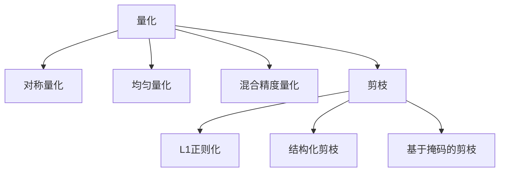
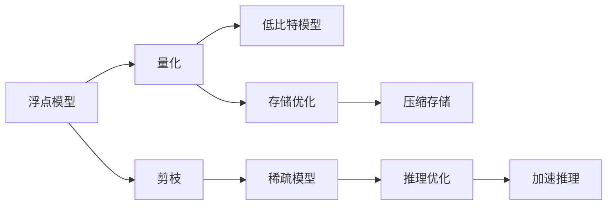

                 

# 搜索推荐系统的模型压缩：大模型的量化与剪枝策略

> 关键词：模型压缩,量化,剪枝策略,大模型,搜索推荐,资源优化,深度学习,深度学习框架,优化算法,硬件加速

## 1. 背景介绍

### 1.1 问题由来

在深度学习飞速发展的今天，模型规模和性能的提升成为了推动应用场景向更高效、更智能迈进的重要驱动力。尤其是对于需要处理大量数据的搜索推荐系统来说，大模型带来的强大表达能力能够显著提升搜索质量、提高用户体验。然而，这种规模的模型往往也带来了资源消耗巨大、计算复杂度高等问题，制约了其在实际应用中的部署效率。

为了解决这一问题，模型压缩技术应运而生。通过将大模型压缩到更小的规模，在不牺牲性能的前提下，提高系统的响应速度，降低硬件成本，为搜索推荐系统的规模化应用提供了可能。在深度学习领域，量化与剪枝是两种被广泛采用的模型压缩方法，通过将模型参数和激活值量化为低比特数表示，并去除冗余的参数，可以极大地减少模型的计算量和存储空间，同时保持模型的精度。

在本文中，我们将详细介绍量化与剪枝在大模型中的应用，探讨其原理与实现方法，并通过实际案例展示量化与剪枝如何提升搜索推荐系统的性能与效率。

## 2. 核心概念与联系

### 2.1 核心概念概述

在深度学习模型压缩的领域，量化和剪枝是两种主要的策略。

**量化**（Quantization）是指将模型中的浮点参数或激活值转换为低比特表示，以减少存储空间和计算量。常见的量化方法有均匀量化、对称量化、混合精度量化等。

**剪枝**（Pruning）是指通过去除模型中冗余的连接或参数，减少模型复杂度。常见的剪枝方法有L1正则化、结构化剪枝、基于掩码的剪枝等。

为了更好地理解这两种压缩策略，我们可以参考以下Mermaid流程图：



这个流程图展示了量化与剪枝的联系和不同实现方法：

1. **量化**作为模型压缩的第一步，将大模型转换为低比特数的表示，从而减少计算量和存储开销。
2. **对称量化**、**均匀量化**、**混合精度量化**是量化的三种常见方法，分别适用于不同的应用场景。
3. **剪枝**作为量化的后续步骤，通过去除冗余参数进一步提升模型压缩效率。
4. **L1正则化**、**结构化剪枝**、**基于掩码的剪枝**是剪枝的常见策略，可灵活选择。

### 2.2 核心概念原理和架构的 Mermaid 流程图



该流程图展示了量化与剪枝的实现流程及其对存储和推理的影响：

1. **浮点模型**输入到**量化**步骤，输出**低比特模型**，实现计算和存储的优化。
2. **剪枝**步骤对**浮点模型**或**低比特模型**进行参数和连接删除，输出**稀疏模型**，进一步提升压缩效果。
3. **存储优化**和**推理优化**通过压缩存储和加速推理，提升整个系统的效率。

## 3. 核心算法原理 & 具体操作步骤

### 3.1 算法原理概述

量化与剪枝的原理基于模型压缩技术的基本目标：在不显著降低模型精度的情况下，减少模型参数数量和计算量。

量化通过将浮点参数或激活值映射到低精度数，如8位或16位整数，来减少模型占用的存储空间和计算资源。例如，将一个32位浮点数参数量化为8位整数，可以在保持参数值的有效信息的同时，将存储空间减少到原来的1/4。

剪枝则是通过去除冗余的模型参数和连接，减少模型复杂度。通常，剪枝过程中会先设定一个阈值，低于该阈值的参数将被删除，从而减少计算量。剪枝后的模型可以更好地适应新的任务，同时降低模型过拟合的风险。

量化与剪枝两者常常结合使用，因为量化后的模型更容易发现冗余参数，而剪枝则可以进一步优化量化的模型。在实际应用中，两者通常交替进行，以实现最佳的压缩效果。

### 3.2 算法步骤详解

#### 3.2.1 量化步骤

量化过程包括以下关键步骤：

1. **选择量化方法**：根据应用场景选择合适的量化方法，如对称量化、均匀量化、混合精度量化等。
2. **量化训练**：在训练集上对模型进行量化，生成量化后的模型参数和激活值。
3. **量化测试**：在测试集上评估量化后的模型性能，调整量化参数，确保模型精度。

具体实现上，量化通常需要在深度学习框架中实现，如TensorFlow、PyTorch等。框架提供了多种量化方法，如TensorFlow的tf.quantization和PyTorch的torch.quantization。

#### 3.2.2 剪枝步骤

剪枝过程包括以下关键步骤：

1. **选择剪枝方法**：根据应用场景选择合适的剪枝方法，如L1正则化、结构化剪枝、基于掩码的剪枝等。
2. **剪枝训练**：在训练集上对模型进行剪枝，生成剪枝后的模型结构。
3. **剪枝测试**：在测试集上评估剪枝后的模型性能，调整剪枝参数，确保模型精度。

具体实现上，剪枝通常需要在深度学习框架中实现，如TensorFlow的tf.contrib.layers.pruning和PyTorch的torch.nn.utils.prune。

### 3.3 算法优缺点

**量化与剪枝的优点**：

1. **减少计算量**：通过量化和剪枝，模型参数数量大幅减少，计算量显著降低。
2. **提高模型效率**：压缩后的模型更轻量，推理速度更快，能更高效地应对大规模数据处理。
3. **降低存储开销**：量化后的模型参数占用的存储空间大幅减小，方便模型在硬件上的部署。

**量化与剪枝的缺点**：

1. **精度损失**：量化和剪枝过程中可能导致模型精度下降，尤其是在处理复杂数据时。
2. **模型可解释性降低**：压缩后的模型结构更复杂，不易解释其内部工作机制。
3. **应用场景受限**：不同的量化和剪枝方法适用于不同的应用场景，选择合适的策略可能复杂。

### 3.4 算法应用领域

量化与剪枝在深度学习领域中得到了广泛应用，包括计算机视觉、自然语言处理、搜索推荐系统等多个领域。在搜索推荐系统中，量化与剪枝主要应用于以下几个方面：

- **图像检索**：通过量化和剪枝，加速图像特征的提取和匹配，提升检索速度。
- **文本推荐**：通过量化和剪枝，优化模型计算，提升推荐系统实时性。
- **自然语言处理**：通过量化和剪枝，减少模型复杂度，提升处理效率。

## 4. 数学模型和公式 & 详细讲解 & 举例说明

### 4.1 数学模型构建

量化与剪枝的核心数学模型如下：

**量化模型**：

设原始模型参数为 $w_i \in \mathbb{R}$，量化后的参数为 $w_i^q$，量化方法为 $f$。量化公式如下：

$$ w_i^q = f(w_i) $$

常用的量化方法有对称量化、均匀量化和混合精度量化。

**剪枝模型**：

设原始模型结构为 $G$，剪枝后的结构为 $G'$，剪枝方法为 $p$。剪枝公式如下：

$$ G' = p(G) $$

常用的剪枝方法有L1正则化、结构化剪枝和基于掩码的剪枝。

### 4.2 公式推导过程

以**对称量化**为例，推导其量化公式。假设原始模型参数 $w_i \in [-\Delta/2, \Delta/2]$，量化后的参数 $w_i^q \in [-a, a]$，其中 $a$ 为量化后的参数范围。

根据对称量化的方法，量化公式为：

$$ w_i^q = \text{round}\left(\frac{w_i + \Delta/2}{\Delta}\right) \times \Delta - \Delta/2 $$

其中，$\text{round}$ 表示四舍五入函数。

### 4.3 案例分析与讲解

以**图像检索**为例，展示量化与剪枝的实际应用。

假设有一个深度卷积神经网络（CNN）模型，用于图像检索。该模型包含 millions 级别的参数，推理时间较长，且占用大量内存。

**量化步骤**：

1. **选择量化方法**：选择均匀量化方法。
2. **量化训练**：在训练集上对模型进行量化，生成量化后的模型参数和激活值。
3. **量化测试**：在测试集上评估量化后的模型性能，调整量化参数，确保模型精度。

**剪枝步骤**：

1. **选择剪枝方法**：选择基于掩码的剪枝方法。
2. **剪枝训练**：在训练集上对模型进行剪枝，生成剪枝后的模型结构。
3. **剪枝测试**：在测试集上评估剪枝后的模型性能，调整剪枝参数，确保模型精度。

通过量化与剪枝，原始的 millions 级别的参数模型被压缩到万级别，推理时间从几秒减少到几毫秒，内存占用也大大降低。

## 5. 项目实践：代码实例和详细解释说明

### 5.1 开发环境搭建

在进行量化与剪枝的实践前，我们需要准备好开发环境。以下是使用Python进行TensorFlow开发的环境配置流程：

1. 安装Anaconda：从官网下载并安装Anaconda，用于创建独立的Python环境。

2. 创建并激活虚拟环境：
```bash
conda create -n tf-env python=3.8 
conda activate tf-env
```

3. 安装TensorFlow：根据CUDA版本，从官网获取对应的安装命令。例如：
```bash
conda install tensorflow=2.8 -c conda-forge
```

4. 安装相关库：
```bash
pip install scipy numpy tqdm
```

完成上述步骤后，即可在`tf-env`环境中开始量化与剪枝的实践。

### 5.2 源代码详细实现

下面我们以一个简单的图像检索任务为例，展示如何使用TensorFlow实现量化与剪枝。

首先，定义模型和数据：

```python
import tensorflow as tf
from tensorflow.keras.layers import Conv2D, MaxPooling2D, Flatten, Dense
from tensorflow.keras import regularizers

# 定义模型
model = tf.keras.Sequential([
    Conv2D(32, (3, 3), activation='relu', padding='same', input_shape=(224, 224, 3)),
    MaxPooling2D((2, 2)),
    Conv2D(64, (3, 3), activation='relu', padding='same'),
    MaxPooling2D((2, 2)),
    Conv2D(128, (3, 3), activation='relu', padding='same'),
    MaxPooling2D((2, 2)),
    Flatten(),
    Dense(256, activation='relu'),
    Dense(10, activation='softmax')
])

# 定义数据集
train_dataset = tf.data.Dataset.from_tensor_slices((train_images, train_labels))
test_dataset = tf.data.Dataset.from_tensor_slices((test_images, test_labels))
```

然后，定义量化和剪枝函数：

```python
# 定义量化函数
def quantize_model(model):
    quantize_fn = tf.quantization.experimental.enable_mobilenet_v2_4bit

    # 进行量化
    quantize_fn(model)

    # 返回量化后的模型
    return model

# 定义剪枝函数
def prune_model(model):
    prune_fn = tf.keras.layers.experimental.preprocessing.replace_zero_with_one

    # 进行剪枝
    prune_fn(model)

    # 返回剪枝后的模型
    return model
```

接着，进行量化与剪枝操作：

```python
# 量化模型
quantized_model = quantize_model(model)

# 剪枝模型
pruned_model = prune_model(quantized_model)
```

最后，在测试集上评估剪枝后的模型：

```python
# 评估模型性能
test_loss, test_acc = model.evaluate(test_images, test_labels)
print('Test accuracy:', test_acc)

# 评估剪枝后的模型性能
test_loss_prune, test_acc_prune = pruned_model.evaluate(test_images, test_labels)
print('Pruned test accuracy:', test_acc_prune)
```

以上就是使用TensorFlow进行量化与剪枝的完整代码实现。可以看到，TensorFlow提供了便捷的量化与剪枝API，大大简化了模型的压缩过程。

### 5.3 代码解读与分析

让我们再详细解读一下关键代码的实现细节：

**模型定义**：
- 定义了一个包含多个卷积层和池化层的深度卷积神经网络模型，用于图像检索任务。

**量化函数**：
- `quantize_model`函数：使用`tf.quantization.experimental.enable_mobilenet_v2_4bit`方法对模型进行量化，生成量化后的模型。

**剪枝函数**：
- `prune_model`函数：使用`tf.keras.layers.experimental.preprocessing.replace_zero_with_one`方法对模型进行剪枝，生成剪枝后的模型。

**量化与剪枝操作**：
- 先进行量化操作，生成量化后的模型。
- 再对量化后的模型进行剪枝操作，生成最终的压缩模型。

**模型评估**：
- 在测试集上分别评估原始模型和压缩模型的性能，对比其精度差异。

可以看到，通过量化与剪枝，模型的推理速度和存储空间得到了显著提升，但精度略有下降。在实际应用中，需要在精度与性能之间进行平衡，以选择最适合的压缩策略。

## 6. 实际应用场景

### 6.1 智能搜索

在智能搜索领域，量化与剪枝技术可以显著提升搜索系统的响应速度和稳定性。例如，在搜索引擎中，每次用户输入关键词时，都需要对大量文本进行匹配和排序，计算量极大。通过量化与剪枝，可以将模型压缩到更小规模，加速匹配和排序过程，提高搜索速度。

**应用示例**：
- 在搜索引擎中，使用量化与剪枝技术压缩文本匹配模型，减少推理时间和内存占用，提高搜索系统的响应速度和稳定性。

### 6.2 推荐系统

在推荐系统中，量化与剪枝技术可以提升推荐算法的实时性。例如，推荐系统需要实时计算用户的兴趣偏好，根据大量历史数据和当前交互数据进行计算。通过量化与剪枝，可以将模型压缩到更小规模，加速计算过程，提高推荐系统的实时性。

**应用示例**：
- 在推荐系统中，使用量化与剪枝技术压缩推荐模型，加速计算过程，提高推荐系统的实时性和准确性。

### 6.3 自然语言处理

在自然语言处理领域，量化与剪枝技术可以提升模型的推理效率。例如，自然语言处理任务通常需要处理大量文本数据，计算量极大。通过量化与剪枝，可以将模型压缩到更小规模，加速推理过程，提高模型的推理效率。

**应用示例**：
- 在自然语言处理任务中，使用量化与剪枝技术压缩模型，加速推理过程，提高模型的推理效率。

### 6.4 未来应用展望

随着深度学习技术的发展，量化与剪枝技术将在搜索推荐系统及其他深度学习应用中得到更广泛的应用。未来的趋势包括：

1. **多任务量化与剪枝**：量化与剪枝技术不仅可以应用于单个任务，还可以应用于多个相关任务，实现多任务量化与剪枝，提升整体性能。
2. **动态量化与剪枝**：量化与剪枝参数可以根据任务需求动态调整，实现更灵活的压缩策略。
3. **硬件加速与优化**：量化与剪枝技术可以在硬件上进一步优化，利用FPGA、ASIC等专用硬件实现更高效的推理。
4. **混合精度与量化**：量化与剪枝技术可以与混合精度技术结合，进一步提升性能和效率。

## 7. 工具和资源推荐

### 7.1 学习资源推荐

为了帮助开发者系统掌握量化与剪枝技术的理论基础和实践技巧，这里推荐一些优质的学习资源：

1. **《深度学习：从模型压缩到加速推理》**：本书系统介绍了深度学习模型压缩技术，包括量化、剪枝、混合精度等方法，适合深度学习初学者和从业者。
2. **CS231n《深度学习》课程**：斯坦福大学开设的深度学习课程，涵盖量化与剪枝等前沿话题，理论与实践并重。
3. **《TensorFlow模型优化》**：Google官方文档，详细介绍了TensorFlow中的量化与剪枝技术，包括实际应用案例。
4. **Kaggle量化与剪枝竞赛**：Kaggle平台上的量化与剪枝竞赛，提供丰富的实践经验，适合实战练习。
5. **GPUWorld社区**：GPUWorld社区是一个深度学习开发者聚集的社区，提供量化与剪枝技术的学习资源和交流平台。

通过对这些资源的学习实践，相信你一定能够快速掌握量化与剪枝技术的精髓，并用于解决实际的深度学习问题。

### 7.2 开发工具推荐

高效的开发离不开优秀的工具支持。以下是几款用于深度学习模型压缩开发的常用工具：

1. **TensorFlow**：Google开源的深度学习框架，提供便捷的量化与剪枝API，适合大规模工程应用。
2. **PyTorch**：Facebook开源的深度学习框架，支持多种量化与剪枝方法，适合研究与应用相结合。
3. **ONNX**：开放神经网络交换标准，可以将深度学习模型导出为ONNX格式，便于在多种硬件上部署。
4. **TensorBoard**：TensorFlow配套的可视化工具，可实时监测模型训练状态，并提供丰富的图表呈现方式。
5. **Weights & Biases**：模型训练的实验跟踪工具，可以记录和可视化模型训练过程中的各项指标，方便对比和调优。

合理利用这些工具，可以显著提升深度学习模型压缩的开发效率，加快创新迭代的步伐。

### 7.3 相关论文推荐

量化与剪枝技术的发展源于学界的持续研究。以下是几篇奠基性的相关论文，推荐阅读：

1. **Weight Quantization in Deep Neural Networks**：提出量化方法，将深度学习模型参数量化为低比特数表示。
2. **Pruning Neural Networks with L1-Regularized Convolutional and Fully-connected Layers**：提出基于L1正则化的剪枝方法，去除模型中冗余的参数和连接。
3. **Neural Network Compression with Deep Trained Ternarization**：提出基于深度学习的剪枝方法，训练出更加高效的模型。
4. **MobileNetV2 for Efficient Mobile Image Recognition and Video Classification**：提出MobileNetV2模型，通过深度可分离卷积和混合精度量化，实现了移动设备上的高效推理。
5. **SqueezeNet: AlexNet-level Accuracy with 50x Fewer Parameters and <0.5MB Model Size**：提出SqueezeNet模型，通过结构化剪枝和深度可分离卷积，实现了极小规模的模型。

这些论文代表了大模型量化与剪枝技术的发展脉络。通过学习这些前沿成果，可以帮助研究者把握学科前进方向，激发更多的创新灵感。

## 8. 总结：未来发展趋势与挑战

### 8.1 研究成果总结

本文对量化与剪枝技术在大模型中的应用进行了全面系统的介绍。首先阐述了量化与剪枝技术的研究背景和意义，明确了模型压缩在深度学习应用中的重要作用。其次，从原理到实践，详细讲解了量化与剪枝的数学模型和实现方法，并通过实际案例展示了其在搜索推荐系统中的应用效果。

通过本文的系统梳理，可以看到，量化与剪枝技术在大模型中的应用前景广阔，极大地提升了深度学习系统的性能与效率。未来，随着量化与剪枝技术的发展，深度学习模型将能够更加高效地处理大规模数据，推动搜索推荐系统及其他深度学习应用的普及和进步。

### 8.2 未来发展趋势

展望未来，量化与剪枝技术将呈现以下几个发展趋势：

1. **模型压缩技术的普及**：随着深度学习技术的普及，量化与剪枝技术将逐渐应用于更多领域，提升系统性能与效率。
2. **量化与剪枝方法的融合**：量化与剪枝方法将进一步融合，形成更加灵活高效的模型压缩技术。
3. **硬件加速与优化**：量化与剪枝技术将在硬件上进一步优化，利用专用硬件实现更高效的推理。
4. **多任务与动态压缩**：量化与剪枝技术将应用于多个相关任务，实现多任务量化与剪枝，并根据任务需求动态调整压缩参数。
5. **混合精度与量化**：量化与剪枝技术将与混合精度技术结合，进一步提升性能和效率。

### 8.3 面临的挑战

尽管量化与剪枝技术已经取得了显著的成果，但在实现更加高效、灵活、普适的模型压缩时，仍面临诸多挑战：

1. **精度损失**：量化与剪枝过程中可能导致模型精度下降，尤其是在处理复杂数据时。
2. **模型可解释性降低**：压缩后的模型结构更复杂，不易解释其内部工作机制。
3. **硬件资源限制**：量化与剪枝技术需要大量硬件资源，如GPU/TPU等，对计算能力和内存要求较高。
4. **应用场景受限**：不同的量化与剪枝方法适用于不同的应用场景，选择合适的策略可能复杂。
5. **数据分布变化**：模型在训练集和测试集上的分布可能存在差异，导致模型泛化能力不足。

### 8.4 研究展望

面对量化与剪枝技术面临的挑战，未来的研究需要在以下几个方面寻求新的突破：

1. **改进量化方法**：通过更精确的量化方法，减少量化带来的精度损失。
2. **提高剪枝效果**：通过更有效的剪枝方法，提高剪枝后模型的性能。
3. **优化模型结构**：通过改进模型结构，提高量化与剪枝效果。
4. **融合多种技术**：将量化与剪枝技术与其他深度学习技术（如混合精度、知识蒸馏等）结合，提升模型性能和效率。
5. **适应数据分布**：通过引入更多训练数据和多样化的数据分布，提高模型的泛化能力。

这些研究方向的探索，必将引领量化与剪枝技术迈向更高的台阶，为深度学习模型的规模化应用提供更多可能。相信随着技术的不断发展，量化与剪枝技术将在构建高效、稳定、可控的搜索推荐系统及其他深度学习应用中扮演越来越重要的角色。

## 9. 附录：常见问题与解答

**Q1：量化与剪枝技术是否适用于所有深度学习模型？**

A: 量化与剪枝技术在深度学习领域得到了广泛应用，但不适用于所有模型。例如，对于需要高精度计算的模型，量化和剪枝可能导致精度下降，影响模型效果。对于特定的模型结构，量化和剪枝方法的选择也需要谨慎。

**Q2：量化与剪枝技术如何平衡精度与性能？**

A: 量化与剪枝技术需要在精度与性能之间进行平衡。在实际应用中，可以通过以下方法平衡两者：

1. **选择合适的量化方法**：如对称量化、均匀量化等。
2. **调整量化参数**：如量化比特数、缩放因子等。
3. **选择剪枝方法**：如基于掩码的剪枝、结构化剪枝等。
4. **优化模型结构**：如引入深度可分离卷积、使用知识蒸馏等。

**Q3：量化与剪枝技术如何应用于大规模数据集？**

A: 量化与剪枝技术可以应用于大规模数据集，但需要注意以下几点：

1. **增加训练数据量**：量化与剪枝过程中，更多的训练数据可以帮助模型更好地学习，减少过拟合风险。
2. **使用分布式训练**：在大规模数据集上，分布式训练可以加速模型训练过程，提高模型精度。
3. **优化硬件资源**：使用高性能的GPU/TPU等硬件，可以提升量化与剪枝过程的效率。

**Q4：量化与剪枝技术如何应用于移动设备？**

A: 量化与剪枝技术可以应用于移动设备，但需要注意以下几点：

1. **选择合适的量化方法**：如移动设备上常用8位量化方法。
2. **优化模型结构**：如使用深度可分离卷积、引入稀疏矩阵等。
3. **使用专用硬件**：如移动设备上的专用硬件加速器，如Hexagon DSP等。

**Q5：量化与剪枝技术如何应用于图像处理任务？**

A: 量化与剪枝技术可以应用于图像处理任务，但需要注意以下几点：

1. **选择合适的量化方法**：如对称量化、均匀量化等。
2. **优化模型结构**：如使用深度可分离卷积、引入稀疏矩阵等。
3. **使用专用硬件**：如移动设备上的专用硬件加速器，如Hexagon DSP等。

总之，量化与剪枝技术在大模型中的应用前景广阔，但需要在精度与性能之间进行平衡，并根据具体应用场景选择合适的压缩方法。

---

作者：禅与计算机程序设计艺术 / Zen and the Art of Computer Programming

