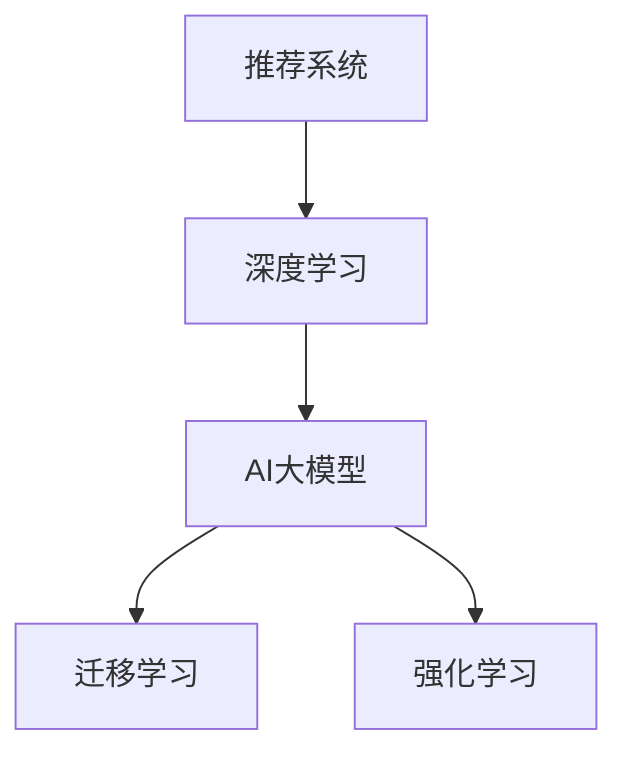

                 

# 搜索推荐系统的演进：从传统算法到AI大模型

## 1. 背景介绍

在互联网的洪流中，用户每天面临着海量的信息，如何在这些信息中找到自己真正感兴趣的内容，成为了一件棘手的事情。这就需要一个强大的推荐系统，通过分析用户的行为和偏好，为用户推荐最符合其兴趣的内容。推荐系统在电商、社交网络、视频网站等众多领域中发挥着重要作用，大大提升了用户体验和平台收益。

随着技术的进步，推荐系统从最初的简单算法，逐渐发展为基于深度学习的AI大模型，推荐效果不断提升。本文将深入探讨搜索推荐系统的演进之路，分析从传统算法到AI大模型各个阶段的算法原理和技术特点，为读者提供一个全面的视角。

## 2. 核心概念与联系

为了更好地理解搜索推荐系统的演进过程，本节将介绍几个关键的概念及其之间的联系：

- **推荐系统**：利用用户行为数据，为用户提供个性化内容推荐的系统。推荐系统可以分为基于内容的推荐、协同过滤推荐、混合推荐等多种类型。
- **深度学习**：通过多层神经网络进行特征学习和模式识别，深度学习在图像、语音、自然语言处理等领域表现出色。
- **AI大模型**：以Transformer为基础的预训练模型，通过大规模语料预训练，具备强大的自然语言理解和生成能力。
- **迁移学习**：将一个领域学到的知识迁移到另一个相关领域，减少在新领域从头开始学习的难度。
- **强化学习**：通过与环境互动，优化策略，不断提升模型表现。

这些概念之间的关系可以直观地通过以下Mermaid流程图表示：



其中，AI大模型是深度学习的高级形式，通过迁移学习和强化学习技术，不断提升模型性能。推荐系统正是在深度学习和AI大模型的推动下，逐步实现了从传统算法到AI大模型的演进。

## 3. 核心算法原理 & 具体操作步骤

### 3.1 算法原理概述

推荐系统的主要目标是根据用户的历史行为数据，预测用户对新内容的兴趣，并推荐最符合用户兴趣的内容。推荐算法可以分为以下几种：

- **基于内容的推荐**：通过分析用户已感兴趣内容的属性，找到相似内容进行推荐。
- **协同过滤推荐**：通过分析用户之间的相似性，找到与用户兴趣相似的其他用户，再通过这些用户的历史行为推荐内容。
- **混合推荐**：结合多种推荐算法，综合利用用户行为和内容属性，提升推荐效果。

深度学习技术的引入，使得推荐算法能够更好地捕捉用户行为数据中的复杂关联，提升推荐效果。其中，AI大模型通过对大规模语料进行预训练，学习到丰富的语言表示，为推荐系统提供了强大的语义理解能力。

### 3.2 算法步骤详解

以基于深度学习的推荐系统为例，推荐过程可以分为以下几个关键步骤：

**Step 1: 数据收集与预处理**

- 收集用户的历史行为数据，如浏览记录、购买记录、评分记录等。
- 对数据进行清洗和预处理，去除噪声和异常值，保证数据质量。
- 将数据进行分片，准备用于模型训练、验证和测试。

**Step 2: 特征提取与编码**

- 提取用户行为和内容属性的特征，如用户ID、内容ID、评分等。
- 使用深度学习模型对特征进行编码，如使用word2vec、BERT等对文本特征进行编码。
- 将编码后的特征输入到推荐模型中，用于预测用户对内容的兴趣。

**Step 3: 模型训练与优化**

- 选择合适的深度学习模型，如DNN、RNN、CNN、Transformer等。
- 使用训练集数据对模型进行训练，最小化预测误差。
- 使用验证集数据评估模型性能，调整超参数。
- 使用测试集数据进行最终测试，评估模型效果。

**Step 4: 模型预测与推荐**

- 将用户行为数据输入到训练好的推荐模型中，进行兴趣预测。
- 根据预测结果，选择推荐内容。
- 将推荐结果展示给用户，收集用户反馈，不断优化推荐策略。

### 3.3 算法优缺点

基于深度学习的推荐系统具有以下优点：

- 能够处理高维稀疏数据，提升推荐效果。
- 能够捕捉用户行为数据中的复杂关联，提升推荐多样性。
- 能够利用大规模语料进行预训练，提升模型性能。

同时，这些算法也存在一些缺点：

- 对数据质量要求高，数据噪声会影响推荐效果。
- 需要大量的计算资源和存储空间，训练和推理成本较高。
- 模型复杂度高，难以解释推荐过程，缺乏透明性。

## 4. 数学模型和公式 & 详细讲解

### 4.1 数学模型构建

推荐系统通常使用矩阵分解或深度学习模型进行建模。以基于深度学习的推荐系统为例，可以构建一个端到端的神经网络模型，输入为用户的兴趣表示，输出为用户对每个内容的兴趣预测。

数学模型可以表示为：

$$
\hat{y} = f(Wx + b)
$$

其中，$f$为激活函数，$W$和$b$为模型参数，$x$为用户的兴趣表示，$y$为用户对内容的兴趣预测。

### 4.2 公式推导过程

以TensorFlow框架为例，构建推荐模型的步骤如下：

1. 定义模型输入和输出
```python
import tensorflow as tf
from tensorflow.keras.layers import Input, Dense, Activation

# 定义输入
user_input = Input(shape=(1, ), name='user_input')
item_input = Input(shape=(1, ), name='item_input')

# 定义模型输出
y = Dense(1, activation='sigmoid')(tf.concat([user_input, item_input], axis=1))
```

2. 定义模型损失函数和优化器
```python
# 定义损失函数
loss_fn = tf.keras.losses.BinaryCrossentropy(from_logits=True)

# 定义优化器
optimizer = tf.keras.optimizers.Adam(lr=0.001)
```

3. 定义模型训练过程
```python
@tf.function
def train_step(user_input, item_input, label):
    with tf.GradientTape() as tape:
        y_pred = model([user_input, item_input])
        loss = loss_fn(y_pred, label)
    grads = tape.gradient(loss, model.trainable_variables)
    optimizer.apply_gradients(zip(grads, model.trainable_variables))
    return loss

# 训练模型
model.compile(optimizer=optimizer, loss=loss_fn)
model.fit(train_data, epochs=10, validation_data=val_data)
```

### 4.3 案例分析与讲解

以Netflix推荐系统为例，Netflix通过分析用户的观影历史，为用户推荐新的电影。Netflix使用矩阵分解技术，将用户和电影表示为向量，然后计算向量之间的相似度，进行推荐。

Netflix的推荐系统流程如下：

1. 收集用户观影历史数据，将用户和电影表示为稀疏矩阵。
2. 对稀疏矩阵进行低秩分解，得到用户-电影相似矩阵。
3. 根据相似矩阵进行推荐，选择与用户兴趣相似的电影进行推荐。

## 5. 项目实践：代码实例和详细解释说明

### 5.1 开发环境搭建

在开始项目实践前，我们需要准备好开发环境。以下是使用Python进行TensorFlow开发的环境配置流程：

1. 安装Anaconda：从官网下载并安装Anaconda，用于创建独立的Python环境。

2. 创建并激活虚拟环境：
```bash
conda create -n tf-env python=3.8 
conda activate tf-env
```

3. 安装TensorFlow：根据CUDA版本，从官网获取对应的安装命令。例如：
```bash
conda install tensorflow -c tf -c conda-forge
```

4. 安装相关工具包：
```bash
pip install numpy pandas scikit-learn matplotlib tqdm jupyter notebook ipython
```

完成上述步骤后，即可在`tf-env`环境中开始项目实践。

### 5.2 源代码详细实现

以下是一个简单的基于TensorFlow的推荐系统示例代码，实现了一个基于神经网络的推荐模型。

```python
import tensorflow as tf
from tensorflow.keras.layers import Input, Dense, Activation

# 定义模型输入
user_input = Input(shape=(1, ), name='user_input')
item_input = Input(shape=(1, ), name='item_input')

# 定义模型输出
y = Dense(1, activation='sigmoid')(tf.concat([user_input, item_input], axis=1))
model = tf.keras.Model(inputs=[user_input, item_input], outputs=y)

# 定义损失函数和优化器
loss_fn = tf.keras.losses.BinaryCrossentropy(from_logits=True)
optimizer = tf.keras.optimizers.Adam(lr=0.001)

# 定义训练过程
@tf.function
def train_step(user_input, item_input, label):
    with tf.GradientTape() as tape:
        y_pred = model([user_input, item_input])
        loss = loss_fn(y_pred, label)
    grads = tape.gradient(loss, model.trainable_variables)
    optimizer.apply_gradients(zip(grads, model.trainable_variables))
    return loss

# 训练模型
model.compile(optimizer=optimizer, loss=loss_fn)
model.fit(train_data, epochs=10, validation_data=val_data)
```

### 5.3 代码解读与分析

让我们再详细解读一下关键代码的实现细节：

**定义模型输入和输出**：
```python
user_input = Input(shape=(1, ), name='user_input')
item_input = Input(shape=(1, ), name='item_input')

y = Dense(1, activation='sigmoid')(tf.concat([user_input, item_input], axis=1))
```

**定义模型损失函数和优化器**：
```python
loss_fn = tf.keras.losses.BinaryCrossentropy(from_logits=True)
optimizer = tf.keras.optimizers.Adam(lr=0.001)
```

**定义训练过程**：
```python
@tf.function
def train_step(user_input, item_input, label):
    with tf.GradientTape() as tape:
        y_pred = model([user_input, item_input])
        loss = loss_fn(y_pred, label)
    grads = tape.gradient(loss, model.trainable_variables)
    optimizer.apply_gradients(zip(grads, model.trainable_variables))
    return loss

# 训练模型
model.compile(optimizer=optimizer, loss=loss_fn)
model.fit(train_data, epochs=10, validation_data=val_data)
```

可以看到，TensorFlow的高级API使得模型构建和训练过程变得简单高效。开发者可以将更多精力放在模型改进和算法优化上，而不必过多关注底层的实现细节。

## 6. 实际应用场景

### 6.1 电商推荐系统

电商推荐系统是推荐系统中最具代表性的应用场景之一。电商网站通过分析用户的浏览、购买历史，为用户推荐商品，提升用户体验和销售额。

以Amazon为例，Amazon通过分析用户的浏览历史和购买记录，为用户推荐新的商品。Amazon使用基于协同过滤的推荐算法，根据用户之间的相似性，推荐与用户兴趣相似的商品。Amazon还使用基于深度学习的推荐模型，提升推荐效果。

### 6.2 新闻推荐系统

新闻推荐系统通过分析用户的阅读历史，为用户推荐新闻内容，提升用户黏性和平台收益。

以今日头条为例，今日头条通过分析用户的阅读历史和行为数据，为用户推荐新闻内容。今日头条使用基于深度学习的推荐模型，提升推荐效果。同时，今日头条还使用个性化视频推荐、个性化搜索等技术，提升用户体验。

### 6.3 社交网络推荐系统

社交网络推荐系统通过分析用户的行为数据，为用户推荐朋友、内容、活动等，提升用户活跃度和平台粘性。

以Facebook为例，Facebook通过分析用户的浏览、点赞、评论等行为数据，为用户推荐朋友和内容。Facebook使用基于协同过滤和深度学习的推荐算法，提升推荐效果。同时，Facebook还使用个性化视频推荐、个性化搜索等技术，提升用户体验。

### 6.4 未来应用展望

随着深度学习和AI大模型的不断发展，推荐系统将面临更多的应用场景和挑战。未来的推荐系统将涵盖更多的模态数据，如视觉、语音等，进行多模态推荐。同时，推荐系统将更加注重用户隐私保护和数据安全，提升用户体验和平台信任度。

未来推荐系统的发展方向包括：

- **多模态推荐**：结合视觉、语音、文本等多种模态数据，进行多模态推荐。
- **个性化推荐**：根据用户实时行为数据，进行个性化推荐。
- **社交推荐**：结合社交网络数据，进行社交推荐。
- **数据隐私保护**：保护用户隐私，提升数据安全。

## 7. 工具和资源推荐

### 7.1 学习资源推荐

为了帮助开发者系统掌握推荐系统的理论基础和实践技巧，这里推荐一些优质的学习资源：

1. 《深度学习入门》系列博文：由深度学习专家撰写，深入浅出地介绍了深度学习基础和推荐系统原理。

2. CS231n《深度学习视觉识别》课程：斯坦福大学开设的深度学习课程，有Lecture视频和配套作业，带你入门深度学习领域。

3. 《推荐系统实战》书籍：推荐系统实战经典书籍，涵盖推荐系统原理和实践技巧，适合初学者和进阶开发者。

4. KDD Cup推荐系统竞赛：KDD Cup是机器学习领域的顶级竞赛，推荐系统是其中的重要方向，通过参与竞赛可以深入理解推荐系统原理和实践。

5. TensorFlow官方文档：TensorFlow的官方文档，提供了完整的推荐系统示例代码，是入门推荐系统的必备资料。

通过对这些资源的学习实践，相信你一定能够快速掌握推荐系统的精髓，并用于解决实际的推荐问题。

### 7.2 开发工具推荐

高效的开发离不开优秀的工具支持。以下是几款用于推荐系统开发的常用工具：

1. TensorFlow：基于Python的开源深度学习框架，灵活动态的计算图，适合快速迭代研究。推荐系统中的深度学习模型通常使用TensorFlow进行实现。

2. PyTorch：基于Python的开源深度学习框架，动态计算图，适合快速原型开发。推荐系统中的深度学习模型也可以使用PyTorch进行实现。

3. Amazon SageMaker：AWS提供的机器学习服务平台，支持深度学习模型训练和部署，适合大规模工程应用。

4. Azure Machine Learning：微软提供的机器学习服务平台，支持深度学习模型训练和部署，适合大规模工程应用。

5. Keras：基于Python的高层API，适合快速搭建推荐系统模型，适合初学者和快速原型开发。

合理利用这些工具，可以显著提升推荐系统的开发效率，加快创新迭代的步伐。

### 7.3 相关论文推荐

推荐系统的发展离不开学界的持续研究。以下是几篇奠基性的相关论文，推荐阅读：

1. "Item-Based Collaborative Filtering Recommendation Algorithms"：提出了基于协同过滤的推荐算法，成为推荐系统领域的经典算法。

2. "Probabilistic Matrix Factorization: A Novel Algorithm for Collaborative Filtering"：提出概率矩阵分解算法，用于推荐系统中的协同过滤。

3. "Deep Learning Recommendation Systems"：综述了深度学习在推荐系统中的应用，展示了深度学习的强大潜力。

4. "Wide & Deep Learning for Recommender Systems"：提出Wide & Deep模型，结合宽模型和深度模型，提升推荐效果。

5. "Attention is All You Need"：提出Transformer模型，为推荐系统提供了强大的语义理解能力。

这些论文代表了的推荐系统的发展脉络。通过学习这些前沿成果，可以帮助研究者把握学科前进方向，激发更多的创新灵感。

## 8. 总结：未来发展趋势与挑战

### 8.1 总结

本文对推荐系统的演进之路进行了全面系统的介绍。首先阐述了推荐系统的背景和重要性，明确了推荐系统从传统算法到AI大模型的演进趋势。其次，从原理到实践，详细讲解了推荐系统的数学模型和关键算法，给出了推荐系统开发的完整代码实例。同时，本文还广泛探讨了推荐系统在电商、新闻、社交网络等多个领域的应用前景，展示了推荐系统的广阔前景。

通过本文的系统梳理，可以看到，基于深度学习和AI大模型的推荐系统正逐步取代传统算法，成为推荐系统的主流范式。这使得推荐系统在推荐效果、推荐多样性等方面得到了显著提升，极大地拓展了推荐系统的应用边界，提升了用户体验和平台收益。未来，伴随深度学习和AI大模型的持续演进，推荐系统将在更多领域中发挥重要作用。

### 8.2 未来发展趋势

展望未来，推荐系统将呈现以下几个发展趋势：

1. **多模态推荐**：结合视觉、语音、文本等多种模态数据，进行多模态推荐。多模态推荐能够更全面地理解用户需求，提升推荐效果。

2. **实时推荐**：实时分析用户行为数据，进行实时推荐。实时推荐能够及时响应用户需求，提升用户体验。

3. **个性化推荐**：根据用户实时行为数据，进行个性化推荐。个性化推荐能够更好地满足用户需求，提升推荐效果。

4. **社交推荐**：结合社交网络数据，进行社交推荐。社交推荐能够利用社交网络的关系，提升推荐效果。

5. **跨领域推荐**：跨领域推荐能够将不同领域的数据进行融合，提升推荐效果。

这些趋势展示了推荐系统未来的发展方向，为推荐系统带来了更多的应用场景和更高的性能要求。未来，推荐系统将在更多领域中发挥重要作用，为推荐系统的发展提供更多空间。

### 8.3 面临的挑战

尽管推荐系统已经取得了瞩目成就，但在迈向更加智能化、普适化应用的过程中，它仍面临着诸多挑战：

1. **数据质量问题**：推荐系统对数据质量要求高，数据噪声会影响推荐效果。如何获取高质量数据，是推荐系统的一大挑战。

2. **计算资源需求高**：推荐系统需要大量的计算资源和存储空间，训练和推理成本较高。如何在有限的资源条件下，提升推荐效果，是推荐系统的另一大挑战。

3. **模型复杂度问题**：推荐系统中的深度学习模型通常比较复杂，难以解释推荐过程，缺乏透明性。如何设计更透明、更可解释的推荐模型，是推荐系统的另一大挑战。

4. **用户隐私保护**：推荐系统通常需要收集用户行为数据，如何保护用户隐私，避免数据泄露，是推荐系统的另一大挑战。

5. **数据安全问题**：推荐系统中的数据安全问题也需要引起重视，如何防止数据被恶意攻击，是推荐系统的另一大挑战。

6. **实时性问题**：实时推荐需要高效的计算和存储系统，如何在海量数据下保证实时性，是推荐系统的另一大挑战。

解决这些挑战，需要推荐系统研究者不断探索和优化算法，同时需要技术开发者提供更高效的工具和平台。

### 8.4 研究展望

面对推荐系统所面临的挑战，未来的研究需要在以下几个方面寻求新的突破：

1. **深度学习与传统算法的结合**：结合深度学习与传统算法，提升推荐效果。

2. **多模态数据的融合**：结合多模态数据，提升推荐效果。

3. **个性化推荐算法**：设计更高效的个性化推荐算法，提升推荐效果。

4. **推荐系统的可解释性**：提升推荐系统的透明性和可解释性，增强用户信任。

5. **推荐系统的实时性**：提升推荐系统的实时性，满足用户需求。

6. **推荐系统的隐私保护**：设计隐私保护机制，保护用户隐私。

这些研究方向将推动推荐系统的发展，提升推荐系统的性能和用户体验。

## 9. 附录：常见问题与解答

**Q1：推荐系统是否适用于所有业务场景？**

A: 推荐系统在电商、新闻、社交网络等领域中应用广泛，但并不适用于所有业务场景。对于某些业务场景，如旅游、教育等，用户行为数据可能难以获取，推荐系统的效果可能并不理想。对于这些场景，可以考虑结合领域知识，设计有针对性的推荐策略。

**Q2：推荐系统如何处理数据不平衡问题？**

A: 推荐系统中的数据通常是不平衡的，即某些内容或用户的推荐需求远高于其他内容或用户。推荐系统通常使用加权方法、样本重采样等技术，处理数据不平衡问题，保证推荐效果。

**Q3：推荐系统如何处理新用户的问题？**

A: 推荐系统通常需要收集用户的历史行为数据，才能进行推荐。对于新用户，推荐系统通常需要设计冷启动策略，如利用用户画像、推荐热门内容等，帮助新用户快速上手。

**Q4：推荐系统如何处理数据隐私问题？**

A: 推荐系统需要收集用户行为数据，如何保护用户隐私，避免数据泄露，是推荐系统的一大挑战。推荐系统通常使用数据匿名化、数据加密等技术，保护用户隐私。

**Q5：推荐系统如何处理推荐多样性问题？**

A: 推荐系统通常需要保证推荐内容的丰富性和多样性，避免用户陷入信息茧房。推荐系统通常使用多样化算法，如多样性感知推荐算法，保证推荐多样性。

以上问题展示了推荐系统在实际应用中的常见问题，需要推荐系统研究者不断探索和优化算法，提升推荐效果。

---

作者：禅与计算机程序设计艺术 / Zen and the Art of Computer Programming

