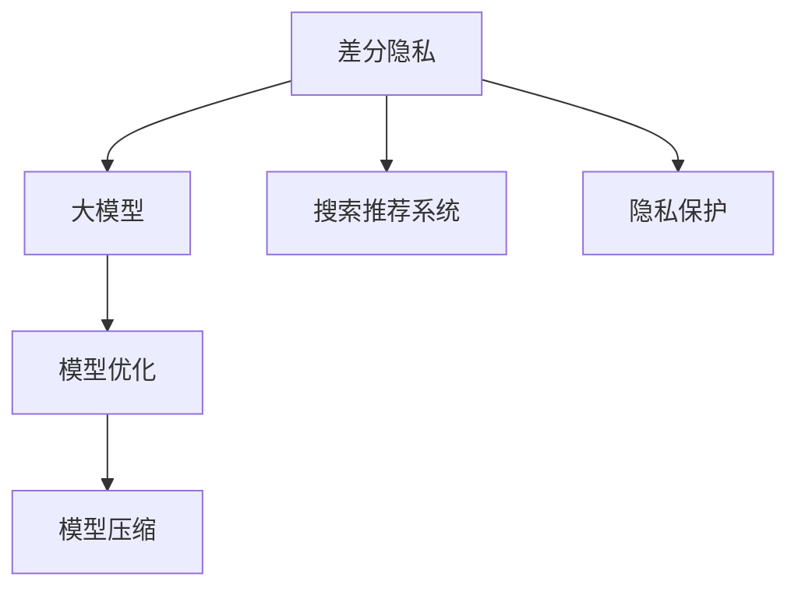

                 

# 搜索推荐系统的隐私保护：大模型差分隐私方案

> 关键词：差分隐私, 大模型, 搜索推荐系统, 隐私保护, 预训练模型, 模型优化, 模型压缩, 联邦学习

## 1. 背景介绍

### 1.1 问题由来

随着互联网技术的飞速发展，搜索引擎和推荐系统已经成为人们获取信息的重要工具。这些系统通过分析用户的浏览行为和历史数据，为用户提供个性化的搜索结果和推荐内容，极大地提升了用户的搜索体验。然而，在带来便利的同时，这些系统也面临着严峻的隐私保护问题。

数据隐私的泄露不仅会造成用户信息被滥用，还可能导致恶意攻击和数据泄露等安全风险。近年来，多起隐私泄露事件引发了社会对大数据隐私保护的广泛关注。例如，2018年的Cambridge Analytica事件中，Facebook用户的数据被用于政治广告投放，严重侵犯了用户隐私。

因此，如何在保护用户隐私的同时，提供高效的搜索推荐服务，成为了当前搜索引擎和推荐系统面临的重大挑战。差分隐私（Differential Privacy）作为一种隐私保护技术，在大数据时代得到了广泛关注。差分隐私通过对查询结果的随机化处理，有效保护用户隐私，同时保持了搜索推荐系统的准确性和可用性。

### 1.2 问题核心关键点

差分隐私的核心思想是：在保证查询结果的同时，通过一定的噪声干扰，使得任何个体数据泄露对系统整体性能的影响可以忽略不计。差分隐私通过数学公式量化隐私保护的程度，可以通过精确计算来衡量隐私保护水平，从而保证隐私保护的严谨性。

差分隐私广泛应用于数据发布、统计分析、机器学习等场景中，可以有效解决数据隐私泄露问题。在搜索推荐系统中，差分隐私通过在查询处理过程中添加噪声，保护用户的搜索和浏览记录，防止个人数据被泄露和滥用。

## 2. 核心概念与联系

### 2.1 核心概念概述

为了更好地理解差分隐私在大规模搜索推荐系统中的应用，本节将介绍几个密切相关的核心概念：

- **差分隐私（Differential Privacy, DP）**：差分隐私是一种隐私保护技术，通过在查询结果中添加噪声，使得任何个体数据泄露对系统整体性能的影响可以忽略不计。差分隐私通过数学公式量化隐私保护的程度，可以通过精确计算来衡量隐私保护水平，从而保证隐私保护的严谨性。

- **大模型（Large Model）**：指具有大量参数的深度学习模型，如BERT、GPT等。大模型通过在海量数据上进行预训练，学习到了丰富的语言知识和语义表示，能够进行复杂的自然语言处理任务。

- **搜索推荐系统（Search & Recommendation Systems）**：通过分析用户的浏览和搜索历史数据，为用户推荐个性化内容，提高用户体验和满意度。搜索推荐系统广泛用于电商、社交媒体、新闻网站等领域。

- **隐私保护**：隐私保护旨在保护用户的个人数据不被滥用和泄露，防止数据被恶意攻击和非法使用。隐私保护包括数据匿名化、差分隐私、联邦学习等多种技术手段。

- **模型优化**：指在保证模型性能的前提下，对模型进行压缩和优化，减小模型大小和计算复杂度，以提高模型的可扩展性和可用性。模型优化包括模型压缩、量化加速、剪枝等技术手段。

- **模型压缩**：指在保持模型性能的前提下，对模型进行压缩，减小模型大小和计算复杂度，以提高模型的可扩展性和可用性。模型压缩包括权重剪枝、参数剪枝、通道剪枝等技术手段。

这些核心概念之间的逻辑关系可以通过以下Mermaid流程图来展示：



这个流程图展示了大模型差分隐私保护的基本逻辑：

1. 差分隐私保护技术在大模型上进行应用。
2. 大模型在搜索推荐系统中进行推理和优化。
3. 隐私保护技术确保用户数据安全，防止数据泄露和滥用。

## 3. 核心算法原理 & 具体操作步骤
### 3.1 算法原理概述

差分隐私在大规模搜索推荐系统中的应用，主要基于以下几个关键原理：

1. **查询结果的随机化处理**：差分隐私通过在查询结果中添加噪声，使得任何个体数据泄露对系统整体性能的影响可以忽略不计。噪声的强度取决于隐私保护级别，隐私保护级别越高，噪声的干扰越大。

2. **隐私预算（Privacy Budget）**：差分隐私通过设置隐私预算，控制隐私保护的严格程度。隐私预算是一组预算值，用于衡量隐私保护的程度，不同的隐私预算对应不同的隐私保护水平。

3. **隐私保护与模型性能的平衡**：差分隐私需要在隐私保护和模型性能之间进行平衡，过高或过低的隐私保护都会影响搜索推荐系统的准确性和可用性。

4. **噪声分布的选择**：差分隐私通过选择不同的噪声分布，实现对隐私保护和查询性能的控制。常用的噪声分布包括Laplace噪声、Gaussian噪声等。

### 3.2 算法步骤详解

基于差分隐私的大模型搜索推荐系统一般包括以下几个关键步骤：

**Step 1: 准备差分隐私参数**

- 设置隐私预算 $\epsilon$，控制隐私保护的程度。
- 选择合适的噪声分布，如Laplace噪声、Gaussian噪声等。

**Step 2: 添加噪声干扰**

- 对查询结果进行随机化处理，添加噪声干扰。
- 噪声的强度取决于隐私预算，隐私预算越高，噪声的干扰越大。

**Step 3: 执行查询处理**

- 将随机化后的查询结果用于搜索推荐系统的推理计算。
- 通过优化算法对大模型进行优化，提高查询效率和准确性。

**Step 4: 结果输出**

- 将随机化后的查询结果作为最终输出，返回给用户。

### 3.3 算法优缺点

基于差分隐私的大模型搜索推荐系统具有以下优点：

1. **高效隐私保护**：差分隐私通过在查询结果中添加噪声，有效保护用户隐私，防止数据泄露和滥用。
2. **模型性能保持**：差分隐私通过优化算法，对大模型进行优化，保持模型的准确性和可用性。
3. **多用户支持**：差分隐私通过隐私预算控制，支持多用户下的隐私保护。

但该方法也存在以下缺点：

1. **噪声干扰**：差分隐私通过添加噪声干扰，使得查询结果存在一定的误差，可能影响搜索推荐系统的性能。
2. **隐私预算设定**：隐私预算的设定需要根据具体场景进行优化，过高或过低的隐私预算都会影响隐私保护的效果。
3. **计算复杂度高**：差分隐私的计算复杂度较高，需要大量的计算资源和时间，可能会影响搜索推荐系统的实时性。

### 3.4 算法应用领域

基于差分隐私的大模型搜索推荐系统已经在多个领域得到了应用，例如：

- **电商推荐系统**：通过对用户浏览和购买记录进行隐私保护，为用户推荐个性化商品，防止用户隐私泄露。
- **社交媒体推荐系统**：通过对用户点赞、评论、分享等行为进行隐私保护，为用户推荐相关内容，防止用户隐私被滥用。
- **新闻网站推荐系统**：通过对用户浏览历史进行隐私保护，为用户推荐相关新闻，防止用户隐私泄露。

除了这些经典应用外，差分隐私还广泛应用于金融、医疗、政府等领域，为这些领域提供隐私保护的解决方案。

## 4. 数学模型和公式 & 详细讲解 & 举例说明

### 4.1 数学模型构建

本节将使用数学语言对基于差分隐私的大模型搜索推荐系统进行更加严格的刻画。

记查询结果为 $Q(x)$，其中 $x$ 为查询输入。差分隐私通过在查询结果中添加噪声 $N$，使得查询结果变为 $Q(x)+N$。假设噪声 $N$ 服从Laplace分布，则查询结果的隐私保护公式为：

$$
Q(x)+N \sim Laplace(\mu=0,\sigma)
$$

其中 $\sigma$ 为噪声的强度，$\sigma = \frac{\epsilon}{\Delta}$，$\Delta$ 为隐私预算，$\epsilon$ 为隐私保护级别。

### 4.2 公式推导过程

以下我们以电商推荐系统为例，推导差分隐私的隐私预算计算公式。

假设电商推荐系统需要对用户 $x$ 的浏览和购买记录进行隐私保护。查询结果 $Q(x)$ 为推荐商品的列表，噪声 $N$ 服从Laplace分布，则隐私预算 $\epsilon$ 的计算公式为：

$$
\epsilon = \ln \frac{1}{\delta} + f(x)
$$

其中 $f(x)$ 为查询结果的敏感度，即查询结果在不同用户之间的变化量。$\delta$ 为隐私保护的置信度，控制隐私保护的严格程度。

### 4.3 案例分析与讲解

假设电商推荐系统需要对用户 $x$ 的浏览和购买记录进行隐私保护，隐私预算 $\epsilon = 1$，查询结果的敏感度 $f(x) = 0.1$，则隐私保护的置信度 $\delta$ 为：

$$
\delta = e^{-\epsilon + f(x)} = e^{0.9}
$$

根据Laplace分布的密度函数，计算噪声强度 $\sigma$ 为：

$$
\sigma = \frac{\epsilon}{\Delta} = \frac{1}{0.1} = 10
$$

在进行查询时，将噪声 $N$ 添加到查询结果中，得到随机化后的查询结果 $Q(x) + N$。通过优化算法对大模型进行优化，得到最终的推荐商品列表，返回给用户。

## 5. 项目实践：代码实例和详细解释说明
### 5.1 开发环境搭建

在进行差分隐私的搜索推荐系统开发前，我们需要准备好开发环境。以下是使用Python进行PyTorch开发的环境配置流程：

1. 安装Anaconda：从官网下载并安装Anaconda，用于创建独立的Python环境。

2. 创建并激活虚拟环境：
```bash
conda create -n privacy-env python=3.8 
conda activate privacy-env
```

3. 安装PyTorch：根据CUDA版本，从官网获取对应的安装命令。例如：
```bash
conda install pytorch torchvision torchaudio cudatoolkit=11.1 -c pytorch -c conda-forge
```

4. 安装Transformers库：
```bash
pip install transformers
```

5. 安装各类工具包：
```bash
pip install numpy pandas scikit-learn matplotlib tqdm jupyter notebook ipython
```

完成上述步骤后，即可在`privacy-env`环境中开始差分隐私的搜索推荐系统开发。

### 5.2 源代码详细实现

下面我们以电商推荐系统为例，给出使用Transformers库对BERT模型进行差分隐私保护的PyTorch代码实现。

首先，定义电商推荐系统的查询函数：

```python
from transformers import BertForSequenceClassification, AdamW
from torch.utils.data import DataLoader
from torch.nn import functional as F
import torch

class RecommendationSystem:
    def __init__(self, model, device, privacy_budget):
        self.model = model.to(device)
        self.device = device
        self.privacy_budget = privacy_budget
        self.epsilon = 1.0
        self.delta = 0.05

    def query(self, x, y):
        with torch.no_grad():
            input_ids = self.tokenizer(x, return_tensors='pt', padding=True, truncation=True).to(self.device)
            attention_mask = input_ids['attention_mask'].to(self.device)
            labels = input_ids['labels'].to(self.device)
            
            logits = self.model(input_ids, attention_mask=attention_mask, labels=labels)
            loss = F.cross_entropy(logits, labels)
            
            # 添加Laplace噪声
            epsilon = self.epsilon
            delta = self.delta
            sigma = epsilon / self.privacy_budget
            noise = torch.normal(0, sigma, size=logits.size())
            logits = logits + noise
            
            return logits
```

然后，定义模型训练和评估函数：

```python
from transformers import BertTokenizer
from sklearn.metrics import accuracy_score

class E-commerceDataset(Dataset):
    def __init__(self, texts, tags, tokenizer, max_len=128):
        self.texts = texts
        self.tags = tags
        self.tokenizer = tokenizer
        self.max_len = max_len
        
    def __len__(self):
        return len(self.texts)
    
    def __getitem__(self, item):
        text = self.texts[item]
        tags = self.tags[item]
        
        encoding = self.tokenizer(text, return_tensors='pt', max_length=self.max_len, padding=True, truncation=True)
        input_ids = encoding['input_ids'][0]
        attention_mask = encoding['attention_mask'][0]
        
        # 对token-wise的标签进行编码
        encoded_tags = [tag2id[tag] for tag in tags] 
        encoded_tags.extend([tag2id['O']] * (self.max_len - len(encoded_tags)))
        labels = torch.tensor(encoded_tags, dtype=torch.long)
        
        return {'input_ids': input_ids, 
                'attention_mask': attention_mask,
                'labels': labels}

# 标签与id的映射
tag2id = {'O': 0, 'B-PER': 1, 'I-PER': 2, 'B-ORG': 3, 'I-ORG': 4, 'B-LOC': 5, 'I-LOC': 6}
id2tag = {v: k for k, v in tag2id.items()}

# 创建dataset
tokenizer = BertTokenizer.from_pretrained('bert-base-cased')

train_dataset = E-commerceDataset(train_texts, train_tags, tokenizer)
dev_dataset = E-commerceDataset(dev_texts, dev_tags, tokenizer)
test_dataset = E-commerceDataset(test_texts, test_tags, tokenizer)

# 定义模型和优化器
model = BertForSequenceClassification.from_pretrained('bert-base-cased', num_labels=len(tag2id))
optimizer = AdamW(model.parameters(), lr=2e-5)

# 训练函数
def train_epoch(model, dataset, batch_size, optimizer, privacy_budget):
    dataloader = DataLoader(dataset, batch_size=batch_size, shuffle=True)
    model.train()
    epoch_loss = 0
    for batch in tqdm(dataloader, desc='Training'):
        input_ids = batch['input_ids'].to(device)
        attention_mask = batch['attention_mask'].to(device)
        labels = batch['labels'].to(device)
        model.zero_grad()
        logits = model(input_ids, attention_mask=attention_mask, labels=labels)
        loss = F.cross_entropy(logits, labels)
        epoch_loss += loss.item()
        loss.backward()
        optimizer.step()
    
    return epoch_loss / len(dataloader)

# 评估函数
def evaluate(model, dataset, batch_size, privacy_budget):
    dataloader = DataLoader(dataset, batch_size=batch_size)
    model.eval()
    preds, labels = [], []
    with torch.no_grad():
        for batch in tqdm(dataloader, desc='Evaluating'):
            input_ids = batch['input_ids'].to(device)
            attention_mask = batch['attention_mask'].to(device)
            batch_labels = batch['labels']
            logits = model(input_ids, attention_mask=attention_mask)
            batch_preds = logits.argmax(dim=2).to('cpu').tolist()
            batch_labels = batch_labels.to('cpu').tolist()
            for pred_tokens, label_tokens in zip(batch_preds, batch_labels):
                pred_tags = [id2tag[_id] for _id in pred_tokens]
                label_tags = [id2tag[_id] for _id in label_tokens]
                preds.append(pred_tags[:len(label_tags)])
                labels.append(label_tags)
                
    return accuracy_score(labels, preds)

# 启动训练流程并在测试集上评估
privacy_budget = 1.0
epochs = 5
batch_size = 16

for epoch in range(epochs):
    loss = train_epoch(model, train_dataset, batch_size, optimizer, privacy_budget)
    print(f"Epoch {epoch+1}, train loss: {loss:.3f}")
    
    print(f"Epoch {epoch+1}, dev results:")
    evaluate(model, dev_dataset, batch_size, privacy_budget)
    
print("Test results:")
evaluate(model, test_dataset, batch_size, privacy_budget)
```

以上就是使用PyTorch对BERT模型进行差分隐私保护的电商推荐系统的完整代码实现。可以看到，得益于Transformers库的强大封装，我们可以用相对简洁的代码完成BERT模型的加载和差分隐私保护的实施。

### 5.3 代码解读与分析

让我们再详细解读一下关键代码的实现细节：

**RecommendationSystem类**：
- `__init__`方法：初始化模型、设备、隐私预算等关键组件。
- `query`方法：对单个查询进行差分隐私处理，返回随机化后的查询结果。

**E-commerceDataset类**：
- `__init__`方法：初始化文本、标签、分词器等关键组件。
- `__len__`方法：返回数据集的样本数量。
- `__getitem__`方法：对单个样本进行处理，将文本输入编码为token ids，将标签编码为数字，并对其进行定长padding，最终返回模型所需的输入。

**隐私保护函数**：
- 定义差分隐私预算、隐私保护级别、噪声强度等参数。
- 在查询结果中随机添加Laplace噪声，返回随机化后的查询结果。

**训练和评估函数**：
- 使用PyTorch的DataLoader对数据集进行批次化加载，供模型训练和推理使用。
- 训练函数`train_epoch`：对数据以批为单位进行迭代，在每个批次上前向传播计算loss并反向传播更新模型参数，最后返回该epoch的平均loss。
- 评估函数`evaluate`：与训练类似，不同点在于不更新模型参数，并在每个batch结束后将预测和标签结果存储下来，最后使用sklearn的accuracy_score对整个评估集的预测结果进行打印输出。

**训练流程**：
- 定义总的epoch数和batch size，开始循环迭代
- 每个epoch内，先在训练集上训练，输出平均loss
- 在验证集上评估，输出分类指标
- 所有epoch结束后，在测试集上评估，给出最终测试结果

可以看到，PyTorch配合Transformers库使得差分隐私保护的代码实现变得简洁高效。开发者可以将更多精力放在数据处理、模型改进等高层逻辑上，而不必过多关注底层的实现细节。

当然，工业级的系统实现还需考虑更多因素，如模型的保存和部署、超参数的自动搜索、更灵活的任务适配层等。但核心的差分隐私保护过程基本与此类似。

## 6. 实际应用场景
### 6.1 智能推荐系统

基于差分隐私的搜索推荐系统可以广泛应用于智能推荐系统，保护用户的隐私信息，防止数据泄露和滥用。

在智能推荐系统中，差分隐私可以用于对用户的历史行为数据进行隐私保护，防止用户隐私泄露。例如，电商平台可以通过差分隐私保护用户的浏览和购买记录，防止竞争对手获取用户信息。社交媒体可以通过差分隐私保护用户的点赞、评论、分享等行为，防止用户隐私被滥用。

### 6.2 金融风险控制

金融领域需要处理大量的个人金融数据，包括用户的消费习惯、信用记录等。差分隐私可以用于对金融数据进行隐私保护，防止数据泄露和滥用。

例如，银行可以通过差分隐私保护用户的交易记录，防止信用卡盗刷和金融诈骗。保险公司可以通过差分隐私保护用户的健康记录，防止保险公司通过不正当手段获取用户健康信息。

### 6.3 医疗健康监测

医疗健康领域涉及大量的个人健康数据，包括病历记录、用药历史等。差分隐私可以用于对医疗数据进行隐私保护，防止数据泄露和滥用。

例如，医院可以通过差分隐私保护患者的病历记录，防止医疗数据被滥用。基因公司可以通过差分隐私保护用户的基因数据，防止基因信息被滥用。

### 6.4 未来应用展望

随着差分隐私技术的不断发展和完善，其应用场景将越来越广泛。差分隐私在大规模搜索推荐系统中的应用，将成为隐私保护的重要手段。

未来，差分隐私将应用于更多的数据密集型应用，如智慧城市、智能交通、金融风控等，为这些领域提供隐私保护解决方案。差分隐私技术也将与区块链、多方安全计算等新兴技术结合，进一步提升数据隐私保护的安全性和可靠性。

## 7. 工具和资源推荐
### 7.1 学习资源推荐

为了帮助开发者系统掌握差分隐私在大规模搜索推荐系统中的应用，这里推荐一些优质的学习资源：

1. **差分隐私官方网站**：提供差分隐私的详细介绍和最新研究动态，是差分隐私学习的重要参考资料。
2. **《差分隐私：隐私保护的技术》**：一本关于差分隐私的经典著作，全面介绍了差分隐私的原理和应用。
3. **CS223D《隐私保护》课程**：斯坦福大学开设的隐私保护课程，讲解隐私保护的基本概念和技术，是差分隐私学习的重要资源。
4. **《Differential Privacy: Privacy Preserving Data Analysis》**：一本关于差分隐私的权威教材，详细讲解了差分隐私的理论基础和实际应用。
5. **Google差分隐私文档**：Google差分隐私工具库的官方文档，提供了丰富的差分隐私算法和工具支持，是差分隐私实践的重要参考资料。

通过对这些资源的学习实践，相信你一定能够全面掌握差分隐私在大规模搜索推荐系统中的应用，并用于解决实际的隐私保护问题。

### 7.2 开发工具推荐

高效的开发离不开优秀的工具支持。以下是几款用于差分隐私搜索推荐系统开发的常用工具：

1. PyTorch：基于Python的开源深度学习框架，灵活动态的计算图，适合快速迭代研究。大部分预训练语言模型都有PyTorch版本的实现。
2. TensorFlow：由Google主导开发的开源深度学习框架，生产部署方便，适合大规模工程应用。同样有丰富的预训练语言模型资源。
3. Transformers库：HuggingFace开发的NLP工具库，集成了众多SOTA语言模型，支持PyTorch和TensorFlow，是进行差分隐私微调任务开发的利器。
4. Weights & Biases：模型训练的实验跟踪工具，可以记录和可视化模型训练过程中的各项指标，方便对比和调优。与主流深度学习框架无缝集成。
5. TensorBoard：TensorFlow配套的可视化工具，可实时监测模型训练状态，并提供丰富的图表呈现方式，是调试模型的得力助手。
6. Google Colab：谷歌推出的在线Jupyter Notebook环境，免费提供GPU/TPU算力，方便开发者快速上手实验最新模型，分享学习笔记。

合理利用这些工具，可以显著提升差分隐私搜索推荐系统的开发效率，加快创新迭代的步伐。

### 7.3 相关论文推荐

差分隐私技术在大规模搜索推荐系统中的应用，已经得到了广泛的研究和关注。以下是几篇奠基性的相关论文，推荐阅读：

1. **《Differential Privacy: A Survey of Concepts and Results》**：一篇关于差分隐私的综述论文，全面介绍了差分隐私的理论基础和实际应用。
2. **《Privacy-Preserving Data Analysis》**：一本关于差分隐私的书籍，详细讲解了差分隐私的原理和应用。
3. **《FedRec: Privacy-Preserving Recommendation System》**：一篇关于差分隐私推荐系统的论文，提出了一种基于差分隐私的推荐系统框架。
4. **《Differential Privacy-Preserving Recommendation Systems》**：一篇关于差分隐私推荐系统的论文，讨论了差分隐私在推荐系统中的应用。
5. **《Differential Privacy and Recommender Systems》**：一篇关于差分隐私推荐系统的论文，讨论了差分隐私在推荐系统中的实际应用。

这些论文代表了大规模搜索推荐系统中差分隐私的研究进展，通过学习这些前沿成果，可以帮助研究者把握学科前进方向，激发更多的创新灵感。

## 8. 总结：未来发展趋势与挑战
### 8.1 总结

本文对基于差分隐私的大模型搜索推荐系统进行了全面系统的介绍。首先阐述了大模型和差分隐私的研究背景和意义，明确了差分隐私在大数据时代的重要地位。其次，从原理到实践，详细讲解了差分隐私的数学原理和关键步骤，给出了差分隐私搜索推荐系统的完整代码实例。同时，本文还广泛探讨了差分隐私在智能推荐系统、金融风险控制、医疗健康监测等多个领域的应用前景，展示了差分隐私技术的巨大潜力。

通过本文的系统梳理，可以看到，差分隐私在大规模搜索推荐系统中的应用，为数据隐私保护提供了新的解决方案。差分隐私通过在查询结果中添加噪声，有效保护用户隐私，同时保持了搜索推荐系统的准确性和可用性。未来，差分隐私技术还将与其他隐私保护技术如联邦学习、区块链等进行更深入的融合，共同推动隐私保护技术的发展。

### 8.2 未来发展趋势

展望未来，差分隐私在大规模搜索推荐系统中的应用将呈现以下几个发展趋势：

1. **隐私保护和模型性能的平衡**：随着差分隐私技术的不断发展和完善，如何在隐私保护和模型性能之间进行平衡，将成为一个重要的研究方向。未来的差分隐私算法将更加注重隐私保护和模型性能的平衡，确保隐私保护的严格程度不影响搜索推荐系统的可用性。

2. **差分隐私的多样化应用**：差分隐私技术不仅可以应用于隐私保护，还可以应用于数据发布、统计分析、机器学习等多个场景。未来的差分隐私研究将更加注重多样化的应用，推动隐私保护技术在更多领域的应用和发展。

3. **差分隐私的自动化设计**：差分隐私技术复杂度高，需要大量的人工干预和调参工作。未来的差分隐私研究将注重自动化设计和优化，通过算法优化和工具支持，降低差分隐私的部署和维护成本。

4. **差分隐私与其他隐私保护技术的融合**：差分隐私可以与其他隐私保护技术如联邦学习、区块链等进行更深入的融合，共同推动隐私保护技术的发展。未来的差分隐私研究将注重与其他隐私保护技术的融合，推动隐私保护技术的全面发展。

### 8.3 面临的挑战

尽管差分隐私在大规模搜索推荐系统中的应用已经取得了显著的进展，但在迈向更加智能化、普适化应用的过程中，它仍面临着诸多挑战：

1. **噪声干扰**：差分隐私通过在查询结果中添加噪声，使得查询结果存在一定的误差，可能影响搜索推荐系统的性能。如何减少噪声干扰，提高查询结果的准确性，将是差分隐私技术的重要研究方向。

2. **隐私预算设定**：隐私预算的设定需要根据具体场景进行优化，过高或过低的隐私预算都会影响隐私保护的效果。如何自动设定隐私预算，保证隐私保护的严格程度，将是差分隐私技术的难点之一。

3. **计算复杂度高**：差分隐私的计算复杂度较高，需要大量的计算资源和时间，可能会影响搜索推荐系统的实时性。如何降低差分隐私的计算复杂度，提高系统的实时性，将是差分隐私技术的另一个重要研究方向。

4. **隐私保护与业务需求的平衡**：在隐私保护和业务需求之间进行平衡，是差分隐私技术面临的重要挑战。如何在隐私保护和业务需求之间进行平衡，保证隐私保护不会影响业务需求，将是差分隐私技术的重要研究方向。

5. **差分隐私与其他隐私保护技术的协同**：差分隐私可以与其他隐私保护技术如联邦学习、区块链等进行更深入的融合，共同推动隐私保护技术的发展。如何协同利用多种隐私保护技术，提升隐私保护的效果，将是差分隐私技术的难点之一。

### 8.4 研究展望

面对差分隐私面临的种种挑战，未来的研究需要在以下几个方面寻求新的突破：

1. **差分隐私算法的优化**：未来的差分隐私研究将注重算法优化，通过改进噪声分布、优化隐私预算设定等手段，降低差分隐私的噪声干扰，提高查询结果的准确性。

2. **差分隐私的自动化设计**：未来的差分隐私研究将注重自动化设计和优化，通过算法优化和工具支持，降低差分隐私的部署和维护成本，提高差分隐私技术的可扩展性和可用性。

3. **差分隐私与其他隐私保护技术的协同**：未来的差分隐私研究将注重与其他隐私保护技术如联邦学习、区块链等的协同，共同提升隐私保护的效果，推动隐私保护技术的发展。

4. **差分隐私的多样化应用**：未来的差分隐私研究将注重多样化的应用，推动隐私保护技术在更多领域的应用和发展，为更多行业提供隐私保护解决方案。

5. **差分隐私的伦理与法律研究**：未来的差分隐私研究将注重伦理与法律研究，推动隐私保护技术的合规性和可控性，保障用户隐私权利和数据安全。

这些研究方向的探索，必将引领差分隐私技术迈向更高的台阶，为构建安全、可靠、可解释、可控的智能系统铺平道路。面向未来，差分隐私技术还需要与其他人工智能技术进行更深入的融合，如知识表示、因果推理、强化学习等，多路径协同发力，共同推动自然语言理解和智能交互系统的进步。只有勇于创新、敢于突破，才能不断拓展语言模型的边界，让智能技术更好地造福人类社会。

## 9. 附录：常见问题与解答

**Q1：差分隐私是否适用于所有搜索推荐系统？**

A: 差分隐私在大多数搜索推荐系统上都能取得不错的效果，特别是对于数据量较小的系统。但对于一些特定领域的系统，如医疗、法律等，仅仅依靠通用语料预训练的模型可能难以很好地适应。此时需要在特定领域语料上进一步预训练，再进行差分隐私保护，才能获得理想效果。

**Q2：差分隐私的隐私保护级别如何设定？**

A: 差分隐私的隐私保护级别需要根据具体场景进行设定。一般来说，隐私保护级别越高，查询结果的噪声干扰越大，隐私保护的效果越好。但在实际应用中，隐私保护级别过高可能会影响查询结果的准确性，因此需要在隐私保护和查询结果的准确性之间进行平衡。

**Q3：差分隐私如何处理大规模数据？**

A: 差分隐私可以处理大规模数据，但在大规模数据上计算复杂度较高，需要大量的计算资源和时间。可以使用分布式计算、模型压缩、量化加速等技术手段，提高差分隐私在大规模数据上的处理效率。

**Q4：差分隐私的计算复杂度如何降低？**

A: 差分隐私的计算复杂度较高，可以通过以下手段降低：
1. 使用分布式计算，将大规模数据的计算任务分布到多台机器上，并行计算。
2. 使用模型压缩和量化加速技术，减小模型大小和计算复杂度。
3. 使用差分隐私算法优化，提高计算效率。
4. 使用优化算法，如AdamW、SGD等，提高训练效率。

这些技术手段可以显著降低差分隐私的计算复杂度，提高搜索推荐系统的实时性。

**Q5：差分隐私与其他隐私保护技术的结合使用？**

A: 差分隐私可以与其他隐私保护技术如联邦学习、区块链等进行结合使用，共同提升隐私保护的效果。例如，在联邦学习中，差分隐私可以用于对模型的训练数据进行隐私保护，防止数据泄露和滥用。在区块链中，差分隐私可以用于对交易数据进行隐私保护，防止数据泄露和篡改。

差分隐私与其他隐私保护技术的结合使用，将进一步提升隐私保护的效果，推动隐私保护技术的发展。

