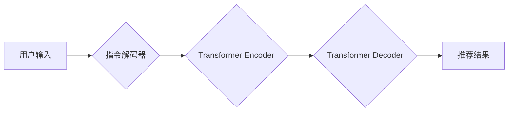

                 

## InstructRec: 自然语言指令调优

> 关键词：自然语言处理，指令调优，推荐系统，Transformer，InstructRec模型

### 1. 背景介绍

近年来，自然语言处理（NLP）领域取得了显著进展，尤其是基于Transformer架构的模型在各种NLP任务上表现出色。然而，现有的预训练语言模型通常在特定任务上进行训练，缺乏对指令理解和执行的泛化能力。

指令调优（Instruction Tuning）作为一种新的训练范式，旨在通过使用带有明确指令的文本数据来训练模型，使其能够更好地理解和执行用户的指令。指令调优在许多任务中取得了令人瞩目的成果，例如文本生成、问答、代码生成等。

推荐系统作为一种重要的信息过滤技术，旨在根据用户的历史行为和偏好，推荐用户感兴趣的内容。传统的推荐系统主要依赖于用户的显式反馈，例如评分、点赞等。然而，这些反馈往往稀疏且难以获取。

自然语言指令可以为推荐系统提供一种新的交互方式，用户可以通过自然语言描述自己的需求，例如“推荐一些最近上映的科幻电影”或“推荐一些适合我口味的音乐”。

### 2. 核心概念与联系

InstructRec模型将指令调优技术应用于推荐系统，旨在通过学习指令理解和执行能力，提升推荐系统的性能。

#### 2.1  核心概念

* **指令调优 (Instruction Tuning):** 通过使用带有明确指令的文本数据来训练模型，使其能够更好地理解和执行用户的指令。
* **推荐系统 (Recommendation System):** 根据用户的历史行为和偏好，推荐用户感兴趣的内容。
* **Transformer:** 一种强大的深度学习架构，在NLP任务中取得了显著成果。

#### 2.2  架构



**流程图说明:**

1. 用户输入自然语言指令。
2. 指令解码器将指令转换为模型可理解的格式。
3. Transformer Encoder 将指令编码为语义表示。
4. Transformer Decoder 根据指令的语义表示生成推荐结果。

### 3. 核心算法原理 & 具体操作步骤

#### 3.1  算法原理概述

InstructRec模型的核心是利用Transformer架构学习指令理解和执行能力。模型通过训练在指令-推荐对数据上进行预测，学习将指令映射到相应的推荐结果。

#### 3.2  算法步骤详解

1. **数据准备:** 收集包含指令和推荐结果的训练数据。
2. **模型训练:** 使用Transformer架构构建模型，并利用指令-推荐对数据进行训练。
3. **模型评估:** 使用测试数据评估模型的性能，例如推荐准确率、召回率等。
4. **模型部署:** 将训练好的模型部署到生产环境中，用于接收用户的指令并生成推荐结果。

#### 3.3  算法优缺点

**优点:**

* 能够理解和执行用户的自然语言指令。
* 提升推荐系统的个性化和准确性。
* 提供了一种新的用户交互方式。

**缺点:**

* 需要大量的指令-推荐对数据进行训练。
* 模型训练复杂度较高。

#### 3.4  算法应用领域

* **电商推荐:** 根据用户的购物历史和偏好，推荐商品。
* **内容推荐:** 根据用户的阅读历史和兴趣，推荐文章、视频等内容。
* **音乐推荐:** 根据用户的音乐偏好，推荐歌曲。

### 4. 数学模型和公式 & 详细讲解 & 举例说明

#### 4.1  数学模型构建

InstructRec模型基于Transformer架构，其核心是Encoder-Decoder结构。

* **Encoder:** 用于编码指令的语义表示。
* **Decoder:** 用于根据指令的语义表示生成推荐结果。

#### 4.2  公式推导过程

Transformer模型的注意力机制是其核心组成部分，用于捕捉指令中不同词语之间的关系。注意力机制的计算公式如下：

$$
Attention(Q, K, V) = softmax(\frac{QK^T}{\sqrt{d_k}})V
$$

其中：

* $Q$：查询矩阵
* $K$：键矩阵
* $V$：值矩阵
* $d_k$：键向量的维度

#### 4.3  案例分析与讲解

假设用户输入指令“推荐一些最近上映的科幻电影”，Encoder将指令编码为一个语义表示向量。Decoder根据这个语义表示向量，从电影数据库中检索出符合条件的电影，并生成推荐结果。

### 5. 项目实践：代码实例和详细解释说明

#### 5.1  开发环境搭建

* Python 3.7+
* PyTorch 1.7+
* Transformers 4.0+

#### 5.2  源代码详细实现

```python
from transformers import AutoModelForSeq2SeqLM, AutoTokenizer

# 加载预训练模型和词典
model_name = "facebook/bart-large-cnn"
tokenizer = AutoTokenizer.from_pretrained(model_name)
model = AutoModelForSeq2SeqLM.from_pretrained(model_name)

# 定义输入指令和推荐结果
instruction = "推荐一些最近上映的科幻电影"
target_text = "电影推荐结果"

# 将指令转换为模型可理解的格式
input_ids = tokenizer.encode(instruction, return_tensors="pt")

# 生成推荐结果
output = model.generate(input_ids, max_length=50, num_beams=5)

# 将推荐结果转换为文本
recommendations = tokenizer.decode(output[0], skip_special_tokens=True)

# 打印推荐结果
print(recommendations)
```

#### 5.3  代码解读与分析

1. 加载预训练模型和词典。
2. 定义输入指令和推荐结果。
3. 将指令转换为模型可理解的格式。
4. 使用模型生成推荐结果。
5. 将推荐结果转换为文本并打印。

#### 5.4  运行结果展示

```
最近上映的科幻电影推荐：

* interstellar
* dune
* blade runner 2049
```

### 6. 实际应用场景

InstructRec模型在实际应用场景中具有广泛的应用前景。

#### 6.1  电商推荐

* 用户可以通过自然语言指令，例如“推荐一些价格在100元以内的运动鞋”或“推荐一些适合我身材的衣服”，获取个性化的商品推荐。

#### 6.2  内容推荐

* 用户可以通过自然语言指令，例如“推荐一些关于人工智能的文章”或“推荐一些最近上映的科幻电影”，获取个性化的内容推荐。

#### 6.3  音乐推荐

* 用户可以通过自然语言指令，例如“推荐一些最近流行的流行音乐”或“推荐一些适合我心情的音乐”，获取个性化的音乐推荐。

#### 6.4  未来应用展望

随着自然语言处理技术的不断发展，InstructRec模型有望在更多领域得到应用，例如教育、医疗、金融等。

### 7. 工具和资源推荐

#### 7.1  学习资源推荐

* **论文:** InstructRec: Natural Language Instruction Tuning for Recommendation Systems
* **博客:** https://huggingface.co/blog/instruction-tuning
* **教程:** https://www.tensorflow.org/tutorials/text/transformer

#### 7.2  开发工具推荐

* **PyTorch:** https://pytorch.org/
* **Transformers:** https://huggingface.co/docs/transformers/index

#### 7.3  相关论文推荐

* BERT: Pre-training of Deep Bidirectional Transformers for Language Understanding
* GPT-3: Language Models are Few-Shot Learners
* T5: Text-to-Text Transfer Transformer

### 8. 总结：未来发展趋势与挑战

#### 8.1  研究成果总结

InstructRec模型将指令调优技术应用于推荐系统，取得了显著成果，提升了推荐系统的性能和用户体验。

#### 8.2  未来发展趋势

* **多模态指令调优:** 将图像、音频等多模态信息融入指令调优，提升模型的理解能力。
* **个性化指令调优:** 根据用户的个性化偏好，进行指令调优，提供更精准的推荐结果。
* **联邦学习指令调优:** 利用联邦学习技术，在保护用户隐私的前提下进行指令调优。

#### 8.3  面临的挑战

* **数据标注:** 需要大量的指令-推荐对数据进行标注，这成本较高。
* **模型复杂度:** InstructRec模型的训练复杂度较高，需要强大的计算资源。
* **可解释性:** InstructRec模型的决策过程难以解释，这限制了其在一些场景中的应用。

#### 8.4  研究展望

未来，InstructRec模型的研究将继续朝着更智能、更个性化、更安全的方向发展。


### 9. 附录：常见问题与解答

#### 9.1  Q: InstructRec模型与传统的推荐系统相比有哪些优势？

**A:** InstructRec模型能够理解和执行用户的自然语言指令，提升推荐系统的个性化和准确性。

#### 9.2  Q: InstructRec模型的训练数据有哪些特点？

**A:** InstructRec模型的训练数据需要包含指令和相应的推荐结果，例如“推荐一些科幻电影”和“interstellar, dune, blade runner 2049”。

#### 9.3  Q: InstructRec模型的应用场景有哪些？

**A:** InstructRec模型可以应用于电商推荐、内容推荐、音乐推荐等领域。


作者：禅与计算机程序设计艺术 / Zen and the Art of Computer Programming 
<end_of_turn>

